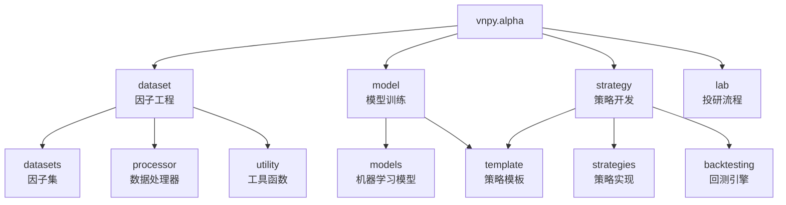
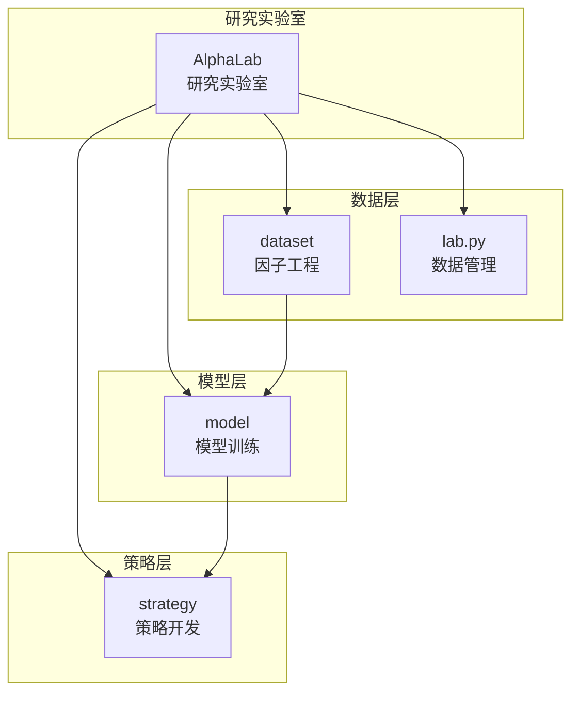
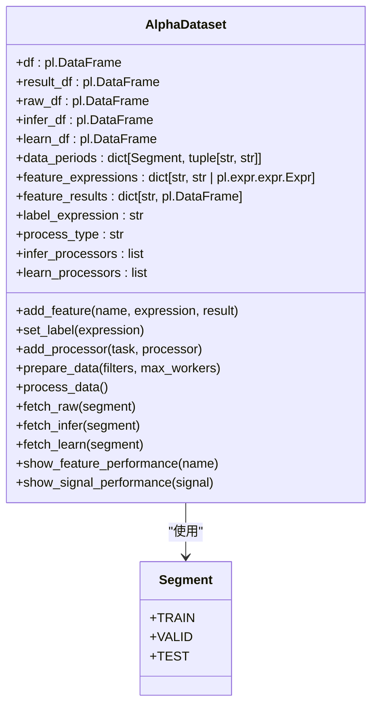
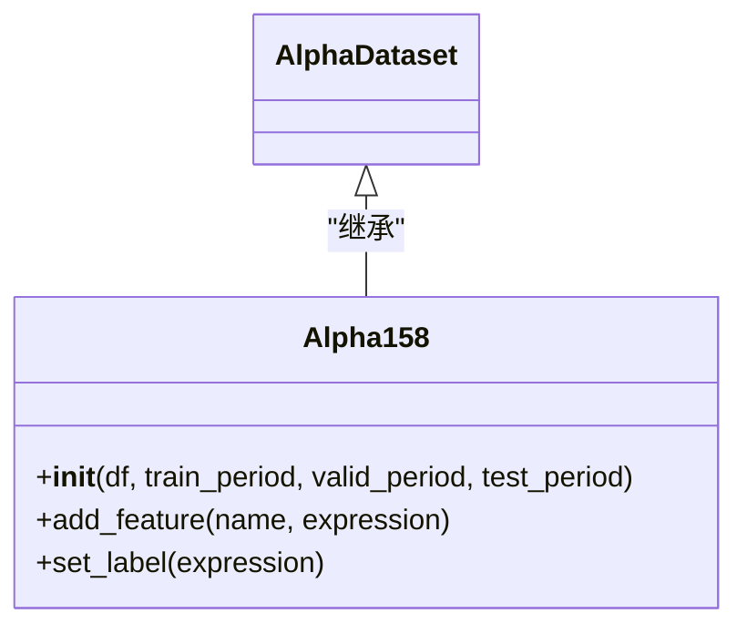
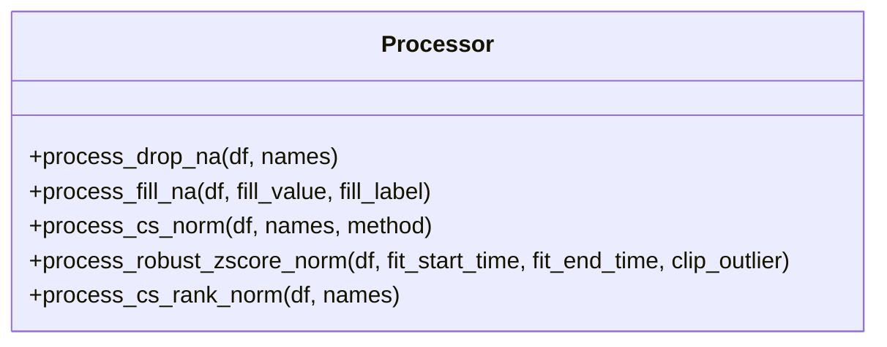
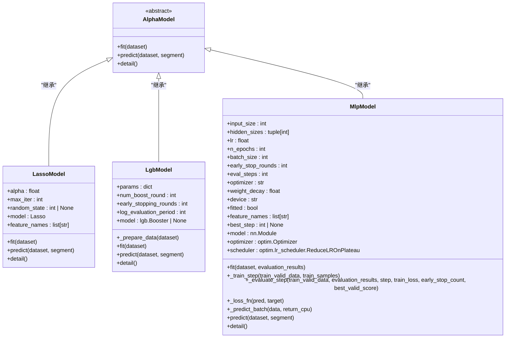
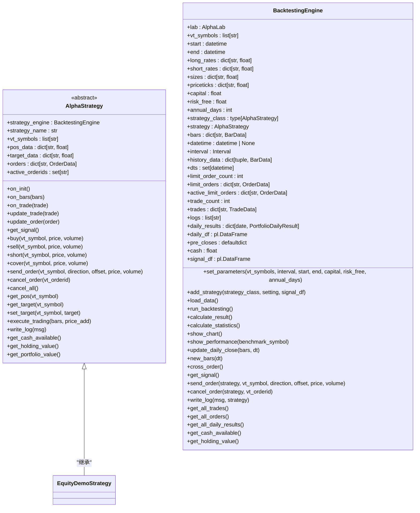
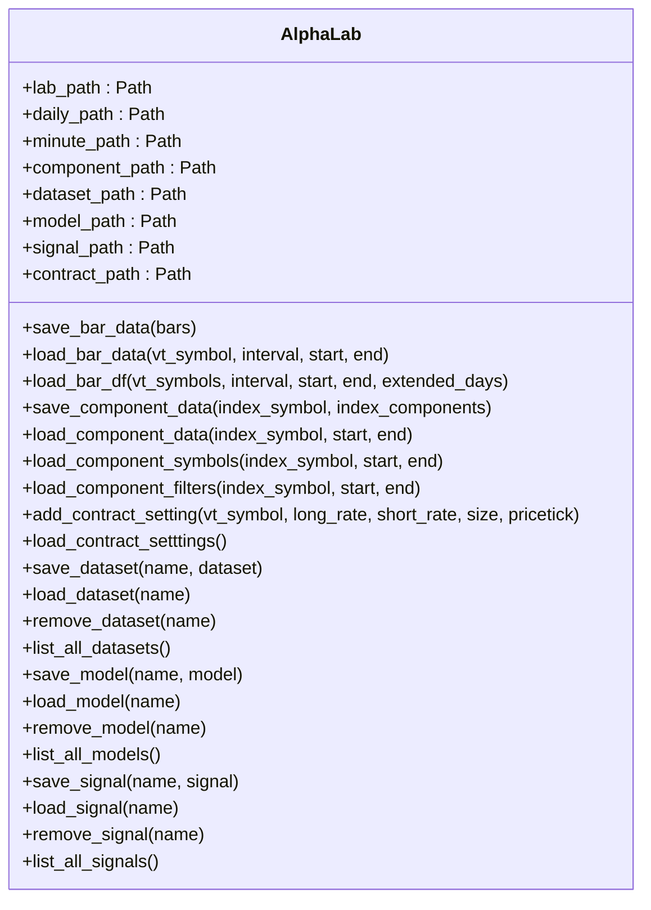
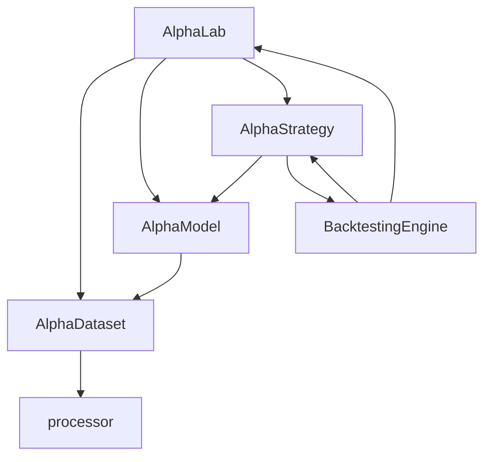

# AI量化研究

<cite>
**本文档引用文件**   
- [__init__.py](file://vnpy/alpha/__init__.py)
- [lab.py](file://vnpy/alpha/lab.py)
- [template.py](file://vnpy/alpha/dataset/template.py)
- [alpha_158.py](file://vnpy/alpha/dataset/datasets/alpha_158.py)
- [processor.py](file://vnpy/alpha/dataset/processor.py)
- [lasso_model.py](file://vnpy/alpha/model/models/lasso_model.py)
- [lgb_model.py](file://vnpy/alpha/model/models/lgb_model.py)
- [mlp_model.py](file://vnpy/alpha/model/models/mlp_model.py)
- [backtesting.py](file://vnpy/alpha/strategy/backtesting.py)
- [equity_demo_strategy.py](file://vnpy/alpha/strategy/strategies/equity_demo_strategy.py)
- [download_data_rq.ipynb](file://examples/alpha_research/download_data_rq.ipynb)
</cite>

## 目录
1. [引言](#引言)
2. [项目结构](#项目结构)
3. [核心组件](#核心组件)
4. [架构概述](#架构概述)
5. [详细组件分析](#详细组件分析)
6. [依赖分析](#依赖分析)
7. [性能考量](#性能考量)
8. [故障排除指南](#故障排除指南)
9. [结论](#结论)

## 引言
vnpy.alpha模块是vn.py框架中专为AI驱动量化研究设计的核心组件，提供了一套完整的机器学习量化研究工作流。该模块系统性地整合了因子工程、模型训练、策略开发和研究实验室四大功能，形成了从数据到策略的端到端解决方案。通过Alpha 158因子集、多种机器学习模型和自动化研究流水线，研究人员可以高效地进行量化因子挖掘、模型训练和策略回测，为构建智能交易系统提供了强大的技术支持。

## 项目结构
vnpy.alpha模块采用清晰的分层架构，将不同功能模块分离，便于维护和扩展。模块主要由dataset（因子工程）、model（模型训练）、strategy（策略开发）和lab（投研流程）四个子模块组成，每个子模块都有明确的职责和接口。

**图表来源**
- [__init__.py](file://vnpy/alpha/__init__.py)

**章节来源**
- [__init__.py](file://vnpy/alpha/__init__.py)

## 核心组件
vnpy.alpha模块的核心组件包括AlphaDataset、AlphaModel、AlphaStrategy和AlphaLab，分别对应因子工程、模型训练、策略开发和研究实验室四个主要功能。这些组件通过清晰的接口相互协作，形成了一个完整的AI量化研究生态系统。

**章节来源**
- [__init__.py](file://vnpy/alpha/__init__.py)

## 架构概述
vnpy.alpha模块的架构设计遵循了模块化和分层的原则，将复杂的量化研究流程分解为可管理的组件。整个系统以AlphaLab为核心协调器，管理数据、模型和策略的生命周期。

**图表来源**
- [__init__.py](file://vnpy/alpha/__init__.py)
- [lab.py](file://vnpy/alpha/lab.py)

**章节来源**
- [__init__.py](file://vnpy/alpha/__init__.py)
- [lab.py](file://vnpy/alpha/lab.py)

## 详细组件分析

### 因子工程分析
因子工程模块负责量化因子的生成、处理和管理，是AI量化研究的基础。该模块通过AlphaDataset类提供了一套完整的因子工程解决方案，支持因子表达式计算、数据预处理和性能分析。

#### 因子工程类分析

**图表来源**
- [template.py](file://vnpy/alpha/dataset/template.py)

**章节来源**
- [template.py](file://vnpy/alpha/dataset/template.py)

### Alpha 158因子集实现
Alpha 158因子集是基于Qlib框架的158个基础因子实现，涵盖了K线形态、价格变化、时间序列等多个维度的因子。该因子集通过继承AlphaDataset类实现，预定义了158个因子的计算表达式。

**图表来源**
- [alpha_158.py](file://vnpy/alpha/dataset/datasets/alpha_158.py)

**章节来源**
- [alpha_158.py](file://vnpy/alpha/dataset/datasets/alpha_158.py)

### 因子数据处理器
因子数据处理器模块提供了一系列数据预处理函数，用于处理缺失值、填充数据和标准化等操作。这些处理器可以作为预处理步骤添加到AlphaDataset中，确保数据质量。

**图表来源**
- [processor.py](file://vnpy/alpha/dataset/processor.py)

**章节来源**
- [processor.py](file://vnpy/alpha/dataset/processor.py)

### 模型训练分析
模型训练模块提供了多种机器学习算法的实现，包括Lasso回归、LightGBM和多层感知机（MLP）。这些模型都继承自AlphaModel基类，遵循统一的接口规范。

#### 模型训练类分析

**图表来源**
- [template.py](file://vnpy/alpha/model/template.py)
- [lasso_model.py](file://vnpy/alpha/model/models/lasso_model.py)
- [lgb_model.py](file://vnpy/alpha/model/models/lgb_model.py)
- [mlp_model.py](file://vnpy/alpha/model/models/mlp_model.py)

**章节来源**
- [template.py](file://vnpy/alpha/model/template.py)
- [lasso_model.py](file://vnpy/alpha/model/models/lasso_model.py)
- [lgb_model.py](file://vnpy/alpha/model/models/lgb_model.py)
- [mlp_model.py](file://vnpy/alpha/model/models/mlp_model.py)

### 策略开发分析
策略开发模块提供了策略模板和回测引擎，支持基于机器学习模型预测信号的量化策略开发。该模块通过AlphaStrategy基类和BacktestingEngine回测引擎实现了策略的标准化开发和测试。

#### 策略开发类分析

**图表来源**
- [template.py](file://vnpy/alpha/strategy/template.py)
- [backtesting.py](file://vnpy/alpha/strategy/backtesting.py)
- [equity_demo_strategy.py](file://vnpy/alpha/strategy/strategies/equity_demo_strategy.py)

**章节来源**
- [template.py](file://vnpy/alpha/strategy/template.py)
- [backtesting.py](file://vnpy/alpha/strategy/backtesting.py)
- [equity_demo_strategy.py](file://vnpy/alpha/strategy/strategies/equity_demo_strategy.py)

### 投研流程分析
投研流程模块通过AlphaLab类提供了一个集成的研究环境，统一管理数据、模型和策略的生命周期。该模块支持数据存储、模型保存、信号生成和研究结果管理，实现了自动化研究流水线。

#### 投研流程类分析

**图表来源**
- [lab.py](file://vnpy/alpha/lab.py)

**章节来源**
- [lab.py](file://vnpy/alpha/lab.py)

## 依赖分析
vnpy.alpha模块的依赖关系清晰，各组件之间通过明确定义的接口进行交互。核心依赖关系包括AlphaLab对其他模块的依赖，以及各模块内部组件的依赖。

**图表来源**
- [__init__.py](file://vnpy/alpha/__init__.py)
- [lab.py](file://vnpy/alpha/lab.py)
- [template.py](file://vnpy/alpha/dataset/template.py)
- [processor.py](file://vnpy/alpha/dataset/processor.py)

**章节来源**
- [__init__.py](file://vnpy/alpha/__init__.py)
- [lab.py](file://vnpy/alpha/lab.py)
- [template.py](file://vnpy/alpha/dataset/template.py)
- [processor.py](file://vnpy/alpha/dataset/processor.py)

## 性能考量
vnpy.alpha模块在设计时充分考虑了性能因素，特别是在大规模数据处理和模型训练方面。模块采用了Polars作为主要的数据处理库，利用其高效的列式存储和并行计算能力。在因子计算方面，通过multiprocessing.Pool实现了并行计算，显著提升了计算效率。对于机器学习模型，模块支持GPU加速（如MLP模型的device参数），并实现了早停机制和学习率调度，优化了训练过程。

## 故障排除指南
在使用vnpy.alpha模块时，可能会遇到一些常见问题。以下是一些故障排除建议：

1. **数据加载失败**：检查数据文件路径和格式是否正确，确保数据文件存在且可读。
2. **模型训练失败**：检查训练数据是否存在缺失值或异常值，确保数据预处理步骤正确执行。
3. **回测结果异常**：检查策略逻辑是否正确，确保交易成本和滑点设置合理。
4. **内存不足**：对于大规模数据处理，考虑使用数据分块处理或增加系统内存。
5. **性能瓶颈**：利用模块的并行计算功能，合理设置max_workers参数以充分利用多核CPU。

**章节来源**
- [lab.py](file://vnpy/alpha/lab.py)
- [template.py](file://vnpy/alpha/dataset/template.py)
- [backtesting.py](file://vnpy/alpha/strategy/backtesting.py)

## 结论
vnpy.alpha模块为AI驱动的量化研究提供了一个强大而灵活的框架。通过系统化的因子工程、多样化的机器学习模型、标准化的策略开发和集成化的研究环境，研究人员可以高效地进行量化因子挖掘、模型训练和策略回测。该模块的设计充分考虑了实际研究需求，提供了从数据到策略的完整解决方案，为构建智能交易系统奠定了坚实的基础。未来，该模块可以进一步扩展支持更多类型的机器学习算法、更复杂的策略模式和更丰富的性能分析工具，持续提升量化研究的效率和效果。