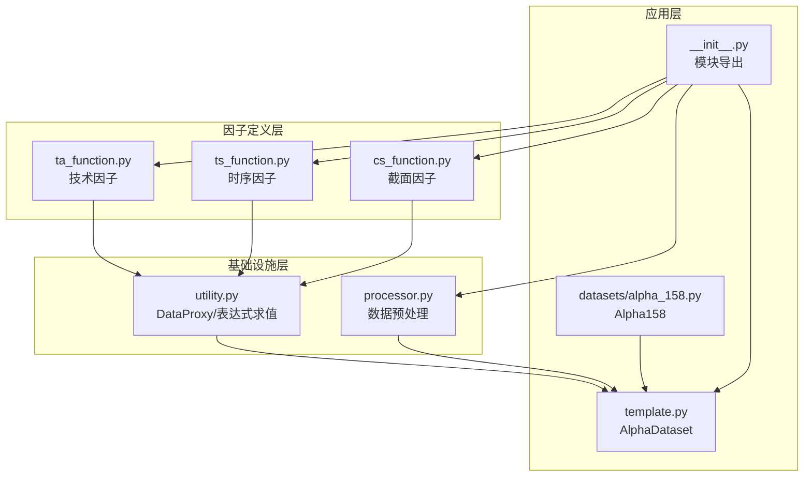
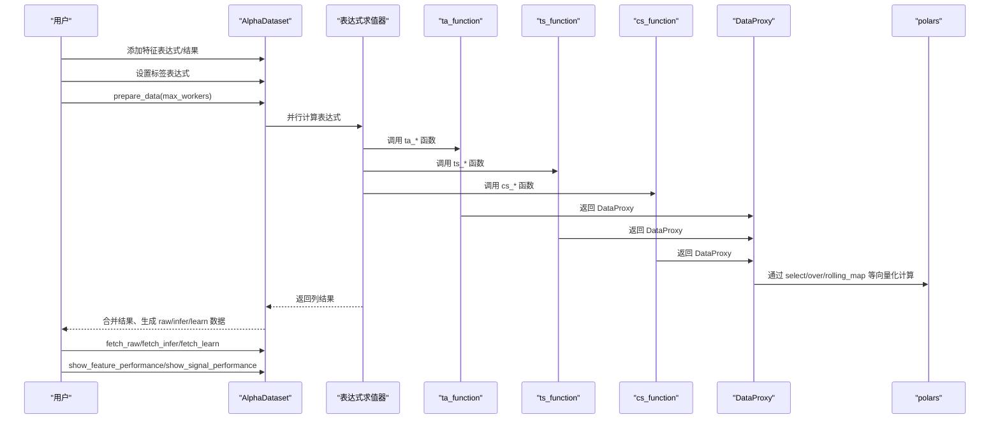
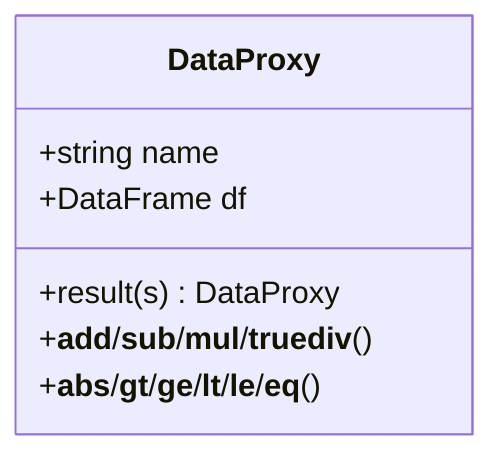
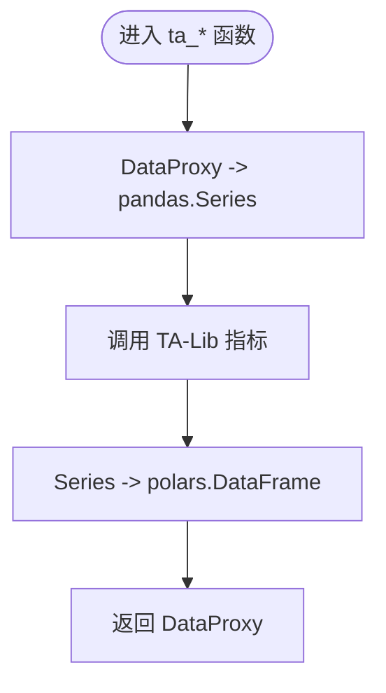
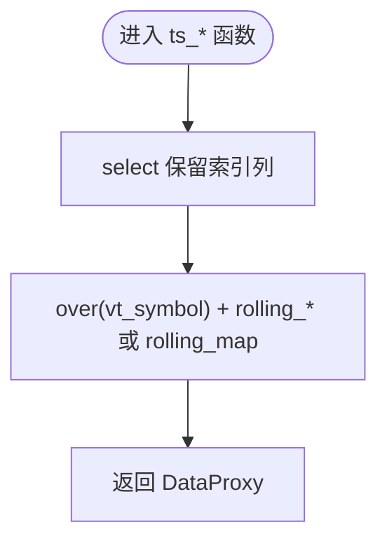
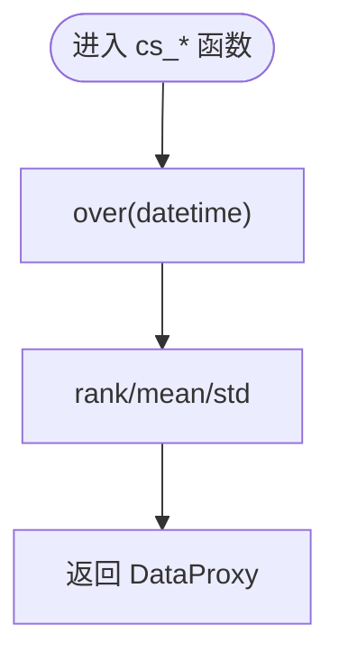
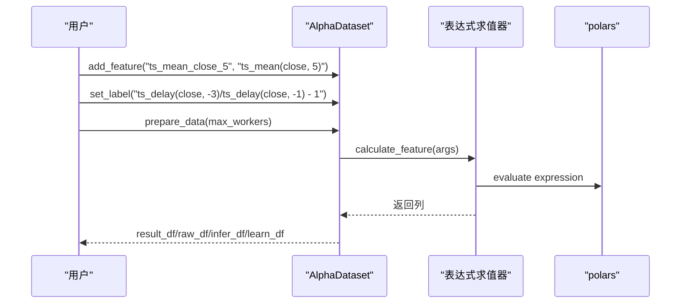
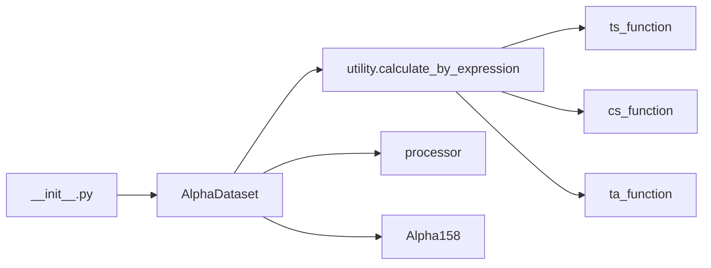

# 因子定义

<cite>
**本文引用的文件**
- [vnpy/alpha/dataset/__init__.py](file://vnpy/alpha/dataset/__init__.py)
- [vnpy/alpha/dataset/template.py](file://vnpy/alpha/dataset/template.py)
- [vnpy/alpha/dataset/utility.py](file://vnpy/alpha/dataset/utility.py)
- [vnpy/alpha/dataset/ta_function.py](file://vnpy/alpha/dataset/ta_function.py)
- [vnpy/alpha/dataset/ts_function.py](file://vnpy/alpha/dataset/ts_function.py)
- [vnpy/alpha/dataset/cs_function.py](file://vnpy/alpha/dataset/cs_function.py)
- [vnpy/alpha/dataset/processor.py](file://vnpy/alpha/dataset/processor.py)
- [vnpy/alpha/dataset/datasets/alpha_158.py](file://vnpy/alpha/dataset/datasets/alpha_158.py)
</cite>

## 目录
1. [简介](#简介)
2. [项目结构](#项目结构)
3. [核心组件](#核心组件)
4. [架构总览](#架构总览)
5. [详细组件分析](#详细组件分析)
6. [依赖关系分析](#依赖关系分析)
7. [性能考量](#性能考量)
8. [故障排查指南](#故障排查指南)
9. [结论](#结论)
10. [附录](#附录)

## 简介
本文件系统性地文档化 vnpy.alpha.dataset 中的因子定义机制，覆盖三类核心因子：
- 技术因子（ta_function）：基于 TA-Lib 的指标计算，如 RSI、ATR
- 时序因子（ts_function）：基于滚动窗口的时间序列统计与变换，如 ts_mean、ts_rank、ts_corr
- 截面因子（cs_function）：按时间点对股票截面进行标准化与排名，如 cs_rank、cs_mean

文档重点说明：
- 各因子函数的输入输出结构、计算逻辑与应用场景
- 如何通过 AlphaDataset 类注册并调用 ta_rsi、ts_mean、cs_rank 等典型因子
- 因子函数如何基于 DataProxy 封装数据流，并利用 polars 进行高效向量化计算
- Alpha 158 因子集的分类归属与组合逻辑
- 扩展自定义因子的方法与兼容性要求
- 性能优化建议（窗口参数、避免冗余计算、内存控制）

## 项目结构
该模块围绕 AlphaDataset 模板类构建，提供统一的数据准备、特征计算、后处理与分段取数能力；同时通过 DataProxy 对 polars DataFrame 进行轻量封装，支持表达式风格的链式运算与类型安全的窗口化操作。

图表来源
- [vnpy/alpha/dataset/__init__.py](file://vnpy/alpha/dataset/__init__.py#L1-L22)
- [vnpy/alpha/dataset/template.py](file://vnpy/alpha/dataset/template.py#L23-L304)
- [vnpy/alpha/dataset/utility.py](file://vnpy/alpha/dataset/utility.py#L1-L183)
- [vnpy/alpha/dataset/ta_function.py](file://vnpy/alpha/dataset/ta_function.py#L1-L43)
- [vnpy/alpha/dataset/ts_function.py](file://vnpy/alpha/dataset/ts_function.py#L1-L227)
- [vnpy/alpha/dataset/cs_function.py](file://vnpy/alpha/dataset/cs_function.py#L1-L38)
- [vnpy/alpha/dataset/processor.py](file://vnpy/alpha/dataset/processor.py#L1-L126)
- [vnpy/alpha/dataset/datasets/alpha_158.py](file://vnpy/alpha/dataset/datasets/alpha_158.py#L1-L131)

章节来源
- [vnpy/alpha/dataset/__init__.py](file://vnpy/alpha/dataset/__init__.py#L1-L22)

## 核心组件
- AlphaDataset：统一管理特征表达式、标签、数据准备、并行计算、分段取数与性能分析
- DataProxy：对单列“data”的 DataFrame 进行封装，提供算子重载与跨 DataFrame 合并能力
- 表达式求值器：支持字符串表达式与 Polars Expr 两种方式，自动注入 ts/cs/ta 函数与基础特征列
- 预处理处理器：提供缺失值处理、截面归一化、稳健 Z-Score 归一化、截面秩归一化等

章节来源
- [vnpy/alpha/dataset/template.py](file://vnpy/alpha/dataset/template.py#L23-L304)
- [vnpy/alpha/dataset/utility.py](file://vnpy/alpha/dataset/utility.py#L1-L183)
- [vnpy/alpha/dataset/processor.py](file://vnpy/alpha/dataset/processor.py#L1-L126)

## 架构总览
下图展示了从数据准备到特征计算、再到分段取数与性能分析的整体流程。

图表来源
- [vnpy/alpha/dataset/template.py](file://vnpy/alpha/dataset/template.py#L90-L171)
- [vnpy/alpha/dataset/utility.py](file://vnpy/alpha/dataset/utility.py#L111-L162)
- [vnpy/alpha/dataset/ta_function.py](file://vnpy/alpha/dataset/ta_function.py#L23-L43)
- [vnpy/alpha/dataset/ts_function.py](file://vnpy/alpha/dataset/ts_function.py#L14-L227)
- [vnpy/alpha/dataset/cs_function.py](file://vnpy/alpha/dataset/cs_function.py#L10-L38)

## 详细组件分析

### DataProxy 数据代理
DataProxy 将单列“data”的 DataFrame 包装为可运算对象，提供：
- 列名规范化与索引保留（datetime、vt_symbol）
- 算子重载（加减乘除、比较、绝对值）
- result 方法用于将 Series 结果重新包装为 DataProxy
- 与 Polars 的 over 分组、rolling_map 等原语配合，实现高效的向量化计算

图表来源
- [vnpy/alpha/dataset/utility.py](file://vnpy/alpha/dataset/utility.py#L8-L110)

章节来源
- [vnpy/alpha/dataset/utility.py](file://vnpy/alpha/dataset/utility.py#L1-L183)

### 技术因子（ta_function）
- 输入：DataProxy（内部包含“data”列），窗口参数 window
- 输出：DataProxy（封装计算结果）
- 计算逻辑：将 DataProxy 转换为 pandas Series，调用 TA-Lib 计算指标，再转回 polars DataFrame
- 典型因子：
  - ta_rsi：按合约维度计算 RSI
  - ta_atr：按合约维度计算 ATR

图表来源
- [vnpy/alpha/dataset/ta_function.py](file://vnpy/alpha/dataset/ta_function.py#L12-L43)

章节来源
- [vnpy/alpha/dataset/ta_function.py](file://vnpy/alpha/dataset/ta_function.py#L1-L43)

### 时序因子（ts_function）
- 输入：DataProxy，窗口参数 window；部分函数还接受另一个 DataProxy 或数值常量
- 输出：DataProxy
- 计算逻辑：基于 polars 的 over 分组与 rolling_map/rolling_* 等原语，实现按 vt_symbol 分组的滚动窗口计算
- 典型因子：
  - ts_delay：固定时滞
  - ts_min/ts_max：滚动极值
  - ts_argmax/ts_argmin：滚动极值位置
  - ts_rank：滚动百分位排名
  - ts_sum/ts_mean/ts_std：滚动求和/均值/标准差
  - ts_slope/ts_rsquare/ts_resi：滚动线性回归斜率/R²/残差
  - ts_corr：滚动相关系数
  - ts_less/ts_greater：逐元素最小/最大（支持与另一特征或常量比较）
  - ts_log/ts_abs：逐元素变换

图表来源
- [vnpy/alpha/dataset/ts_function.py](file://vnpy/alpha/dataset/ts_function.py#L14-L227)

章节来源
- [vnpy/alpha/dataset/ts_function.py](file://vnpy/alpha/dataset/ts_function.py#L1-L227)

### 截面因子（cs_function）
- 输入：DataProxy
- 输出：DataProxy
- 计算逻辑：基于 datetime 分组，对同一时间点的所有股票进行排序/统计
- 典型因子：
  - cs_rank：按日期对“data”进行排名
  - cs_mean/cs_std：按日期对“data”进行均值/标准差

图表来源
- [vnpy/alpha/dataset/cs_function.py](file://vnpy/alpha/dataset/cs_function.py#L10-L38)

章节来源
- [vnpy/alpha/dataset/cs_function.py](file://vnpy/alpha/dataset/cs_function.py#L1-L38)

### AlphaDataset 注册与调用流程
- 注册特征：add_feature(name, expression 或 result)
- 注册标签：set_label(expression)
- 计算准备：prepare_data 并行执行表达式，支持字符串表达式与 Polars Expr
- 分段取数：fetch_raw/fetch_infer/fetch_learn
- 性能分析：show_feature_performance/show_signal_performance

图表来源
- [vnpy/alpha/dataset/template.py](file://vnpy/alpha/dataset/template.py#L58-L126)
- [vnpy/alpha/dataset/utility.py](file://vnpy/alpha/dataset/utility.py#L111-L162)

章节来源
- [vnpy/alpha/dataset/template.py](file://vnpy/alpha/dataset/template.py#L58-L126)
- [vnpy/alpha/dataset/utility.py](file://vnpy/alpha/dataset/utility.py#L111-L162)

### Alpha 158 因子集的分类与组合
Alpha158 继承自 AlphaDataset，通过 add_feature 注入大量经典因子，涵盖：
- K 线形态特征（如 kmid、klen、kup、klow、ksft 等）
- 价格相对特征（如字段除以 close 的比值）
- 时间序列特征（如 ROC、MA、STD、BETA、RSQR、RESI、MAX/MIN、分位数、排名、RSV、极值位置、相关性、涨跌计数、成交量相关统计等）
- 标签（未来收益）：使用 ts_delay 构造未来相对收益

这些因子既可作为独立特征，也可组合成更复杂的表达式，满足不同研究场景。

章节来源
- [vnpy/alpha/dataset/datasets/alpha_158.py](file://vnpy/alpha/dataset/datasets/alpha_158.py#L1-L131)

## 依赖关系分析
- 模块导出：__init__.py 将 AlphaDataset、Segment、to_datetime 以及各类处理器导出，便于外部直接使用
- 表达式注入：utility.calculate_by_expression 在本地作用域动态导入 ts/cs/ta 函数，并将基础特征列转换为 DataProxy，从而支持字符串表达式
- 并行计算：template.prepare_data 使用多进程池并行计算所有表达式，提升大规模数据处理效率
- 数据流：DataProxy 与 polars over/rolling_map 等原语紧密耦合，确保每一步计算都在分组维度内完成，避免跨组污染

图表来源
- [vnpy/alpha/dataset/__init__.py](file://vnpy/alpha/dataset/__init__.py#L1-L22)
- [vnpy/alpha/dataset/utility.py](file://vnpy/alpha/dataset/utility.py#L111-L162)
- [vnpy/alpha/dataset/template.py](file://vnpy/alpha/dataset/template.py#L90-L126)

章节来源
- [vnpy/alpha/dataset/__init__.py](file://vnpy/alpha/dataset/__init__.py#L1-L22)
- [vnpy/alpha/dataset/utility.py](file://vnpy/alpha/dataset/utility.py#L111-L162)
- [vnpy/alpha/dataset/template.py](file://vnpy/alpha/dataset/template.py#L90-L126)

## 性能考量
- 窗口参数设置
  - 滚动窗口越大，计算复杂度越高且内存占用增加。建议根据数据频率与信号稳定性选择合适窗口（如 5/10/20/30/60）
  - 对于 ts_corr 等需要两列对齐的计算，注意 join 后的 NaN 处理与无穷值过滤
- 避免冗余计算
  - 使用 DataProxy 的链式运算，尽量在一次 over 分组内完成多步变换，减少中间 DataFrame 的创建
  - 对于重复出现的窗口统计（如均值/标准差），优先复用已有的 DataProxy，避免重复扫描
- 内存使用控制
  - 使用 calculate_by_polars 的 Expr 方式可借助 polars 的惰性执行特性，降低中间物化开销
  - 在 prepare_data 中合理设置 max_workers，避免 CPU/内存资源争用
  - 对于大数据集，考虑分批处理或使用 process_cs_norm/process_robust_zscore_norm 等处理器进行截面归一化，减少后续计算波动
- I/O 与并行
  - prepare_data 已内置多进程并行，建议在高核 CPU 上充分利用；同时注意进程间数据传输成本

[本节为通用性能建议，不直接分析具体文件]

## 故障排查指南
- 表达式语法错误
  - 字符串表达式需确保变量名与基础特征列一致，且函数名正确拼写
  - 注意 ts_*、cs_*、ta_* 函数的参数顺序与类型
- NaN 与无穷值
  - ts_corr 在计算相关系数时会过滤无穷值，但建议在上游对极端值进行裁剪或填充
  - 使用 process_fill_na/process_drop_na 控制缺失值策略
- 截面归一化异常
  - process_cs_norm 在无方差时可能产生 NaN，需结合 clip 或替换策略
  - process_robust_zscore_norm 使用中位数与 MAD，注意训练期窗口的选择
- 分段取数范围
  - 使用 query_by_time 或 fetch_* 时，确保时间范围与数据实际覆盖范围一致

章节来源
- [vnpy/alpha/dataset/processor.py](file://vnpy/alpha/dataset/processor.py#L1-L126)
- [vnpy/alpha/dataset/template.py](file://vnpy/alpha/dataset/template.py#L272-L285)

## 结论
vnpy.alpha.dataset 通过 DataProxy 与 polars 的强耦合，提供了简洁而强大的因子定义与计算框架。技术、时序与截面三类因子分别覆盖了市场微观结构、时间序列行为与跨资产分布的关键特征。AlphaDataset 统一了特征注册、并行计算、数据分段与性能分析流程，Alpha158 则给出了丰富的因子组合范式。遵循本文的窗口参数设置、避免冗余计算与内存控制建议，可在保证精度的同时显著提升运行效率。

[本节为总结性内容，不直接分析具体文件]

## 附录

### 如何注册并调用 ta_rsi、ts_mean、cs_rank
- 通过字符串表达式注册（推荐用于快速组合）
  - 示例路径：[添加特征表达式](file://vnpy/alpha/dataset/datasets/alpha_158.py#L43-L47)
- 通过 Polars Expr 注册（适合复杂逻辑与惰性执行）
  - 示例路径：[表达式求值（Expr）](file://vnpy/alpha/dataset/utility.py#L155-L162)
- 直接调用函数（适合自定义扩展）
  - 示例路径：[ta_rsi](file://vnpy/alpha/dataset/ta_function.py#L23-L31)，[ts_mean](file://vnpy/alpha/dataset/ts_function.py#L84-L91)，[cs_rank](file://vnpy/alpha/dataset/cs_function.py#L10-L17)

### Alpha 158 因子分类与组合要点
- K 线形态：基于开盘/最高/最低/收盘构造相对幅度与位置特征
- 价格相对：将字段除以 close，消除价格尺度影响
- 时间序列：涵盖 ROC、MA、STD、BETA、RSQR、RESI、MAX/MIN、分位数、排名、RSV、极值位置、相关性、涨跌计数、成交量相关统计等
- 标签：使用 ts_delay 构造未来相对收益，作为监督学习目标

章节来源
- [vnpy/alpha/dataset/datasets/alpha_158.py](file://vnpy/alpha/dataset/datasets/alpha_158.py#L24-L131)