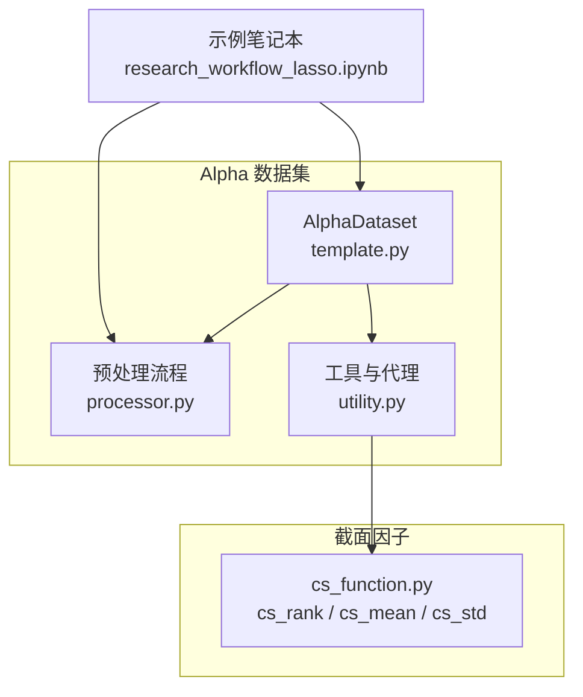
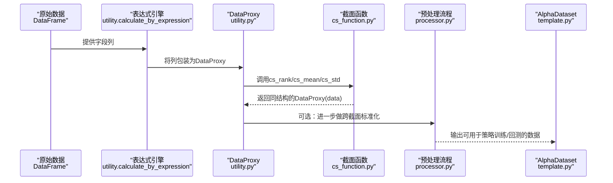
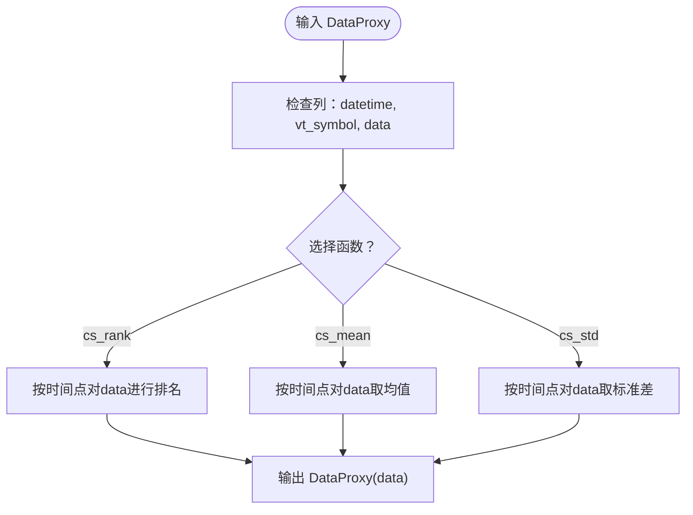
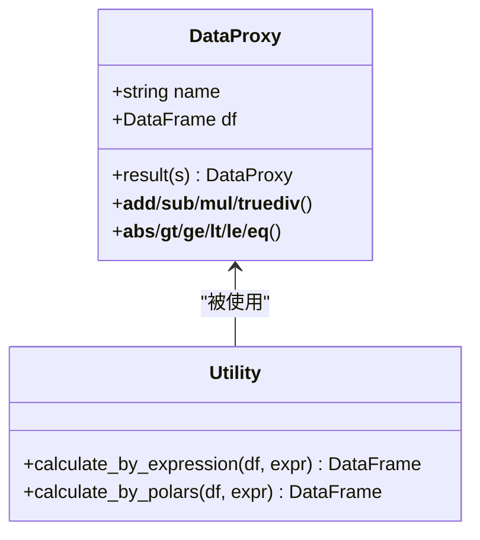
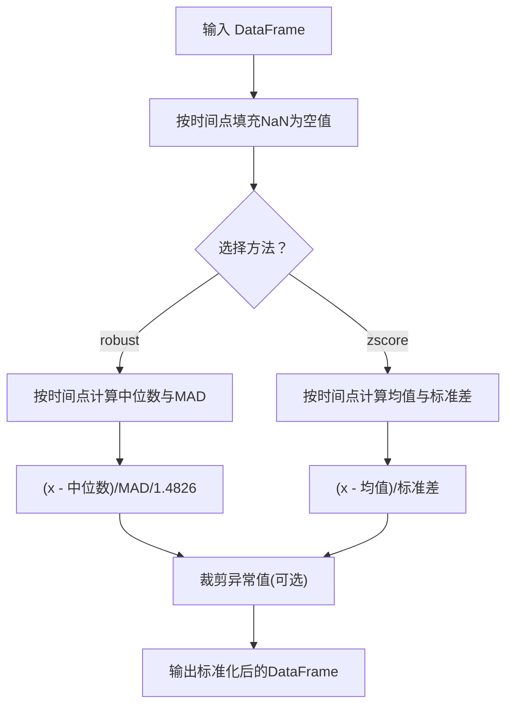
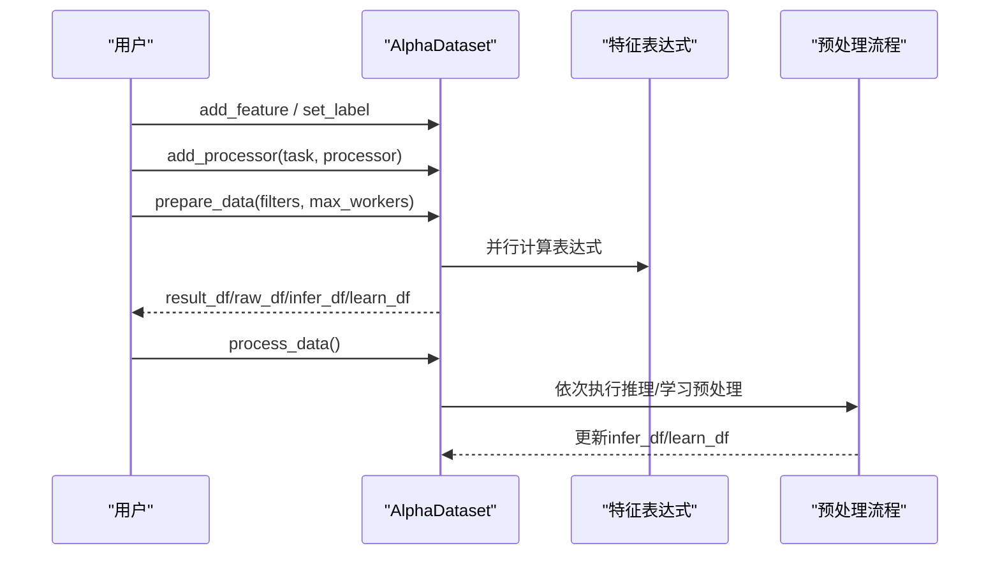
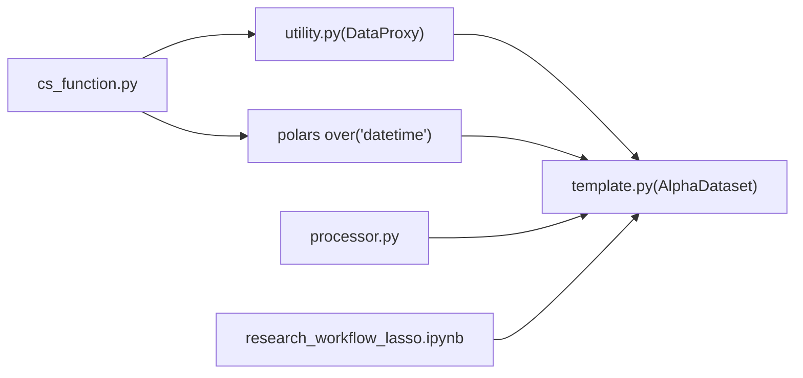

# 截面因子

<cite>
**本文引用的文件列表**
- [cs_function.py](file://vnpy/alpha/dataset/cs_function.py)
- [utility.py](file://vnpy/alpha/dataset/utility.py)
- [processor.py](file://vnpy/alpha/dataset/processor.py)
- [template.py](file://vnpy/alpha/dataset/template.py)
- [research_workflow_lasso.ipynb](file://examples/alpha_research/research_workflow_lasso.ipynb)
</cite>

## 目录
1. [引言](#引言)
2. [项目结构](#项目结构)
3. [核心组件](#核心组件)
4. [架构总览](#架构总览)
5. [详细组件分析](#详细组件分析)
6. [依赖关系分析](#依赖关系分析)
7. [性能考量](#性能考量)
8. [故障排查指南](#故障排查指南)
9. [结论](#结论)
10. [附录](#附录)

## 引言
本文件聚焦于vnpy.alpha.dataset.cs_function模块中的截面因子实现机制，系统阐述跨资产横向比较的计算逻辑。重点解析cs_rank、cs_mean、cs_std三个函数如何在相同时间点上对不同合约（vt_symbol）的数据进行归一化处理与统计分析；深入说明其基于polars的over('datetime')分组计算技术；并展示截面排序在构建多空组合策略中的核心作用。同时结合实际策略案例，解释截面标准化如何消除不同资产间的量纲差异，并给出在因子组合中有效利用截面信息的最佳实践。

## 项目结构
围绕截面因子的相关文件主要位于vnpy/alpha/dataset目录下，关键文件包括：
- cs_function.py：定义截面运算函数（cs_rank、cs_mean、cs_std），基于DataProxy封装与polars over('datetime')分组计算。
- utility.py：提供DataProxy数据代理类、表达式求值工具、Polars表达式执行器等。
- processor.py：提供多种数据预处理流程，包括跨截面标准化（process_cs_norm、process_cs_rank_norm）、缺失值处理等。
- template.py：AlphaDataset模板类，负责特征表达式计算、数据准备与处理流水线。
- research_workflow_lasso.ipynb：示例笔记本，演示如何加载数据、创建AlphaDataset并使用预处理流程。

图表来源
- [template.py](file://vnpy/alpha/dataset/template.py#L1-L120)
- [processor.py](file://vnpy/alpha/dataset/processor.py#L1-L126)
- [utility.py](file://vnpy/alpha/dataset/utility.py#L1-L183)
- [cs_function.py](file://vnpy/alpha/dataset/cs_function.py#L1-L38)
- [research_workflow_lasso.ipynb](file://examples/alpha_research/research_workflow_lasso.ipynb#L1-L200)

章节来源
- [cs_function.py](file://vnpy/alpha/dataset/cs_function.py#L1-L38)
- [utility.py](file://vnpy/alpha/dataset/utility.py#L1-L183)
- [processor.py](file://vnpy/alpha/dataset/processor.py#L1-L126)
- [template.py](file://vnpy/alpha/dataset/template.py#L1-L120)
- [research_workflow_lasso.ipynb](file://examples/alpha_research/research_workflow_lasso.ipynb#L1-L200)

## 核心组件
- 截面函数（cs_function.py）
  - cs_rank：对每个时间点内的数据进行排名，返回相对排序位置。
  - cs_mean：对每个时间点内的数据计算均值，作为截面中心化参考。
  - cs_std：对每个时间点内的数据计算标准差，作为截面离散度参考。
- 数据代理（utility.py）
  - DataProxy：封装DataFrame，提供算子重载与链式表达式能力，便于在表达式中直接使用。
  - calculate_by_expression：在表达式空间内动态注入DataProxy变量，支持cs_function与ts_function等模块的函数调用。
  - calculate_by_polars：直接执行Polars表达式，生成包含datetime、vt_symbol与data列的结果。
- 预处理流程（processor.py）
  - process_cs_norm：跨截面标准化（robust或zscore），按时间点对各资产进行去中心化与缩放。
  - process_cs_rank_norm：跨截面秩标准化，将每个时间点的观测转换为0-1区间并中心化。
- 数据集模板（template.py）
  - AlphaDataset：统一管理特征表达式、标签表达式、数据准备与处理流水线，支持多进程并行计算特征。

章节来源
- [cs_function.py](file://vnpy/alpha/dataset/cs_function.py#L1-L38)
- [utility.py](file://vnpy/alpha/dataset/utility.py#L1-L183)
- [processor.py](file://vnpy/alpha/dataset/processor.py#L1-L126)
- [template.py](file://vnpy/alpha/dataset/template.py#L1-L120)

## 架构总览
下图展示了从数据到特征再到预处理的整体流程，突出截面因子在跨资产横向比较中的作用。

图表来源
- [utility.py](file://vnpy/alpha/dataset/utility.py#L111-L162)
- [cs_function.py](file://vnpy/alpha/dataset/cs_function.py#L10-L37)
- [processor.py](file://vnpy/alpha/dataset/processor.py#L34-L126)
- [template.py](file://vnpy/alpha/dataset/template.py#L81-L120)

## 详细组件分析

### 截面函数：cs_rank、cs_mean、cs_std
- 设计要点
  - 输入：DataProxy对象，内部持有包含datetime、vt_symbol与data三列的DataFrame。
  - 计算方式：使用polars的over('datetime')在每个时间点内对同一组资产进行分组计算，确保跨资产横向可比性。
  - 输出：返回新的DataProxy，保留datetime与vt_symbol，并以data列承载截面统计结果。
- 典型用途
  - cs_rank：用于构建多空组合时，将各资产在当日的因子值映射到0-1区间，便于等权合成与择时。
  - cs_mean/cs_std：用于衡量当日各资产因子值的中心与离散程度，辅助异常值剔除与稳健化处理。

图表来源
- [cs_function.py](file://vnpy/alpha/dataset/cs_function.py#L10-L37)

章节来源
- [cs_function.py](file://vnpy/alpha/dataset/cs_function.py#L10-L37)

### 数据代理与表达式求值：DataProxy与calculate_by_expression
- DataProxy
  - 将任意列DataFrame重命名为data，便于统一处理。
  - 提供丰富的算子重载（加减乘除、比较、绝对值等），使表达式书写更直观。
- 表达式求值
  - 在evaluate前，将每列构造为DataProxy并注入本地命名空间，从而在字符串表达式中直接使用cs_rank、cs_mean、cs_std等函数。
  - 支持两种执行路径：字符串表达式（通过eval）与Polars表达式（直接select）。

图表来源
- [utility.py](file://vnpy/alpha/dataset/utility.py#L1-L183)

章节来源
- [utility.py](file://vnpy/alpha/dataset/utility.py#L1-L183)

### 预处理流程：跨截面标准化与秩标准化
- process_cs_norm
  - robust/zscore两种方法：均基于over('datetime')在时间维度上计算统计量，随后对各资产进行去中心化与缩放。
  - robust方法使用中位数与MAD，对异常值更稳健；zscore方法使用均值与标准差。
- process_cs_rank_norm
  - 对每个时间点的观测进行秩排名，归一化到0-1区间并中心化，常用于多空组合构建与信号稳定性提升。

图表来源
- [processor.py](file://vnpy/alpha/dataset/processor.py#L34-L126)

章节来源
- [processor.py](file://vnpy/alpha/dataset/processor.py#L34-L126)

### AlphaDataset模板：特征表达式与数据准备
- 特征表达式管理
  - add_feature支持两种方式：直接提供表达式字符串或直接传入已计算好的DataFrame结果。
  - prepare_data通过多进程并行计算所有表达式，最终合并到主表。
- 数据准备与过滤
  - 支持按时间段过滤与按vt_symbol范围筛选，保证训练/验证/测试阶段的数据一致性。
- 处理流水线
  - add_processor为推理与学习阶段分别注册预处理步骤，process_data依次执行。

图表来源
- [template.py](file://vnpy/alpha/dataset/template.py#L58-L120)
- [template.py](file://vnpy/alpha/dataset/template.py#L157-L192)

章节来源
- [template.py](file://vnpy/alpha/dataset/template.py#L58-L120)
- [template.py](file://vnpy/alpha/dataset/template.py#L157-L192)

## 依赖关系分析
- 截面函数依赖
  - cs_function依赖utility.DataProxy，用于统一的数据结构与算子重载。
  - 截面函数内部使用polars的rank、mean、std与over('datetime')实现跨资产横向比较。
- 表达式引擎
  - utility.calculate_by_expression在局部命名空间注入DataProxy变量，使字符串表达式可直接调用cs_function函数。
- 预处理流程
  - processor.py中的跨截面标准化与秩标准化同样依赖over('datetime')，确保在每个时间点内进行独立的统计变换。
- 数据集模板
  - template.py通过多进程并行计算特征表达式，最终将截面因子与原始特征合并，形成可用于策略研究的数据集。

图表来源
- [cs_function.py](file://vnpy/alpha/dataset/cs_function.py#L10-L37)
- [utility.py](file://vnpy/alpha/dataset/utility.py#L1-L183)
- [processor.py](file://vnpy/alpha/dataset/processor.py#L34-L126)
- [template.py](file://vnpy/alpha/dataset/template.py#L81-L120)
- [research_workflow_lasso.ipynb](file://examples/alpha_research/research_workflow_lasso.ipynb#L1-L200)

章节来源
- [cs_function.py](file://vnpy/alpha/dataset/cs_function.py#L10-L37)
- [utility.py](file://vnpy/alpha/dataset/utility.py#L1-L183)
- [processor.py](file://vnpy/alpha/dataset/processor.py#L34-L126)
- [template.py](file://vnpy/alpha/dataset/template.py#L81-L120)
- [research_workflow_lasso.ipynb](file://examples/alpha_research/research_workflow_lasso.ipynb#L1-L200)

## 性能考量
- 分组计算效率
  - 使用over('datetime')在时间维度上进行分组，避免显式循环与逐行遍历，充分利用polars向量化与窗口算子的高性能实现。
- 并行计算
  - AlphaDataset.prepare_data通过多进程池并行计算多个特征表达式，显著缩短大规模数据集的特征生成时间。
- 内存与列重命名
  - DataProxy将任意列重命名为data，减少中间DataFrame列数，降低内存占用与列合并成本。
- 缺失值处理
  - 预处理流程提供drop_na与fill_na，建议在特征表达式计算后尽早清理缺失值，避免后续统计计算的额外开销。

## 故障排查指南
- 截面函数返回列名不匹配
  - 确认输入DataProxy的DataFrame包含datetime、vt_symbol与data三列；cs_function内部会重命名data列，避免与原列冲突。
- 表达式求值失败
  - 检查表达式字符串中是否正确使用DataProxy变量名；utility.calculate_by_expression会在局部命名空间注入各列对应的DataProxy。
- 预处理后数据异常
  - robust标准化可能受极端值影响，建议先用process_cs_rank_norm进行秩标准化，再根据需要进行robust或zscore缩放。
- 多进程并行问题
  - 若特征表达式涉及外部状态或非幂等操作，需确保在多进程中可重复且无副作用；必要时拆分为纯函数式表达式。

章节来源
- [cs_function.py](file://vnpy/alpha/dataset/cs_function.py#L10-L37)
- [utility.py](file://vnpy/alpha/dataset/utility.py#L111-L162)
- [processor.py](file://vnpy/alpha/dataset/processor.py#L1-L126)
- [template.py](file://vnpy/alpha/dataset/template.py#L81-L120)

## 结论
vnpy.alpha.dataset.cs_function模块通过简洁的截面函数与强大的表达式引擎，实现了跨资产横向比较的高效计算。cs_rank、cs_mean、cs_std基于polars的over('datetime')分组计算，确保在相同时间点上对不同合约（vt_symbol）进行可比的归一化与统计分析。结合processor.py提供的跨截面标准化与AlphaDataset的流水线化处理，能够稳定地构建多空组合策略并进行回测评估。实践中建议优先采用秩标准化以增强稳健性，并在因子组合中合理融合截面统计量，以提升策略的跨市场适应性与收益稳定性。

## 附录
- 实际策略案例参考
  - 示例笔记本展示了如何加载数据、创建AlphaDataset并使用预处理流程，可作为构建多空组合策略的起点。
- 最佳实践
  - 在特征表达式中优先使用cs_rank进行等权合成，再结合cs_mean/cs_std进行稳健化处理。
  - 对于存在极端值的因子，建议先秩标准化，再进行robust或zscore缩放。
  - 使用AlphaDataset的add_processor为推理与学习阶段分别注册预处理步骤，确保训练与部署的一致性。

章节来源
- [research_workflow_lasso.ipynb](file://examples/alpha_research/research_workflow_lasso.ipynb#L1-L200)