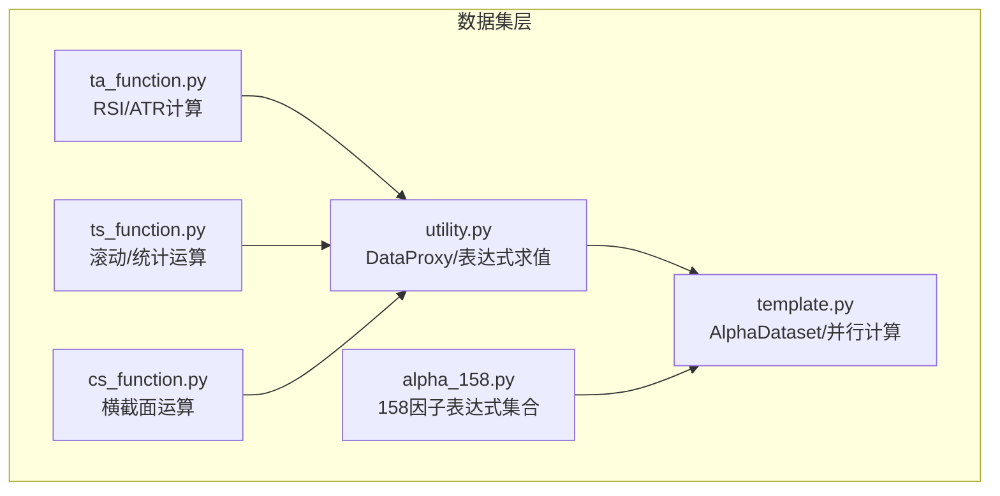
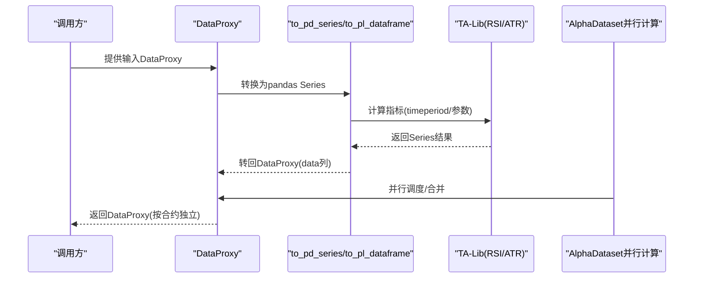
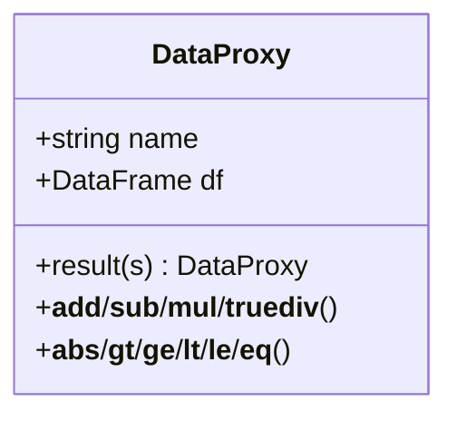
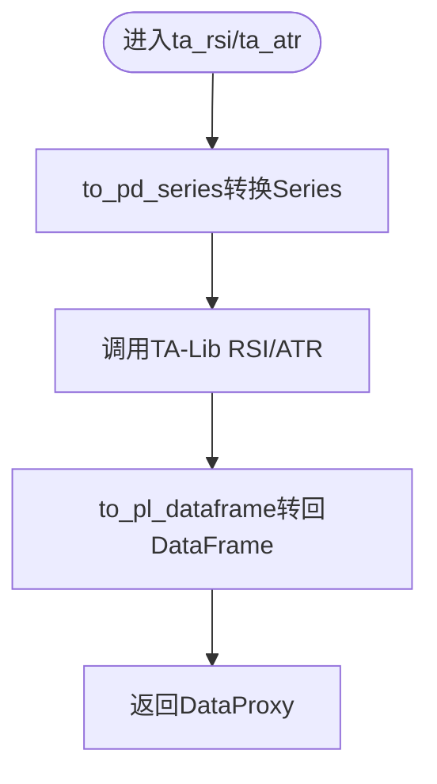
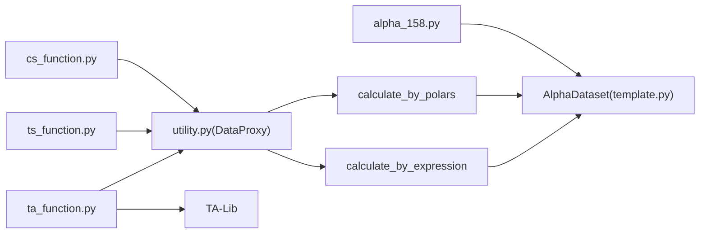

# 技术因子

<cite>
**本文引用的文件**
- [ta_function.py](file://vnpy/alpha/dataset/ta_function.py)
- [utility.py](file://vnpy/alpha/dataset/utility.py)
- [template.py](file://vnpy/alpha/dataset/template.py)
- [ts_function.py](file://vnpy/alpha/dataset/ts_function.py)
- [cs_function.py](file://vnpy/alpha/dataset/cs_function.py)
- [alpha_158.py](file://vnpy/alpha/dataset/datasets/alpha_158.py)
- [backtesting_demo.ipynb](file://examples/cta_backtesting/backtesting_demo.ipynb)
</cite>

## 目录
1. [简介](#简介)
2. [项目结构](#项目结构)
3. [核心组件](#核心组件)
4. [架构总览](#架构总览)
5. [详细组件分析](#详细组件分析)
6. [依赖关系分析](#依赖关系分析)
7. [性能考量](#性能考量)
8. [故障排查指南](#故障排查指南)
9. [结论](#结论)
10. [附录](#附录)

## 简介
本文件聚焦于vnpy.alpha.dataset.ta_function模块中的技术因子实现，系统性解析基于TA-Lib库的RSI与ATR指标计算流程，阐明DataProxy数据封装与合约级独立计算机制，结合Alpha 158因子集中的相关因子映射关系，给出在动量与波动率策略中的典型用法与优化建议。文档同时提供可视化图示，帮助读者快速把握数据流与处理链路。

## 项目结构
ta_function模块位于alpha子系统的数据集层，负责将TA-Lib指标以DataProxy形式输出，供上层AlphaDataset统一调度与并行计算。其周边模块包括：
- utility：提供DataProxy数据代理与表达式/Polars计算桥接
- template：提供AlphaDataset模板与并行特征计算框架
- ts_function/cs_function：提供时间序列与横截面运算符，支撑复杂因子组合
- alpha_158：提供158个经典因子的表达式集合，便于对比与复用

图表来源
- [ta_function.py](file://vnpy/alpha/dataset/ta_function.py#L1-L43)
- [utility.py](file://vnpy/alpha/dataset/utility.py#L1-L183)
- [template.py](file://vnpy/alpha/dataset/template.py#L1-L304)
- [ts_function.py](file://vnpy/alpha/dataset/ts_function.py#L1-L227)
- [cs_function.py](file://vnpy/alpha/dataset/cs_function.py#L1-L38)
- [alpha_158.py](file://vnpy/alpha/dataset/datasets/alpha_158.py#L1-L131)

章节来源
- [ta_function.py](file://vnpy/alpha/dataset/ta_function.py#L1-L43)
- [utility.py](file://vnpy/alpha/dataset/utility.py#L1-L183)
- [template.py](file://vnpy/alpha/dataset/template.py#L1-L304)
- [ts_function.py](file://vnpy/alpha/dataset/ts_function.py#L1-L227)
- [cs_function.py](file://vnpy/alpha/dataset/cs_function.py#L1-L38)
- [alpha_158.py](file://vnpy/alpha/dataset/datasets/alpha_158.py#L1-L131)

## 核心组件
- DataProxy：封装“datetime/vt_symbol/data”的DataFrame，支持四则运算、比较、布尔表达式与归约操作，作为ta_function输入输出的统一载体。
- ta_rsi/ta_atr：基于TA-Lib的RSI与ATR指标计算，按合约维度独立计算，返回DataProxy。
- calculate_by_expression/calculate_by_polars：表达式与Polars表达式两种计算路径，统一接入AlphaDataset并行框架。
- AlphaDataset：提供特征注册、并行计算、数据筛选与分段提取能力，支撑研究与回测阶段的特征工程。

章节来源
- [utility.py](file://vnpy/alpha/dataset/utility.py#L1-L183)
- [ta_function.py](file://vnpy/alpha/dataset/ta_function.py#L1-L43)
- [template.py](file://vnpy/alpha/dataset/template.py#L1-L304)

## 架构总览
ta_function的计算链路如下：
- 输入：DataProxy（包含datetime、vt_symbol、data列）
- 中间：转换为pandas Series，调用TA-Lib计算，再转回polars DataFrame
- 输出：DataProxy（统一命名data列）
- 上层：AlphaDataset通过并行进程池批量计算多个表达式/因子

图表来源
- [ta_function.py](file://vnpy/alpha/dataset/ta_function.py#L1-L43)
- [utility.py](file://vnpy/alpha/dataset/utility.py#L1-L183)
- [template.py](file://vnpy/alpha/dataset/template.py#L1-L304)

## 详细组件分析

### DataProxy数据代理
DataProxy以“datetime/vt_symbol/data”三列为标准，提供：
- 基本运算：加减乘除、绝对值、比较运算
- 归约与布尔：支持与标量或另一个DataProxy进行逐元素运算
- 结果封装：通过result方法将Series封装为新的DataProxy，确保列名与索引一致性

图表来源
- [utility.py](file://vnpy/alpha/dataset/utility.py#L1-L183)

章节来源
- [utility.py](file://vnpy/alpha/dataset/utility.py#L1-L183)

### ta_rsi与ta_atr函数
- ta_rsi
  - 参数：close(DataProxy)、window(int)
  - 计算逻辑：将DataProxy转换为pandas Series，调用TA-Lib RSI(timeperiod=window)，再转回DataProxy
  - 适用场景：动量策略中识别超买/超卖区域，结合滚动均值或阈值信号
- ta_atr
  - 参数：high(DataProxy)、low(DataProxy)、close(DataProxy)、window(int)
  - 计算逻辑：将三价Series转换为pandas，调用TA-Lib ATR(timeperiod=window)，再转回DataProxy
  - 适用场景：波动率估计、止损幅度设置、风险预算

图表来源
- [ta_function.py](file://vnpy/alpha/dataset/ta_function.py#L1-L43)

章节来源
- [ta_function.py](file://vnpy/alpha/dataset/ta_function.py#L1-L43)

### 表达式与Polars计算桥接
- calculate_by_expression：在表达式空间内动态构建DataProxy变量，eval执行字符串表达式，返回DataProxy
- calculate_by_polars：直接使用Polars表达式，适合纯向量化计算
- 二者均通过DataProxy统一命名data列，保证与AlphaDataset并行计算兼容

章节来源
- [utility.py](file://vnpy/alpha/dataset/utility.py#L1-L183)

### AlphaDataset并行计算框架
- add_feature：注册特征表达式或直接注入结果DataFrame
- prepare_data：并行计算所有表达式，使用多进程池与进度条
- process_data：对推理/学习数据应用预处理器（如填充、标准化）
- fetch_*：按训练/验证/测试时间段提取数据

章节来源
- [template.py](file://vnpy/alpha/dataset/template.py#L1-L304)

### 时间序列与横截面运算
- ts_function：提供ts_delay、ts_min/max、ts_argmax/argmin、ts_rank、ts_sum/mean/std、ts_slope/rsquare/resi、ts_corr、ts_less/greater、ts_log/abs等
- cs_function：提供cs_rank、cs_mean、cs_std等横截面运算
- 与ta_function配合，可构建更复杂的动量/波动率因子

章节来源
- [ts_function.py](file://vnpy/alpha/dataset/ts_function.py#L1-L227)
- [cs_function.py](file://vnpy/alpha/dataset/cs_function.py#L1-L38)

### Alpha 158因子集中的对应关系
Alpha158提供了大量经典因子表达式，与ta_rsi/ta_atr存在映射或互补关系：
- RSI类：可参考Alpha158中的“rsv_w”、“rank_w”等滚动相对位置与排序因子，形成RSI风格的动量信号
- 波动率类：可参考“std_w”、“vstd_w”、“wvma_w”等滚动波动与成交量波动因子，与ATR形成互补
- 组合思路：将ta_rsi/ta_atr作为信号源，结合ts_function的滚动统计与cs_function的横截面排名，构造多因子

章节来源
- [alpha_158.py](file://vnpy/alpha/dataset/datasets/alpha_158.py#L1-L131)

### 在策略中的典型用法
- 动量策略：利用ta_rsi作为超买/超卖信号，结合滚动均值或阈值过滤；也可与Alpha158中的ROC/MA/Rank等因子组合
- 波动率策略：利用ta_atr估计区间波动，作为止损幅度或风险预算依据；可与Alpha158中的VOL/VSTD/WVMA等因子联动
- 示例参考：回测示例中展示了基于ATR与RSI的调仓逻辑，体现ta_rsi/ta_atr在实盘/回测中的常见用法

章节来源
- [backtesting_demo.ipynb](file://examples/cta_backtesting/backtesting_demo.ipynb#L1627-L1893)

## 依赖关系分析
ta_function与周边模块的依赖关系如下：

图表来源
- [ta_function.py](file://vnpy/alpha/dataset/ta_function.py#L1-L43)
- [utility.py](file://vnpy/alpha/dataset/utility.py#L1-L183)
- [template.py](file://vnpy/alpha/dataset/template.py#L1-L304)
- [ts_function.py](file://vnpy/alpha/dataset/ts_function.py#L1-L227)
- [cs_function.py](file://vnpy/alpha/dataset/cs_function.py#L1-L38)
- [alpha_158.py](file://vnpy/alpha/dataset/datasets/alpha_158.py#L1-L131)

章节来源
- [ta_function.py](file://vnpy/alpha/dataset/ta_function.py#L1-L43)
- [utility.py](file://vnpy/alpha/dataset/utility.py#L1-L183)
- [template.py](file://vnpy/alpha/dataset/template.py#L1-L304)
- [ts_function.py](file://vnpy/alpha/dataset/ts_function.py#L1-L227)
- [cs_function.py](file://vnpy/alpha/dataset/cs_function.py#L1-L38)
- [alpha_158.py](file://vnpy/alpha/dataset/datasets/alpha_158.py#L1-L131)

## 性能考量
- 窗口参数选择
  - RSI/ATR窗口过小：噪声放大，信号不稳定；过大：滞后增强，灵敏度下降
  - 建议：从中小窗口起步（如12/14），结合Alpha158中的多窗口策略（5/10/20/30/60）进行对比
- 计算频率控制
  - 高频数据会显著增加TA-Lib计算量；建议在AlphaDataset层面按日/小时粒度聚合后再计算
  - 使用并行进程池（AlphaDataset）提升吞吐，但需平衡CPU核数与内存占用
- 与polars集成优化
  - DataProxy统一命名data列，避免重复转换；优先使用calculate_by_polars进行纯向量化计算
  - 对于需要TA-Lib的指标，尽量批量转换为pandas Series后一次性计算，减少中间对象创建
- 数据清洗与缺失处理
  - 在AlphaDataset中使用process_fill_na/process_drop_na等预处理器，降低下游计算中的NaN传播
- 内存与索引
  - 保持datetime/vt_symbol双索引，确保按合约分组计算的正确性与效率

[本节为通用性能建议，不直接分析具体文件]

## 故障排查指南
- 空值与缺失
  - 若ta_rsi/ta_atr返回全NaN，检查DataProxy中data列是否存在有效值，或窗口是否过大导致首N行无结果
- 类型与列名
  - 确保DataProxy的列名为“datetime/vt_symbol/data”，否则在转换与合并时可能失败
- 并行计算异常
  - 若并行计算卡住，检查AlphaDataset的进程池配置与表达式复杂度；必要时降低max_workers或拆分子任务
- 与Alpha158对比
  - 若发现与Alpha158中的同类因子（如rsv/ma/std/rank等）行为不一致，核对窗口、归一化与缺失处理方式

章节来源
- [template.py](file://vnpy/alpha/dataset/template.py#L1-L304)
- [utility.py](file://vnpy/alpha/dataset/utility.py#L1-L183)

## 结论
ta_function通过DataProxy与TA-Lib实现了RSI与ATR的合约级独立计算，并与AlphaDataset并行框架无缝衔接。结合ts_function/cs_function与Alpha158因子集，可在动量与波动率策略中构建稳健的信号体系。通过合理的窗口参数、计算频率与polars集成优化，可显著提升特征工程的效率与稳定性。

[本节为总结性内容，不直接分析具体文件]

## 附录
- 与Alpha158的对应关系
  - RSI风格：可参考“rsv_w”、“rank_w”等滚动相对位置与排序因子
  - 波动率风格：可参考“std_w”、“vstd_w”、“wvma_w”等滚动波动与成交量波动因子
- 实战建议
  - 将ta_rsi/ta_atr作为基础信号，叠加ts_function的滚动统计与cs_function的横截面排名，形成多因子融合
  - 在AlphaDataset中注册表达式，利用并行计算与分段提取，支撑研究与回测全流程

章节来源
- [alpha_158.py](file://vnpy/alpha/dataset/datasets/alpha_158.py#L1-L131)
- [ts_function.py](file://vnpy/alpha/dataset/ts_function.py#L1-L227)
- [cs_function.py](file://vnpy/alpha/dataset/cs_function.py#L1-L38)
- [template.py](file://vnpy/alpha/dataset/template.py#L1-L304)