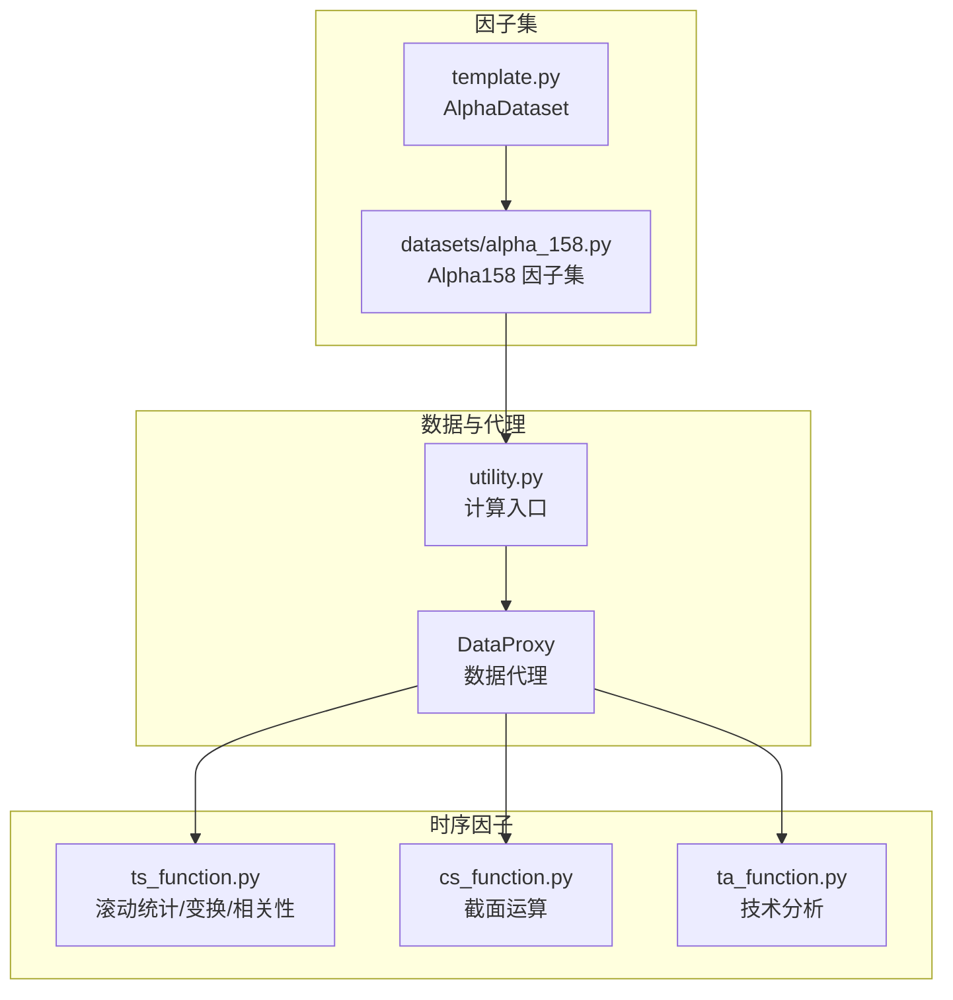
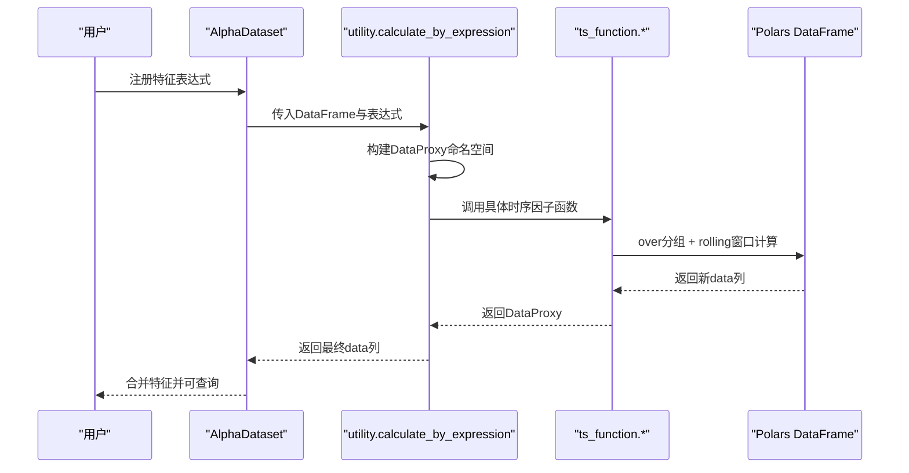
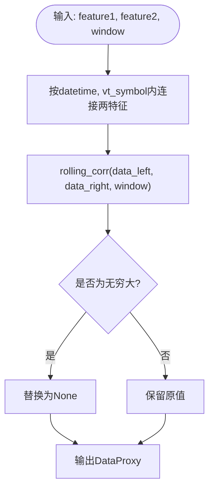
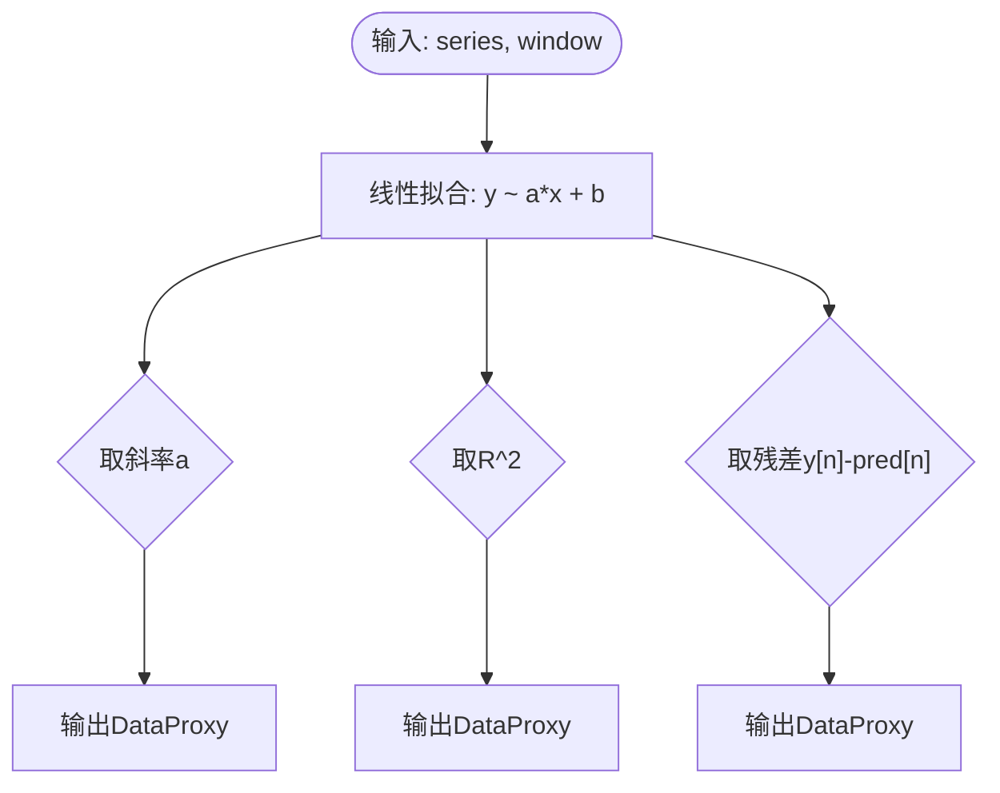
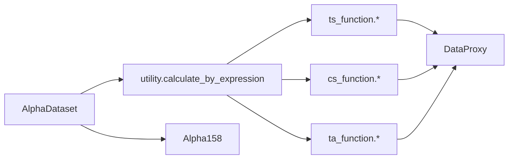

# 时序因子

<cite>
**本文引用的文件**
- [vnpy/alpha/dataset/ts_function.py](file://vnpy/alpha/dataset/ts_function.py)
- [vnpy/alpha/dataset/utility.py](file://vnpy/alpha/dataset/utility.py)
- [vnpy/alpha/dataset/template.py](file://vnpy/alpha/dataset/template.py)
- [vnpy/alpha/dataset/datasets/alpha_158.py](file://vnpy/alpha/dataset/datasets/alpha_158.py)
- [vnpy/alpha/dataset/cs_function.py](file://vnpy/alpha/dataset/cs_function.py)
- [vnpy/alpha/dataset/ta_function.py](file://vnpy/alpha/dataset/ta_function.py)
</cite>

## 目录
1. [引言](#引言)
2. [项目结构](#项目结构)
3. [核心组件](#核心组件)
4. [架构总览](#架构总览)
5. [详细组件分析](#详细组件分析)
6. [依赖关系分析](#依赖关系分析)
7. [性能考量](#性能考量)
8. [故障排查指南](#故障排查指南)
9. [结论](#结论)
10. [附录](#附录)

## 引言
本文件系统性文档化 vnpy.alpha.dataset.ts_function 模块中的时序因子体系，覆盖滚动统计、时序变换、相关性分析等核心功能。重点解析 ts_mean、ts_std、ts_rank、ts_corr 等关键函数的实现原理，说明其基于 polars 的高效滚动计算机制；深入阐述 ts_slope、ts_rsquare、ts_resi 等回归类因子的数学模型与量化意义；并结合 Alpha 158 因子集，说明多因子组合中时序运算的嵌套使用模式，最后提供避免数据泄露的实践指导。

## 项目结构
时序因子位于 vnpy.alpha.dataset 子包下，围绕 DataProxy 数据代理与 Polars DataFrame 进行统一抽象，支持表达式与 Polars 表达式两种计算路径。Alpha 158 因子集通过 AlphaDataset 统一注册与批量生成，展示时序因子在多窗口、多嵌套场景下的典型用法。

图表来源
- [vnpy/alpha/dataset/ts_function.py](file://vnpy/alpha/dataset/ts_function.py#L1-L227)
- [vnpy/alpha/dataset/utility.py](file://vnpy/alpha/dataset/utility.py#L1-L183)
- [vnpy/alpha/dataset/template.py](file://vnpy/alpha/dataset/template.py#L1-L304)
- [vnpy/alpha/dataset/datasets/alpha_158.py](file://vnpy/alpha/dataset/datasets/alpha_158.py#L1-L131)
- [vnpy/alpha/dataset/cs_function.py](file://vnpy/alpha/dataset/cs_function.py#L1-L38)
- [vnpy/alpha/dataset/ta_function.py](file://vnpy/alpha/dataset/ta_function.py#L1-L43)

章节来源
- [vnpy/alpha/dataset/ts_function.py](file://vnpy/alpha/dataset/ts_function.py#L1-L227)
- [vnpy/alpha/dataset/utility.py](file://vnpy/alpha/dataset/utility.py#L1-L183)
- [vnpy/alpha/dataset/template.py](file://vnpy/alpha/dataset/template.py#L1-L304)
- [vnpy/alpha/dataset/datasets/alpha_158.py](file://vnpy/alpha/dataset/datasets/alpha_158.py#L1-L131)

## 核心组件
- DataProxy：对单列数据进行封装，提供算术与比较运算重载，统一输出包含 datetime、vt_symbol、data 的 DataFrame，便于后续 Polars over 分组计算。
- ts_function：提供 ts_delay、ts_min、ts_max、ts_argmax、ts_argmin、ts_rank、ts_sum、ts_mean、ts_std、ts_slope、ts_quantile、ts_rsquare、ts_resi、ts_corr、ts_less、ts_greater、ts_log、ts_abs 等时序因子。
- utility：提供 calculate_by_expression/calculate_by_polars 执行引擎，将字符串表达式或 Polars 表达式转换为 DataProxy 结果。
- AlphaDataset：统一管理特征表达式、标签表达式、并行计算与数据分段查询。
- Alpha158：内置 158 个经典因子，集中演示时序因子的多窗口与嵌套使用。

章节来源
- [vnpy/alpha/dataset/utility.py](file://vnpy/alpha/dataset/utility.py#L1-L183)
- [vnpy/alpha/dataset/ts_function.py](file://vnpy/alpha/dataset/ts_function.py#L1-L227)
- [vnpy/alpha/dataset/template.py](file://vnpy/alpha/dataset/template.py#L1-L304)
- [vnpy/alpha/dataset/datasets/alpha_158.py](file://vnpy/alpha/dataset/datasets/alpha_158.py#L1-L131)

## 架构总览
时序因子的执行链路如下：
- 用户在 AlphaDataset 中注册表达式或直接提供 Polars 表达式。
- utility.calculate_by_expression 动态构建 DataProxy 名称空间，按列注入 DataProxy 对象，再通过 eval 执行表达式。
- ts_function 中的每个函数均接收 DataProxy 并返回新的 DataProxy，内部通过 Polars over 分组与 rolling 窗口算子完成计算。
- 最终由 AlphaDataset 将所有特征合并为统一的 DataFrame，并支持按时间区间查询与分析。

图表来源
- [vnpy/alpha/dataset/template.py](file://vnpy/alpha/dataset/template.py#L287-L304)
- [vnpy/alpha/dataset/utility.py](file://vnpy/alpha/dataset/utility.py#L111-L153)
- [vnpy/alpha/dataset/ts_function.py](file://vnpy/alpha/dataset/ts_function.py#L1-L227)

## 详细组件分析

### DataProxy 数据代理
- 角色：封装单列数据，统一输出包含 datetime、vt_symbol、data 的 DataFrame；提供四则运算与比较运算重载，便于表达式风格编程。
- 关键点：构造时自动重命名最后一列为 data；result 方法将 Series 转换为新的 DataProxy；与 Polars over 分组配合，确保按合约维度独立计算。

章节来源
- [vnpy/alpha/dataset/utility.py](file://vnpy/alpha/dataset/utility.py#L8-L110)

### 时序滚动统计与变换
- ts_delay：对同一合约内按时间偏移取历史值，常用于动量与相对强度构造。
- ts_min / ts_max：滚动最小/最大值，常用于通道突破、极值偏离度等。
- ts_argmax / ts_argmin：滚动窗口内最大/最小值的位置索引，常用于峰位识别与时滞分析。
- ts_rank：当前值在窗口内的百分位排名，常用于标准化与去量纲。
- ts_sum / ts_mean / ts_std：滚动求和、均值、标准差，是动量、波动率类因子的基础。
- ts_quantile：滚动分位数，支持分位数择时与风险度量。
- ts_log / ts_abs：对数变换与绝对值变换，常用于稳定尺度与非负化。

章节来源
- [vnpy/alpha/dataset/ts_function.py](file://vnpy/alpha/dataset/ts_function.py#L14-L121)

### 相关性分析 ts_corr
- 实现要点：先按 datetime、vt_symbol 内连接两个特征，再使用 Polars rolling_corr 计算滚动相关系数，并过滤无穷大值。
- 适用场景：价格与成交量、价格对数收益与成交量对数收益之间的滚动相关性，常用于量价关系与动量持续性分析。

图表来源
- [vnpy/alpha/dataset/ts_function.py](file://vnpy/alpha/dataset/ts_function.py#L159-L174)

章节来源
- [vnpy/alpha/dataset/ts_function.py](file://vnpy/alpha/dataset/ts_function.py#L159-L174)

### 回归类因子：ts_slope、ts_rsquare、ts_resi
- ts_slope：对长度为 window 的时间序列做线性拟合，取斜率作为趋势强度指标；正值看多，负值看空。
- ts_rsquare：线性回归决定系数，衡量拟合优度；当序列无波动时返回缺失值，避免除零或恒定值干扰。
- ts_resi：线性回归残差，衡量当前时刻偏离趋势的程度；常用于异常检测与反转信号。

图表来源
- [vnpy/alpha/dataset/ts_function.py](file://vnpy/alpha/dataset/ts_function.py#L104-L156)

章节来源
- [vnpy/alpha/dataset/ts_function.py](file://vnpy/alpha/dataset/ts_function.py#L104-L156)

### 基础时序操作：ts_less、ts_greater
- 作用：对两个特征逐点取最小/最大，或与标量比较，常用于条件构造与信号过滤。
- 实现：若第二个参数为 DataProxy 则内连接，否则注入常量列后横向比较。

章节来源
- [vnpy/alpha/dataset/ts_function.py](file://vnpy/alpha/dataset/ts_function.py#L176-L207)

### Alpha 158 中的时序因子应用
- 多窗口覆盖：对 close、volume 等字段在多个窗口（如 5、10、20、30、60）分别构造动量、均值、标准差、斜率、R²、残差、极值、分位数、排名、RSV、峰位等。
- 嵌套使用：大量表达式采用 ts_delay、ts_mean、ts_std、ts_corr、ts_log、ts_abs 等的嵌套组合，形成复合因子。
- 典型组合示例（路径参考）：
  - 动量与均值：例如“ts_delay(close, w)/close”、“ts_mean(close, w)/close”
  - 波动率与斜率：例如“ts_std(close, w)/close”、“ts_slope(close, w)/close”、“ts_rsquare(close, w)”、“ts_resi(close, w)/close”
  - 极值与分位数：例如“ts_max(high, w)/close”、“ts_min(low, w)/close”、“ts_quantile(close, w, 0.8)/close”、“ts_quantile(close, w, 0.2)/close”
  - 排名与时滞：例如“ts_rank(close, w)”、“ts_argmax/high, w)/w”、“ts_argmin/low, w)/w”
  - 相关性：例如“ts_corr(close, ts_log(volume+1), w)”、“ts_corr(close/ts_delay(close,1), ts_log(volume/ts_delay(volume,1)+1), w)”
  - 计数与比率：例如“ts_mean(close>ts_delay(close,1), w)”、“ts_mean(close<ts_delay(close,1), w)”、“ts_mean(close>ts_delay(close,1), w)-ts_mean(close<ts_delay(close,1), w)”

章节来源
- [vnpy/alpha/dataset/datasets/alpha_158.py](file://vnpy/alpha/dataset/datasets/alpha_158.py#L1-L131)

### 与截面因子、技术因子的协同
- 截面因子（cs_function）：cs_rank、cs_mean、cs_std 在时间维度上按日期进行跨股票排序与聚合，常与时序因子组合用于去趋势或标准化。
- 技术分析（ta_function）：通过 TA-Lib 计算 RSI、ATR 等指标，与 Polars 互转，便于与时序因子在同一数据管线中使用。

章节来源
- [vnpy/alpha/dataset/cs_function.py](file://vnpy/alpha/dataset/cs_function.py#L1-L38)
- [vnpy/alpha/dataset/ta_function.py](file://vnpy/alpha/dataset/ta_function.py#L1-L43)

## 依赖关系分析
- ts_function 依赖 DataProxy 与 polars，所有函数均通过 over 分组在 vt_symbol 维度独立计算，避免跨合约数据污染。
- utility.calculate_by_expression 动态导入 ts_function、cs_function、ta_function，使表达式可直接调用这些函数。
- AlphaDataset 通过并行池计算所有特征表达式，最终将各特征列合并至统一 DataFrame。

图表来源
- [vnpy/alpha/dataset/utility.py](file://vnpy/alpha/dataset/utility.py#L111-L153)
- [vnpy/alpha/dataset/ts_function.py](file://vnpy/alpha/dataset/ts_function.py#L1-L227)
- [vnpy/alpha/dataset/cs_function.py](file://vnpy/alpha/dataset/cs_function.py#L1-L38)
- [vnpy/alpha/dataset/ta_function.py](file://vnpy/alpha/dataset/ta_function.py#L1-L43)
- [vnpy/alpha/dataset/template.py](file://vnpy/alpha/dataset/template.py#L90-L126)

章节来源
- [vnpy/alpha/dataset/utility.py](file://vnpy/alpha/dataset/utility.py#L111-L153)
- [vnpy/alpha/dataset/template.py](file://vnpy/alpha/dataset/template.py#L90-L126)

## 性能考量
- 分组滚动：所有时序函数均使用 Polars over("vt_symbol")，确保按合约维度独立滚动，避免跨合约数据泄露，同时利用 Polars 的向量化与分组优化。
- 窗口参数：min_samples 控制窗口样本数，避免早期缺失导致的空值过多；rolling_map 用于需要自定义统计的函数（如 ts_rank、ts_std、ts_slope、ts_quantile、ts_rsquare、ts_resi）。
- 并行计算：AlphaDataset 使用多进程池并行计算特征表达式，显著提升大规模数据处理效率。
- 类型与数值稳定性：ts_rsquare 在序列无波动时返回缺失值，ts_corr 对无穷大值进行过滤，避免异常值影响整体统计。

章节来源
- [vnpy/alpha/dataset/ts_function.py](file://vnpy/alpha/dataset/ts_function.py#L24-L174)
- [vnpy/alpha/dataset/template.py](file://vnpy/alpha/dataset/template.py#L90-L126)

## 故障排查指南
- 数据泄露风险
  - 现象：跨合约数据混入、未来信息泄露、窗口内包含未来值。
  - 排查要点：确认所有滚动计算均使用 over("vt_symbol")；避免在 join 后未按时间顺序裁剪；确保 ts_delay 的滞后窗口正确。
  - 参考实现：ts_delay、ts_min、ts_max、ts_rank、ts_corr 等均通过 over 分组与滚动算子实现。
- 无穷大与缺失值
  - 现象：ts_corr 输出出现无穷大或 NaN。
  - 处理：ts_corr 已对无穷大进行过滤；ts_rsquare 在序列无波动时返回缺失值。
- 窗口过短或样本不足
  - 现象：早期窗口为空或统计不稳定。
  - 处理：合理设置 min_samples；评估窗口大小对因子稳定性的影响。
- 表达式解析错误
  - 现象：eval 表达式无法解析或变量未定义。
  - 处理：确保 utility.calculate_by_expression 中已导入所需函数；表达式中变量名与列名一致。

章节来源
- [vnpy/alpha/dataset/ts_function.py](file://vnpy/alpha/dataset/ts_function.py#L14-L174)
- [vnpy/alpha/dataset/utility.py](file://vnpy/alpha/dataset/utility.py#L111-L153)
- [vnpy/alpha/dataset/template.py](file://vnpy/alpha/dataset/template.py#L90-L126)

## 结论
vnpy 的时序因子体系以 DataProxy 为核心抽象，结合 Polars 的 over 分组与滚动算子，实现了高效、可读性强且可扩展的时序计算框架。ts_mean、ts_std、ts_rank、ts_corr 等关键函数体现了滚动统计与相关性分析的工程化实现；ts_slope、ts_rsquare、ts_resi 则将线性回归模型量化为可解释的因子。Alpha 158 因子集展示了多窗口与嵌套使用的典型模式，为构建多因子组合提供了范式。遵循分组滚动与窗口样本控制的原则，可有效避免数据泄露，提升回测与实盘的一致性。

## 附录
- 常用表达式片段（路径参考）
  - 动量：ts_delay(close, w) / close
  - 均值与标准差：ts_mean(close, w) / close、ts_std(close, w) / close
  - 回归因子：ts_slope(close, w) / close、ts_rsquare(close, w)、ts_resi(close, w) / close
  - 极值与分位数：ts_max(high, w) / close、ts_min(low, w) / close、ts_quantile(close, w, 0.8) / close、ts_quantile(close, w, 0.2) / close
  - 排名与时滞：ts_rank(close, w)、ts_argmax(high, w) / w、ts_argmin(low, w) / w
  - 相关性：ts_corr(close, ts_log(volume+1), w)、ts_corr(close/ts_delay(close,1), ts_log(volume/ts_delay(volume,1)+1), w)
  - 计数与比率：ts_mean(close>ts_delay(close,1), w)、ts_mean(close<ts_delay(close,1), w)、ts_mean(close>ts_delay(close,1), w)-ts_mean(close<ts_delay(close,1), w)

章节来源
- [vnpy/alpha/dataset/datasets/alpha_158.py](file://vnpy/alpha/dataset/datasets/alpha_158.py#L1-L131)
- [vnpy/alpha/dataset/ts_function.py](file://vnpy/alpha/dataset/ts_function.py#L14-L174)