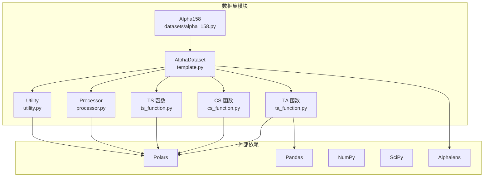
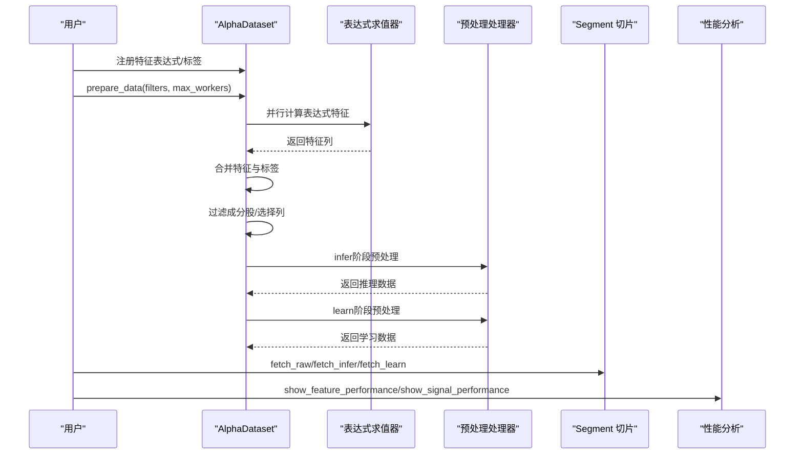
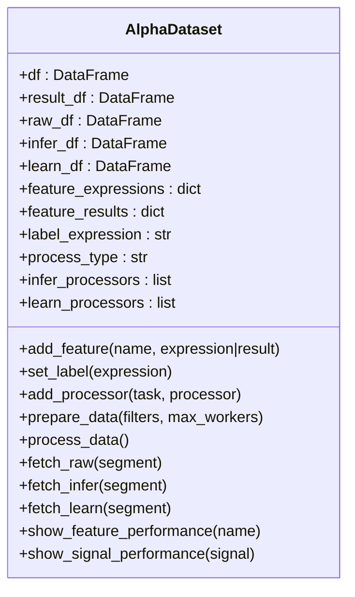
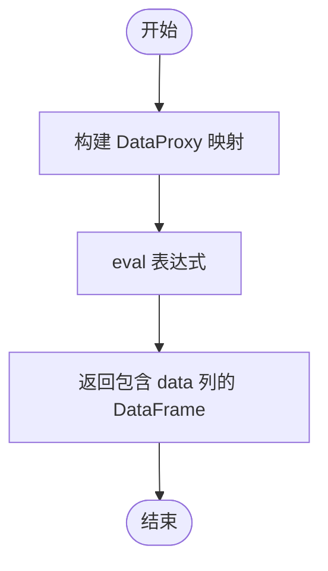
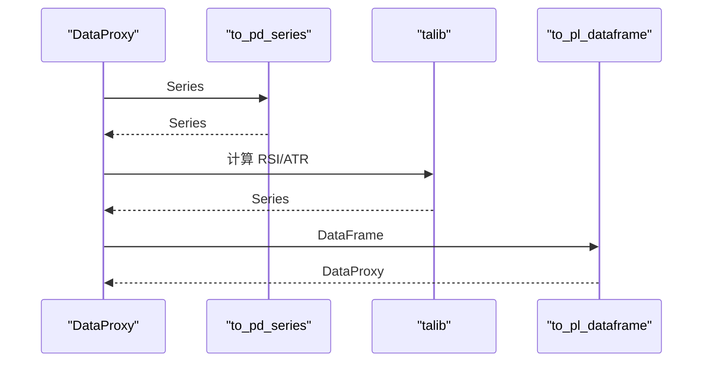
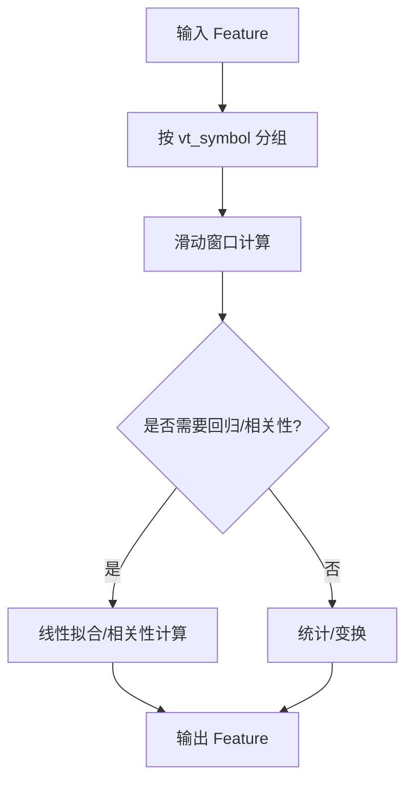
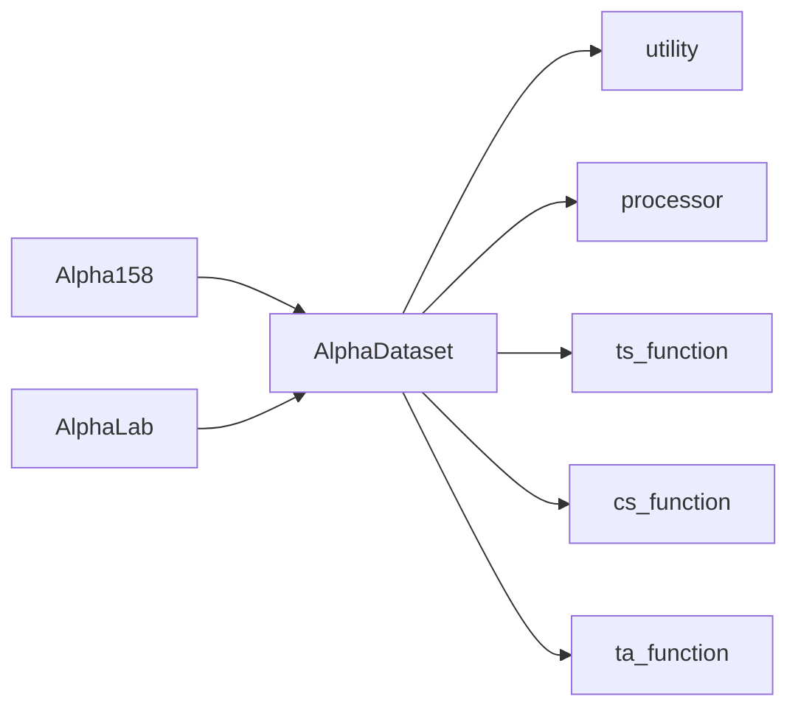

# 因子工程

<cite>
**本文引用的文件列表**
- [vnpy/alpha/dataset/__init__.py](file://vnpy/alpha/dataset/__init__.py)
- [vnpy/alpha/dataset/template.py](file://vnpy/alpha/dataset/template.py)
- [vnpy/alpha/dataset/utility.py](file://vnpy/alpha/dataset/utility.py)
- [vnpy/alpha/dataset/processor.py](file://vnpy/alpha/dataset/processor.py)
- [vnpy/alpha/dataset/ta_function.py](file://vnpy/alpha/dataset/ta_function.py)
- [vnpy/alpha/dataset/ts_function.py](file://vnpy/alpha/dataset/ts_function.py)
- [vnpy/alpha/dataset/cs_function.py](file://vnpy/alpha/dataset/cs_function.py)
- [vnpy/alpha/dataset/datasets/alpha_158.py](file://vnpy/alpha/dataset/datasets/alpha_158.py)
- [vnpy/alpha/lab.py](file://vnpy/alpha/lab.py)
- [vnpy/alpha/__init__.py](file://vnpy/alpha/__init__.py)
</cite>

## 目录
1. [引言](#引言)
2. [项目结构](#项目结构)
3. [核心组件](#核心组件)
4. [架构总览](#架构总览)
5. [关键组件详解](#关键组件详解)
6. [依赖关系分析](#依赖关系分析)
7. [性能考量](#性能考量)
8. [故障排查指南](#故障排查指南)
9. [结论](#结论)
10. [附录](#附录)

## 引言
本文件面向AI量化研究中的因子工程，系统化梳理 vnpy.alpha.dataset 模块的设计理念与实现细节，重点覆盖：
- AlphaDataset 类的数据管线设计与并行计算流程
- 技术因子（ta_function）、时序因子（ts_function）、截面因子（cs_function）的实现机制与计算逻辑
- Alpha 158 因子集的构建方法、稳定性处理与扩展方式
- 数据预处理函数（缺失值处理、标准化、排序归一化）的应用场景与配置要点
- 辅助工具（Segment、to_datetime）的使用方法
- 实战示例（定义新因子、构建因子管道、批量计算）与性能优化建议

## 项目结构
该模块围绕“表达式驱动 + 并行计算 + 可插拔预处理”的思路组织，核心文件如下：
- 模块导出入口：提供 AlphaDataset、Segment、to_datetime 以及各类处理器
- 数据集模板：AlphaDataset 定义了特征表达式注册、并行计算、数据切片与分析能力
- 表达式求值工具：utility 提供 DataProxy、表达式与 Polars 表达式两种求值路径
- 预处理处理器：processor 提供缺失值、标准化、排序归一化等常用处理
- 因子函数族：ta_function（技术分析）、ts_function（时序滚动）、cs_function（截面）
- 经典因子集：datasets/alpha_158 提供 Alpha 158 的完整因子清单与标签定义
- 实验室工具：lab 提供数据加载、保存与工作流衔接

图表来源
- [vnpy/alpha/dataset/template.py](file://vnpy/alpha/dataset/template.py#L1-L304)
- [vnpy/alpha/dataset/utility.py](file://vnpy/alpha/dataset/utility.py#L1-L183)
- [vnpy/alpha/dataset/processor.py](file://vnpy/alpha/dataset/processor.py#L1-L126)
- [vnpy/alpha/dataset/ta_function.py](file://vnpy/alpha/dataset/ta_function.py#L1-L43)
- [vnpy/alpha/dataset/ts_function.py](file://vnpy/alpha/dataset/ts_function.py#L1-L227)
- [vnpy/alpha/dataset/cs_function.py](file://vnpy/alpha/dataset/cs_function.py#L1-L38)
- [vnpy/alpha/dataset/datasets/alpha_158.py](file://vnpy/alpha/dataset/datasets/alpha_158.py#L1-L131)

章节来源
- [vnpy/alpha/dataset/__init__.py](file://vnpy/alpha/dataset/__init__.py#L1-L22)
- [vnpy/alpha/dataset/template.py](file://vnpy/alpha/dataset/template.py#L1-L304)
- [vnpy/alpha/dataset/utility.py](file://vnpy/alpha/dataset/utility.py#L1-L183)
- [vnpy/alpha/dataset/processor.py](file://vnpy/alpha/dataset/processor.py#L1-L126)
- [vnpy/alpha/dataset/ta_function.py](file://vnpy/alpha/dataset/ta_function.py#L1-L43)
- [vnpy/alpha/dataset/ts_function.py](file://vnpy/alpha/dataset/ts_function.py#L1-L227)
- [vnpy/alpha/dataset/cs_function.py](file://vnpy/alpha/dataset/cs_function.py#L1-L38)
- [vnpy/alpha/dataset/datasets/alpha_158.py](file://vnpy/alpha/dataset/datasets/alpha_158.py#L1-L131)

## 核心组件
- AlphaDataset：统一的因子工程模板，负责特征表达式注册、并行计算、数据切片、标签设置、预处理流水线与性能分析
- DataProxy：表达式求值的中间层，将列映射为可运算对象，支持四则、比较、绝对值等操作
- 表达式求值器：支持字符串表达式（eval）与 Polars 表达式（with_columns），分别对应 ts/cs/ta 函数族
- 预处理处理器：process_drop_na、process_fill_na、process_cs_norm、process_robust_zscore_norm、process_cs_rank_norm
- 因子函数族：ta_function（RSI、ATR）、ts_function（滚动窗口统计、动量、协整、相关性等）、cs_function（截面排名、均值、标准差）

章节来源
- [vnpy/alpha/dataset/template.py](file://vnpy/alpha/dataset/template.py#L23-L304)
- [vnpy/alpha/dataset/utility.py](file://vnpy/alpha/dataset/utility.py#L1-L183)
- [vnpy/alpha/dataset/processor.py](file://vnpy/alpha/dataset/processor.py#L1-L126)
- [vnpy/alpha/dataset/ta_function.py](file://vnpy/alpha/dataset/ta_function.py#L1-L43)
- [vnpy/alpha/dataset/ts_function.py](file://vnpy/alpha/dataset/ts_function.py#L1-L227)
- [vnpy/alpha/dataset/cs_function.py](file://vnpy/alpha/dataset/cs_function.py#L1-L38)

## 架构总览
下图展示了从原始行情数据到可用因子数据集的端到端流程，包括特征表达式注册、并行计算、预处理、数据切片与分析。

图表来源
- [vnpy/alpha/dataset/template.py](file://vnpy/alpha/dataset/template.py#L90-L192)
- [vnpy/alpha/dataset/utility.py](file://vnpy/alpha/dataset/utility.py#L111-L162)
- [vnpy/alpha/dataset/processor.py](file://vnpy/alpha/dataset/processor.py#L1-L126)

## 关键组件详解

### AlphaDataset 类设计与数据管线
- 特征注册：add_feature 支持两种输入
  - 字符串表达式：通过 evaluate 注入 ts/cs/ta 函数，自动映射列名到 DataProxy
  - 直接传入 DataFrame：作为外部特征结果，按列名合并
- 标签设置：set_label 定义预测目标（通常为未来收益）
- 并行计算：prepare_data 将所有表达式打包为任务，使用多进程池并行执行，最终合并到 result_df
- 数据切片：query_by_time 与 fetch_* 方法按 Segment 时间段返回数据
- 预处理流水线：process_data 先对推理数据执行 infer_processors，再根据 process_type 决定是否复用推理数据到学习阶段，随后执行 learn_processors
- 性能分析：show_feature_performance 与 show_signal_performance 基于 Alphalens 进行因子/信号的分位表现分析

图表来源
- [vnpy/alpha/dataset/template.py](file://vnpy/alpha/dataset/template.py#L23-L304)

章节来源
- [vnpy/alpha/dataset/template.py](file://vnpy/alpha/dataset/template.py#L58-L192)
- [vnpy/alpha/dataset/template.py](file://vnpy/alpha/dataset/template.py#L272-L304)

### 表达式求值与 DataProxy
- DataProxy 将单列 DataFrame 包装为可运算对象，支持加减乘除、比较、绝对值等操作，并将结果封装回 DataFrame
- calculate_by_expression：将 df 中的列映射为 DataProxy，然后通过 eval 执行表达式
- calculate_by_polars：直接使用 Polars Expr 进行向量化计算
- utility.to_datetime：统一时间转换，兼容字符串与 datetime

图表来源
- [vnpy/alpha/dataset/utility.py](file://vnpy/alpha/dataset/utility.py#L111-L162)

章节来源
- [vnpy/alpha/dataset/utility.py](file://vnpy/alpha/dataset/utility.py#L1-L183)

### 技术因子（ta_function）
- ta_rsi：基于 talib 计算 RSI，先转为 pandas Series，再转回 Polars DataFrame
- ta_atr：基于 talib 计算 ATR
- 适配策略：将 DataProxy 转为 pandas Series，调用 talib，再转回 DataProxy

图表来源
- [vnpy/alpha/dataset/ta_function.py](file://vnpy/alpha/dataset/ta_function.py#L1-L43)

章节来源
- [vnpy/alpha/dataset/ta_function.py](file://vnpy/alpha/dataset/ta_function.py#L1-L43)

### 时序因子（ts_function）
- ts_delay：按合约分组平移
- ts_min/ts_max/ts_sum/ts_mean/ts_std/ts_slope/ts_quantile/ts_rsquare/ts_resi：滚动窗口统计/回归
- ts_rank：窗口内百分位排名
- ts_corr：两序列滚动相关性，过滤无穷值
- ts_less/ts_greater：逐点取最小/最大
- ts_log/ts_abs：逐点变换

图表来源
- [vnpy/alpha/dataset/ts_function.py](file://vnpy/alpha/dataset/ts_function.py#L1-L227)

章节来源
- [vnpy/alpha/dataset/ts_function.py](file://vnpy/alpha/dataset/ts_function.py#L1-L227)

### 截面因子（cs_function）
- cs_rank：按日期分组内的截面排名
- cs_mean/cs_std：按日期分组内的截面统计

章节来源
- [vnpy/alpha/dataset/cs_function.py](file://vnpy/alpha/dataset/cs_function.py#L1-L38)

### Alpha 158 因子集
- 继承 AlphaDataset，集中注册 158 个基础因子表达式，涵盖蜡烛形态、价格比、动量/反转、波动率、成交量相关、价量相关等
- 标签定义为未来一段时间的收益率（滞后窗口组合）
- 通过 add_feature 与 set_label 快速构建完整因子集

章节来源
- [vnpy/alpha/dataset/datasets/alpha_158.py](file://vnpy/alpha/dataset/datasets/alpha_158.py#L1-L131)

### 数据预处理函数
- 缺失值处理
  - process_drop_na：对指定列丢弃含空值的行
  - process_fill_na：对指定列填充固定值，可选择连标签一起填充
- 标准化
  - process_cs_norm：按日期分组进行稳健/标准 Z-score 归一化
  - process_robust_zscore_norm：可选训练期窗口，使用中位数与 MAD 进行稳健标准化，可选裁剪
- 排序归一化
  - process_cs_rank_norm：按日期分组进行平均秩次归一化，缩放至近似正态区间

章节来源
- [vnpy/alpha/dataset/processor.py](file://vnpy/alpha/dataset/processor.py#L1-L126)

### 辅助工具
- Segment：枚举训练/验证/测试三段
- to_datetime：统一字符串与 datetime 输入

章节来源
- [vnpy/alpha/dataset/utility.py](file://vnpy/alpha/dataset/utility.py#L164-L183)
- [vnpy/alpha/dataset/__init__.py](file://vnpy/alpha/dataset/__init__.py#L1-L22)

## 依赖关系分析
- AlphaDataset 依赖 utility（表达式求值、时间工具、Segment）、processor（预处理）、ts/cs/ta 函数族
- Alpha158 继承 AlphaDataset，复用其表达式注册与数据管线
- lab 提供数据加载/保存与 AlphaDataset 的衔接

图表来源
- [vnpy/alpha/dataset/template.py](file://vnpy/alpha/dataset/template.py#L1-L304)
- [vnpy/alpha/dataset/datasets/alpha_158.py](file://vnpy/alpha/dataset/datasets/alpha_158.py#L1-L131)
- [vnpy/alpha/lab.py](file://vnpy/alpha/lab.py#L1-L200)

章节来源
- [vnpy/alpha/dataset/template.py](file://vnpy/alpha/dataset/template.py#L1-L304)
- [vnpy/alpha/dataset/datasets/alpha_158.py](file://vnpy/alpha/dataset/datasets/alpha_158.py#L1-L131)
- [vnpy/alpha/lab.py](file://vnpy/alpha/lab.py#L1-L200)

## 性能考量
- 并行计算：prepare_data 使用多进程池并行计算表达式特征，合理设置 max_workers 可显著提速
- 表达式求值：优先使用 Polars Expr（calculate_by_polars）以获得更优的向量化性能；仅在需要第三方库时使用 ta_function
- 滚动窗口：ts_function 的滚动计算在大数据量下开销较大，建议控制窗口大小与列数量
- 预处理：process_cs_norm/process_robust_zscore_norm 在按日期分组上进行，注意内存占用与 I/O
- 数据类型与索引：确保 datetime、vt_symbol 为合适的类型，避免隐式转换带来的额外成本

[本节为通用性能建议，不直接分析具体文件]

## 故障排查指南
- 表达式语法错误：检查 add_feature 中的字符串表达式是否正确引用列名与函数名
- 缺失值导致的 NaN/None：使用 process_fill_na 或 process_drop_na 进行处理
- 归一化异常：确认 process_cs_norm 的 method 与 process_robust_zscore_norm 的 fit 窗口设置合理
- 时间范围错误：使用 to_datetime 统一时间格式，避免字符串格式不一致
- 性能瓶颈：调整 prepare_data 的 max_workers，或减少表达式数量与窗口大小

章节来源
- [vnpy/alpha/dataset/processor.py](file://vnpy/alpha/dataset/processor.py#L1-L126)
- [vnpy/alpha/dataset/utility.py](file://vnpy/alpha/dataset/utility.py#L164-L183)

## 结论
vnpy.alpha.dataset 以 AlphaDataset 为核心，提供了从表达式到特征、从预处理到分析的完整因子工程闭环。通过表达式求值器与三大函数族，能够快速构建复杂的时序、截面与技术因子；借助 Alpha 158 因子集，可直接复用业界成熟的因子清单。配合强大的预处理与并行计算能力，该模块为 AI 量化研究提供了高效率、可扩展的因子工程基础设施。

[本节为总结性内容，不直接分析具体文件]

## 附录

### 实战示例（步骤说明）
以下为“如何定义新因子、构建因子管道并进行批量计算”的步骤指引，便于读者在实际项目中落地：
- 准备数据：将日线/分钟线数据保存为 Polars DataFrame，包含 datetime、vt_symbol 与 OHLCV 等列
- 创建 AlphaDataset 实例：传入 df 与训练/验证/测试时间段
- 注册特征：
  - 使用 add_feature 注册字符串表达式（如 ts_mean(close, 20)/close）
  - 或直接传入外部计算结果 DataFrame（按列名合并）
- 设置标签：set_label 定义预测目标（如未来收益）
- 添加预处理：
  - 使用 add_processor 注册 process_drop_na、process_fill_na、process_cs_norm、process_robust_zscore_norm、process_cs_rank_norm
  - infer 阶段与 learn 阶段分别添加处理器
- 执行准备与计算：prepare_data 并行计算所有表达式，生成 result_df
- 数据切片：使用 fetch_raw/fetch_infer/fetch_learn 获取各阶段数据
- 性能分析：show_feature_performance 或 show_signal_performance 进行因子/信号分析
- 保存与加载：可参考 AlphaLab 的保存/加载流程

章节来源
- [vnpy/alpha/dataset/template.py](file://vnpy/alpha/dataset/template.py#L58-L192)
- [vnpy/alpha/dataset/processor.py](file://vnpy/alpha/dataset/processor.py#L1-L126)
- [vnpy/alpha/dataset/datasets/alpha_158.py](file://vnpy/alpha/dataset/datasets/alpha_158.py#L1-L131)
- [vnpy/alpha/lab.py](file://vnpy/alpha/lab.py#L1-L200)