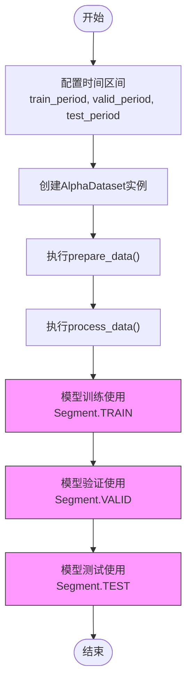

# 分段处理机制

<cite>
**本文档引用的文件**   
- [utility.py](file://vnpy/alpha/dataset/utility.py)
- [template.py](file://vnpy/alpha/dataset/template.py)
- [lgb_model.py](file://vnpy/alpha/model/models/lgb_model.py)
- [mlp_model.py](file://vnpy/alpha/model/models/mlp_model.py)
- [backtesting.py](file://vnpy/alpha/strategy/backtesting.py)
- [processor.py](file://vnpy/alpha/dataset/processor.py)
</cite>

## 目录
1. [引言](#引言)
2. [Segment枚举类设计](#segment枚举类设计)
3. [AlphaDataset数据管道](#alphadataset数据管道)
4. [分段处理在模型训练中的应用](#分段处理在模型训练中的应用)
5. [时间区间配置与数据泄露防范](#时间区间配置与数据泄露防范)
6. [条件性执行与预处理流程](#条件性执行与预处理流程)
7. [高级应用场景](#高级应用场景)
8. [结论](#结论)

## 引言
在量化策略开发中，数据集的合理划分对于模型的有效性和评估的准确性至关重要。vnpy框架通过Segment枚举类和AlphaDataset类提供了一套完整的分段处理机制，实现了训练集、验证集和测试集的清晰分离。该机制不仅确保了模型评估的有效性，还通过条件性执行避免了数据泄露问题。本文将深入解析这一机制的设计原理和实现方式，展示其在实际策略开发中的应用模式。

## Segment枚举类设计

Segment枚举类是分段处理机制的核心，定义了数据集的三个基本划分：训练集（TRAIN）、验证集（VALID）和测试集（TEST）。该枚举类通过数值标识（1、2、3）为每个分段赋予唯一标识，便于在数据处理流程中进行条件判断和路由。


**图示来源**
- [utility.py](file://vnpy/alpha/dataset/utility.py#L177-L182)

**本节来源**
- [utility.py](file://vnpy/alpha/dataset/utility.py#L177-L182)

## AlphaDataset数据管道

AlphaDataset类作为数据处理的核心容器，通过data_periods字典将Segment枚举与具体的时间区间映射起来。这种设计使得数据的分段处理既灵活又直观，开发者可以通过配置不同的时间区间来定义各个数据子集。


**图示来源**
- [template.py](file://vnpy/alpha/dataset/template.py#L23-L219)

**本节来源**
- [template.py](file://vnpy/alpha/dataset/template.py#L23-L219)

## 分段处理在模型训练中的应用

在模型训练过程中，Segment枚举类通过fetch_learn方法实现条件性数据获取。以LightGBM模型为例，训练过程明确区分了训练集和验证集，确保模型在训练时只能访问训练数据，而在验证时使用独立的验证集进行性能评估。


**图示来源**
- [lgb_model.py](file://vnpy/alpha/model/models/lgb_model.py#L69-L81)
- [template.py](file://vnpy/alpha/dataset/template.py#L186-L191)

**本节来源**
- [lgb_model.py](file://vnpy/alpha/model/models/lgb_model.py#L69-L81)
- [template.py](file://vnpy/alpha/dataset/template.py#L186-L191)

## 时间区间配置与数据泄露防范

分段处理机制的关键优势在于其有效防止了数据泄露。通过将训练集、验证集和测试集配置为互不重叠的时间区间，确保了模型在训练和验证过程中无法接触到未来数据。这种时间上的隔离是量化模型评估有效性的基础。



**图示来源**
- [template.py](file://vnpy/alpha/dataset/template.py#L29-L48)
- [lgb_model.py](file://vnpy/alpha/model/models/lgb_model.py#L70-L72)

**本节来源**
- [template.py](file://vnpy/alpha/dataset/template.py#L29-L48)
- [lgb_model.py](file://vnpy/alpha/model/models/lgb_model.py#L70-L72)

## 条件性执行与预处理流程

分段处理机制支持条件性执行的预处理流程。通过add_processor方法，开发者可以为推理数据（infer）和学习数据（learn）注册不同的预处理器。这种设计允许在不同阶段应用不同的数据处理逻辑，例如在学习阶段进行更严格的数据清洗和标准化。

```mermaid
flowchart LR
A[原始数据] --> B{数据处理类型}
B --> |推理数据| C[执行infer_processors]
B --> |学习数据| D[执行learn_processors]
C --> E[推理数据集]
D --> F[学习数据集]
E --> G[fetch_infer(segment)]
F --> H[fetch_learn(segment)]
style C fill:#e6f3ff,stroke:#333
style D fill:#e6f3ff,stroke:#333
```

**图示来源**
- [template.py](file://vnpy/alpha/dataset/template.py#L81-L88)
- [processor.py](file://vnpy/alpha/dataset/processor.py#L9-L125)

**本节来源**
- [template.py](file://vnpy/alpha/dataset/template.py#L81-L88)
- [processor.py](file://vnpy/alpha/dataset/processor.py#L9-L125)

## 高级应用场景

分段处理机制在交叉验证和滚动训练等高级场景中展现出强大的灵活性。通过动态调整data_periods字典中的时间区间，可以轻松实现时间序列的交叉验证。在滚动训练场景中，可以定期更新训练集的时间窗口，同时保持验证集和测试集的独立性。

```mermaid
erDiagram
TRAINING_PERIOD ||--o{ TRAINING_DATA : "包含"
VALIDATION_PERIOD ||--o{ VALIDATION_DATA : "包含"
TESTING_PERIOD ||--o{ TESTING_DATA : "包含"
TRAINING_PERIOD {
string start_date
string end_date
int segment_type 1
}
VALIDATION_PERIOD {
string start_date
string end_date
int segment_type 2
}
TESTING_PERIOD {
string start_date
string end_date
int segment_type 3
}
TRAINING_DATA {
string datetime
string vt_symbol
float feature1
float feature2
float label
}
VALIDATION_DATA {
string datetime
string vt_symbol
float feature1
float feature2
float label
}
TESTING_DATA {
string datetime
string vt_symbol
float feature1
float feature2
float label
}
```

**图示来源**
- [mlp_model.py](file://vnpy/alpha/model/models/mlp_model.py#L176-L180)
- [backtesting.py](file://vnpy/alpha/strategy/backtesting.py#L112-L168)

**本节来源**
- [mlp_model.py](file://vnpy/alpha/model/models/mlp_model.py#L176-L180)
- [backtesting.py](file://vnpy/alpha/strategy/backtesting.py#L112-L168)

## 结论
Segment枚举类与AlphaDataset类的结合为量化策略开发提供了一套强大而灵活的分段处理机制。通过明确的训练集、验证集和测试集划分，该机制有效防止了数据泄露，确保了模型评估的公正性和有效性。其条件性执行的设计允许在不同阶段应用不同的数据处理逻辑，为复杂的策略开发需求提供了支持。在实际应用中，开发者应合理配置时间区间，充分利用这一机制的优势，构建更加稳健和可靠的量化模型。