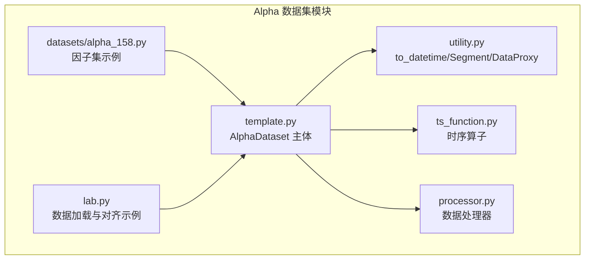
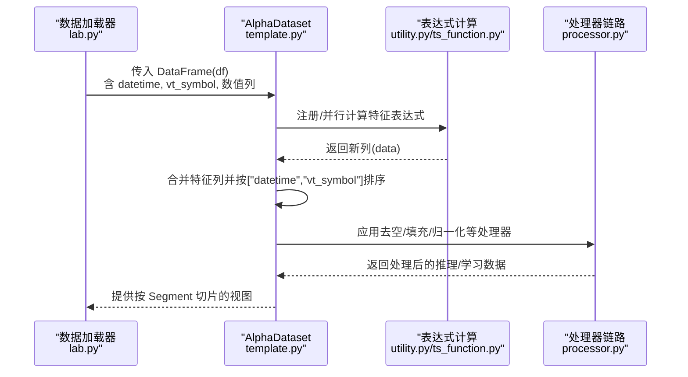
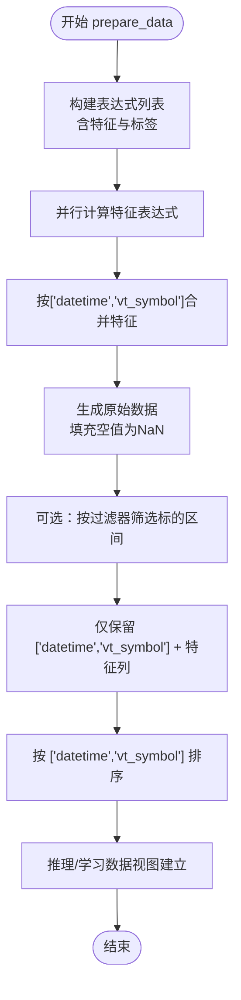
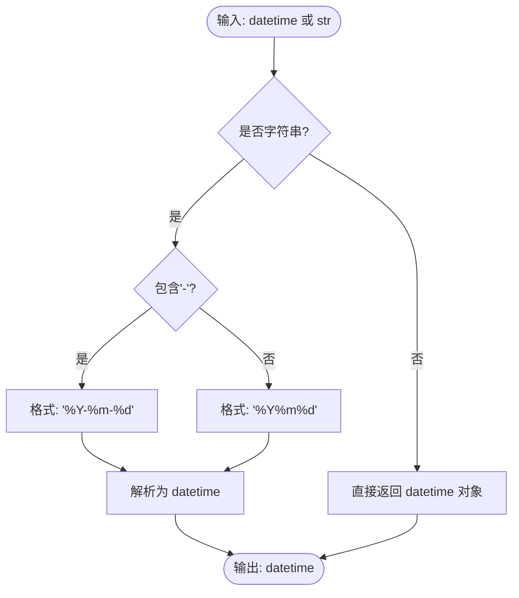
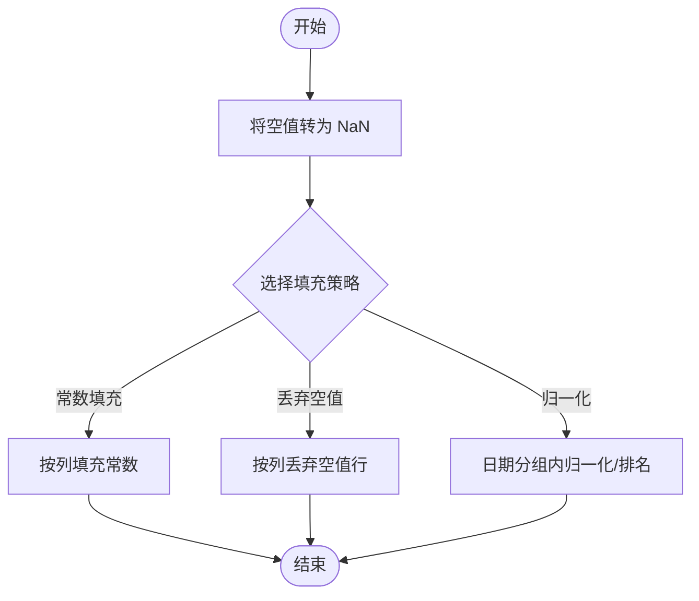
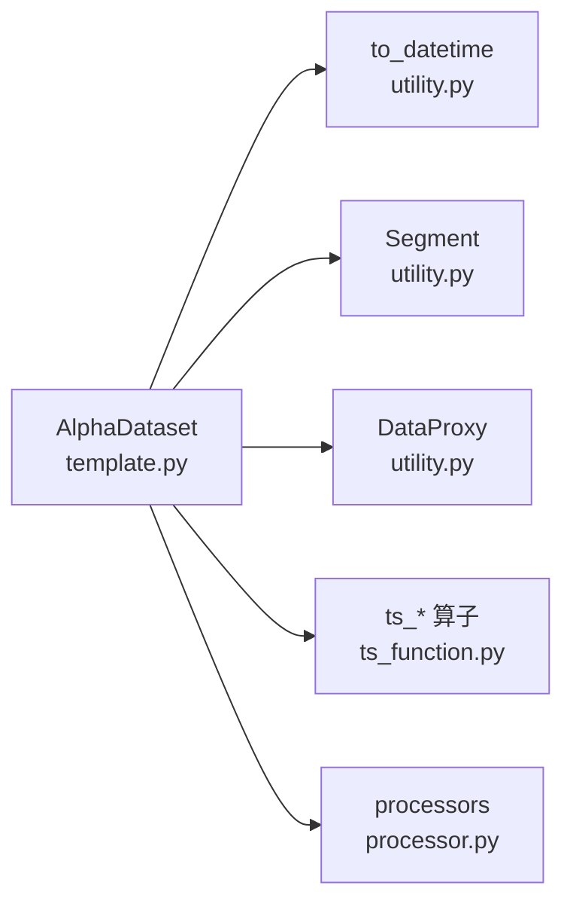

# 数据加载与对齐

<cite>
**本文引用的文件列表**
- [template.py](file://vnpy/alpha/dataset/template.py)
- [utility.py](file://vnpy/alpha/dataset/utility.py)
- [processor.py](file://vnpy/alpha/dataset/processor.py)
- [ts_function.py](file://vnpy/alpha/dataset/ts_function.py)
- [alpha_158.py](file://vnpy/alpha/dataset/datasets/alpha_158.py)
- [lab.py](file://vnpy/alpha/lab.py)
</cite>

## 目录
1. [简介](#简介)
2. [项目结构](#项目结构)
3. [核心组件](#核心组件)
4. [架构总览](#架构总览)
5. [详细组件分析](#详细组件分析)
6. [依赖关系分析](#依赖关系分析)
7. [性能考量](#性能考量)
8. [故障排查指南](#故障排查指南)
9. [结论](#结论)

## 简介
本文件系统性阐述 AlphaDataset 类在初始化与准备阶段如何加载原始市场数据，并完成“时间与标的”的对齐。重点覆盖以下方面：
- 输入数据格式要求（datetime、vt_symbol 字段结构）
- 多标的、多频率数据的时间序列对齐机制
- 缺失时间点的填充策略与跨品种时间索引统一方法
- 通过 to_datetime 函数处理不同格式的时间戳输入，确保后续处理的一致时间基准
- 数据加载阶段的异常检测机制（重复时间戳、非单调时间序列等）与处理方案

## 项目结构
AlphaDataset 所在模块位于 vnpy/alpha/dataset，围绕数据准备、表达式计算、处理器链路与工具函数组织。关键文件职责概览：
- template.py：AlphaDataset 类主体，负责特征表达式注册、并行计算、时间范围查询与结果对齐
- utility.py：通用工具，包含 to_datetime、Segment 枚举、DataProxy 表达式代理
- processor.py：数据预处理处理器（去空、填充、横截面归一化等）
- ts_function.py：时序算子（滚动窗口、相关性、斜率、残差等），用于表达式计算
- datasets/alpha_158.py：基于 AlphaDataset 的具体因子集实现示例
- lab.py：Alpha 实验室工具，包含从本地 parquet 文件读取、构造带 vt_symbol 的 DataFrame 的过程，体现对齐思路

图表来源
- [template.py](file://vnpy/alpha/dataset/template.py#L1-L304)
- [utility.py](file://vnpy/alpha/dataset/utility.py#L1-L183)
- [processor.py](file://vnpy/alpha/dataset/processor.py#L1-L126)
- [ts_function.py](file://vnpy/alpha/dataset/ts_function.py#L1-L227)
- [alpha_158.py](file://vnpy/alpha/dataset/datasets/alpha_158.py#L1-L131)
- [lab.py](file://vnpy/alpha/lab.py#L172-L243)

章节来源
- [template.py](file://vnpy/alpha/dataset/template.py#L1-L120)
- [utility.py](file://vnpy/alpha/dataset/utility.py#L164-L183)
- [lab.py](file://vnpy/alpha/lab.py#L172-L243)

## 核心组件
- AlphaDataset：提供特征表达式注册、并行计算、按时间切片查询、以及最终对齐后的原始数据视图
- to_datetime：统一字符串与 datetime 输入为标准 datetime 对象，支持“YYYY-MM-DD”与“YYYYMMDD”两种格式
- Segment：训练/验证/测试三段划分枚举
- DataProxy：表达式计算的中间代理，封装列级操作并保留 datetime/vt_symbol 索引
- 时序算子（ts_*）：基于 Polars over("vt_symbol") 的滚动窗口与统计函数，保证跨标的对齐与独立计算
- 处理器（process_*）：去空、填充、横截面标准化等，贯穿推理/学习阶段

章节来源
- [template.py](file://vnpy/alpha/dataset/template.py#L23-L120)
- [utility.py](file://vnpy/alpha/dataset/utility.py#L164-L183)
- [ts_function.py](file://vnpy/alpha/dataset/ts_function.py#L1-L120)
- [processor.py](file://vnpy/alpha/dataset/processor.py#L1-L126)

## 架构总览
AlphaDataset 的数据流从外部 DataFrame（含 datetime、vt_symbol 与若干数值列）进入，经过表达式计算与特征拼接，最终得到以 ["datetime","vt_symbol"] 为联合主键的对齐数据集。时间范围查询与排序贯穿始终，确保后续分析与建模的稳定性。

图表来源
- [lab.py](file://vnpy/alpha/lab.py#L172-L243)
- [template.py](file://vnpy/alpha/dataset/template.py#L90-L156)
- [utility.py](file://vnpy/alpha/dataset/utility.py#L111-L162)
- [ts_function.py](file://vnpy/alpha/dataset/ts_function.py#L1-L120)
- [processor.py](file://vnpy/alpha/dataset/processor.py#L1-L126)

## 详细组件分析

### AlphaDataset 初始化与数据准备
- 输入要求
  - 必须包含两列索引字段：datetime（时间）、vt_symbol（标的）
  - 其余列为数值型特征或标签列（如 close 等）
- 时间与标的对齐
  - 计算完成后，按 ["datetime","vt_symbol"] 排序，形成稳定的联合索引
  - 特征拼接通过 join(on=["datetime","vt_symbol"]) 完成，确保跨标的对齐
- 时间范围切片
  - query_by_time 支持字符串或 datetime 起止时间，内部统一转换为 datetime
  - fetch_raw/fetch_infer/fetch_learn 提供按 Segment 的时间区间提取

图表来源
- [template.py](file://vnpy/alpha/dataset/template.py#L90-L156)

章节来源
- [template.py](file://vnpy/alpha/dataset/template.py#L23-L156)

### 时间戳格式与统一基准
- to_datetime 支持两类输入：
  - 字符串："YYYY-MM-DD" 或 "YYYYMMDD"
  - datetime 对象：原样返回
- 在 AlphaDataset 中广泛用于：
  - query_by_time 的起止时间转换
  - 展示与性能分析中的时间边界统一

图表来源
- [utility.py](file://vnpy/alpha/dataset/utility.py#L164-L175)

章节来源
- [utility.py](file://vnpy/alpha/dataset/utility.py#L164-L175)
- [template.py](file://vnpy/alpha/dataset/template.py#L272-L284)

### 多标的、多频率对齐机制
- 关键在于“按 vt_symbol 分组”的窗口与运算
  - 时序算子（ts_*）普遍使用 over("vt_symbol")，确保每个标的独立计算
  - join(on=["datetime","vt_symbol"]) 保证跨标的观测对齐
- 多频率数据的统一
  - 通过统一的 datetime 精度与 vt_symbol 维度，实现高频与低频数据在同一索引下对齐
  - 若存在缺失时间点，需在上游数据准备阶段补齐；AlphaDataset 侧不自动补全，但提供填充处理器

章节来源
- [ts_function.py](file://vnpy/alpha/dataset/ts_function.py#L1-L120)
- [template.py](file://vnpy/alpha/dataset/template.py#L120-L156)

### 缺失时间点的填充策略
- 原始数据阶段：使用 fill_null/with_columns 将空值转为 NaN，便于后续处理
- 填充策略由处理器决定：
  - process_fill_na：可选择对标签或全部特征列进行常数填充
  - process_drop_na：丢弃指定列的空值行
  - process_cs_norm/process_cs_rank_norm/process_robust_zscore_norm：先将 NaN 视为缺失，再按日期分组进行横截面处理

图表来源
- [template.py](file://vnpy/alpha/dataset/template.py#L134-L156)
- [processor.py](file://vnpy/alpha/dataset/processor.py#L1-L126)

章节来源
- [template.py](file://vnpy/alpha/dataset/template.py#L134-L156)
- [processor.py](file://vnpy/alpha/dataset/processor.py#L1-L126)

### 跨品种时间索引统一方法
- 统一索引：["datetime","vt_symbol"] 作为主键，所有特征与标签均以此为键进行拼接与查询
- 查询与切片：query_by_time 自动将字符串时间转换为 datetime 并排序，确保跨品种时间维度一致

章节来源
- [template.py](file://vnpy/alpha/dataset/template.py#L120-L156)
- [utility.py](file://vnpy/alpha/dataset/utility.py#L164-L175)

### Alpha158 因子集示例
- 该示例展示了大量基于 ts_* 算子的表达式，强调了“按 vt_symbol 分组”的窗口计算与跨标的对齐
- 标签设置为未来收益，体现时间维度上的滞后与对齐需求

章节来源
- [alpha_158.py](file://vnpy/alpha/dataset/datasets/alpha_158.py#L1-L131)

### 数据加载阶段的异常检测与处理
- 重复时间戳
  - Polars DataFrame 默认允许重复索引键，但 AlphaDataset 在合并与排序前会显式排序，有助于暴露潜在重复
  - 建议在上游数据准备阶段去重（例如按 ["datetime","vt_symbol"] 去重保留第一条）
- 非单调时间序列
  - query_by_time 与 prepare_data 中均依赖排序，若上游数据存在非单调 datetime，建议在加载阶段先按 ["datetime","vt_symbol"] 排序
- 空值与异常值
  - 使用 process_fill_na/process_drop_na 控制空值传播
  - 使用 process_cs_norm/process_robust_zscore_norm/process_cs_rank_norm 进行稳健处理

章节来源
- [template.py](file://vnpy/alpha/dataset/template.py#L120-L156)
- [processor.py](file://vnpy/alpha/dataset/processor.py#L1-L126)

## 依赖关系分析
- AlphaDataset 依赖 to_datetime、Segment、DataProxy 与 ts_* 算子
- 表达式计算通过 calculate_by_expression/calculate_by_polars 将字符串表达式或 Polars 表达式映射为列
- 时序算子通过 join/on["datetime","vt_symbol"] 与 over("vt_symbol") 实现跨标的对齐与分组计算

图表来源
- [template.py](file://vnpy/alpha/dataset/template.py#L1-L120)
- [utility.py](file://vnpy/alpha/dataset/utility.py#L1-L183)
- [ts_function.py](file://vnpy/alpha/dataset/ts_function.py#L1-L120)
- [processor.py](file://vnpy/alpha/dataset/processor.py#L1-L126)

章节来源
- [template.py](file://vnpy/alpha/dataset/template.py#L1-L120)
- [utility.py](file://vnpy/alpha/dataset/utility.py#L1-L183)
- [ts_function.py](file://vnpy/alpha/dataset/ts_function.py#L1-L120)
- [processor.py](file://vnpy/alpha/dataset/processor.py#L1-L126)

## 性能考量
- 并行计算：prepare_data 使用多进程池并行计算表达式，显著提升大规模特征生成效率
- 滚动窗口：ts_* 算子基于 Polars over("vt_symbol") 与 rolling_*，避免 Python 循环，充分利用向量化
- 排序与连接：按 ["datetime","vt_symbol"] 排序与 join 为后续分析奠定高效基础

章节来源
- [template.py](file://vnpy/alpha/dataset/template.py#L90-L156)
- [ts_function.py](file://vnpy/alpha/dataset/ts_function.py#L1-L120)

## 故障排查指南
- 现象：特征列为空或全为 NaN
  - 排查：确认表达式是否正确、vt_symbol 是否匹配、是否存在空值未填充
  - 处理：使用 process_fill_na/process_drop_na
- 现象：跨标的对齐错位
  - 排查：检查 join/on["datetime","vt_symbol"] 是否一致、上游数据是否已按该索引排序
  - 处理：在加载阶段按 ["datetime","vt_symbol"] 排序后再传入 AlphaDataset
- 现象：时间范围查询结果为空
  - 排查：确认 query_by_time 的起止时间格式与范围是否正确
  - 处理：使用 to_datetime 统一转换后再查询

章节来源
- [template.py](file://vnpy/alpha/dataset/template.py#L120-L156)
- [utility.py](file://vnpy/alpha/dataset/utility.py#L164-L175)
- [processor.py](file://vnpy/alpha/dataset/processor.py#L1-L126)

## 结论
AlphaDataset 通过统一的 ["datetime","vt_symbol"] 索引与表达式计算体系，实现了多标的、多频率市场的高效对齐与处理。配合 to_datetime 的时间格式统一、时序算子的分组窗口计算以及处理器链路的空值与异常值处理，能够在保证一致性的同时，支撑后续的建模与回测分析。建议在数据加载阶段严格保证索引完整性与时间单调性，并根据业务需求选择合适的填充策略。