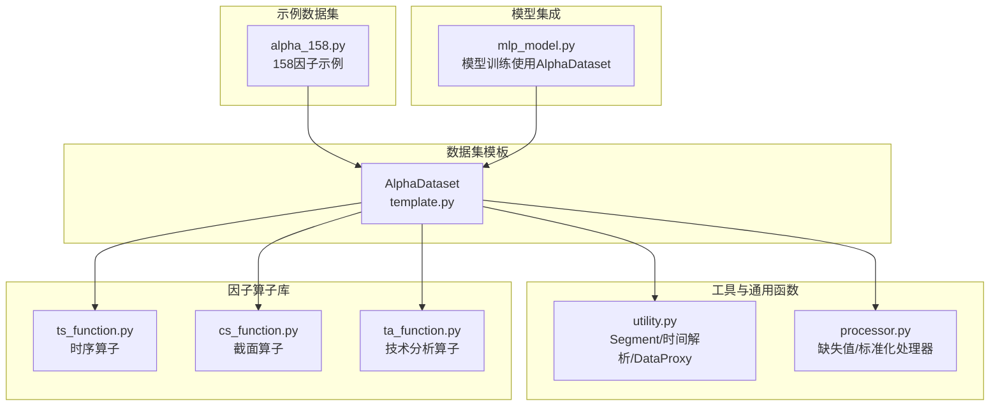
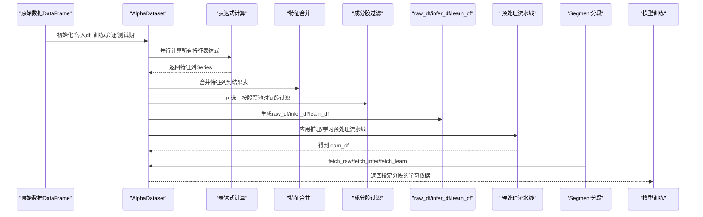
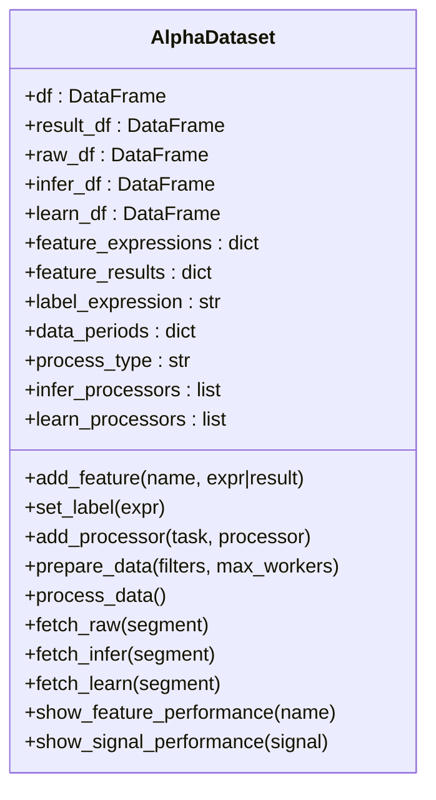
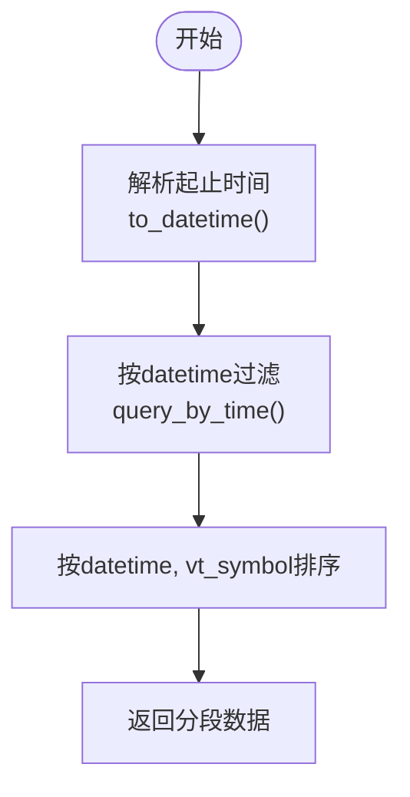
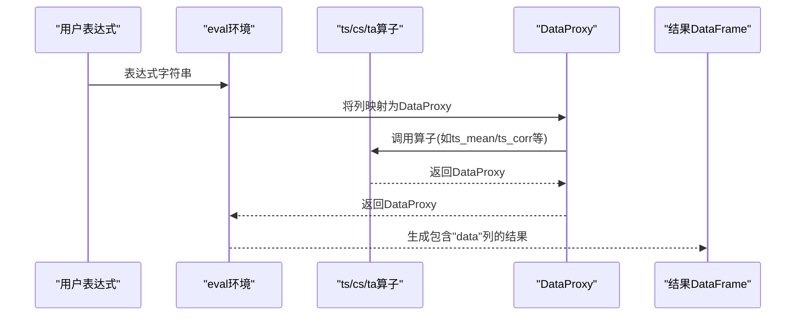
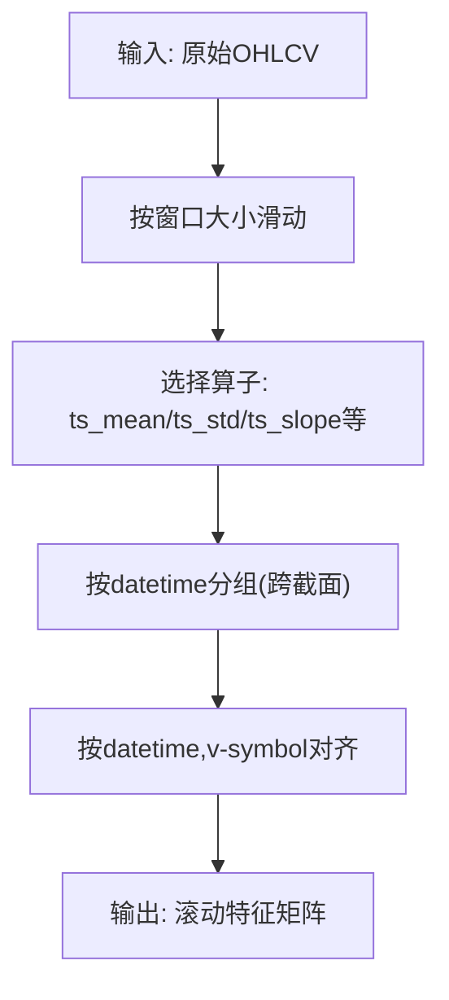
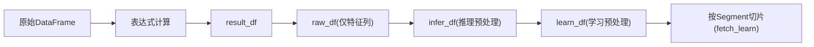
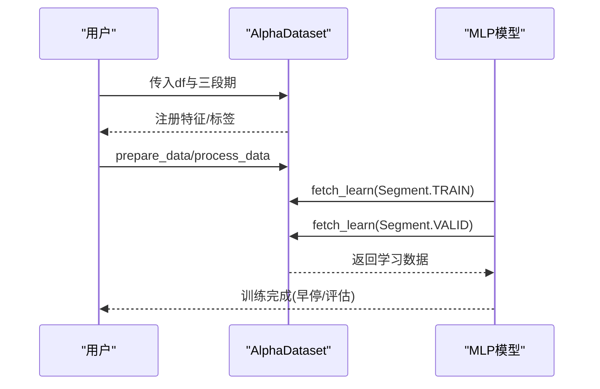
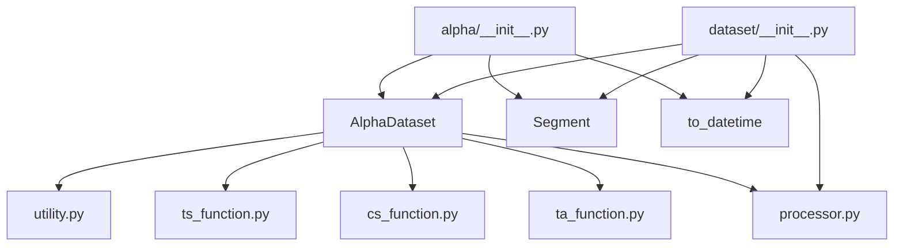

# 数据处理流程

<cite>
**本文引用的文件**
- [vnpy/alpha/dataset/__init__.py](file://vnpy/alpha/dataset/__init__.py)
- [vnpy/alpha/dataset/template.py](file://vnpy/alpha/dataset/template.py)
- [vnpy/alpha/dataset/utility.py](file://vnpy/alpha/dataset/utility.py)
- [vnpy/alpha/dataset/ts_function.py](file://vnpy/alpha/dataset/ts_function.py)
- [vnpy/alpha/dataset/cs_function.py](file://vnpy/alpha/dataset/cs_function.py)
- [vnpy/alpha/dataset/ta_function.py](file://vnpy/alpha/dataset/ta_function.py)
- [vnpy/alpha/dataset/processor.py](file://vnpy/alpha/dataset/processor.py)
- [vnpy/alpha/dataset/datasets/alpha_158.py](file://vnpy/alpha/dataset/datasets/alpha_158.py)
- [vnpy/alpha/model/models/mlp_model.py](file://vnpy/alpha/model/models/mlp_model.py)
- [vnpy/alpha/__init__.py](file://vnpy/alpha/__init__.py)
</cite>

## 目录
1. [简介](#简介)
2. [项目结构](#项目结构)
3. [核心组件](#核心组件)
4. [架构总览](#架构总览)
5. [详细组件分析](#详细组件分析)
6. [依赖关系分析](#依赖关系分析)
7. [性能考量](#性能考量)
8. [故障排查指南](#故障排查指南)
9. [结论](#结论)
10. [附录](#附录)

## 简介
本文件系统性阐述 vnpy.alpha.dataset 模块从原始数据到因子特征的完整处理流程，重点围绕 AlphaDataset 类如何组织因子计算管道，涵盖数据加载、时间对齐、Segment 分段处理、时间解析 to_datetime 等关键步骤；结合实际代码示例展示多阶段因子流水线的构建方式，解释数据在各阶段的形态变化与索引管理机制；深入说明 Segment 工具在时间切片与滚动窗口中的应用方法，并给出通过配置实现训练集、验证集、测试集划分的实践路径；最后提供异常处理策略、数据一致性校验机制以及大规模数据处理的性能调优建议。

## 项目结构
该模块采用“模板+工具+函数库”的分层设计：
- 模板层：AlphaDataset 提供统一的数据准备、处理与分段查询接口
- 工具层：utility 定义 Segment 枚举、时间解析 to_datetime、表达式计算代理 DataProxy
- 函数库：ts_function（时序）、cs_function（截面）、ta_function（技术分析）提供可组合的因子算子
- 预处理处理器：processor 提供缺失值处理、跨截面标准化等常见预处理流程
- 示例数据集：datasets/alpha_158.py 展示了如何基于表达式快速构建因子族

图表来源
- [vnpy/alpha/dataset/template.py](file://vnpy/alpha/dataset/template.py#L1-L304)
- [vnpy/alpha/dataset/utility.py](file://vnpy/alpha/dataset/utility.py#L1-L183)
- [vnpy/alpha/dataset/ts_function.py](file://vnpy/alpha/dataset/ts_function.py#L1-L227)
- [vnpy/alpha/dataset/cs_function.py](file://vnpy/alpha/dataset/cs_function.py#L1-L38)
- [vnpy/alpha/dataset/ta_function.py](file://vnpy/alpha/dataset/ta_function.py#L1-L43)
- [vnpy/alpha/dataset/processor.py](file://vnpy/alpha/dataset/processor.py#L1-L126)
- [vnpy/alpha/dataset/datasets/alpha_158.py](file://vnpy/alpha/dataset/datasets/alpha_158.py#L1-L131)
- [vnpy/alpha/model/models/mlp_model.py](file://vnpy/alpha/model/models/mlp_model.py#L137-L289)

章节来源
- [vnpy/alpha/dataset/__init__.py](file://vnpy/alpha/dataset/__init__.py#L1-L22)
- [vnpy/alpha/dataset/template.py](file://vnpy/alpha/dataset/template.py#L1-L304)
- [vnpy/alpha/dataset/utility.py](file://vnpy/alpha/dataset/utility.py#L1-L183)

## 核心组件
- AlphaDataset：统一的数据准备、特征计算、预处理、分段查询与性能分析入口
- Segment：训练/验证/测试三段枚举，配合时间区间配置实现数据划分
- to_datetime：字符串或日期对象的时间解析器
- DataProxy：表达式计算代理，支持列级运算与组合
- 时序/截面/技术分析算子：提供 ts_*、cs_*、ta_* 可组合的因子算子
- 预处理处理器：process_drop_na、process_fill_na、process_cs_norm、process_robust_zscore_norm、process_cs_rank_norm

章节来源
- [vnpy/alpha/dataset/template.py](file://vnpy/alpha/dataset/template.py#L23-L304)
- [vnpy/alpha/dataset/utility.py](file://vnpy/alpha/dataset/utility.py#L164-L183)
- [vnpy/alpha/dataset/ts_function.py](file://vnpy/alpha/dataset/ts_function.py#L1-L227)
- [vnpy/alpha/dataset/cs_function.py](file://vnpy/alpha/dataset/cs_function.py#L1-L38)
- [vnpy/alpha/dataset/ta_function.py](file://vnpy/alpha/dataset/ta_function.py#L1-L43)
- [vnpy/alpha/dataset/processor.py](file://vnpy/alpha/dataset/processor.py#L1-L126)

## 架构总览
下图展示了从原始数据到学习数据的端到端流程，包括表达式特征计算、过滤、预处理、分段查询与模型训练集成。

图表来源
- [vnpy/alpha/dataset/template.py](file://vnpy/alpha/dataset/template.py#L90-L171)
- [vnpy/alpha/dataset/utility.py](file://vnpy/alpha/dataset/utility.py#L111-L162)
- [vnpy/alpha/model/models/mlp_model.py](file://vnpy/alpha/model/models/mlp_model.py#L166-L184)

## 详细组件分析

### AlphaDataset 类与因子计算管道
- 表达式注册与并行计算
  - add_feature 支持两种输入：表达式字符串或外部已计算的 DataFrame 结果
  - prepare_data 会将所有表达式并行计算，使用多进程池与进度条
  - 计算完成后将结果列合并回主表，并确保列顺序与索引排序
- 原始数据与分段数据
  - prepare_data 生成 result_df、raw_df、infer_df、learn_df
  - fetch_raw/fetch_infer/fetch_learn 基于 Segment 和 data_periods 进行时间切片
- 预处理流水线
  - add_processor 将推理/学习阶段的处理器分别加入流水线
  - process_data 先执行推理流水线，再根据 process_type 决定是否将推理结果复制为学习数据，随后执行学习流水线
- 性能分析
  - show_feature_performance 与 show_signal_performance 调用 alphalens 接口进行因子表现分析

图表来源
- [vnpy/alpha/dataset/template.py](file://vnpy/alpha/dataset/template.py#L23-L304)

章节来源
- [vnpy/alpha/dataset/template.py](file://vnpy/alpha/dataset/template.py#L58-L171)
- [vnpy/alpha/dataset/template.py](file://vnpy/alpha/dataset/template.py#L172-L304)

### 时间解析与分段查询
- to_datetime 支持字符串与 datetime 对象，自动识别格式并转换
- query_by_time 与 fetch_* 方法共同完成时间切片
- Segment 枚举定义 TRAIN/VALID/TEST，配合 data_periods 实现三段划分

图表来源
- [vnpy/alpha/dataset/utility.py](file://vnpy/alpha/dataset/utility.py#L164-L183)
- [vnpy/alpha/dataset/template.py](file://vnpy/alpha/dataset/template.py#L272-L285)
- [vnpy/alpha/dataset/template.py](file://vnpy/alpha/dataset/template.py#L172-L191)

章节来源
- [vnpy/alpha/dataset/utility.py](file://vnpy/alpha/dataset/utility.py#L164-L183)
- [vnpy/alpha/dataset/template.py](file://vnpy/alpha/dataset/template.py#L272-L285)
- [vnpy/alpha/dataset/template.py](file://vnpy/alpha/dataset/template.py#L172-L191)

### 表达式计算与 DataProxy
- DataProxy 将单列数据包装为可运算对象，支持加减乘除、比较、绝对值等操作
- calculate_by_expression 动态导入 ts/cs/ta 算子，将列名映射为 DataProxy，最终通过 eval 执行表达式
- calculate_by_polars 直接使用 Polars 表达式进行计算

图表来源
- [vnpy/alpha/dataset/utility.py](file://vnpy/alpha/dataset/utility.py#L111-L162)
- [vnpy/alpha/dataset/ts_function.py](file://vnpy/alpha/dataset/ts_function.py#L1-L227)
- [vnpy/alpha/dataset/cs_function.py](file://vnpy/alpha/dataset/cs_function.py#L1-L38)
- [vnpy/alpha/dataset/ta_function.py](file://vnpy/alpha/dataset/ta_function.py#L1-L43)

章节来源
- [vnpy/alpha/dataset/utility.py](file://vnpy/alpha/dataset/utility.py#L111-L162)
- [vnpy/alpha/dataset/ts_function.py](file://vnpy/alpha/dataset/ts_function.py#L1-L227)
- [vnpy/alpha/dataset/cs_function.py](file://vnpy/alpha/dataset/cs_function.py#L1-L38)
- [vnpy/alpha/dataset/ta_function.py](file://vnpy/alpha/dataset/ta_function.py#L1-L43)

### Segment 在时间切片与滚动窗口中的应用
- 时间切片：通过 Segment + data_periods + query_by_time 实现训练/验证/测试期的精确切片
- 滚动窗口：ts_function 中的 ts_* 系列算子提供滚动最小/最大、均值、标准差、斜率、R²、残差、相关性、分位数、排名等，均以 vt_symbol 分组、datetime 排序的 over("datetime") 方式实现跨截面归一化与时间序列平滑
- 示例：Alpha158 使用 ts_delay、ts_mean、ts_std、ts_slope、ts_rsquare、ts_resi、ts_rank、ts_argmax/argmin、ts_corr 等构建多窗口滚动特征

图表来源
- [vnpy/alpha/dataset/ts_function.py](file://vnpy/alpha/dataset/ts_function.py#L1-L227)
- [vnpy/alpha/dataset/datasets/alpha_158.py](file://vnpy/alpha/dataset/datasets/alpha_158.py#L24-L131)

章节来源
- [vnpy/alpha/dataset/ts_function.py](file://vnpy/alpha/dataset/ts_function.py#L1-L227)
- [vnpy/alpha/dataset/datasets/alpha_158.py](file://vnpy/alpha/dataset/datasets/alpha_158.py#L24-L131)

### 多阶段因子流水线构建与数据形态变化
- 形态变化链路
  - 原始 DataFrame → result_df（表达式计算后）→ raw_df（仅保留特征列并排序）→ infer_df（推理预处理）→ learn_df（学习预处理）
- 流水线类型
  - 推理流水线：用于信号生成与回测
  - 学习流水线：用于模型训练与评估
- 切片与索引
  - 所有阶段均以 ["datetime", "vt_symbol"] 作为稳定索引，保证跨合约与跨时间的一致性
  - 分段查询通过 query_by_time 在指定时间范围内返回数据

图表来源
- [vnpy/alpha/dataset/template.py](file://vnpy/alpha/dataset/template.py#L90-L171)
- [vnpy/alpha/dataset/template.py](file://vnpy/alpha/dataset/template.py#L172-L191)

章节来源
- [vnpy/alpha/dataset/template.py](file://vnpy/alpha/dataset/template.py#L90-L171)
- [vnpy/alpha/dataset/template.py](file://vnpy/alpha/dataset/template.py#L172-L191)

### 训练/验证/测试集划分与模型集成
- 划分方式
  - 通过构造函数传入 train_period、valid_period、test_period，内部以 Segment 与 data_periods 映射
  - fetch_learn(Segment.TRAIN/VALID/TEST) 返回对应时间段的学习数据
- 模型集成
  - MLP 模型在 fit 中分别获取 TRAIN/VALID 数据，提取特征矩阵与标签向量，实现早停与评估

图表来源
- [vnpy/alpha/dataset/datasets/alpha_158.py](file://vnpy/alpha/dataset/datasets/alpha_158.py#L1-L131)
- [vnpy/alpha/model/models/mlp_model.py](file://vnpy/alpha/model/models/mlp_model.py#L137-L203)
- [vnpy/alpha/dataset/template.py](file://vnpy/alpha/dataset/template.py#L44-L48)
- [vnpy/alpha/dataset/template.py](file://vnpy/alpha/dataset/template.py#L172-L191)

章节来源
- [vnpy/alpha/dataset/datasets/alpha_158.py](file://vnpy/alpha/dataset/datasets/alpha_158.py#L1-L131)
- [vnpy/alpha/model/models/mlp_model.py](file://vnpy/alpha/model/models/mlp_model.py#L137-L203)
- [vnpy/alpha/dataset/template.py](file://vnpy/alpha/dataset/template.py#L44-L48)
- [vnpy/alpha/dataset/template.py](file://vnpy/alpha/dataset/template.py#L172-L191)

## 依赖关系分析
- 模块导出
  - dataset/__init__.py 导出 AlphaDataset、Segment、to_datetime 以及各类预处理处理器
  - alpha/__init__.py 将 AlphaDataset、Segment、to_datetime 暴露给上层模块
- 组件耦合
  - AlphaDataset 依赖 utility 的 Segment、to_datetime、DataProxy 与计算函数
  - ts/cs/ta 算子通过 utility 的 DataProxy 串联，形成可组合的因子算子生态
  - 预处理处理器独立于 AlphaDataset，便于复用与替换

图表来源
- [vnpy/alpha/dataset/__init__.py](file://vnpy/alpha/dataset/__init__.py#L1-L22)
- [vnpy/alpha/__init__.py](file://vnpy/alpha/__init__.py#L1-L17)

章节来源
- [vnpy/alpha/dataset/__init__.py](file://vnpy/alpha/dataset/__init__.py#L1-L22)
- [vnpy/alpha/__init__.py](file://vnpy/alpha/__init__.py#L1-L17)

## 性能考量
- 并行计算
  - prepare_data 使用多进程池并行计算表达式，建议根据 CPU 核心数设置 max_workers
- 缺失值与空值处理
  - 先将 NaN 转换为 None 再 drop_nulls，避免后续算子出现异常
- 跨截面归一化
  - process_cs_norm 与 process_robust_zscore_norm 基于 over("datetime") 实现，注意 clip_outlier 与 mad/std 的边界处理
- 滚动窗口
  - ts_function 中的 rolling_* 算子默认 min_samples=1，避免首窗缺失；合理设置窗口大小以平衡信息量与噪声
- 数据对齐
  - 始终以 ["datetime", "vt_symbol"] 作为稳定索引，减少 join 与对齐成本
- I/O 与持久化
  - 训练完成后可将 AlphaDataset 或 learn_df 保存以便复用，避免重复计算

[本节为通用性能建议，不直接分析具体文件]

## 故障排查指南
- 表达式语法错误
  - 使用 DataProxy 包装列名，确保变量名与列名一致；避免在表达式中混用数值与列名顺序不当
- 时间格式问题
  - to_datetime 自动识别 "YYYY-MM-DD" 与 "YYYYMMDD"，若传入字符串需确保格式一致
- 空值与无穷大
  - 预处理阶段先 fill_nan(None)，再 drop_nulls；ts_corr 中对无穷大进行过滤
- 分段数据为空
  - 检查 data_periods 的起止时间是否覆盖目标数据范围；确认 ["datetime", "vt_symbol"] 索引是否存在
- 多进程异常
  - prepare_data 使用 spawn 上下文，确保表达式计算函数可被序列化；必要时降低 max_workers

章节来源
- [vnpy/alpha/dataset/utility.py](file://vnpy/alpha/dataset/utility.py#L111-L162)
- [vnpy/alpha/dataset/processor.py](file://vnpy/alpha/dataset/processor.py#L1-L126)
- [vnpy/alpha/dataset/ts_function.py](file://vnpy/alpha/dataset/ts_function.py#L159-L174)
- [vnpy/alpha/dataset/template.py](file://vnpy/alpha/dataset/template.py#L90-L171)

## 结论
vnpy.alpha.dataset 通过 AlphaDataset 将表达式驱动的因子工程、跨截面与时间序列算子、预处理流水线与分段查询有机整合，形成从原始数据到可训练特征的完整管线。借助 Segment 与时间解析工具，能够清晰地划分训练/验证/测试集；通过 DataProxy 与 Polars 表达式，实现高可读性的因子表达式与高性能的计算。结合预处理处理器与模型集成，可在大规模数据场景下高效完成因子研发与模型训练。

[本节为总结性内容，不直接分析具体文件]

## 附录
- 快速上手步骤
  - 准备原始 OHLCV 数据（含 datetime、vt_symbol、价格与成交量等列）
  - 创建 AlphaDataset 实例，传入训练/验证/测试期
  - 使用 add_feature 注册表达式或 add_feature(name, result=DataFrame) 注册外部特征
  - 使用 set_label 设置标签表达式
  - 调用 prepare_data 并行计算特征，process_data 应用预处理流水线
  - 使用 fetch_learn(Segment.TRAIN/VALID/TEST) 获取分段学习数据
  - 将数据交给模型进行训练与评估

章节来源
- [vnpy/alpha/dataset/datasets/alpha_158.py](file://vnpy/alpha/dataset/datasets/alpha_158.py#L1-L131)
- [vnpy/alpha/dataset/template.py](file://vnpy/alpha/dataset/template.py#L58-L171)
- [vnpy/alpha/model/models/mlp_model.py](file://vnpy/alpha/model/models/mlp_model.py#L137-L203)