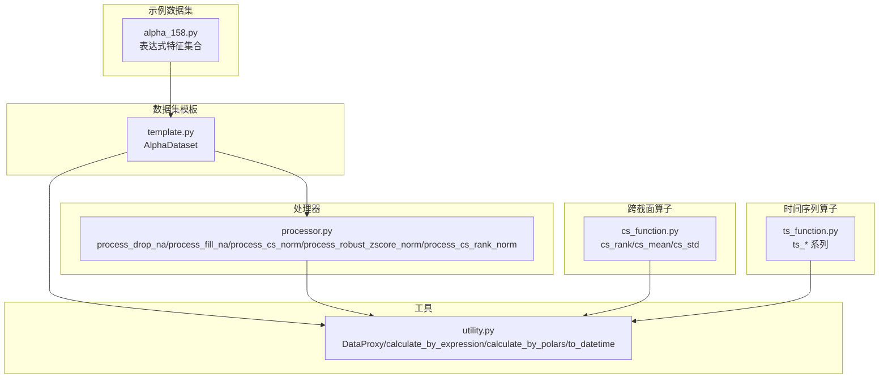
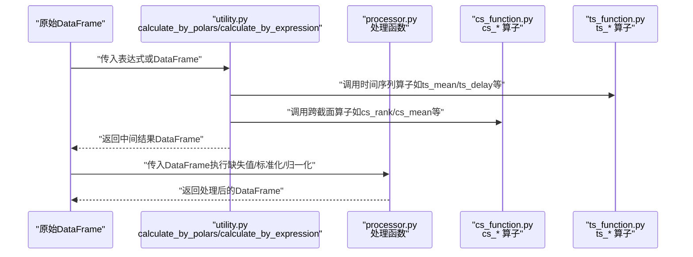
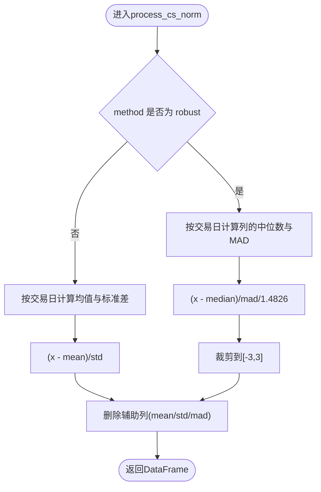
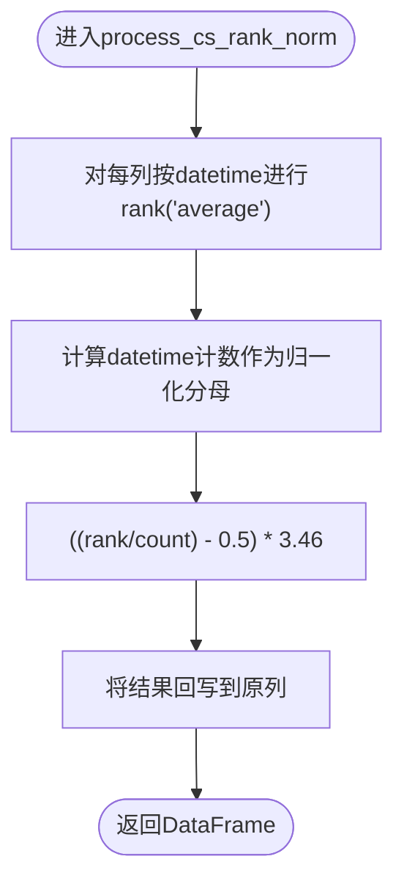
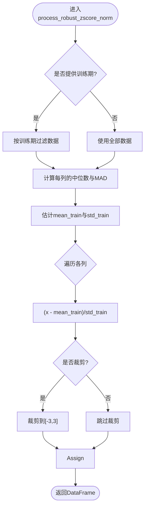
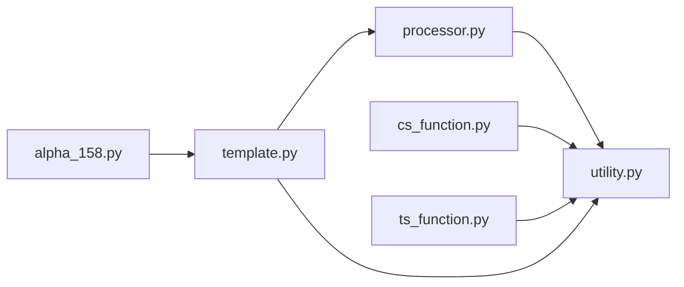

# 时间序列转换

<cite>
**本文引用的文件列表**
- [processor.py](file://vnpy/alpha/dataset/processor.py)
- [cs_function.py](file://vnpy/alpha/dataset/cs_function.py)
- [ts_function.py](file://vnpy/alpha/dataset/ts_function.py)
- [utility.py](file://vnpy/alpha/dataset/utility.py)
- [template.py](file://vnpy/alpha/dataset/template.py)
- [alpha_158.py](file://vnpy/alpha/dataset/datasets/alpha_158.py)
</cite>

## 目录
1. [引言](#引言)
2. [项目结构](#项目结构)
3. [核心组件](#核心组件)
4. [架构总览](#架构总览)
5. [详细组件分析](#详细组件分析)
6. [依赖关系分析](#依赖关系分析)
7. [性能考量](#性能考量)
8. [故障排查指南](#故障排查指南)
9. [结论](#结论)
10. [附录](#附录)

## 引言
本文件围绕vnpy alpha模块中的时间序列转换与预处理能力展开，系统性讲解以下三类关键处理：
- 缺失值处理：丢弃缺失值与填充缺失值
- 横截面标准化：基于分位数的稳健归一化与基于均值方差的Z-Score归一化
- 鲁棒Z-Score归一化：按时间窗口估计稳健统计量并进行归一化与可选的异常值裁剪

文档将从实现原理、参数配置、算法逻辑、对数据分布的影响等方面进行深入剖析，并结合Polars表达式引擎展示如何构建链式处理流水线，最后给出性能优化建议（内存控制、并行策略等）。

## 项目结构
与时间序列转换直接相关的模块位于vnpy/alpha/dataset目录下，包含数据处理、跨时序与跨截面算子、通用工具以及数据集模板等。核心文件如下：
- 处理器：processor.py（缺失值处理、横截面标准化、鲁棒Z-Score）
- 跨截面算子：cs_function.py（rank、mean、std）
- 时间序列算子：ts_function.py（delay、min/max、rank、mean/std、slope、rsquare、resi、corr、less/greater、log、abs等）
- 工具与表达式：utility.py（DataProxy、表达式求值、Polars表达式封装、时间转换）
- 数据集模板：template.py（特征表达式注册、并行计算、训练/验证/测试周期管理）
- 示例数据集：alpha_158.py（展示如何通过表达式组合生成大量技术特征）

图表来源
- [processor.py](file://vnpy/alpha/dataset/processor.py#L1-L126)
- [cs_function.py](file://vnpy/alpha/dataset/cs_function.py#L1-L38)
- [ts_function.py](file://vnpy/alpha/dataset/ts_function.py#L1-L227)
- [utility.py](file://vnpy/alpha/dataset/utility.py#L1-L183)
- [template.py](file://vnpy/alpha/dataset/template.py#L1-L304)
- [alpha_158.py](file://vnpy/alpha/dataset/datasets/alpha_158.py#L1-L131)

章节来源
- [processor.py](file://vnpy/alpha/dataset/processor.py#L1-L126)
- [cs_function.py](file://vnpy/alpha/dataset/cs_function.py#L1-L38)
- [ts_function.py](file://vnpy/alpha/dataset/ts_function.py#L1-L227)
- [utility.py](file://vnpy/alpha/dataset/utility.py#L1-L183)
- [template.py](file://vnpy/alpha/dataset/template.py#L1-L304)
- [alpha_158.py](file://vnpy/alpha/dataset/datasets/alpha_158.py#L1-L131)

## 核心组件
本节聚焦于缺失值处理与两类横截面标准化方法，以及鲁棒Z-Score归一化。它们共同构成时间序列特征工程的关键环节。

- 缺失值处理
  - process_drop_na：移除指定列在任意时间点上的缺失值；默认作用范围为除索引列外的中间列。
  - process_fill_na：对缺失值进行填充，支持全局或按列填充两种模式。

- 横截面标准化
  - process_cs_norm：支持“robust”（中位数+MAD）与“zscore”（均值+标准差）两种方法，按交易日进行分组标准化，并可选裁剪到固定范围。
  - process_cs_rank_norm：按交易日对各合约的特征值进行秩变换并线性映射到中心化区间。

- 鲁棒Z-Score归一化
  - process_robust_zscore_norm：在指定训练期内以中位数与MAD估计特征分布，随后对全量数据进行标准化，并可选裁剪异常值。

章节来源
- [processor.py](file://vnpy/alpha/dataset/processor.py#L9-L126)

## 架构总览
下图展示了从原始DataFrame到完成时间序列转换的整体流程，以及与Polars表达式引擎的交互方式。

图表来源
- [utility.py](file://vnpy/alpha/dataset/utility.py#L111-L162)
- [cs_function.py](file://vnpy/alpha/dataset/cs_function.py#L1-L38)
- [ts_function.py](file://vnpy/alpha/dataset/ts_function.py#L1-L227)
- [processor.py](file://vnpy/alpha/dataset/processor.py#L9-L126)

## 详细组件分析

### 缺失值处理：process_drop_na 与 process_fill_na
- 功能概述
  - process_drop_na：将浮点NaN显式转换为空值后按列丢弃空行，确保后续标准化不被缺失值污染。
  - process_fill_na：支持两种模式：
    - fill_label=True：对所有数值列统一填充；
    - fill_label=False：仅对除索引列外的数值列进行填充。

- 参数与行为
  - names（process_drop_na）：指定参与缺失值处理的列名列表，默认取中间列范围。
  - fill_value（process_fill_na）：用于填充的标量值。
  - fill_label（process_fill_na）：是否对标签列也进行填充。

- 对数据分布的影响
  - 丢弃缺失值会减少样本数量，可能引入样本选择偏差；适合缺失比例较低且随机缺失的场景。
  - 填充缺失值会改变分布中心与离散程度，需谨慎选择填充策略（零、前向/后向填充、列均值/中位数等），本实现提供统一标量填充。

- 性能与可用性
  - 使用Polars的批量列处理接口，避免循环迭代，提高吞吐。
  - 建议在丢弃缺失值前先评估缺失模式（随机 vs 非随机），必要时采用更复杂的插补策略。

章节来源
- [processor.py](file://vnpy/alpha/dataset/processor.py#L9-L31)

### 横截面标准化：process_cs_norm
- 功能概述
  - 在每个交易日内部对指定列进行标准化，支持两种方法：
    - robust：减去当日中位数，再除以MAD（中位绝对偏差）并乘以缩放常数，最后裁剪到固定范围。
    - zscore：减去当日均值，除以当日标准差，可选裁剪。

- 参数与行为
  - names：参与标准化的列名列表。
  - method：字符串，"robust" 或 "zscore"。
  - 输出列：原列名保持不变，robust方法还会临时引入“mad”辅助列并在完成后删除。

- 对数据分布的影响
  - robust方法对异常值不敏感，能有效降低极端值影响，适合存在厚尾或异常值的数据。
  - zscore方法假设分布近似正态，对异常值敏感，但计算简单、解释性强。

- 实现要点
  - 使用Polars的窗口函数over("datetime")在交易日维度内计算统计量，保证跨合约间可比性。
  - robust方法中MAD的缩放常数与裁剪范围是经验设定，可根据下游模型需求调整。

图表来源
- [processor.py](file://vnpy/alpha/dataset/processor.py#L34-L74)

章节来源
- [processor.py](file://vnpy/alpha/dataset/processor.py#L34-L74)

### 横截面秩归一化：process_cs_rank_norm
- 功能概述
  - 对每个交易日内的各合约特征值进行秩变换，得到0~1区间的排名，再线性映射到中心化区间，常用于消除量纲差异与非线性关系。

- 参数与行为
  - names：参与秩归一化的列名列表。
  - 映射公式：(rank/计数 - 0.5) * 3.46，其中3.46约为标准正态分布的分位数尺度因子，使秩归一化近似标准正态。

- 对数据分布的影响
  - 将任意分布映射为近似对称分布，显著降低量纲差异与偏度影响，提升模型稳定性与可解释性。
  - 对异常值不敏感，鲁棒性强。

- 实现要点
  - 使用Polars的rank("average")与over("datetime")实现日内平均秩，避免跨日比较导致的偏移。
  - 通过别名覆盖原列，保持列名一致性。

图表来源
- [processor.py](file://vnpy/alpha/dataset/processor.py#L112-L126)

章节来源
- [processor.py](file://vnpy/alpha/dataset/processor.py#L112-L126)

### 鲁棒Z-Score归一化：process_robust_zscore_norm
- 功能概述
  - 在指定训练期内以中位数与MAD估计分布参数，随后对全量数据进行标准化；可选裁剪异常值，避免极端值影响模型训练。

- 参数与行为
  - fit_start_time/fit_end_time：训练期起止时间（字符串或datetime），若提供则仅在该窗口内估计统计量。
  - clip_outlier：是否对标准化结果进行裁剪。
  - 输出列：原列名保持不变，覆盖为标准化后的数值。

- 对数据分布的影响
  - 训练期估计稳健统计量，避免异常值干扰；标准化后近似零均值、单位方差的分布，有利于某些模型收敛与正则化效果。

- 实现要点
  - 使用NumPy的nanmedian/nanmedian实现稳健估计，并添加极小常数避免除零。
  - 将估计结果广播到各列，逐列应用标准化与可选裁剪，保持列名一致。

图表来源
- [processor.py](file://vnpy/alpha/dataset/processor.py#L77-L109)

章节来源
- [processor.py](file://vnpy/alpha/dataset/processor.py#L77-L109)

### 与Polars表达式引擎的集成
- 表达式求值
  - utility.calculate_by_expression：将原始DataFrame的各列包装为DataProxy对象，解析表达式字符串并通过eval执行，最终返回包含新列的DataFrame。
  - utility.calculate_by_polars：直接接受Polars表达式，返回包含新列的DataFrame，便于链式构建复杂管道。

- 与时间序列/跨截面算子协作
  - ts_function与cs_function提供丰富的窗口与分组计算能力，可在表达式中直接调用，形成端到端的特征工程流水线。

- 示例数据集
  - alpha_158.py通过表达式组合生成大量技术特征，展示如何在AlphaDataset中注册表达式并并行计算。

章节来源
- [utility.py](file://vnpy/alpha/dataset/utility.py#L111-L162)
- [ts_function.py](file://vnpy/alpha/dataset/ts_function.py#L1-L227)
- [cs_function.py](file://vnpy/alpha/dataset/cs_function.py#L1-L38)
- [alpha_158.py](file://vnpy/alpha/dataset/datasets/alpha_158.py#L1-L131)

## 依赖关系分析
- 组件耦合
  - processor.py依赖utility.to_datetime进行时间转换，依赖Polars进行窗口分组与向量化计算。
  - cs_function与ts_function通过utility.DataProxy封装数据，便于表达式求值与算子组合。
  - template.py通过并行池与表达式求值函数实现大规模特征的高效生成。

图表来源
- [processor.py](file://vnpy/alpha/dataset/processor.py#L1-L126)
- [utility.py](file://vnpy/alpha/dataset/utility.py#L1-L183)
- [cs_function.py](file://vnpy/alpha/dataset/cs_function.py#L1-L38)
- [ts_function.py](file://vnpy/alpha/dataset/ts_function.py#L1-L227)
- [template.py](file://vnpy/alpha/dataset/template.py#L1-L304)
- [alpha_158.py](file://vnpy/alpha/dataset/datasets/alpha_158.py#L1-L131)

章节来源
- [processor.py](file://vnpy/alpha/dataset/processor.py#L1-L126)
- [utility.py](file://vnpy/alpha/dataset/utility.py#L1-L183)
- [cs_function.py](file://vnpy/alpha/dataset/cs_function.py#L1-L38)
- [ts_function.py](file://vnpy/alpha/dataset/ts_function.py#L1-L227)
- [template.py](file://vnpy/alpha/dataset/template.py#L1-L304)
- [alpha_158.py](file://vnpy/alpha/dataset/datasets/alpha_158.py#L1-L131)

## 性能考量
- 内存使用控制
  - 使用with_columns与over分组计算，避免显式循环与中间DataFrame复制，降低内存峰值。
  - robust方法在计算MAD时临时引入辅助列，注意及时drop以释放内存。
  - 对大字段集进行分批处理，避免一次性创建过多列。

- 并行处理策略
  - template.py通过多进程池并行计算多个表达式特征，显著缩短特征生成时间。
  - 建议将高开销算子（如滚动回归、相关性）拆分为独立任务，避免单核瓶颈。

- I/O与缓存
  - 在表达式求值前尽量减少列数量，仅保留必要列，降低I/O压力。
  - 对重复使用的中间结果进行持久化或复用，避免重复计算。

- 数值稳定性
  - robust方法在标准差估计中加入极小常数，防止除零；建议在其他归一化中同样加入稳定项。
  - 裁剪异常值有助于提升模型鲁棒性，但需权衡信息损失。

[本节为通用指导，无需列出具体文件来源]

## 故障排查指南
- 缺失值处理
  - 症状：标准化后出现NaN或无穷大。
  - 排查：确认是否先执行process_drop_na或process_fill_na；检查列类型与索引列命名是否正确。
  - 参考路径：[processor.py](file://vnpy/alpha/dataset/processor.py#L9-L31)

- 横截面标准化
  - 症状：robust方法输出全为0或无穷大。
  - 排查：检查MAD估计是否为0（可能整列相同或极少数非空值）；确认datetime分组是否正确。
  - 参考路径：[processor.py](file://vnpy/alpha/dataset/processor.py#L34-L74)

- 鲁棒Z-Score归一化
  - 症状：训练期估计与全量不一致。
  - 排查：确认fit_start_time/fit_end_time格式与to_datetime转换逻辑；检查列顺序与索引列是否匹配。
  - 参考路径：[processor.py](file://vnpy/alpha/dataset/processor.py#L77-L109)，[utility.py](file://vnpy/alpha/dataset/utility.py#L164-L175)

- 表达式求值
  - 症状：表达式执行报错或结果列名不一致。
  - 排查：确认DataProxy包装与列重命名逻辑；检查表达式字符串拼接与列名冲突。
  - 参考路径：[utility.py](file://vnpy/alpha/dataset/utility.py#L111-L162)

章节来源
- [processor.py](file://vnpy/alpha/dataset/processor.py#L9-L126)
- [utility.py](file://vnpy/alpha/dataset/utility.py#L111-L175)

## 结论
- 缺失值处理与横截面标准化是时间序列特征工程的核心步骤。process_drop_na与process_fill_na分别适用于不同缺失模式；process_cs_norm与process_cs_rank_norm在消除量纲差异、提升模型稳定性方面各有优势；process_robust_zscore_norm通过稳健统计量估计进一步增强鲁棒性。
- 依托Polars表达式引擎，可以将上述处理函数与ts_function、cs_function无缝组合，构建高性能、可读性强的特征流水线。
- 实践中应结合数据分布特性与下游模型需求选择合适的标准化策略，并通过并行与内存优化提升整体效率。

[本节为总结性内容，无需列出具体文件来源]

## 附录
- 使用建议
  - 先进行缺失值处理，再进行横截面标准化，最后考虑鲁棒Z-Score归一化。
  - 在训练期与测试期分别估计稳健参数，避免数据泄露。
  - 对异常值进行裁剪时，建议记录裁剪阈值以便复现与调试。

[本节为补充说明，无需列出具体文件来源]