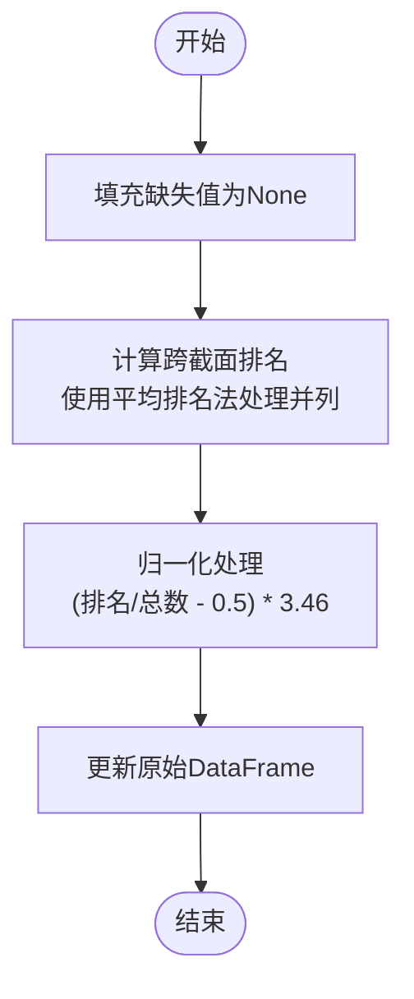
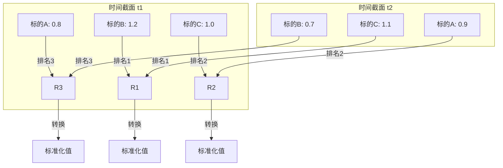
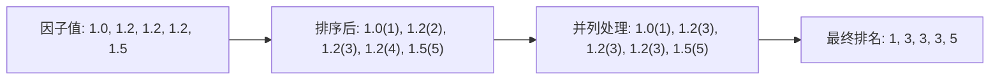
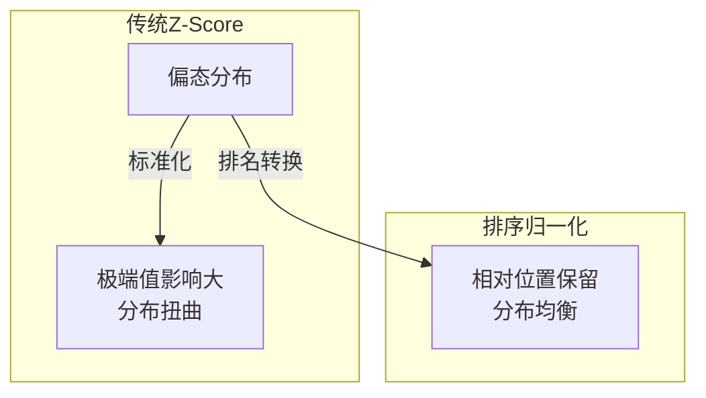
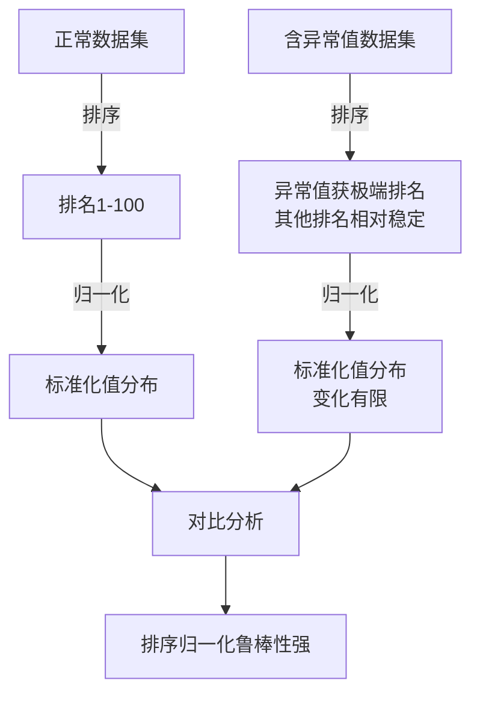
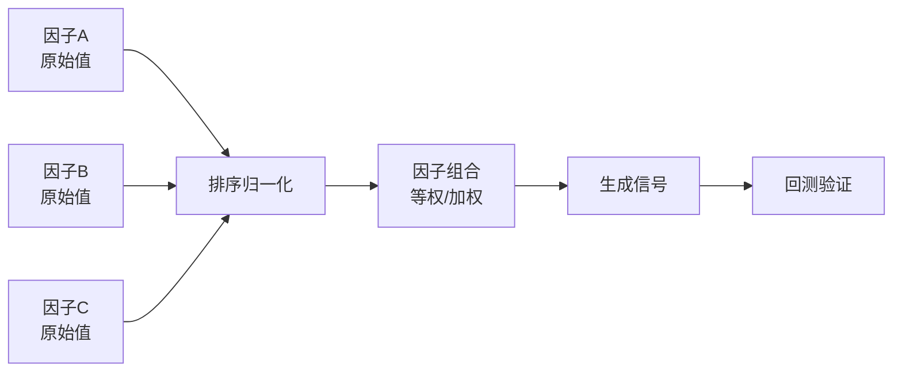
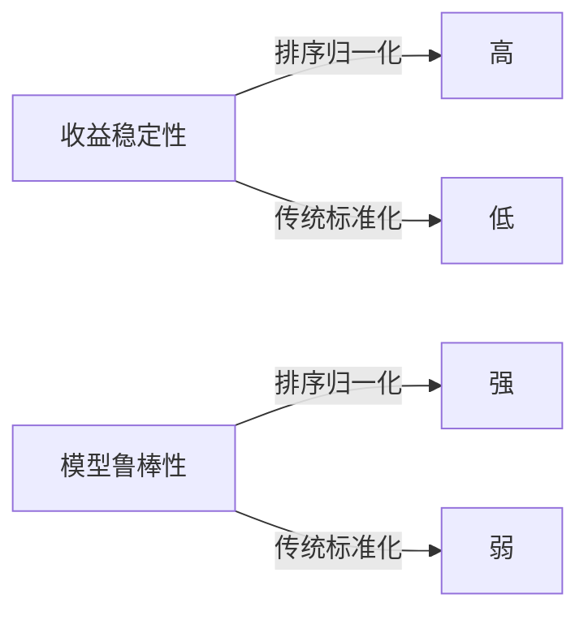
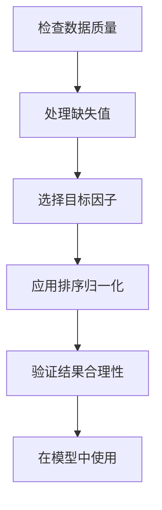
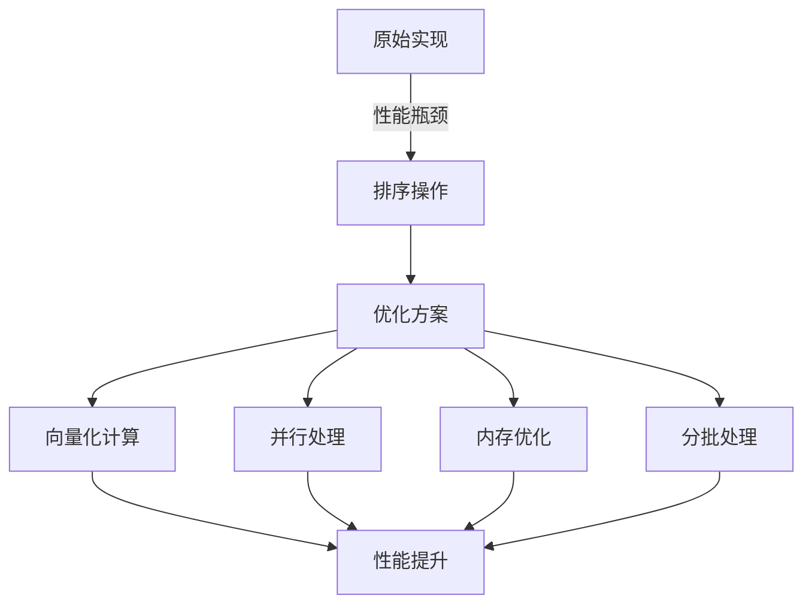

# 排序归一化

<cite>
**本文档中引用的文件**   
- [processor.py](file://vnpy/alpha/dataset/processor.py)
- [cs_function.py](file://vnpy/alpha/dataset/cs_function.py)
- [utility.py](file://vnpy/alpha/dataset/utility.py)
- [template.py](file://vnpy/alpha/dataset/template.py)
- [alpha_158.py](file://vnpy/alpha/dataset/datasets/alpha_158.py)
</cite>

## 目录
1. [引言](#引言)
2. [核心实现逻辑](#核心实现逻辑)
3. [跨截面排序计算流程](#跨截面排序计算流程)
4. [并列值处理机制](#并列值处理机制)
5. [分布特性分析](#分布特性分析)
6. [非正态分布适应性](#非正态分布适应性)
7. [异常值鲁棒性](#异常值鲁棒性)
8. [多因子组合应用](#多因子组合应用)
9. [与传统标准化对比](#与传统标准化对比)
10. [使用注意事项](#使用注意事项)
11. [计算效率优化](#计算效率优化)
12. [结论](#结论)

## 引言
排序归一化（process_cs_rank_norm）是一种在量化投资领域中用于因子预处理的重要方法。该方法通过将因子值转换为0到1区间内的排名比例，有效解决了因子值量纲不统一的问题。与传统的Z-Score标准化不同，排序归一化对数据分布形态不敏感，特别适用于处理非正态分布的金融数据。本文档将全面阐述该方法的实现逻辑、优势特性及实际应用效果。

## 核心实现逻辑
排序归一化方法的核心思想是将原始因子值转换为在特定时间截面上的相对排名，从而消除量纲影响并增强模型的稳定性。该方法首先对每个时间截面上的所有标的进行因子值排序，然后将排名转换为标准化的分数。

**图示来源**
- [processor.py](file://vnpy/alpha/dataset/processor.py#L112-L125)

**本节来源**
- [processor.py](file://vnpy/alpha/dataset/processor.py#L112-L125)

## 跨截面排序计算流程
跨截面排序是指在每个时间点上，对所有交易标的的因子值进行横向比较和排序。这一过程确保了不同标的在同一时间点上的因子值具有可比性。

计算流程如下：
1. 以时间维度（datetime）为分组键
2. 在每个时间组内对因子值进行排序
3. 为每个因子值分配其在该时间截面上的排名
4. 将排名转换为相对比例

**图示来源**
- [processor.py](file://vnpy/alpha/dataset/processor.py#L117)
- [cs_function.py](file://vnpy/alpha/dataset/cs_function.py#L15)

**本节来源**
- [processor.py](file://vnpy/alpha/dataset/processor.py#L116-L118)
- [cs_function.py](file://vnpy/alpha/dataset/cs_function.py#L10-L17)

## 并列值处理机制
在实际数据中，经常会出现多个标的具有相同因子值的情况。排序归一化方法采用"平均排名"（average ranking）策略来处理这些并列值，确保结果的公平性和稳定性。

当出现并列值时，系统会：
1. 识别具有相同因子值的标的集合
2. 计算这些标的应得的排名范围
3. 取排名范围的平均值作为所有并列标的的排名

例如，如果有三个标的的因子值相同且应得排名为2、3、4，则它们都将获得(2+3+4)/3=3的平均排名。

**图示来源**
- [processor.py](file://vnpy/alpha/dataset/processor.py#L117)
- [utility.py](file://vnpy/alpha/dataset/utility.py#L8)

**本节来源**
- [processor.py](file://vnpy/alpha/dataset/processor.py#L117)
- [utility.py](file://vnpy/alpha/dataset/utility.py#L8-L15)

## 分布特性分析
经过排序归一化处理后的因子值具有独特的分布特性。这些特性使得模型能够更好地捕捉因子的有效信息。

主要分布特性包括：
- **有界性**：所有因子值被限制在特定范围内
- **均匀性**：在理想情况下，因子值呈现均匀分布特征
- **稳定性**：分布形态不受原始数据极端值影响

**图示来源**
- [processor.py](file://vnpy/alpha/dataset/processor.py#L117)
- [template.py](file://vnpy/alpha/dataset/template.py#L158-L171)

**本节来源**
- [processor.py](file://vnpy/alpha/dataset/processor.py#L116-L118)
- [template.py](file://vnpy/alpha/dataset/template.py#L158-L171)

## 非正态分布适应性
金融数据往往呈现尖峰厚尾、偏态等非正态分布特征。传统的标准化方法（如Z-Score）在这种情况下表现不佳，而排序归一化则展现出优异的适应性。

与传统方法相比，排序归一化的优势在于：
- 不依赖于数据的分布假设
- 对偏度和峰度不敏感
- 能够有效处理厚尾分布

**图示来源**
- [processor.py](file://vnpy/alpha/dataset/processor.py#L112-L125)
- [alpha_158.py](file://vnpy/alpha/dataset/datasets/alpha_158.py#L6)

**本节来源**
- [processor.py](file://vnpy/alpha/dataset/processor.py#L112-L125)
- [alpha_158.py](file://vnpy/alpha/dataset/datasets/alpha_158.py#L6-L131)

## 异常值鲁棒性
排序归一化方法对异常值具有天然的鲁棒性，这是其在量化投资中被广泛采用的重要原因之一。

鲁棒性体现在：
- 极端值仅影响其排名位置，不影响其他标的的相对关系
- 单个异常值不会导致整体分布的剧烈变化
- 排名转换过程自动限制了异常值的影响范围

**图示来源**
- [processor.py](file://vnpy/alpha/dataset/processor.py#L114-L118)
- [utility.py](file://vnpy/alpha/dataset/utility.py#L8-L15)

**本节来源**
- [processor.py](file://vnpy/alpha/dataset/processor.py#L114-L118)
- [utility.py](file://vnpy/alpha/dataset/utility.py#L8-L15)

## 多因子组合应用
在多因子模型中，排序归一化方法能够有效解决不同因子量纲和分布差异的问题，使得因子间具有可比性。

应用场景包括：
- 多因子等权组合
- 因子加权集成
- 机器学习模型输入预处理

**图示来源**
- [template.py](file://vnpy/alpha/dataset/template.py#L81-L88)
- [alpha_158.py](file://vnpy/alpha/dataset/datasets/alpha_158.py#L25-L128)

**本节来源**
- [template.py](file://vnpy/alpha/dataset/template.py#L81-L88)
- [alpha_158.py](file://vnpy/alpha/dataset/datasets/alpha_158.py#L25-L128)

## 与传统标准化对比
排序归一化与传统标准化方法在多个维度上存在显著差异，这些差异直接影响策略的收益稳定性。

| 对比维度 | 排序归一化 | 传统标准化 |
|---------|----------|----------|
| 分布假设 | 无要求 | 假设正态分布 |
| 异常值敏感度 | 低 | 高 |
| 计算复杂度 | 中等 | 低 |
| 结果解释性 | 相对排名 | 标准差倍数 |
| 适用场景 | 非正态数据 | 近似正态数据 |

**本节来源**
- [processor.py](file://vnpy/alpha/dataset/processor.py#L34-L74)
- [processor.py](file://vnpy/alpha/dataset/processor.py#L112-L125)

## 使用注意事项
在实际应用排序归一化方法时，需要注意以下几点：

1. **缺失值处理**：方法内部会将NaN值填充为None，需确保数据质量
2. **计算效率**：对于大规模数据集，排序操作可能成为性能瓶颈
3. **因子解释**：归一化后的因子失去原始经济含义，需重新解释
4. **时间一致性**：确保在不同时间段使用相同的处理逻辑

**本节来源**
- [processor.py](file://vnpy/alpha/dataset/processor.py#L114)
- [utility.py](file://vnpy/alpha/dataset/utility.py#L8-L15)

## 计算效率优化
针对排序归一化的计算效率问题，可以采取以下优化方案：

1. **向量化计算**：利用Polars库的向量化操作提升性能
2. **并行处理**：对多个因子进行并行归一化处理
3. **内存优化**：避免创建不必要的中间数据结构
4. **分批处理**：对于超大规模数据集，采用分批处理策略

**图示来源**
- [processor.py](file://vnpy/alpha/dataset/processor.py#L116-L118)
- [template.py](file://vnpy/alpha/dataset/template.py#L108-L112)

**本节来源**
- [processor.py](file://vnpy/alpha/dataset/processor.py#L116-L118)
- [template.py](file://vnpy/alpha/dataset/template.py#L108-L112)

## 结论
排序归一化方法通过将因子值转换为跨截面排名比例，有效解决了多因子模型中的量纲统一问题。该方法对非正态分布数据具有良好的适应性，并对异常值表现出天然的鲁棒性。在实际应用中，排序归一化能够显著提升多因子组合策略的收益稳定性。尽管存在一定的计算开销，但通过向量化和并行处理等优化手段，可以有效提升计算效率。总体而言，排序归一化是一种在量化投资领域值得推荐的因子预处理方法。