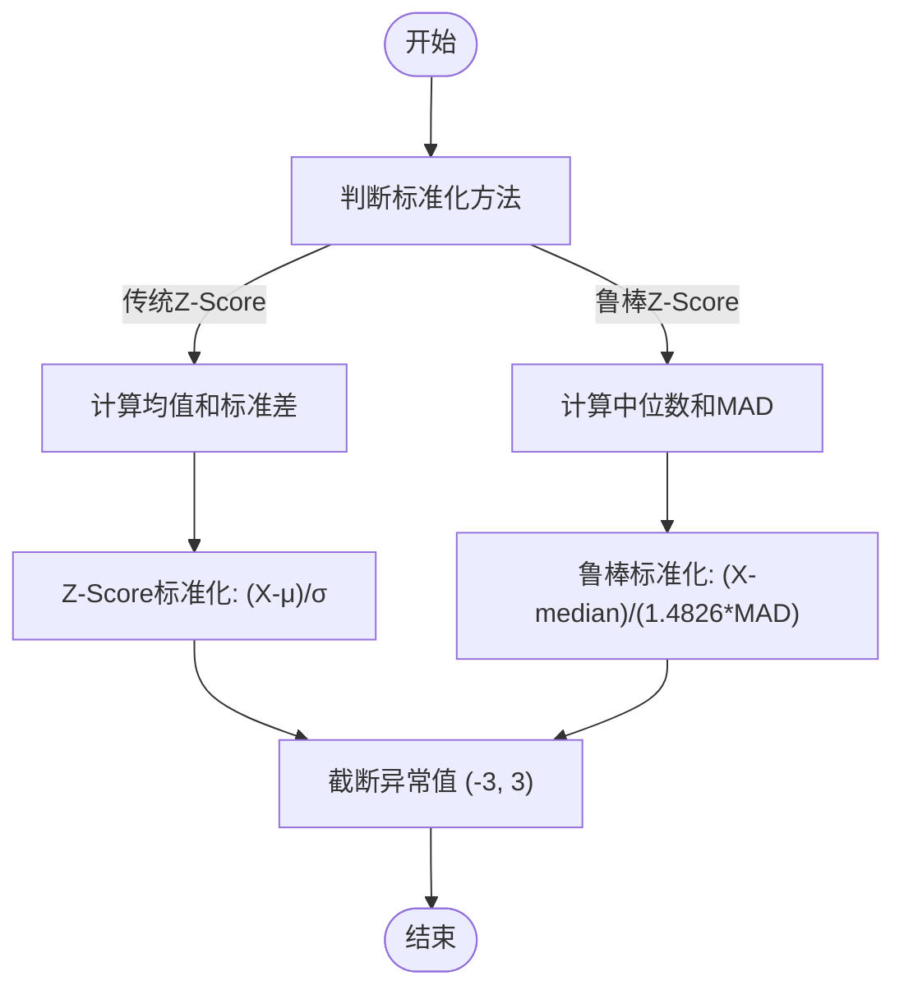
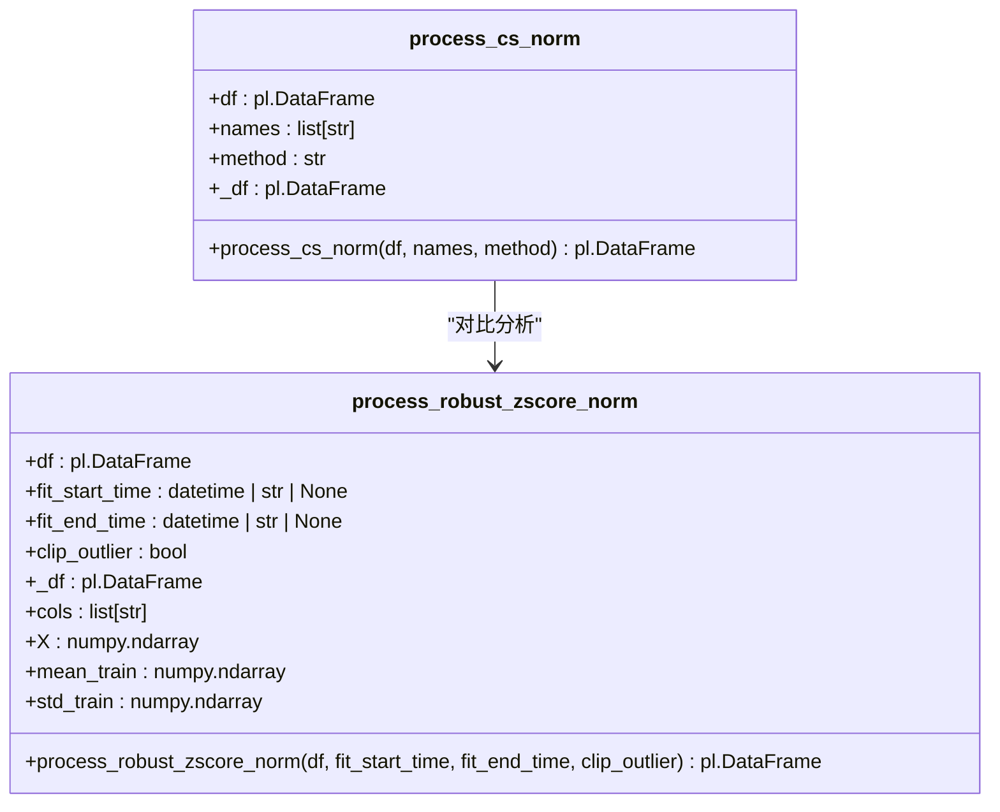
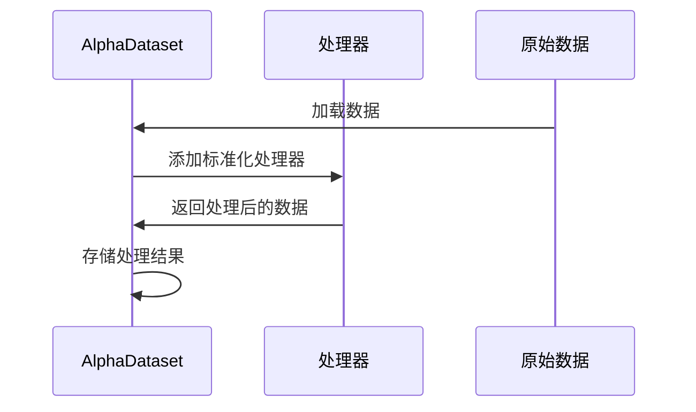

# 标准化方法

<cite>
**本文档中引用的文件**   
- [processor.py](file://vnpy/alpha/dataset/processor.py)
- [template.py](file://vnpy/alpha/dataset/template.py)
- [alpha_158.py](file://vnpy/alpha/dataset/datasets/alpha_158.py)
- [utility.py](file://vnpy/alpha/dataset/utility.py)
</cite>

## 目录
1. [引言](#引言)
2. [核心组件](#核心组件)
3. [数学原理与实现差异](#数学原理与实现差异)
4. [传统Z-Score标准化的异常值敏感性](#传统z-score标准化的异常值敏感性)
5. [鲁棒Z-Score标准化的稳定性提升](#鲁棒z-score标准化的稳定性提升)
6. [方法对比分析](#方法对比分析)
7. [配置参数说明](#配置参数说明)
8. [因子管道中的策略选择](#因子管道中的策略选择)
9. [性能考量与批量处理优化](#性能考量与批量处理优化)
10. [结论](#结论)

## 引言
本文档深入解析vnpy量化框架中`process_cs_norm`与`process_robust_zscore_norm`两种标准化方法的数学原理与实现差异。详细说明传统Z-Score标准化对异常值的敏感性问题，以及鲁棒Z-Score如何通过中位数绝对偏差（MAD）提升稳定性。对比两种方法在因子分布形态、极端值抑制能力和回测表现上的差异。提供配置参数说明（如缩放因子、偏移量），并通过实例展示如何在因子管道中选择合适的标准化策略。包含性能考量与批量处理优化建议。

## 核心组件

`process_cs_norm`和`process_robust_zscore_norm`是vnpy/alpha/dataset/processor.py模块中实现的两种关键标准化方法，用于在量化因子分析中对数据进行预处理。这些方法通过消除量纲影响，使不同因子具有可比性，从而提高机器学习模型的训练效果和回测的稳定性。

**Section sources**
- [processor.py](file://vnpy/alpha/dataset/processor.py#L33-L125)

## 数学原理与实现差异

### 传统Z-Score标准化
传统Z-Score标准化是一种基于均值和标准差的线性变换方法，其数学公式为：Z = (X - μ) / σ，其中μ是均值，σ是标准差。在`process_cs_norm`函数中，当method参数为"zscore"时，该方法对每个时间截面上的因子值计算均值和标准差，然后进行标准化。

### 鲁棒Z-Score标准化
鲁棒Z-Score标准化使用中位数和中位数绝对偏差（MAD）替代均值和标准差，其数学公式为：Z = (X - median) / (1.4826 * MAD)，其中MAD = median(|X - median|)。在`process_cs_norm`函数中，当method参数为"robust"时，该方法使用中位数作为中心趋势度量，使用MAD作为离散程度度量。

**Diagram sources **
- [processor.py](file://vnpy/alpha/dataset/processor.py#L33-L73)

**Section sources**
- [processor.py](file://vnpy/alpha/dataset/processor.py#L33-L73)

## 传统Z-Score标准化的异常值敏感性

传统Z-Score标准化对异常值高度敏感，因为均值和标准差都会受到极端值的显著影响。一个极端的异常值会拉高均值并大幅增加标准差，导致其他正常值的标准化结果被压缩，降低了数据的区分度。在`process_cs_norm`函数的实现中，使用`pl.col(col).mean().over("datetime")`和`pl.col(col).std().over("datetime")`计算时间截面上的均值和标准差，这种方法在存在异常值的情况下会产生偏差。

**Section sources**
- [processor.py](file://vnpy/alpha/dataset/processor.py#L61-L73)

## 鲁棒Z-Score标准化的稳定性提升

鲁棒Z-Score标准化通过使用中位数和MAD显著提升了对异常值的稳定性。中位数作为中心趋势度量不受极端值影响，而MAD作为离散程度度量也比标准差更稳健。在`process_cs_norm`函数中，通过`pl.col(col).median().over("datetime")`计算中位数，并通过`pl.col(col).abs().median().over("datetime")`计算MAD，然后使用1.4826的常数因子将MAD转换为标准差的等效值，确保在正态分布假设下与传统Z-Score具有相同的期望值。

**Diagram sources **
- [processor.py](file://vnpy/alpha/dataset/processor.py#L33-L109)

**Section sources**
- [processor.py](file://vnpy/alpha/dataset/processor.py#L43-L59)

## 方法对比分析

### 因子分布形态
传统Z-Score标准化假设数据服从正态分布，而鲁棒Z-Score对分布形态的假设更宽松。在实际金融数据中，因子分布往往呈现尖峰厚尾特征，鲁棒Z-Score能更好地处理这种非正态分布。

### 极端值抑制能力
鲁棒Z-Score通过MAD和后续的clip(-3, 3)操作，能更有效地抑制极端值的影响。在`process_cs_norm`的robust方法中，先使用MAD进行标准化，再通过clip操作将结果限制在[-3, 3]范围内，双重保障了极端值的处理效果。

### 回测表现差异
在回测中，使用鲁棒Z-Score标准化的策略通常表现出更稳定的收益曲线和更低的最大回撤，因为其减少了异常值导致的错误信号。`process_robust_zscore_norm`函数还支持通过fit_start_time和fit_end_time参数指定拟合时间段，使标准化参数更具时效性。

**Section sources**
- [processor.py](file://vnpy/alpha/dataset/processor.py#L33-L109)

## 配置参数说明

### 缩放因子
在鲁棒Z-Score标准化中，1.4826是一个关键的缩放因子，用于将MAD转换为标准差的等效值。这个因子来源于正态分布的理论推导，确保在数据服从正态分布时，MAD与标准差具有相同的期望值。

### 偏移量
两种方法都使用中心趋势度量（均值或中位数）作为偏移量。在`process_cs_norm`中，通过减去均值或中位数实现中心化，使标准化后的数据均值为0。

### 时间范围参数
`process_robust_zscore_norm`提供了fit_start_time和fit_end_time参数，允许用户指定用于计算标准化参数的时间范围，这在处理非平稳时间序列时特别有用。

**Section sources**
- [processor.py](file://vnpy/alpha/dataset/processor.py#L76-L109)

## 因子管道中的策略选择

在因子管道中选择标准化策略时，应考虑数据特性和策略目标。对于包含大量异常值的因子，推荐使用鲁棒Z-Score标准化；对于接近正态分布的因子，传统Z-Score可能更合适。在AlphaDataset类中，可以通过add_processor方法将标准化处理器添加到数据处理流程中。

**Diagram sources **
- [template.py](file://vnpy/alpha/dataset/template.py#L81-L89)
- [processor.py](file://vnpy/alpha/dataset/processor.py#L33-L109)

**Section sources**
- [template.py](file://vnpy/alpha/dataset/template.py#L81-L89)

## 性能考量与批量处理优化

### 性能考量
`process_cs_norm`在每个时间截面上独立计算统计量，适合处理横截面数据。而`process_robust_zscore_norm`需要将数据转换为numpy数组进行计算，可能在大数据集上产生内存压力。

### 批量处理优化
在实际应用中，可以通过设置clip_outlier参数为False来跳过异常值截断步骤，提高处理速度。同时，合理选择fit_start_time和fit_end_time可以减少计算量，提高效率。

**Section sources**
- [processor.py](file://vnpy/alpha/dataset/processor.py#L76-L109)

## 结论
`process_cs_norm`和`process_robust_zscore_norm`提供了两种互补的标准化方法，分别适用于不同的数据特性和策略需求。传统Z-Score标准化简单直观，而鲁棒Z-Score通过MAD显著提升了对异常值的稳定性。在实际应用中，应根据因子特性和策略目标选择合适的标准化策略，并合理配置参数以优化性能。