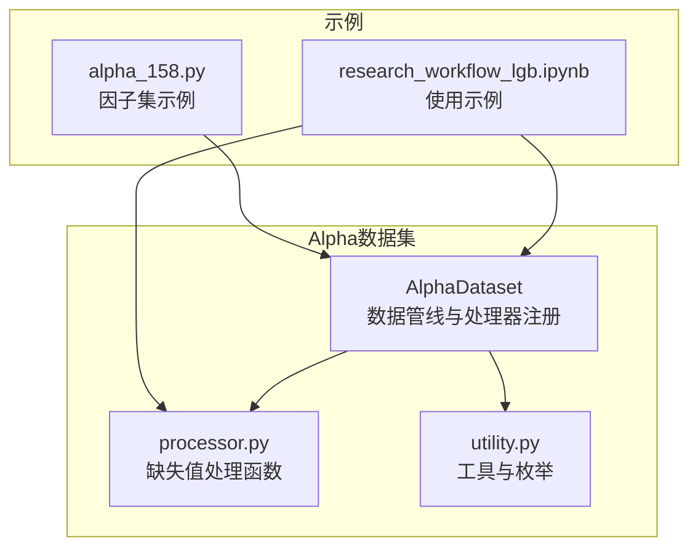
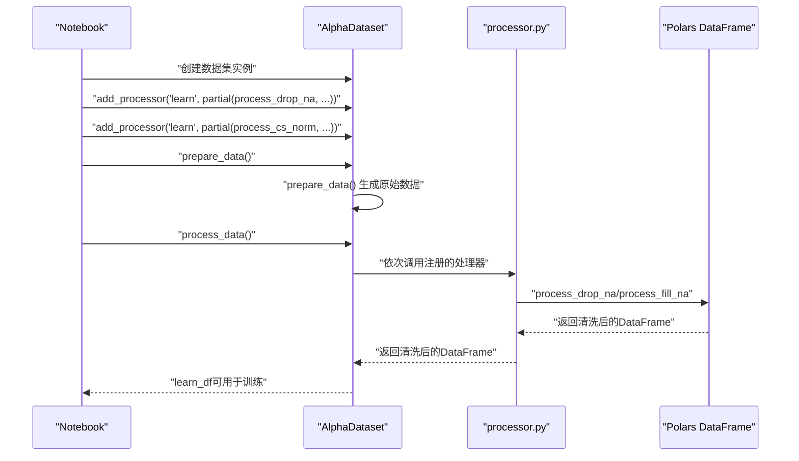
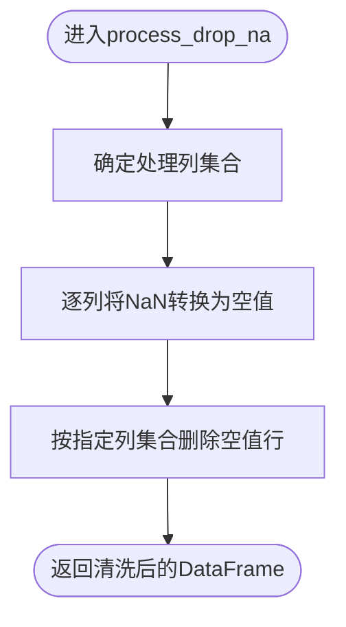
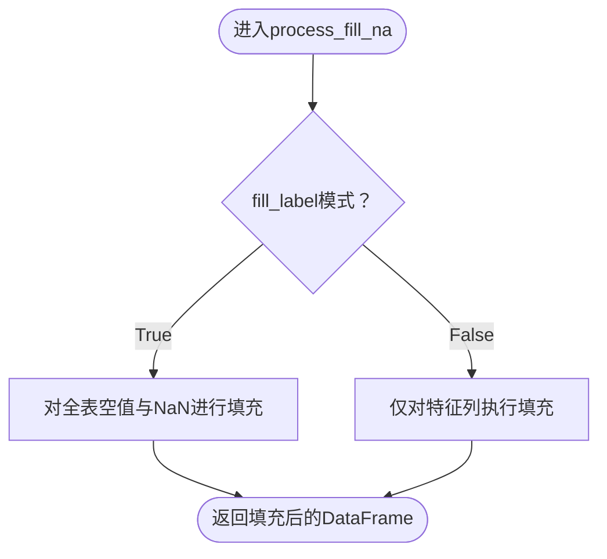
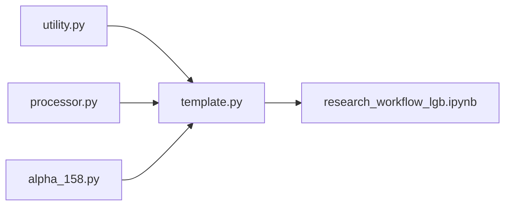

# 缺失值处理

<cite>
**本文引用的文件列表**
- [processor.py](file://vnpy/alpha/dataset/processor.py)
- [template.py](file://vnpy/alpha/dataset/template.py)
- [utility.py](file://vnpy/alpha/dataset/utility.py)
- [research_workflow_lgb.ipynb](file://examples/alpha_research/research_workflow_lgb.ipynb)
- [alpha_158.py](file://vnpy/alpha/dataset/datasets/alpha_158.py)
</cite>

## 目录
1. [引言](#引言)
2. [项目结构](#项目结构)
3. [核心组件](#核心组件)
4. [架构总览](#架构总览)
5. [详细组件分析](#详细组件分析)
6. [依赖关系分析](#依赖关系分析)
7. [性能考量](#性能考量)
8. [故障排查指南](#故障排查指南)
9. [结论](#结论)
10. [附录](#附录)

## 引言
本文件聚焦于vnpy alpha模块中缺失值处理方法process_drop_na与process_fill_na的实现机制，系统阐述其在跨时间截面因子数据中的识别与处理方式，并结合删除法与填充法（含前向/后向填充思想、均值填充思想）的适用场景与对因子稳定性的影响。文档还提供配置缺失值处理策略的方法示例、不同方法对后续标准化步骤的数据分布影响分析，以及在极端行情或新上市合约导致数据稀疏时的处理建议与性能优化技巧（向量化操作避免循环）。

## 项目结构
缺失值处理位于alpha数据集子模块中，围绕AlphaDataset的数据管线提供可插拔的预处理能力：
- 缺失值处理函数：process_drop_na、process_fill_na
- 数据集模板：AlphaDataset，负责特征工程、标签设置、数据准备与处理流水线
- 工具与辅助：utility模块提供时间转换、枚举等基础能力
- 示例与使用：研究工作流Notebook展示了如何将缺失值处理接入数据管线

图表来源
- [template.py](file://vnpy/alpha/dataset/template.py#L1-L120)
- [processor.py](file://vnpy/alpha/dataset/processor.py#L1-L32)
- [utility.py](file://vnpy/alpha/dataset/utility.py#L164-L183)
- [research_workflow_lgb.ipynb](file://examples/alpha_research/research_workflow_lgb.ipynb#L180-L200)
- [alpha_158.py](file://vnpy/alpha/dataset/datasets/alpha_158.py#L1-L40)

章节来源
- [template.py](file://vnpy/alpha/dataset/template.py#L1-L120)
- [processor.py](file://vnpy/alpha/dataset/processor.py#L1-L32)
- [utility.py](file://vnpy/alpha/dataset/utility.py#L164-L183)
- [research_workflow_lgb.ipynb](file://examples/alpha_research/research_workflow_lgb.ipynb#L180-L200)
- [alpha_158.py](file://vnpy/alpha/dataset/datasets/alpha_158.py#L1-L40)

## 核心组件
- process_drop_na：移除包含缺失值的行，确保后续统计与归一化不被空值污染；默认对除索引列外的所有特征列执行清理。
- process_fill_na：统一填充空值，支持按列或整体填充，便于保持样本完整性并维持时间序列连续性。

章节来源
- [processor.py](file://vnpy/alpha/dataset/processor.py#L9-L31)

## 架构总览
缺失值处理作为AlphaDataset数据管线中的预处理步骤，通过add_processor注册到“推理阶段”或“学习阶段”，在prepare_data之后、训练之前执行。典型流程如下：

图表来源
- [template.py](file://vnpy/alpha/dataset/template.py#L81-L171)
- [processor.py](file://vnpy/alpha/dataset/processor.py#L9-L31)
- [research_workflow_lgb.ipynb](file://examples/alpha_research/research_workflow_lgb.ipynb#L180-L200)

## 详细组件分析

### 删除法：process_drop_na
- 功能要点
  - 将特征列中的NaN显式转换为空值，再按指定列集合执行drop_nulls，确保缺失值被彻底剔除。
  - 默认处理范围为除时间与标的符号之外的所有特征列，避免误删索引列。
- 适用场景
  - 当缺失值比例较低且分布随机时，删除法能快速获得干净样本，降低后续归一化的偏差风险。
  - 在需要严格统计一致性（如某些统计检验）时，删除法可避免空值对均值/方差估计的干扰。
- 对因子稳定性的影响
  - 可能导致样本量下降，尤其在极端行情或新上市合约初期，样本稀疏时删除法会显著减少观测数。
  - 若缺失集中在特定日期或合约，可能引入截面异质性偏移，需结合时间窗口与成分股过滤策略控制。
- 性能与向量化
  - 采用with_columns链式转换与drop_nulls一次性完成，避免显式循环，具备良好的向量化特性。

图表来源
- [processor.py](file://vnpy/alpha/dataset/processor.py#L9-L19)

章节来源
- [processor.py](file://vnpy/alpha/dataset/processor.py#L9-L19)

### 填充法：process_fill_na
- 功能要点
  - 支持两种模式：
    - fill_label=True：对全表空值与NaN进行统一填充，适合整体数据清洗。
    - fill_label=False：仅对特征列（除索引列）执行填充，保留标签列的原始空值状态，便于后续专门处理。
- 适用场景
  - 前向/后向填充思想：当存在时间序列连续性需求时，可在缺失值前后方向上进行平滑填充（例如以最近可用值或未来值填充），但当前实现未直接暴露前/后向API，可通过外部逻辑先做滚动填充再调用process_fill_na。
  - 均值填充思想：在截面维度或时间维度上以中位数/均值填充，有助于维持分布中心位置稳定，但需注意对极值的敏感性。
- 对因子稳定性的影响
  - 填充法可保持样本完整性，但在极端行情或新上市合约初期，若填充值偏离真实分布，可能引入偏差，影响后续标准化与模型性能。
  - 建议与截面归一化配合使用，以消除填充带来的系统性偏移。
- 性能与向量化
  - 使用with_columns对特征列批量填充，避免显式循环，具备良好向量化效率。

图表来源
- [processor.py](file://vnpy/alpha/dataset/processor.py#L22-L31)

章节来源
- [processor.py](file://vnpy/alpha/dataset/processor.py#L22-L31)

### 在AlphaDataset中的配置与使用
- 注册处理器
  - 使用add_processor将缺失值处理函数注册到“learn”阶段，确保训练数据经过清洗。
- 示例路径
  - 在研究工作流Notebook中，通过partial将process_drop_na与process_cs_norm组合使用，形成“删除缺失+截面归一化”的标准预处理流程。

章节来源
- [template.py](file://vnpy/alpha/dataset/template.py#L81-L171)
- [research_workflow_lgb.ipynb](file://examples/alpha_research/research_workflow_lgb.ipynb#L180-L200)

### 截面归一化与缺失值处理的协同
- 归一化前的NaN处理
  - 截面归一化函数在内部通常会将NaN转换为空值后再进行分组统计，确保统计运算稳健。
- 归一化过程中的缺失值
  - 截面维度上的中位数/均值/标准差等统计量在分组over("datetime")下计算，天然忽略空值，从而避免整列被清零或产生无穷大。
- 建议
  - 在归一化前优先使用process_drop_na或process_fill_na，明确缺失值策略，再进行截面归一化，以避免后续步骤对空值的二次处理造成不确定性。

章节来源
- [processor.py](file://vnpy/alpha/dataset/processor.py#L34-L125)

## 依赖关系分析
- AlphaDataset依赖processor.py中的缺失值处理函数，通过add_processor注册到数据管线。
- utility.py提供to_datetime等基础能力，支撑时间维度的缺失值处理与归一化。
- 示例Notebook展示了从数据加载到数据清洗再到模型训练的完整链路。

图表来源
- [template.py](file://vnpy/alpha/dataset/template.py#L1-L120)
- [processor.py](file://vnpy/alpha/dataset/processor.py#L1-L32)
- [utility.py](file://vnpy/alpha/dataset/utility.py#L164-L183)
- [research_workflow_lgb.ipynb](file://examples/alpha_research/research_workflow_lgb.ipynb#L180-L200)
- [alpha_158.py](file://vnpy/alpha/dataset/datasets/alpha_158.py#L1-L40)

章节来源
- [template.py](file://vnpy/alpha/dataset/template.py#L1-L120)
- [processor.py](file://vnpy/alpha/dataset/processor.py#L1-L32)
- [utility.py](file://vnpy/alpha/dataset/utility.py#L164-L183)
- [research_workflow_lgb.ipynb](file://examples/alpha_research/research_workflow_lgb.ipynb#L180-L200)
- [alpha_158.py](file://vnpy/alpha/dataset/datasets/alpha_158.py#L1-L40)

## 性能考量
- 向量化优先
  - 两个缺失值处理函数均采用Polars的with_columns与drop_nulls等原生向量化操作，避免显式循环，具备较高性能。
- 批量处理
  - process_fill_na在fill_label=False时，通过列表推导式对特征列批量填充，减少多次扫描。
- I/O与内存
  - 在大规模跨时间截面数据中，建议在prepare_data阶段尽早完成缺失值处理，减少后续步骤的重复计算与中间DataFrame拷贝。
- 并行与流水线
  - AlphaDataset在prepare_data中已采用多进程并行计算特征，缺失值处理应尽量保持无副作用、纯函数式，以便在流水线中安全串联。

章节来源
- [processor.py](file://vnpy/alpha/dataset/processor.py#L9-L31)
- [template.py](file://vnpy/alpha/dataset/template.py#L90-L171)

## 故障排查指南
- 常见问题
  - 标签列仍含空值导致后续归一化异常：确认是否使用fill_label=False仅填充特征列，或在调用process_fill_na前先对标签列进行专门处理。
  - 删除法导致样本过少：检查缺失分布是否集中在少数日期或合约，考虑扩大时间窗口或增加成分股过滤条件。
  - 填充法引入系统性偏移：结合截面归一化与异常值裁剪策略，观察标准化后分布是否趋于稳定。
- 定位手段
  - 在数据管线的关键节点打印列名与形状，核对缺失值分布。
  - 使用归一化前后的描述性统计对比，判断缺失值处理是否有效。

章节来源
- [processor.py](file://vnpy/alpha/dataset/processor.py#L9-L31)
- [template.py](file://vnpy/alpha/dataset/template.py#L157-L171)

## 结论
- process_drop_na与process_fill_na分别代表了缺失值处理的两种基本策略：删除法强调样本完整性与统计稳健性，填充法则强调保留样本与时间连续性。
- 在跨时间截面因子数据中，应根据缺失模式与业务目标选择合适策略，并与截面归一化等后续步骤协同设计，以确保因子稳定性与模型性能。
- 实践中建议优先采用向量化实现，结合AlphaDataset的数据管线进行模块化配置，以获得更高的可维护性与性能表现。

## 附录
- 配置示例参考路径
  - 在研究工作流Notebook中，通过partial将process_drop_na与process_cs_norm注册到“learn”阶段，形成标准预处理流程。
- 相关文件
  - 缺失值处理函数：[processor.py](file://vnpy/alpha/dataset/processor.py#L9-L31)
  - 数据集模板与处理器注册：[template.py](file://vnpy/alpha/dataset/template.py#L81-L171)
  - 示例使用：[research_workflow_lgb.ipynb](file://examples/alpha_research/research_workflow_lgb.ipynb#L180-L200)
  - 因子集示例：[alpha_158.py](file://vnpy/alpha/dataset/datasets/alpha_158.py#L1-L40)