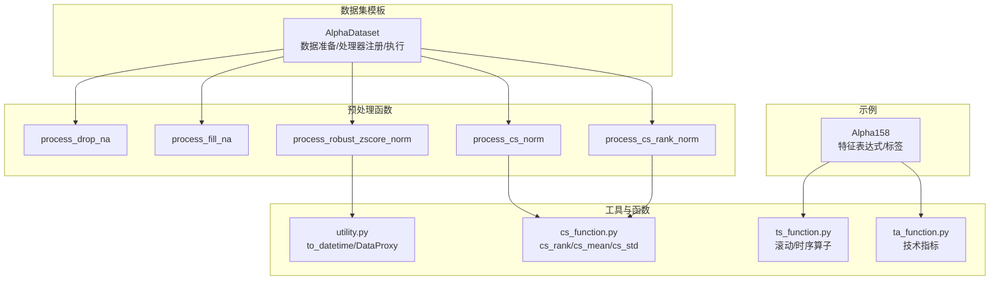
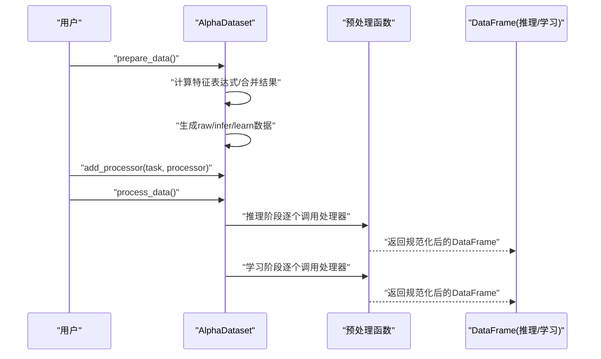
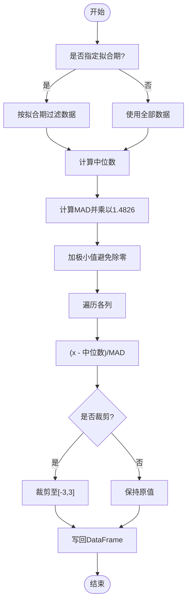
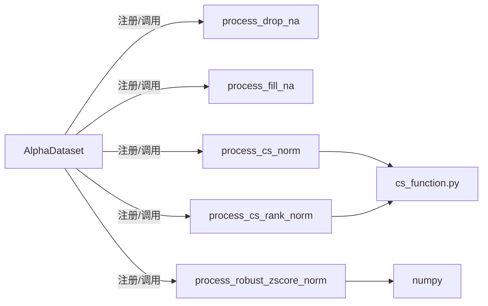

# 预处理方法

<cite>
**本文引用的文件**
- [processor.py](file://vnpy/alpha/dataset/processor.py)
- [template.py](file://vnpy/alpha/dataset/template.py)
- [utility.py](file://vnpy/alpha/dataset/utility.py)
- [cs_function.py](file://vnpy/alpha/dataset/cs_function.py)
- [ts_function.py](file://vnpy/alpha/dataset/ts_function.py)
- [ta_function.py](file://vnpy/alpha/dataset/ta_function.py)
- [lab.py](file://vnpy/alpha/lab.py)
- [alpha_158.py](file://vnpy/alpha/dataset/datasets/alpha_158.py)
</cite>

## 目录
1. [简介](#简介)
2. [项目结构](#项目结构)
3. [核心组件](#核心组件)
4. [架构总览](#架构总览)
5. [详细组件分析](#详细组件分析)
6. [依赖关系分析](#依赖关系分析)
7. [性能考量](#性能考量)
8. [故障排查指南](#故障排查指南)
9. [结论](#结论)
10. [附录](#附录)

## 简介
本文件系统化梳理并深度解析 vnpy.alpha.dataset 提供的因子预处理方法，重点覆盖以下三类：
- 缺失值处理：process_drop_na、process_fill_na
- 标准化：process_cs_norm（跨截面Z-Score与鲁棒Z-Score）、process_robust_zscore_norm
- 排序归一化：process_cs_rank_norm（跨截面秩归一化）

文档将从实现机制、数学原理、适用场景、参数配置、潜在影响、链式调用示例、极端值敏感性对比、边界条件处理与性能优化等方面进行阐述，并给出预处理顺序建议与最佳实践。

## 项目结构
与因子预处理直接相关的模块组织如下：
- 数据集模板与流水线：AlphaDataset（数据准备、处理器注册与执行）
- 预处理函数：processor.py（缺失值、标准化、排序归一化）
- 工具与辅助：utility.py（时间转换、数据代理等）
- 截面/时序/技术指标函数：cs_function.py、ts_function.py、ta_function.py
- 示例数据集：datasets/alpha_158.py（展示特征表达式与标签设置）

图表来源
- [template.py](file://vnpy/alpha/dataset/template.py#L1-L171)
- [processor.py](file://vnpy/alpha/dataset/processor.py#L1-L126)
- [utility.py](file://vnpy/alpha/dataset/utility.py#L1-L183)
- [cs_function.py](file://vnpy/alpha/dataset/cs_function.py#L1-L38)
- [ts_function.py](file://vnpy/alpha/dataset/ts_function.py#L1-L227)
- [ta_function.py](file://vnpy/alpha/dataset/ta_function.py#L1-L43)
- [alpha_158.py](file://vnpy/alpha/dataset/datasets/alpha_158.py#L1-L131)

章节来源
- [template.py](file://vnpy/alpha/dataset/template.py#L1-L171)
- [processor.py](file://vnpy/alpha/dataset/processor.py#L1-L126)
- [utility.py](file://vnpy/alpha/dataset/utility.py#L1-L183)
- [cs_function.py](file://vnpy/alpha/dataset/cs_function.py#L1-L38)
- [ts_function.py](file://vnpy/alpha/dataset/ts_function.py#L1-L227)
- [ta_function.py](file://vnpy/alpha/dataset/ta_function.py#L1-L43)
- [alpha_158.py](file://vnpy/alpha/dataset/datasets/alpha_158.py#L1-L131)

## 核心组件
- AlphaDataset：负责特征表达式计算、标签设置、原始数据生成、推理与学习阶段的数据处理流水线（通过 add_processor 注册处理器，process_data 依次应用）。
- 预处理函数：提供缺失值删除/填充、跨截面标准化（Z-Score/鲁棒）、秩归一化等。
- 工具函数：to_datetime 统一时区格式；DataProxy 支持表达式式特征构造与运算。
- 示例数据集：Alpha158 展示了大量时序/技术指标特征，便于验证预处理效果。

章节来源
- [template.py](file://vnpy/alpha/dataset/template.py#L1-L171)
- [processor.py](file://vnpy/alpha/dataset/processor.py#L1-L126)
- [utility.py](file://vnpy/alpha/dataset/utility.py#L1-L183)
- [alpha_158.py](file://vnpy/alpha/dataset/datasets/alpha_158.py#L1-L131)

## 架构总览
下图展示了 AlphaDataset 在“准备数据”后进入“处理数据”的流程，以及预处理函数在推理/学习阶段的调用位置。

图表来源
- [template.py](file://vnpy/alpha/dataset/template.py#L90-L171)
- [processor.py](file://vnpy/alpha/dataset/processor.py#L1-L126)

## 详细组件分析

### 缺失值处理：process_drop_na 与 process_fill_na
- process_drop_na
  - 功能：移除指定列在某截面（按日期分组）上存在缺失值的行。
  - 实现要点：
    - 默认对除索引列外的所有数值列进行处理。
    - 先将 NaN 转换为 None，再基于 subset 删除空值。
  - 参数与行为：
    - names：可选，指定参与缺失值判断的列名列表；默认取中间列范围。
  - 适用场景：
    - 对齐多因子矩阵，确保同一交易日所有样本均有效。
  - 潜在影响：
    - 可能显著减少样本量，需评估是否引入样本选择偏差。
  - 边界条件：
    - 若某日期全为空，该日期整行会被剔除。
- process_fill_na
  - 功能：对缺失值进行填充。
  - 实现要点：
    - fill_label 控制是否同时填充标签列；否则仅对数值列进行填充。
    - 使用 fill_null 与 fill_nan 保证空值与 NaN 均被替换。
  - 参数与行为：
    - fill_value：填充值。
    - fill_label：是否包含标签列。
  - 适用场景：
    - 当缺失值比例较小且不希望丢失样本时。
  - 潜在影响：
    - 可能引入偏移，尤其在极端值缺失时需谨慎。
  - 边界条件：
    - 填充值应与后续建模策略兼容（如模型对零/常数的容忍度）。

章节来源
- [processor.py](file://vnpy/alpha/dataset/processor.py#L9-L31)

### 标准化：process_cs_norm 与 process_robust_zscore_norm
- process_cs_norm
  - 功能：跨截面标准化（支持 Z-Score 与鲁棒 Z-Score）。
  - 实现要点：
    - Z-Score：按日期分组计算均值与标准差，再做减均差除以标准差。
    - 鲁棒 Z-Score：按日期分组计算中位数与MAD（中位数绝对偏差），再做中心化与缩放，最后裁剪到 [-3, 3]。
    - 通过 over("datetime") 实现跨时间截面的分组计算。
  - 参数与行为：
    - names：参与标准化的列名列表。
    - method："robust" 或其他（默认 Z-Score）。
  - 数学原理：
    - Z-Score：z = (x − μ) / σ
    - 鲁棒 Z-Score：z = median(x) 的 MAD 归一化，常乘以 1.4826 作为一致估计，再裁剪。
  - 适用场景：
    - Z-Score：数据近似正态分布、无显著异常值。
    - 鲁棒 Z-Score：存在异常值或厚尾分布时更稳健。
  - 潜在影响：
    - 鲁棒方法对极端值不敏感，但可能降低区分度；Z-Score 更敏感于离散程度。
  - 边界条件：
    - 分组内标准差为 0 或 MAD 为 0 时需避免除零（当前实现未显式处理，需注意）。
- process_robust_zscore_norm
  - 功能：全局鲁棒 Z-Score 标准化（可限定拟合窗口）。
  - 实现要点：
    - 可选拟合时间窗口（fit_start_time/fit_end_time），在该窗口内计算中位数与MAD。
    - 使用 numpy 计算中位数与MAD，并乘以 1.4826 得到一致估计。
    - 可选裁剪到 [-3, 3]。
  - 参数与行为：
    - fit_start_time/fit_end_time：拟合期（字符串或 datetime）。
    - clip_outlier：是否裁剪。
  - 适用场景：
    - 需要固定历史窗口估计稳健参数，避免未来信息泄露。
  - 潜在影响：
    - 裁剪可抑制极端值影响，但会损失尾部信息。
  - 边界条件：
    - 拟合期内若某列全为 NaN，可能导致估计不稳定；需确保窗口内至少有足够观测。

图表来源
- [processor.py](file://vnpy/alpha/dataset/processor.py#L76-L126)

章节来源
- [processor.py](file://vnpy/alpha/dataset/processor.py#L33-L126)

### 排序归一化：process_cs_rank_norm
- 功能：跨截面秩归一化，将每个日期内的因子值映射到 [-1.73, 1.73] 区间，中心化并缩放。
- 实现要点：
  - 使用 rank("average").over("datetime") 计算秩次，再按日期计数归一化。
  - 最终缩放系数约等于 3.46（具体取决于归一化目标区间）。
- 参数与行为：
  - names：参与秩归一化的列名列表。
- 适用场景：
  - 强调相对排序而非绝对尺度，适合对因子方向敏感而对幅度不敏感的策略。
- 潜在影响：
  - 对异常值不敏感，但可能弱化极端值的信号强度。
- 边界条件：
  - 同值并列时采用平均秩，避免信息丢失。

章节来源
- [processor.py](file://vnpy/alpha/dataset/processor.py#L112-L126)

### 截面函数与跨时间截面处理
- cs_function.py：提供 cs_rank、cs_mean、cs_std 等跨截面算子，常用于构建更复杂的预处理逻辑。
- ts_function.py：提供滚动/时序算子，便于在预处理前先做平滑或趋势修正。
- ta_function.py：提供技术指标（如 RSI、ATR），可作为预处理输入或后验校验。

章节来源
- [cs_function.py](file://vnpy/alpha/dataset/cs_function.py#L1-L38)
- [ts_function.py](file://vnpy/alpha/dataset/ts_function.py#L1-L227)
- [ta_function.py](file://vnpy/alpha/dataset/ta_function.py#L1-L43)

## 依赖关系分析
- AlphaDataset 通过 add_processor 注册处理器，process_data 顺序调用推理/学习阶段的处理器。
- 预处理函数依赖 Polars 的 over("datetime") 实现跨截面分组计算。
- process_robust_zscore_norm 依赖 numpy 进行稳健统计估计。
- 截面/时序/技术指标函数为预处理提供基础算子。

图表来源
- [template.py](file://vnpy/alpha/dataset/template.py#L81-L171)
- [processor.py](file://vnpy/alpha/dataset/processor.py#L1-L126)
- [cs_function.py](file://vnpy/alpha/dataset/cs_function.py#L1-L38)

章节来源
- [template.py](file://vnpy/alpha/dataset/template.py#L81-L171)
- [processor.py](file://vnpy/alpha/dataset/processor.py#L1-L126)

## 性能考量
- 处理器链式调用：
  - 将多个预处理步骤串联，建议按“缺失值处理 → 排序归一化/标准化 → 裁剪/去极值”顺序，以减少重复计算。
- 跨截面分组：
  - 使用 over("datetime") 的分组计算在 Polars 中通常高效，但列数量较多时建议只对必要列进行标准化。
- 滚动/时序预处理：
  - ts_function 中的滚动算子可能带来额外开销，建议在特征表达式阶段完成必要的平滑后再进入预处理。
- 内存与类型：
  - 标准化后尽量保持 Float64 类型，避免隐式转换带来的性能损耗。
- 并行与批处理：
  - AlphaDataset.prepare_data 已使用多进程并行计算特征表达式，预处理阶段可继续沿用 DataFrame 的向量化操作。

[本节为通用性能建议，不直接分析具体文件]

## 故障排查指南
- 标准差/MAD 为 0 导致除零：
  - 在 process_cs_norm 与 process_robust_zscore_norm 中，若分组内方差或 MAD 为 0，会出现除零风险。建议在调用前检查列的离散性，或在预处理前加入最小观测阈值。
- 拟合期窗口为空：
  - 若 fit_start_time/fit_end_time 指定的窗口内无数据，process_robust_zscore_norm 会得到空数组，需确保窗口覆盖足够样本。
- NaN 与 None 混杂：
  - 建议统一使用 fill_nan(None) 后再 drop_nulls，避免遗漏 NaN。
- 排序归一化同值并列：
  - 使用平均秩可避免信息丢失，但若对极值敏感，可考虑在排序前做微扰或与幅度标准化结合。

章节来源
- [processor.py](file://vnpy/alpha/dataset/processor.py#L33-L126)

## 结论
- 缺失值处理应优先考虑样本代表性与信息完整性，结合业务背景选择删除或填充。
- 标准化方法的选择取决于数据分布特性：Z-Score 适用于近似正态分布，鲁棒 Z-Score 更适合厚尾或异常值场景。
- 秩归一化强调相对排序，适合对幅度不敏感的策略；与幅度标准化结合可兼顾方向与强度。
- 预处理顺序建议：缺失值处理 → 排序归一化/标准化 → 裁剪/去极值；并注意避免未来信息泄露与除零风险。

[本节为总结性内容，不直接分析具体文件]

## 附录

### 链式调用示例（概念性说明）
- 在 AlphaDataset 中注册多个处理器，按顺序执行：
  - 先进行缺失值删除或填充；
  - 再进行跨截面标准化（Z-Score 或鲁棒 Z-Score）；
  - 最后进行秩归一化或裁剪。
- 示例调用路径（概念性）：
  - [AlphaDataset.add_processor](file://vnpy/alpha/dataset/template.py#L81-L89)
  - [AlphaDataset.process_data](file://vnpy/alpha/dataset/template.py#L157-L171)
  - [缺失值处理](file://vnpy/alpha/dataset/processor.py#L9-L31)
  - [标准化](file://vnpy/alpha/dataset/processor.py#L33-L126)

章节来源
- [template.py](file://vnpy/alpha/dataset/template.py#L81-L171)
- [processor.py](file://vnpy/alpha/dataset/processor.py#L9-L126)

### 参数与适用场景速查
- process_drop_na
  - 参数：names（可选）
  - 场景：需要严格对齐的因子矩阵
- process_fill_na
  - 参数：fill_value、fill_label
  - 场景：小比例缺失且需保留样本
- process_cs_norm
  - 参数：names、method（robust/zscore）
  - 场景：跨截面尺度对齐；robust 适合异常值
- process_robust_zscore_norm
  - 参数：fit_start_time、fit_end_time、clip_outlier
  - 场景：固定窗口稳健估计；可裁剪极端值
- process_cs_rank_norm
  - 参数：names
  - 场景：强调相对排序

章节来源
- [processor.py](file://vnpy/alpha/dataset/processor.py#L9-L126)

### 数学与实现要点对照
- Z-Score vs 鲁棒 Z-Score
  - Z-Score：对正态分布更敏感，易受异常值影响。
  - 鲁棒 Z-Score：使用中位数与MAD，1.4826 作为一致估计常数，对异常值不敏感。
- MAD 的作用
  - 衡量数据离散程度，对异常值不敏感；与中位数配合可获得稳健的尺度估计。
- 秩归一化
  - 将每个日期内的因子值映射到 [-1.73, 1.73]，强调相对排序。

章节来源
- [processor.py](file://vnpy/alpha/dataset/processor.py#L33-L126)