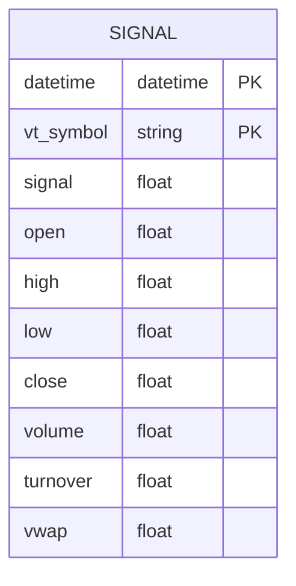
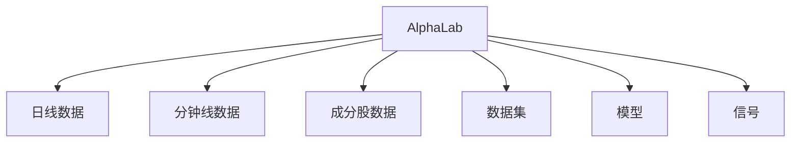
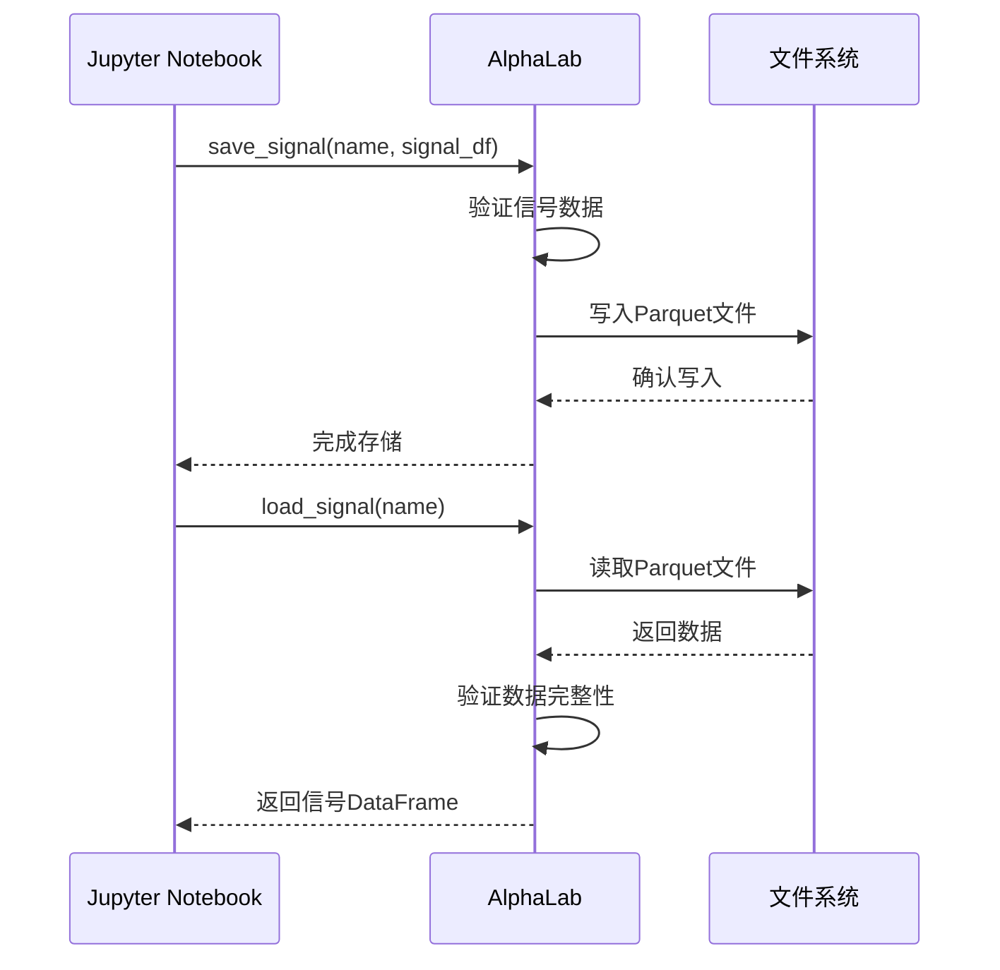
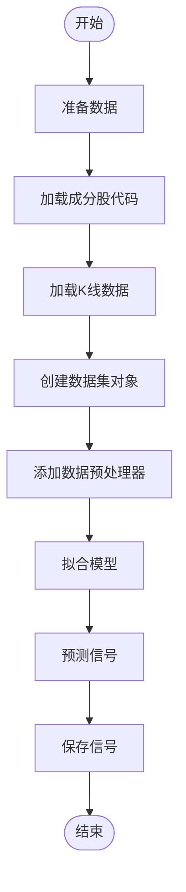
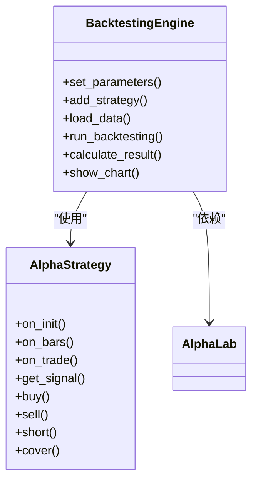
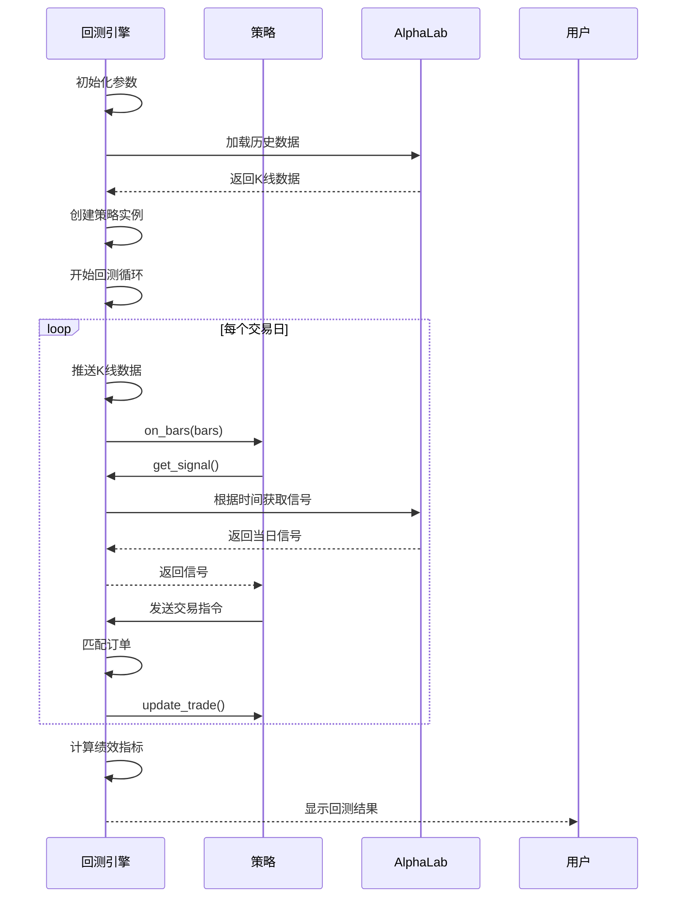
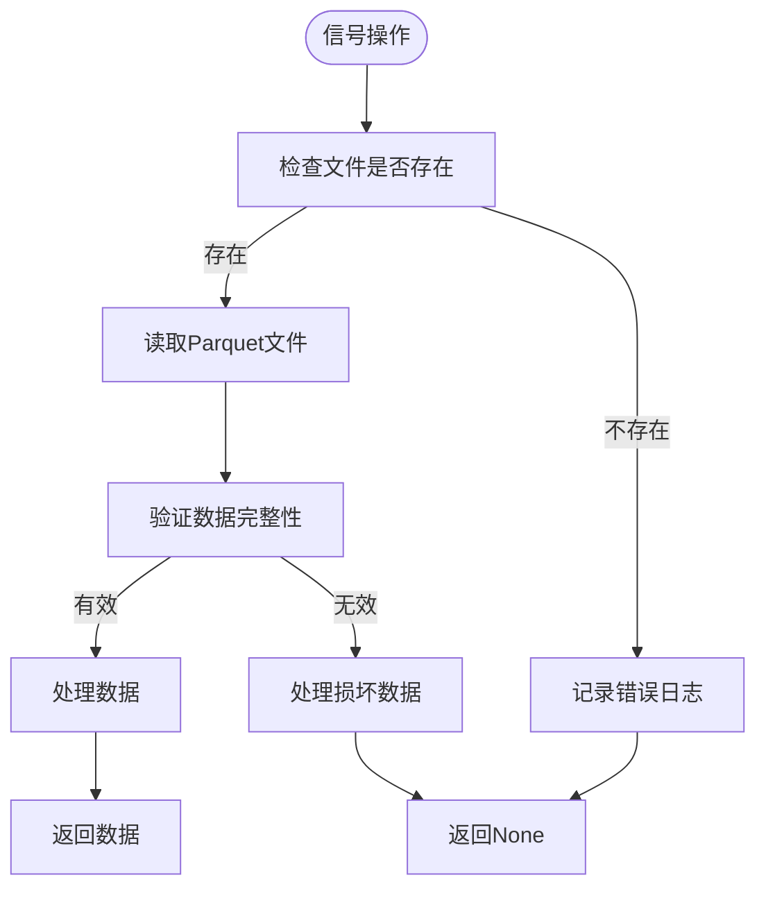

# 信号生成与存储

<cite>
**本文档引用的文件**   
- [lab.py](file://vnpy/alpha/lab.py)
- [template.py](file://vnpy/alpha/dataset/template.py)
- [backtesting.py](file://vnpy/alpha/strategy/backtesting.py)
- [research_workflow_lasso.ipynb](file://examples/alpha_research/research_workflow_lasso.ipynb)
- [research_workflow_lgb.ipynb](file://examples/alpha_research/research_workflow_lgb.ipynb)
- [research_workflow_mlp.ipynb](file://examples/alpha_research/research_workflow_mlp.ipynb)
- [utility.py](file://vnpy/alpha/dataset/utility.py)
- [processor.py](file://vnpy/alpha/dataset/processor.py)
</cite>

## 目录
1. [引言](#引言)
2. [信号数据结构设计](#信号数据结构设计)
3. [信号持久化机制](#信号持久化机制)
4. [信号生成流程](#信号生成流程)
5. [信号回测集成](#信号回测集成)
6. [信号版本控制与异常处理](#信号版本控制与异常处理)

## 引言

AlphaLab是vnpy框架中的量化研究实验室，提供了一套完整的信号生成、存储和回测体系。该系统以Polars DataFrame为核心数据结构，采用Parquet格式进行高效持久化存储，实现了从数据准备、特征工程、模型训练到信号生成和策略回测的全流程自动化。本系统特别适用于多因子选股、机器学习预测等量化研究场景。

**Section sources**
- [lab.py](file://vnpy/alpha/lab.py#L20-L481)
- [research_workflow_lasso.ipynb](file://examples/alpha_research/research_workflow_lasso.ipynb#L1-L12470)

## 信号数据结构设计

AlphaLab中的信号数据采用标准化的Polars DataFrame结构，包含以下关键字段：

- **datetime**: 时间戳，标识信号生成的时间点
- **vt_symbol**: 标的代码，使用vt_symbol格式（如"000300.SSE"）
- **signal**: 信号值，表示模型预测的交易信号
- **open, high, low, close**: 标准化后的价格数据
- **volume, turnover**: 交易量和成交额
- **vwap**: 成交量加权平均价

信号数据结构的设计遵循以下原则：
1. 时间序列对齐：所有标的的信号在相同的时间点上对齐
2. 数据标准化：价格数据以首日收盘价为基准进行归一化处理
3. 缺失值处理：停牌交易日的数值转换为NaN，便于后续分析



**Diagram sources**
- [lab.py](file://vnpy/alpha/lab.py#L69-L78)
- [utility.py](file://vnpy/alpha/dataset/utility.py#L111-L152)

**Section sources**
- [lab.py](file://vnpy/alpha/lab.py#L67-L81)
- [utility.py](file://vnpy/alpha/dataset/utility.py#L111-L152)

## 信号持久化机制

AlphaLab采用Parquet格式存储信号数据，提供了高效的save_signal和load_signal接口。

### 存储优势

采用Parquet格式存储Polars DataFrame具有以下技术优势：

1. **高效压缩**: 列式存储和压缩算法显著减少存储空间
2. **快速读写**: 列式存储优化了数据读取性能，特别是针对特定列的查询
3. **类型安全**: 保留了原始数据类型信息，避免了序列化/反序列化过程中的数据丢失
4. **跨平台兼容**: Parquet是开放标准，可在不同系统和语言间共享

### 存储路径管理

AlphaLab的存储体系采用分层目录结构：



**Diagram sources**
- [lab.py](file://vnpy/alpha/lab.py#L28-L34)

### 信号存储与加载接口



**Diagram sources**
- [lab.py](file://vnpy/alpha/lab.py#L453-L478)

**Section sources**
- [lab.py](file://vnpy/alpha/lab.py#L453-L478)

## 信号生成流程

信号生成流程从训练好的模型输出开始，通过AlphaLab进行统一管理。

### 基于研究工作流的信号生成

结合research_workflow_*.ipynb示例，信号生成流程如下：

1. **数据准备**: 加载成分股历史数据
2. **特征工程**: 计算Alpha因子
3. **模型训练**: 训练机器学习模型
4. **信号预测**: 生成交易信号
5. **信号存储**: 持久化保存信号



**Diagram sources**
- [research_workflow_lasso.ipynb](file://examples/alpha_research/research_workflow_lasso.ipynb#L1-L12470)
- [research_workflow_lgb.ipynb](file://examples/alpha_research/research_workflow_lgb.ipynb#L1-L24243)

### 信号生成代码示例

```python
# 创建数据中心
lab = AlphaLab("./lab/csi300")

# 设置任务参数
name = "300_lasso"
index_symbol = "000300.SSE"
start = "2008-01-01"
end = "2023-12-31"
interval = Interval.DAILY
extended_days = 100

# 加载所有成分股代码
component_symbols = lab.load_component_symbols(index_symbol, start, end)

# 加载成分股数据
df = lab.load_bar_df(component_symbols, interval, start, end, extended_days)

# 创建数据集对象
dataset = Alpha158(
    df,
    train_period=("2008-01-01", "2014-12-31"),
    valid_period=("2015-01-01", "2016-12-31"),
    test_period=("2017-01-01", "2020-8-31"),
)

# 添加数据预处理器
dataset.add_processor("learn", partial(process_drop_na, names=["label"]))
dataset.add_processor("learn", partial(process_cs_norm, names=["label"], method="zscore"))
dataset.add_processor("infer", partial(process_fill_na, fill_value=0))

# 准备数据
dataset.prepare_data()

# 训练模型
model = LassoModel()
model.fit(dataset)

# 生成信号
signal = model.predict(dataset, Segment.TEST)

# 保存信号
lab.save_signal(name, signal)
```

**Section sources**
- [research_workflow_lasso.ipynb](file://examples/alpha_research/research_workflow_lasso.ipynb#L1-L12470)

## 信号回测集成

信号回测集成展示了信号如何驱动策略执行。

### 回测引擎架构



**Diagram sources**
- [backtesting.py](file://vnpy/alpha/strategy/backtesting.py#L22-L800)
- [template.py](file://vnpy/alpha/strategy/template.py#L15-L206)

### 信号驱动的回测流程



**Diagram sources**
- [backtesting.py](file://vnpy/alpha/strategy/backtesting.py#L579-L721)

### 回测集成代码示例

```python
# 创建回测引擎
engine = BacktestingEngine(lab)

# 设置回测参数
engine.set_parameters(
    vt_symbols=component_symbols,
    interval=Interval.DAILY,
    start=datetime(2017, 1, 1),
    end=datetime(2020, 8, 31),
    capital=1_000_000,
)

# 加载信号数据
signal_df = lab.load_signal(name)

# 添加策略
engine.add_strategy(EquityDemoStrategy, {}, signal_df)

# 运行回测
engine.load_data()
engine.run_backtesting()
engine.calculate_result()
engine.show_chart()
```

**Section sources**
- [backtesting.py](file://vnpy/alpha/strategy/backtesting.py#L104-L169)

## 信号版本控制与异常处理

### 信号版本控制

AlphaLab通过文件系统实现信号版本控制：

1. **命名约定**: 信号文件名包含策略标识和时间信息
2. **文件隔离**: 每个信号独立存储为单独的Parquet文件
3. **历史追溯**: 保留历史版本文件，便于结果复现

### 数据校验

系统在信号存储和加载时执行严格的数据校验：

- **完整性校验**: 检查必要字段是否存在
- **类型校验**: 验证数据类型是否正确
- **范围校验**: 确保数值在合理范围内
- **时间序列校验**: 验证时间戳的连续性和排序

### 异常处理实践



**Diagram sources**
- [lab.py](file://vnpy/alpha/lab.py#L459-L466)

### 异常处理代码示例

```python
def load_signal(self, name: str) -> pl.DataFrame | None:
    """加载信号"""
    file_path: Path = self.signal_path.joinpath(f"{name}.parquet")
    if not file_path.exists():
        logger.error(f"信号文件 {name} 不存在")
        return None

    try:
        return pl.read_parquet(file_path)
    except Exception as e:
        logger.error(f"读取信号文件 {name} 失败: {str(e)}")
        return None
```

**Section sources**
- [lab.py](file://vnpy/alpha/lab.py#L459-L466)