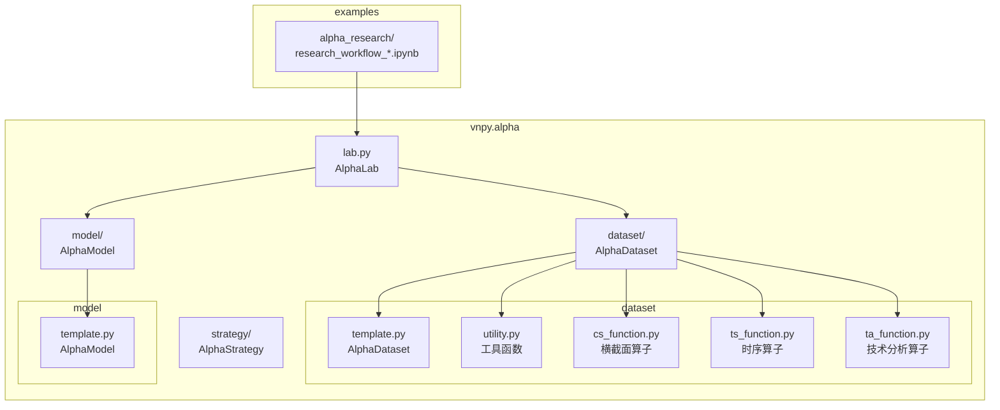
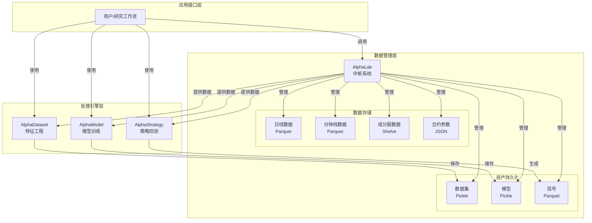
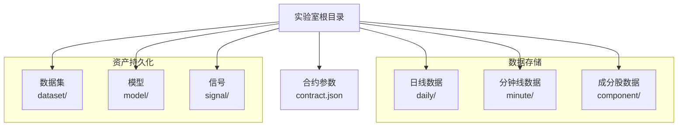
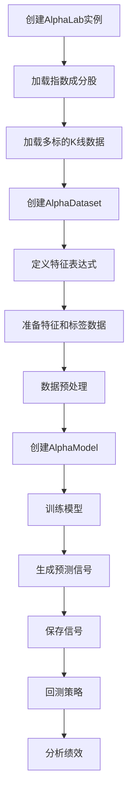
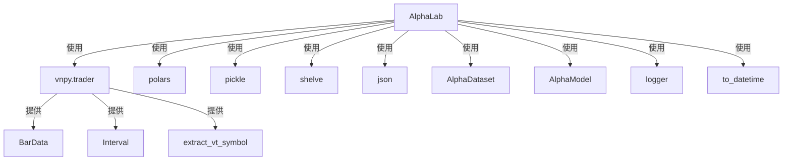

# 投研流程自动化

<cite>
**本文档引用的文件**   
- [lab.py](file://vnpy/alpha/lab.py)
- [template.py](file://vnpy/alpha/dataset/template.py)
- [template.py](file://vnpy/alpha/model/template.py)
- [utility.py](file://vnpy/alpha/dataset/utility.py)
- [cs_function.py](file://vnpy/alpha/dataset/cs_function.py)
- [ts_function.py](file://vnpy/alpha/dataset/ts_function.py)
- [ta_function.py](file://vnpy/alpha/dataset/ta_function.py)
- [research_workflow_lasso.ipynb](file://examples/alpha_research/research_workflow_lasso.ipynb)
- [research_workflow_lgb.ipynb](file://examples/alpha_research/research_workflow_lgb.ipynb)
- [research_workflow_mlp.ipynb](file://examples/alpha_research/research_workflow_mlp.ipynb)
</cite>

## 目录
1. [引言](#引言)
2. [项目结构](#项目结构)
3. [核心组件](#核心组件)
4. [架构概述](#架构概述)
5. [详细组件分析](#详细组件分析)
6. [依赖分析](#依赖分析)
7. [性能考虑](#性能考虑)
8. [故障排除指南](#故障排除指南)
9. [结论](#结论)

## 引言
AlphaLab类是vnpy量化投研框架中的核心系统，旨在为量化研究提供一个自动化、一体化的中枢平台。它通过统一的接口管理数据存储、加载、处理和分析的全流程，极大地简化了从数据获取到策略回测的研究工作。本文档将深入剖析AlphaLab类的实现机制，重点介绍其在实验室目录结构管理、多周期K线数据与指数成分股的存储加载、合约参数配置，以及数据集、模型、信号三大资产的持久化与版本管理方面的设计。结合`research_workflow_*.ipynb`系列示例，我们将展示如何利用AlphaLab构建一个端到端的自动化研究流水线。

## 项目结构
AlphaLab类位于`vnpy/alpha/`目录下，是`vnpy.alpha`模块的核心组件。其设计遵循了模块化和分层的架构原则，相关功能分散在不同的子模块中。

**Diagram sources**
- [lab.py](file://vnpy/alpha/lab.py)
- [template.py](file://vnpy/alpha/dataset/template.py)
- [template.py](file://vnpy/alpha/model/template.py)
- [utility.py](file://vnpy/alpha/dataset/utility.py)
- [cs_function.py](file://vnpy/alpha/dataset/cs_function.py)
- [ts_function.py](file://vnpy/alpha/dataset/ts_function.py)
- [ta_function.py](file://vnpy/alpha/dataset/ta_function.py)
- [research_workflow_lasso.ipynb](file://examples/alpha_research/research_workflow_lasso.ipynb)

**Section sources**
- [lab.py](file://vnpy/alpha/lab.py)
- [template.py](file://vnpy/alpha/dataset/template.py)
- [template.py](file://vnpy/alpha/model/template.py)
- [utility.py](file://vnpy/alpha/dataset/utility.py)
- [cs_function.py](file://vnpy/alpha/dataset/cs_function.py)
- [ts_function.py](file://vnpy/alpha/dataset/ts_function.py)
- [ta_function.py](file://vnpy/alpha/dataset/ta_function.py)
- [research_workflow_lasso.ipynb](file://examples/alpha_research/research_workflow_lasso.ipynb)

## 核心组件
AlphaLab类作为量化研究的中枢，其核心功能围绕数据管理和资产生命周期展开。它通过定义清晰的目录结构来组织不同类型的资产，并提供了一系列方法来实现数据的持久化、版本控制和高效加载。其核心组件包括数据存储管理器、资产持久化引擎和研究工作流协调器。

**Section sources**
- [lab.py](file://vnpy/alpha/lab.py)

## 架构概述
AlphaLab的架构设计体现了“一个中心，多点联动”的思想。`AlphaLab`类是整个系统的控制中心，负责协调数据、模型和信号等核心资产。其架构可以分为三个主要层次：数据管理层、处理引擎层和应用接口层。

**Diagram sources**
- [lab.py](file://vnpy/alpha/lab.py)
- [template.py](file://vnpy/alpha/dataset/template.py)
- [template.py](file://vnpy/alpha/model/template.py)
- [research_workflow_lasso.ipynb](file://examples/alpha_research/research_workflow_lasso.ipynb)

## 详细组件分析

### AlphaLab类分析
`AlphaLab`类是整个量化研究流程的起点和核心。它的主要职责是管理一个本地的“实验室”目录，该目录作为所有研究资产的统一存储中心。

#### 实验室目录结构管理
当创建一个`AlphaLab`实例时，需要指定一个`lab_path`路径。该类的构造函数会自动在该路径下创建一系列子目录，用于分类存储不同类型的数据和资产。

这种清晰的目录结构确保了研究项目的可组织性和可复现性。

**Diagram sources**
- [lab.py](file://vnpy/alpha/lab.py#L23-L49)

#### 多周期K线数据存储与加载
AlphaLab提供了`save_bar_data`和`load_bar_data`方法，用于处理日线和分钟线级别的K线数据。
- **存储机制**：`save_bar_data`方法接收一个`BarData`对象列表。它会根据第一个`BarData`对象的`interval`（周期）属性，将数据分别存储到`daily_path`或`minute_path`目录下，文件名以`vt_symbol`（如"000300.SSE"）命名，格式为Parquet。如果文件已存在，新数据会与旧数据合并，并根据`datetime`去重和排序，保证了数据的连续性和完整性。
- **加载机制**：`load_bar_data`方法根据`vt_symbol`、`interval`、`start`和`end`参数，从对应的Parquet文件中读取指定时间范围内的K线数据，并将其转换回`BarData`对象列表。此外，`load_bar_df`方法提供了更高级的功能，可以一次性加载多个标的、多个周期的数据，并进行归一化、填充空值等预处理，直接返回一个`polars.DataFrame`，极大地方便了后续的分析。

**Diagram sources**
- [lab.py](file://vnpy/alpha/lab.py#L51-L94)
- [lab.py](file://vnpy/alpha/lab.py#L96-L154)
- [lab.py](file://vnpy/alpha/lab.py#L156-L243)

#### 指数成分股管理
AlphaLab使用`shelve`模块来管理指数成分股的变化。`save_component_data`方法将一个字典（键为日期字符串，值为该日的成分股列表）保存到`component_path`目录下的一个文件中。`load_component_data`方法则根据指数代码和时间范围，加载该时间段内的所有成分股数据，并返回一个以`datetime`为键的字典。`load_component_symbols`和`load_component_filters`方法在此基础上，提供了更便捷的接口来获取成分股列表和它们在指数中的持有周期，这对于构建成分股过滤器至关重要。

**Diagram sources**
- [lab.py](file://vnpy/alpha/lab.py#L245-L279)
- [lab.py](file://vnpy/alpha/lab.py#L281-L347)

#### 合约参数配置
通过`add_contract_setting`和`load_contract_setttings`方法，AlphaLab可以管理不同合约的交易参数（如手续费率、合约乘数、最小变动价位）。这些参数以JSON格式存储在`contract.json`文件中，方便在回测和实盘中统一调用。

**Diagram sources**
- [lab.py](file://vnpy/alpha/lab.py#L349-L377)
- [lab.py](file://vnpy/alpha/lab.py#L379-L387)

#### 三大资产的持久化与版本管理
AlphaLab为数据集、模型和信号这三大核心资产提供了标准化的持久化接口。
- **数据集 (Dataset)**：`AlphaDataset`对象（定义在`dataset/template.py`）代表了一个经过特征工程处理的数据集。`save_dataset`和`load_dataset`方法使用`pickle`模块将其序列化存储到`dataset_path`目录下，实现了数据集的版本保存和复用。
- **模型 (Model)**：`AlphaModel`是一个抽象基类（定义在`model/template.py`），所有具体的机器学习模型（如Lasso, LightGBM, MLP）都继承自它。`save_model`和`load_model`方法同样使用`pickle`来保存和加载训练好的模型，确保了模型的可移植性。
- **信号 (Signal)**：由模型生成的交易信号通常是一个`polars.DataFrame`。`save_signal`和`load_signal`方法将其以Parquet格式存储在`signal_path`目录下，便于后续的回测和分析。

**Diagram sources**
- [lab.py](file://vnpy/alpha/lab.py#L389-L415)
- [lab.py](file://vnpy/alpha/lab.py#L421-L447)
- [lab.py](file://vnpy/alpha/lab.py#L453-L477)
- [template.py](file://vnpy/alpha/dataset/template.py#L23-L219)
- [template.py](file://vnpy/alpha/model/template.py#L9-L30)

**Section sources**
- [lab.py](file://vnpy/alpha/lab.py#L51-L477)
- [template.py](file://vnpy/alpha/dataset/template.py#L23-L219)
- [template.py](file://vnpy/alpha/model/template.py#L9-L30)

### 研究工作流分析
AlphaLab的设计理念是支持端到端的自动化研究流程。`research_workflow_*.ipynb`系列示例完美地展示了这一流程。

1.  **数据获取**：首先创建`AlphaLab`实例，然后调用`load_component_symbols`获取指数成分股列表，再通过`load_bar_df`批量加载这些成分股的K线数据。
2.  **因子计算**：将加载的数据传入`AlphaDataset`（如`Alpha158`）。通过`add_feature`方法添加特征表达式（例如`ts_rank(ts_sum(volume, 5), 20)`），这些表达式利用`ts_function.py`、`cs_function.py`和`ta_function.py`中定义的算子进行计算。`prepare_data`方法会并行计算所有特征。
3.  **模型训练**：创建一个具体的`AlphaModel`（如`LassoModel`），调用其`fit`方法，使用`AlphaDataset`提供的数据进行训练。
4.  **信号生成**：训练好的模型调用`predict`方法，在测试集上生成预测信号（如未来收益率的预测值）。
5.  **策略回测**：将生成的信号用于驱动`AlphaStrategy`进行回测，评估策略的绩效。

**Diagram sources**
- [research_workflow_lasso.ipynb](file://examples/alpha_research/research_workflow_lasso.ipynb#L42-L259)

**Section sources**
- [research_workflow_lasso.ipynb](file://examples/alpha_research/research_workflow_lasso.ipynb#L42-L259)

## 依赖分析
AlphaLab类的设计高度依赖于`vnpy`框架的其他模块和外部库。

**Diagram sources**
- [lab.py](file://vnpy/alpha/lab.py#L11-L17)
- [lab.py](file://vnpy/alpha/lab.py#L1-L4)
- [lab.py](file://vnpy/alpha/lab.py#L2-L3)
- [lab.py](file://vnpy/alpha/lab.py#L4-L5)
- [lab.py](file://vnpy/alpha/lab.py#L15-L16)

**Section sources**
- [lab.py](file://vnpy/alpha/lab.py#L1-L481)

## 性能考虑
AlphaLab在设计时考虑了性能优化：
1.  **数据格式**：使用Parquet格式存储K线和信号数据，这是一种高效的列式存储格式，支持快速的读写和压缩。
2.  **并行计算**：在`AlphaDataset.prepare_data`方法中，使用`multiprocessing.Pool`并行计算多个特征表达式，显著缩短了特征工程的时间。
3.  **缓存机制**：`load_component_data`方法使用了`@lru_cache`装饰器，对加载过的成分股数据进行缓存，避免了重复的磁盘I/O操作。
4.  **内存效率**：使用`polars`库进行数据处理，其基于Apache Arrow的内存模型和高效的查询引擎，相比`pandas`在处理大规模数据时具有更好的性能。

## 故障排除指南
- **文件不存在错误**：检查`lab_path`路径是否正确，以及指定的`vt_symbol`或资产名称是否存在于对应的目录中。
- **数据加载缓慢**：对于非常大的数据集，首次加载`load_bar_df`可能会较慢。确保有足够的内存，并考虑使用`extended_days`参数来限制加载的数据范围。
- **模型保存/加载失败**：检查`model_path`目录是否存在且有写入权限。确保保存和加载的模型类是兼容的。
- **特征计算错误**：检查特征表达式中的变量名是否与数据框中的列名匹配，确保使用的算子（如`ts_rank`）参数正确。

**Section sources**
- [lab.py](file://vnpy/alpha/lab.py#L64-L65)
- [lab.py](file://vnpy/alpha/lab.py#L117-L118)
- [lab.py](file://vnpy/alpha/lab.py#L123-L124)
- [lab.py](file://vnpy/alpha/lab.py#L399-L401)
- [lab.py](file://vnpy/alpha/lab.py#L431-L433)
- [lab.py](file://vnpy/alpha/lab.py#L462-L464)

## 结论
AlphaLab类通过其精心设计的目录结构、强大的数据管理接口和与`AlphaDataset`、`AlphaModel`等组件的无缝集成，成功地构建了一个功能完备的量化投研自动化中枢。它不仅解决了数据存储和版本管理的痛点，还通过标准化的流程将数据获取、因子计算、模型训练、信号生成和回测分析等环节串联起来，极大地提升了研究效率和可复现性。对于使用vnpy框架进行量化研究的用户而言，掌握AlphaLab的使用是构建高效、可靠研究体系的关键一步。