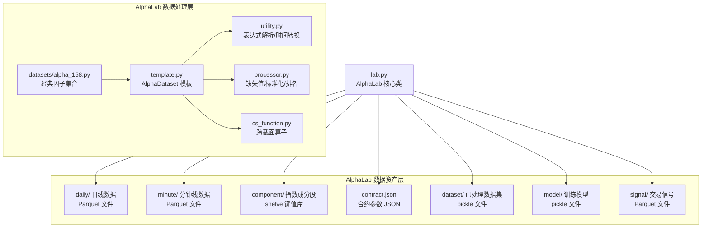
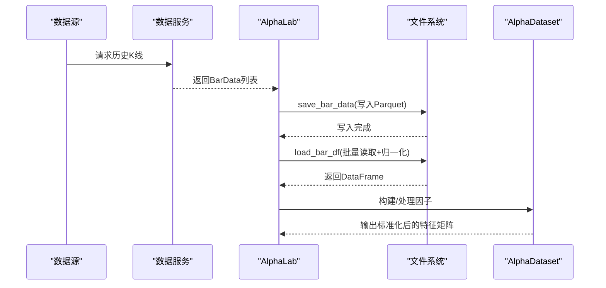
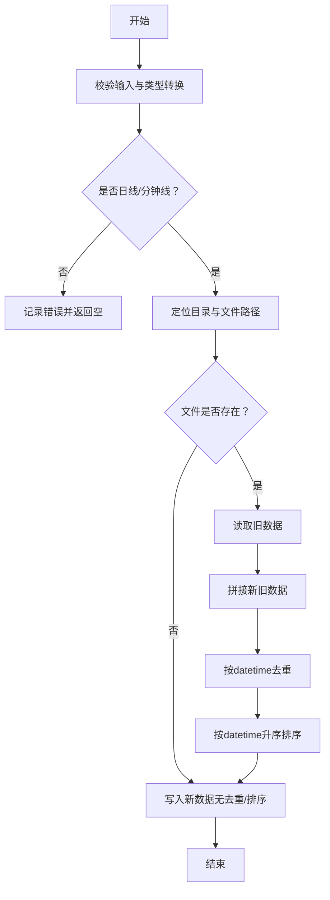
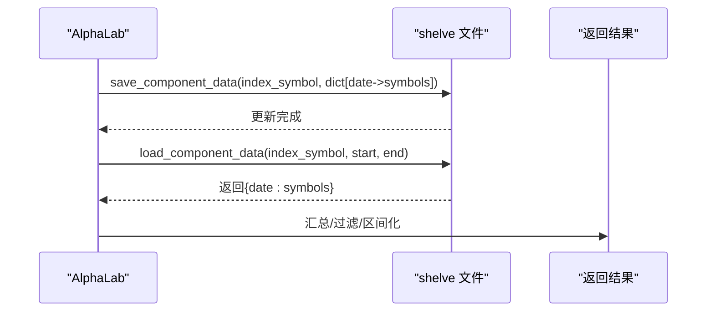
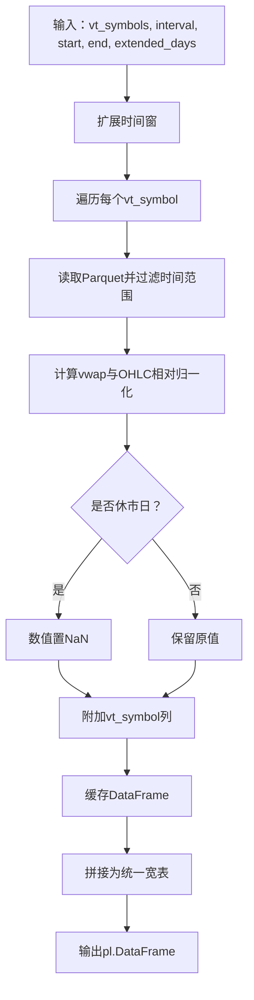
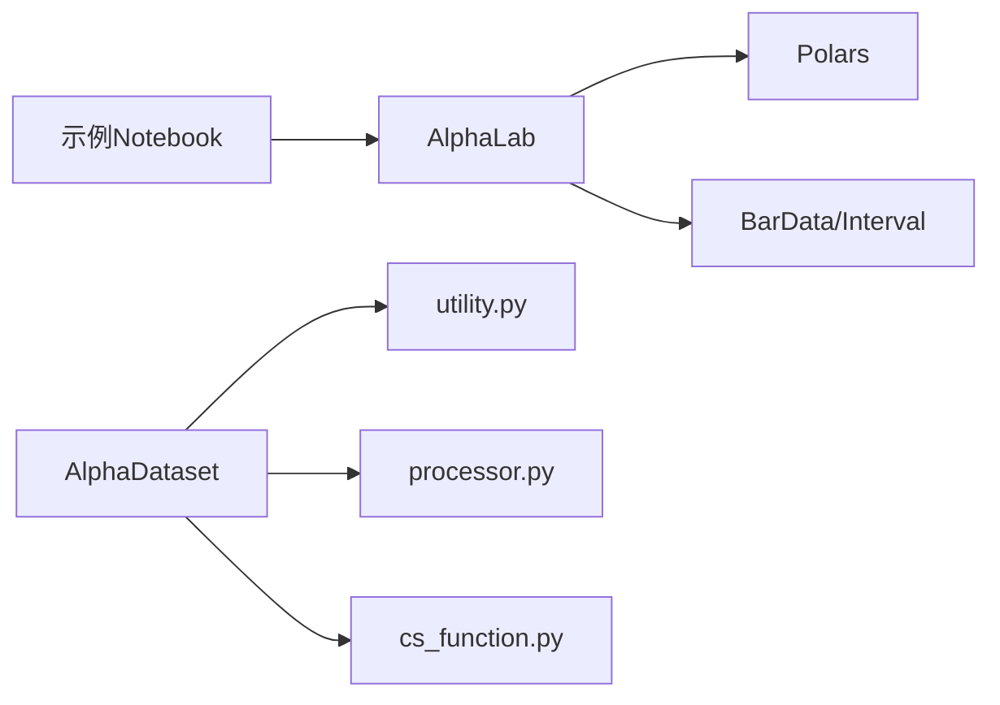

# 数据资产管理

<cite>
**本文引用的文件列表**
- [lab.py](file://vnpy/alpha/lab.py)
- [utility.py](file://vnpy/alpha/dataset/utility.py)
- [template.py](file://vnpy/alpha/dataset/template.py)
- [processor.py](file://vnpy/alpha/dataset/processor.py)
- [cs_function.py](file://vnpy/alpha/dataset/cs_function.py)
- [alpha_158.py](file://vnpy/alpha/dataset/datasets/alpha_158.py)
- [download_data_rq.ipynb](file://examples/alpha_research/download_data_rq.ipynb)
- [CLAUDE.md](file://vnpy/alpha/CLAUDE.md)
</cite>

## 目录
1. [简介](#简介)
2. [项目结构](#项目结构)
3. [核心组件](#核心组件)
4. [架构总览](#架构总览)
5. [详细组件分析](#详细组件分析)
6. [依赖关系分析](#依赖关系分析)
7. [性能考量](#性能考量)
8. [故障排查指南](#故障排查指南)
9. [结论](#结论)
10. [附录](#附录)

## 简介
本文件系统化梳理 AlphaLab 的数据资产管理机制，围绕多周期 K 线数据（日线/分钟线）的存储与加载、指数成分股数据的持久化与时间序列查询、合约参数配置的 JSON 管理方案展开；并结合 load_bar_df 实现多标的归一化数据加载，支撑多因子分析工作流。同时解释数据路径组织结构的设计理念，并给出大数据量下的性能优化建议（内存管理与 I/O 调度）。

## 项目结构
AlphaLab 所在的 Alpha 子系统采用“按功能域划分”的组织方式：
- 数据资产层：K 线、指数成分股、合约参数、信号、数据集、模型等
- 数据处理层：因子表达式、跨截面/时序/技术因子、数据清洗与标准化
- 研究与建模层：AlphaDataset 模板、模型训练与回测、策略封装

图表来源
- [lab.py](file://vnpy/alpha/lab.py#L20-L48)
- [utility.py](file://vnpy/alpha/dataset/utility.py#L1-L183)
- [template.py](file://vnpy/alpha/dataset/template.py#L1-L304)
- [processor.py](file://vnpy/alpha/dataset/processor.py#L1-L125)
- [cs_function.py](file://vnpy/alpha/dataset/cs_function.py#L1-L38)
- [alpha_158.py](file://vnpy/alpha/dataset/datasets/alpha_158.py#L1-L40)

章节来源
- [lab.py](file://vnpy/alpha/lab.py#L20-L48)
- [CLAUDE.md](file://vnpy/alpha/CLAUDE.md#L83-L93)

## 核心组件
- AlphaLab：统一的数据资产管理入口，负责 K 线数据的保存/加载、指数成分股的持久化/查询、合约参数 JSON 管理、数据集/模型/信号的存取。
- AlphaDataset：多因子研究的数据模板，支持表达式驱动的特征生成、跨截面/时序/技术因子组合、数据清洗与标准化、滚动期切分与性能分析。
- 因子函数库：提供跨截面排名、均值、标准差等算子，配合 Polars 表达式实现高性能计算。
- 示例脚本：演示从数据源下载、保存到本地，以及后续的因子构建与分析流程。

章节来源
- [lab.py](file://vnpy/alpha/lab.py#L20-L48)
- [template.py](file://vnpy/alpha/dataset/template.py#L23-L171)
- [utility.py](file://vnpy/alpha/dataset/utility.py#L1-L183)
- [cs_function.py](file://vnpy/alpha/dataset/cs_function.py#L1-L38)
- [alpha_158.py](file://vnpy/alpha/dataset/datasets/alpha_158.py#L1-L40)

## 架构总览
下图展示了 AlphaLab 在数据资产管理中的关键交互：数据写入（保存）、数据读取（加载）、数据加工（归一化与清洗）、因子构建与分析。

图表来源
- [lab.py](file://vnpy/alpha/lab.py#L51-L243)
- [template.py](file://vnpy/alpha/dataset/template.py#L90-L171)

## 详细组件分析

### 多周期K线数据：存储与加载
- 存储（save_bar_data）
  - 依据 BarData.interval 将日线/分钟线分别落盘至 daily/ 或 minute/ 目录，文件名为 vt_symbol.parquet。
  - 若文件已存在，则先读取旧数据，与新数据拼接后去重（按 datetime），再按时间升序排序，最后写回。
  - 字段包含 datetime、OHLCV、turnover、open_interest 等。
- 加载（load_bar_data）
  - 支持按 vt_symbol + interval + 时间范围过滤，返回 BarData 列表。
  - 对不存在的文件记录错误日志并返回空列表。
- 归一化加载（load_bar_df）
  - 支持多标的批量加载，自动扩展时间窗（前推扩展天数，后推少量天数以覆盖滑窗）。
  - 为每个标的计算 vwap，并对 OHLC 进行相对归一化（以首个收盘价为基准）。
  - 将休市日的数值置为 NaN，便于后续清洗与标准化。
  - 为每条记录附加 vt_symbol 列，最终将各标的 DataFrame 拼接为统一的宽表。

图表来源
- [lab.py](file://vnpy/alpha/lab.py#L51-L95)

章节来源
- [lab.py](file://vnpy/alpha/lab.py#L51-L243)

### Parquet 文件格式选择与数据去重/排序策略
- 选择 Parquet 的原因
  - 列式存储，压缩率高，I/O 性能优异，适合高频金融数据的顺序扫描与范围过滤。
  - Polars 对 Parquet 的读写原生支持，便于在 load_bar_df 中进行链式计算（过滤、列变换、拼接）。
- 去重与排序
  - 去重：以 datetime 为主键去重，避免重复写入导致的数据膨胀。
  - 排序：按时间升序，确保后续分析与回测的时序一致性。
- 与 Polars 的协同
  - load_bar_df 在读取后立即进行列级类型指定、衍生指标计算（vwap）、NaN 标记与符号列注入，形成可直接用于因子工程的宽表。

章节来源
- [lab.py](file://vnpy/alpha/lab.py#L51-L243)

### 指数成分股数据：持久化与时间序列查询
- 持久化（save_component_data）
  - 以 index_symbol 作为键名创建 shelve 文件，键为日期字符串（YYYY-MM-DD），值为当日成分股列表。
  - 使用 update 原子性地合并新增日期的数据。
- 查询（load_component_data/load_component_symbols/load_component_filters）
  - load_component_data：按时间范围返回字典，键为 datetime，值为成分股列表。
  - load_component_symbols：汇总所有成分股集合。
  - load_component_filters：将连续持有期映射为 (start, end) 区间，便于后续按标的筛选。

图表来源
- [lab.py](file://vnpy/alpha/lab.py#L245-L347)

章节来源
- [lab.py](file://vnpy/alpha/lab.py#L245-L347)

### 合约参数配置：JSON 管理方案
- 存储（add_contract_setting）
  - 读取 contract.json（若存在），合并新 vt_symbol 的参数（保证金率、手续费、合约乘数、最小变动价位）。
  - 以缩进格式写回，保持可读性。
- 加载（load_contract_setttings）
  - 直接读取 JSON 并返回字典，便于回测引擎或策略模块按需取用。

章节来源
- [lab.py](file://vnpy/alpha/lab.py#L349-L388)

### 多因子分析：通过 load_bar_df 实现多标的归一化数据加载
- load_bar_df 的关键步骤
  - 扩展时间窗：前推扩展天数，后推少量天数，确保滑动窗口期的完整性。
  - 逐标读取：按 vt_symbol 定位 Parquet 文件，过滤时间范围，计算 vwap。
  - 归一化：以首个收盘价为基准对 OHLC 进行相对归一化，消除价格量纲差异。
  - 休市标记：当某日 OHLC 全为 0 时，将其置为 NaN，避免对因子收益产生干扰。
  - 统一列：为每条记录附加 vt_symbol，最终拼接为宽表，便于后续因子工程与回测。
- 与 AlphaDataset 的衔接
  - AlphaDataset 支持表达式驱动的特征生成、跨截面/时序/技术因子组合、缺失值填充与标准化、滚动期切分与性能分析。
  - 结合 processor.py 的清洗与标准化算子，可快速构建稳健的因子矩阵。

图表来源
- [lab.py](file://vnpy/alpha/lab.py#L156-L243)
- [template.py](file://vnpy/alpha/dataset/template.py#L90-L171)
- [processor.py](file://vnpy/alpha/dataset/processor.py#L1-L125)

章节来源
- [lab.py](file://vnpy/alpha/lab.py#L156-L243)
- [template.py](file://vnpy/alpha/dataset/template.py#L90-L171)
- [processor.py](file://vnpy/alpha/dataset/processor.py#L1-L125)

### 数据路径组织结构的设计理念
- daily/ 与 minute/：按周期分离，便于按需加载与缓存；Parquet 列式存储利于范围查询与聚合。
- component/：以指数为单位的 shelve 存储，键为日期字符串，值为成分股列表，天然支持时间序列查询与区间过滤。
- dataset/、model/、signal/：分别存放处理后的数据集、训练好的模型与交易信号，职责清晰、便于版本管理。
- contract.json：集中管理合约参数，避免散落配置带来的维护成本。

章节来源
- [lab.py](file://vnpy/alpha/lab.py#L20-L48)
- [CLAUDE.md](file://vnpy/alpha/CLAUDE.md#L83-L93)

## 依赖关系分析
- AlphaLab 依赖 Polars 进行高性能数据处理，依赖 vntrader 的 BarData/Interval/extract_vt_symbol 等对象与常量。
- AlphaDataset 依赖 utility.py 的表达式解析与时间转换、processor.py 的清洗与标准化算子、cs_function.py 的跨截面算子。
- 示例 Notebook 展示了从数据源下载、保存到本地、添加合约参数、再到因子构建与分析的完整流程。

图表来源
- [lab.py](file://vnpy/alpha/lab.py#L1-L18)
- [template.py](file://vnpy/alpha/dataset/template.py#L1-L30)
- [utility.py](file://vnpy/alpha/dataset/utility.py#L1-L183)
- [processor.py](file://vnpy/alpha/dataset/processor.py#L1-L125)
- [cs_function.py](file://vnpy/alpha/dataset/cs_function.py#L1-L38)
- [download_data_rq.ipynb](file://examples/alpha_research/download_data_rq.ipynb#L1-L195)

章节来源
- [lab.py](file://vnpy/alpha/lab.py#L1-L18)
- [template.py](file://vnpy/alpha/dataset/template.py#L1-L30)
- [utility.py](file://vnpy/alpha/dataset/utility.py#L1-L183)
- [processor.py](file://vnpy/alpha/dataset/processor.py#L1-L125)
- [cs_function.py](file://vnpy/alpha/dataset/cs_function.py#L1-L38)
- [download_data_rq.ipynb](file://examples/alpha_research/download_data_rq.ipynb#L1-L195)

## 性能考量
- I/O 与存储
  - 使用 Parquet 列式存储，结合 Polars 的惰性求值与向量化操作，可显著降低内存占用与提升扫描效率。
  - load_bar_df 在读取后立即进行过滤与列变换，避免中间态的多次磁盘往返。
- 内存管理
  - 对于超大标的集合，建议分批加载（按 batch_size 切分 vt_symbols），并在拼接前及时释放中间 DataFrame。
  - 使用 load_bar_df 的扩展时间窗策略，尽量减少重复 I/O；必要时对历史数据进行分区裁剪。
- 并发与并行
  - AlphaDataset 的 prepare_data 使用进程池并行计算多个因子表达式，充分利用多核 CPU。
  - 对于外部数据下载，可参考示例 Notebook 的批量循环方式，结合进度条与错误重试策略。
- 清洗与标准化
  - 使用 processor.py 的缺失值填充与跨截面标准化，可在保证稳定性的同时减少异常值对因子收益的影响。
- 磁盘与网络
  - 将数据目录置于高速磁盘（SSD）或网络共享存储（NAS）时，注意 I/O 调度与并发限制，避免磁盘瓶颈。

章节来源
- [lab.py](file://vnpy/alpha/lab.py#L156-L243)
- [template.py](file://vnpy/alpha/dataset/template.py#L90-L171)
- [processor.py](file://vnpy/alpha/dataset/processor.py#L1-L125)
- [download_data_rq.ipynb](file://examples/alpha_research/download_data_rq.ipynb#L120-L153)

## 故障排查指南
- 文件不存在
  - load_bar_data/load_bar_df 在找不到对应 Parquet 文件时会记录错误日志并返回空结果/跳过该标的。请确认 vt_symbol 与 interval 是否匹配，以及数据是否已成功保存。
- 不支持的时间周期
  - save_bar_data/load_bar_data 对除日线/分钟线之外的周期会记录错误并返回空。请检查 Interval 值。
- 休市日数据异常
  - load_bar_df 将休市日的数值置为 NaN，若后续因子出现异常，应检查清洗与标准化步骤是否正确应用。
- 成分股数据为空
  - load_component_data 返回空字典时，需确认 shelve 文件是否已正确保存，且日期格式为 YYYY-MM-DD。
- 合约参数缺失
  - load_contract_setttings 返回空字典时，需确认 contract.json 是否存在且格式正确。

章节来源
- [lab.py](file://vnpy/alpha/lab.py#L96-L155)
- [lab.py](file://vnpy/alpha/lab.py#L172-L243)
- [lab.py](file://vnpy/alpha/lab.py#L245-L347)
- [lab.py](file://vnpy/alpha/lab.py#L349-L388)

## 结论
AlphaLab 通过清晰的数据路径组织与高效的 Parquet 存储，实现了多周期 K 线数据的可靠落盘与快速加载；借助 load_bar_df 的多标归一化能力，为多因子分析提供了高质量的输入数据。指数成分股数据采用 shelve 的键值存储，便于时间序列查询与区间过滤；合约参数以 JSON 集中管理，降低了配置复杂度。结合 Polars 的高性能计算与 AlphaDataset 的表达式驱动因子工程，可满足从数据准备到因子分析的全流程需求。

## 附录
- 示例流程参考
  - 从数据源下载、保存成分股与日线数据、添加合约参数、使用 load_bar_df 构建因子矩阵、进行因子分析与回测的完整示例，可参考示例 Notebook。

章节来源
- [download_data_rq.ipynb](file://examples/alpha_research/download_data_rq.ipynb#L1-L195)