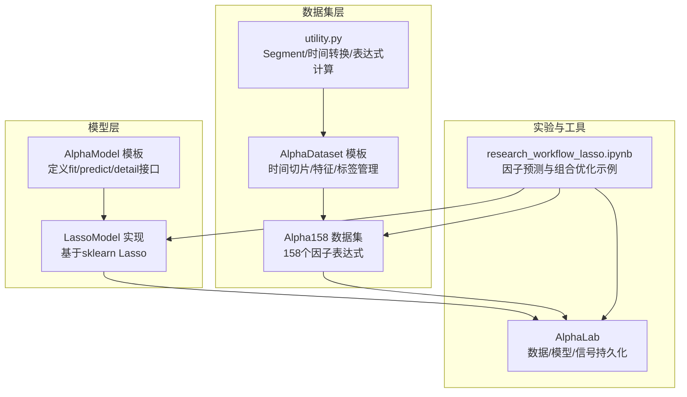
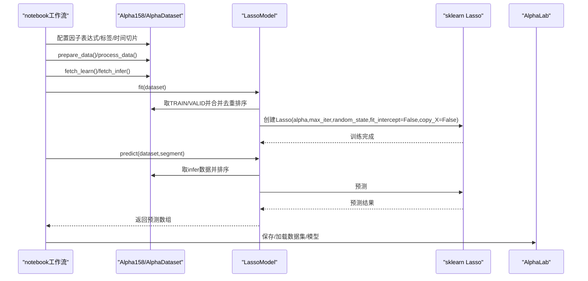
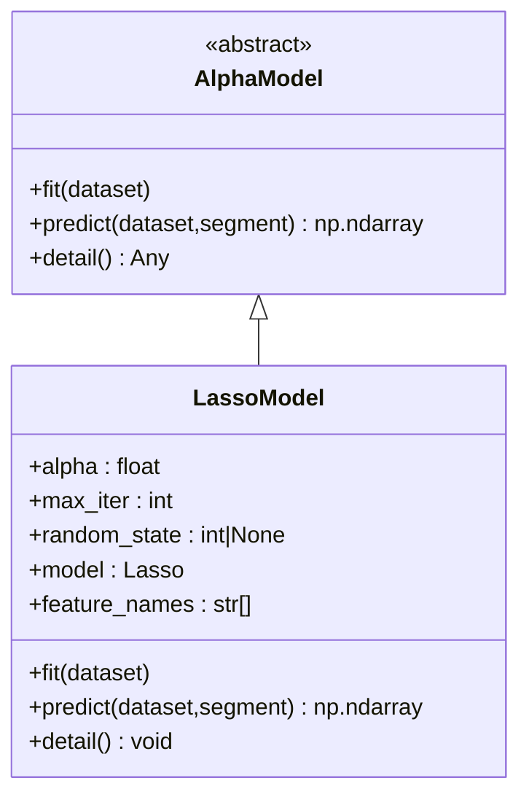
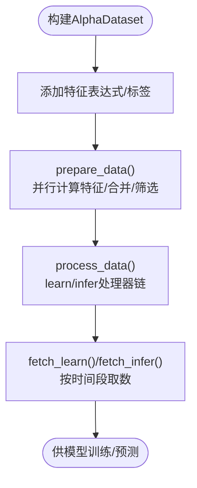
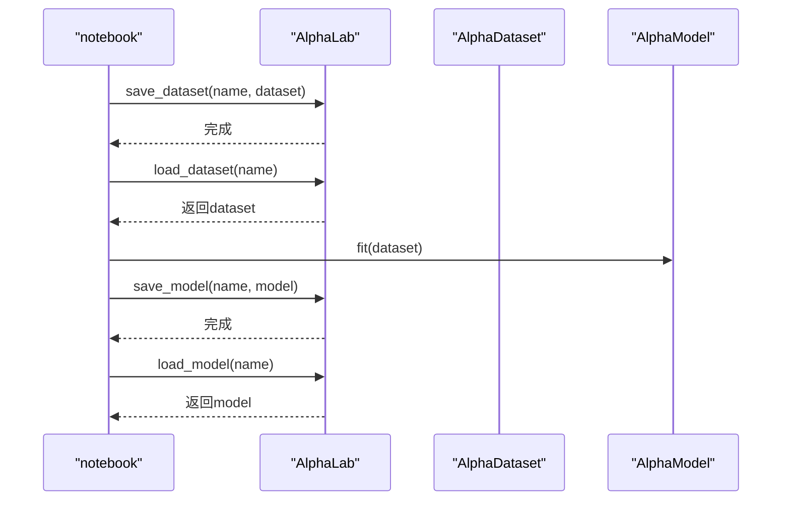
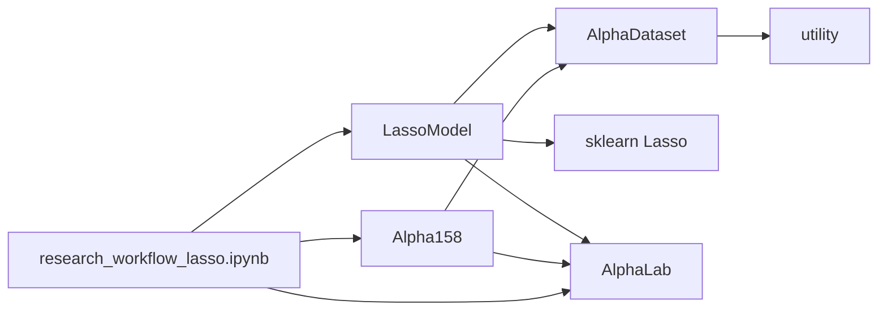

# Lasso回归模型

<cite>
**本文引用的文件**
- [lasso_model.py](file://vnpy/alpha/model/models/lasso_model.py)
- [template.py](file://vnpy/alpha/model/template.py)
- [alpha_158.py](file://vnpy/alpha/dataset/datasets/alpha_158.py)
- [template.py](file://vnpy/alpha/dataset/template.py)
- [utility.py](file://vnpy/alpha/dataset/utility.py)
- [lab.py](file://vnpy/alpha/lab.py)
- [research_workflow_lasso.ipynb](file://examples/alpha_research/research_workflow_lasso.ipynb)
- [__init__.py](file://vnpy/alpha/__init__.py)
</cite>

## 目录
1. [简介](#简介)
2. [项目结构](#项目结构)
3. [核心组件](#核心组件)
4. [架构总览](#架构总览)
5. [详细组件分析](#详细组件分析)
6. [依赖关系分析](#依赖关系分析)
7. [性能考量](#性能考量)
8. [故障排查指南](#故障排查指南)
9. [结论](#结论)
10. [附录](#附录)

## 简介
本文件系统性解析vnpy中Alpha研究框架下的Lasso回归模型实现，重点覆盖以下方面：
- 继承结构：LassoModel对AlphaModel的实现与职责边界
- 正则化参数配置：alpha、迭代上限、随机种子等
- 特征选择与稀疏性控制：基于L1正则的自动特征选择机制
- 训练流程：数据准备、合并、去重、排序、训练与预测
- 标准化与归一化：数据预处理策略（含跨截面标准化）
- 交叉验证与最优lambda选择：当前实现未内置CV，建议的替代方案
- 因子预测与组合优化：结合notebook工作流说明使用方式
- 序列化与加载：模型与数据集的持久化与恢复

## 项目结构
围绕Lasso模型的相关代码位于vnpy/alpha子模块中，采用“模型模板 + 具体模型实现 + 数据集模板 + 工具函数 + 实验工作流”的分层组织方式。

图表来源
- [template.py](file://vnpy/alpha/model/template.py#L1-L31)
- [lasso_model.py](file://vnpy/alpha/model/models/lasso_model.py#L1-L140)
- [template.py](file://vnpy/alpha/dataset/template.py#L1-L304)
- [alpha_158.py](file://vnpy/alpha/dataset/datasets/alpha_158.py#L1-L131)
- [utility.py](file://vnpy/alpha/dataset/utility.py#L1-L183)
- [lab.py](file://vnpy/alpha/lab.py#L1-L481)
- [research_workflow_lasso.ipynb](file://examples/alpha_research/research_workflow_lasso.ipynb#L1-L528)

章节来源
- [__init__.py](file://vnpy/alpha/__init__.py#L1-L18)

## 核心组件
- AlphaModel抽象基类：定义fit、predict、detail等统一接口，约束具体模型实现。
- LassoModel：基于sklearn Lasso的线性回归实现，支持稀疏性控制与系数导出。
- AlphaDataset与Alpha158：提供因子表达式、标签设置、时间切片与预处理流水线。
- AlphaLab：提供数据/模型/信号的持久化与加载能力。
- research_workflow_lasso.ipynb：演示从数据准备到因子预测与组合优化的完整流程。

章节来源
- [template.py](file://vnpy/alpha/model/template.py#L1-L31)
- [lasso_model.py](file://vnpy/alpha/model/models/lasso_model.py#L1-L140)
- [template.py](file://vnpy/alpha/dataset/template.py#L1-L304)
- [alpha_158.py](file://vnpy/alpha/dataset/datasets/alpha_158.py#L1-L131)
- [lab.py](file://vnpy/alpha/lab.py#L1-L481)
- [research_workflow_lasso.ipynb](file://examples/alpha_research/research_workflow_lasso.ipynb#L1-L528)

## 架构总览
下图展示了Lasso模型在Alpha研究框架中的位置与交互关系。

图表来源
- [lasso_model.py](file://vnpy/alpha/model/models/lasso_model.py#L40-L111)
- [template.py](file://vnpy/alpha/dataset/template.py#L157-L192)
- [alpha_158.py](file://vnpy/alpha/dataset/datasets/alpha_158.py#L1-L131)
- [lab.py](file://vnpy/alpha/lab.py#L389-L438)
- [research_workflow_lasso.ipynb](file://examples/alpha_research/research_workflow_lasso.ipynb#L1-L528)

## 详细组件分析

### LassoModel类分析
- 继承结构：LassoModel继承自AlphaModel，必须实现fit、predict、detail方法。
- 关键字段
  - alpha：正则化强度（越大越强的稀疏性）
  - max_iter：最大迭代次数
  - random_state：随机种子
  - model：sklearn Lasso实例
  - feature_names：训练时提取的特征名列表
- 训练流程
  - 合并训练/验证数据，去重并按时间与合约排序
  - 提取特征列与标签列，转换为numpy数组
  - 使用sklearn Lasso创建模型并训练（关闭截距、禁用拷贝X）
- 预测流程
  - 检查模型是否已训练
  - 从数据集中取出指定段的数据并排序
  - 转换为numpy数组后调用predict
- 特征重要性输出
  - 读取coef_，过滤零系数
  - 按绝对值降序排序，打印非零系数与数量

图表来源
- [template.py](file://vnpy/alpha/model/template.py#L1-L31)
- [lasso_model.py](file://vnpy/alpha/model/models/lasso_model.py#L1-L140)

章节来源
- [lasso_model.py](file://vnpy/alpha/model/models/lasso_model.py#L1-L140)

### AlphaDataset与Alpha158分析
- AlphaDataset
  - 时间切片：TRAIN/VALID/TEST三段期配置
  - 特征与标签：通过表达式或外部结果注入，支持并行计算
  - 预处理：learn/infer两套处理器链，支持追加模式
  - 数据查询：按时间段筛选与排序
- Alpha158
  - 内置158个因子表达式（K线形态、动量、波动率、动量比率、相关性、成交量等）
  - 标签：未来一段时间的收益率（delay形式）

图表来源
- [template.py](file://vnpy/alpha/dataset/template.py#L58-L192)
- [alpha_158.py](file://vnpy/alpha/dataset/datasets/alpha_158.py#L1-L131)

章节来源
- [template.py](file://vnpy/alpha/dataset/template.py#L1-L304)
- [alpha_158.py](file://vnpy/alpha/dataset/datasets/alpha_158.py#L1-L131)
- [utility.py](file://vnpy/alpha/dataset/utility.py#L1-L183)

### 数据预处理与标准化
- 数据预处理管线
  - learn阶段：丢弃缺失标签的样本、对标签做跨截面z-score标准化
  - infer阶段：对缺失值填充为0
- 说明
  - note中明确指出“因子计算”阶段会进行跨截面标准化；此处learn阶段对“标签”做标准化，有助于提升回归稳定性
  - infer阶段对缺失值填充，避免预测时出现NaN导致的错误

章节来源
- [research_workflow_lasso.ipynb](file://examples/alpha_research/research_workflow_lasso.ipynb#L170-L210)

### 模型训练与预测流程
- 训练
  - 合并训练/验证数据，去重并排序
  - 提取特征矩阵X与标签向量y
  - 创建sklearn Lasso并训练
- 预测
  - 检查模型是否已训练
  - 对预测数据排序并转换为numpy数组
  - 返回预测结果

章节来源
- [lasso_model.py](file://vnpy/alpha/model/models/lasso_model.py#L40-L111)

### 特征选择与稀疏性控制
- 稀疏性来源
  - L1正则（alpha）使部分系数收缩至零，实现自动特征选择
- 输出与解释
  - detail()仅输出非零系数，按绝对值排序，便于识别重要特征
- 注意
  - 当前实现未对特征进行标准化（如全局z-score），可能影响系数可比性与稀疏性强度

章节来源
- [lasso_model.py](file://vnpy/alpha/model/models/lasso_model.py#L112-L140)

### 交叉验证与最优lambda选择
- 当前实现
  - 未内置交叉验证（CV）与lambda网格搜索
- 建议方案
  - 在notebook中引入sklearn的GridSearchCV或RandomizedSearchCV，对alpha进行网格搜索
  - 结合AlphaLab保存不同alpha下的模型，便于后续比较与回测
- 说明
  - 由于Lasso不拟合截距，需关注数据预处理（如标准化）对系数的影响

章节来源
- [research_workflow_lasso.ipynb](file://examples/alpha_research/research_workflow_lasso.ipynb#L1-L528)
- [lab.py](file://vnpy/alpha/lab.py#L421-L438)

### 因子预测与组合优化
- 因子预测
  - 使用LassoModel对测试期进行预测，得到每只股票的预期收益
- 组合优化
  - 将预测信号用于构建投资组合（例如按预测收益排序、构造多空组合）
  - note中包含因子表现分析与信号表现分析的可视化流程

章节来源
- [research_workflow_lasso.ipynb](file://examples/alpha_research/research_workflow_lasso.ipynb#L1-L528)

### 模型与数据集的序列化与加载
- 数据集持久化
  - 保存/加载AlphaDataset为.pkl文件，便于复用特征工程结果
- 模型持久化
  - 保存/加载AlphaModel为.pkl文件，支持模型版本管理与迁移
- 信号持久化
  - 保存/加载信号为.parquet文件，便于后续回测与分析

图表来源
- [lab.py](file://vnpy/alpha/lab.py#L389-L438)

章节来源
- [lab.py](file://vnpy/alpha/lab.py#L389-L438)

## 依赖关系分析
- 组件耦合
  - LassoModel依赖AlphaDataset的fetch_learn/fetch_infer接口
  - Alpha158依赖AlphaDataset模板与utility工具（表达式/时间转换）
  - AlphaLab提供数据/模型/信号的持久化能力
- 外部依赖
  - sklearn.linear_model.Lasso：核心回归算法
  - polars：高性能数据结构与表达式计算
  - alphalens：因子分析与可视化（notebook中使用）

图表来源
- [lasso_model.py](file://vnpy/alpha/model/models/lasso_model.py#L1-L140)
- [template.py](file://vnpy/alpha/dataset/template.py#L1-L304)
- [alpha_158.py](file://vnpy/alpha/dataset/datasets/alpha_158.py#L1-L131)
- [utility.py](file://vnpy/alpha/dataset/utility.py#L1-L183)
- [lab.py](file://vnpy/alpha/lab.py#L1-L481)
- [research_workflow_lasso.ipynb](file://examples/alpha_research/research_workflow_lasso.ipynb#L1-L528)

## 性能考量
- 并行特征计算：AlphaDataset在prepare_data阶段使用多进程并行计算特征，显著提升大规模数据处理效率
- 数据结构：使用polars作为底层数据结构，具备高效的列式存储与表达式执行能力
- 训练效率：Lasso模型训练复杂度与特征维度相关，建议在训练前进行特征筛选以降低维度
- 预测效率：预测阶段仅需对特征矩阵进行一次矩阵乘法，开销较小

章节来源
- [template.py](file://vnpy/alpha/dataset/template.py#L90-L156)

## 故障排查指南
- 模型未训练即预测
  - 现象：predict时报错提示模型未训练
  - 处理：确保先调用fit(dataset)，再进行predict
- 数据为空或列名不匹配
  - 现象：训练/预测阶段X/y形状异常
  - 处理：检查AlphaDataset的prepare_data/process_data是否正确执行，确认特征列与标签列存在且无重复
- 系数全为零
  - 现象：detail()输出为空或仅有极少数非零系数
  - 处理：增大alpha或调整数据预处理（如加入标准化），观察系数分布变化
- 过拟合风险
  - 现象：训练集拟合很好但测试集效果差
  - 处理：增大alpha、减少特征维度、增加样本量、引入正则化CV

章节来源
- [lasso_model.py](file://vnpy/alpha/model/models/lasso_model.py#L96-L111)
- [template.py](file://vnpy/alpha/dataset/template.py#L157-L192)

## 结论
vnpy的Lasso回归模型在Alpha研究框架中提供了简洁而强大的线性建模能力：
- 通过AlphaModel模板与AlphaDataset流水线，实现了从特征工程到模型训练/预测的完整闭环
- 利用L1正则实现自动特征选择，配合detail()输出可直观评估特征重要性
- 通过AlphaLab实现数据/模型/信号的持久化，便于复现实验与版本管理
- 当前未内置CV与lambda搜索，建议在notebook中扩展网格搜索与模型比较流程，以进一步提升模型稳健性与泛化能力

## 附录
- 超参数调优建议
  - alpha：建议在[1e-4, 1e-2, 1e-1, 1, 10]范围内网格搜索
  - max_iter：根据收敛情况适当提高
  - random_state：固定随机种子以保证结果可复现
- 过拟合防范措施
  - 增大alpha以增强稀疏性
  - 引入CV与早停策略（若扩展为迭代式模型）
  - 控制特征维度，优先保留高信息增益特征
- 解释意义
  - 系数权重反映各因子对目标变量的线性影响方向与强度
  - 绝对值排序可用于因子重要性排序，指导因子筛选与组合优化