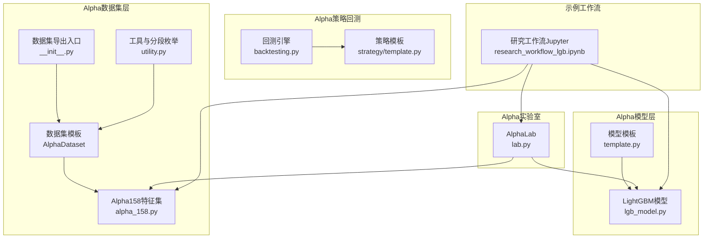
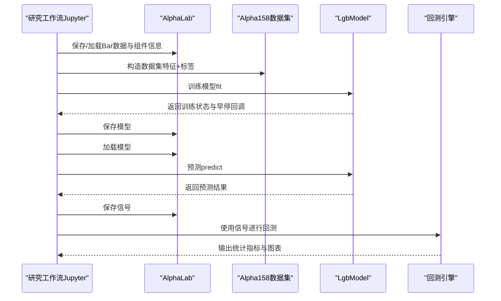
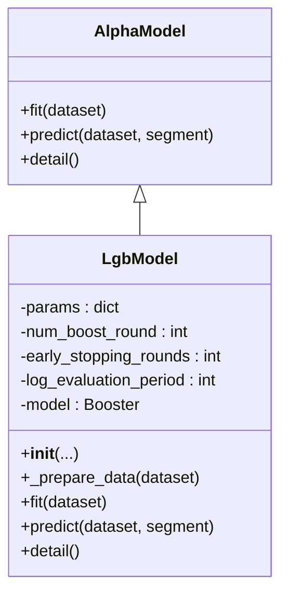
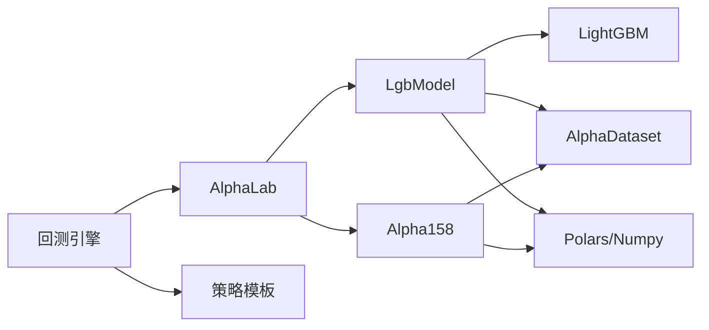

# LightGBM梯度提升树模型

<cite>
**本文引用的文件**
- [lgb_model.py](file://vnpy/alpha/model/models/lgb_model.py)
- [template.py](file://vnpy/alpha/model/template.py)
- [lab.py](file://vnpy/alpha/lab.py)
- [alpha_158.py](file://vnpy/alpha/dataset/datasets/alpha_158.py)
- [__init__.py（dataset）](file://vnpy/alpha/dataset/__init__.py)
- [utility.py](file://vnpy/alpha/dataset/utility.py)
- [research_workflow_lgb.ipynb](file://examples/alpha_research/research_workflow_lgb.ipynb)
- [backtesting.py](file://vnpy/alpha/strategy/backtesting.py)
- [template.py（strategy）](file://vnpy/alpha/strategy/template.py)
</cite>

## 目录
1. [简介](#简介)
2. [项目结构](#项目结构)
3. [核心组件](#核心组件)
4. [架构总览](#架构总览)
5. [详细组件分析](#详细组件分析)
6. [依赖关系分析](#依赖关系分析)
7. [性能考量](#性能考量)
8. [故障排查指南](#故障排查指南)
9. [结论](#结论)
10. [附录](#附录)

## 简介
本文件系统化文档化vnpy中基于LightGBM的梯度提升树模型在Alpha研究管线中的集成与应用。重点覆盖：
- 基于lightgbm包封装的LgbModel类，包括关键参数（num_leaves、max_depth、learning_rate、n_estimators等）的配置建议与调优策略
- 模型对分类特征、缺失值的处理方式与内置特征重要性计算机制
- 结合research_workflow_lgb.ipynb展示从数据准备、模型训练、验证评估（IC、IR）到预测部署的完整流程
- 早停法（early_stopping）、交叉验证与超参数网格搜索的最佳实践
- 模型导出与增量训练的支持能力说明

## 项目结构
围绕LightGBM模型在vnpy中的位置，主要涉及以下模块：
- Alpha模型层：定义统一接口模板与具体LightGBM实现
- Alpha数据集层：提供特征工程、标签构造与数据分段（训练/验证/测试）
- Alpha实验室（AlphaLab）：提供数据持久化、模型/信号保存与加载
- Alpha策略回测引擎：提供回测框架与性能指标输出
- 示例工作流：完整的Alpha研究流程示例

图表来源
- [lgb_model.py](file://vnpy/alpha/model/models/lgb_model.py#L1-L171)
- [template.py](file://vnpy/alpha/model/template.py#L1-L31)
- [alpha_158.py](file://vnpy/alpha/dataset/datasets/alpha_158.py#L1-L131)
- [__init__.py（dataset）](file://vnpy/alpha/dataset/__init__.py#L1-L22)
- [utility.py](file://vnpy/alpha/dataset/utility.py#L1-L183)
- [lab.py](file://vnpy/alpha/lab.py#L1-L481)
- [backtesting.py](file://vnpy/alpha/strategy/backtesting.py#L1-L945)
- [template.py（strategy）](file://vnpy/alpha/strategy/template.py#L1-L206)
- [research_workflow_lgb.ipynb](file://examples/alpha_research/research_workflow_lgb.ipynb#L1-L521)

章节来源
- [lgb_model.py](file://vnpy/alpha/model/models/lgb_model.py#L1-L171)
- [template.py](file://vnpy/alpha/model/template.py#L1-L31)
- [alpha_158.py](file://vnpy/alpha/dataset/datasets/alpha_158.py#L1-L131)
- [__init__.py（dataset）](file://vnpy/alpha/dataset/__init__.py#L1-L22)
- [utility.py](file://vnpy/alpha/dataset/utility.py#L1-L183)
- [lab.py](file://vnpy/alpha/lab.py#L1-L481)
- [backtesting.py](file://vnpy/alpha/strategy/backtesting.py#L1-L945)
- [template.py（strategy）](file://vnpy/alpha/strategy/template.py#L1-L206)
- [research_workflow_lgb.ipynb](file://examples/alpha_research/research_workflow_lgb.ipynb#L1-L521)

## 核心组件
- LgbModel：基于LightGBM的梯度提升树模型封装，继承AlphaModel模板，提供fit/predict/detail方法，支持早停与特征重要性可视化。
- Alpha158：基于Qlib的158个基础因子构建的数据集，包含大量时间序列与成交量相关特征及标签构造逻辑。
- AlphaLab：提供数据/模型/信号的持久化与加载能力，便于在研究流程中复用。
- 回测引擎：提供策略回测、统计指标与可视化输出，支撑模型部署后的实盘回测验证。

章节来源
- [lgb_model.py](file://vnpy/alpha/model/models/lgb_model.py#L1-L171)
- [template.py](file://vnpy/alpha/model/template.py#L1-L31)
- [alpha_158.py](file://vnpy/alpha/dataset/datasets/alpha_158.py#L1-L131)
- [lab.py](file://vnpy/alpha/lab.py#L1-L481)
- [backtesting.py](file://vnpy/alpha/strategy/backtesting.py#L1-L945)

## 架构总览
下图展示了从数据准备到模型训练、评估与部署的关键交互路径。

图表来源
- [research_workflow_lgb.ipynb](file://examples/alpha_research/research_workflow_lgb.ipynb#L1-L521)
- [lab.py](file://vnpy/alpha/lab.py#L1-L481)
- [alpha_158.py](file://vnpy/alpha/dataset/datasets/alpha_158.py#L1-L131)
- [lgb_model.py](file://vnpy/alpha/model/models/lgb_model.py#L1-L171)
- [backtesting.py](file://vnpy/alpha/strategy/backtesting.py#L1-L945)

## 详细组件分析

### LgbModel组件分析
- 继承关系与职责
  - 继承自AlphaModel，遵循统一fit/predict/detail接口约定，便于在Alpha研究管线中无缝替换其他模型。
- 关键参数与默认值
  - learning_rate：学习率，默认0.1
  - num_leaves：叶子节点数，默认31
  - num_boost_round：最大训练轮次，默认1000
  - early_stopping_rounds：早停轮次，默认50
  - log_evaluation_period：日志打印周期，默认1
  - seed：随机种子
- 数据准备与训练
  - _prepare_data：按训练/验证分段排序后转换为LightGBM Dataset；使用lgb.train执行训练，传入valid_sets与valid_names用于验证集监控。
  - 回调函数：early_stopping与log_evaluation分别控制早停与日志输出频率。
- 预测与特征重要性
  - predict：对指定分段进行推理，返回numpy数组；若未训练则抛出异常。
  - detail：基于LightGBM内置plot_importance生成split与gain两种重要性图，限制显示前50个特征。
- 缺失值与分类特征
  - 代码中未显式设置“缺失值处理”或“分类特征编码”参数，因此默认行为取决于LightGBM的默认配置。建议在数据侧通过数据集预处理（如填充、标准化、分组归一化）保证输入质量。

图表来源
- [template.py](file://vnpy/alpha/model/template.py#L1-L31)
- [lgb_model.py](file://vnpy/alpha/model/models/lgb_model.py#L1-L171)

章节来源
- [lgb_model.py](file://vnpy/alpha/model/models/lgb_model.py#L1-L171)
- [template.py](file://vnpy/alpha/model/template.py#L1-L31)

### Alpha158数据集分析
- 特征体系
  - 包含蜡烛图形态特征、价格变化特征、时间序列统计特征（ROC、MA、STD、Beta、RSQR、Resi、Max/Min、Quantile、Rank、RSV、Argmax/Argmin、Corr、涨跌计数、波动强度等）。
- 标签构造
  - 标签采用未来一段时间的回报率差（ts_delay(close, -3)/ts_delay(close, -1) - 1），符合多因子研究中常用的相对回报标签范式。
- 数据分段
  - 通过train_period/valid_period/test_period划分训练、验证与测试区间，便于模型评估与回测。

章节来源
- [alpha_158.py](file://vnpy/alpha/dataset/datasets/alpha_158.py#L1-L131)

### AlphaLab与持久化
- 能力概述
  - 提供Bar数据的保存/加载（Parquet格式），支持日线/分钟线；支持指数成分过滤与持续合约设置。
  - 提供数据集/模型/信号的保存与加载，便于在研究流程中复用中间产物。
- 在模型流程中的作用
  - 研究工作流中通过AlphaLab保存/加载数据与模型，确保实验可重复与可迁移。

章节来源
- [lab.py](file://vnpy/alpha/lab.py#L1-L481)

### 回测引擎与部署
- 能力概述
  - 提供策略回测框架、每日收益计算、统计指标（年化收益、夏普比率、最大回撤等）、可视化图表与基准对比。
  - 通过信号DataFrame驱动下单与成交，支持手续费与滑点模拟。
- 与模型的关系
  - 研究工作流将模型预测作为信号输入回测引擎，从而评估模型在实盘环境下的表现。

章节来源
- [backtesting.py](file://vnpy/alpha/strategy/backtesting.py#L1-L945)
- [template.py（strategy）](file://vnpy/alpha/strategy/template.py#L1-L206)

### 研究工作流（Jupyter）概览
- 数据准备
  - 加载Bar数据、提取成分股、构造Alpha158特征集。
- 数据预处理
  - 添加drop_na与cs_norm等预处理步骤，保证后续建模输入质量。
- 模型训练与评估
  - 训练LightGBM模型，利用验证集进行早停监控；保存模型与信号。
- 部署与回测
  - 将信号导入回测引擎，输出统计指标与图表，进行IC/IR等评估。

章节来源
- [research_workflow_lgb.ipynb](file://examples/alpha_research/research_workflow_lgb.ipynb#L1-L521)

## 依赖关系分析
- 模型依赖
  - LgbModel依赖LightGBM库进行训练与预测；依赖AlphaDataset进行数据读取与分段；依赖Polars/Numpy进行数据转换。
- 数据集依赖
  - Alpha158依赖Polars表达式与时间序列/横截面函数，构造丰富特征。
- 实验管线依赖
  - AlphaLab负责数据/模型/信号的持久化；回测引擎负责策略执行与评估。

图表来源
- [lgb_model.py](file://vnpy/alpha/model/models/lgb_model.py#L1-L171)
- [alpha_158.py](file://vnpy/alpha/dataset/datasets/alpha_158.py#L1-L131)
- [lab.py](file://vnpy/alpha/lab.py#L1-L481)
- [backtesting.py](file://vnpy/alpha/strategy/backtesting.py#L1-L945)
- [template.py（strategy）](file://vnpy/alpha/strategy/template.py#L1-L206)

章节来源
- [lgb_model.py](file://vnpy/alpha/model/models/lgb_model.py#L1-L171)
- [alpha_158.py](file://vnpy/alpha/dataset/datasets/alpha_158.py#L1-L131)
- [lab.py](file://vnpy/alpha/lab.py#L1-L481)
- [backtesting.py](file://vnpy/alpha/strategy/backtesting.py#L1-L945)
- [template.py（strategy）](file://vnpy/alpha/strategy/template.py#L1-L206)

## 性能考量
- 计算效率
  - 特征数量较多（Alpha158包含158个特征），建议在训练前进行特征选择或降维；合理设置num_leaves与max_depth以平衡过拟合与速度。
- 内存占用
  - 大规模数据集与特征矩阵可能带来内存压力，建议分批训练或使用LightGBM的直方图算法优势（默认启用）。
- 并行与分布式
  - 可利用LightGBM的并行参数与分布式训练能力（如使用分布式数据源）进一步提升吞吐。
- 早停与验证
  - 合理设置early_stopping_rounds与验证集比例，避免过拟合同时缩短训练时间。

## 故障排查指南
- 训练阶段
  - 若出现“模型未训练”的预测错误，检查是否已成功调用fit并保存模型。
  - 若验证集无提升，检查early_stopping_rounds是否过大或学习率过高。
- 数据问题
  - 若特征列缺失或存在异常值，建议在数据集预处理阶段加入drop_na与robust_zscore_norm等步骤。
- 可视化问题
  - 若特征重要性图不显示，确认matplotlib可用且detail方法被调用。

章节来源
- [lgb_model.py](file://vnpy/alpha/model/models/lgb_model.py#L1-L171)
- [alpha_158.py](file://vnpy/alpha/dataset/datasets/alpha_158.py#L1-L131)
- [utility.py](file://vnpy/alpha/dataset/utility.py#L1-L183)

## 结论
vnpy中的LightGBM模型通过统一的AlphaModel接口与完善的Alpha研究管线实现了从数据准备、模型训练、评估到部署回测的闭环。结合Alpha158特征集与AlphaLab的持久化能力，用户可在Jupyter中快速迭代模型并进行回测验证。建议在实际应用中关注特征质量、早停策略与超参数调优，并结合回测指标（如IC、IR、夏普比率）进行综合评估。

## 附录

### 参数配置与调优建议
- num_leaves
  - 控制树的复杂度与过拟合风险。较小值更稳定但欠拟合风险高；较大值易过拟合。建议从31/63/127等2的幂次开始尝试。
- max_depth
  - 与num_leaves协同影响模型深度。深度过大易过拟合，建议与num_leaves联合搜索。
- learning_rate
  - 学习率越小，模型越稳健但收敛越慢。建议从0.05~0.1范围试探。
- n_estimators（num_boost_round）
  - 与早停法配合使用，避免无效增长。建议先固定较高上限，再由早停决定最优轮次。
- 早停法（early_stopping_rounds）
  - 建议设置为50~200之间，结合验证集指标（如AUC/IC）选择最佳轮次。
- 分类特征
  - 若存在类别型特征，建议在数据侧进行独热编码或目标编码，再交由LightGBM训练。
- 缺失值
  - 建议在数据预处理阶段完成缺失值填充与异常值处理，LightGBM默认对缺失值有良好处理能力但不等同于“无需预处理”。

### 交叉验证与网格搜索最佳实践
- 时间序列CV
  - 对金融数据建议使用滚动窗口或分层时间切分，避免未来信息泄露。
- 网格搜索
  - 建议采用贝叶斯优化或随机搜索，优先搜索num_leaves、learning_rate、max_depth等关键参数。
- 评估指标
  - 除准确率外，建议关注IC（信息系数）、IR（信息比率）与回撤指标，以适配Alpha场景。

### 模型导出与增量训练
- 导出
  - 可通过AlphaLab保存模型对象（pickle），便于后续加载与部署。
- 增量训练
  - LightGBM支持继续训练（boosting）。在vnpy中可通过重新加载已有模型并追加新数据进行增量训练，需注意特征一致性与标签更新策略。

章节来源
- [lgb_model.py](file://vnpy/alpha/model/models/lgb_model.py#L1-L171)
- [lab.py](file://vnpy/alpha/lab.py#L1-L481)
- [research_workflow_lgb.ipynb](file://examples/alpha_research/research_workflow_lgb.ipynb#L1-L521)