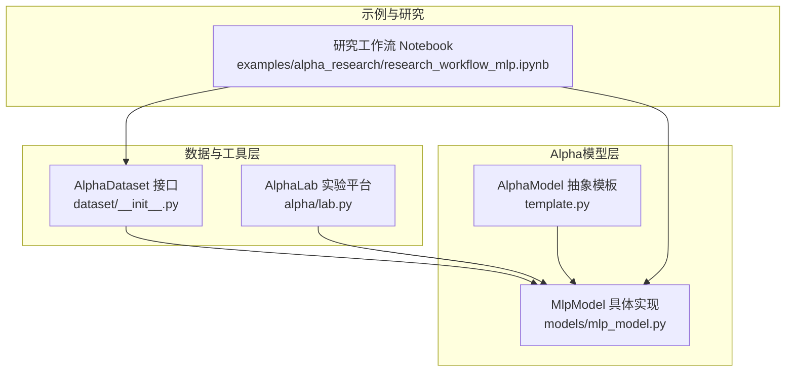
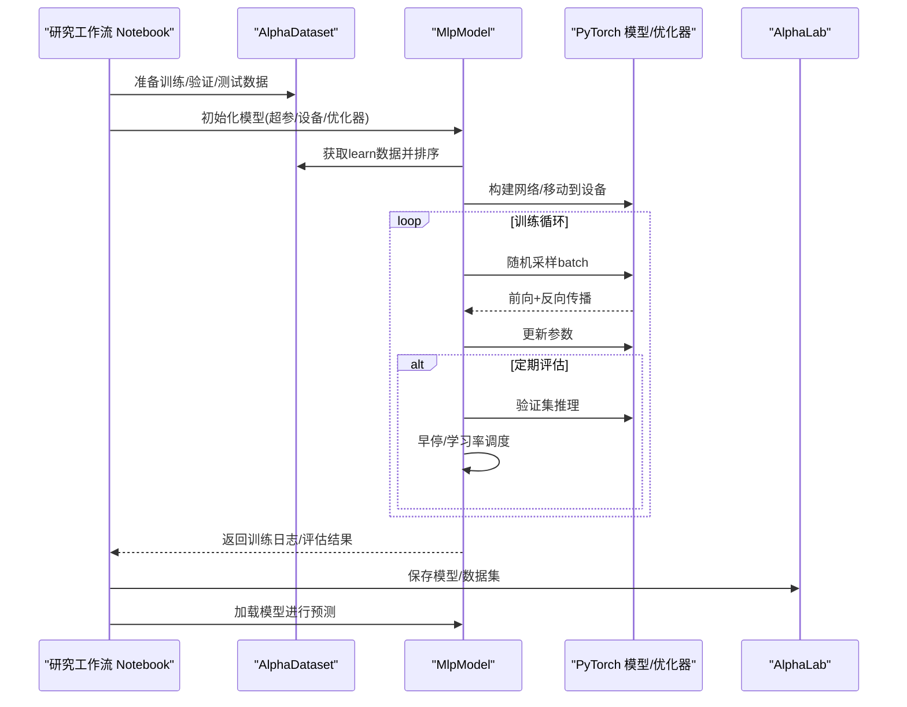
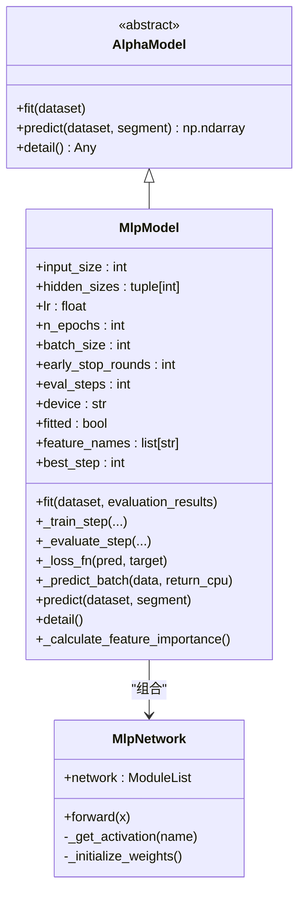
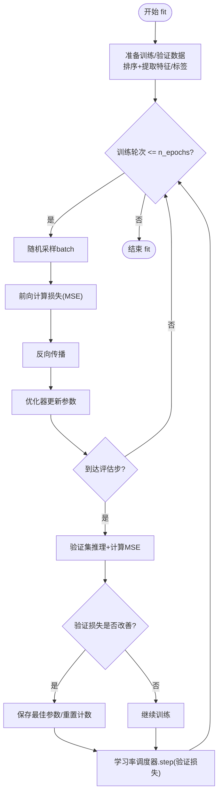
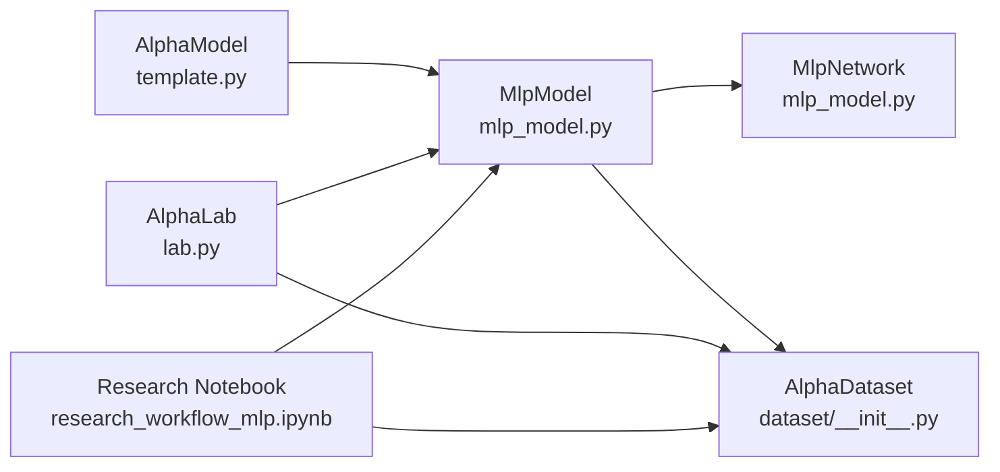

# 多层感知机神经网络模型

<cite>
**本文引用的文件列表**
- [mlp_model.py](file://vnpy/alpha/model/models/mlp_model.py)
- [template.py](file://vnpy/alpha/model/template.py)
- [research_workflow_mlp.ipynb](file://examples/alpha_research/research_workflow_mlp.ipynb)
- [lab.py](file://vnpy/alpha/lab.py)
- [__init__.py](file://vnpy/alpha/__init__.py)
- [dataset/__init__.py](file://vnpy/alpha/dataset/__init__.py)
</cite>

## 目录
1. [引言](#引言)
2. [项目结构](#项目结构)
3. [核心组件](#核心组件)
4. [架构总览](#架构总览)
5. [详细组件分析](#详细组件分析)
6. [依赖关系分析](#依赖关系分析)
7. [性能考量](#性能考量)
8. [故障排查指南](#故障排查指南)
9. [结论](#结论)
10. [附录](#附录)

## 引言
本文件系统性阐述vnpy中多层感知机（MLP）在Alpha因子预测任务中的实现原理与应用路径。文档围绕以下目标展开：
- 解析基于PyTorch的MLP模型架构与训练流程，包括隐藏层结构、激活函数、优化器与损失函数配置。
- 说明输入归一化、批量训练、早停策略、学习率调度等关键训练细节。
- 基于研究工作流notebook展示MLP在非线性因子关系建模中的优势与实践方法。
- 提供模型保存与加载、训练过程监控、收敛判断与性能评估的实操建议。
- 讨论在高频预测任务中的适用性与计算资源需求。

## 项目结构
MLP相关代码位于alpha子系统中，采用“模型模板 + 具体实现 + 研究工作流”的分层组织方式：
- 模型模板：定义通用接口与抽象规范，确保不同算法实现的一致性。
- 具体实现：MLP模型类及其网络结构，封装训练、评估、预测与特征重要性分析。
- 研究工作流：通过Jupyter Notebook演示完整的数据准备、特征工程、模型训练与评估流程。
- 实验平台：AlphaLab负责数据持久化、模型序列化与实验管理。

图表来源
- [mlp_model.py](file://vnpy/alpha/model/models/mlp_model.py#L1-L120)
- [template.py](file://vnpy/alpha/model/template.py#L1-L31)
- [dataset/__init__.py](file://vnpy/alpha/dataset/__init__.py#L1-L22)
- [lab.py](file://vnpy/alpha/lab.py#L1-L120)
- [research_workflow_mlp.ipynb](file://examples/alpha_research/research_workflow_mlp.ipynb#L1-L120)

章节来源
- [mlp_model.py](file://vnpy/alpha/model/models/mlp_model.py#L1-L120)
- [template.py](file://vnpy/alpha/model/template.py#L1-L31)
- [dataset/__init__.py](file://vnpy/alpha/dataset/__init__.py#L1-L22)
- [lab.py](file://vnpy/alpha/lab.py#L1-L120)
- [research_workflow_mlp.ipynb](file://examples/alpha_research/research_workflow_mlp.ipynb#L1-L120)

## 核心组件
- AlphaModel抽象模板：定义fit与predict等核心接口，约束具体模型实现。
- MlpModel：基于PyTorch实现的多层感知机，支持Adam/SGD优化、早停、学习率调度、特征重要性分析。
- MlpNetwork：深度前馈网络结构，包含输入Dropout、隐藏层堆叠、批归一化与激活函数选择。
- AlphaLab：提供数据持久化、模型序列化与实验目录管理能力。
- 研究工作流Notebook：演示从数据准备到模型训练与评估的完整流程。

章节来源
- [template.py](file://vnpy/alpha/model/template.py#L1-L31)
- [mlp_model.py](file://vnpy/alpha/model/models/mlp_model.py#L1-L120)
- [lab.py](file://vnpy/alpha/lab.py#L1-L120)
- [dataset/__init__.py](file://vnpy/alpha/dataset/__init__.py#L1-L22)

## 架构总览
下图展示了MLP在vnpy Alpha框架中的整体交互关系：数据通过AlphaDataset进入模型，模型在训练阶段使用早停与学习率调度控制过拟合，训练完成后可进行预测与特征重要性分析；AlphaLab负责模型与数据的持久化。

图表来源
- [mlp_model.py](file://vnpy/alpha/model/models/mlp_model.py#L137-L327)
- [research_workflow_mlp.ipynb](file://examples/alpha_research/research_workflow_mlp.ipynb#L1-L220)
- [lab.py](file://vnpy/alpha/lab.py#L421-L437)

## 详细组件分析

### MlpModel：基于PyTorch的MLP实现
- 超参与初始化
  - 输入维度、隐藏层规模、学习率、最大轮次、batch大小、早停轮数、评估步长、优化器类型、L2正则、设备与随机种子。
  - 使用ReduceLROnPlateau作为学习率调度器，按验证损失下降触发衰减。
- 训练流程
  - 数据准备：分别获取训练/验证段，按时间与合约排序，提取特征矩阵与标签张量并移至指定设备。
  - 训练步骤：每步随机采样batch，前向计算损失，反向传播更新参数，周期性评估验证集损失并记录。
  - 早停策略：若连续超过设定轮数未改善验证损失，则提前结束训练，并回滚到最佳参数。
- 预测与评估
  - predict接口：对指定段进行批量推理，返回预测数组。
  - 特征重要性：通过扰动输入特征并比较输出方差估计重要性。
- 关键细节
  - 损失函数：MSE（均方误差），用于回归任务。
  - 激活函数：支持LeakyReLU与SiLU两种，便于深层网络稳定训练。
  - 正则化：输入层与输出层各添加Dropout，抑制过拟合。
  - 权重初始化：Kaiming初始化，适配LeakyReLU激活。

图表来源
- [template.py](file://vnpy/alpha/model/template.py#L1-L31)
- [mlp_model.py](file://vnpy/alpha/model/models/mlp_model.py#L22-L120)
- [mlp_model.py](file://vnpy/alpha/model/models/mlp_model.py#L553-L684)

章节来源
- [mlp_model.py](file://vnpy/alpha/model/models/mlp_model.py#L35-L136)
- [mlp_model.py](file://vnpy/alpha/model/models/mlp_model.py#L137-L327)
- [mlp_model.py](file://vnpy/alpha/model/models/mlp_model.py#L329-L410)
- [mlp_model.py](file://vnpy/alpha/model/models/mlp_model.py#L410-L491)
- [mlp_model.py](file://vnpy/alpha/model/models/mlp_model.py#L553-L684)

### MlpNetwork：深度前馈网络结构
- 层次组成
  - 输入层Dropout（0.05）
  - 多个隐藏层块：Linear → BatchNorm1d → 激活函数
  - 输出层：Linear（输出维度为1，用于标量回归）
- 权重初始化
  - 使用Kaiming正态初始化，针对LeakyReLU设置合适的负斜率与非线性模式。
- 激活函数
  - 支持LeakyReLU与SiLU两种，可通过构造参数切换。

章节来源
- [mlp_model.py](file://vnpy/alpha/model/models/mlp_model.py#L553-L684)

### 训练流程与监控
- 批量训练
  - 每步从训练集中随机采样固定数量样本，前向计算MSE损失并反向传播更新参数。
- 评估与早停
  - 按eval_steps周期在验证集上计算MSE，记录训练与验证损失曲线；当验证损失连续若干轮未改善时停止训练，并加载最佳参数。
- 学习率调度
  - ReduceLROnPlateau按验证损失下降触发，动态降低学习率以提升收敛稳定性。

图表来源
- [mlp_model.py](file://vnpy/alpha/model/models/mlp_model.py#L137-L327)

章节来源
- [mlp_model.py](file://vnpy/alpha/model/models/mlp_model.py#L137-L327)

### 研究工作流：MLP在非线性因子关系建模中的应用
- 数据准备
  - 使用AlphaLab加载行情数据，构造AlphaDataset，设置训练/验证/测试区间。
  - 应用robust z-score归一化与缺失值填充等预处理，保证特征稳定性。
- 特征工程
  - 通过Alpha158等数据集生成因子特征，结合跨截面rank归一化等处理，增强模型对非线性关系的拟合能力。
- 模型训练与评估
  - 在Notebook中演示MlpModel的fit/predict流程，记录训练/验证损失曲线，观察收敛情况。
  - 结合因子收益分析与分位数收益统计，评估模型在多因子策略中的有效性。
- 可视化与报告
  - 展示因子收益统计表与分位数组合回报，辅助判断模型在不同时间窗口下的表现。

章节来源
- [research_workflow_mlp.ipynb](file://examples/alpha_research/research_workflow_mlp.ipynb#L1-L220)
- [research_workflow_mlp.ipynb](file://examples/alpha_research/research_workflow_mlp.ipynb#L220-L484)

### 模型保存与加载
- AlphaLab提供统一的序列化接口，支持将AlphaDataset与AlphaModel持久化为pickle文件，便于复现实验与部署。
- 保存路径位于实验目录下的dataset与model子目录，文件名以任务名命名，扩展名为.pkl。

章节来源
- [lab.py](file://vnpy/alpha/lab.py#L421-L437)

## 依赖关系分析
- 组件耦合
  - MlpModel依赖AlphaModel抽象模板，确保与AlphaDataset的数据契约一致。
  - MlpModel内部组合MlpNetwork，通过PyTorch模块化实现网络构建与前向传播。
  - 研究工作流Notebook通过AlphaLab与AlphaDataset协作，完成端到端实验闭环。
- 外部依赖
  - PyTorch（nn、optim、scheduler）、sklearn（MSE评分）、polars（DataFrame）、numpy/pandas（数值与统计）。

图表来源
- [template.py](file://vnpy/alpha/model/template.py#L1-L31)
- [mlp_model.py](file://vnpy/alpha/model/models/mlp_model.py#L1-L120)
- [dataset/__init__.py](file://vnpy/alpha/dataset/__init__.py#L1-L22)
- [lab.py](file://vnpy/alpha/lab.py#L1-L120)
- [research_workflow_mlp.ipynb](file://examples/alpha_research/research_workflow_mlp.ipynb#L1-L120)

章节来源
- [__init__.py](file://vnpy/alpha/__init__.py#L1-L17)
- [dataset/__init__.py](file://vnpy/alpha/dataset/__init__.py#L1-L22)

## 性能考量
- 计算资源
  - 模型规模由hidden_sizes决定，层数与每层节点数越大，参数量与内存占用越高；建议根据硬件能力与数据规模折中选择。
  - 设备选择：优先使用GPU（device="cuda"）以加速训练与推理；CPU仅适用于小规模实验或推理。
- 训练效率
  - batch_size影响吞吐与显存占用，过大可能溢出，过小导致收敛不稳定；可结合数据量与显存上限调优。
  - eval_steps与early_stop_rounds平衡训练时长与过拟合风险；较大的eval_steps会增加评估开销但更稳健。
- 归一化与正则化
  - robust z-score归一化与缺失值填充有助于提升模型鲁棒性；Dropout与BatchNorm共同抑制过拟合。
- 收敛与稳定性
  - ReduceLROnPlateau可缓解震荡；若损失不降，可适当降低学习率或调整网络结构。
- 高频预测适用性
  - MLP适合捕捉非线性因子关系，但在高频场景需关注数据噪声与过拟合风险；建议配合滑动窗口与交叉验证策略。

[本节为通用指导，无需特定文件引用]

## 故障排查指南
- 常见问题与对策
  - NaN/Inf：检查输入特征是否存在异常值或缺失，必要时在数据预处理阶段加入robust z-score与缺失填充。
  - 梯度爆炸/消失：检查学习率、激活函数与权重初始化；尝试降低学习率或更换激活函数。
  - 过拟合：增大Dropout、增加早停轮数、减少网络规模、引入更多数据增强或正则化。
  - 内存不足：减小batch_size、降低hidden_sizes、切换到CPU或使用更小的模型。
- 日志与监控
  - 训练过程中会记录train_loss与valid_loss，结合早停机制与学习率调度器自动调整。
  - 可通过detail接口查看模型参数量与训练状态，辅助诊断。

章节来源
- [mlp_model.py](file://vnpy/alpha/model/models/mlp_model.py#L329-L410)

## 结论
vnpy中的MLP实现以PyTorch为核心，提供了灵活的网络结构、完善的训练监控与评估机制。通过AlphaLab与研究工作流，用户可以快速完成从数据准备到模型训练与评估的全流程实验。在高频预测任务中，MLP能够有效建模非线性因子关系，但需结合归一化、正则化与早停策略，合理配置超参与资源，以获得稳定且高效的预测性能。

[本节为总结性内容，无需特定文件引用]

## 附录
- 关键实现路径参考
  - 模型初始化与训练入口：[fit](file://vnpy/alpha/model/models/mlp_model.py#L137-L327)
  - 损失函数与推理：[_loss_fn/_predict_batch](file://vnpy/alpha/model/models/mlp_model.py#L329-L410)
  - 网络结构与初始化：[MlpNetwork](file://vnpy/alpha/model/models/mlp_model.py#L553-L684)
  - 模型保存与加载：[save_model/load_model](file://vnpy/alpha/lab.py#L421-L437)
  - 研究工作流示例：[research_workflow_mlp.ipynb](file://examples/alpha_research/research_workflow_mlp.ipynb#L1-L220)