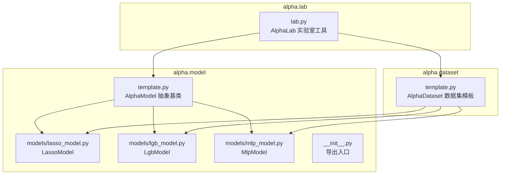
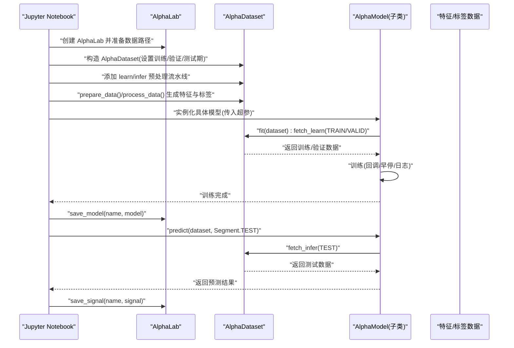
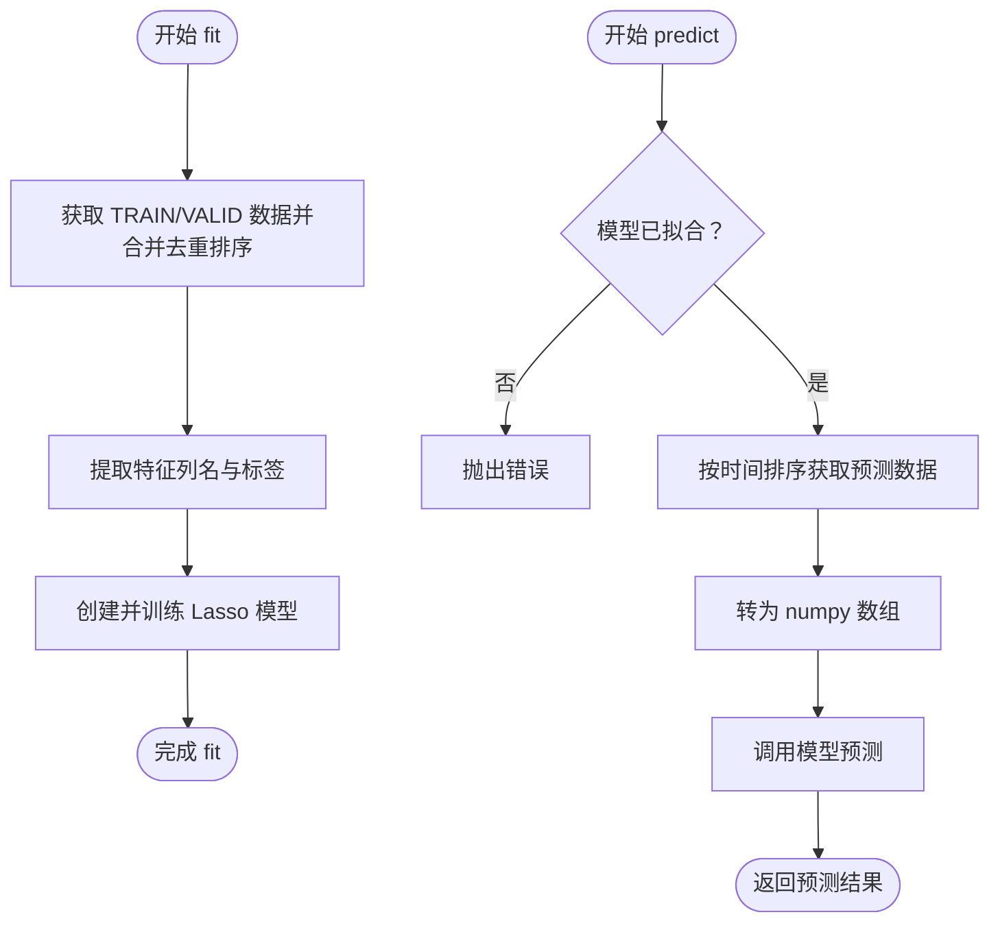
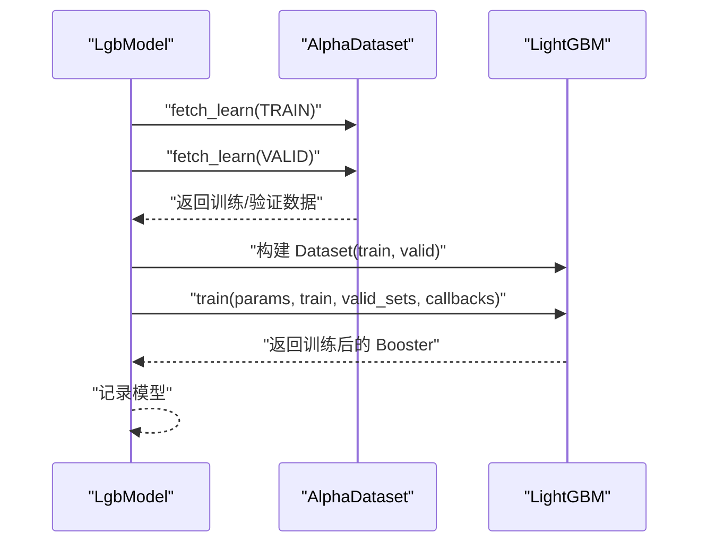
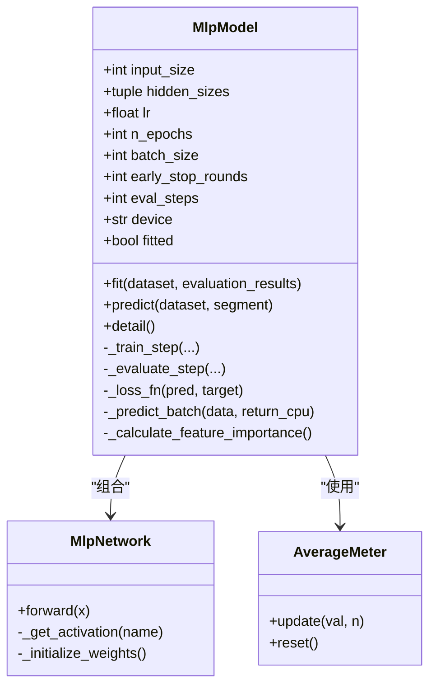
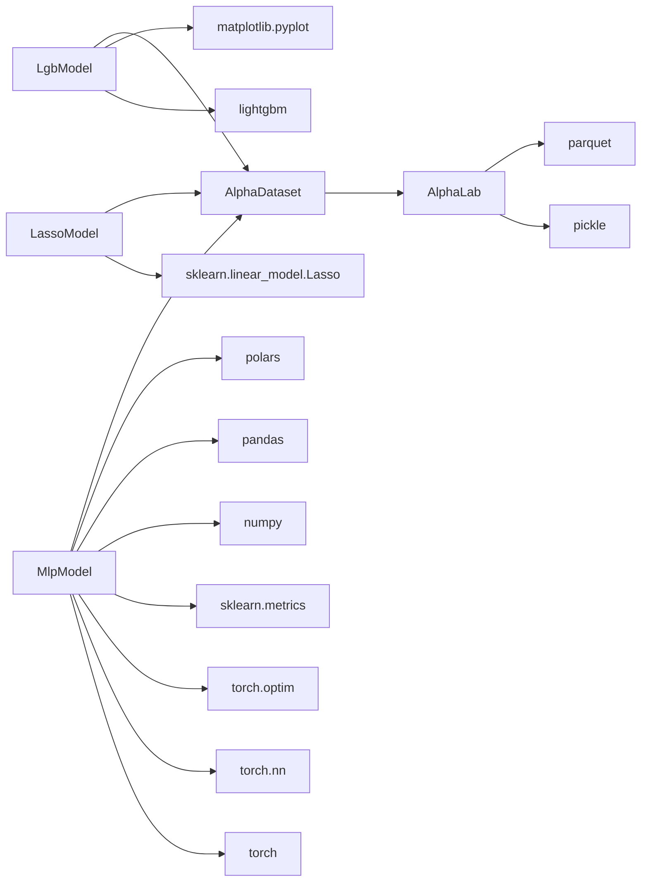

# 模型训练

<cite>
**本文引用的文件列表**
- [vnpy/alpha/model/__init__.py](file://vnpy/alpha/model/__init__.py)
- [vnpy/alpha/model/template.py](file://vnpy/alpha/model/template.py)
- [vnpy/alpha/model/models/lasso_model.py](file://vnpy/alpha/model/models/lasso_model.py)
- [vnpy/alpha/model/models/lgb_model.py](file://vnpy/alpha/model/models/lgb_model.py)
- [vnpy/alpha/model/models/mlp_model.py](file://vnpy/alpha/model/models/mlp_model.py)
- [vnpy/alpha/dataset/template.py](file://vnpy/alpha/dataset/template.py)
- [vnpy/alpha/lab.py](file://vnpy/alpha/lab.py)
- [examples/alpha_research/research_workflow_lasso.ipynb](file://examples/alpha_research/research_workflow_lasso.ipynb)
- [examples/alpha_research/research_workflow_lgb.ipynb](file://examples/alpha_research/research_workflow_lgb.ipynb)
- [examples/alpha_research/research_workflow_mlp.ipynb](file://examples/alpha_research/research_workflow_mlp.ipynb)
</cite>

## 目录
1. [简介](#简介)
2. [项目结构](#项目结构)
3. [核心组件](#核心组件)
4. [架构总览](#架构总览)
5. [详细组件分析](#详细组件分析)
6. [依赖关系分析](#依赖关系分析)
7. [性能考量](#性能考量)
8. [故障排查指南](#故障排查指南)
9. [结论](#结论)
10. [附录](#附录)

## 简介
本文件系统性地文档化 vnpy.alpha.model 模块，作为机器学习模型训练的核心组件。重点覆盖：
- AlphaModel 基类的设计架构与扩展接口
- Lasso 回归（lasso_model.py）、LightGBM 梯度提升树（lgb_model.py）与多层感知机神经网络（mlp_model.py）三种模型的具体实现
- 模型初始化、超参数配置、训练流程、交叉验证、特征重要性分析及预测输出的完整生命周期
- 结合 Jupyter Notebook 示例（research_workflow_*.ipynb）展示不同模型在因子预测中的实际应用
- 模型评估指标（如 IC、IR、R²）的计算方法与调优策略
- 模型保存、加载与管理

## 项目结构
vnpy.alpha.model 模块位于 vnpy/alpha/model，包含模板与三种具体模型实现；配合 vnpy.alpha.dataset 提供数据组织与处理能力，vnpy.alpha.lab 提供数据与模型的持久化管理。

图表来源
- [vnpy/alpha/model/__init__.py](file://vnpy/alpha/model/__init__.py#L1-L7)
- [vnpy/alpha/model/template.py](file://vnpy/alpha/model/template.py#L1-L31)
- [vnpy/alpha/model/models/lasso_model.py](file://vnpy/alpha/model/models/lasso_model.py#L1-L140)
- [vnpy/alpha/model/models/lgb_model.py](file://vnpy/alpha/model/models/lgb_model.py#L1-L171)
- [vnpy/alpha/model/models/mlp_model.py](file://vnpy/alpha/model/models/mlp_model.py#L1-L684)
- [vnpy/alpha/dataset/template.py](file://vnpy/alpha/dataset/template.py#L1-L304)
- [vnpy/alpha/lab.py](file://vnpy/alpha/lab.py#L1-L481)

章节来源
- [vnpy/alpha/model/__init__.py](file://vnpy/alpha/model/__init__.py#L1-L7)
- [vnpy/alpha/model/template.py](file://vnpy/alpha/model/template.py#L1-L31)
- [vnpy/alpha/dataset/template.py](file://vnpy/alpha/dataset/template.py#L1-L304)
- [vnpy/alpha/lab.py](file://vnpy/alpha/lab.py#L1-L481)

## 核心组件
- AlphaModel 抽象基类：定义 fit、predict、detail 三个核心接口，约束所有具体模型的统一行为。
- AlphaDataset 数据集模板：负责特征表达式与标签的生成、数据分段（训练/验证/测试）、预处理流水线（learn/infer）以及按时间窗口查询。
- AlphaLab 实验室工具：提供数据与模型的本地持久化（pickle），支持保存/加载/删除/列举数据集与模型，便于实验管理与复现。

章节来源
- [vnpy/alpha/model/template.py](file://vnpy/alpha/model/template.py#L1-L31)
- [vnpy/alpha/dataset/template.py](file://vnpy/alpha/dataset/template.py#L1-L304)
- [vnpy/alpha/lab.py](file://vnpy/alpha/lab.py#L1-L481)

## 架构总览
下图展示了模型训练的端到端流程：AlphaLab 负责数据准备与持久化，AlphaDataset 组织特征与标签，三种模型实现各自训练与预测逻辑，最终通过 AlphaLab 保存模型与信号结果。

图表来源
- [vnpy/alpha/lab.py](file://vnpy/alpha/lab.py#L389-L481)
- [vnpy/alpha/dataset/template.py](file://vnpy/alpha/dataset/template.py#L172-L192)
- [vnpy/alpha/model/models/lasso_model.py](file://vnpy/alpha/model/models/lasso_model.py#L40-L111)
- [vnpy/alpha/model/models/lgb_model.py](file://vnpy/alpha/model/models/lgb_model.py#L84-L148)
- [vnpy/alpha/model/models/mlp_model.py](file://vnpy/alpha/model/models/mlp_model.py#L137-L409)

## 详细组件分析

### AlphaModel 抽象基类
- 角色：定义统一接口，确保所有模型具备 fit、predict、detail 的一致性。
- 关键点：
  - fit(dataset): 接收 AlphaDataset，按 Segment.TRAIN/VALID 合并或拆分进行训练
  - predict(dataset, segment): 在指定 Segment 上进行推理
  - detail(): 输出模型细节（如特征重要性、参数统计）

章节来源
- [vnpy/alpha/model/template.py](file://vnpy/alpha/model/template.py#L1-L31)

### LassoModel（线性回归 + L1 正则）
- 初始化与超参
  - alpha: 正则化强度
  - max_iter: 最大迭代次数
  - random_state: 随机种子
- 训练流程
  - 合并 TRAIN 与 VALID 数据，去重并按时间排序
  - 提取特征列名，转换为 numpy 数组
  - 使用 Lasso 训练（不带截距、复制 X）
- 预测流程
  - 检查模型是否已拟合
  - 对指定 Segment 的数据排序后进行预测
- 特征重要性
  - 输出非零系数的特征及其绝对值排序
- 适用场景
  - 稳健的线性建模，特征选择与稀疏性
- 注意事项
  - 若未先 fit 即 predict 会抛出异常

图表来源
- [vnpy/alpha/model/models/lasso_model.py](file://vnpy/alpha/model/models/lasso_model.py#L40-L111)
- [vnpy/alpha/model/models/lasso_model.py](file://vnpy/alpha/model/models/lasso_model.py#L112-L140)

章节来源
- [vnpy/alpha/model/models/lasso_model.py](file://vnpy/alpha/model/models/lasso_model.py#L1-L140)

### LgbModel（LightGBM 梯度提升树）
- 初始化与超参
  - 学习率、叶子数、最大轮次、早停轮数、日志周期、随机种子
  - 内置目标函数为均方误差
- 训练流程
  - 分别为 TRAIN/VALID 构造 LightGBM Dataset
  - 训练时启用 early_stopping 与日志回调
- 预测流程
  - 检查模型是否已拟合
  - 获取指定 Segment 的数据并进行预测
- 特征重要性
  - 可绘制 split/gain 两种指标的特征重要性图
- 适用场景
  - 非线性关系强、特征交互复杂、可利用集成学习优势
- 注意事项
  - 未拟合即预测会抛出异常

图表来源
- [vnpy/alpha/model/models/lgb_model.py](file://vnpy/alpha/model/models/lgb_model.py#L53-L112)
- [vnpy/alpha/model/models/lgb_model.py](file://vnpy/alpha/model/models/lgb_model.py#L113-L148)
- [vnpy/alpha/model/models/lgb_model.py](file://vnpy/alpha/model/models/lgb_model.py#L149-L171)

章节来源
- [vnpy/alpha/model/models/lgb_model.py](file://vnpy/alpha/model/models/lgb_model.py#L1-L171)

### MlpModel（多层感知机神经网络）
- 初始化与超参
  - 输入维度、隐藏层规模、学习率、训练轮数、批大小、早停轮数、评估步长、优化器（sgd/adam）、权重衰减、设备、随机种子
- 训练流程
  - 准备 TRAIN/VALID 数据，按时间排序
  - 随机采样 mini-batch，前向+反向传播，更新参数
  - 定期评估验证集损失，动态调整学习率，早停并保存最佳参数
- 预测流程
  - 检查模型是否已训练
  - 分批预测（批量大小固定），返回 numpy 结果
- 特征重要性
  - 通过扰动输入特征并观察输出标准差变化，得到特征重要性排序
- 网络结构
  - 支持多隐藏层，含 Dropout/BatchNorm/激活函数
- 适用场景
  - 高维非线性映射、大规模数据、需要特征组合能力
- 注意事项
  - 未训练即预测会抛出异常；内部包含 AverageMeter 辅助统计

图表来源
- [vnpy/alpha/model/models/mlp_model.py](file://vnpy/alpha/model/models/mlp_model.py#L21-L136)
- [vnpy/alpha/model/models/mlp_model.py](file://vnpy/alpha/model/models/mlp_model.py#L137-L409)
- [vnpy/alpha/model/models/mlp_model.py](file://vnpy/alpha/model/models/mlp_model.py#L493-L684)

章节来源
- [vnpy/alpha/model/models/mlp_model.py](file://vnpy/alpha/model/models/mlp_model.py#L1-L684)

### AlphaDataset 数据集模板
- 数据分段
  - TRAIN/VALID/TEST 时间区间由构造函数传入
- 特征与标签
  - 支持表达式与结果 DataFrame 两种方式添加特征
  - 支持设置标签表达式
- 预处理流水线
  - learn/infer 两套处理器，分别在训练与推理阶段执行
- 查询接口
  - fetch_raw/fetch_learn/fetch_infer 按 Segment 与时间范围返回数据
- 性能分析
  - 提供特征与信号的性能分析（基于 Alphalens）

章节来源
- [vnpy/alpha/dataset/template.py](file://vnpy/alpha/dataset/template.py#L1-L304)

### AlphaLab 实验室工具
- 数据与模型持久化
  - save_dataset/load_dataset/remove_dataset/list_all_datasets
  - save_model/load_model/remove_model/list_all_models
  - save_signal/load_signal/remove_signal/list_all_signals
- 原始行情数据管理
  - save_bar_data/load_bar_data/load_bar_df
  - 指数成分管理：保存/加载/过滤
- 合约设置
  - add_contract_setting/load_contract_setttings

章节来源
- [vnpy/alpha/lab.py](file://vnpy/alpha/lab.py#L1-L481)

## 依赖关系分析
- 模型对数据集的依赖
  - 三类模型均通过 AlphaDataset 的 fetch_learn/fetch_infer 获取训练/推理数据
- 模型对第三方库的依赖
  - LassoModel：sklearn.linear_model.Lasso
  - LgbModel：lightgbm、matplotlib
  - MlpModel：torch、torch.nn、torch.optim、sklearn.metrics、numpy、pandas、polars
- AlphaLab 对持久化的依赖
  - 使用 pickle 保存/加载模型与数据集；使用 parquet 保存/加载信号

图表来源
- [vnpy/alpha/model/models/lasso_model.py](file://vnpy/alpha/model/models/lasso_model.py#L1-L140)
- [vnpy/alpha/model/models/lgb_model.py](file://vnpy/alpha/model/models/lgb_model.py#L1-L171)
- [vnpy/alpha/model/models/mlp_model.py](file://vnpy/alpha/model/models/mlp_model.py#L1-L684)
- [vnpy/alpha/dataset/template.py](file://vnpy/alpha/dataset/template.py#L1-L304)
- [vnpy/alpha/lab.py](file://vnpy/alpha/lab.py#L389-L481)

章节来源
- [vnpy/alpha/model/models/lasso_model.py](file://vnpy/alpha/model/models/lasso_model.py#L1-L140)
- [vnpy/alpha/model/models/lgb_model.py](file://vnpy/alpha/model/models/lgb_model.py#L1-L171)
- [vnpy/alpha/model/models/mlp_model.py](file://vnpy/alpha/model/models/mlp_model.py#L1-L684)
- [vnpy/alpha/dataset/template.py](file://vnpy/alpha/dataset/template.py#L1-L304)
- [vnpy/alpha/lab.py](file://vnpy/alpha/lab.py#L1-L481)

## 性能考量
- 数据加载与并行
  - AlphaDataset 在生成特征时使用多进程并行计算表达式，提高大规模因子计算效率
- 训练效率
  - LgbModel：内置 early_stopping 与日志回调，减少无效训练轮次
  - MlpModel：支持 ReduceLROnPlateau 动态调整学习率，早停防止过拟合
- 推理效率
  - MlpModel：分批预测（固定 batch_size）以平衡显存与吞吐
- 设备与内存
  - MlpModel 可切换 CPU/GPU 训练；建议在 GPU 上运行以加速矩阵运算
- 数据预处理
  - 建议在 learn/infer 流水线中加入缺失值填充、标准化、去极值等步骤，提升模型稳定性

[本节为通用指导，无需列出具体文件来源]

## 故障排查指南
- 模型未拟合即预测
  - LassoModel/LgbModel/MlpModel 在 predict 前都会检查模型状态，若未训练会抛出异常
  - 解决：先调用 fit 再 predict
- 数据为空或时间范围不匹配
  - AlphaDataset 的 fetch_* 方法按 Segment 与时间过滤，若无数据请检查时间区间与过滤条件
- 特征缺失或列名不一致
  - 确保 AlphaDataset.prepare_data 已成功生成特征列，并与模型输入维度一致
- 指数成分过滤问题
  - AlphaLab.load_component_filters 返回的区间可能为空，需检查索引成分数据是否存在
- 模型保存/加载失败
  - AlphaLab 使用 pickle 序列化模型，确保文件存在且版本兼容；必要时重新训练

章节来源
- [vnpy/alpha/model/models/lasso_model.py](file://vnpy/alpha/model/models/lasso_model.py#L75-L111)
- [vnpy/alpha/model/models/lgb_model.py](file://vnpy/alpha/model/models/lgb_model.py#L113-L148)
- [vnpy/alpha/model/models/mlp_model.py](file://vnpy/alpha/model/models/mlp_model.py#L384-L409)
- [vnpy/alpha/dataset/template.py](file://vnpy/alpha/dataset/template.py#L172-L192)
- [vnpy/alpha/lab.py](file://vnpy/alpha/lab.py#L421-L451)

## 结论
vnpy.alpha.model 模块通过抽象基类与具体模型实现，提供了统一的训练与预测接口；配合 AlphaDataset 的数据组织与 AlphaLab 的持久化能力，形成完整的因子预测研究闭环。Lasso、LightGBM 与 MLP 各具特色：前者强调线性与稀疏，后者强调非线性与集成，前者强调深度非线性与特征组合。结合 Jupyter Notebook 示例，用户可快速搭建从数据准备到模型训练、评估与部署的全流程工作流。

[本节为总结性内容，无需列出具体文件来源]

## 附录

### 评估指标与调优策略
- 常用指标
  - IC（信息系数）：衡量因子与未来收益的秩相关性
  - IR（信息比率）：IC 的年化均值与年化标准差之比
  - R²：回归模型解释方差比例
- 计算方法
  - IC/IR：可基于 AlphaDataset 的 show_signal_performance 或自定义信号序列与价格数据进行 Alphalens 分析
  - R²：对回归模型（如 Lasso、MLP）可在验证集上直接计算
- 调优策略
  - Lasso：调节 alpha 控制正则强度；结合特征重要性筛选有效特征
  - LightGBM：调节学习率、叶子数、最大轮次与早停阈值；关注验证集损失曲线
  - MLP：调节隐藏层规模、学习率、优化器、早停轮数与批大小；注意过拟合与收敛速度

章节来源
- [vnpy/alpha/dataset/template.py](file://vnpy/alpha/dataset/template.py#L240-L269)

### Jupyter Notebook 示例要点
- Lasso 示例
  - 使用 Alpha158 构造数据集，添加 learn/infer 预处理，fit 后保存模型与信号
- LightGBM 示例
  - 同样使用 Alpha158，训练完成后可查看特征重要性图
- MLP 示例
  - 引入 robust zscore、rank norm 等预处理，fit 后进行特征重要性分析与预测

章节来源
- [examples/alpha_research/research_workflow_lasso.ipynb](file://examples/alpha_research/research_workflow_lasso.ipynb#L1-L200)
- [examples/alpha_research/research_workflow_lgb.ipynb](file://examples/alpha_research/research_workflow_lgb.ipynb#L1-L200)
- [examples/alpha_research/research_workflow_mlp.ipynb](file://examples/alpha_research/research_workflow_mlp.ipynb#L1-L200)

### 模型保存、加载与管理
- 保存/加载模型
  - AlphaLab.save_model / load_model / remove_model / list_all_models
- 保存/加载数据集
  - AlphaLab.save_dataset / load_dataset / remove_dataset / list_all_datasets
- 保存/加载信号
  - AlphaLab.save_signal / load_signal / remove_signal / list_all_signals

章节来源
- [vnpy/alpha/lab.py](file://vnpy/alpha/lab.py#L389-L481)