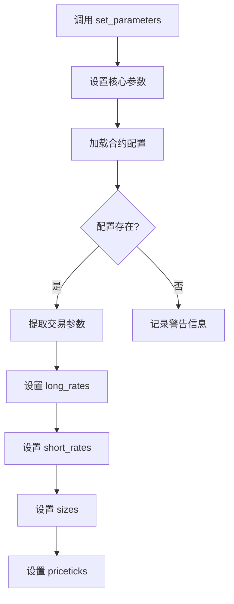

# 回测参数设置

<cite>
**本文档引用的文件**  
- [backtesting.py](file://vnpy/alpha/strategy/backtesting.py)
- [lab.py](file://vnpy/alpha/lab.py)
- [cta_backtester.md](file://docs/community/app/cta_backtester.md)
- [elite_optionstrategy.md](file://docs/elite/strategy/elite_optionstrategy.md)
- [portfolio_backtesting.ipynb](file://examples/cta_backtesting/portfolio_backtesting.ipynb)
- [backtesting_demo.ipynb](file://examples/cta_backtesting/backtesting_demo.ipynb)
</cite>

## 目录
1. [简介](#简介)
2. [核心参数配置](#核心参数配置)
3. [合约配置自动加载](#合约配置自动加载)
4. [多合约组合回测配置](#多合约组合回测配置)
5. [参数验证与错误处理](#参数验证与错误处理)
6. [最佳实践](#最佳实践)

## 简介
`BacktestingEngine` 是 vn.py 框架中用于策略回测的核心引擎，其 `set_parameters` 方法是配置回测环境的关键入口。该方法不仅定义了回测的基本参数，还通过集成合约配置系统，实现了交易参数的自动化加载。本文档将深入解析 `set_parameters` 方法的参数配置要求、取值范围以及最佳实践，为用户提供全面的回测参数设置指南。

**Section sources**
- [backtesting.py](file://vnpy/alpha/strategy/backtesting.py#L70-L90)

## 核心参数配置

`set_parameters` 方法定义了回测所需的核心参数，这些参数共同构建了回测的运行环境。

### vt_symbols 合约列表
`vt_symbols` 参数用于指定参与回测的合约列表，接受一个包含多个本地代码（vt_symbol）的字符串列表。

- **配置要求**：必须提供有效的合约本地代码，格式为 `合约代码.交易所`，例如 `"IF888.CFFEX"`。
- **取值范围**：支持单个合约或多个合约的组合。对于多合约策略，应将所有需要订阅的合约代码加入此列表。
- **注意事项**：提供的合约代码必须与数据源中的代码完全匹配，包括交易所后缀。

### interval 周期
`interval` 参数定义了回测所使用的K线周期。

- **配置要求**：必须使用 `Interval` 枚举类型指定周期。
- **取值范围**：常见的取值包括 `Interval.MINUTE`（分钟线）、`Interval.DAILY`（日线）等。
- **注意事项**：选择的周期必须与可用的历史数据周期相匹配，否则将导致数据加载失败。

### start/end 时间范围
`start` 和 `end` 参数共同定义了回测的时间范围。

- **配置要求**：必须提供 `datetime` 类型的起始和结束时间。
- **取值范围**：`start` 必须早于 `end`，否则回测将无法启动。
- **注意事项**：时间范围应确保在历史数据的覆盖范围内，否则会因数据不足而终止回测。

### capital 初始资金
`capital` 参数设置了回测的初始资金。

- **配置要求**：为可选参数，具有默认值。
- **取值范围**：默认值为 `1,000,000`，表示一百万。可以设置为任意正数。
- **注意事项**：初始资金的设置直接影响仓位计算和收益表现，应根据实际交易规模进行合理设定。

### risk_free 无风险利率
`risk_free` 参数用于设置无风险利率。

- **配置要求**：为可选参数，具有默认值。
- **取值范围**：默认值为 `0`，表示不考虑无风险收益。通常设置为年化利率的小数形式，如 `0.03` 表示3%。
- **注意事项**：该参数主要用于计算夏普比率等风险调整后收益指标。

### annual_days 年化天数
`annual_days` 参数定义了年化计算的基准天数。

- **配置要求**：为可选参数，具有默认值。
- **取值范围**：默认值为 `240`，适用于中国A股市场。对于期货市场，可根据交易日历调整为 `365` 或其他值。
- **注意事项**：该参数影响年化收益率和年化波动率的计算结果。

**Section sources**
- [backtesting.py](file://vnpy/alpha/strategy/backtesting.py#L70-L90)

## 合约配置自动加载

`set_parameters` 方法的一个重要特性是在设置核心参数后，自动从配置文件中加载各合约的详细交易参数。

### 自动加载机制
在 `set_parameters` 方法的实现中，调用 `self.lab.load_contract_setttings()` 从配置文件中加载合约设置。然后，遍历 `vt_symbols` 列表，为每个合约提取并设置以下关键交易参数：

- **long_rates**：多头手续费率
- **short_rates**：空头手续费率
- **sizes**：合约乘数
- **priceticks**：最小变动价位



**Diagram sources**
- [backtesting.py](file://vnpy/alpha/strategy/backtesting.py#L92-L103)

### 配置文件管理
合约配置信息存储在 `AlphaLab` 的 `contract_path` 文件中。用户可以通过 `add_contract_setting` 方法添加或更新合约配置。

- **配置内容**：每个合约的配置包含 `long_rate`、`short_rate`、`size` 和 `pricetick` 四个关键字段。
- **错误处理**：如果指定的合约在配置文件中不存在，系统会记录警告信息 `找不到合约{vt_symbol}的交易配置，请检查！`，但不会中断回测流程。

**Section sources**
- [backtesting.py](file://vnpy/alpha/strategy/backtesting.py#L92-L103)
- [lab.py](file://vnpy/alpha/lab.py#L349-L362)

## 多合约组合回测配置

`BacktestingEngine` 支持多合约组合策略的回测，通过合理的参数配置可以实现复杂的多资产策略验证。

### 配置方法
配置多合约回测的核心是正确设置 `vt_symbols` 参数。将所有需要参与交易的合约代码加入列表即可。

```python
# 示例：配置多合约回测
engine.set_parameters(
    vt_symbols=["IF888.CFFEX", "IH888.CFFEX", "IC888.CFFEX"],
    interval=Interval.MINUTE,
    start=datetime(2019, 1, 1),
    end=datetime(2019, 4, 30),
    capital=1_000_000
)
```

### 数据加载逻辑
回测引擎会为 `vt_symbols` 列表中的每个合约独立加载历史数据，并在数据回放时同步推送各合约的K线。

- **数据同步**：引擎确保在每个时间点，所有合约的K线数据同步更新。
- **缺失处理**：如果某个合约在特定时间点没有数据，引擎会使用前一个时间点的数据进行填充，以保证策略逻辑的连续性。

**Section sources**
- [backtesting.py](file://vnpy/alpha/strategy/backtesting.py#L129-L140)
- [portfolio_backtesting.ipynb](file://examples/cta_backtesting/portfolio_backtesting.ipynb#L22-L34)

## 参数验证与错误处理

`set_parameters` 方法及回测流程中包含了完善的参数验证和错误处理机制。

### 内置验证
- **时间范围验证**：在 `load_data` 方法中检查 `start` 是否小于 `end`，若不满足则输出日志“起始日期必须小于结束日期”。
- **数据完整性验证**：在加载历史数据后，检查是否有合约数据为空，若有则记录警告信息“部分合约历史数据为空”。

### 错误处理
- **异常捕获**：在 `run_backtesting` 方法中使用 `try-except` 捕获执行过程中的异常，一旦触发异常，会记录详细错误信息并终止回测。
- **数据不足处理**：如果数据库中没有准备所需的历史数据，系统会输出“历史数据不足，回测终止”的日志。

**Section sources**
- [backtesting.py](file://vnpy/alpha/strategy/backtesting.py#L119-L121)
- [backtesting.py](file://vnpy/alpha/strategy/backtesting.py#L145-L146)
- [backtesting.py](file://vnpy/alpha/strategy/backtesting.py#L162-L165)
- [cta_backtester.md](file://docs/community/app/cta_backtester.md#L120-L122)

## 最佳实践

### 参数配置流程
1. **准备合约配置**：确保所有参与回测的合约都在 `contract_settings` 中有正确的配置。
2. **设置时间范围**：选择足够长且数据完整的时间段进行回测。
3. **配置初始资金**：根据策略的预期仓位和风险水平设置合理的初始资金。
4. **验证配置**：在正式回测前，通过小范围测试验证参数配置的正确性。

### 常见问题规避
- **避免合约代码错误**：仔细核对合约代码，特别是交易所后缀。
- **确保数据完整性**：在回测前确认所需的历史数据已完整下载。
- **合理设置年化天数**：根据交易品种选择合适的 `annual_days` 值，以获得准确的绩效指标。

**Section sources**
- [backtesting.py](file://vnpy/alpha/strategy/backtesting.py)
- [cta_backtester.md](file://docs/community/app/cta_backtester.md)
- [backtesting_demo.ipynb](file://examples/cta_backtesting/backtesting_demo.ipynb#L23-L34)