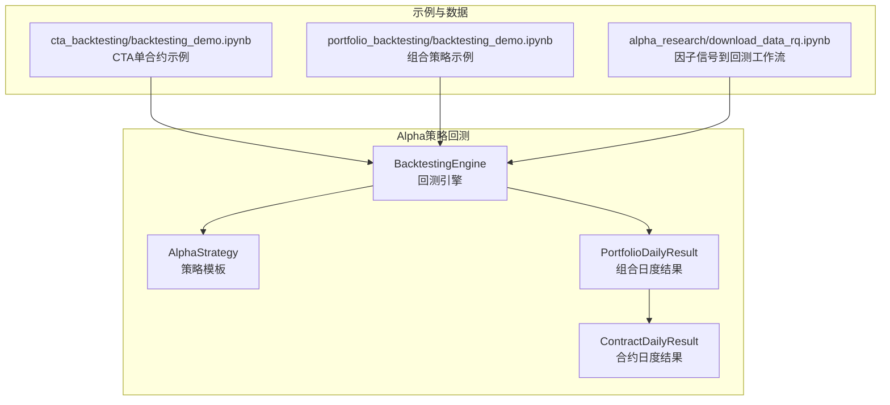
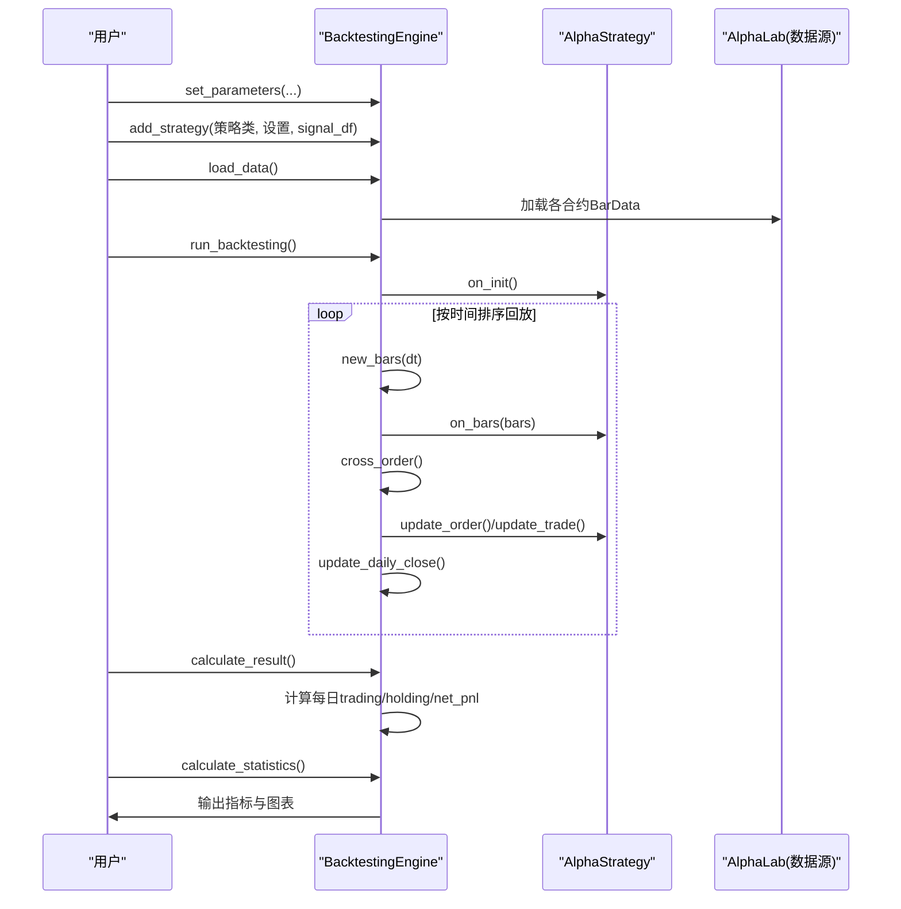
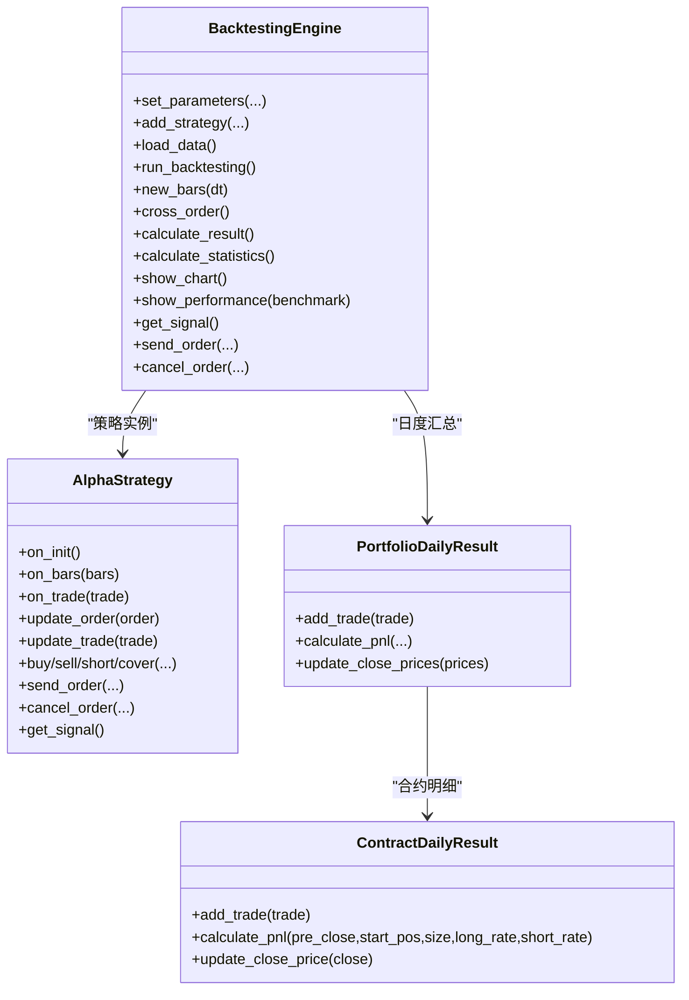

# 回测引擎使用

<cite>
**本文引用的文件列表**
- [backtesting.py](file://vnpy/alpha/strategy/backtesting.py)
- [template.py](file://vnpy/alpha/strategy/template.py)
- [backtesting_demo.ipynb](file://examples/cta_backtesting/backtesting_demo.ipynb)
- [portfolio_backtesting.ipynb](file://examples/portfolio_backtesting/backtesting_demo.ipynb)
- [download_data_rq.ipynb](file://examples/alpha_research/download_data_rq.ipynb)
</cite>

## 目录
1. [简介](#简介)
2. [项目结构](#项目结构)
3. [核心组件](#核心组件)
4. [架构总览](#架构总览)
5. [详细组件分析](#详细组件分析)
6. [依赖关系分析](#依赖关系分析)
7. [性能考量](#性能考量)
8. [故障排查指南](#故障排查指南)
9. [结论](#结论)
10. [附录](#附录)

## 简介
本文件系统性地文档化vnpy中Alpha策略回测引擎BacktestingEngine的使用方法与技术特性，覆盖以下关键主题：
- set_parameters参数配置：资本规模、交易费率、合约规格等
- add_strategy策略加载与signal_df信号注入机制
- load_data历史数据加载流程与run_backtesting回测执行过程（时间序列对齐、K线回放、订单撮合）
- calculate_result逐日盈亏计算与calculate_statistics绩效指标生成（包含夏普比率、最大回撤、收益回撤比等20+项指标）
- 结合download_data_rq.ipynb示例，展示从因子信号到回测报告的完整工作流
- 回测精度优化与性能调优的实用技巧

## 项目结构
回测引擎位于vnpy/alpha/strategy目录下，核心文件为backtesting.py；策略模板位于template.py；示例在examples目录中提供完整的使用流程。

图示来源
- [backtesting.py](file://vnpy/alpha/strategy/backtesting.py#L1-L120)
- [template.py](file://vnpy/alpha/strategy/template.py#L1-L120)
- [backtesting_demo.ipynb](file://examples/cta_backtesting/backtesting_demo.ipynb#L1-L120)
- [portfolio_backtesting.ipynb](file://examples/portfolio_backtesting/backtesting_demo.ipynb#L1-L117)
- [download_data_rq.ipynb](file://examples/alpha_research/download_data_rq.ipynb#L1-L195)

章节来源
- [backtesting.py](file://vnpy/alpha/strategy/backtesting.py#L1-L120)
- [template.py](file://vnpy/alpha/strategy/template.py#L1-L120)

## 核心组件
- BacktestingEngine：回测引擎核心，负责参数设置、数据加载、K线回放、订单撮合、逐日盈亏计算与统计指标生成。
- AlphaStrategy：策略模板，提供下单、撤单、目标仓位执行、日志等通用能力。
- PortfolioDailyResult/ContractDailyResult：日度盈亏聚合与明细计算单元。

章节来源
- [backtesting.py](file://vnpy/alpha/strategy/backtesting.py#L22-L120)
- [template.py](file://vnpy/alpha/strategy/template.py#L15-L120)

## 架构总览
回测引擎采用“时间序列驱动”的K线回放模式：按时间轴对齐多合约的历史K线，逐日推送bars给策略回调，同时执行限价单撮合、成交记录维护、资金与头寸更新，并在每日收盘时汇总逐日盈亏。

图示来源
- [backtesting.py](file://vnpy/alpha/strategy/backtesting.py#L70-L168)
- [backtesting.py](file://vnpy/alpha/strategy/backtesting.py#L579-L618)
- [backtesting.py](file://vnpy/alpha/strategy/backtesting.py#L619-L709)
- [backtesting.py](file://vnpy/alpha/strategy/backtesting.py#L170-L226)
- [backtesting.py](file://vnpy/alpha/strategy/backtesting.py#L228-L402)

## 详细组件分析

### 参数配置：set_parameters
- 关键参数
  - vt_symbols：合约列表（如["rb888.SHFE"]或["y888.DCE","p888.DCE"]）
  - interval：回测粒度（如分钟级、日线等）
  - start/end：回测起止时间
  - capital：初始资金
  - risk_free：无风险利率（用于夏普比率计算）
  - annual_days：年化天数（默认240）
- 合约配置加载
  - 引擎通过AlphaLab加载合约交易设置，填充long_rates、short_rates、sizes、priceticks等字典，供撮合与手续费计算使用
- 资金初始化
  - 初始化cash为capital，作为可用资金

章节来源
- [backtesting.py](file://vnpy/alpha/strategy/backtesting.py#L70-L109)

### 策略加载与signal_df注入：add_strategy
- add_strategy负责：
  - 实例化策略类，传入引擎、策略名、vt_symbols、策略设置
  - 注入signal_df（以Polars DataFrame形式提供，包含datetime列与信号列）
- 策略侧通过AlphaStrategy.get_signal()在回测过程中按当前datetime提取对应信号
- 策略可通过buy/sell/short/cover等便捷方法下单，引擎内部统一走send_order/cancel_order

章节来源
- [backtesting.py](file://vnpy/alpha/strategy/backtesting.py#L104-L111)
- [template.py](file://vnpy/alpha/strategy/template.py#L74-L120)
- [template.py](file://vnpy/alpha/strategy/template.py#L133-L186)

### 历史数据加载：load_data
- 流程要点
  - 校验end是否为空、start/end合法性
  - 清空历史缓存与时间集合
  - 遍历vt_symbols，调用AlphaLab.load_bar_data按interval加载指定时间段的K线
  - 将每根K线按(datetime, vt_symbol)存入history_data，并收集dts去重集合
  - 统计空合约并记录日志
- 时间序列对齐
  - dts集合用于后续按时间升序遍历，确保多合约在相同时间点被回放到策略

章节来源
- [backtesting.py](file://vnpy/alpha/strategy/backtesting.py#L112-L148)

### 回放执行：run_backtesting与new_bars
- run_backtesting
  - 调用策略on_init初始化
  - 对dts排序后逐日调用new_bars
- new_bars
  - 更新当前datetime与各合约前收盘价pre_closes
  - 从history_data按dt与vt_symbol取K线，若缺失则用前一根K线的close_price填充（复权/前复权逻辑由上游数据决定）
  - 执行cross_order撮合
  - 调用策略on_bars(bars)
  - 更新当日收盘价到PortfolioDailyResult

章节来源
- [backtesting.py](file://vnpy/alpha/strategy/backtesting.py#L150-L168)
- [backtesting.py](file://vnpy/alpha/strategy/backtesting.py#L579-L618)

### 订单撮合：cross_order
- 撮合规则
  - 限价单按bar的low/high与开盘价判断是否成交
  - 受涨跌停限制：基于前收盘价与pricetick计算涨停/跌停板
  - 成交价取order.price与best价格的约束值
- 资金与手续费
  - 根据方向与long/short费率计算手续费
  - 现金增减与成交记录维护
- 状态更新
  - 未成交单状态更新为NOTTRADED
  - 已成交单状态更新为ALLTRADED，并推送update_order/update_trade

章节来源
- [backtesting.py](file://vnpy/alpha/strategy/backtesting.py#L619-L709)

### 逐日盈亏计算：calculate_result
- 数据来源
  - 以成交记录trades为依据，按交易发生日期归属到对应PortfolioDailyResult
- 计算流程
  - 逐日调用PortfolioDailyResult.calculate_pnl，传入前一日收盘价pre_closes、期初头寸start_poses、合约size、long/short费率
  - 合约层ContractDailyResult分别计算trading_pnl、holding_pnl、turnover、commission，并汇总至组合层
  - 产出日度DataFrame字段：date、trade_count、turnover、commission、trading_pnl、holding_pnl、total_pnl、net_pnl
- 资金曲线与回撤
  - 在calculate_statistics中基于net_pnl累计生成balance、return、drawdown、ddpercent等

章节来源
- [backtesting.py](file://vnpy/alpha/strategy/backtesting.py#L170-L226)
- [backtesting.py](file://vnpy/alpha/strategy/backtesting.py#L875-L945)

### 绩效指标生成：calculate_statistics
- 指标清单（节选）
  - 时间范围、总交易日、盈利/亏损交易日
  - 起始/结束资金、总收益率、年化收益
  - 最大回撤、百分比最大回撤、最长回撤天数
  - 总/日均手续费、总/日均成交金额、总/日均成交笔数
  - 日均收益率、收益标准差、夏普比率、收益回撤比
- 计算细节
  - 基于net_pnl累计生成balance，再计算return、highlevel、drawdown、ddpercent
  - 夏普比率使用日化无风险利率与日收益标准差
  - 收益回撤比为总盈亏/最大回撤（负值）

章节来源
- [backtesting.py](file://vnpy/alpha/strategy/backtesting.py#L228-L402)

### 图表展示：show_chart/show_performance
- show_chart：绘制balance曲线、drawdown、日度PnL柱状图与PnL分布直方图
- show_performance：可选基准合约，绘制策略累计收益、基准收益、超额收益、换手率与超额回撤等

章节来源
- [backtesting.py](file://vnpy/alpha/strategy/backtesting.py#L404-L560)

### 从因子信号到回测报告：download_data_rq.ipynb工作流
- 数据准备
  - 使用AlphaLab创建任务目录，保存指数成分股与指数K线
  - 为每个合约添加合约设置（long_rate、short_rate、size、pricetick）
- 因子信号注入
  - 将signal_df（含datetime列与信号列）注入BacktestingEngine，策略通过get_signal在回测中按当前时间取信号
- 回测执行
  - set_parameters → add_strategy → load_data → run_backtesting → calculate_result → calculate_statistics → show_chart

章节来源
- [download_data_rq.ipynb](file://examples/alpha_research/download_data_rq.ipynb#L1-L195)
- [backtesting.py](file://vnpy/alpha/strategy/backtesting.py#L104-L111)

## 依赖关系分析
- 组件耦合
  - BacktestingEngine强依赖AlphaLab（数据）、AlphaStrategy（策略接口）、Polars（DataFrame）
  - 策略通过send_order/cancel_order与引擎交互，引擎维护active_limit_orders与trades
- 关键依赖链
  - set_parameters → AlphaLab.load_contract_setttings → 填充long_rates/short_rates/sizes/priceticks
  - new_bars → cross_order → update_order/update_trade → trades/资金变化
  - calculate_result → PortfolioDailyResult/ContractDailyResult → 日度汇总

图示来源
- [backtesting.py](file://vnpy/alpha/strategy/backtesting.py#L22-L120)
- [backtesting.py](file://vnpy/alpha/strategy/backtesting.py#L875-L945)
- [template.py](file://vnpy/alpha/strategy/template.py#L15-L120)

## 性能考量
- 数据加载
  - 使用tqdm显示加载进度，建议在大数据集场景下分批加载或预处理K线以减少I/O
- 回放效率
  - dts排序与按时间回放是O(NlogN)，建议确保历史数据时间戳连续且无重复
  - new_bars中K线缺失时的填充逻辑避免了空K线导致的策略中断
- 订单撮合
  - cross_order按合约遍历，复杂度O(C)，其中C为合约数；建议在策略中减少不必要的订单提交
- 统计计算
  - calculate_result与calculate_statistics使用Polars进行向量化计算，注意内存占用与列类型一致性
- 并发与优化
  - 若需加速，可在策略层面减少高频写日志与频繁查询，或在数据层做索引优化

## 故障排查指南
- 合约配置缺失
  - 现象：警告提示找不到某合约交易配置
  - 处理：确认AlphaLab中已为该vt_symbol添加合约设置（rate、size、pricetick等）
- 历史数据为空
  - 现象：部分合约历史数据为空
  - 处理：检查数据源与时间区间，必要时调整起止时间或更换数据源
- 撮合异常
  - 现象：订单长时间未成交或异常
  - 处理：检查pricetick、涨跌停限制与order.price是否合理；确认策略下单价格与方向
- 爆仓或负资金
  - 现象：统计阶段提示资金小于等于0
  - 处理：检查手续费率、滑点、杠杆倍数与下单量，避免过度集中单一合约
- 信号缺失
  - 现象：get_signal返回空
  - 处理：确认signal_df的时间维度与回测datetime一致，且信号列命名正确

章节来源
- [backtesting.py](file://vnpy/alpha/strategy/backtesting.py#L92-L103)
- [backtesting.py](file://vnpy/alpha/strategy/backtesting.py#L145-L148)
- [backtesting.py](file://vnpy/alpha/strategy/backtesting.py#L619-L709)
- [backtesting.py](file://vnpy/alpha/strategy/backtesting.py#L257-L283)
- [backtesting.py](file://vnpy/alpha/strategy/backtesting.py#L709-L722)

## 结论
BacktestingEngine提供了完整的Alpha策略回测闭环：从参数配置、数据加载、K线回放到订单撮合、逐日盈亏与统计指标生成。其设计强调可扩展性（策略模板）、可维护性（日度结果聚合）与可观测性（图表与日志）。结合download_data_rq.ipynb示例，用户可快速完成从因子信号到回测报告的全流程落地。

## 附录
- 示例参考
  - 单合约CTA回测：cta_backtesting/backtesting_demo.ipynb
  - 组合策略回测：portfolio_backtesting/backtesting_demo.ipynb
  - 因子信号到回测工作流：alpha_research/download_data_rq.ipynb

章节来源
- [backtesting_demo.ipynb](file://examples/cta_backtesting/backtesting_demo.ipynb#L1-L120)
- [portfolio_backtesting.ipynb](file://examples/portfolio_backtesting/backtesting_demo.ipynb#L1-L117)
- [download_data_rq.ipynb](file://examples/alpha_research/download_data_rq.ipynb#L1-L195)