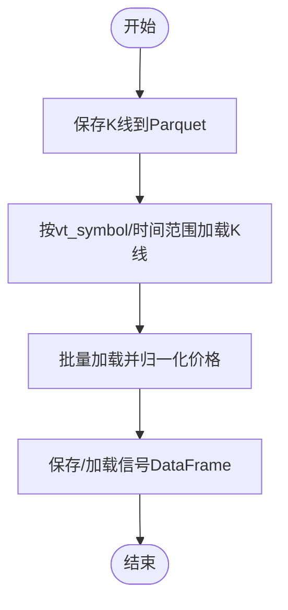

# 回测执行流程

<cite>
**本文引用的文件**
- [vnpy/alpha/lab.py](file://vnpy/alpha/lab.py)
- [vnpy/alpha/strategy/backtesting.py](file://vnpy/alpha/strategy/backtesting.py)
- [vnpy/alpha/strategy/template.py](file://vnpy/alpha/strategy/template.py)
- [vnpy/trader/object.py](file://vnpy/trader/object.py)
- [vnpy/trader/utility.py](file://vnpy/trader/utility.py)
- [examples/alpha_research/download_data_rq.ipynb](file://examples/alpha_research/download_data_rq.ipynb)
</cite>

## 目录
1. [引言](#引言)
2. [项目结构](#项目结构)
3. [核心组件](#核心组件)
4. [架构总览](#架构总览)
5. [详细组件分析](#详细组件分析)
6. [依赖关系分析](#依赖关系分析)
7. [性能考量](#性能考量)
8. [故障排查指南](#故障排查指南)
9. [结论](#结论)
10. [附录](#附录)

## 引言
本文件系统化梳理vnpy AlphaLab回测执行全流程，围绕“load_data历史数据加载、add_strategy策略注入、run_backtesting回测启动”三大核心环节展开，重点说明：
- 基于AlphaLab的数据加载机制与多合约K线数据的时间序列对齐处理
- new_bars方法实现的K线回放机制与cross_order订单撮合逻辑（含限价单成交判断、价格限制计算、资金变动更新）
- 结合download_data_rq.ipynb示例，展示从信号数据注入到策略执行的完整工作流

## 项目结构
本节聚焦与回测执行直接相关的模块与文件组织方式：
- AlphaLab：负责K线数据的持久化、读取、索引成分、合约设置等
- BacktestingEngine：回测引擎，负责加载历史数据、按时间推进K线回放、撮合订单、统计与可视化
- AlphaStrategy模板：策略抽象基类，提供下单、撤单、目标仓位执行等便捷接口
- 数据对象与工具：BarData、OrderData、TradeData、round_to等基础类型与工具函数
- 示例脚本：download_data_rq.ipynb演示如何准备AlphaLab所需的历史数据与合约参数

图表来源
- [vnpy/alpha/lab.py](file://vnpy/alpha/lab.py#L1-L120)
- [vnpy/alpha/strategy/backtesting.py](file://vnpy/alpha/strategy/backtesting.py#L1-L120)
- [vnpy/alpha/strategy/template.py](file://vnpy/alpha/strategy/template.py#L1-L60)
- [vnpy/trader/object.py](file://vnpy/trader/object.py#L87-L176)
- [vnpy/trader/utility.py](file://vnpy/trader/utility.py#L119-L162)
- [examples/alpha_research/download_data_rq.ipynb](file://examples/alpha_research/download_data_rq.ipynb#L1-L120)

章节来源
- [vnpy/alpha/lab.py](file://vnpy/alpha/lab.py#L1-L120)
- [vnpy/alpha/strategy/backtesting.py](file://vnpy/alpha/strategy/backtesting.py#L1-L120)
- [vnpy/alpha/strategy/template.py](file://vnpy/alpha/strategy/template.py#L1-L60)
- [vnpy/trader/object.py](file://vnpy/trader/object.py#L87-L176)
- [vnpy/trader/utility.py](file://vnpy/trader/utility.py#L119-L162)
- [examples/alpha_research/download_data_rq.ipynb](file://examples/alpha_research/download_data_rq.ipynb#L1-L120)

## 核心组件
- AlphaLab：提供K线数据的保存与加载（Parquet）、指数成分数据管理、合约参数配置、信号数据管理等能力
- BacktestingEngine：负责参数设置、历史数据加载、按时间推进回放、订单撮合、每日盈亏统计与可视化
- AlphaStrategy：策略模板，封装下单、撤单、目标执行、日志与资金查询等常用操作
- 数据对象与工具：BarData、OrderData、TradeData用于承载市场与交易数据；round_to、extract_vt_symbol等工具保障价格精度与符号解析

章节来源
- [vnpy/alpha/lab.py](file://vnpy/alpha/lab.py#L1-L120)
- [vnpy/alpha/strategy/backtesting.py](file://vnpy/alpha/strategy/backtesting.py#L1-L120)
- [vnpy/alpha/strategy/template.py](file://vnpy/alpha/strategy/template.py#L1-L60)
- [vnpy/trader/object.py](file://vnpy/trader/object.py#L87-L176)
- [vnpy/trader/utility.py](file://vnpy/trader/utility.py#L119-L162)

## 架构总览
回测执行的关键流程如下：
- 数据准备：通过download_data_rq.ipynb下载指数成分与指数K线，写入AlphaLab目录，同时添加合约参数
- 策略注入：通过BacktestingEngine.add_strategy传入策略类、策略设置与信号DataFrame
- 历史数据加载：BacktestingEngine.load_data调用AlphaLab.load_bar_data，构建历史数据字典与时间集合
- 回放推进：BacktestingEngine.run_backtesting遍历排序后的回放时间，逐时间调用new_bars
- K线回放与撮合：new_bars按合约填充K线，调用cross_order进行限价单撮合，再回调策略on_bars
- 统计与结果：calculate_result/calculate_statistics生成每日盈亏与统计指标，支持可视化

图表来源
- [examples/alpha_research/download_data_rq.ipynb](file://examples/alpha_research/download_data_rq.ipynb#L1-L170)
- [vnpy/alpha/lab.py](file://vnpy/alpha/lab.py#L96-L154)
- [vnpy/alpha/strategy/backtesting.py](file://vnpy/alpha/strategy/backtesting.py#L112-L168)
- [vnpy/alpha/strategy/backtesting.py](file://vnpy/alpha/strategy/backtesting.py#L579-L618)
- [vnpy/alpha/strategy/backtesting.py](file://vnpy/alpha/strategy/backtesting.py#L170-L226)

## 详细组件分析

### AlphaLab数据加载与存储
- 保存K线：按日/分钟粒度将BarData写入Parquet，自动去重与排序
- 加载K线：按vt_symbol与时间范围过滤，返回BarData列表
- 多合约DataFrame加载：支持批量读取并归一化价格、标记停牌日、拼接成宽表
- 合约参数：以JSON保存long_rate、short_rate、size、pricetick等
- 信号数据：以Parquet保存/加载信号DataFrame

图表来源
- [vnpy/alpha/lab.py](file://vnpy/alpha/lab.py#L51-L154)
- [vnpy/alpha/lab.py](file://vnpy/alpha/lab.py#L156-L243)
- [vnpy/alpha/lab.py](file://vnpy/alpha/lab.py#L453-L481)

章节来源
- [vnpy/alpha/lab.py](file://vnpy/alpha/lab.py#L51-L154)
- [vnpy/alpha/lab.py](file://vnpy/alpha/lab.py#L156-L243)
- [vnpy/alpha/lab.py](file://vnpy/alpha/lab.py#L453-L481)

### BacktestingEngine：回测引擎
- 参数设置：设置vt_symbols、interval、start/end、capital、risk_free、annual_days，并加载合约参数
- 历史数据加载：遍历vt_symbols，调用AlphaLab.load_bar_data，构建history_data与dts集合
- 回放推进：按dts升序遍历，逐时间调用new_bars
- K线回放：填充bars字典，必要时用前一根K线填充空缺时段；随后调用策略on_bars
- 订单撮合：cross_order按限价单方向与当日高低价、涨跌停限制判断成交，生成TradeData并更新资金
- 日常结算：update_daily_close维护每日收盘价映射，供后续逐日盈亏计算
- 统计与可视化：calculate_result/calculate_statistics产出每日盈亏与指标，show_chart/show_performance可视化

图表来源
- [vnpy/alpha/strategy/backtesting.py](file://vnpy/alpha/strategy/backtesting.py#L70-L120)
- [vnpy/alpha/strategy/backtesting.py](file://vnpy/alpha/strategy/backtesting.py#L112-L168)
- [vnpy/alpha/strategy/backtesting.py](file://vnpy/alpha/strategy/backtesting.py#L579-L618)
- [vnpy/alpha/strategy/backtesting.py](file://vnpy/alpha/strategy/backtesting.py#L619-L760)
- [vnpy/alpha/strategy/template.py](file://vnpy/alpha/strategy/template.py#L43-L120)

章节来源
- [vnpy/alpha/strategy/backtesting.py](file://vnpy/alpha/strategy/backtesting.py#L70-L120)
- [vnpy/alpha/strategy/backtesting.py](file://vnpy/alpha/strategy/backtesting.py#L112-L168)
- [vnpy/alpha/strategy/backtesting.py](file://vnpy/alpha/strategy/backtesting.py#L579-L618)
- [vnpy/alpha/strategy/backtesting.py](file://vnpy/alpha/strategy/backtesting.py#L619-L760)
- [vnpy/alpha/strategy/template.py](file://vnpy/alpha/strategy/template.py#L43-L120)

### new_bars方法与K线回放机制
- 作用：将指定时刻dt的各合约K线推送到策略，同时进行订单撮合与每日收盘价更新
- 关键步骤：
  - 更新当前时间datetime
  - 遍历vt_symbols，从history_data取对应dt的BarData，若无则以前一根K线填充
  - 调用cross_order进行撮合
  - 调用策略on_bars(bars)
  - update_daily_close更新每日收盘价映射

图表来源
- [vnpy/alpha/strategy/backtesting.py](file://vnpy/alpha/strategy/backtesting.py#L579-L618)

章节来源
- [vnpy/alpha/strategy/backtesting.py](file://vnpy/alpha/strategy/backtesting.py#L579-L618)

### cross_order订单撮合逻辑
- 限价单状态推进：SUBMITTING转NOTTRADED
- 涨跌停限制：基于昨收与pricetick计算limit_up/limit_down
- 成交判断：
  - 多头：order.price >= 当日最低价且未涨停
  - 空头：order.price <= 当日最高价且未跌停
- 成交生成：按best价格与order价格取极值，生成TradeData
- 资金变动：根据方向与费率计算手续费，增减可用资金
- 订单清理：移除已成交活跃订单，推送成交事件

图表来源
- [vnpy/alpha/strategy/backtesting.py](file://vnpy/alpha/strategy/backtesting.py#L619-L760)
- [vnpy/trader/utility.py](file://vnpy/trader/utility.py#L119-L162)

章节来源
- [vnpy/alpha/strategy/backtesting.py](file://vnpy/alpha/strategy/backtesting.py#L619-L760)
- [vnpy/trader/utility.py](file://vnpy/trader/utility.py#L119-L162)

### AlphaStrategy模板与下单/撤单
- 提供buy/sell/short/cover便捷下单方法，底层委托给BacktestingEngine.send_order
- 支持cancel_order/cancel_all撤单
- execute_trading按目标仓位与当前bar价格加点生成委托，自动撤销未成交委托
- 维护pos_data与target_data，on_trade回调中更新持仓

图表来源
- [vnpy/alpha/strategy/template.py](file://vnpy/alpha/strategy/template.py#L78-L120)
- [vnpy/alpha/strategy/template.py](file://vnpy/alpha/strategy/template.py#L133-L186)
- [vnpy/alpha/strategy/backtesting.py](file://vnpy/alpha/strategy/backtesting.py#L723-L760)

章节来源
- [vnpy/alpha/strategy/template.py](file://vnpy/alpha/strategy/template.py#L78-L120)
- [vnpy/alpha/strategy/template.py](file://vnpy/alpha/strategy/template.py#L133-L186)
- [vnpy/alpha/strategy/backtesting.py](file://vnpy/alpha/strategy/backtesting.py#L723-L760)

### 信号数据注入与策略执行
- 示例Notebook演示：下载指数成分、指数与成分K线，保存至AlphaLab，配置合约参数
- 回测阶段：BacktestingEngine.add_strategy传入策略类、setting与signal_df
- 运行时：BacktestingEngine.get_signal按当前datetime筛选信号，策略通过get_signal获取

图表来源
- [examples/alpha_research/download_data_rq.ipynb](file://examples/alpha_research/download_data_rq.ipynb#L1-L170)
- [vnpy/alpha/strategy/backtesting.py](file://vnpy/alpha/strategy/backtesting.py#L104-L111)
- [vnpy/alpha/strategy/backtesting.py](file://vnpy/alpha/strategy/backtesting.py#L709-L722)

章节来源
- [examples/alpha_research/download_data_rq.ipynb](file://examples/alpha_research/download_data_rq.ipynb#L1-L170)
- [vnpy/alpha/strategy/backtesting.py](file://vnpy/alpha/strategy/backtesting.py#L104-L111)
- [vnpy/alpha/strategy/backtesting.py](file://vnpy/alpha/strategy/backtesting.py#L709-L722)

## 依赖关系分析
- BacktestingEngine依赖AlphaLab进行数据加载与合约参数读取
- BacktestingEngine依赖vnpy.trader.object中的BarData、OrderData、TradeData
- BacktestingEngine依赖vnpy.trader.utility的round_to、extract_vt_symbol等工具
- AlphaStrategy通过BacktestingEngine间接依赖上述对象与工具
- 示例Notebook依赖AlphaLab与数据服务接口获取历史K线

图表来源
- [examples/alpha_research/download_data_rq.ipynb](file://examples/alpha_research/download_data_rq.ipynb#L1-L170)
- [vnpy/alpha/lab.py](file://vnpy/alpha/lab.py#L1-L120)
- [vnpy/alpha/strategy/backtesting.py](file://vnpy/alpha/strategy/backtesting.py#L1-L120)
- [vnpy/trader/object.py](file://vnpy/trader/object.py#L87-L176)
- [vnpy/trader/utility.py](file://vnpy/trader/utility.py#L119-L162)

章节来源
- [examples/alpha_research/download_data_rq.ipynb](file://examples/alpha_research/download_data_rq.ipynb#L1-L170)
- [vnpy/alpha/lab.py](file://vnpy/alpha/lab.py#L1-L120)
- [vnpy/alpha/strategy/backtesting.py](file://vnpy/alpha/strategy/backtesting.py#L1-L120)
- [vnpy/trader/object.py](file://vnpy/trader/object.py#L87-L176)
- [vnpy/trader/utility.py](file://vnpy/trader/utility.py#L119-L162)

## 性能考量
- 数据加载：AlphaLab采用Parquet存储，批量读取与合并，建议合理切分vt_symbols并控制时间范围
- 回放效率：BacktestingEngine按dts排序回放，避免重复扫描；cross_order按活跃订单遍历，注意订单数量规模
- 价格精度：round_to按pricetick取整，避免浮点误差导致的无效委托
- 可视化成本：calculate_result/calculate_statistics使用polars进行批处理，建议在大规模回测时分段统计

## 故障排查指南
- 历史数据为空：检查vt_symbol是否正确、时间范围是否覆盖数据、AlphaLab路径是否存在
- 合约参数缺失：确认AlphaLab.add_contract_setting已配置long_rate/short_rate/size/pricetick
- 撮合异常：检查涨跌停计算与limit_up/limit_down逻辑，确认pre_close与pricetick来源
- 资金不足：核对手续费率与成交额计算，确保cash未为负导致提前终止
- 信号缺失：确认signal_df包含当前datetime的记录，或get_signal返回空时的日志提示

章节来源
- [vnpy/alpha/lab.py](file://vnpy/alpha/lab.py#L350-L388)
- [vnpy/alpha/strategy/backtesting.py](file://vnpy/alpha/strategy/backtesting.py#L619-L760)
- [vnpy/alpha/strategy/backtesting.py](file://vnpy/alpha/strategy/backtesting.py#L709-L722)

## 结论
本文系统梳理了vnpy AlphaLab回测执行全流程，明确了数据准备、策略注入与回放推进三个关键环节，并深入解析了K线回放与订单撮合的实现细节。通过示例Notebook与策略模板，读者可快速搭建从数据准备到策略执行的完整工作流。

## 附录
- 数据对象定义参考：BarData、OrderData、TradeData
- 工具函数参考：round_to、extract_vt_symbol

章节来源
- [vnpy/trader/object.py](file://vnpy/trader/object.py#L87-L176)
- [vnpy/trader/utility.py](file://vnpy/trader/utility.py#L119-L162)