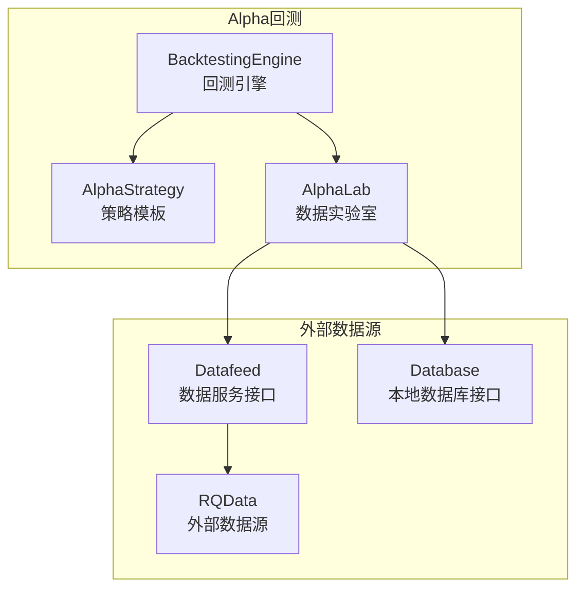
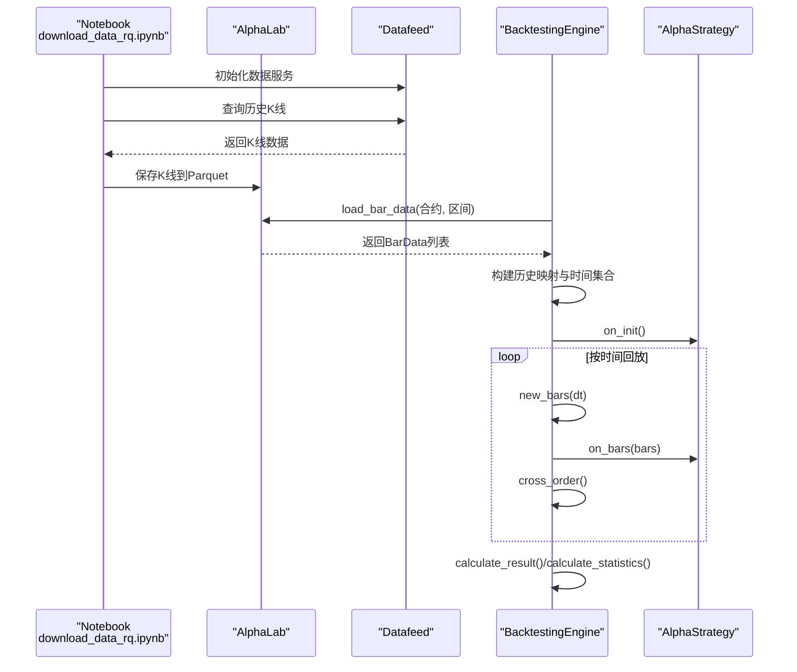
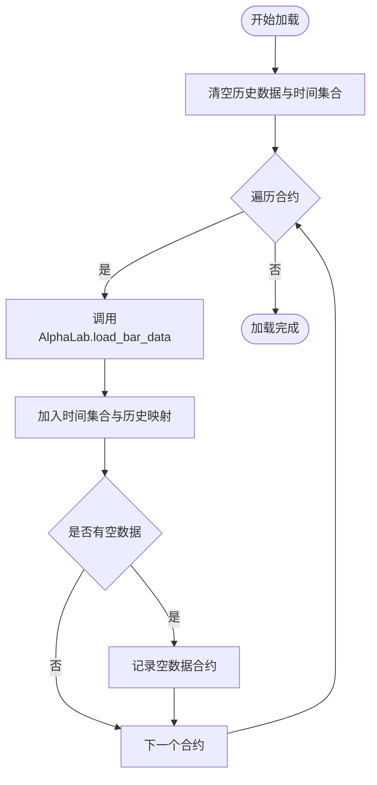
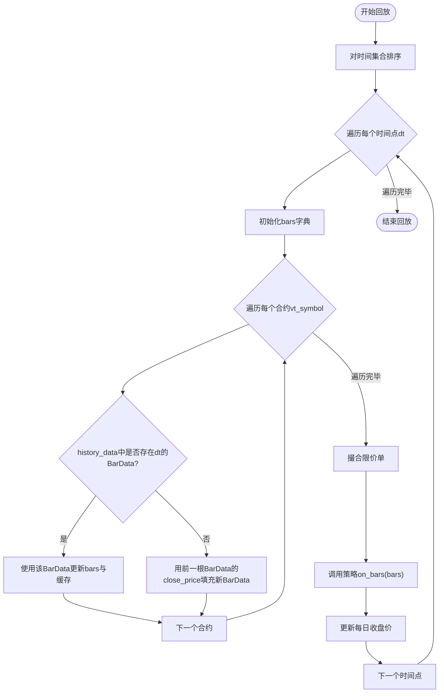
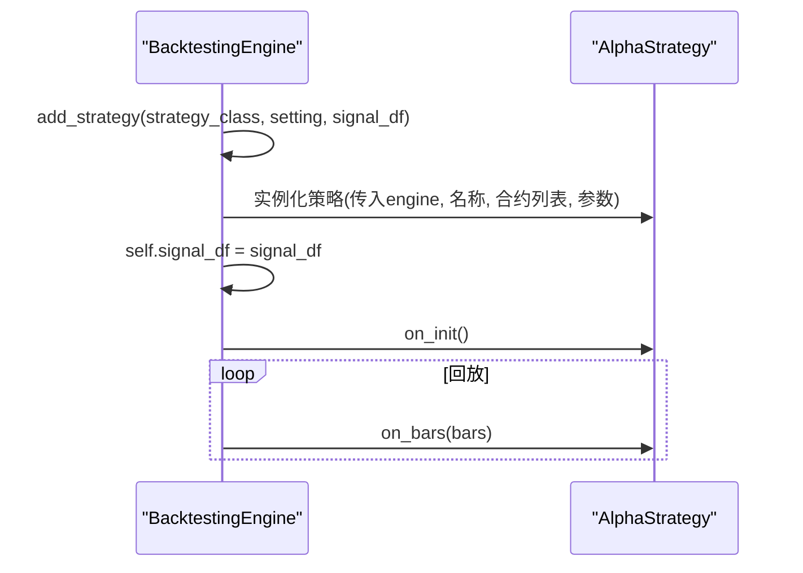
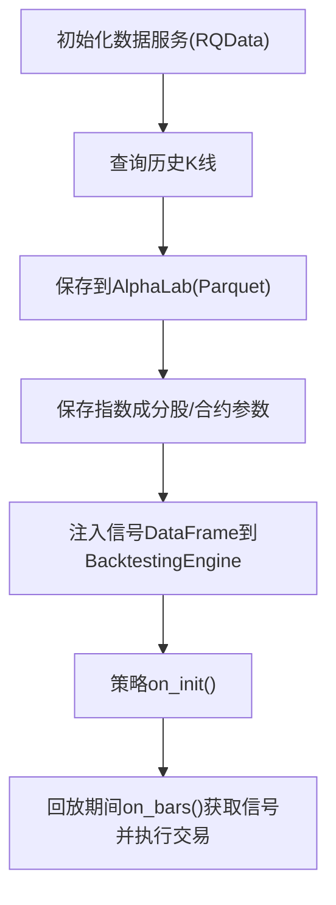
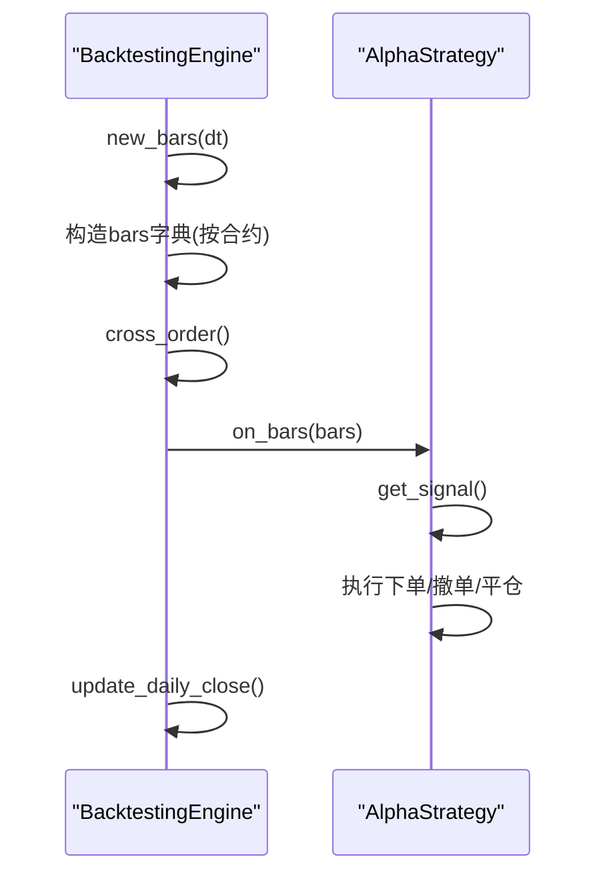
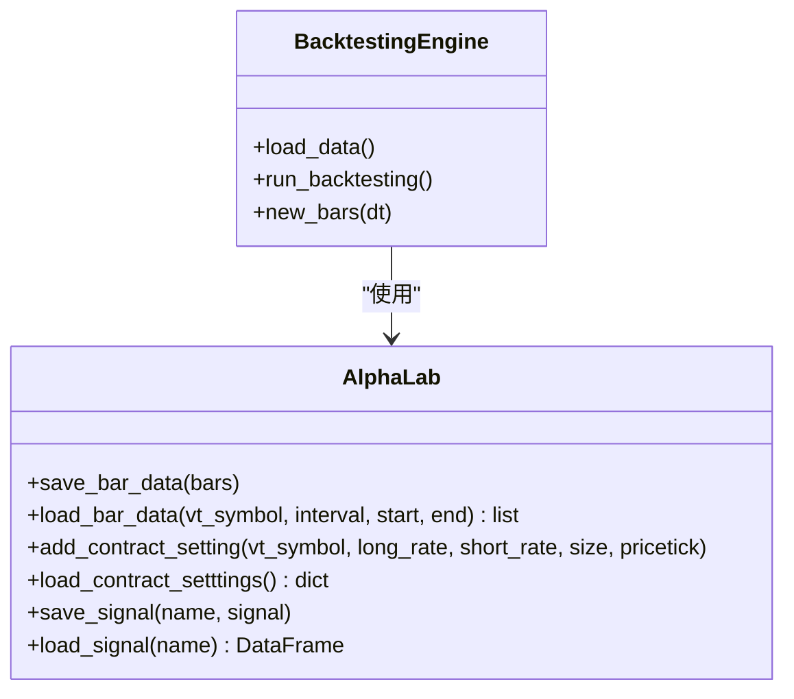
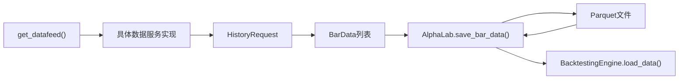
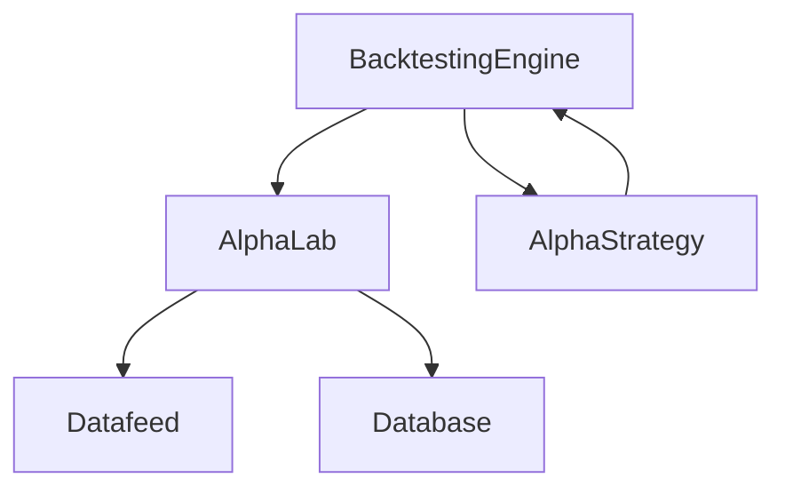

# 数据加载与策略执行

<cite>
**本文引用的文件**
- [vnpy/alpha/strategy/backtesting.py](file://vnpy/alpha/strategy/backtesting.py)
- [vnpy/alpha/lab.py](file://vnpy/alpha/lab.py)
- [vnpy/alpha/strategy/template.py](file://vnpy/alpha/strategy/template.py)
- [examples/alpha_research/download_data_rq.ipynb](file://examples/alpha_research/download_data_rq.ipynb)
- [vnpy/trader/datafeed.py](file://vnpy/trader/datafeed.py)
- [vnpy/trader/database.py](file://vnpy/trader/database.py)
- [vnpy/alpha/strategy/equity_demo_strategy.py](file://vnpy/alpha/strategy/equity_demo_strategy.py)
</cite>

## 目录
1. [引言](#引言)
2. [项目结构](#项目结构)
3. [核心组件](#核心组件)
4. [架构总览](#架构总览)
5. [详细组件分析](#详细组件分析)
6. [依赖关系分析](#依赖关系分析)
7. [性能考量](#性能考量)
8. [故障排查指南](#故障排查指南)
9. [结论](#结论)
10. [附录](#附录)

## 引言
本文件围绕vnpy中的Alpha回测模块，系统化梳理数据加载机制、时间序列对齐算法、策略注入与事件绑定、因子信号到策略初始化的完整流程，以及K线更新与策略on_bar/on_bars事件的触发逻辑。目标是帮助读者快速理解从数据准备、加载、对齐、回放到策略执行的全流程。

## 项目结构
- Alpha回测引擎位于vnpy/alpha/strategy/backtesting.py，负责加载历史K线、按时间轴回放、撮合订单、计算收益与统计。
- Alpha实验室AlphaLab位于vnpy/alpha/lab.py，负责本地Parquet数据的读写、合约配置、信号文件管理等。
- 策略模板AlphaStrategy位于vnpy/alpha/strategy/template.py，定义策略生命周期、下单/撤单、位置管理、信号获取等接口。
- 示例Notebook examples/alpha_research/download_data_rq.ipynb展示了从RQData下载数据、保存到AlphaLab、配置合约参数的完整流程。
- 数据服务接口位于vnpy/trader/datafeed.py，提供统一的外部数据源接入能力；数据库接口位于vnpy/trader/database.py，提供本地数据库抽象。

**图表来源**
- [vnpy/alpha/strategy/backtesting.py](file://vnpy/alpha/strategy/backtesting.py#L1-L120)
- [vnpy/alpha/lab.py](file://vnpy/alpha/lab.py#L1-L120)
- [vnpy/trader/datafeed.py](file://vnpy/trader/datafeed.py#L1-L60)
- [vnpy/trader/database.py](file://vnpy/trader/database.py#L1-L126)

**章节来源**
- [vnpy/alpha/strategy/backtesting.py](file://vnpy/alpha/strategy/backtesting.py#L1-L120)
- [vnpy/alpha/lab.py](file://vnpy/alpha/lab.py#L1-L120)
- [vnpy/trader/datafeed.py](file://vnpy/trader/datafeed.py#L1-L60)
- [vnpy/trader/database.py](file://vnpy/trader/database.py#L1-L126)

## 核心组件
- BacktestingEngine：回测引擎，负责参数设置、加载历史数据、按时间回放、撮合订单、计算收益与统计。
- AlphaLab：数据实验室，负责本地Parquet文件的保存与加载、合约配置、信号文件管理。
- AlphaStrategy：策略模板，定义策略生命周期、下单/撤单、位置管理、信号获取等接口。
- Datafeed：数据服务抽象，支持RQData等外部数据源。
- Database：本地数据库抽象，提供load_bar_data等接口。

**章节来源**
- [vnpy/alpha/strategy/backtesting.py](file://vnpy/alpha/strategy/backtesting.py#L1-L120)
- [vnpy/alpha/lab.py](file://vnpy/alpha/lab.py#L1-L120)
- [vnpy/alpha/strategy/template.py](file://vnpy/alpha/strategy/template.py#L1-L120)
- [vnpy/trader/datafeed.py](file://vnpy/trader/datafeed.py#L1-L60)
- [vnpy/trader/database.py](file://vnpy/trader/database.py#L1-L126)

## 架构总览
回测流程的关键路径：
- 数据准备：通过download_data_rq.ipynb将RQData数据下载并保存至AlphaLab的Parquet目录，同时配置合约参数。
- 数据加载：BacktestingEngine调用AlphaLab.load_bar_data按合约与时间区间加载历史K线，构建时间集合与历史映射。
- 时间序列对齐：按时间点dt遍历所有dt，构造每时刻各合约的K线集合，缺失时段用前值填充。
- 策略注入：add_strategy创建策略实例并注入信号DataFrame。
- K线更新：new_bars触发策略on_bars回调，同时进行限价单撮合与交易记录更新。
- 统计与展示：calculate_result/calculate_statistics生成每日收益与统计指标，show_chart展示收益曲线。

**图表来源**
- [examples/alpha_research/download_data_rq.ipynb](file://examples/alpha_research/download_data_rq.ipynb#L1-L195)
- [vnpy/alpha/lab.py](file://vnpy/alpha/lab.py#L51-L155)
- [vnpy/alpha/strategy/backtesting.py](file://vnpy/alpha/strategy/backtesting.py#L112-L168)
- [vnpy/alpha/strategy/template.py](file://vnpy/alpha/strategy/template.py#L1-L120)

**章节来源**
- [examples/alpha_research/download_data_rq.ipynb](file://examples/alpha_research/download_data_rq.ipynb#L1-L195)
- [vnpy/alpha/strategy/backtesting.py](file://vnpy/alpha/strategy/backtesting.py#L112-L168)
- [vnpy/alpha/lab.py](file://vnpy/alpha/lab.py#L51-L155)
- [vnpy/alpha/strategy/template.py](file://vnpy/alpha/strategy/template.py#L1-L120)

## 详细组件分析

### 数据加载机制：BacktestingEngine.load_data
- 功能：按合约列表与时间区间加载历史K线，构建历史映射history_data与时间集合dts。
- 关键步骤：
  - 清空历史数据与时间集合。
  - 遍历每个vt_symbol，调用AlphaLab.load_bar_data获取BarData列表。
  - 将每条BarData加入dts与history_data[(datetime, vt_symbol)]。
  - 统计空数据合约并记录日志。
- 复杂度：O(N×T)，N为合约数，T为该合约在区间内的K线条数。

**图表来源**
- [vnpy/alpha/strategy/backtesting.py](file://vnpy/alpha/strategy/backtesting.py#L112-L149)
- [vnpy/alpha/lab.py](file://vnpy/alpha/lab.py#L96-L155)

**章节来源**
- [vnpy/alpha/strategy/backtesting.py](file://vnpy/alpha/strategy/backtesting.py#L112-L149)
- [vnpy/alpha/lab.py](file://vnpy/alpha/lab.py#L96-L155)

### 时间序列对齐算法：BacktestingEngine.run_backtesting/new_bars
- 功能：按时间顺序回放历史数据，确保不同合约在同一时间点对齐。
- 关键步骤：
  - 对dts排序后逐个dt调用new_bars。
  - new_bars对每个vt_symbol：
    - 若history_data中存在该dt的BarData，则更新bars字典。
    - 若不存在但已有缓存，则用前一根BarData的close_price填充成新BarData。
  - 触发cross_order撮合未成交限价单，随后调用策略on_bars(bars)。
  - 更新每日收盘价与收益。

**图表来源**
- [vnpy/alpha/strategy/backtesting.py](file://vnpy/alpha/strategy/backtesting.py#L150-L168)
- [vnpy/alpha/strategy/backtesting.py](file://vnpy/alpha/strategy/backtesting.py#L579-L618)

**章节来源**
- [vnpy/alpha/strategy/backtesting.py](file://vnpy/alpha/strategy/backtesting.py#L150-L168)
- [vnpy/alpha/strategy/backtesting.py](file://vnpy/alpha/strategy/backtesting.py#L579-L618)

### add_strategy接口：注入策略实例与事件绑定
- 功能：向BacktestingEngine注入策略类与参数，创建策略实例并绑定信号DataFrame。
- 关键步骤：
  - 记录strategy_class与strategy实例。
  - 将signal_df赋值给引擎，供策略在on_bars中通过get_signal()获取当前时间点的信号。
- 策略生命周期：
  - run_backtesting先调用strategy.on_init()进行初始化。
  - 回放期间每步调用strategy.on_bars(bars)。

**图表来源**
- [vnpy/alpha/strategy/backtesting.py](file://vnpy/alpha/strategy/backtesting.py#L104-L111)
- [vnpy/alpha/strategy/template.py](file://vnpy/alpha/strategy/template.py#L1-L120)

**章节来源**
- [vnpy/alpha/strategy/backtesting.py](file://vnpy/alpha/strategy/backtesting.py#L104-L111)
- [vnpy/alpha/strategy/template.py](file://vnpy/alpha/strategy/template.py#L1-L120)

### 从因子信号到策略初始化：download_data_rq.ipynb示例
- 数据准备：
  - 初始化数据服务（RQData），查询历史K线并保存到AlphaLab。
  - 保存指数成分股、合约参数（手续费率、最小变动价位、合约乘数等）。
- 策略初始化：
  - 在回测前将信号DataFrame注入BacktestingEngine。
  - 策略在on_bars中通过get_signal()获取当前时间点的信号，据此生成交易指令。

**图表来源**
- [examples/alpha_research/download_data_rq.ipynb](file://examples/alpha_research/download_data_rq.ipynb#L1-L195)
- [vnpy/alpha/lab.py](file://vnpy/alpha/lab.py#L350-L481)
- [vnpy/alpha/strategy/backtesting.py](file://vnpy/alpha/strategy/backtesting.py#L104-L111)
- [vnpy/alpha/strategy/template.py](file://vnpy/alpha/strategy/template.py#L74-L120)

**章节来源**
- [examples/alpha_research/download_data_rq.ipynb](file://examples/alpha_research/download_data_rq.ipynb#L1-L195)
- [vnpy/alpha/lab.py](file://vnpy/alpha/lab.py#L350-L481)
- [vnpy/alpha/strategy/backtesting.py](file://vnpy/alpha/strategy/backtesting.py#L104-L111)
- [vnpy/alpha/strategy/template.py](file://vnpy/alpha/strategy/template.py#L74-L120)

### new_bars方法与策略on_bar/on_bars事件
- new_bars：
  - 更新当前时间、缓存bars与pre_closes。
  - 对每个vt_symbol：若历史存在则使用该BarData；否则用前一根BarData的close_price填充。
  - 调用cross_order进行限价单撮合。
  - 调用strategy.on_bars(bars)。
  - 更新每日收盘价。
- 策略侧：
  - AlphaStrategy提供get_signal()获取当前信号。
  - on_bars接收该时间点所有合约的K线切片，便于跨合约信号对齐与决策。

**图表来源**
- [vnpy/alpha/strategy/backtesting.py](file://vnpy/alpha/strategy/backtesting.py#L579-L618)
- [vnpy/alpha/strategy/template.py](file://vnpy/alpha/strategy/template.py#L74-L120)

**章节来源**
- [vnpy/alpha/strategy/backtesting.py](file://vnpy/alpha/strategy/backtesting.py#L579-L618)
- [vnpy/alpha/strategy/template.py](file://vnpy/alpha/strategy/template.py#L74-L120)

### AlphaLab数据读写与合约配置
- 保存K线：save_bar_data将BarData列表写入Parquet文件，自动去重与排序。
- 加载K线：load_bar_data按vt_symbol与时间区间过滤，返回BarData列表。
- 合约配置：add_contract_setting与load_contract_setttings分别保存与读取合约手续费率、最小变动价位、合约乘数等。
- 信号管理：save_signal/load_signal保存与读取信号DataFrame。

**图表来源**
- [vnpy/alpha/lab.py](file://vnpy/alpha/lab.py#L51-L155)
- [vnpy/alpha/lab.py](file://vnpy/alpha/lab.py#L350-L481)
- [vnpy/alpha/strategy/backtesting.py](file://vnpy/alpha/strategy/backtesting.py#L112-L168)

**章节来源**
- [vnpy/alpha/lab.py](file://vnpy/alpha/lab.py#L51-L155)
- [vnpy/alpha/lab.py](file://vnpy/alpha/lab.py#L350-L481)
- [vnpy/alpha/strategy/backtesting.py](file://vnpy/alpha/strategy/backtesting.py#L112-L168)

### 外部数据源接入：Datafeed与Database
- Datafeed：get_datafeed返回具体数据服务实现（如RQData），提供query_bar_history等接口。
- Database：BaseDatabase定义load_bar_data等抽象接口，BacktestingEngine可通过AlphaLab间接使用。

**图表来源**
- [vnpy/trader/datafeed.py](file://vnpy/trader/datafeed.py#L1-L60)
- [vnpy/trader/database.py](file://vnpy/trader/database.py#L52-L126)
- [vnpy/alpha/lab.py](file://vnpy/alpha/lab.py#L51-L155)

**章节来源**
- [vnpy/trader/datafeed.py](file://vnpy/trader/datafeed.py#L1-L60)
- [vnpy/trader/database.py](file://vnpy/trader/database.py#L52-L126)
- [vnpy/alpha/lab.py](file://vnpy/alpha/lab.py#L51-L155)

## 依赖关系分析
- BacktestingEngine依赖AlphaLab进行数据读取与合约配置。
- AlphaLab依赖Parquet文件系统与Polars进行高性能数据处理。
- Datafeed提供外部数据源接入，Database提供本地数据库抽象。
- 策略模板AlphaStrategy通过BacktestingEngine暴露的接口（下单、撤单、查询信号、查询账户资产）与回测引擎交互。

**图表来源**
- [vnpy/alpha/strategy/backtesting.py](file://vnpy/alpha/strategy/backtesting.py#L1-L120)
- [vnpy/alpha/lab.py](file://vnpy/alpha/lab.py#L1-L120)
- [vnpy/trader/datafeed.py](file://vnpy/trader/datafeed.py#L1-L60)
- [vnpy/trader/database.py](file://vnpy/trader/database.py#L1-L126)

**章节来源**
- [vnpy/alpha/strategy/backtesting.py](file://vnpy/alpha/strategy/backtesting.py#L1-L120)
- [vnpy/alpha/lab.py](file://vnpy/alpha/lab.py#L1-L120)
- [vnpy/trader/datafeed.py](file://vnpy/trader/datafeed.py#L1-L60)
- [vnpy/trader/database.py](file://vnpy/trader/database.py#L1-L126)

## 性能考量
- 数据存储：使用Parquet与Polars进行列式存储与向量化操作，提高I/O与过滤效率。
- 时间对齐：通过历史映射history_data与时间集合dts，避免逐合约扫描全量数据，降低回放复杂度。
- 撮合优化：限价单撮合仅针对活跃订单，且按合约缓存bars，减少重复查找。
- 并行与进度：加载阶段使用tqdm显示进度，建议在数据量大时合理拆分合约批次。

[本节为通用指导，无需特定文件引用]

## 故障排查指南
- 数据为空：load_data会记录空数据合约，检查AlphaLab保存路径与时间区间是否正确。
- 信号缺失：get_signal会在找不到对应时间点信号时输出日志，检查信号DataFrame的时间列与回测时间对齐。
- 撮合异常：cross_order会根据前一日收盘价与涨跌停限制进行撮合，若出现异常需检查pricetick与pre_closes配置。
- 外部数据源：若Datafeed未正确初始化，query_bar_history会返回空列表，需检查数据服务配置。

**章节来源**
- [vnpy/alpha/strategy/backtesting.py](file://vnpy/alpha/strategy/backtesting.py#L112-L149)
- [vnpy/alpha/strategy/backtesting.py](file://vnpy/alpha/strategy/backtesting.py#L709-L722)
- [vnpy/trader/datafeed.py](file://vnpy/trader/datafeed.py#L1-L60)

## 结论
vnpy的Alpha回测体系通过BacktestingEngine、AlphaLab与策略模板的协作，实现了从外部数据源到本地Parquet存储、再到回测引擎的时间序列对齐与策略执行的完整闭环。通过对历史数据的集中管理与高效的对齐算法，回测能够在多合约场景下稳定地推进策略生命周期，并通过信号对齐与撮合逻辑真实反映交易成本与风险。

[本节为总结，无需特定文件引用]

## 附录
- 示例Notebook：download_data_rq.ipynb展示了从RQData下载数据、保存到AlphaLab、配置合约参数与信号注入的全流程。
- 策略示例：equity_demo_strategy.py演示了在on_bars中获取信号、排序与执行交易的基本模式。

**章节来源**
- [examples/alpha_research/download_data_rq.ipynb](file://examples/alpha_research/download_data_rq.ipynb#L1-L195)
- [vnpy/alpha/strategy/equity_demo_strategy.py](file://vnpy/alpha/strategy/equity_demo_strategy.py#L38-L56)