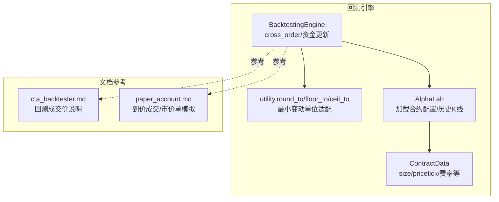
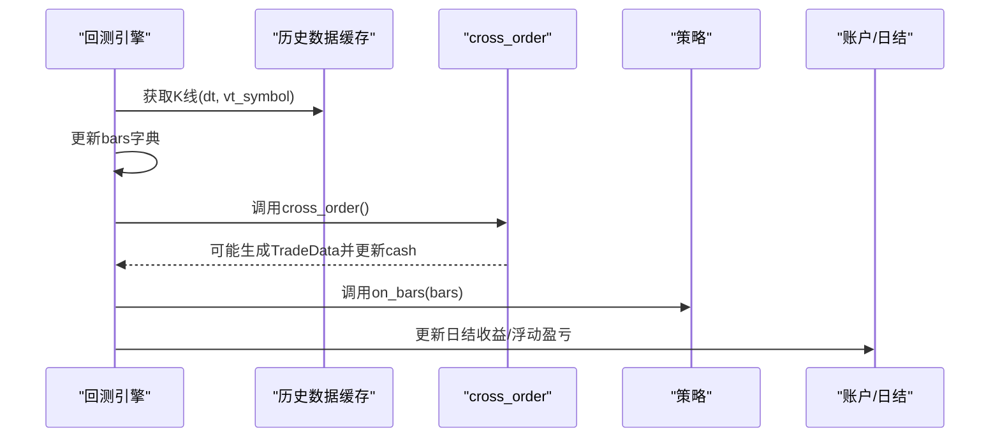
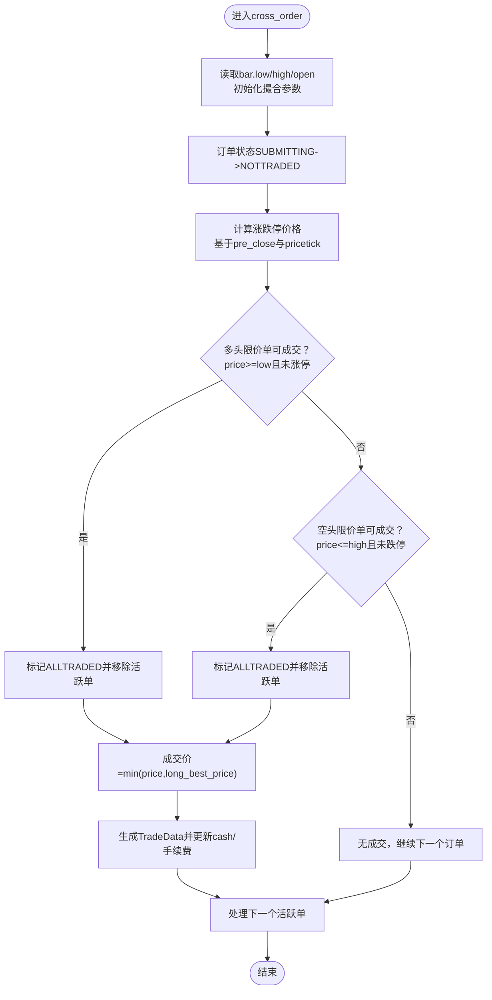
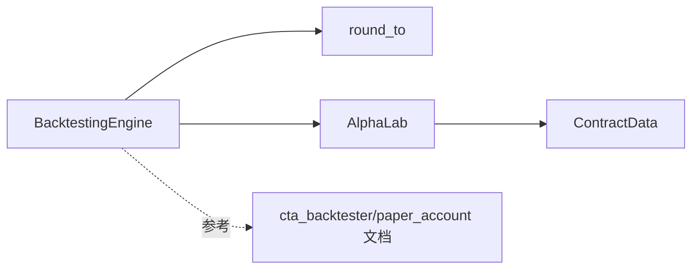

# 订单撮合与资金计算

<cite>
**本文引用的文件**
- [vnpy/alpha/strategy/backtesting.py](file://vnpy/alpha/strategy/backtesting.py)
- [vnpy/trader/utility.py](file://vnpy/trader/utility.py)
- [vnpy/trader/object.py](file://vnpy/trader/object.py)
- [vnpy/alpha/lab.py](file://vnpy/alpha/lab.py)
- [vnpy/trader/converter.py](file://vnpy/trader/converter.py)
- [docs/community/app/cta_backtester.md](file://docs/community/app/cta_backtester.md)
- [docs/community/app/paper_account.md](file://docs/community/app/paper_account.md)
</cite>

## 目录
1. [引言](#引言)
2. [项目结构](#项目结构)
3. [核心组件](#核心组件)
4. [架构总览](#架构总览)
5. [详细组件分析](#详细组件分析)
6. [依赖关系分析](#依赖关系分析)
7. [性能考量](#性能考量)
8. [故障排查指南](#故障排查指南)
9. [结论](#结论)
10. [附录](#附录)

## 引言
本文件围绕vnpy回测引擎中的订单撮合机制展开，重点解析alpha策略回测引擎中cross_order方法的实现逻辑，系统阐述限价单成交条件、价格滑点模拟、最小变动单位适配等关键规则；并完整文档化资金账户的动态更新过程，包括成交价格计算、手续费扣除、持仓数量调整及浮动盈亏更新。同时给出保证金占用与可用资金的实时计算思路，确保回测结果尽可能贴近实盘交易逻辑。最后提供典型场景示例与常见配置错误说明，帮助用户正确使用与调试。

## 项目结构
本节聚焦与回测撮合与资金计算直接相关的模块与文件组织：
- 回测引擎主体：alpha策略回测引擎，负责加载历史K线、驱动策略、撮合限价单、生成成交、更新账户与日结收益。
- 工具函数：提供价格四舍五入、地板/天花板到目标刻度等工具，用于最小变动单位适配。
- 合约配置：从实验室配置加载合约交易参数（手续费率、合约乘数、最小变动单位等）。
- 实盘参考：文档说明回测撮合规则与实盘一致性，以及模拟市价单的到价成交模式。

图表来源
- [vnpy/alpha/strategy/backtesting.py](file://vnpy/alpha/strategy/backtesting.py#L1-L200)
- [vnpy/trader/utility.py](file://vnpy/trader/utility.py#L119-L146)
- [vnpy/alpha/lab.py](file://vnpy/alpha/lab.py#L350-L362)
- [vnpy/trader/object.py](file://vnpy/trader/object.py#L232-L263)
- [docs/community/app/cta_backtester.md](file://docs/community/app/cta_backtester.md#L201-L205)
- [docs/community/app/paper_account.md](file://docs/community/app/paper_account.md#L82-L113)

章节来源
- [vnpy/alpha/strategy/backtesting.py](file://vnpy/alpha/strategy/backtesting.py#L1-L200)
- [vnpy/trader/utility.py](file://vnpy/trader/utility.py#L119-L146)
- [vnpy/alpha/lab.py](file://vnpy/alpha/lab.py#L350-L362)
- [vnpy/trader/object.py](file://vnpy/trader/object.py#L232-L263)
- [docs/community/app/cta_backtester.md](file://docs/community/app/cta_backtester.md#L201-L205)
- [docs/community/app/paper_account.md](file://docs/community/app/paper_account.md#L82-L113)

## 核心组件
- 回测引擎（BacktestingEngine）
  - 负责加载历史K线、按时间推进、调用cross_order进行撮合、生成TradeData并更新账户与日结收益。
  - 关键字段：合约费率、乘数、最小变动单位、现金、活跃限价单、成交计数等。
- 工具函数（utility）
  - 提供round_to/floor_to/ceil_to，确保价格严格对齐最小变动单位。
- 合约配置（AlphaLab）
  - 加载合约交易参数（long_rate、short_rate、size、pricetick），作为撮合与资金计算的基础。
- 文档参考
  - 回测成交价说明与到价成交模式，为理解cross_order行为提供依据。

章节来源
- [vnpy/alpha/strategy/backtesting.py](file://vnpy/alpha/strategy/backtesting.py#L1-L200)
- [vnpy/trader/utility.py](file://vnpy/trader/utility.py#L119-L146)
- [vnpy/alpha/lab.py](file://vnpy/alpha/lab.py#L350-L362)
- [docs/community/app/cta_backtester.md](file://docs/community/app/cta_backtester.md#L201-L205)
- [docs/community/app/paper_account.md](file://docs/community/app/paper_account.md#L82-L113)

## 架构总览
回测引擎在每个时间点推进时，会：
- 从历史数据缓存中取出对应K线，填充bars字典。
- 调用cross_order对当前活跃限价单进行撮合。
- 对已成交订单生成TradeData，更新账户现金、手续费、持仓等。
- 推送策略on_bars事件，驱动策略逻辑。

图表来源
- [vnpy/alpha/strategy/backtesting.py](file://vnpy/alpha/strategy/backtesting.py#L590-L691)
- [vnpy/alpha/strategy/backtesting.py](file://vnpy/alpha/strategy/backtesting.py#L690-L707)

章节来源
- [vnpy/alpha/strategy/backtesting.py](file://vnpy/alpha/strategy/backtesting.py#L590-L707)

## 详细组件分析

### cross_order方法：限价单撮合与成交
cross_order在每个回放时间点对活跃限价单进行撮合，其核心流程如下：
- 初始化撮合参数：使用bar.low_price/bar.high_price作为多头/空头“到价”判断基准；best价格取bar.open_price用于成交价比较。
- 状态推进：若订单状态为SUBMITTING，推进为NOTTRADED，通知策略。
- 价格限制：根据昨收与最小变动单位计算涨跌停价格，避免全天涨停/跌停市场下的无效撮合。
- 成交条件：
  - 多头限价单：当order.price ≥ bar.low_price且未触及涨跌停时成交。
  - 空头限价单：当order.price ≤ bar.high_price且未触及涨跌停时成交。
- 成交价确定：成交价取min(order.price, long_best_price)或max(order.price, short_best_price)，体现“到价成交+限价保护”的组合。
- 生成TradeData并更新账户：计算成交额、手续费、更新cash，推送策略update_trade/update_order。

图表来源
- [vnpy/alpha/strategy/backtesting.py](file://vnpy/alpha/strategy/backtesting.py#L619-L691)

章节来源
- [vnpy/alpha/strategy/backtesting.py](file://vnpy/alpha/strategy/backtesting.py#L619-L691)

### 价格滑点模拟与最小变动单位适配
- 最小变动单位适配：下单与成交均通过round_to对齐pricetick，保证价格落在合法刻度上。
- 滑点模拟：在当前实现中，cross_order采用“到价成交”，成交价在限价与开盘价之间择优，这相当于对限价单的滑点约束；对于市价单，文档说明采用“到价成交”模式，即以盘口最优价成交，不考虑挂单量。

章节来源
- [vnpy/trader/utility.py](file://vnpy/trader/utility.py#L119-L146)
- [vnpy/alpha/strategy/backtesting.py](file://vnpy/alpha/strategy/backtesting.py#L733-L750)
- [docs/community/app/paper_account.md](file://docs/community/app/paper_account.md#L82-L113)

### 资金账户动态更新：成交价格、手续费、持仓与浮动盈亏
- 成交金额与手续费：
  - 成交额=成交价×成交量×合约乘数。
  - 手续费=成交额×对应方向费率（多/空）。
  - 现金变化：多头成交扣减现金，空头成交增加现金；随后扣除手续费。
- 持仓数量调整：
  - 当前回测引擎未包含持仓数据结构与更新逻辑，但文档参考指出实盘中存在“开仓加权平均成本价、平仓成本价不变、冻结可用数量”等规则。在本引擎中，资金与日结收益计算基于TradeData累加，未直接更新策略层持仓。
- 浮动盈亏更新：
  - 日结收益计算中包含holding_pnl（基于期初持仓与昨收价差），以及trading_pnl（基于成交均价与收盘价差）。这些在PortfolioDailyResult/ContractDailyResult中完成。

章节来源
- [vnpy/alpha/strategy/backtesting.py](file://vnpy/alpha/strategy/backtesting.py#L690-L707)
- [vnpy/alpha/strategy/backtesting.py](file://vnpy/alpha/strategy/backtesting.py#L800-L889)
- [docs/community/app/paper_account.md](file://docs/community/app/paper_account.md#L82-L113)

### 保证金占用与可用资金的实时计算
- 当前回测引擎未实现保证金占用与可用资金的动态计算。文档参考中提到的“冻结可用数量”“可用资金”等概念属于实盘账户体系，在本引擎中主要通过cash与日结收益反映资金变化。
- 若需更贴近实盘保证金体系，可在策略层或账户层扩展：以合约乘数、保证金率、昨结算价等计算冻结与占用，并据此控制下单量。

章节来源
- [docs/community/app/paper_account.md](file://docs/community/app/paper_account.md#L82-L113)
- [vnpy/trader/converter.py](file://vnpy/trader/converter.py#L112-L167)

### 典型场景示例
- 市价单模拟：根据文档，回测采用“到价成交”模式，即以盘口最优价成交，不考虑挂单量。这与实盘市价单的成交顺序一致。
- 涨停板无法成交：当bar.low_price达到涨跌停上限或bar.high_price达到跌停下限时，cross_order不会撮合对应方向的限价单，导致订单未成交。
- 限价单滑点约束：成交价在order.price与best_price之间择优，避免极端滑点。

章节来源
- [docs/community/app/paper_account.md](file://docs/community/app/paper_account.md#L82-L113)
- [vnpy/alpha/strategy/backtesting.py](file://vnpy/alpha/strategy/backtesting.py#L634-L674)

### 常见配置错误与影响
- 缺失合约交易配置：若合约配置缺失（pricetick/size/long_rate/short_rate），回测会告警并跳过该合约，导致该合约无成交与资金变动。
- pricetick设置错误：会导致价格无法对齐最小变动单位，进而影响成交价与手续费计算。
- 费率设置错误：会导致手续费计算偏差，影响最终净收益。
- 未设置pre_close：涨跌停计算依赖pre_close，缺失可能导致涨跌停边界误判。

章节来源
- [vnpy/alpha/strategy/backtesting.py](file://vnpy/alpha/strategy/backtesting.py#L92-L103)
- [vnpy/alpha/lab.py](file://vnpy/alpha/lab.py#L350-L362)
- [vnpy/trader/object.py](file://vnpy/trader/object.py#L232-L263)

## 依赖关系分析
- 回测引擎依赖工具函数round_to进行价格对齐。
- 合约配置来源于AlphaLab，提供pricetick/size/费率等。
- 文档参考为撮合与成交顺序提供实盘一致性说明。

图表来源
- [vnpy/alpha/strategy/backtesting.py](file://vnpy/alpha/strategy/backtesting.py#L1-L200)
- [vnpy/trader/utility.py](file://vnpy/trader/utility.py#L119-L146)
- [vnpy/alpha/lab.py](file://vnpy/alpha/lab.py#L350-L362)
- [vnpy/trader/object.py](file://vnpy/trader/object.py#L232-L263)
- [docs/community/app/cta_backtester.md](file://docs/community/app/cta_backtester.md#L201-L205)
- [docs/community/app/paper_account.md](file://docs/community/app/paper_account.md#L82-L113)

章节来源
- [vnpy/alpha/strategy/backtesting.py](file://vnpy/alpha/strategy/backtesting.py#L1-L200)
- [vnpy/trader/utility.py](file://vnpy/trader/utility.py#L119-L146)
- [vnpy/alpha/lab.py](file://vnpy/alpha/lab.py#L350-L362)
- [vnpy/trader/object.py](file://vnpy/trader/object.py#L232-L263)
- [docs/community/app/cta_backtester.md](file://docs/community/app/cta_backtester.md#L201-L205)
- [docs/community/app/paper_account.md](file://docs/community/app/paper_account.md#L82-L113)

## 性能考量
- 撮合复杂度：cross_order遍历活跃限价单，每次仅做常数次比较与一次round_to，整体O(N)。
- 数据结构：bars字典按vt_symbol索引K线，活跃单字典按vt_orderid索引，查找与更新均为O(1)。
- 建议：在大规模合约回测时，尽量减少不必要的活跃单数量，避免跨合约频繁下单导致的撮合压力。

## 故障排查指南
- 订单未成交：
  - 检查是否处于涨跌停区间。
  - 检查order.price与bar.low/high的关系。
  - 检查订单状态是否为SUBMITTING导致未推进。
- 成交价异常：
  - 检查pricetick配置是否正确，确保round_to生效。
- 手续费异常：
  - 检查long_rate/short_rate配置是否匹配方向。
- 现金与收益不一致：
  - 检查size配置与成交额计算。
  - 确认日结收益计算中pre_close与start_pos是否正确传递。

章节来源
- [vnpy/alpha/strategy/backtesting.py](file://vnpy/alpha/strategy/backtesting.py#L619-L707)
- [vnpy/trader/utility.py](file://vnpy/trader/utility.py#L119-L146)
- [vnpy/alpha/lab.py](file://vnpy/alpha/lab.py#L350-L362)

## 结论
本回测引擎以“到价成交+限价保护”的方式实现限价单撮合，通过最小变动单位适配与费率配置确保成交与资金计算的准确性。当前实现未包含保证金占用与可用资金的动态计算，建议在策略层或账户层扩展以更贴近实盘。通过合理配置合约参数与遵循撮合规则，回测结果可有效反映实盘交易逻辑。

## 附录
- 术语说明
  - 到价成交：当盘口价格满足限价条件即成交。
  - 涨跌停：基于昨收与pricetick计算的上下限，用于限制当日可成交范围。
  - 最小变动单位：pricetick，决定价格对齐粒度。