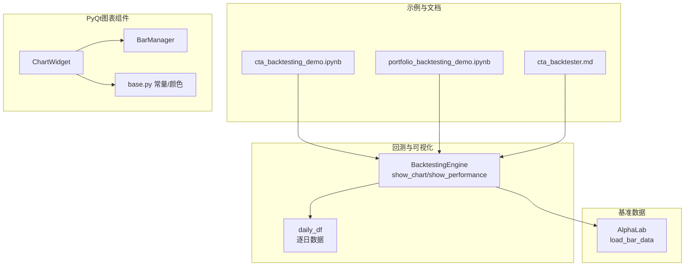
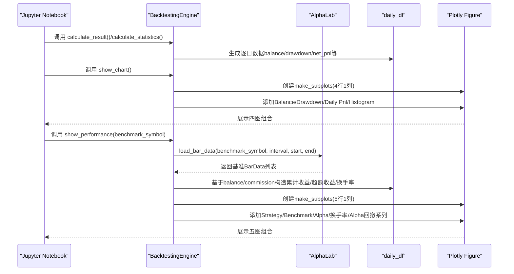
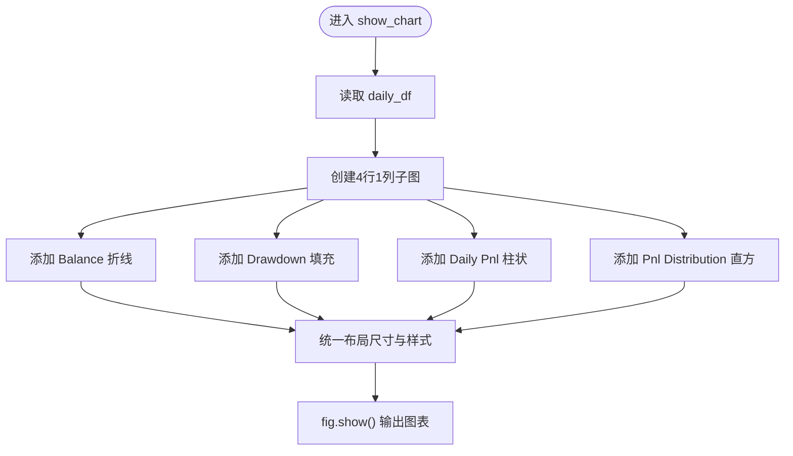
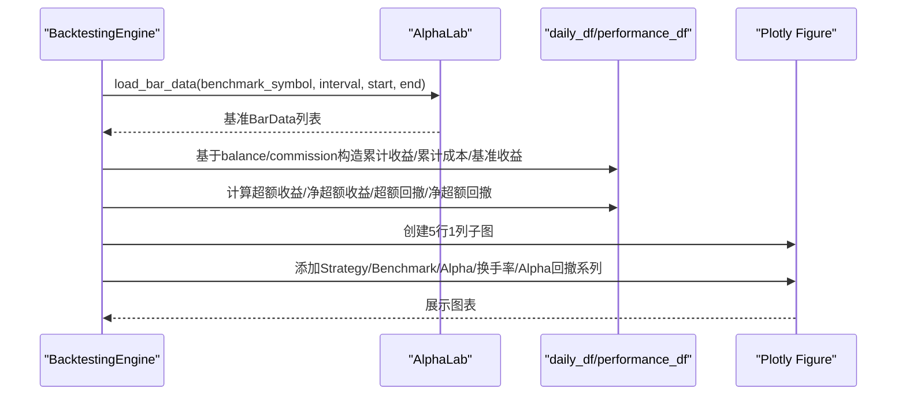
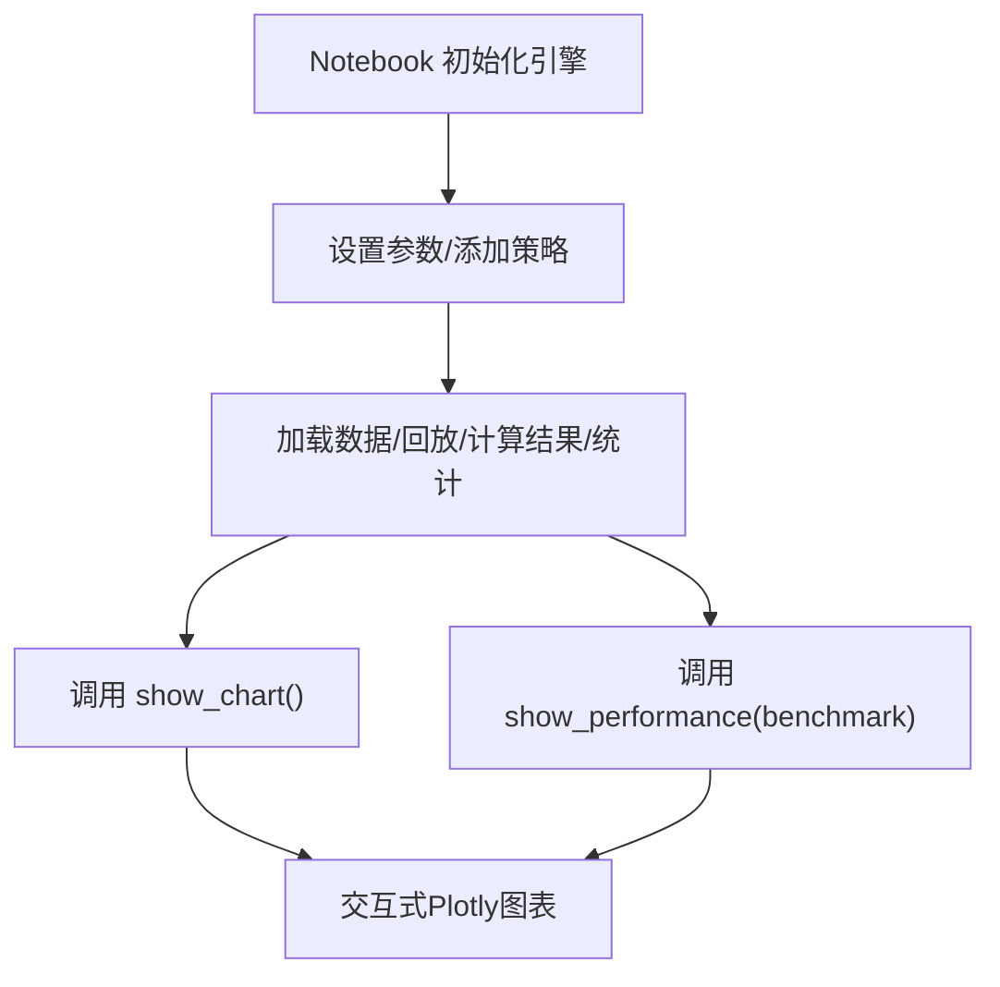
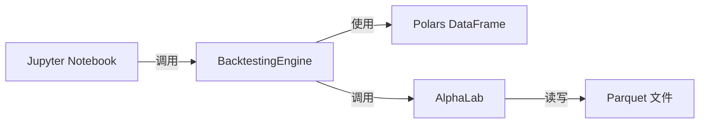

# 可视化与绩效展示

<cite>
**本文引用的文件**
- [vnpy/alpha/strategy/backtesting.py](file://vnpy/alpha/strategy/backtesting.py)
- [vnpy/alpha/lab.py](file://vnpy/alpha/lab.py)
- [examples/cta_backtesting/backtesting_demo.ipynb](file://examples/cta_backtesting/backtesting_demo.ipynb)
- [examples/portfolio_backtesting/backtesting_demo.ipynb](file://examples/portfolio_backtesting/backtesting_demo.ipynb)
- [docs/community/app/cta_backtester.md](file://docs/community/app/cta_backtester.md)
- [vnpy/chart/widget.py](file://vnpy/chart/widget.py)
- [vnpy/chart/manager.py](file://vnpy/chart/manager.py)
- [vnpy/chart/base.py](file://vnpy/chart/base.py)
</cite>

## 目录
1. [简介](#简介)
2. [项目结构](#项目结构)
3. [核心组件](#核心组件)
4. [架构总览](#架构总览)
5. [详细组件分析](#详细组件分析)
6. [依赖关系分析](#依赖关系分析)
7. [性能考量](#性能考量)
8. [故障排查指南](#故障排查指南)
9. [结论](#结论)
10. [附录](#附录)

## 简介
本文件系统化梳理vnpy中回测结果的可视化展示能力，重点围绕BacktestingEngine的show_chart与show_performance两个方法展开，解释其内部实现原理、图表布局与数据映射关系，并结合Jupyter Notebook示例说明如何在交互式环境中生成并解读四张核心图表（资金曲线、净值回撤、每日盈亏、盈亏分布）及高级绩效分析（超额收益、Alpha曲线、换手率、Alpha回撤及其成本调整版本）。同时给出常见问题定位与优化建议，帮助用户快速掌握从数据到可视化的完整流程。

## 项目结构
与可视化相关的关键位置如下：
- 回测引擎与可视化：vnpy/alpha/strategy/backtesting.py
- 基准数据加载：vnpy/alpha/lab.py
- Jupyter示例：examples/cta_backtesting/backtesting_demo.ipynb、examples/portfolio_backtesting/backtesting_demo.ipynb
- 文档说明：docs/community/app/cta_backtester.md
- PySide/PyQt绘图组件（非Plotly，但同属可视化范畴）：vnpy/chart/widget.py、vnpy/chart/manager.py、vnpy/chart/base.py

**图表来源**
- [vnpy/alpha/strategy/backtesting.py](file://vnpy/alpha/strategy/backtesting.py#L404-L559)
- [vnpy/alpha/lab.py](file://vnpy/alpha/lab.py#L96-L154)
- [examples/cta_backtesting/backtesting_demo.ipynb](file://examples/cta_backtesting/backtesting_demo.ipynb#L1-L120)
- [examples/portfolio_backtesting/backtesting_demo.ipynb](file://examples/portfolio_backtesting/backtesting_demo.ipynb#L1-L117)
- [vnpy/chart/widget.py](file://vnpy/chart/widget.py#L1-L51)
- [vnpy/chart/manager.py](file://vnpy/chart/manager.py#L1-L171)
- [vnpy/chart/base.py](file://vnpy/chart/base.py#L1-L22)

**章节来源**
- [vnpy/alpha/strategy/backtesting.py](file://vnpy/alpha/strategy/backtesting.py#L404-L559)
- [vnpy/alpha/lab.py](file://vnpy/alpha/lab.py#L96-L154)
- [examples/cta_backtesting/backtesting_demo.ipynb](file://examples/cta_backtesting/backtesting_demo.ipynb#L1-L120)
- [examples/portfolio_backtesting/backtesting_demo.ipynb](file://examples/portfolio_backtesting/backtesting_demo.ipynb#L1-L117)
- [docs/community/app/cta_backtester.md](file://docs/community/app/cta_backtester.md#L125-L186)
- [vnpy/chart/widget.py](file://vnpy/chart/widget.py#L1-L51)
- [vnpy/chart/manager.py](file://vnpy/chart/manager.py#L1-L171)
- [vnpy/chart/base.py](file://vnpy/chart/base.py#L1-L22)

## 核心组件
- BacktestingEngine：负责回测运行、逐日盈亏计算、统计指标生成，并提供show_chart与show_performance两类可视化入口。
- AlphaLab：提供load_bar_data用于加载基准价格序列，支持日线/分钟线，返回BarData列表。
- Jupyter Notebook示例：演示如何调用BacktestingEngine的计算与可视化方法，形成完整的回测工作流。
- PyQt图表组件：ChartWidget/BarManager/base.py，属于本地桌面端可视化方案，与Plotly图表互为补充。

**章节来源**
- [vnpy/alpha/strategy/backtesting.py](file://vnpy/alpha/strategy/backtesting.py#L404-L559)
- [vnpy/alpha/lab.py](file://vnpy/alpha/lab.py#L96-L154)
- [examples/cta_backtesting/backtesting_demo.ipynb](file://examples/cta_backtesting/backtesting_demo.ipynb#L1-L120)
- [examples/portfolio_backtesting/backtesting_demo.ipynb](file://examples/portfolio_backtesting/backtesting_demo.ipynb#L1-L117)
- [vnpy/chart/widget.py](file://vnpy/chart/widget.py#L1-L51)
- [vnpy/chart/manager.py](file://vnpy/chart/manager.py#L1-L171)
- [vnpy/chart/base.py](file://vnpy/chart/base.py#L1-L22)

## 架构总览
下图展示了从回测数据到Plotly图表的生成路径，以及show_performance中基准对比的引入方式。

**图表来源**
- [vnpy/alpha/strategy/backtesting.py](file://vnpy/alpha/strategy/backtesting.py#L404-L559)
- [vnpy/alpha/lab.py](file://vnpy/alpha/lab.py#L96-L154)
- [examples/cta_backtesting/backtesting_demo.ipynb](file://examples/cta_backtesting/backtesting_demo.ipynb#L1-L120)
- [examples/portfolio_backtesting/backtesting_demo.ipynb](file://examples/portfolio_backtesting/backtesting_demo.ipynb#L1-L117)

## 详细组件分析

### show_chart：四图组合的生成逻辑
- 图表布局：使用make_subplots创建4行1列的子图，标题分别为“Balance”“Drawdown”“Daily Pnl”“Pnl Distribution”，垂直间距统一设置。
- 数据映射：
  - Balance：以日期为x轴，资金余额为y轴，折线图展示。
  - Drawdown：以日期为x轴，净值回撤为y轴，填充至零轴，红色填充强调回撤区间。
  - Daily Pnl：以日期为x轴，每日净盈亏为y轴，柱状图展示日频波动。
  - Pnl Distribution：以每日净盈亏为x轴，频次为y轴，直方图展示盈亏分布形态。
- 布局与样式：统一设置图表高度与宽度，便于在Notebook中清晰展示；可按需扩展网格线与背景色。

**图表来源**
- [vnpy/alpha/strategy/backtesting.py](file://vnpy/alpha/strategy/backtesting.py#L404-L439)

**章节来源**
- [vnpy/alpha/strategy/backtesting.py](file://vnpy/alpha/strategy/backtesting.py#L404-L439)
- [docs/community/app/cta_backtester.md](file://docs/community/app/cta_backtester.md#L125-L186)

### show_performance：基准对比与高级绩效分析
- 基准数据加载：通过AlphaLab.load_bar_data加载指定vt_symbol的基准价格序列，按相同的时间区间与周期对齐策略回测时间轴。
- 数据增强与计算：
  - 累计收益：基于资金余额计算日度收益率并累加得到累计收益曲线。
  - 累计成本：基于日手续费与前一日余额计算累计成本曲线。
  - 基准收益：基于基准收盘价计算日度收益率并累加得到基准累计收益。
  - 超额收益：策略累计收益减去基准累计收益，得到Alpha曲线。
  - 净超额收益：超额收益再减去累计成本，体现成本影响下的Alpha。
  - Alpha回撤与成本调整回撤：分别计算超额收益与净超额收益相对于其累计最高值的回撤。
  - 换手率：以日成交额除以期初余额作为换手率序列。
- 图表布局：使用make_subplots创建5行1列子图，标题分别为“Return”“Alpha”“Turnover”“Alpha Drawdown”“Alpha Drawdown with Cost”，并为每个子图设置网格线与背景色，便于对比分析。

**图表来源**
- [vnpy/alpha/strategy/backtesting.py](file://vnpy/alpha/strategy/backtesting.py#L440-L559)
- [vnpy/alpha/lab.py](file://vnpy/alpha/lab.py#L96-L154)

**章节来源**
- [vnpy/alpha/strategy/backtesting.py](file://vnpy/alpha/strategy/backtesting.py#L440-L559)
- [vnpy/alpha/lab.py](file://vnpy/alpha/lab.py#L96-L154)

### 数据含义与分析价值
- 资金曲线（Balance）：反映策略在回测期内的净值走势，直观判断趋势与稳定性。
- 净值回撤（Drawdown）：衡量最大回撤幅度与持续时间，评估风险控制效果。
- 每日盈亏（Daily Pnl）：刻画日频波动，识别交易频率与择时能力。
- 盈亏分布（Pnl Distribution）：观察盈亏分布形态（偏度、峰度），辅助评估收益稳定性与尾部风险。
- 超额收益（Alpha）：策略相对基准的超额表现，衡量择时与选股能力。
- Alpha回撤：超额收益的回撤评估，关注超额收益的可持续性。
- 换手率：衡量交易活跃度与成本压力，过高换手可能侵蚀收益。
- 成本影响下的Alpha：扣除交易成本后的超额收益，更贴近真实收益。

**章节来源**
- [docs/community/app/cta_backtester.md](file://docs/community/app/cta_backtester.md#L125-L186)
- [vnpy/alpha/strategy/backtesting.py](file://vnpy/alpha/strategy/backtesting.py#L440-L559)

### 在Jupyter Notebook中的使用方式
- cta_backtesting示例：在Notebook中完成参数设置、加载数据、回放、计算结果与统计，最后调用show_chart展示四图。
- portfolio_backtesting示例：同样在Notebook中完成回测流程，调用show_chart；也可在此基础上扩展show_performance进行基准对比分析。

**图表来源**
- [examples/cta_backtesting/backtesting_demo.ipynb](file://examples/cta_backtesting/backtesting_demo.ipynb#L1-L120)
- [examples/portfolio_backtesting/backtesting_demo.ipynb](file://examples/portfolio_backtesting/backtesting_demo.ipynb#L1-L117)

**章节来源**
- [examples/cta_backtesting/backtesting_demo.ipynb](file://examples/cta_backtesting/backtesting_demo.ipynb#L1-L120)
- [examples/portfolio_backtesting/backtesting_demo.ipynb](file://examples/portfolio_backtesting/backtesting_demo.ipynb#L1-L117)

### 与PyQt图表组件的关系
- 本仓库中存在基于PySide/PyQt的ChartWidget与BarManager组件，用于本地桌面端实时图表展示，与Plotly的show_chart/show_performance形成互补。前者适合高频交互与本地化展示，后者更适合在Notebook中生成静态/半静态的高质量图表。

**章节来源**
- [vnpy/chart/widget.py](file://vnpy/chart/widget.py#L1-L51)
- [vnpy/chart/manager.py](file://vnpy/chart/manager.py#L1-L171)
- [vnpy/chart/base.py](file://vnpy/chart/base.py#L1-L22)

## 依赖关系分析
- BacktestingEngine依赖：
  - Polars DataFrame进行高效数据处理与列式计算（如cum_sum、pct_change、shift等）。
  - Plotly进行图表绘制与子图布局。
  - AlphaLab提供基准数据加载。
- AlphaLab依赖：
  - Parquet文件存储历史K线数据，按vt_symbol与interval组织。
  - 将Parquet转换为BarData对象，供回测引擎使用。
- Notebook示例依赖：
  - 通过调用BacktestingEngine的方法串联回测全流程，并输出可视化结果。

**图表来源**
- [vnpy/alpha/strategy/backtesting.py](file://vnpy/alpha/strategy/backtesting.py#L404-L559)
- [vnpy/alpha/lab.py](file://vnpy/alpha/lab.py#L96-L154)

**章节来源**
- [vnpy/alpha/strategy/backtesting.py](file://vnpy/alpha/strategy/backtesting.py#L404-L559)
- [vnpy/alpha/lab.py](file://vnpy/alpha/lab.py#L96-L154)

## 性能考量
- 数据规模与计算复杂度：
  - daily_df构建与统计指标计算主要依赖Polars的向量化操作，整体复杂度与交易日数量线性相关。
  - show_performance中涉及多次列式计算（pct_change、cum_sum、shift、cum_max等），建议在大规模数据时注意内存占用与I/O瓶颈。
- I/O与缓存：
  - AlphaLab.load_bar_data基于Parquet文件读取，建议确保数据文件完整性与索引优化，避免重复读取。
- 可视化渲染：
  - Plotly图表在Notebook中渲染较为轻量，但在大量数据点时仍建议分段或抽样展示，以提升交互体验。

[本节为通用指导，不直接分析具体文件]

## 故障排查指南
- show_chart无输出或报错：
  - 确认已执行calculate_result()生成daily_df后再调用show_chart()。
  - 检查Plotly是否正确安装与导入。
- show_performance基准缺失：
  - 确认benchmark_symbol对应的vt_symbol文件存在于AlphaLab的数据目录中，且时间区间覆盖回测范围。
  - 检查load_bar_data返回的基准数据是否为空。
- 数据异常或NaN：
  - BacktestingEngine在统计阶段会对极值与NaN进行过滤，若仍出现异常，检查输入数据质量与时间对齐。
- Notebook渲染问题：
  - 若在某些环境下无法显示Plotly图表，尝试在本地Jupyter内核中重新启动或更换浏览器内核。

**章节来源**
- [vnpy/alpha/strategy/backtesting.py](file://vnpy/alpha/strategy/backtesting.py#L404-L559)
- [vnpy/alpha/lab.py](file://vnpy/alpha/lab.py#L96-L154)

## 结论
BacktestingEngine的show_chart与show_performance为回测结果提供了直观而全面的可视化视角。前者聚焦资金、回撤、日频盈亏与分布，后者进一步引入基准对比与成本影响，形成Alpha视角的深度分析。结合Jupyter Notebook示例，用户可快速完成从数据准备到图表呈现的闭环工作流。建议在实际应用中关注数据质量、I/O效率与图表渲染性能，以获得稳定可靠的可视化体验。

[本节为总结性内容，不直接分析具体文件]

## 附录
- 快速调用参考（路径指引而非代码片段）：
  - 四图展示：调用BacktestingEngine.show_chart()
    - 参考路径：[vnpy/alpha/strategy/backtesting.py](file://vnpy/alpha/strategy/backtesting.py#L404-L439)
  - 基准对比与高级分析：调用BacktestingEngine.show_performance(benchmark_symbol)
    - 参考路径：[vnpy/alpha/strategy/backtesting.py](file://vnpy/alpha/strategy/backtesting.py#L440-L559)
  - 基准数据加载：AlphaLab.load_bar_data(vt_symbol, interval, start, end)
    - 参考路径：[vnpy/alpha/lab.py](file://vnpy/alpha/lab.py#L96-L154)
  - 示例Notebook（cta）：examples/cta_backtesting/backtesting_demo.ipynb
    - 参考路径：[examples/cta_backtesting/backtesting_demo.ipynb](file://examples/cta_backtesting/backtesting_demo.ipynb#L1-L120)
  - 示例Notebook（portfolio）：examples/portfolio_backtesting/backtesting_demo.ipynb
    - 参考路径：[examples/portfolio_backtesting/backtesting_demo.ipynb](file://examples/portfolio_backtesting/backtesting_demo.ipynb#L1-L117)