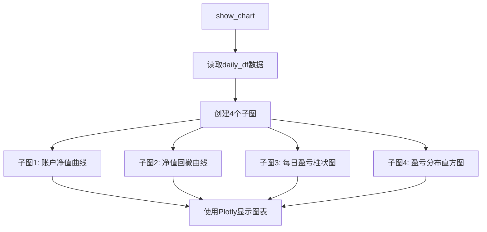

# 回测结果分析

<cite>
**本文档引用的文件**
- [backtesting.py](file://vnpy/alpha/strategy/backtesting.py)
- [cta_backtester.md](file://docs/community/app/cta_backtester.md)
</cite>

## 目录
1. [引言](#引言)
2. [逐日盈亏计算体系](#逐日盈亏计算体系)
3. [绩效指标生成算法](#绩效指标生成算法)
4. [可视化展示功能](#可视化展示功能)
5. [结论](#结论)

## 引言
本文档旨在全面解析vnpy框架中的回测结果分析体系，重点阐述`calculate_result`和`calculate_statistics`两大核心功能。文档将详细说明PortfolioDailyResult的日度损益计算逻辑，深入分析夏普比率、最大回撤等20余项量化指标的数学公式与实现步骤，并阐述`show_chart`功能的图表生成原理。

**Section sources**
- [cta_backtester.md](file://docs/community/app/cta_backtester.md#jump)

## 逐日盈亏计算体系

回测结果分析的核心是逐日盈亏的计算，该过程通过`calculate_result`方法实现。系统首先根据每日的成交记录，为每个交易日创建一个`PortfolioDailyResult`对象，该对象聚合了投资组合中所有合约的盈亏情况。

盈亏计算采用期货市场通用的逐日盯市（Marking-to-Market）规则，将每日盈亏分为三个部分：
1.  **持仓盈亏 (Holding PnL)**：计算昨日收盘时持有的头寸，以昨收盘价开仓，以今收盘价平仓所产生的盈亏。
2.  **交易盈亏 (Trading PnL)**：计算当日新成交的头寸，以成交价开仓，以今收盘价平仓所产生的盈亏。
3.  **总盈亏 (Total PnL)**：持仓盈亏与交易盈亏之和。
4.  **净盈亏 (Net PnL)**：总盈亏扣除当日的总手续费和滑点成本后的最终盈亏，该数值用于生成资金曲线等图表。

**Section sources**
- [backtesting.py](file://vnpy/alpha/strategy/backtesting.py#L170-L226)

## 绩效指标生成算法

`calculate_statistics`方法负责生成20余项关键的量化绩效指标。该方法首先基于每日的净盈亏数据，计算出每日的账户净值、收益率、回撤等基础数据，然后在此基础上进行统计分析。

### 核心指标算法
以下为部分核心指标的数学公式与计算步骤：

*   **年化收益 (Annual Return)**:
    *   **公式**: `总收益率 / 总交易日 * 年化天数`
    *   **步骤**: 首先计算总收益率（(结束资金 / 起始资金 - 1) * 100%），然后按比例折算为年化收益率。

*   **最大回撤 (Max Drawdown)**:
    *   **公式**: `min(每日净值 - 历史最高净值)`
    *   **步骤**: 计算每日净值相对于历史最高净值的差值，取其中的最小值。

*   **夏普比率 (Sharpe Ratio)**:
    *   **公式**: `(日均收益率 - 无风险利率) / 收益标准差 * sqrt(年化天数)`
    *   **步骤**: 计算日均收益率和收益率的标准差，然后代入公式计算。

*   **收益回撤比 (Return Drawdown Ratio)**:
    *   **公式**: `总净盈亏 / 最大回撤`
    *   **步骤**: 将总净盈亏与最大回撤的绝对值进行比较。

**Section sources**
- [backtesting.py](file://vnpy/alpha/strategy/backtesting.py#L228-L402)

## 可视化展示功能

`show_chart`方法利用Plotly库生成直观的回测结果图表。该功能将回测结果以多子图的形式进行展示，主要包括：

*   **账户净值图 (Balance)**: 展示账户净值随时间变化的曲线，反映策略的整体盈利能力。
*   **净值回撤图 (Drawdown)**: 展示账户净值从历史高点回撤的幅度，反映策略的风险水平。
*   **每日盈亏图 (Daily PnL)**: 以柱状图形式展示每日的净盈亏，反映策略的稳定性。
*   **盈亏分布图 (Pnl Distribution)**: 以直方图形式展示每日盈亏的分布情况，反映策略的收益特征。

**Diagram sources**
- [backtesting.py](file://vnpy/alpha/strategy/backtesting.py#L404-L438)

## 结论
vnpy的回测结果分析体系通过`calculate_result`和`calculate_statistics`两个核心方法，实现了从原始成交数据到详细绩效报告的完整流程。该体系设计严谨，计算逻辑清晰，能够为量化策略的评估提供全面、可靠的数据支持。`show_chart`功能则将复杂的数字结果转化为直观的图表，极大地提升了结果的可读性和分析效率。