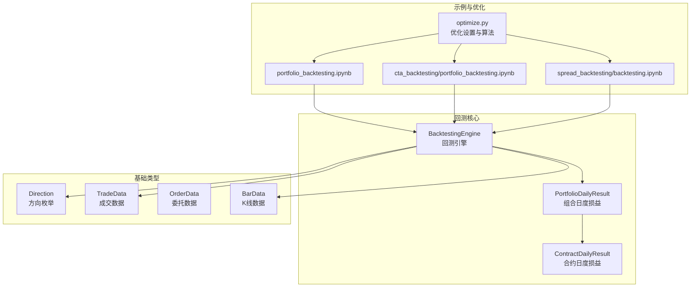
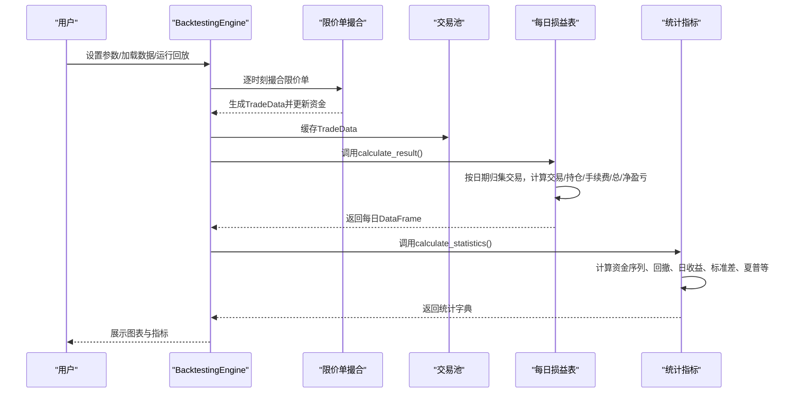
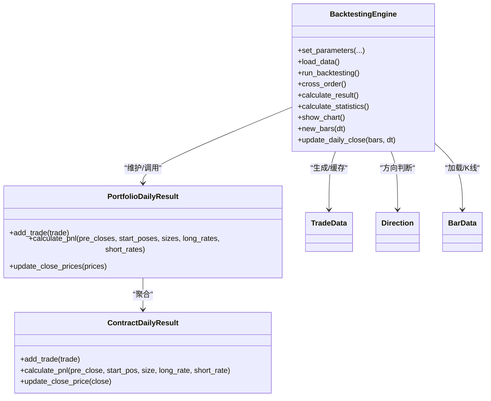
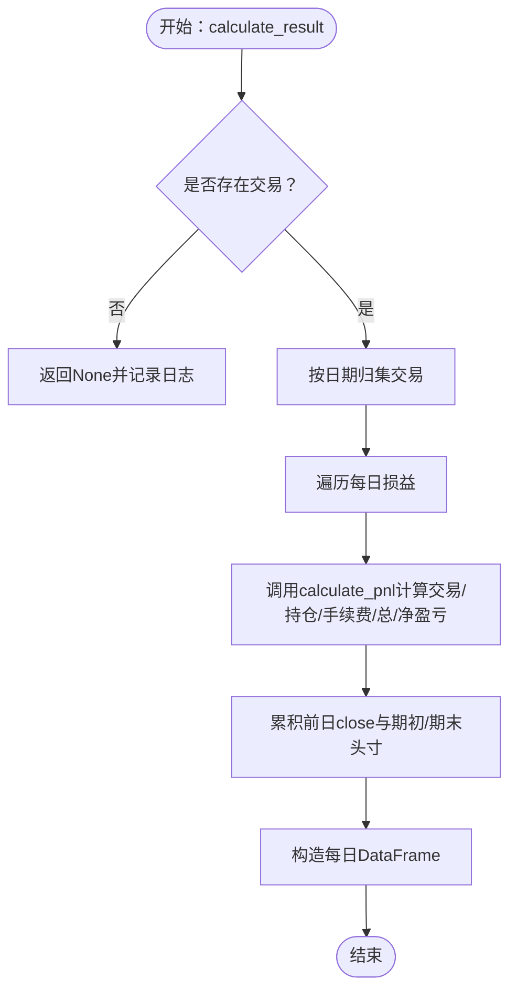
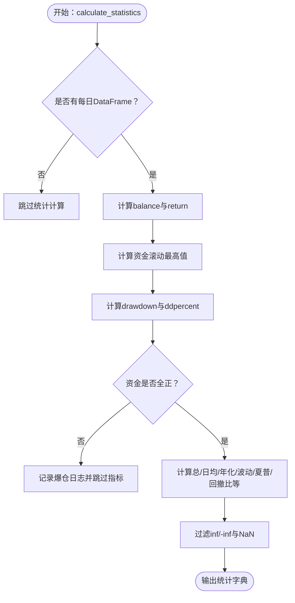

# 结果计算与统计分析

<cite>
**本文引用的文件**
- [vnpy/alpha/strategy/backtesting.py](file://vnpy/alpha/strategy/backtesting.py)
- [vnpy/trader/constant.py](file://vnpy/trader/constant.py)
- [vnpy/trader/object.py](file://vnpy/trader/object.py)
- [vnpy/trader/optimize.py](file://vnpy/trader/optimize.py)
- [examples/portfolio_backtesting/backtesting_demo.ipynb](file://examples/portfolio_backtesting/backtesting_demo.ipynb)
- [examples/cta_backtesting/portfolio_backtesting.ipynb](file://examples/cta_backtesting/portfolio_backtesting.ipynb)
- [examples/spread_backtesting/backtesting.ipynb](file://examples/spread_backtesting/backtesting.ipynb)
</cite>

## 目录
1. [引言](#引言)
2. [项目结构](#项目结构)
3. [核心组件](#核心组件)
4. [架构总览](#架构总览)
5. [详细组件分析](#详细组件分析)
6. [依赖关系分析](#依赖关系分析)
7. [性能考量](#性能考量)
8. [故障排查指南](#故障排查指南)
9. [结论](#结论)
10. [附录](#附录)

## 引言
本文件系统化梳理vnpy回测引擎在“结果计算与统计分析”方面的完整流程，重点围绕两个核心能力展开：
- calculate_result：逐日盈亏计算，将交易成交明细映射为每日的交易盈亏、持仓盈亏、手续费、总盈亏与净盈亏等分项。
- calculate_statistics：基于每日净值序列与交易明细，生成20+项量化指标，覆盖收益、风险、夏普比率、最大回撤、收益回撤比等。

同时，文档解释PortfolioDailyResult的日度损益计算逻辑，详述交易盈亏、持仓盈亏、手续费的分项算法，并给出在资金为负（爆仓）场景下的处理策略与边界条件。

## 项目结构
本项目与回测结果计算相关的代码主要位于vnpy/alpha/strategy/backtesting.py，配套的常量、数据结构与示例在vnpy/trader与examples目录中。

图表来源
- [vnpy/alpha/strategy/backtesting.py](file://vnpy/alpha/strategy/backtesting.py#L1-L120)
- [vnpy/trader/constant.py](file://vnpy/trader/constant.py#L10-L28)
- [vnpy/trader/object.py](file://vnpy/trader/object.py#L154-L176)
- [vnpy/trader/optimize.py](file://vnpy/trader/optimize.py#L26-L81)
- [examples/portfolio_backtesting/backtesting_demo.ipynb](file://examples/portfolio_backtesting/backtesting_demo.ipynb#L1-L90)
- [examples/cta_backtesting/portfolio_backtesting.ipynb](file://examples/cta_backtesting/portfolio_backtesting.ipynb#L1-L46)
- [examples/spread_backtesting/backtesting.ipynb](file://examples/spread_backtesting/backtesting.ipynb#L40-L99)

章节来源
- [vnpy/alpha/strategy/backtesting.py](file://vnpy/alpha/strategy/backtesting.py#L1-L120)
- [vnpy/trader/constant.py](file://vnpy/trader/constant.py#L10-L28)
- [vnpy/trader/object.py](file://vnpy/trader/object.py#L154-L176)
- [examples/portfolio_backtesting/backtesting_demo.ipynb](file://examples/portfolio_backtesting/backtesting_demo.ipynb#L1-L90)
- [examples/cta_backtesting/portfolio_backtesting.ipynb](file://examples/cta_backtesting/portfolio_backtesting.ipynb#L1-L46)
- [examples/spread_backtesting/backtesting.ipynb](file://examples/spread_backtesting/backtesting.ipynb#L40-L99)

## 核心组件
- BacktestingEngine：负责加载历史数据、驱动回放、撮合订单、生成交易、构建每日损益表、计算统计指标与可视化。
- PortfolioDailyResult：组合层面的日度损益容器，聚合各合约日度损益，产出交易/持仓/总/净盈亏及手续费等。
- ContractDailyResult：合约层面的日度损益容器，按前一日收盘价、当日收盘价、交易方向与成交量计算交易与持仓盈亏。
- TradeData/OrderData/BarData：交易、委托与K线数据结构，作为回测输入与计算依据。
- Direction：方向枚举，区分多/空方向，影响交易盈亏符号。

章节来源
- [vnpy/alpha/strategy/backtesting.py](file://vnpy/alpha/strategy/backtesting.py#L1-L120)
- [vnpy/alpha/strategy/backtesting.py](file://vnpy/alpha/strategy/backtesting.py#L800-L945)
- [vnpy/trader/constant.py](file://vnpy/trader/constant.py#L10-L28)
- [vnpy/trader/object.py](file://vnpy/trader/object.py#L154-L176)

## 架构总览
回测结果计算与统计分析的端到端流程如下：

图表来源
- [vnpy/alpha/strategy/backtesting.py](file://vnpy/alpha/strategy/backtesting.py#L150-L226)
- [vnpy/alpha/strategy/backtesting.py](file://vnpy/alpha/strategy/backtesting.py#L228-L402)
- [examples/portfolio_backtesting/backtesting_demo.ipynb](file://examples/portfolio_backtesting/backtesting_demo.ipynb#L56-L70)

## 详细组件分析

### 组件A：BacktestingEngine（回测引擎）
- 职责
  - 加载历史K线，按时间推进回放。
  - 撮合限价单，生成TradeData并更新可用资金。
  - 维护每日损益表，提供calculate_result与calculate_statistics。
  - 可视化净值曲线、回撤、日盈亏分布等。
- 关键流程
  - run_backtesting：按时间序列推送K线，触发策略on_bars与每日收盘价更新。
  - cross_order：按涨跌停限制与盘口匹配生成成交，累计手续费与交易额。
  - calculate_result：将交易池按日归集，调用PortfolioDailyResult计算分项。
  - calculate_statistics：基于每日净值序列计算各类指标，含爆仓保护。

章节来源
- [vnpy/alpha/strategy/backtesting.py](file://vnpy/alpha/strategy/backtesting.py#L123-L168)
- [vnpy/alpha/strategy/backtesting.py](file://vnpy/alpha/strategy/backtesting.py#L561-L618)
- [vnpy/alpha/strategy/backtesting.py](file://vnpy/alpha/strategy/backtesting.py#L619-L708)
- [vnpy/alpha/strategy/backtesting.py](file://vnpy/alpha/strategy/backtesting.py#L170-L226)
- [vnpy/alpha/strategy/backtesting.py](file://vnpy/alpha/strategy/backtesting.py#L228-L402)

### 组件B：PortfolioDailyResult（组合日度损益）
- 职责
  - 聚合各合约日度损益，产出交易/持仓/总/净盈亏与手续费、成交额、交易次数等。
  - 维护当日收盘价、前日收盘价、期初/期末头寸映射。
- 计算逻辑
  - 将当日所有TradeData按vt_symbol归集至对应ContractDailyResult。
  - 调用calculate_pnl汇总各合约的交易/持仓/总/净盈亏与手续费、成交额、交易次数。
  - 记录当日end_poses供次日作为start_poses使用。

章节来源
- [vnpy/alpha/strategy/backtesting.py](file://vnpy/alpha/strategy/backtesting.py#L875-L945)

### 组件C：ContractDailyResult（合约日度损益）
- 职责
  - 基于前日close与当日close、交易方向与成交量，计算交易盈亏与持仓盈亏。
  - 累计手续费、成交额与交易次数。
- 计算公式
  - 持仓盈亏：期初头寸 × (当日close − 前日close) × 合约乘数
  - 交易盈亏：Σ(方向为多：+Δ体积 × (close − 成交价) × 乘数；方向为空：−Δ体积 × (close − 成交价) × 乘数)
  - 总盈亏 = 交易盈亏 + 持仓盈亏
  - 净盈亏 = 总盈亏 − 手续费
  - 手续费 = 成交额 × 手续费率（多/空分别对应long_rate/short_rate）

章节来源
- [vnpy/alpha/strategy/backtesting.py](file://vnpy/alpha/strategy/backtesting.py#L800-L874)

### 组件D：交易撮合与资金流（cross_order）
- 职责
  - 根据涨跌停与盘口判断是否成交，生成TradeData。
  - 更新可用资金：多头买入扣减成交额与手续费；空头卖出增加成交额并扣减手续费。
- 关键点
  - 价格按盘口与限价约束取值，避免越权。
  - 资金流严格遵循方向与成交额，确保净值序列正确。

章节来源
- [vnpy/alpha/strategy/backtesting.py](file://vnpy/alpha/strategy/backtesting.py#L619-L708)

### 组件E：统计指标计算（calculate_statistics）
- 输入
  - 每日DataFrame：包含net_pnl、turnover、commission、trade_count等。
- 计算步骤
  - 构造balance：每日净值 = Σ前日net_pnl + 期初资金
  - 计算return：balance的环比收益率（首日为0）
  - 计算drawdown与ddpercent：基于balance的滚动最高值与回撤
  - 爆仓检测：若balance全为正则继续，否则跳过指标计算并记录日志
  - 指标计算：
    - 收益类：总收益率、年化收益、日均盈亏、日均手续费、日均成交额、日均成交笔数
    - 风险类：最大回撤、百分比最大回撤、最长回撤天数、日收益标准差
    - 效率类：夏普比率（含无风险利率）、收益回撤比
  - 极端值过滤：inf/-inf替换为0，NaN替换为0

章节来源
- [vnpy/alpha/strategy/backtesting.py](file://vnpy/alpha/strategy/backtesting.py#L228-L402)

### 组件F：示例与优化（OptimizationSetting）
- 作用
  - 提供参数空间生成、目标设置与穷举/遗传算法优化入口。
  - 在示例中演示如何以sharpe_ratio为目标进行参数优化。
- 与统计的关系
  - 优化器以calculate_statistics返回的指标作为评估目标，驱动参数搜索。

章节来源
- [vnpy/trader/optimize.py](file://vnpy/trader/optimize.py#L26-L81)
- [vnpy/trader/optimize.py](file://vnpy/trader/optimize.py#L132-L230)
- [examples/portfolio_backtesting/backtesting_demo.ipynb](file://examples/portfolio_backtesting/backtesting_demo.ipynb#L71-L93)
- [examples/cta_backtesting/portfolio_backtesting.ipynb](file://examples/cta_backtesting/portfolio_backtesting.ipynb#L18-L46)
- [examples/spread_backtesting/backtesting.ipynb](file://examples/spread_backtesting/backtesting.ipynb#L94-L107)

## 依赖关系分析

图表来源
- [vnpy/alpha/strategy/backtesting.py](file://vnpy/alpha/strategy/backtesting.py#L1-L120)
- [vnpy/alpha/strategy/backtesting.py](file://vnpy/alpha/strategy/backtesting.py#L800-L945)
- [vnpy/trader/constant.py](file://vnpy/trader/constant.py#L10-L28)
- [vnpy/trader/object.py](file://vnpy/trader/object.py#L154-L176)

章节来源
- [vnpy/alpha/strategy/backtesting.py](file://vnpy/alpha/strategy/backtesting.py#L1-L120)
- [vnpy/alpha/strategy/backtesting.py](file://vnpy/alpha/strategy/backtesting.py#L800-L945)
- [vnpy/trader/constant.py](file://vnpy/trader/constant.py#L10-L28)
- [vnpy/trader/object.py](file://vnpy/trader/object.py#L154-L176)

## 性能考量
- 计算复杂度
  - calculate_result：O(T + N)，T为交易数，N为合约数×交易日数，主要瓶颈在按日归集与逐合约计算。
  - calculate_statistics：O(D)，D为交易日数，涉及滚动最高值、回撤、日收益与标准差等线性扫描。
- 内存占用
  - trades与daily_results在长周期回测中可能较大，建议在策略层控制信号频率与订单密度。
- 并行优化
  - 优化器支持多进程并行（穷举/遗传），可显著缩短参数搜索时间。

[本节为通用性能讨论，无需列出具体文件来源]

## 故障排查指南
- 无成交记录
  - 现象：calculate_result返回None并记录“成交记录为空，无法计算”
  - 排查：确认策略是否生成有效信号与订单，检查撮合逻辑与涨跌停限制
- 爆仓（资金为负）
  - 现象：calculate_statistics检测到balance非全正，跳过指标计算并记录日志
  - 处理：调整初始资金、手续费率、合约乘数或风控参数，避免连续亏损导致资金归零
- 数据缺失
  - 现象：load_data阶段提示部分合约历史数据为空
  - 处理：检查数据源与时间范围，确保K线完整
- 可视化异常
  - 现象：图表空白或报错
  - 处理：确认Plotly安装与版本兼容，检查DataFrame列名与数据类型

章节来源
- [vnpy/alpha/strategy/backtesting.py](file://vnpy/alpha/strategy/backtesting.py#L170-L176)
- [vnpy/alpha/strategy/backtesting.py](file://vnpy/alpha/strategy/backtesting.py#L257-L283)
- [vnpy/alpha/strategy/backtesting.py](file://vnpy/alpha/strategy/backtesting.py#L123-L148)
- [vnpy/alpha/strategy/backtesting.py](file://vnpy/alpha/strategy/backtesting.py#L404-L439)

## 结论
vnpy回测引擎通过BacktestingEngine统一调度，将交易成交明细映射为逐日损益，并在此基础上严谨地计算20+项量化指标。PortfolioDailyResult与ContractDailyResult分别承担组合与合约层面的分项计算，确保交易/持仓/手续费等维度清晰可追溯。在爆仓场景下，引擎具备明确的保护机制与日志提示，便于快速定位问题。配合OptimizationSetting，用户可基于统计指标进行参数优化，提升策略稳健性与收益风险比。

[本节为总结性内容，无需列出具体文件来源]

## 附录

### 逐日盈亏计算流程（Flowchart）

图表来源
- [vnpy/alpha/strategy/backtesting.py](file://vnpy/alpha/strategy/backtesting.py#L170-L226)
- [vnpy/alpha/strategy/backtesting.py](file://vnpy/alpha/strategy/backtesting.py#L800-L945)

### 统计指标计算流程（Flowchart）

图表来源
- [vnpy/alpha/strategy/backtesting.py](file://vnpy/alpha/strategy/backtesting.py#L228-L402)

### 使用示例路径
- 组合回测示例（Jupyter Notebook）
  - [examples/portfolio_backtesting/backtesting_demo.ipynb](file://examples/portfolio_backtesting/backtesting_demo.ipynb#L56-L70)
- CTA组合回测示例（Jupyter Notebook）
  - [examples/cta_backtesting/portfolio_backtesting.ipynb](file://examples/cta_backtesting/portfolio_backtesting.ipynb#L18-L46)
- 价差回测示例（Jupyter Notebook）
  - [examples/spread_backtesting/backtesting.ipynb](file://examples/spread_backtesting/backtesting.ipynb#L60-L71)

章节来源
- [examples/portfolio_backtesting/backtesting_demo.ipynb](file://examples/portfolio_backtesting/backtesting_demo.ipynb#L56-L70)
- [examples/cta_backtesting/portfolio_backtesting.ipynb](file://examples/cta_backtesting/portfolio_backtesting.ipynb#L18-L46)
- [examples/spread_backtesting/backtesting.ipynb](file://examples/spread_backtesting/backtesting.ipynb#L60-L71)