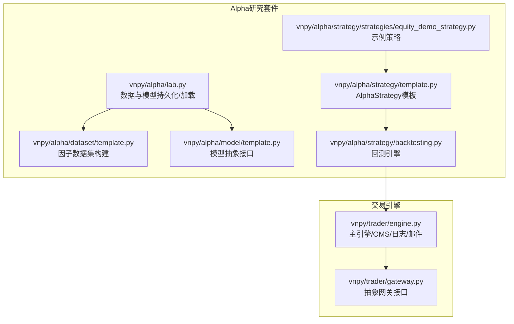
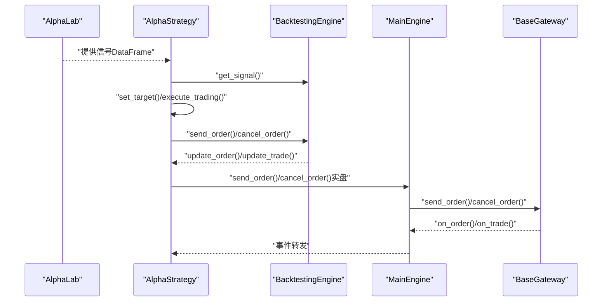
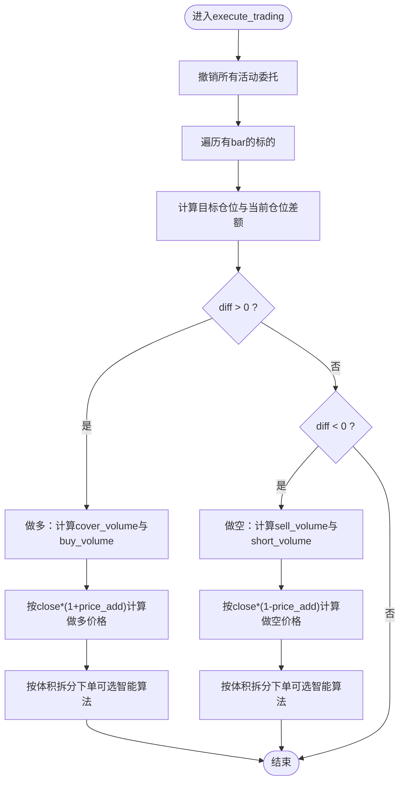
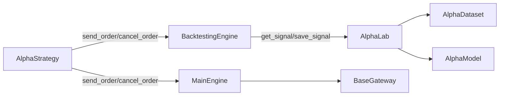

# 实盘集成

<cite>
**本文引用的文件**
- [vnpy/alpha/strategy/template.py](file://vnpy/alpha/strategy/template.py)
- [vnpy/alpha/strategy/backtesting.py](file://vnpy/alpha/strategy/backtesting.py)
- [vnpy/alpha/strategy/strategies/equity_demo_strategy.py](file://vnpy/alpha/strategy/strategies/equity_demo_strategy.py)
- [vnpy/alpha/lab.py](file://vnpy/alpha/lab.py)
- [vnpy/trader/engine.py](file://vnpy/trader/engine.py)
- [vnpy/trader/gateway.py](file://vnpy/trader/gateway.py)
- [vnpy/alpha/model/template.py](file://vnpy/alpha/model/template.py)
- [vnpy/alpha/dataset/template.py](file://vnpy/alpha/dataset/template.py)
- [docs/community/app/algo_trading.md](file://docs/community/app/algo_trading.md)
- [docs/elite/strategy/elite_algotrading.md](file://docs/elite/strategy/elite_algotrading.md)
</cite>

## 目录
1. [引言](#引言)
2. [项目结构](#项目结构)
3. [核心组件](#核心组件)
4. [架构总览](#架构总览)
5. [详细组件分析](#详细组件分析)
6. [依赖关系分析](#依赖关系分析)
7. [性能考量](#性能考量)
8. [故障排查指南](#故障排查指南)
9. [结论](#结论)
10. [附录](#附录)

## 引言
本文件系统化梳理从Alpha策略回测到实盘交易的集成路径，重点围绕AlphaStrategy在回测与实盘环境中的适配机制，对比BacktestingEngine与实盘交易引擎的接口差异，阐述策略参数、信号模型、仓位管理等核心组件的迁移方法，并解析execute_trading目标仓位执行算法在实盘环境中的优化策略（智能下单、冰山单拆分、市场冲击成本控制等）。同时提供实盘部署的完整检查清单，覆盖环境配置、资金管理、监控告警、应急处理等运维要点，确保策略平稳过渡到生产环境。

## 项目结构
本项目采用模块化组织，Alpha研究套件位于vnpy/alpha目录，包含数据处理、模型训练、信号生成与策略模板；vnpy/trader提供统一的交易引擎、网关与事件驱动框架，支撑实盘交易。

图示来源
- [vnpy/alpha/lab.py](file://vnpy/alpha/lab.py#L1-L120)
- [vnpy/alpha/dataset/template.py](file://vnpy/alpha/dataset/template.py#L1-L120)
- [vnpy/alpha/model/template.py](file://vnpy/alpha/model/template.py#L1-L31)
- [vnpy/alpha/strategy/template.py](file://vnpy/alpha/strategy/template.py#L1-L120)
- [vnpy/alpha/strategy/backtesting.py](file://vnpy/alpha/strategy/backtesting.py#L1-L120)
- [vnpy/alpha/strategy/strategies/equity_demo_strategy.py](file://vnpy/alpha/strategy/strategies/equity_demo_strategy.py#L1-L60)
- [vnpy/trader/engine.py](file://vnpy/trader/engine.py#L1-L120)
- [vnpy/trader/gateway.py](file://vnpy/trader/gateway.py#L1-L120)

章节来源
- [vnpy/alpha/lab.py](file://vnpy/alpha/lab.py#L1-L120)
- [vnpy/alpha/strategy/template.py](file://vnpy/alpha/strategy/template.py#L1-L120)
- [vnpy/trader/engine.py](file://vnpy/trader/engine.py#L1-L120)

## 核心组件
- AlphaStrategy模板：定义策略生命周期回调、订单/交易更新、目标仓位管理、execute_trading执行逻辑，以及资金与头寸查询接口。
- BacktestingEngine：提供回测环境下的信号注入、历史数据回放、委托撮合、资金流水与每日损益统计。
- AlphaLab：负责数据/模型/信号的本地持久化与加载，支持合约参数配置。
- 实盘交易引擎（MainEngine/OmsEngine）：统一事件驱动、订单管理、账户/持仓/合约/报价事件处理，对接具体网关。
- 网关（BaseGateway）：抽象不同交易系统的连接、订阅、下单、撤单、历史查询等能力。

章节来源
- [vnpy/alpha/strategy/template.py](file://vnpy/alpha/strategy/template.py#L1-L206)
- [vnpy/alpha/strategy/backtesting.py](file://vnpy/alpha/strategy/backtesting.py#L1-L200)
- [vnpy/alpha/lab.py](file://vnpy/alpha/lab.py#L349-L481)
- [vnpy/trader/engine.py](file://vnpy/trader/engine.py#L73-L213)
- [vnpy/trader/gateway.py](file://vnpy/trader/gateway.py#L33-L160)

## 架构总览
下图展示从Alpha信号到实盘执行的关键路径，以及回测与实盘在接口层面的差异。

图示来源
- [vnpy/alpha/strategy/backtesting.py](file://vnpy/alpha/strategy/backtesting.py#L710-L763)
- [vnpy/alpha/strategy/template.py](file://vnpy/alpha/strategy/template.py#L74-L120)
- [vnpy/trader/engine.py](file://vnpy/trader/engine.py#L233-L276)
- [vnpy/trader/gateway.py](file://vnpy/trader/gateway.py#L190-L247)

## 详细组件分析

### AlphaStrategy在回测与实盘的适配机制
- 生命周期与回调
  - 回测：通过BacktestingEngine驱动，策略在每个回放时间点接收bars并生成目标仓位，随后由execute_trading统一执行。
  - 实盘：策略通过MainEngine/OmsEngine与网关交互，下单/撤单由网关实现，策略仅负责目标设定与执行。
- 订单与交易更新
  - 回测：BacktestingEngine维护限价单队列，按K线撮合并推送Order/Trade事件。
  - 实盘：网关异步推送Order/Trade事件，OmsEngine集中管理并转发给策略。
- 资金与头寸
  - 回测：BacktestingEngine维护现金、手续费、每日损益；策略通过get_cash_available/get_holding_value间接查询。
  - 实盘：MainEngine/OmsEngine直接提供账户/持仓查询接口，策略直接调用。

章节来源
- [vnpy/alpha/strategy/template.py](file://vnpy/alpha/strategy/template.py#L43-L120)
- [vnpy/alpha/strategy/backtesting.py](file://vnpy/alpha/strategy/backtesting.py#L561-L798)
- [vnpy/trader/engine.py](file://vnpy/trader/engine.py#L339-L567)

### BacktestingEngine与实盘交易引擎的接口差异
- 信号注入
  - 回测：BacktestingEngine提供get_signal，从AlphaLab加载指定时刻的信号DataFrame。
  - 实盘：策略通过外部信号服务或本地模型推理获取信号，再调用set_target/execute_trading。
- 订单执行
  - 回测：BacktestingEngine的send_order/cancel_order返回虚拟vt_orderid，内部维护限价单集合并撮合。
  - 实盘：MainEngine.send_order经由具体网关下发，返回真实vt_orderid；取消由MainEngine.cancel_order完成。
- 事件流
  - 回测：BacktestingEngine内部事件模拟，策略直接收到Order/Trade更新。
  - 实盘：网关推送真实事件，OmsEngine注册并转发至策略。

章节来源
- [vnpy/alpha/strategy/backtesting.py](file://vnpy/alpha/strategy/backtesting.py#L710-L763)
- [vnpy/trader/engine.py](file://vnpy/trader/engine.py#L233-L276)
- [vnpy/trader/gateway.py](file://vnpy/trader/gateway.py#L93-L159)

### 策略参数、信号模型、仓位管理的迁移方法
- 策略参数
  - 回测：通过BacktestingEngine.set_parameters传入vt_symbols、interval、起止时间、资金、年化日数等。
  - 实盘：通过配置文件或运行参数注入，策略内部以属性形式使用（如cash_ratio、min_volume、price_add等）。
- 信号模型
  - 回测：AlphaLab.save_signal/AlphaLab.load_signal持久化信号，BacktestingEngine按时间点注入。
  - 实盘：AlphaLab.save_model/AlphaLab.load_model加载训练好的模型，策略在on_bars中调用模型predict生成信号，或通过外部服务推送信号。
- 仓位管理
  - 回测：策略set_target后，execute_trading统一撤销未成交单并按目标与当前头寸差额下单。
  - 实盘：策略同样set_target/execute_trading，但下单由网关执行，需考虑滑点、冲击成本与风控。

章节来源
- [vnpy/alpha/strategy/backtesting.py](file://vnpy/alpha/strategy/backtesting.py#L70-L120)
- [vnpy/alpha/lab.py](file://vnpy/alpha/lab.py#L421-L481)
- [vnpy/alpha/strategy/strategies/equity_demo_strategy.py](file://vnpy/alpha/strategy/strategies/equity_demo_strategy.py#L12-L102)

### execute_trading目标仓位执行算法在实盘优化
- 基础逻辑
  - 回测：execute_trading先cancel_all，再根据target与pos差额生成buy/sell/cover/short指令，按price_add调整委托价格。
  - 实盘：execute_trading仍作为统一入口，但需结合智能下单算法优化。
- 智能下单与拆分
  - 冰山单：将大单拆分为多个小单，降低市场冲击，参考文档中的Iceberg算法描述。
  - 最优限价/狙击手：根据Tick最优价快速成交，减少等待时间。
  - 条件委托：达到阈值即触发委托，提高成交效率。
- 市场冲击成本控制
  - 通过合理拆分、延迟下单、限制单笔占量比例等方式降低冲击成本。
  - 结合滑点模型与手续费率，动态调整price_add与下单量。

图示来源
- [vnpy/alpha/strategy/template.py](file://vnpy/alpha/strategy/template.py#L133-L186)
- [docs/community/app/algo_trading.md](file://docs/community/app/algo_trading.md#L133-L172)
- [docs/elite/strategy/elite_algotrading.md](file://docs/elite/strategy/elite_algotrading.md#L122-L150)

章节来源
- [vnpy/alpha/strategy/template.py](file://vnpy/alpha/strategy/template.py#L133-L186)
- [docs/community/app/algo_trading.md](file://docs/community/app/algo_trading.md#L133-L172)
- [docs/elite/strategy/elite_algotrading.md](file://docs/elite/strategy/elite_algotrading.md#L122-L150)

### 示例策略：EquityDemoStrategy
- 信号来源：get_signal返回排序后的信号，筛选Top-K与成分股约束。
- 调仓逻辑：先卖出不符合条件或持有期不足的标的，再按可用资金与cash_ratio分配买入额度，最终调用execute_trading执行。
- 参数要点：cash_ratio、min_volume、price_add、min_days等直接影响资金利用率与执行成本。

章节来源
- [vnpy/alpha/strategy/strategies/equity_demo_strategy.py](file://vnpy/alpha/strategy/strategies/equity_demo_strategy.py#L12-L102)

## 依赖关系分析
- AlphaStrategy依赖BacktestingEngine或MainEngine提供的订单/资金接口。
- BacktestingEngine依赖AlphaLab的数据/模型/信号加载。
- MainEngine依赖BaseGateway实现具体交易系统对接。
- AlphaLab依赖数据集与模型模板，提供序列化/反序列化能力。

图示来源
- [vnpy/alpha/strategy/template.py](file://vnpy/alpha/strategy/template.py#L74-L120)
- [vnpy/alpha/strategy/backtesting.py](file://vnpy/alpha/strategy/backtesting.py#L710-L763)
- [vnpy/alpha/lab.py](file://vnpy/alpha/lab.py#L349-L481)
- [vnpy/alpha/dataset/template.py](file://vnpy/alpha/dataset/template.py#L1-L120)
- [vnpy/alpha/model/template.py](file://vnpy/alpha/model/template.py#L1-L31)
- [vnpy/trader/engine.py](file://vnpy/trader/engine.py#L73-L120)
- [vnpy/trader/gateway.py](file://vnpy/trader/gateway.py#L33-L120)

章节来源
- [vnpy/alpha/strategy/template.py](file://vnpy/alpha/strategy/template.py#L74-L120)
- [vnpy/alpha/strategy/backtesting.py](file://vnpy/alpha/strategy/backtesting.py#L710-L763)
- [vnpy/alpha/lab.py](file://vnpy/alpha/lab.py#L349-L481)
- [vnpy/trader/engine.py](file://vnpy/trader/engine.py#L73-L120)
- [vnpy/trader/gateway.py](file://vnpy/trader/gateway.py#L33-L120)

## 性能考量
- 回测阶段
  - 使用Polars进行向量化数据处理，避免Python循环；合理切分训练/验证/测试周期，减少内存峰值。
  - 并行计算特征表达式，利用多进程加速因子生成。
- 实盘阶段
  - execute_trading应尽量减少订单数量与撤改频率，结合智能算法降低冲击成本。
  - 对高频信号场景，建议引入限流与风控阈值，避免过度交易。

章节来源
- [vnpy/alpha/dataset/template.py](file://vnpy/alpha/dataset/template.py#L100-L171)
- [vnpy/alpha/strategy/template.py](file://vnpy/alpha/strategy/template.py#L133-L186)

## 故障排查指南
- 回测无信号
  - 检查AlphaLab.save_signal/AlphaLab.load_signal是否正确写入/读取；确认时间维度匹配。
- 订单未成交
  - 回测：检查pricetick、涨跌停限制与price_add是否导致价格越界。
  - 实盘：核对网关连接状态、账户权限与下单参数。
- 资金/头寸异常
  - 回测：确认手续费率、size与cash更新逻辑。
  - 实盘：通过OmsEngine.get_account/get_positions核对账户与持仓。
- 事件未到达
  - 检查MainEngine/OmsEngine事件注册与转发链路，确保网关回调正确触发。

章节来源
- [vnpy/alpha/strategy/backtesting.py](file://vnpy/alpha/strategy/backtesting.py#L619-L709)
- [vnpy/trader/engine.py](file://vnpy/trader/engine.py#L339-L567)
- [vnpy/trader/gateway.py](file://vnpy/trader/gateway.py#L93-L159)

## 结论
AlphaStrategy在回测与实盘之间具备良好的适配性：通过统一的策略模板与execute_trading执行器，策略逻辑可在两种环境下复用。回测侧由BacktestingEngine提供完备的资金、手续费与撮合仿真，实盘侧由MainEngine/OmsEngine与BaseGateway提供真实的订单与事件通道。通过信号服务化、模型序列化、风险控制规则同步与智能下单优化，可显著提升从回测到实盘的迁移质量与执行效率。

## 附录

### 实盘部署检查清单
- 环境配置
  - 确认Python版本与依赖安装（Polars、NumPy、LightGBM等）。
  - 配置AlphaLab数据目录与合约参数文件。
- 资金管理
  - 设置初始资金、年化日数、无风险利率等回测参数（用于统计口径一致）。
  - 实盘账户权限校验与可用资金查询接口可用。
- 监控告警
  - 邮件引擎配置，确保异常与重要事件通知。
  - 订单/成交事件监控，建立日志与报警阈值。
- 应急处理
  - 网关断连自动重连机制与手动切换预案。
  - 执行失败/滑点超限的熔断与人工干预流程。
- 运行验证
  - 小规模实盘试跑，核对execute_trading拆单与成交成本。
  - 对比回测与实盘关键指标（收益、波动、最大回撤、换手率）。

[本节为通用运维建议，不直接分析具体文件]