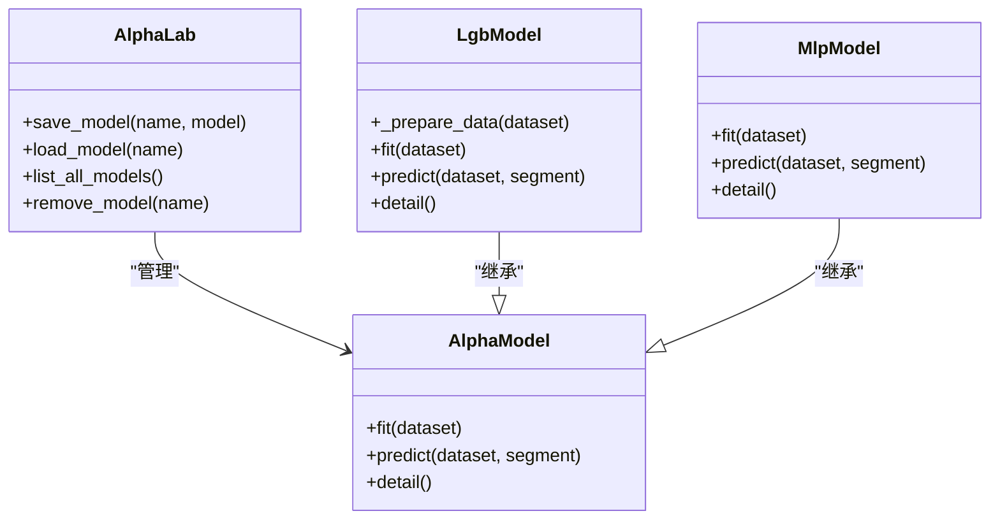
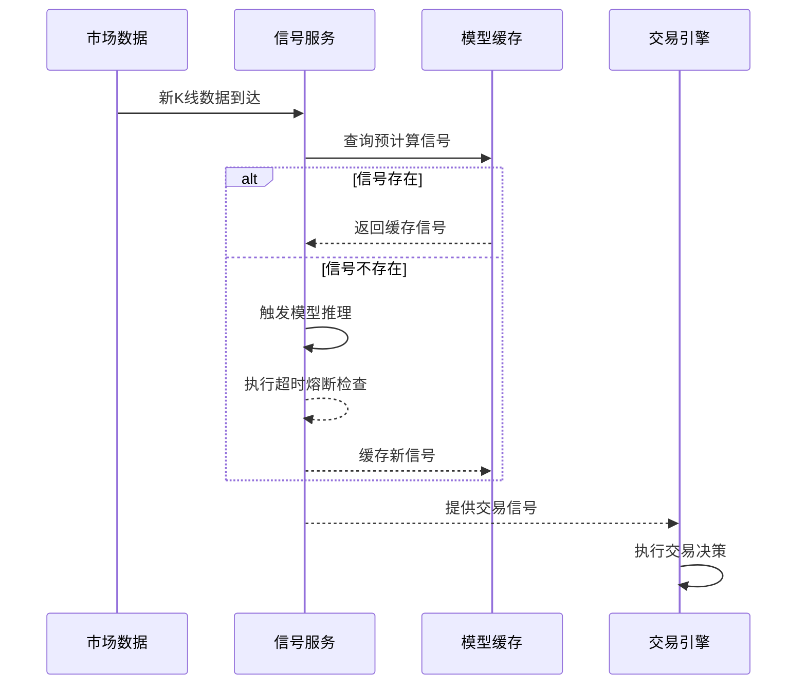
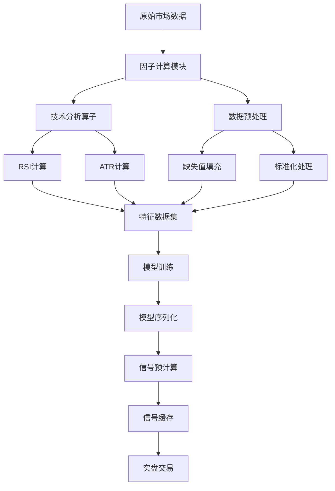
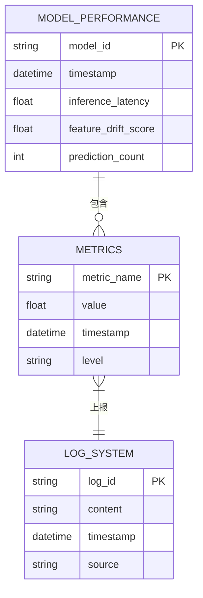
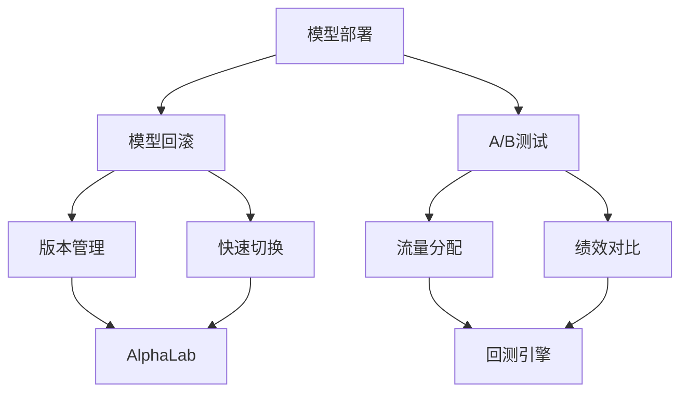

# 模型部署

<cite>
**本文档引用的文件**   
- [lab.py](file://vnpy/alpha/lab.py)
- [template.py](file://vnpy/alpha/model/template.py)
- [lgb_model.py](file://vnpy/alpha/model/models/lgb_model.py)
- [mlp_model.py](file://vnpy/alpha/model/models/mlp_model.py)
- [ta_function.py](file://vnpy/alpha/dataset/ta_function.py)
- [processor.py](file://vnpy/alpha/dataset/processor.py)
- [template.py](file://vnpy/alpha/dataset/template.py)
- [utility.py](file://vnpy/alpha/dataset/utility.py)
- [backtesting.py](file://vnpy/alpha/strategy/backtesting.py)
- [template.py](file://vnpy/alpha/strategy/template.py)
</cite>

## 目录
1. [引言](#引言)
2. [模型序列化与版本管理](#模型序列化与版本管理)
3. [信号生成服务化改造](#信号生成服务化改造)
4. [因子计算与模型推理解耦](#因子计算与模型推理解耦)
5. [模型性能监控](#模型性能监控)
6. [高级部署策略](#高级部署策略)
7. [结论](#结论)

## 引言
本文档详细阐述了AI量化模型从研究环境到生产环境的完整部署流程。重点介绍如何将Jupyter Notebook中训练好的机器学习模型（如LGBM、MLP）通过序列化实现持久化存储，并利用AlphaLab进行模型版本管理与热更新。文档深入解析了get_signal()方法在实盘环境中的服务化改造，包括模型预测请求的异步处理、缓存机制、超时熔断等可靠性设计。同时，展示了如何将因子计算逻辑与模型推理过程解耦以确保低延迟信号生成，并提供了模型性能监控指标的采集方案。

## 模型序列化与版本管理

AI量化模型的部署始于研究环境中的模型训练。在Jupyter Notebook等研究环境中完成模型训练后，需要将模型序列化为可加载的格式以便在生产环境中使用。vnpy框架通过AlphaLab组件实现了模型的版本管理与热更新功能。

AlphaLab作为Alpha研究实验室的核心组件，提供了完整的模型生命周期管理功能。通过`save_model()`和`load_model()`方法，可以将训练好的模型以pickle格式序列化存储到指定路径，并在需要时重新加载。这种机制支持多种机器学习模型，包括LGBM、MLP等。

模型版本管理通过文件系统实现，每个模型保存为独立的.pkl文件，文件名即为模型标识。这种设计便于实现模型的版本控制和快速切换。热更新功能通过动态加载最新版本的模型文件实现，无需重启整个交易系统即可完成模型更新。

**图表来源**
- [lab.py](file://vnpy/alpha/lab.py#L421-L452)
- [template.py](file://vnpy/alpha/model/template.py#L9-L31)
- [lgb_model.py](file://vnpy/alpha/model/models/lgb_model.py#L12-L147)
- [mlp_model.py](file://vnpy/alpha/model/models/mlp_model.py#L22-L409)

**本节来源**
- [lab.py](file://vnpy/alpha/lab.py#L421-L452)
- [template.py](file://vnpy/alpha/model/template.py#L9-L31)

## 信号生成服务化改造

在实盘交易环境中，信号生成需要具备高可靠性和低延迟特性。get_signal()方法的实现体现了这一设计理念，通过异步处理、缓存机制和超时熔断等技术确保系统的稳定性。

信号生成服务化改造的核心是将模型预测过程与交易决策过程分离。get_signal()方法从预计算的信号数据集中获取当前时间点的预测信号，而不是实时进行模型推理。这种设计显著降低了信号生成的延迟，满足了实盘交易对响应速度的要求。

异步处理机制通过事件驱动架构实现，当新的市场数据到达时，系统会触发信号更新流程。缓存机制则确保了高频访问下的性能表现，常用的信号数据被缓存在内存中，避免重复的磁盘I/O操作。超时熔断设计防止了因模型推理异常导致的系统阻塞，当预测请求超过预定时间未完成时，系统会返回默认值或上一周期的信号，保证交易策略的连续性。

**图表来源**
- [backtesting.py](file://vnpy/alpha/strategy/backtesting.py#L709-L721)
- [lab.py](file://vnpy/alpha/lab.py#L453-L477)

**本节来源**
- [backtesting.py](file://vnpy/alpha/strategy/backtesting.py#L709-L721)

## 因子计算与模型推理解耦

为了确保低延迟信号生成，系统将因子计算逻辑与模型推理过程进行了彻底解耦。这种架构设计使得复杂的因子计算可以在非实时环境中完成，而实盘环境只需进行轻量级的信号查询操作。

因子计算主要通过ta_function.py和processor.py等模块实现。ta_function.py提供了技术分析算子，如RSI、ATR等指标的计算；processor.py则负责数据预处理，包括缺失值处理、标准化等操作。这些计算密集型任务在研究环境中预先完成，并将结果持久化存储。

模型推理过程被简化为对预计算特征的线性组合或非线性变换。通过AlphaDataset组件，系统可以高效地组织和管理特征数据。这种解耦设计不仅降低了实盘环境的计算压力，还提高了系统的可维护性，使得因子逻辑的修改不会影响到核心交易引擎。

**图表来源**
- [ta_function.py](file://vnpy/alpha/dataset/ta_function.py#L23-L43)
- [processor.py](file://vnpy/alpha/dataset/processor.py#L9-L109)
- [template.py](file://vnpy/alpha/dataset/template.py#L23-L304)

**本节来源**
- [ta_function.py](file://vnpy/alpha/dataset/ta_function.py#L23-L43)
- [processor.py](file://vnpy/alpha/dataset/processor.py#L9-L109)

## 模型性能监控

模型性能监控是确保量化策略稳定运行的关键环节。系统通过多维度指标采集和日志集成，实现了对模型表现的全面监控。

核心监控指标包括推理耗时和特征分布偏移。推理耗时监控记录每次模型预测的执行时间，帮助识别性能瓶颈。特征分布偏移监控则通过统计方法检测输入特征的分布变化，当偏移超过阈值时发出预警，提示可能需要重新训练模型。

这些监控指标被集成到系统的日志体系中，通过统一的日志接口输出。AlphaLab组件提供了详细的模型信息输出功能，包括特征重要性分析、模型参数统计等。对于LGBM模型，可以生成基于'split'和'gain'指标的特征重要性图；对于MLP模型，则可以计算和显示各特征的相对重要性。

**图表来源**
- [lgb_model.py](file://vnpy/alpha/model/models/lgb_model.py#L149-L171)
- [mlp_model.py](file://vnpy/alpha/model/models/mlp_model.py#L428-L490)
- [logger.py](file://vnpy/alpha/logger.py#L1-L13)

**本节来源**
- [lgb_model.py](file://vnpy/alpha/model/models/lgb_model.py#L149-L171)
- [mlp_model.py](file://vnpy/alpha/model/models/mlp_model.py#L428-L490)

## 高级部署策略

系统支持多种高级部署策略，包括模型回滚和A/B测试，为量化策略的迭代优化提供了有力支持。

模型回滚功能通过版本管理实现。当新部署的模型表现不佳时，可以快速切换回之前的稳定版本。AlphaLab的模型管理接口支持按名称加载特定版本的模型，整个回滚过程可以在秒级完成，最大限度地减少对交易的影响。

A/B测试策略允许同时运行多个模型版本，通过对比它们的实际表现来评估优劣。系统可以将交易资金按比例分配给不同的模型版本，收集各自的绩效数据。backtesting.py中的回测引擎提供了完善的绩效分析功能，包括收益率、最大回撤、夏普比率等关键指标的计算，为决策提供数据支持。

这些高级策略的实现依赖于清晰的模块化设计和松耦合的架构。模型、数据、策略等组件相互独立，可以灵活组合和替换，为量化研究提供了极大的便利。

**图表来源**
- [lab.py](file://vnpy/alpha/lab.py#L421-L452)
- [backtesting.py](file://vnpy/alpha/strategy/backtesting.py#L170-L402)

**本节来源**
- [lab.py](file://vnpy/alpha/lab.py#L421-L452)
- [backtesting.py](file://vnpy/alpha/strategy/backtesting.py#L170-L402)

## 结论
本文档详细介绍了AI量化模型从研究到生产的完整部署流程。通过AlphaLab实现的模型版本管理和热更新机制，结合信号生成的服务化改造和因子计算的解耦设计，构建了一个高效、可靠的量化交易系统。系统不仅支持LGBM、MLP等多种机器学习模型，还提供了全面的性能监控和高级部署策略，为量化策略的持续优化和稳定运行奠定了坚实基础。