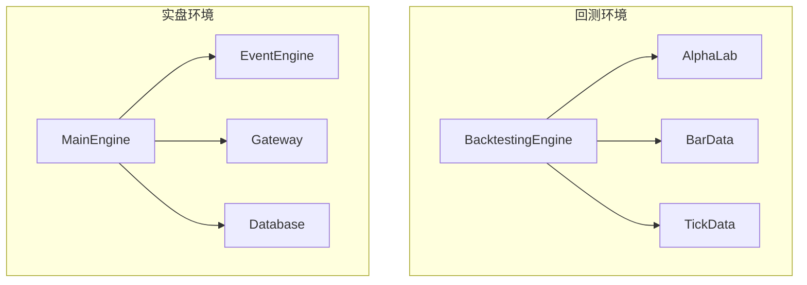
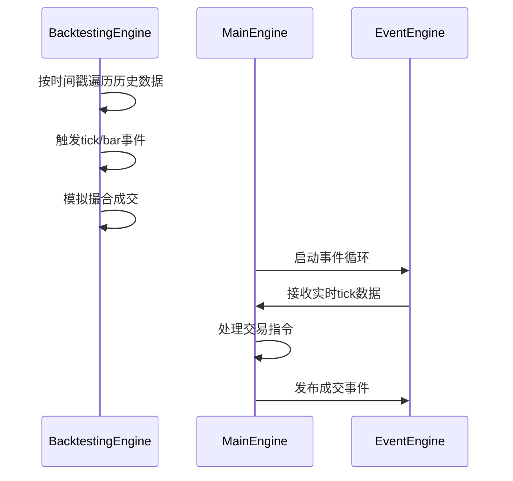
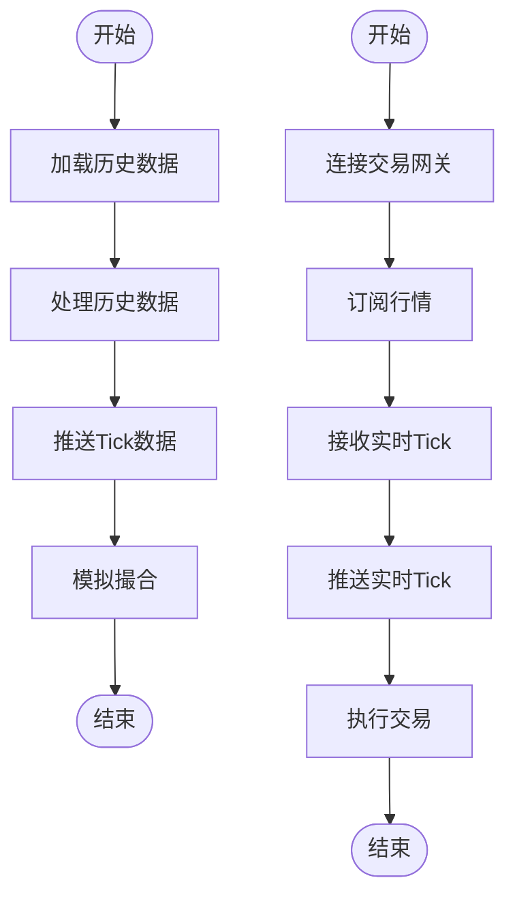
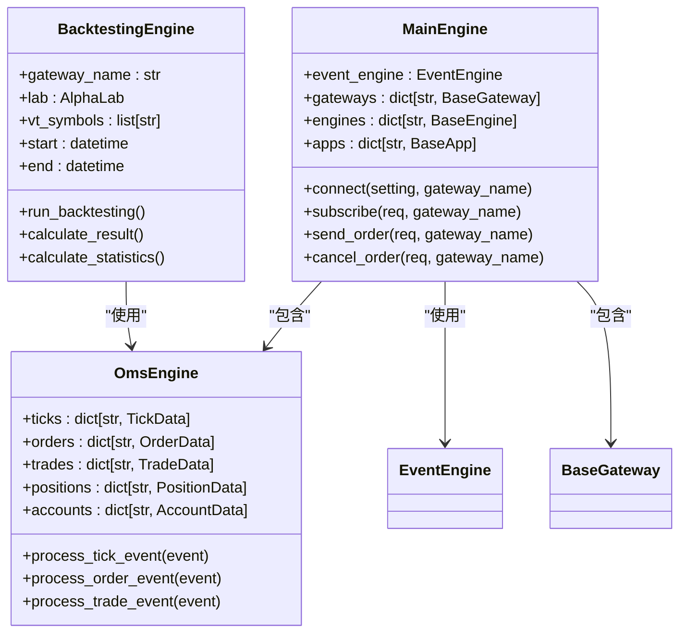
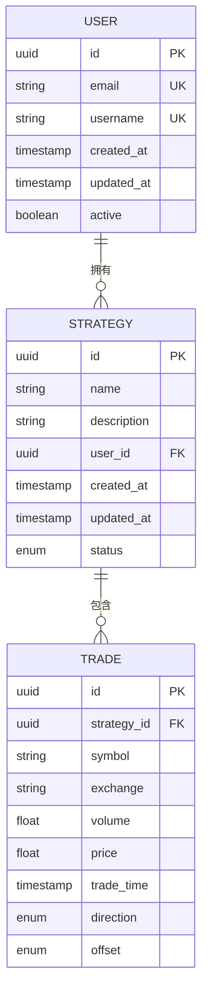
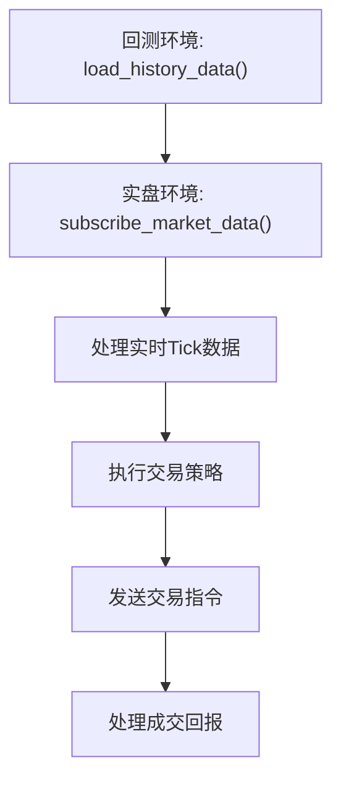

# 环境迁移

<cite>
**本文档引用的文件**   
- [engine.py](file://vnpy/trader/engine.py)
- [gateway.py](file://vnpy/trader/gateway.py)
- [database.py](file://vnpy/trader/database.py)
- [event.py](file://vnpy/event/engine.py)
- [object.py](file://vnpy/trader/object.py)
- [setting.py](file://vnpy/trader/setting.py)
- [backtesting.py](file://vnpy/alpha/strategy/backtesting.py)
- [converter.py](file://vnpy/trader/converter.py)
- [utility.py](file://vnpy/trader/utility.py)
- [datafeed.py](file://vnpy/trader/datafeed.py)
</cite>

## 目录
1. [引言](#引言)
2. [核心引擎架构对比](#核心引擎架构对比)
3. [事件循环机制差异](#事件循环机制差异)
4. [数据推送与订阅机制](#数据推送与订阅机制)
5. [订单匹配与成交逻辑](#订单匹配与成交逻辑)
6. [配置文件迁移策略](#配置文件迁移策略)
7. [运维最佳实践](#运维最佳实践)
8. [代码迁移示例](#代码迁移示例)
9. [常见迁移问题与解决方案](#常见迁移问题与解决方案)
10. [结论](#结论)

## 引言
本文档系统化地阐述了从回测环境到实盘环境的迁移过程，重点分析了BacktestingEngine与实盘MainEngine在事件循环、数据推送、订单匹配机制上的核心差异。文档详细对比了模拟撮合与交易所真实成交的逻辑区别，提供了配置文件迁移策略，包括数据库连接、交易接口配置和系统参数的适配方法。同时，文档还涵盖了环境变量管理、时区处理、日志级别调整等运维细节的最佳实践，并通过代码示例展示了如何将回测中使用的历史数据加载逻辑替换为实时行情订阅机制，确保时间序列数据的一致性。

## 核心引擎架构对比
vn.py框架中的回测环境和实盘环境分别由BacktestingEngine和MainEngine驱动，两者在架构设计上存在显著差异。BacktestingEngine专为回测场景设计，采用事件驱动的模拟撮合机制，而MainEngine作为实盘交易的核心，负责与真实交易所进行交互。

**图表来源**
- [backtesting.py](file://vnpy/alpha/strategy/backtesting.py)
- [engine.py](file://vnpy/trader/engine.py)

**本节来源**
- [backtesting.py](file://vnpy/alpha/strategy/backtesting.py)
- [engine.py](file://vnpy/trader/engine.py)

## 事件循环机制差异
回测环境和实盘环境在事件循环机制上存在根本性差异。BacktestingEngine采用基于时间戳的事件驱动模型，通过遍历历史数据来模拟市场行为，而MainEngine则依赖于EventEngine实现真正的异步事件处理。

**图表来源**
- [backtesting.py](file://vnpy/alpha/strategy/backtesting.py)
- [engine.py](file://vnpy/trader/engine.py)
- [event.py](file://vnpy/event/engine.py)

**本节来源**
- [backtesting.py](file://vnpy/alpha/strategy/backtesting.py)
- [engine.py](file://vnpy/trader/engine.py)
- [event.py](file://vnpy/event/engine.py)

## 数据推送与订阅机制
在数据推送与订阅机制方面，回测环境和实盘环境采用了完全不同的实现方式。BacktestingEngine通过预加载历史数据来模拟市场行情，而MainEngine则通过Gateway与交易所建立实时连接，动态订阅行情数据。

**图表来源**
- [backtesting.py](file://vnpy/alpha/strategy/backtesting.py)
- [gateway.py](file://vnpy/trader/gateway.py)

**本节来源**
- [backtesting.py](file://vnpy/alpha/strategy/backtesting.py)
- [gateway.py](file://vnpy/trader/gateway.py)

## 订单匹配与成交逻辑
订单匹配与成交逻辑是回测环境和实盘环境最核心的差异之一。BacktestingEngine采用确定性的模拟撮合算法，而MainEngine则依赖于交易所的真实撮合引擎。

**图表来源**
- [backtesting.py](file://vnpy/alpha/strategy/backtesting.py)
- [engine.py](file://vnpy/trader/engine.py)
- [object.py](file://vnpy/trader/object.py)

**本节来源**
- [backtesting.py](file://vnpy/alpha/strategy/backtesting.py)
- [engine.py](file://vnpy/trader/engine.py)
- [object.py](file://vnpy/trader/object.py)

## 配置文件迁移策略
从回测环境迁移到实盘环境时，配置文件的适配是关键步骤。需要重点关注数据库连接、交易接口配置和系统参数的调整。

### 数据库连接配置
数据库连接配置需要从回测环境的SQLite数据库迁移到实盘环境的生产级数据库。

**图表来源**
- [database.py](file://vnpy/trader/database.py)
- [setting.py](file://vnpy/trader/setting.py)

### 交易接口配置
交易接口配置需要根据实际使用的交易所进行调整，包括API密钥、服务器地址等敏感信息。

**本节来源**
- [gateway.py](file://vnpy/trader/gateway.py)
- [setting.py](file://vnpy/trader/setting.py)

### 系统参数适配
系统参数的适配需要考虑实盘环境的特殊要求，如日志级别、时区设置等。

**本节来源**
- [setting.py](file://vnpy/trader/setting.py)

## 运维最佳实践
在从回测环境迁移到实盘环境时，运维最佳实践对于确保系统稳定运行至关重要。

### 环境变量管理
合理管理环境变量可以提高系统的安全性和可维护性。

**本节来源**
- [setting.py](file://vnpy/trader/setting.py)

### 时区处理
正确的时区处理对于金融交易系统至关重要，需要确保所有时间戳都使用统一的时区标准。

**本节来源**
- [utility.py](file://vnpy/trader/utility.py)
- [setting.py](file://vnpy/trader/setting.py)

### 日志级别调整
根据运行环境调整日志级别，可以在调试和生产环境之间取得平衡。

**本节来源**
- [setting.py](file://vnpy/trader/setting.py)
- [engine.py](file://vnpy/trader/engine.py)

## 代码迁移示例
以下代码示例展示了如何将回测中使用的历史数据加载逻辑替换为实时行情订阅机制。

**图表来源**
- [backtesting.py](file://vnpy/alpha/strategy/backtesting.py)
- [gateway.py](file://vnpy/trader/gateway.py)

**本节来源**
- [backtesting.py](file://vnpy/alpha/strategy/backtesting.py)
- [gateway.py](file://vnpy/trader/gateway.py)

## 常见迁移问题与解决方案
在从回测环境迁移到实盘环境时，可能会遇到一些常见问题，需要提前做好准备。

### 浮点精度差异
由于浮点数计算的精度差异，可能导致回测结果与实盘交易结果不一致。

**本节来源**
- [utility.py](file://vnpy/trader/utility.py)

### 网络延迟影响
实盘环境中的网络延迟可能影响交易指令的执行速度和成交价格。

**本节来源**
- [gateway.py](file://vnpy/trader/gateway.py)

### 心跳保活机制
需要实现心跳保活机制，确保与交易所的连接始终保持活跃状态。

**本节来源**
- [gateway.py](file://vnpy/trader/gateway.py)

## 结论
从回测环境到实盘环境的迁移是一个复杂的过程，需要全面考虑架构设计、事件循环、数据推送、订单匹配等多个方面的差异。通过合理的配置文件迁移策略和运维最佳实践，可以有效降低迁移风险，确保系统在实盘环境中的稳定运行。同时，需要注意回测结果与实盘交易之间的差异，避免过度拟合，提高策略的鲁棒性。