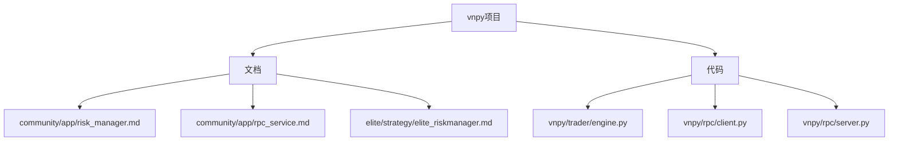
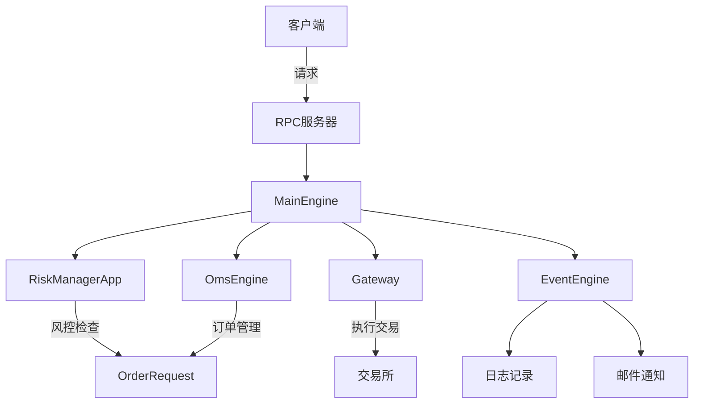
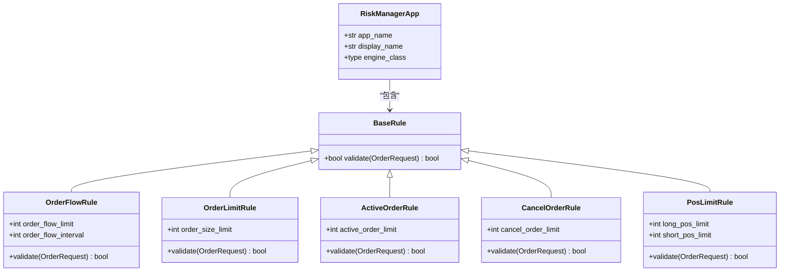
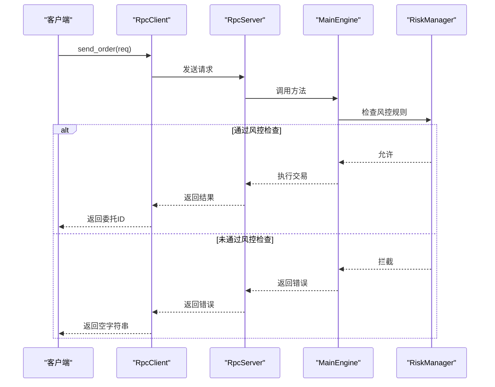
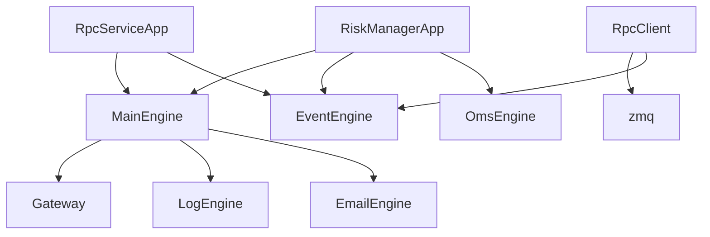

# 风控集成

<cite>
**本文档引用文件**  
- [risk_manager.md](file://docs/community/app/risk_manager.md)
- [rpc_service.md](file://docs/community/app/rpc_service.md)
- [elite_riskmanager.md](file://docs/elite/strategy/elite_riskmanager.md)
- [engine.py](file://vnpy/trader/engine.py)
- [client.py](file://vnpy/rpc/client.py)
- [server.py](file://vnpy/rpc/server.py)
</cite>

## 目录
1. [引言](#引言)
2. [项目结构](#项目结构)
3. [核心组件](#核心组件)
4. [架构概述](#架构概述)
5. [详细组件分析](#详细组件分析)
6. [依赖分析](#依赖分析)
7. [性能考虑](#性能考虑)
8. [故障排除指南](#故障排除指南)
9. [结论](#结论)

## 引言
本文档全面阐述了vn.py框架中风险控制体系的集成方案。基于风险控制模块的实现，详细说明了如何配置和启用各类风控规则，包括单账户资金上限、单合约持仓限额、单笔委托数量控制、频率限制等。文档深入探讨了风控模块与交易核心（MainEngine）的交互机制，以及在订单执行前的拦截流程。结合RPC服务文档，说明了如何构建分布式风控架构，实现多客户端共享统一风控策略。同时提供了风控规则动态调整、紧急熔断、事后审计等高级功能的配置示例，并通过真实场景案例展示风控系统的实际价值。

## 项目结构
vn.py项目采用模块化设计，其风险控制功能主要分布在文档和代码两个层面。文档部分提供了用户操作指南，而代码部分实现了核心功能逻辑。

**图示来源**
- [risk_manager.md](file://docs/community/app/risk_manager.md)
- [rpc_service.md](file://docs/community/app/rpc_service.md)
- [engine.py](file://vnpy/trader/engine.py)

**本节来源**
- [risk_manager.md](file://docs/community/app/risk_manager.md)
- [rpc_service.md](file://docs/community/app/rpc_service.md)

## 核心组件
风险控制体系的核心组件包括风险控制管理模块（RiskManagerApp）和RPC服务模块（RpcServiceApp）。RiskManagerApp作为事前风控管理模块，负责在委托通过交易API接口发出前，检查其状态是否符合各种风控规则。该模块支持通过UI界面或配置文件进行参数设置，可便捷地完成启动、修改和停止风控等任务。RpcServiceApp则将VeighNa Trader进程转化为RPC服务器，对外提供交易路由、行情数据推送、持仓资金查询等功能，为构建分布式风控架构提供了基础。

**本节来源**
- [risk_manager.md](file://docs/community/app/risk_manager.md)
- [rpc_service.md](file://docs/community/app/rpc_service.md)
- [elite_riskmanager.md](file://docs/elite/strategy/elite_riskmanager.md)

## 架构概述
vn.py的风险控制体系采用事件驱动架构，通过MainEngine作为交易平台的核心，协调各个功能模块的运行。风险控制模块作为独立的应用（App）被加载到MainEngine中，通过事件引擎（EventEngine）与其他模块进行通信。

**图示来源**
- [engine.py](file://vnpy/trader/engine.py)
- [client.py](file://vnpy/rpc/client.py)
- [server.py](file://vnpy/rpc/server.py)

## 详细组件分析

### 风控模块分析
RiskManagerApp是实现事前风控的核心组件，它通过拦截委托请求并在发送到交易接口前进行规则检查来实现风险控制。该模块支持多种风控规则，包括委托流控、下单数量限制、活动委托限制等。

#### 风控规则类图

**图示来源**
- [risk_manager.md](file://docs/community/app/risk_manager.md)
- [elite_riskmanager.md](file://docs/elite/strategy/elite_riskmanager.md)

### RPC服务分析
RPC服务模块实现了分布式架构的关键功能，允许将一个进程作为服务端，为多个客户端提供统一的行情和交易通道。

#### RPC服务序列图

**图示来源**
- [client.py](file://vnpy/rpc/client.py)
- [server.py](file://vnpy/rpc/server.py)
- [engine.py](file://vnpy/trader/engine.py)

## 依赖分析
风险控制体系的实现依赖于多个核心模块的协同工作。MainEngine作为核心引擎，管理着所有功能模块的生命周期和交互。EventEngine提供事件驱动机制，实现模块间的松耦合通信。OmsEngine负责订单管理系统的功能，为风控模块提供必要的订单状态信息。RPC模块则为分布式部署提供了网络通信基础。

**图示来源**
- [engine.py](file://vnpy/trader/engine.py)
- [client.py](file://vnpy/rpc/client.py)
- [server.py](file://vnpy/rpc/server.py)

**本节来源**
- [engine.py](file://vnpy/trader/engine.py)
- [client.py](file://vnpy/rpc/client.py)
- [server.py](file://vnpy/rpc/server.py)

## 性能考虑
在实盘交易环境中，风控检查的性能至关重要。为最小化风控检查对交易延迟的影响，建议采取以下优化措施：首先，合理配置风控规则的检查频率和粒度，避免过于频繁的检查造成性能瓶颈。其次，在分布式架构中，将风控模块部署在服务端，可以实现多客户端共享统一的风控策略，减少重复检查。最后，利用RPC服务的异步通信特性，将部分非关键的风控检查异步化处理，以提高交易请求的响应速度。

## 故障排除指南
在使用风险控制体系时，可能会遇到一些常见问题。例如，风控规则配置后未生效，可能是由于未正确保存配置或风控模块未启动。分布式架构下客户端无法连接服务端，需要检查网络配置和防火墙设置。在高并发场景下出现交易延迟，应检查风控规则的复杂度和检查频率，必要时进行性能优化。

**本节来源**
- [risk_manager.md](file://docs/community/app/risk_manager.md)
- [rpc_service.md](file://docs/community/app/rpc_service.md)

## 结论
vn.py的风险控制体系提供了一套完整的解决方案，从单机到分布式架构，从基础规则到高级功能，满足了不同层次的风控需求。通过合理配置和使用这些功能，可以有效防范交易风险，保障资金安全。未来，随着业务需求的不断演进，风控体系也将持续完善，为量化交易提供更加坚实的安全保障。