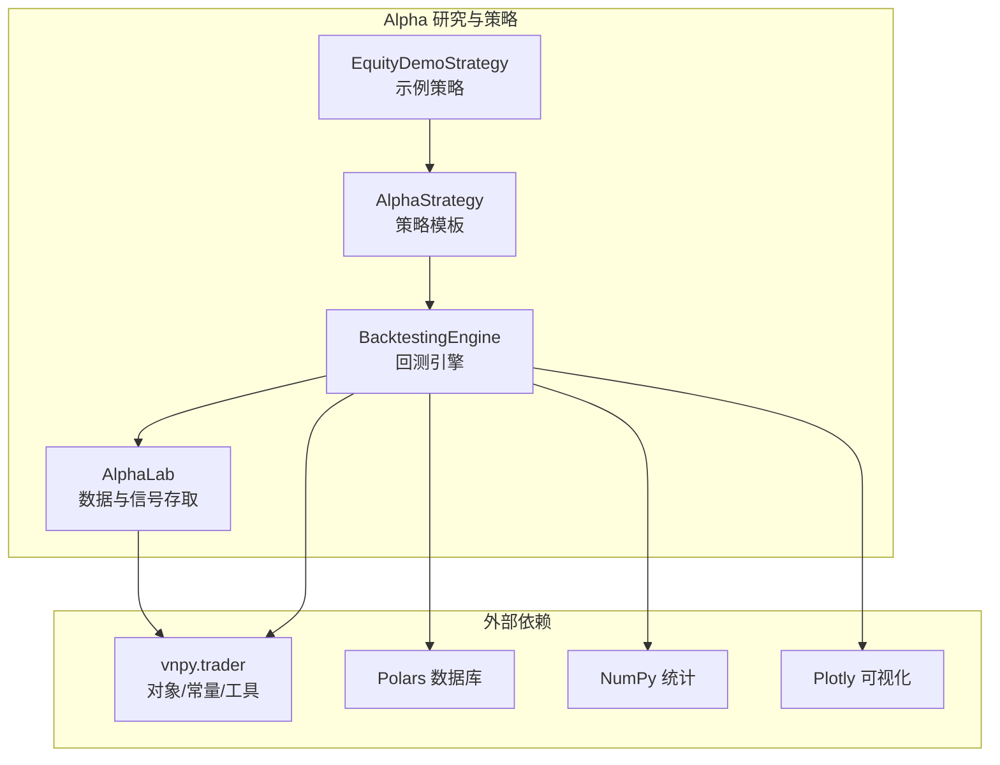
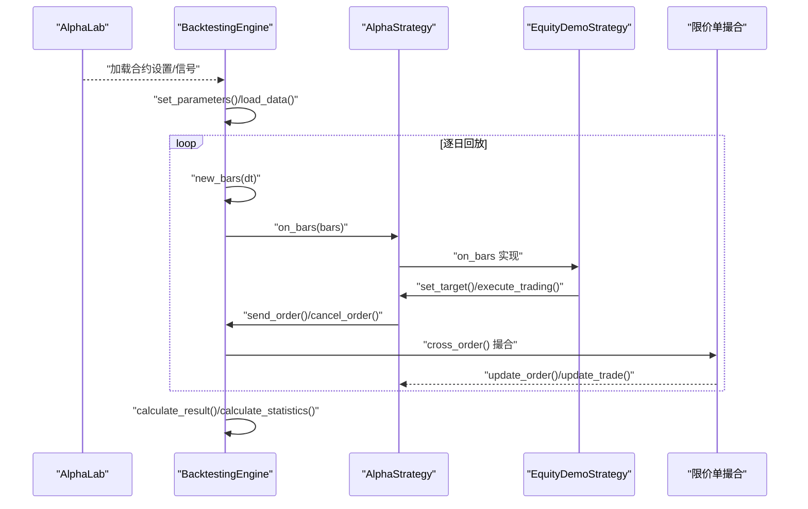
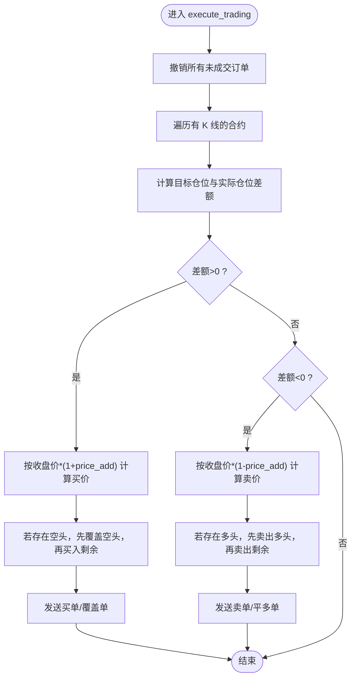
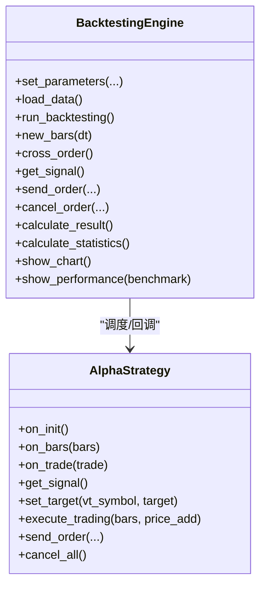
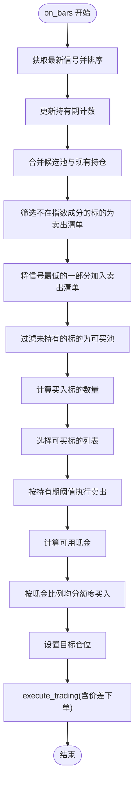
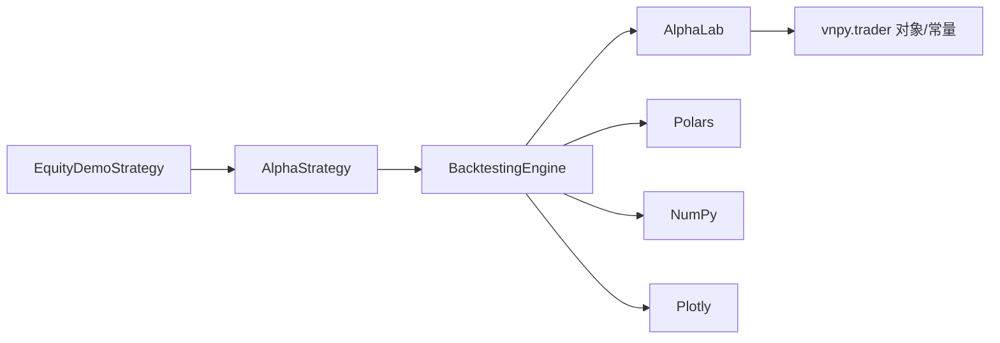

# 策略开发

<cite>
**本文引用的文件列表**
- [vnpy/alpha/strategy/template.py](file://vnpy/alpha/strategy/template.py)
- [vnpy/alpha/strategy/backtesting.py](file://vnpy/alpha/strategy/backtesting.py)
- [vnpy/alpha/strategy/strategies/equity_demo_strategy.py](file://vnpy/alpha/strategy/strategies/equity_demo_strategy.py)
- [vnpy/alpha/lab.py](file://vnpy/alpha/lab.py)
- [vnpy/alpha/__init__.py](file://vnpy/alpha/__init__.py)
- [examples/alpha_research/download_data_rq.ipynb](file://examples/alpha_research/download_data_rq.ipynb)
</cite>

## 目录
1. [引言](#引言)
2. [项目结构](#项目结构)
3. [核心组件](#核心组件)
4. [架构总览](#架构总览)
5. [详细组件分析](#详细组件分析)
6. [依赖关系分析](#依赖关系分析)
7. [性能考量](#性能考量)
8. [故障排查指南](#故障排查指南)
9. [结论](#结论)
10. [附录](#附录)

## 引言
本系统文档围绕 vnpy.alpha.strategy 模块，面向 AI 驱动量化策略的开发与回测，重点阐述：
- AlphaStrategy 基类的事件响应机制、信号处理逻辑与订单执行流程；
- equity_demo_strategy.py 中基于预测信号生成交易决策的实现方式，包括信号阈值设定、仓位管理、止损止盈等核心逻辑；
- BacktestingEngine 回测引擎的功能特性、参数配置与结果分析方法，支持多因子组合策略的绩效评估；
- 结合 download_data_rq.ipynb 等示例展示从因子信号到策略实盘的完整开发路径；
- 提供策略性能监控与风险控制的最佳实践。

## 项目结构
vnpy.alpha 子系统包含研究实验室 AlphaLab、策略模板 AlphaStrategy、回测引擎 BacktestingEngine 以及示例策略 EquityDemoStrategy。整体采用“研究数据+模型信号+策略模板+回测引擎”的分层设计，便于从因子信号到策略回测再到实盘落地的闭环开发。

图示来源
- [vnpy/alpha/strategy/template.py](file://vnpy/alpha/strategy/template.py#L1-L206)
- [vnpy/alpha/strategy/backtesting.py](file://vnpy/alpha/strategy/backtesting.py#L1-L200)
- [vnpy/alpha/strategy/strategies/equity_demo_strategy.py](file://vnpy/alpha/strategy/strategies/equity_demo_strategy.py#L1-L102)
- [vnpy/alpha/lab.py](file://vnpy/alpha/lab.py#L1-L120)

章节来源
- [vnpy/alpha/__init__.py](file://vnpy/alpha/__init__.py#L1-L18)

## 核心组件
- AlphaStrategy：定义策略生命周期回调（初始化、K线切片、成交回报）、目标仓位与实际仓位管理、订单发送与取消、日志与资金查询等通用能力。
- BacktestingEngine：负责参数设置、历史数据加载、逐日回放、限价单撮合、交易流水与每日损益统计、指标计算与可视化。
- EquityDemoStrategy：示例长多策略，演示如何使用 AlphaStrategy 的信号接口与目标仓位执行机制，实现信号排序、择时轮动与资金分配。
- AlphaLab：统一的数据与信号存取入口，支持日线/分钟线、指数成分、合约设置、信号文件读写等。

章节来源
- [vnpy/alpha/strategy/template.py](file://vnpy/alpha/strategy/template.py#L1-L206)
- [vnpy/alpha/strategy/backtesting.py](file://vnpy/alpha/strategy/backtesting.py#L1-L200)
- [vnpy/alpha/strategy/strategies/equity_demo_strategy.py](file://vnpy/alpha/strategy/strategies/equity_demo_strategy.py#L1-L102)
- [vnpy/alpha/lab.py](file://vnpy/alpha/lab.py#L1-L120)

## 架构总览
下图展示了从 AlphaLab 加载信号与行情，到 BacktestingEngine 推送 K 线切片，再到策略 on_bars 决策与 execute_trading 执行的完整链路。

图示来源
- [vnpy/alpha/strategy/backtesting.py](file://vnpy/alpha/strategy/backtesting.py#L150-L220)
- [vnpy/alpha/strategy/backtesting.py](file://vnpy/alpha/strategy/backtesting.py#L580-L620)
- [vnpy/alpha/strategy/backtesting.py](file://vnpy/alpha/strategy/backtesting.py#L690-L760)
- [vnpy/alpha/strategy/template.py](file://vnpy/alpha/strategy/template.py#L133-L186)
- [vnpy/alpha/strategy/strategies/equity_demo_strategy.py](file://vnpy/alpha/strategy/strategies/equity_demo_strategy.py#L38-L102)

## 详细组件分析

### AlphaStrategy 基类
- 事件回调
  - on_init：策略初始化，用于准备内部状态（如持有期计数器）。
  - on_bars：接收当日各合约的 K 线切片，用于信号读取与决策。
  - on_trade：成交回报回调，可用于更新内部状态（如清空持有期计数）。
- 信号与订单
  - get_signal：从策略引擎获取当前时刻的信号表。
  - send_order/cancel_order/cancel_all：封装下单与撤单，维护活动订单集合。
  - buy/sell/short/cover：便捷下单接口，分别对应开多、平空、开空、平多。
- 仓位与资金
  - get_pos/get_target/set_target：查询与设置目标仓位。
  - execute_trading：根据目标与实际仓位差异，计算并发送调整订单；支持按收盘价加减价差下单。
  - write_log/get_cash_available/get_holding_value/get_portfolio_value：日志与资金查询。
- 关键流程图（execute_trading）

图示来源
- [vnpy/alpha/strategy/template.py](file://vnpy/alpha/strategy/template.py#L133-L186)

章节来源
- [vnpy/alpha/strategy/template.py](file://vnpy/alpha/strategy/template.py#L1-L206)

### BacktestingEngine 回测引擎
- 参数与数据
  - set_parameters：设置合约列表、周期、起止时间、初始资金、无风险利率与年化交易日。
  - load_data：按合约批量加载历史 K 线，构建时间点集合与映射。
- 回放与撮合
  - run_backtesting：逐日调用 new_bars，触发策略初始化与 on_bars。
  - new_bars：填充 K 线、触发 cross_order、调用策略 on_bars 并更新日收盘价。
  - cross_order：按涨跌停限制与最优报价匹配限价单，生成 TradeData，更新可用资金与手续费。
- 信号与订单
  - get_signal：按当前时间筛选信号表中的预测值。
  - send_order/cancel_order：创建 OrderData，维护活动/全部订单字典。
- 统计与可视化
  - calculate_result：按日归集交易，计算逐日盈亏与持仓盯市。
  - calculate_statistics：计算总收益、年化收益、最大回撤、夏普比率、收益回撤比等。
  - show_chart/show_performance：绘制净值曲线、回撤、日收益分布、超额收益与换手等。

图示来源
- [vnpy/alpha/strategy/backtesting.py](file://vnpy/alpha/strategy/backtesting.py#L70-L120)
- [vnpy/alpha/strategy/backtesting.py](file://vnpy/alpha/strategy/backtesting.py#L150-L220)
- [vnpy/alpha/strategy/backtesting.py](file://vnpy/alpha/strategy/backtesting.py#L580-L760)
- [vnpy/alpha/strategy/template.py](file://vnpy/alpha/strategy/template.py#L43-L120)

章节来源
- [vnpy/alpha/strategy/backtesting.py](file://vnpy/alpha/strategy/backtesting.py#L1-L200)
- [vnpy/alpha/strategy/backtesting.py](file://vnpy/alpha/strategy/backtesting.py#L228-L403)
- [vnpy/alpha/strategy/backtesting.py](file://vnpy/alpha/strategy/backtesting.py#L404-L560)

### EquityDemoStrategy 示例策略
- 信号与排序
  - 读取最新信号并按 signal 列降序排序，确定候选池。
- 仓位管理
  - 持仓符号集合与持有期计数，避免短期频繁交易。
  - 与指数成分约束结合，剔除不在成分内的头寸。
  - 对信号最低的一段标的加入卖出清单，实现动态轮动。
- 资金分配与下单
  - 使用可用现金与现金比例，按标的数量均分投资额度。
  - 以最小交易单位向上取整得到下单手数，设置目标仓位。
  - 调用 execute_trading，按收盘价加减价差下单，自动覆盖/平仓。
- 关键流程图（on_bars）

图示来源
- [vnpy/alpha/strategy/strategies/equity_demo_strategy.py](file://vnpy/alpha/strategy/strategies/equity_demo_strategy.py#L38-L102)

章节来源
- [vnpy/alpha/strategy/strategies/equity_demo_strategy.py](file://vnpy/alpha/strategy/strategies/equity_demo_strategy.py#L1-L102)

### AlphaLab 数据与信号存取
- 数据存储
  - save_bar_data/load_bar_data：按合约与周期保存/加载日线/分钟线。
  - load_bar_df：批量加载并标准化价格序列，便于因子工程与信号计算。
- 指数成分
  - save_component_data/load_component_data/load_component_symbols/load_component_filters：维护指数成分变更与持续期过滤。
- 合约设置
  - add_contract_setting/load_contract_setttings：加载交易费率、乘数、最小变动价位等。
- 信号与模型
  - save_signal/load_signal/remove_signal/list_all_signals：信号文件的持久化与管理。

章节来源
- [vnpy/alpha/lab.py](file://vnpy/alpha/lab.py#L1-L120)
- [vnpy/alpha/lab.py](file://vnpy/alpha/lab.py#L120-L244)
- [vnpy/alpha/lab.py](file://vnpy/alpha/lab.py#L245-L388)
- [vnpy/alpha/lab.py](file://vnpy/alpha/lab.py#L389-L481)

## 依赖关系分析
- 模块依赖
  - AlphaStrategy 依赖 vnpy.trader 的对象与常量，用于订单/成交/方向/偏移等建模。
  - BacktestingEngine 依赖 AlphaLab 进行数据加载与合约设置，依赖 Polars 进行高效统计与 DataFrame 操作，依赖 NumPy 与 Plotly 进行指标与可视化。
  - EquityDemoStrategy 继承 AlphaStrategy，复用其信号与订单执行能力。
- 外部数据流
  - download_data_rq.ipynb 展示了从 RQData 下载指数与成分股日线数据，写入 AlphaLab 的 daily 目录，并为每个合约添加交易费率、乘数、最小变动价位等设置，为后续回测提供基础。

图示来源
- [vnpy/alpha/strategy/strategies/equity_demo_strategy.py](file://vnpy/alpha/strategy/strategies/equity_demo_strategy.py#L1-L20)
- [vnpy/alpha/strategy/template.py](file://vnpy/alpha/strategy/template.py#L1-L40)
- [vnpy/alpha/strategy/backtesting.py](file://vnpy/alpha/strategy/backtesting.py#L1-L40)
- [vnpy/alpha/lab.py](file://vnpy/alpha/lab.py#L1-L40)

章节来源
- [examples/alpha_research/download_data_rq.ipynb](file://examples/alpha_research/download_data_rq.ipynb#L1-L195)

## 性能考量
- 数据加载与缓存
  - 使用 Polars DataFrame 进行批量读取与过滤，减少 Python 循环成本；load_bar_df 支持扩展窗口与标准化价格，降低因子计算开销。
- 回测效率
  - 逐日回放与限价单撮合在内存中完成，避免 IO；使用活跃订单集合快速匹配成交。
- 统计与可视化
  - 使用向量化操作计算日收益、累计高水位与回撤，避免循环；Plotly 分屏渲染提升可读性。
- 风险控制
  - 在下单前按最小变动价位取整，避免无效订单；通过目标仓位与实际仓位差额控制换手与冲击成本。

[本节为通用指导，不直接分析具体文件]

## 故障排查指南
- 信号缺失
  - 若 get_signal 返回空表，检查 AlphaLab 中信号文件是否按时间列正确写入，确认回测时间范围与信号时间戳一致。
- 合约设置缺失
  - set_parameters 会读取合约设置，若找不到对应合约配置，需通过 add_contract_setting 补充 long_rate/short_rate/size/pricetick。
- 撮合异常
  - 检查涨跌停限制与最优报价匹配逻辑，确保 pricetick 与 pre_close 正确；关注 full-day limit-up/down 场景。
- 现金不足
  - execute_trading 前应调用 get_cash_available 获取可用资金，避免超买；注意手续费扣减顺序与方向。

章节来源
- [vnpy/alpha/strategy/backtesting.py](file://vnpy/alpha/strategy/backtesting.py#L700-L760)
- [vnpy/alpha/strategy/backtesting.py](file://vnpy/alpha/strategy/backtesting.py#L630-L708)
- [vnpy/alpha/strategy/template.py](file://vnpy/alpha/strategy/template.py#L187-L206)

## 结论
vnpy.alpha.strategy 提供了从信号到回测再到实盘的关键能力：AlphaStrategy 定义了清晰的事件与订单接口，BacktestingEngine 实现了完整的回测流水线与统计分析，EquityDemoStrategy 展示了多因子信号驱动的轮动与资金分配范式。配合 AlphaLab 的数据与信号管理，开发者可快速完成从因子研究到策略落地的全流程开发。

[本节为总结性内容，不直接分析具体文件]

## 附录

### 从因子信号到实盘的开发路径（结合示例）
- 数据准备
  - 使用 download_data_rq.ipynb 下载指数与成分股日线，写入 AlphaLab 的 daily 目录，并为每个合约添加交易费率、乘数与最小变动价位。
- 信号生成与保存
  - 在 AlphaLab 中保存信号 DataFrame（含 datetime、vt_symbol、signal 等列），供回测引擎按时间筛选。
- 策略开发
  - 继承 AlphaStrategy，实现 on_bars：读取信号、排序、筛选候选、动态轮动、设置目标仓位、调用 execute_trading。
- 回测验证
  - 通过 BacktestingEngine 设置参数、加载数据、运行回测、查看统计指标与图表，评估策略收益与风险。
- 实盘落地
  - 将相同信号逻辑迁移到实盘环境，对接真实交易网关，保持下单与风控逻辑一致。

章节来源
- [examples/alpha_research/download_data_rq.ipynb](file://examples/alpha_research/download_data_rq.ipynb#L1-L195)
- [vnpy/alpha/lab.py](file://vnpy/alpha/lab.py#L453-L481)
- [vnpy/alpha/strategy/backtesting.py](file://vnpy/alpha/strategy/backtesting.py#L150-L220)
- [vnpy/alpha/strategy/strategies/equity_demo_strategy.py](file://vnpy/alpha/strategy/strategies/equity_demo_strategy.py#L38-L102)