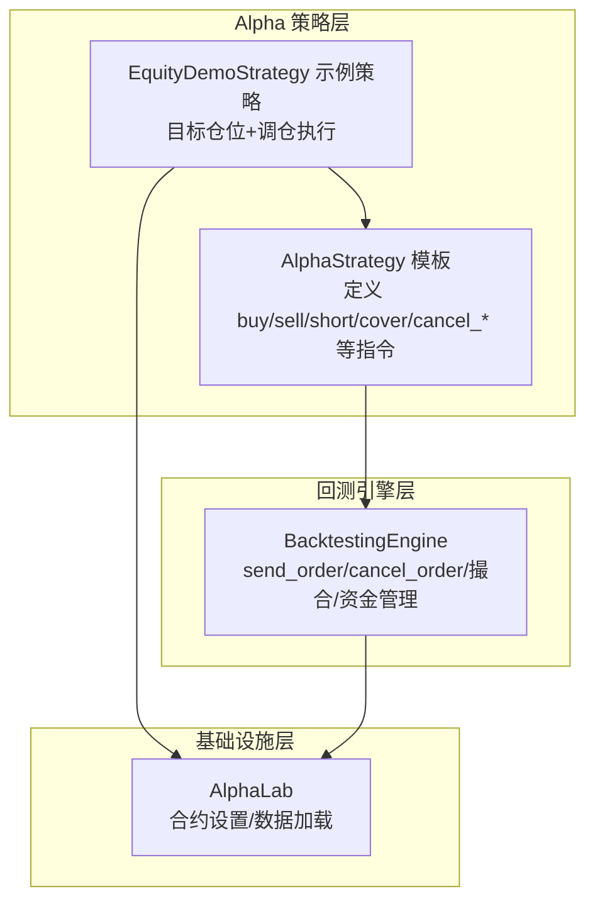
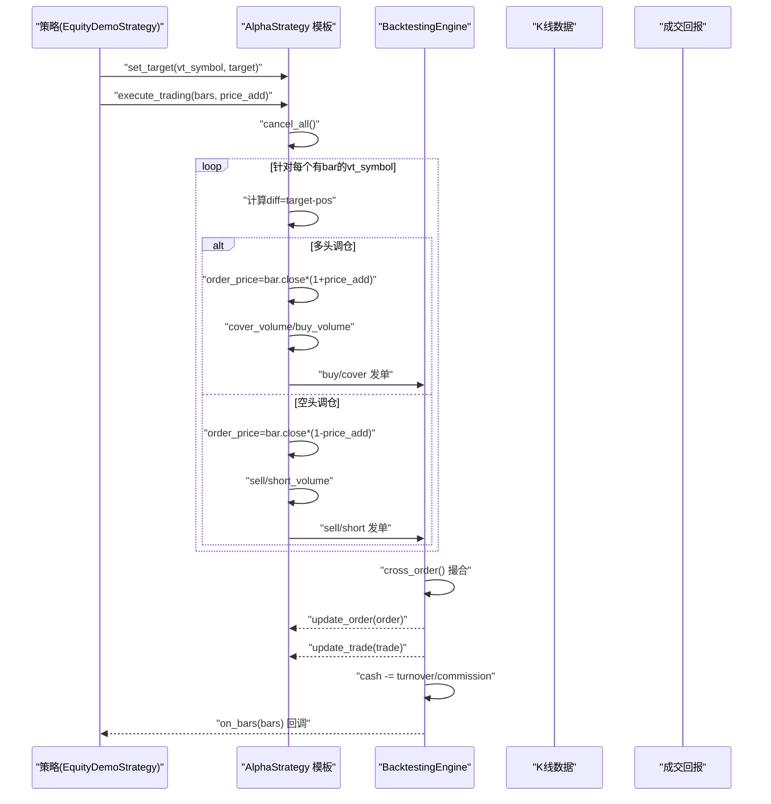
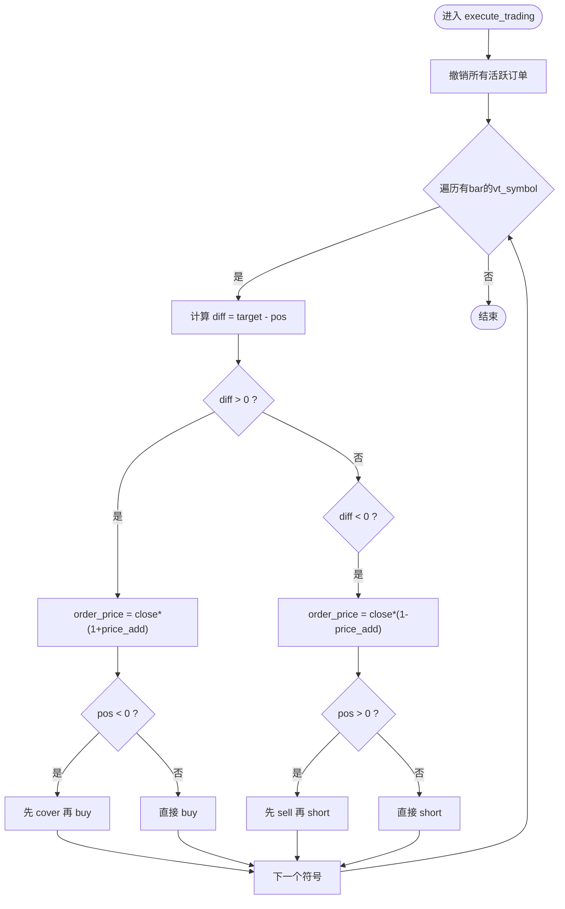
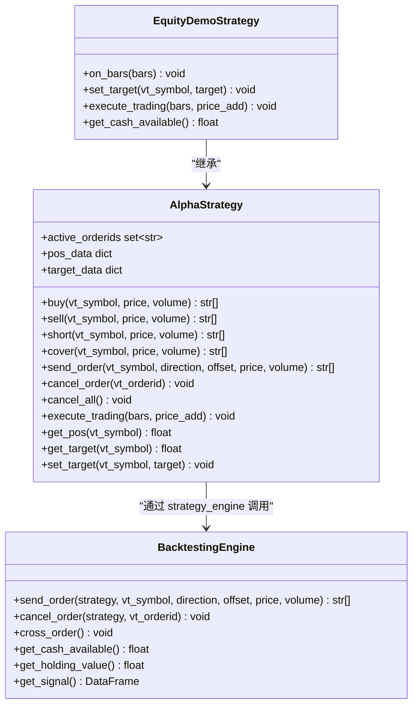

# 交易指令与执行逻辑

<cite>
**本文引用的文件列表**
- [vnpy/alpha/strategy/template.py](file://vnpy/alpha/strategy/template.py)
- [vnpy/alpha/strategy/backtesting.py](file://vnpy/alpha/strategy/backtesting.py)
- [vnpy/alpha/strategy/strategies/equity_demo_strategy.py](file://vnpy/alpha/strategy/strategies/equity_demo_strategy.py)
- [vnpy/alpha/lab.py](file://vnpy/alpha/lab.py)
</cite>

## 目录
1. [引言](#引言)
2. [项目结构](#项目结构)
3. [核心组件](#核心组件)
4. [架构总览](#架构总览)
5. [详细组件分析](#详细组件分析)
6. [依赖关系分析](#依赖关系分析)
7. [性能考量](#性能考量)
8. [故障排查指南](#故障排查指南)
9. [结论](#结论)
10. [附录](#附录)

## 引言
本文件系统化梳理 AlphaStrategy 封装的交易指令体系，覆盖 buy/sell/short/cover 四个方向性指令与 cancel_order/cancel_all 等风控指令的内部实现；深入解析 send_order 方法如何通过 strategy_engine 与回测引擎交互并维护 active_orderids；详解 execute_trading 基于目标仓位的智能调仓算法，包括多空转换、滑点价格计算与分步下单逻辑；结合 equity_demo_strategy.py 的调用上下文，说明交易成本计算、资金可用性检查与最小交易单位约束的集成方式，并给出交易执行性能优化建议。

## 项目结构
围绕 AlphaStrategy 的交易指令体系，主要涉及以下模块：
- 模板层：定义策略基类与通用指令封装
- 回测引擎：负责订单提交、撮合、成交回报与资金流水
- 示例策略：展示目标仓位设定与调仓执行流程
- 实验室工具：提供合约设置、数据加载等基础设施

图表来源
- [vnpy/alpha/strategy/template.py](file://vnpy/alpha/strategy/template.py#L78-L120)
- [vnpy/alpha/strategy/backtesting.py](file://vnpy/alpha/strategy/backtesting.py#L723-L765)
- [vnpy/alpha/strategy/strategies/equity_demo_strategy.py](file://vnpy/alpha/strategy/strategies/equity_demo_strategy.py#L1-L102)
- [vnpy/alpha/lab.py](file://vnpy/alpha/lab.py#L379-L405)

章节来源
- [vnpy/alpha/strategy/template.py](file://vnpy/alpha/strategy/template.py#L1-L120)
- [vnpy/alpha/strategy/backtesting.py](file://vnpy/alpha/strategy/backtesting.py#L1-L120)
- [vnpy/alpha/strategy/strategies/equity_demo_strategy.py](file://vnpy/alpha/strategy/strategies/equity_demo_strategy.py#L1-L102)
- [vnpy/alpha/lab.py](file://vnpy/alpha/lab.py#L360-L405)

## 核心组件
- AlphaStrategy 模板：提供 buy/sell/short/cover 指令封装，以及 cancel_order/cancel_all 风控指令；维护 pos_data/target_data 记录实际与目标仓位；通过 strategy_engine 统一调度 send_order/cancel_order；提供 execute_trading 智能调仓入口。
- BacktestingEngine 回测引擎：负责订单提交（round_to 价格规整）、限价单缓存、撮合匹配（含涨跌停限制）、成交回报（更新 cash/commission/trades）与每日损益归集。
- EquityDemoStrategy 示例策略：演示目标仓位生成、资金可用性检查、最小交易单位约束与 execute_trading 调用。
- AlphaLab 基础设施：加载/保存合约设置（long_rate/short_rate/size/pricetick），为回测引擎提供交易成本与价格精度参数。

章节来源
- [vnpy/alpha/strategy/template.py](file://vnpy/alpha/strategy/template.py#L78-L206)
- [vnpy/alpha/strategy/backtesting.py](file://vnpy/alpha/strategy/backtesting.py#L723-L798)
- [vnpy/alpha/strategy/strategies/equity_demo_strategy.py](file://vnpy/alpha/strategy/strategies/equity_demo_strategy.py#L1-L102)
- [vnpy/alpha/lab.py](file://vnpy/alpha/lab.py#L379-L405)

## 架构总览
下图展示了从策略到回测引擎的调用链路，以及订单状态跟踪与资金流更新的关键节点。

图表来源
- [vnpy/alpha/strategy/template.py](file://vnpy/alpha/strategy/template.py#L133-L186)
- [vnpy/alpha/strategy/backtesting.py](file://vnpy/alpha/strategy/backtesting.py#L619-L708)

章节来源
- [vnpy/alpha/strategy/template.py](file://vnpy/alpha/strategy/template.py#L133-L186)
- [vnpy/alpha/strategy/backtesting.py](file://vnpy/alpha/strategy/backtesting.py#L619-L708)

## 详细组件分析

### AlphaStrategy 指令体系与状态跟踪
- 方向性指令
  - buy：多头开仓，对应 Direction.LONG、Offset.OPEN
  - sell：空头平仓，对应 Direction.SHORT、Offset.CLOSE
  - short：空头开仓，对应 Direction.SHORT、Offset.OPEN
  - cover：多头平仓，对应 Direction.LONG、Offset.CLOSE
- 风控指令
  - cancel_order：按 vt_orderid 取消指定订单
  - cancel_all：遍历 active_orderids 逐一取消
- 状态跟踪
  - active_orderids：记录当前活跃订单集合，用于风控与批量取消
  - orders：缓存所有订单对象，便于回放与查询
  - pos_data/target_data：分别记录实际持仓与目标持仓，execute_trading 的核心依据

章节来源
- [vnpy/alpha/strategy/template.py](file://vnpy/alpha/strategy/template.py#L78-L120)
- [vnpy/alpha/strategy/template.py](file://vnpy/alpha/strategy/template.py#L112-L120)

### send_order 与 strategy_engine 交互
- 调用链
  - AlphaStrategy.send_order 调用 strategy_engine.send_order
  - 回测引擎接收参数后，进行价格规整（pricetick）并创建 OrderData
  - 订单进入 active_limit_orders 缓存，等待撮合
  - 返回 vt_orderid 列表，模板侧加入 active_orderids
- 订单状态流转
  - SUBMITTING → NOTTRADED → ALLTRADED（在撮合阶段）
  - 取消时状态置为 CANCELLED 并回调策略 update_order

章节来源
- [vnpy/alpha/strategy/template.py](file://vnpy/alpha/strategy/template.py#L94-L111)
- [vnpy/alpha/strategy/backtesting.py](file://vnpy/alpha/strategy/backtesting.py#L723-L755)
- [vnpy/alpha/strategy/backtesting.py](file://vnpy/alpha/strategy/backtesting.py#L756-L765)

### execute_trading 智能调仓算法
- 步骤概览
  - cancel_all：优先撤销未成交的旧订单，避免冲突
  - 仅对存在当前 bar 的 vt_symbol 进行处理
  - 计算 diff = target - pos
  - 多头调仓（diff > 0）
    - 计算 order_price = bar.close_price * (1 + price_add) 作为多头挂单价
    - 若 pos < 0，先 cover 平空，再 buy 补多
    - 若 pos ≥ 0，直接 buy
  - 空头调仓（diff < 0）
    - 计算 order_price = bar.close_price * (1 - price_add) 作为空头挂单价
    - 若 pos > 0，先 sell 平多，再 short 建空
    - 若 pos ≤ 0，直接 short
  - 分步下单：根据 pos 符号与绝对值大小拆分为 cover/buy 或 sell/short 的组合，保证一步到位
- 关键点
  - 滑点：通过 price_add 对挂单价进行加/减偏移，模拟市场滑点
  - 顺序：先平仓再建仓，避免同时存在相反方向的订单导致无效占用

图表来源
- [vnpy/alpha/strategy/template.py](file://vnpy/alpha/strategy/template.py#L133-L186)

章节来源
- [vnpy/alpha/strategy/template.py](file://vnpy/alpha/strategy/template.py#L133-L186)

### 回测引擎撮合与资金流
- 撮合规则
  - 使用当前 bar 的 low/high/open 价格判断是否成交
  - 受涨跌停限制：基于 pre_close 与 pricetick 计算 limit_up/limit_down
  - 成交价取 order.price 与 best_price 的合理组合
- 成交回报
  - 更新 order.traded/volume/status
  - 生成 TradeData 并推送给策略 update_trade
  - 扣除成交额与佣金（long_rate/short_rate）
  - 现金余额 cash 增减，用于后续可用资金检查
- 日结与统计
  - 每日收盘后归集 trades，计算每日合约与组合损益
  - 提供 get_cash_available/get_holding_value/get_portfolio_value 接口

章节来源
- [vnpy/alpha/strategy/backtesting.py](file://vnpy/alpha/strategy/backtesting.py#L619-L708)
- [vnpy/alpha/strategy/backtesting.py](file://vnpy/alpha/strategy/backtesting.py#L782-L798)

### 示例策略：目标仓位、成本与约束集成
- 目标生成
  - 从模型信号排序，筛选 top_k 与当前持仓合并后的 active 集合
  - 基于最低信号部分与持有期阈值生成卖出清单
  - 计算可买入标的与数量，形成 buy_symbols
- 资金与成本
  - 使用 get_cash_available 获取可用现金
  - 卖出时按 turnover 与 close_rate 计算佣金，更新可用现金
  - 买入时按 cash_ratio 分配到各标的，使用 min_volume 进行最小单位约束
- 调仓执行
  - set_target 设置目标仓位
  - execute_trading 基于 price_add 进行滑点模拟并分步下单

章节来源
- [vnpy/alpha/strategy/strategies/equity_demo_strategy.py](file://vnpy/alpha/strategy/strategies/equity_demo_strategy.py#L1-L102)

### 合约设置与数据加载
- 合约设置
  - 通过 AlphaLab.load_contract_setttings 加载 long_rate/short_rate/size/pricetick
  - 回测引擎据此计算成交额、佣金与价格规整
- 数据加载
  - AlphaLab.load_bar_data/load_bar_df 支持按时间范围读取日/分钟级 K 线
  - 为回测提供历史数据源

章节来源
- [vnpy/alpha/lab.py](file://vnpy/alpha/lab.py#L379-L405)
- [vnpy/alpha/lab.py](file://vnpy/alpha/lab.py#L96-L154)

## 依赖关系分析
- 组件耦合
  - AlphaStrategy 依赖 BacktestingEngine 提供的 send_order/cancel_order/update_order/update_trade
  - BacktestingEngine 依赖 AlphaLab 提供的合约设置与历史数据
  - EquityDemoStrategy 依赖 AlphaStrategy 的目标仓位与调仓接口
- 外部依赖
  - 价格规整 round_to、vt_symbol 解析 extract_vt_symbol
  - Polars DataFrame 用于信号与结果统计
  - Plotly 用于可视化展示

图表来源
- [vnpy/alpha/strategy/template.py](file://vnpy/alpha/strategy/template.py#L78-L206)
- [vnpy/alpha/strategy/backtesting.py](file://vnpy/alpha/strategy/backtesting.py#L723-L798)
- [vnpy/alpha/strategy/strategies/equity_demo_strategy.py](file://vnpy/alpha/strategy/strategies/equity_demo_strategy.py#L1-L102)

章节来源
- [vnpy/alpha/strategy/template.py](file://vnpy/alpha/strategy/template.py#L78-L206)
- [vnpy/alpha/strategy/backtesting.py](file://vnpy/alpha/strategy/backtesting.py#L723-L798)
- [vnpy/alpha/strategy/strategies/equity_demo_strategy.py](file://vnpy/alpha/strategy/strategies/equity_demo_strategy.py#L1-L102)

## 性能考量
- 订单批量化与去重
  - 在 execute_trading 中先 cancel_all，减少重复挂单带来的无效占用
  - 仅对存在 bar 的 vt_symbol 下单，避免无效符号带来的循环开销
- 价格规整与撮合效率
  - 回测引擎在 send_order 中统一 round_to，降低撮合阶段的比较复杂度
  - 撮合时仅遍历 active_limit_orders，避免全量扫描
- 数据访问优化
  - AlphaLab 使用 parquet 存储与过滤，load_bar_df 支持扩展窗口，减少 IO 次数
- 统计与可视化
  - 使用 Polars 进行向量化计算，提高日结与指标统计效率
  - Plotly 渲染图表，便于快速定位异常时段

[本节为通用性能建议，不直接分析具体文件，故无章节来源]

## 故障排查指南
- 订单未成交
  - 检查是否触发涨跌停限制（pre_close 与 pricetick 计算）
  - 确认 order.price 是否与 bar.low/high 匹配
  - 查看 active_limit_orders 中是否存在该订单
- 资金不足
  - 使用 get_cash_available 检查可用现金
  - 卖出时确认 turnover 与佣金扣减是否正确
  - 买入时确认 cash_ratio 与 min_volume 计算是否满足最小单位
- 目标仓位未达成
  - 检查 execute_trading 中 diff 计算与正负方向逻辑
  - 确认 pos_data 与 target_data 是否同步更新
- 滑点与分步下单
  - 调整 price_add 观察对成交的影响
  - 检查 cover/buy 或 sell/short 的拆分逻辑是否符合预期

章节来源
- [vnpy/alpha/strategy/backtesting.py](file://vnpy/alpha/strategy/backtesting.py#L619-L708)
- [vnpy/alpha/strategy/template.py](file://vnpy/alpha/strategy/template.py#L133-L186)

## 结论
AlphaStrategy 将交易指令抽象为简洁易用的 buy/sell/short/cover 与 cancel_order/cancel_all，并通过 strategy_engine 与回测引擎解耦，实现了清晰的职责划分。execute_trading 基于目标仓位的智能调仓算法，结合滑点与分步下单，有效提升策略执行质量。示例策略展示了交易成本、资金可用性与最小交易单位约束的集成方式。整体架构具备良好的扩展性与可维护性，适合进一步拓展至实盘交易场景。

[本节为总结性内容，不直接分析具体文件，故无章节来源]

## 附录
- 关键接口路径参考
  - 指令封装与调仓入口：[AlphaStrategy 指令与调仓](file://vnpy/alpha/strategy/template.py#L78-L186)
  - 订单提交与取消：[BacktestingEngine 订单接口](file://vnpy/alpha/strategy/backtesting.py#L723-L765)
  - 撮合与成交回报：[BacktestingEngine 撮合逻辑](file://vnpy/alpha/strategy/backtesting.py#L619-L708)
  - 示例策略调用上下文：[EquityDemoStrategy 目标与调仓](file://vnpy/alpha/strategy/strategies/equity_demo_strategy.py#L60-L102)
  - 合约设置与数据加载：[AlphaLab 合约设置](file://vnpy/alpha/lab.py#L379-L405)