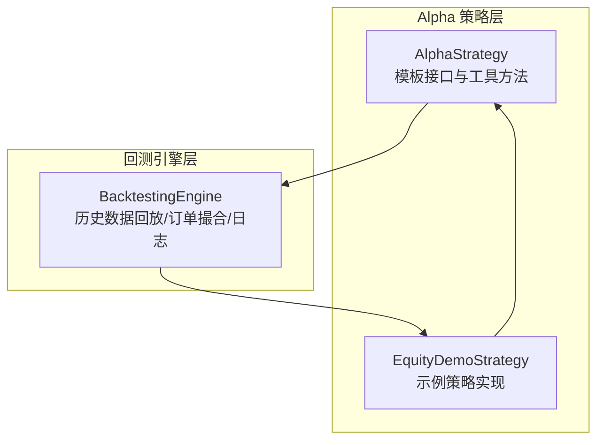
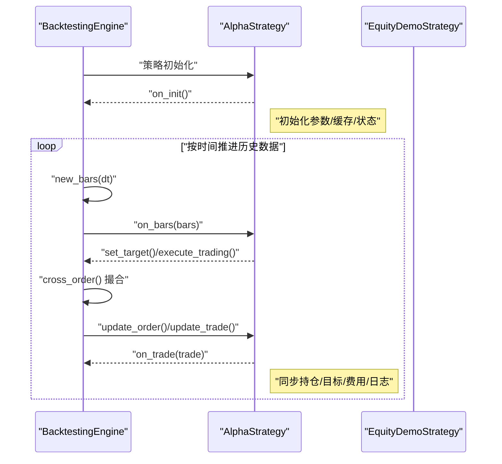
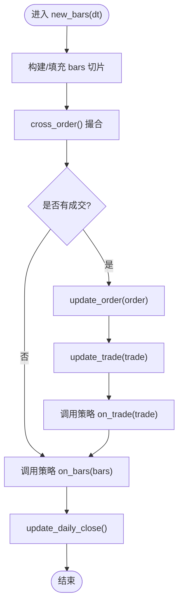
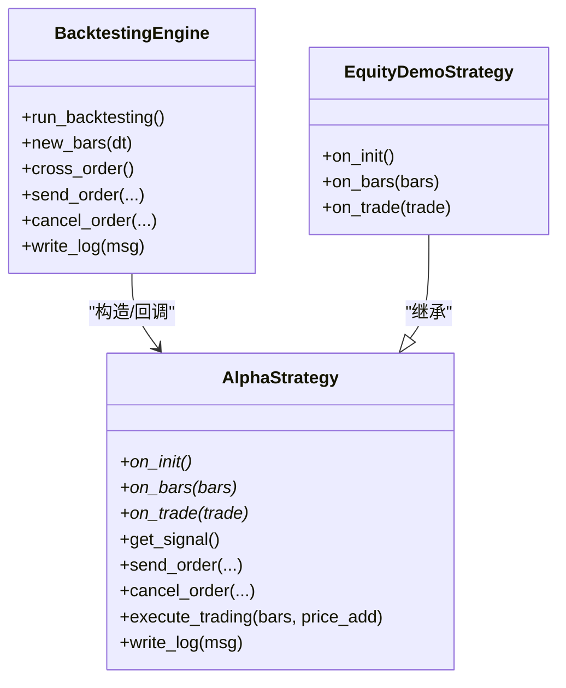

# 策略模板接口规范

<cite>
**本文引用的文件**
- [vnpy/alpha/strategy/template.py](file://vnpy/alpha/strategy/template.py)
- [vnpy/alpha/strategy/backtesting.py](file://vnpy/alpha/strategy/backtesting.py)
- [vnpy/alpha/strategy/strategies/equity_demo_strategy.py](file://vnpy/alpha/strategy/strategies/equity_demo_strategy.py)
</cite>

## 目录
1. [引言](#引言)
2. [项目结构](#项目结构)
3. [核心组件](#核心组件)
4. [架构总览](#架构总览)
5. [详细组件分析](#详细组件分析)
6. [依赖关系分析](#依赖关系分析)
7. [性能考量](#性能考量)
8. [故障排查指南](#故障排查指南)
9. [结论](#结论)

## 引言
本文件系统化梳理 AlphaStrategy 基类中 on_init、on_bars、on_trade 三个抽象方法的接口规范与调用机制，并结合 equity_demo_strategy.py 的实现示例，说明如何正确重写这些方法以实现策略逻辑。文档还提供事件响应链路的调试方法，包括日志记录与断点设置，帮助开发者理解框架回调机制。

## 项目结构
Alpha 策略体系由策略模板、回测引擎与示例策略组成：
- 策略模板：定义 AlphaStrategy 抽象接口与通用工具方法
- 回测引擎：驱动历史数据回放、订单撮合、交易回报与日志输出
- 示例策略：演示 on_init/on_bars/on_trade 的典型实现

图表来源
- [vnpy/alpha/strategy/template.py](file://vnpy/alpha/strategy/template.py#L1-L206)
- [vnpy/alpha/strategy/backtesting.py](file://vnpy/alpha/strategy/backtesting.py#L1-L120)
- [vnpy/alpha/strategy/strategies/equity_demo_strategy.py](file://vnpy/alpha/strategy/strategies/equity_demo_strategy.py#L1-L102)

章节来源
- [vnpy/alpha/strategy/template.py](file://vnpy/alpha/strategy/template.py#L1-L206)
- [vnpy/alpha/strategy/backtesting.py](file://vnpy/alpha/strategy/backtesting.py#L1-L120)
- [vnpy/alpha/strategy/strategies/equity_demo_strategy.py](file://vnpy/alpha/strategy/strategies/equity_demo_strategy.py#L1-L102)

## 核心组件
- AlphaStrategy 抽象基类
  - 定义 on_init、on_bars、on_trade 三个抽象方法
  - 提供下单、撤单、目标仓位、执行交易、日志等辅助方法
- BacktestingEngine 回测引擎
  - 负责加载历史数据、按时间推进 K 线、触发策略回调、撮合订单并生成成交回报
- EquityDemoStrategy 示例策略
  - 展示 on_init 初始化资源、on_bars 数据驱动与频率控制、on_trade 状态同步

章节来源
- [vnpy/alpha/strategy/template.py](file://vnpy/alpha/strategy/template.py#L1-L206)
- [vnpy/alpha/strategy/backtesting.py](file://vnpy/alpha/strategy/backtesting.py#L150-L170)
- [vnpy/alpha/strategy/strategies/equity_demo_strategy.py](file://vnpy/alpha/strategy/strategies/equity_demo_strategy.py#L1-L102)

## 架构总览
AlphaStrategy 在回测引擎驱动下，按时间维度接收 K 线切片并触发策略回调，同时在订单撮合后产生成交回报，驱动策略状态更新。

图表来源
- [vnpy/alpha/strategy/backtesting.py](file://vnpy/alpha/strategy/backtesting.py#L150-L170)
- [vnpy/alpha/strategy/backtesting.py](file://vnpy/alpha/strategy/backtesting.py#L579-L618)
- [vnpy/alpha/strategy/backtesting.py](file://vnpy/alpha/strategy/backtesting.py#L619-L708)
- [vnpy/alpha/strategy/template.py](file://vnpy/alpha/strategy/template.py#L57-L77)
- [vnpy/alpha/strategy/strategies/equity_demo_strategy.py](file://vnpy/alpha/strategy/strategies/equity_demo_strategy.py#L25-L102)

## 详细组件分析

### AlphaStrategy 抽象接口与职责
- on_init(self) -> None
  - 执行时机：回测开始前，由回测引擎显式调用一次
  - 资源配置职责：初始化内部状态、参数缓存、日志记录、数据结构准备
- on_bars(self, bars: dict[str, BarData]) -> None
  - 执行时机：每个时间点的历史数据回放阶段，按时间推进触发
  - 数据驱动逻辑：接收该时间点所有标的的 K 线切片，用于信号计算、目标仓位设定与交易执行
  - 频率控制：由回测引擎的 interval 参数决定推进频率
- on_trade(self, trade: TradeData) -> None
  - 执行时机：订单撮合产生成交回报时触发
  - 状态同步：根据成交方向与成交量更新策略内部持仓、目标、费用与日志

章节来源
- [vnpy/alpha/strategy/template.py](file://vnpy/alpha/strategy/template.py#L43-L56)
- [vnpy/alpha/strategy/backtesting.py](file://vnpy/alpha/strategy/backtesting.py#L150-L170)
- [vnpy/alpha/strategy/backtesting.py](file://vnpy/alpha/strategy/backtesting.py#L579-L618)
- [vnpy/alpha/strategy/backtesting.py](file://vnpy/alpha/strategy/backtesting.py#L619-L708)

### 回测引擎驱动流程（new_bars）
- new_bars(dt) 负责：
  - 维护 pre_closes、bars 缓存
  - 从历史数据中提取 dt 对应的 bars 切片
  - 触发策略 on_bars(bars)
  - 执行撮合 cross_order 并生成 TradeData
  - 调用策略 update_order/update_trade 并触发 on_trade
  - 更新每日收盘价与结果

图表来源
- [vnpy/alpha/strategy/backtesting.py](file://vnpy/alpha/strategy/backtesting.py#L579-L618)
- [vnpy/alpha/strategy/backtesting.py](file://vnpy/alpha/strategy/backtesting.py#L619-L708)

章节来源
- [vnpy/alpha/strategy/backtesting.py](file://vnpy/alpha/strategy/backtesting.py#L579-L618)
- [vnpy/alpha/strategy/backtesting.py](file://vnpy/alpha/strategy/backtesting.py#L619-L708)

### 示例策略：EquityDemoStrategy 的实现要点
- on_init
  - 初始化持有期计数等内部状态
  - 使用 write_log 输出初始化日志
- on_bars
  - 获取最新信号并排序
  - 维护持有期计数
  - 生成卖出/买入清单，计算目标仓位
  - 调用 execute_trading(bars, price_add) 执行交易
- on_trade
  - 当卖出成交时清理持有期记录，避免误判

章节来源
- [vnpy/alpha/strategy/strategies/equity_demo_strategy.py](file://vnpy/alpha/strategy/strategies/equity_demo_strategy.py#L25-L102)

### AlphaStrategy 工具方法与数据流
- 位置与目标管理
  - get_pos/get_target/set_target：查询与设置目标仓位
- 下单与撤单
  - buy/sell/short/cover/send_order/cancel_order/cancel_all：统一委托入口与活跃订单集合维护
- 交易执行
  - execute_trading：根据目标与当前持仓差异，计算覆盖/开仓/平仓的组合与价格偏移，批量发送委托
- 日志与资金
  - write_log/get_cash_available/get_holding_value/get_portfolio_value：策略侧日志与资金视图

章节来源
- [vnpy/alpha/strategy/template.py](file://vnpy/alpha/strategy/template.py#L74-L206)

## 依赖关系分析
- AlphaStrategy 依赖回测引擎提供的信号、下单、撤单、日志能力
- 回测引擎在撮合完成后，通过 update_order/update_trade 驱动策略回调
- 示例策略继承 AlphaStrategy，重写三个抽象方法并使用工具方法

图表来源
- [vnpy/alpha/strategy/backtesting.py](file://vnpy/alpha/strategy/backtesting.py#L150-L170)
- [vnpy/alpha/strategy/backtesting.py](file://vnpy/alpha/strategy/backtesting.py#L579-L618)
- [vnpy/alpha/strategy/template.py](file://vnpy/alpha/strategy/template.py#L1-L206)
- [vnpy/alpha/strategy/strategies/equity_demo_strategy.py](file://vnpy/alpha/strategy/strategies/equity_demo_strategy.py#L1-L102)

章节来源
- [vnpy/alpha/strategy/backtesting.py](file://vnpy/alpha/strategy/backtesting.py#L150-L170)
- [vnpy/alpha/strategy/template.py](file://vnpy/alpha/strategy/template.py#L1-L206)
- [vnpy/alpha/strategy/strategies/equity_demo_strategy.py](file://vnpy/alpha/strategy/strategies/equity_demo_strategy.py#L1-L102)

## 性能考量
- on_bars 中的信号计算与目标设定应尽量使用向量化数据结构（如示例策略使用的 DataFrame 排序与过滤），避免逐条遍历带来的额外开销
- execute_trading 会批量取消活跃委托并按目标差额发送委托，注意 price_add 的设置与最小交易单位的取整，减少无效委托
- 回测引擎在撮合阶段会遍历活跃委托，策略应避免频繁微小波动导致的高频下单

[本节为通用指导，无需列出具体文件来源]

## 故障排查指南
- 日志记录
  - 策略侧：使用 write_log 输出关键步骤与状态变更
  - 引擎侧：回测引擎会在找不到信号或尚未开始回放时输出相应日志
- 断点设置
  - 在 on_init 中设置断点，确认初始化参数与缓存是否正确
  - 在 on_bars 中设置断点，检查 bars 切片完整性与信号来源
  - 在 on_trade 中设置断点，验证成交回报是否触发且持仓同步正确
- 常见问题定位
  - 未触发 on_bars：检查回测引擎 run_backtesting 是否正常推进时间序列
  - 未触发 on_trade：检查是否存在成交回报（cross_order 是否匹配到委托）
  - 目标仓位未生效：检查 execute_trading 的 price_add 与最小交易单位取整逻辑

章节来源
- [vnpy/alpha/strategy/backtesting.py](file://vnpy/alpha/strategy/backtesting.py#L718-L721)
- [vnpy/alpha/strategy/backtesting.py](file://vnpy/alpha/strategy/backtesting.py#L765-L769)
- [vnpy/alpha/strategy/strategies/equity_demo_strategy.py](file://vnpy/alpha/strategy/strategies/equity_demo_strategy.py#L25-L102)

## 结论
AlphaStrategy 的 on_init/on_bars/on_trade 三者构成完整的回测回调闭环：初始化阶段完成资源准备，K 线阶段完成信号与目标设定，成交阶段完成状态同步。示例策略展示了如何在 on_bars 中高效地进行信号筛选与目标分配，并通过 execute_trading 将目标转化为实际委托。配合 write_log 与断点调试，开发者可以快速定位问题并优化策略性能。