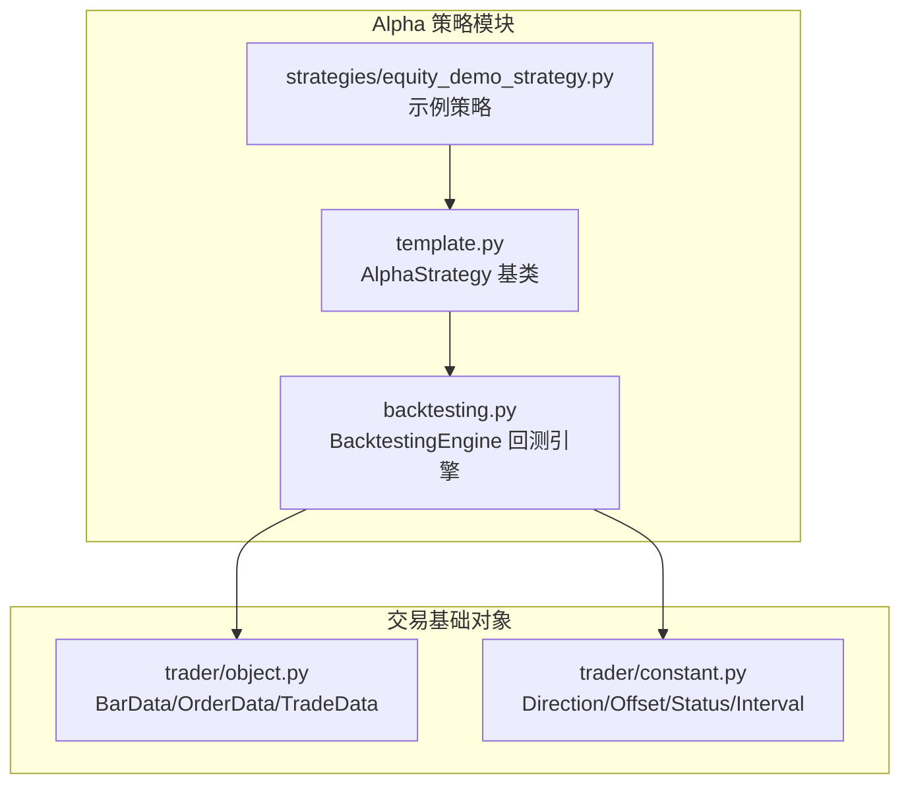
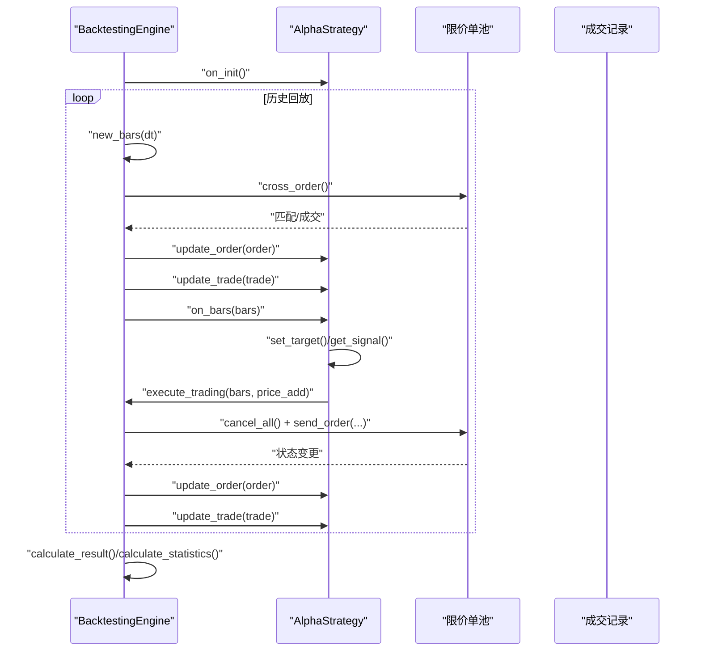
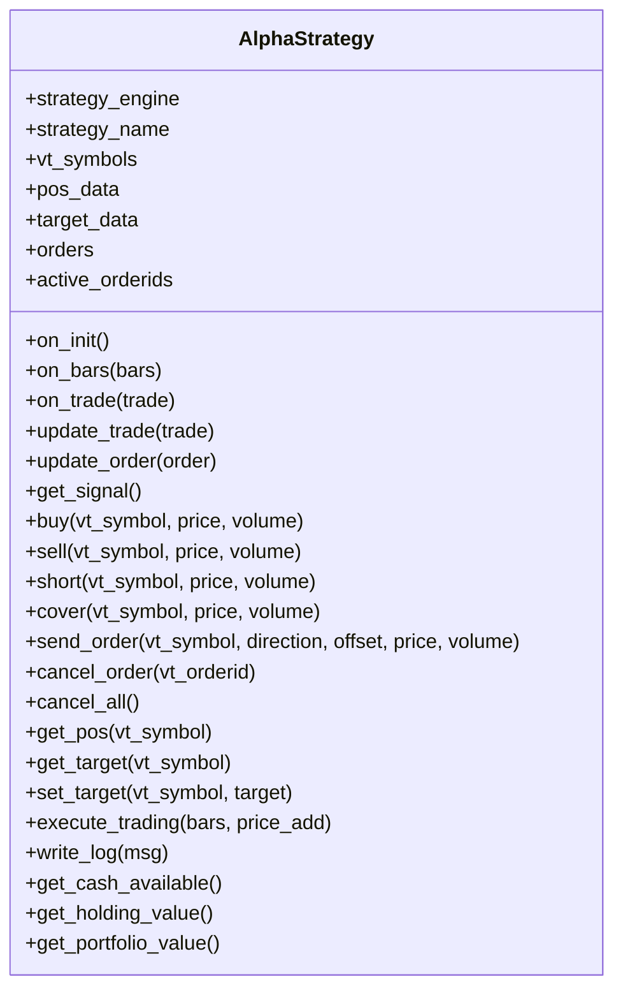
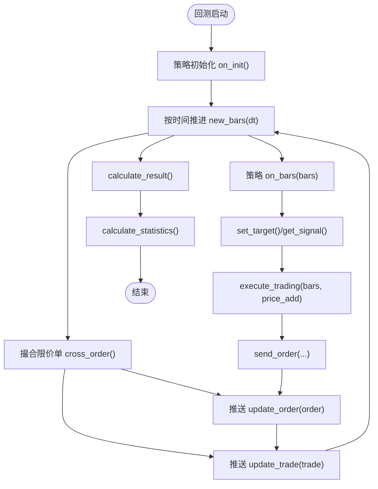
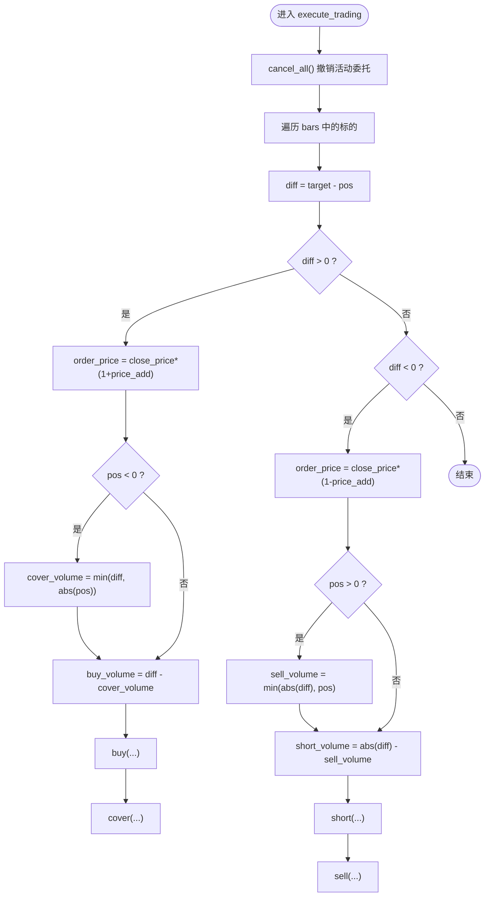
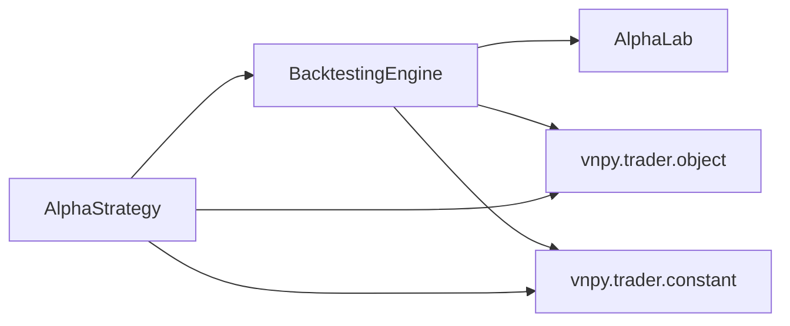

# 策略模板设计

<cite>
**本文引用的文件列表**
- [vnpy/alpha/strategy/template.py](file://vnpy/alpha/strategy/template.py)
- [vnpy/alpha/strategy/backtesting.py](file://vnpy/alpha/strategy/backtesting.py)
- [vnpy/alpha/strategy/strategies/equity_demo_strategy.py](file://vnpy/alpha/strategy/strategies/equity_demo_strategy.py)
- [vnpy/trader/object.py](file://vnpy/trader/object.py)
- [vnpy/trader/constant.py](file://vnpy/trader/constant.py)
</cite>

## 目录
1. [引言](#引言)
2. [项目结构](#项目结构)
3. [核心组件](#核心组件)
4. [架构总览](#架构总览)
5. [详细组件分析](#详细组件分析)
6. [依赖关系分析](#依赖关系分析)
7. [性能考量](#性能考量)
8. [故障排查指南](#故障排查指南)
9. [结论](#结论)
10. [附录](#附录)

## 引言
本文件围绕 AlphaStrategy 基类及其在 vn.py Alpha 模块中的设计与实现进行系统化文档化，目标是为 AI 量化策略开发者提供一个清晰、可复用的策略模板。文档重点覆盖：
- 抽象方法 on_init、on_bars、on_trade 的调用时机与实现规范
- pos_data 与 target_data 仓位管理字典的设计意图与使用方式
- 事件响应机制中 update_trade 与 update_order 的内部处理逻辑
- buy/sell/short/cover 等交易指令的封装实现与执行流程
- 结合 equity_demo_strategy.py 示例，讲解如何继承 AlphaStrategy 实现具体股票多头策略，包括参数配置、持仓周期控制、交易回调处理等核心要素
- 策略开发最佳实践：信号阈值设定、风险敞口控制与异常处理机制

## 项目结构
Alpha 策略相关代码位于 vnpy/alpha/strategy 目录，包含策略模板、回测引擎与示例策略：
- 策略模板：AlphaStrategy 基类，定义策略生命周期与交易接口
- 回测引擎：BacktestingEngine，负责数据回放、订单撮合、资金与持仓管理、日频损益计算与统计
- 示例策略：EquityDemoStrategy，演示如何继承 AlphaStrategy 实现多头轮动策略

图表来源
- [vnpy/alpha/strategy/template.py](file://vnpy/alpha/strategy/template.py#L1-L206)
- [vnpy/alpha/strategy/backtesting.py](file://vnpy/alpha/strategy/backtesting.py#L1-L200)
- [vnpy/alpha/strategy/strategies/equity_demo_strategy.py](file://vnpy/alpha/strategy/strategies/equity_demo_strategy.py#L1-L102)
- [vnpy/trader/object.py](file://vnpy/trader/object.py#L87-L176)
- [vnpy/trader/constant.py](file://vnpy/trader/constant.py#L10-L40)

章节来源
- [vnpy/alpha/strategy/template.py](file://vnpy/alpha/strategy/template.py#L1-L206)
- [vnpy/alpha/strategy/backtesting.py](file://vnpy/alpha/strategy/backtesting.py#L1-L200)
- [vnpy/alpha/strategy/strategies/equity_demo_strategy.py](file://vnpy/alpha/strategy/strategies/equity_demo_strategy.py#L1-L102)
- [vnpy/trader/object.py](file://vnpy/trader/object.py#L87-L176)
- [vnpy/trader/constant.py](file://vnpy/trader/constant.py#L10-L40)

## 核心组件
- AlphaStrategy 基类
  - 定义策略生命周期回调：on_init、on_bars、on_trade
  - 提供交易封装：buy/sell/short/cover/send_order/cancel_order/cancel_all
  - 维护仓位与目标仓位：pos_data/target_data，并提供查询与设置接口
  - 提供资金与持仓视图：get_cash_available/get_holding_value/get_portfolio_value
  - 提供日志写入与信号获取：write_log/get_signal
  - 执行目标调整：execute_trading，按目标与当前仓位差额生成相应委托并自动撤单
- BacktestingEngine 回测引擎
  - 负责加载历史 K 线、推进时间切片、撮合限价单、推送订单与成交事件、累计每日损益、计算统计指标
  - 通过 send_order/cancel_order 将委托下发到引擎内部的限价单池
  - 通过 update_order/update_trade 将订单状态与成交回报推送给策略
- 示例策略 EquityDemoStrategy
  - 展示如何在 on_init 中初始化持有期计数，在 on_bars 中根据信号生成买卖目标，在 on_trade 中处理卖出清仓逻辑
  - 使用 execute_trading 将目标仓位转换为实际委托

章节来源
- [vnpy/alpha/strategy/template.py](file://vnpy/alpha/strategy/template.py#L15-L206)
- [vnpy/alpha/strategy/backtesting.py](file://vnpy/alpha/strategy/backtesting.py#L150-L227)
- [vnpy/alpha/strategy/strategies/equity_demo_strategy.py](file://vnpy/alpha/strategy/strategies/equity_demo_strategy.py#L1-L102)

## 架构总览
下图展示了 AlphaStrategy 与 BacktestingEngine 的交互关系，以及事件流（订单与成交）在引擎与策略之间的传递。

图表来源
- [vnpy/alpha/strategy/backtesting.py](file://vnpy/alpha/strategy/backtesting.py#L150-L227)
- [vnpy/alpha/strategy/backtesting.py](file://vnpy/alpha/strategy/backtesting.py#L579-L618)
- [vnpy/alpha/strategy/backtesting.py](file://vnpy/alpha/strategy/backtesting.py#L619-L709)
- [vnpy/alpha/strategy/backtesting.py](file://vnpy/alpha/strategy/backtesting.py#L723-L755)
- [vnpy/alpha/strategy/template.py](file://vnpy/alpha/strategy/template.py#L133-L186)

## 详细组件分析

### AlphaStrategy 基类设计与职责
- 生命周期回调
  - on_init：策略初始化入口，用于建立内部状态（如持有期计数、缓存等）
  - on_bars：每根 K 线切片回调，接收 bars 字典（vt_symbol -> BarData），在此处生成目标仓位并调用 execute_trading
  - on_trade：每次成交回报回调，策略可据此更新内部状态（如清仓后移除持有期计数）
- 交易封装
  - buy/sell/short/cover：分别封装“开多/平空/开空/平多”的委托请求
  - send_order：统一委托入口，将委托下发给回测引擎，并维护 active_orderids
  - cancel_order/cancel_all：取消指定或全部活动委托
- 仓位与目标管理
  - pos_data：实际持有仓位（默认值 0），由 update_trade 自动累加/扣减
  - target_data：目标仓位（默认值 0），策略通过 set_target 设置，execute_trading 依据差值生成委托
  - get_pos/get_target：查询当前实际与目标仓位
- 资金与视图
  - get_cash_available/get_holding_value/get_portfolio_value：提供可用资金、持仓市值与组合总价值
- 事件处理
  - update_order：缓存订单、维护活动订单集合、在订单失效时从活动集合移除
  - update_trade：根据成交方向更新 pos_data，并回调 on_trade
- 目标执行
  - execute_trading：先撤单，再按目标与当前仓位差额计算需要买入/卖出/平仓/开仓的数量，按 bar 价格上下浮动 price_add 发送委托

图表来源
- [vnpy/alpha/strategy/template.py](file://vnpy/alpha/strategy/template.py#L15-L206)

章节来源
- [vnpy/alpha/strategy/template.py](file://vnpy/alpha/strategy/template.py#L15-L206)

### BacktestingEngine 回测引擎与事件流
- 数据推进与回放
  - run_backtesting：调用策略 on_init，随后按时间顺序推进 new_bars
  - new_bars：从历史数据中提取各标的 K 线，填充空缺时段，触发 cross_order，然后调用策略 on_bars，并更新日收盘价
- 订单撮合
  - cross_order：遍历活动限价单，根据 bar 的高低价与涨跌停限制判断是否成交；更新订单状态为已成交，生成 TradeData 并更新资金与成交记录，随后调用策略 update_order 与 update_trade
- 委托与取消
  - send_order：构造 OrderData，加入活动与历史订单池，返回 vt_orderid
  - cancel_order：将活动订单标记为撤销并推送 update_order
- 资金与持仓
  - get_cash_available：返回当前可用资金
  - get_holding_value：基于策略 pos_data 与当前 bar close_price 计算总持仓市值
- 日频损益与统计
  - calculate_result：将成交按日归集，计算每日 trading_pnl/holding_pnl/commission/total_pnl/net_pnl
  - calculate_statistics：计算收益、回撤、夏普比率等指标

图表来源
- [vnpy/alpha/strategy/backtesting.py](file://vnpy/alpha/strategy/backtesting.py#L150-L227)
- [vnpy/alpha/strategy/backtesting.py](file://vnpy/alpha/strategy/backtesting.py#L579-L618)
- [vnpy/alpha/strategy/backtesting.py](file://vnpy/alpha/strategy/backtesting.py#L619-L709)
- [vnpy/alpha/strategy/backtesting.py](file://vnpy/alpha/strategy/backtesting.py#L723-L755)

章节来源
- [vnpy/alpha/strategy/backtesting.py](file://vnpy/alpha/strategy/backtesting.py#L150-L227)
- [vnpy/alpha/strategy/backtesting.py](file://vnpy/alpha/strategy/backtesting.py#L579-L709)
- [vnpy/alpha/strategy/backtesting.py](file://vnpy/alpha/strategy/backtesting.py#L723-L755)

### 事件响应机制：update_trade 与 update_order
- update_order
  - 缓存订单对象，维护活动订单集合；当订单不再活跃时，从活动集合移除
- update_trade
  - 根据成交方向累加/扣减 pos_data（多头成交增加，空头成交减少）
  - 随后回调策略 on_trade，允许策略根据成交事件更新内部状态（如清仓后移除持有期）

章节来源
- [vnpy/alpha/strategy/template.py](file://vnpy/alpha/strategy/template.py#L58-L74)
- [vnpy/alpha/strategy/template.py](file://vnpy/alpha/strategy/template.py#L58-L66)

### 交易指令封装：buy/sell/short/cover 与 send_order
- buy：开多（LONG+OPEN）
- sell：平空（SHORT+CLOSE）
- short：开空（SHORT+OPEN）
- cover：平多（LONG+CLOSE）
- send_order：统一委托入口，将委托下发至引擎，维护活动订单集合并返回 vt_orderid
- cancel_order/cancel_all：取消指定或全部活动委托

章节来源
- [vnpy/alpha/strategy/template.py](file://vnpy/alpha/strategy/template.py#L78-L120)
- [vnpy/alpha/strategy/template.py](file://vnpy/alpha/strategy/template.py#L102-L111)
- [vnpy/alpha/strategy/backtesting.py](file://vnpy/alpha/strategy/backtesting.py#L723-L755)

### 目标执行与仓位调整：execute_trading
- 先撤单：取消所有活动委托，避免重复挂单
- 差额计算：target - pos，正差额为多头建仓/加仓，负差额为空头建仓/加仓
- 多头场景：若 pos < 0（空头），先 cover 平仓，再 buy 建仓；否则仅 buy
- 空头场景：若 pos > 0（多头），先 sell 平仓，再 short 开空；否则仅 short
- 价格调整：按 bar.close_price 上下浮动 price_add，以模拟滑点或市场冲击
- 委托发送：按计算出的 buy_volume/cover_volume/sell_volume/short_volume 调用对应指令

图表来源
- [vnpy/alpha/strategy/template.py](file://vnpy/alpha/strategy/template.py#L133-L186)

章节来源
- [vnpy/alpha/strategy/template.py](file://vnpy/alpha/strategy/template.py#L133-L186)

### 示例策略：EquityDemoStrategy（股票多头轮动）
- 参数配置
  - top_k：最多持有股票数量
  - n_drop：每次卖出的股票数量
  - min_days：最小持有天数
  - cash_ratio：现金利用率
  - min_volume：最小交易单位
  - open_rate/close_rate/min_commission：交易成本
  - price_add：下单价格偏移比例
- 初始化 on_init
  - 初始化持有期计数字典
- 回调 on_bars
  - 获取最新信号并按信号降序排序
  - 更新当前持有的持有期
  - 生成待卖清单：剔除不在指数成分股的标的，同时考虑最低信号区间的 n_drop
  - 生成待买清单：在未持有的标的中选取前若干只，按可用资金与 cash_ratio 分配
  - 卖出：满足最小持有期后按 bar.close_price 平仓，更新可用资金
  - 买入：按 close_price 计算可买数量并设置目标仓位
  - 最后调用 execute_trading 执行目标调整
- 回调 on_trade
  - 当发生空头成交（卖出）时，移除该标的的持有期计数

章节来源
- [vnpy/alpha/strategy/strategies/equity_demo_strategy.py](file://vnpy/alpha/strategy/strategies/equity_demo_strategy.py#L1-L102)

## 依赖关系分析
- AlphaStrategy 依赖
  - vnpy.trader.object：BarData、TradeData、OrderData
  - vnpy.trader.constant：Direction、Offset、Status、Interval
  - BacktestingEngine：委托发送、订单取消、资金与持仓查询、信号读取
- BacktestingEngine 依赖
  - AlphaLab：加载历史 K 线与合约设置
  - AlphaStrategy：生命周期回调与目标执行
  - Polars：信号 DataFrame 与统计计算
  - NumPy/Plotly：统计与可视化

图表来源
- [vnpy/alpha/strategy/template.py](file://vnpy/alpha/strategy/template.py#L1-L206)
- [vnpy/alpha/strategy/backtesting.py](file://vnpy/alpha/strategy/backtesting.py#L1-L120)

章节来源
- [vnpy/alpha/strategy/template.py](file://vnpy/alpha/strategy/template.py#L1-L206)
- [vnpy/alpha/strategy/backtesting.py](file://vnpy/alpha/strategy/backtesting.py#L1-L120)

## 性能考量
- 数据结构复杂度
  - pos_data/target_data 采用字典映射，查询与更新均为 O(1)
  - active_orderids 采用集合，取消与查找均为 O(1)
- 订单撮合
  - cross_order 对活动订单进行一次扫描，整体复杂度 O(N)，N 为活动订单数
- 信号与目标
  - 示例策略对信号进行排序与过滤，建议在外部预处理以降低策略内排序开销
- 价格调整与滑点
  - execute_trading 中的价格偏移可视为简单滑点模型，可根据实盘情况调整 price_add

[本节为通用性能讨论，不直接分析具体文件]

## 故障排查指南
- 回测异常中断
  - run_backtesting 在异常时会记录堆栈并终止，需检查策略回调中的边界条件与输入合法性
- 无信号或信号缺失
  - get_signal 返回空 DataFrame 时，策略应避免产生无效目标
- 订单未成交
  - 检查涨跌停限制与价格偏移是否过大；确认 active_orderids 是否正确维护
- 资金不足
  - get_cash_available 与 get_holding_value 可用于监控资金与持仓市值，防止超仓或资金透支
- 成交回报异常
  - on_trade 中应避免对不存在的键进行操作，确保持有期字典的清理逻辑正确

章节来源
- [vnpy/alpha/strategy/backtesting.py](file://vnpy/alpha/strategy/backtesting.py#L150-L169)
- [vnpy/alpha/strategy/backtesting.py](file://vnpy/alpha/strategy/backtesting.py#L709-L722)

## 结论
AlphaStrategy 为 AI 量化策略提供了清晰的生命周期与交易接口，配合 BacktestingEngine 的事件驱动撮合机制，能够高效地实现从信号到目标再到委托的完整闭环。通过 pos_data 与 target_data 的分离设计，策略可以灵活地表达目标仓位并由引擎自动执行。示例策略 EquityDemoStrategy 展示了参数化配置、信号驱动的轮动与风控约束（最小持有期、资金利用率）的典型实践。遵循本文提供的最佳实践，可在保证可读性的同时提升策略的稳定性与可扩展性。

[本节为总结性内容，不直接分析具体文件]

## 附录

### 抽象方法与实现规范
- on_init
  - 用途：初始化内部状态（如持有期计数、缓存等）
  - 规范：避免在该阶段产生委托；仅做一次性准备
- on_bars
  - 用途：基于最新 bars 生成目标仓位，必要时调用 execute_trading
  - 规范：确保只对存在 bar 的标的进行目标设置；合理处理空 bar 场景
- on_trade
  - 用途：根据成交回报更新内部状态（如清仓后移除持有期）
  - 规范：注意方向字段与 pos_data 的符号一致性

章节来源
- [vnpy/alpha/strategy/template.py](file://vnpy/alpha/strategy/template.py#L43-L56)
- [vnpy/alpha/strategy/strategies/equity_demo_strategy.py](file://vnpy/alpha/strategy/strategies/equity_demo_strategy.py#L25-L37)

### 仓位管理字典设计意图
- pos_data
  - 记录实际持有仓位，由 update_trade 自动维护，策略通过 get_pos 查询
- target_data
  - 记录目标仓位，策略通过 set_target 设定，execute_trading 依据差额生成委托
- 设计优势
  - 解耦“目标”与“现实”，便于策略专注于信号与风控，引擎负责执行与撮合

章节来源
- [vnpy/alpha/strategy/template.py](file://vnpy/alpha/strategy/template.py#L30-L37)
- [vnpy/alpha/strategy/template.py](file://vnpy/alpha/strategy/template.py#L121-L132)

### 交易指令封装与执行要点
- buy/sell/short/cover
  - 统一封装方向与开平标志，简化策略调用
- send_order
  - 价格四舍五入至最小变动单位，维护活动订单集合
- cancel_order/cancel_all
  - 及时清理活动订单，避免重复挂单
- execute_trading
  - 先撤后发，按目标差额拆分委托，支持多头/空头不同场景

章节来源
- [vnpy/alpha/strategy/template.py](file://vnpy/alpha/strategy/template.py#L78-L120)
- [vnpy/alpha/strategy/template.py](file://vnpy/alpha/strategy/template.py#L133-L186)
- [vnpy/alpha/strategy/backtesting.py](file://vnpy/alpha/strategy/backtesting.py#L723-L755)

### 示例策略最佳实践
- 信号阈值与排序
  - 在外部对信号进行筛选与排序，策略内仅做必要的过滤与截断
- 持仓周期控制
  - 使用持有期计数与最小持有天数约束，避免频繁交易
- 风险敞口控制
  - 利用 cash_ratio 控制资金利用率，结合 min_volume 与价格偏移控制交易成本
- 异常处理
  - 对空 bar、空信号等情况进行显式分支处理，避免越界访问

章节来源
- [vnpy/alpha/strategy/strategies/equity_demo_strategy.py](file://vnpy/alpha/strategy/strategies/equity_demo_strategy.py#L38-L102)