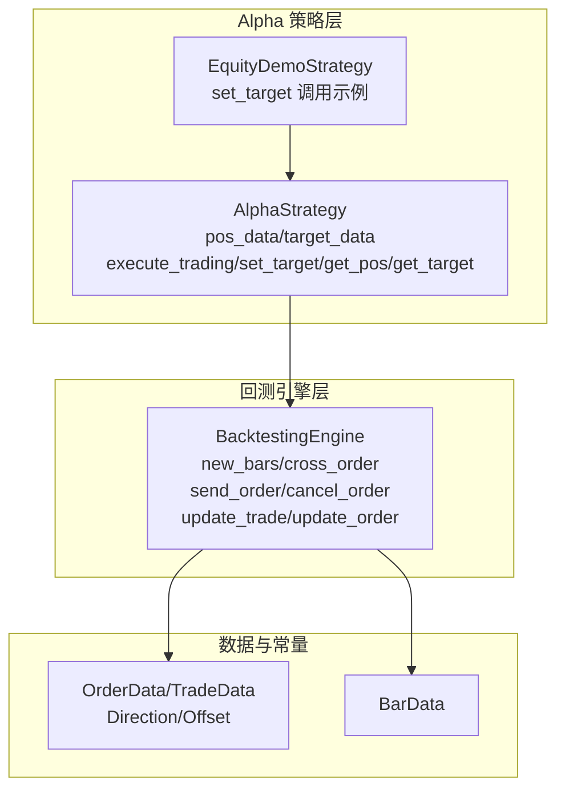
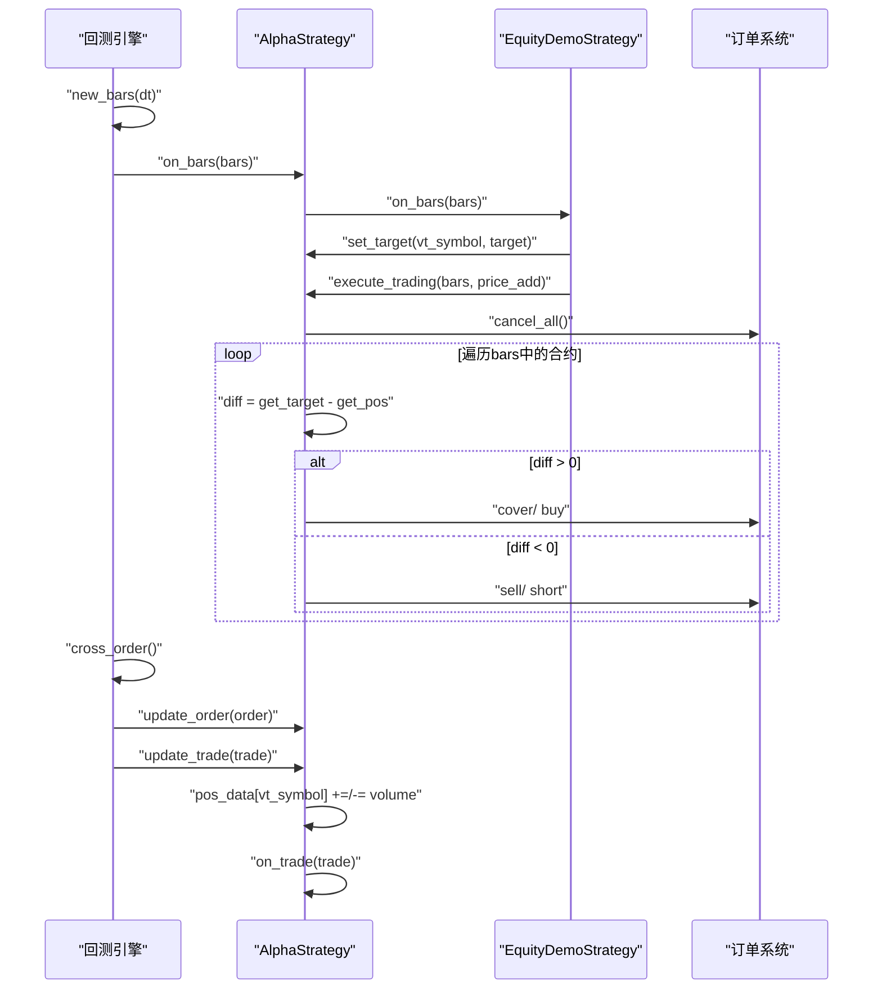
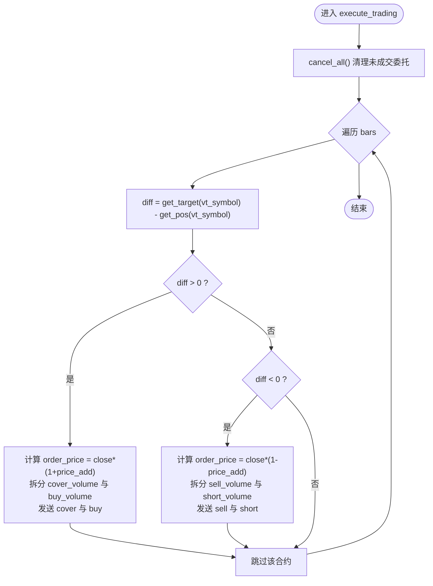
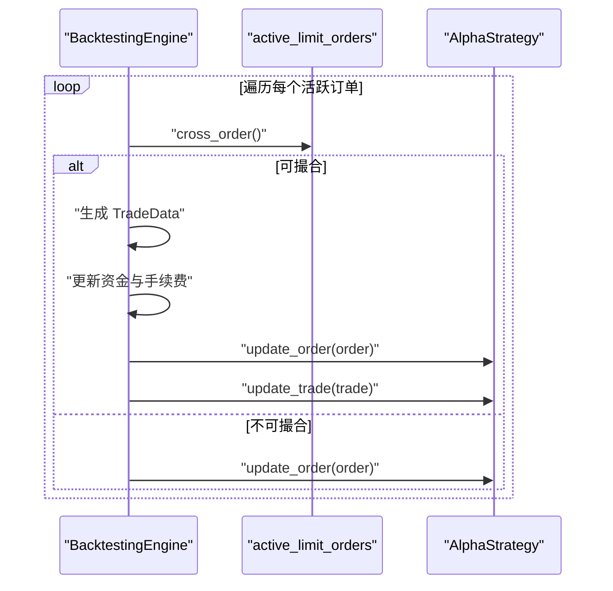
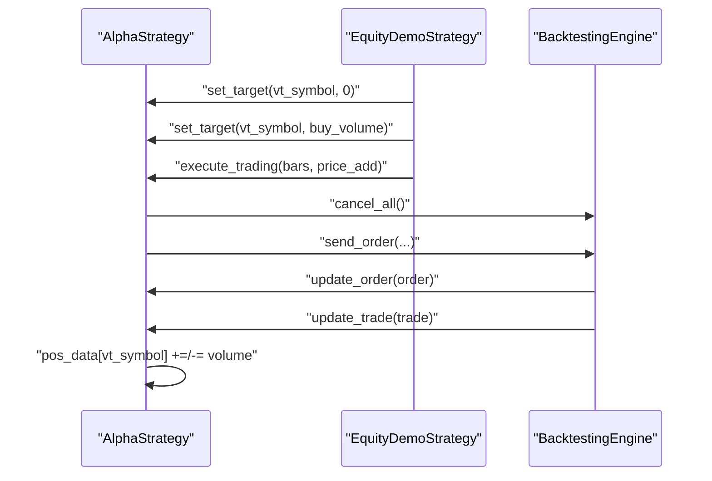
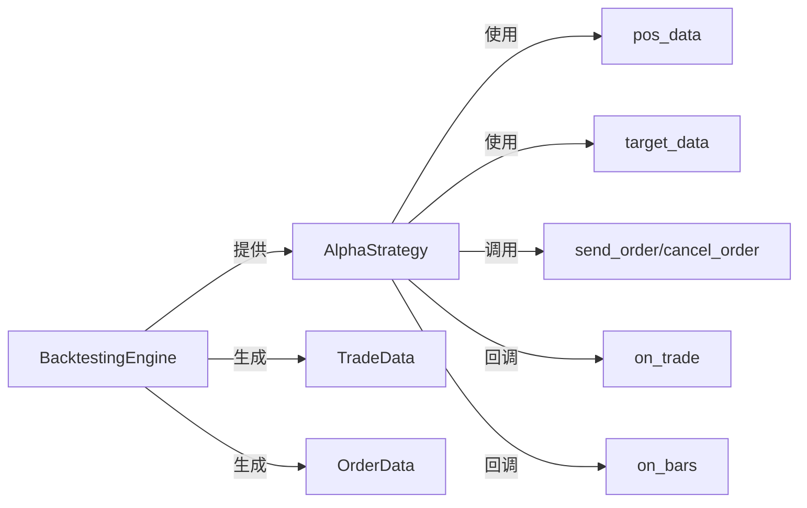

# 策略状态与仓位管理

<cite>
**本文引用的文件列表**
- [vnpy/alpha/strategy/template.py](file://vnpy/alpha/strategy/template.py)
- [vnpy/alpha/strategy/backtesting.py](file://vnpy/alpha/strategy/backtesting.py)
- [vnpy/alpha/strategy/strategies/equity_demo_strategy.py](file://vnpy/alpha/strategy/strategies/equity_demo_strategy.py)
</cite>

## 目录
1. [引言](#引言)
2. [项目结构](#项目结构)
3. [核心组件](#核心组件)
4. [架构总览](#架构总览)
5. [详细组件分析](#详细组件分析)
6. [依赖关系分析](#依赖关系分析)
7. [性能考量](#性能考量)
8. [故障排查指南](#故障排查指南)
9. [结论](#结论)

## 引言
本文件围绕 AlphaStrategy 的两大核心状态字典 pos_data 与 target_data 展开，系统阐述它们的设计原理、更新机制与使用模式；解释 update_trade 如何将成交回报同步为 pos_data 的只读镜像；说明 target_data 如何承载目标仓位并驱动 execute_trading 生成平仓与开仓指令；结合 equity_demo_strategy.py 中的 set_target 调用示例，演示动态调仓流程；并讨论状态一致性边界条件（如部分成交、撤单失败等）与自定义状态变量（如 holdings_days）的最佳实践。

## 项目结构
Alpha 模块的策略与回测引擎位于 alpha 子模块中，核心文件包括：
- 策略模板：AlphaStrategy（pos_data/target_data 定义与交易执行）
- 回测引擎：BacktestingEngine（订单撮合、成交回报、资金与持仓价值计算）
- 演示策略：EquityDemoStrategy（基于信号的动态调仓示例）

图表来源
- [vnpy/alpha/strategy/template.py](file://vnpy/alpha/strategy/template.py#L15-L206)
- [vnpy/alpha/strategy/backtesting.py](file://vnpy/alpha/strategy/backtesting.py#L580-L779)
- [vnpy/alpha/strategy/strategies/equity_demo_strategy.py](file://vnpy/alpha/strategy/strategies/equity_demo_strategy.py#L38-L102)

章节来源
- [vnpy/alpha/strategy/template.py](file://vnpy/alpha/strategy/template.py#L15-L206)
- [vnpy/alpha/strategy/backtesting.py](file://vnpy/alpha/strategy/backtesting.py#L580-L779)
- [vnpy/alpha/strategy/strategies/equity_demo_strategy.py](file://vnpy/alpha/strategy/strategies/equity_demo_strategy.py#L38-L102)

## 核心组件
- AlphaStrategy
  - pos_data：按 vt_symbol 维度记录实际持仓的只读镜像，默认值为 0，通过 update_trade 自动同步成交回报。
  - target_data：按 vt_symbol 维度记录目标仓位，策略通过 set_target 设定，execute_trading 基于与 pos_data 的差额生成指令。
  - update_trade：根据成交方向增减 pos_data，并回调 on_trade。
  - execute_trading：取消未成交委托后，按 bars 中存在的合约计算 pos 与 target 差额，生成 cover/buy/sell/short 等指令。
- BacktestingEngine
  - new_bars：推进时间、填充 bar、撮合限价单、生成 TradeData 并调用 strategy.update_trade。
  - send_order/cancel_order：创建 OrderData、维护 active_limit_orders、更新订单状态并回调 strategy.update_order。
  - update_daily_close：每日收盘价更新，用于收益计算。
- EquityDemoStrategy
  - on_bars：从 get_signal 获取信号，结合 pos_data 与自定义 holdings_days，计算卖出与买入标的，set_target 设置目标仓位，最后调用 execute_trading 执行。

章节来源
- [vnpy/alpha/strategy/template.py](file://vnpy/alpha/strategy/template.py#L15-L206)
- [vnpy/alpha/strategy/backtesting.py](file://vnpy/alpha/strategy/backtesting.py#L580-L779)
- [vnpy/alpha/strategy/strategies/equity_demo_strategy.py](file://vnpy/alpha/strategy/strategies/equity_demo_strategy.py#L38-L102)

## 架构总览
下面的时序图展示了从回测推进到策略下单再到成交回报更新的闭环流程，重点体现 pos_data 与 target_data 的协作与一致性维护。

图表来源
- [vnpy/alpha/strategy/backtesting.py](file://vnpy/alpha/strategy/backtesting.py#L580-L779)
- [vnpy/alpha/strategy/template.py](file://vnpy/alpha/strategy/template.py#L120-L186)
- [vnpy/alpha/strategy/strategies/equity_demo_strategy.py](file://vnpy/alpha/strategy/strategies/equity_demo_strategy.py#L38-L102)

## 详细组件分析

### AlphaStrategy：pos_data 与 target_data 的设计与使用
- 初始化与字段
  - pos_data：defaultdict(float)，记录实际持仓，仅通过 update_trade 增减，确保只读镜像的准确性。
  - target_data：defaultdict(float)，记录目标仓位，策略侧通过 set_target 修改，execute_trading 读取并据此生成指令。
- update_trade
  - 根据成交方向（多/空）对 pos_data 进行加减，随后回调 on_trade，便于策略侧做自定义处理（如 holdings_days 的维护）。
- execute_trading
  - 步骤一：cancel_all，清理未成交委托，避免旧指令干扰新调仓。
  - 步骤二：遍历 bars，仅对存在当前 bar 的合约进行调仓。
  - 步骤三：计算 diff = target - pos，正差表示需要加仓，负差表示需要减仓。
  - 步骤四：根据 pos 的符号与 diff 的正负组合，拆分为 cover/buy 或 sell/short 的体积，再发送对应指令。
  - 步骤五：指令价格采用 price_add 调整，避免滑点与市场冲击。
- 辅助方法
  - get_pos/get_target：读取 pos_data/target_data。
  - set_target：写入 target_data。
  - send_order/cancel_order/cancel_all：委托生命周期管理。

图表来源
- [vnpy/alpha/strategy/template.py](file://vnpy/alpha/strategy/template.py#L133-L186)

章节来源
- [vnpy/alpha/strategy/template.py](file://vnpy/alpha/strategy/template.py#L15-L206)

### 回测引擎：订单撮合与成交回报
- new_bars
  - 推进时间、填充 bar、调用 cross_order、触发策略 on_bars。
- cross_order
  - 对 active_limit_orders 按涨跌停与价格条件进行撮合，生成 TradeData，更新资金（含手续费），并调用 strategy.update_trade。
- send_order/cancel_order
  - send_order：创建 OrderData，加入 active_limit_orders，返回 vt_orderid。
  - cancel_order：若订单仍活跃则标记 CANCELLED 并更新 order 缓存。
- update_daily_close
  - 每日收盘价更新，用于收益计算。

图表来源
- [vnpy/alpha/strategy/backtesting.py](file://vnpy/alpha/strategy/backtesting.py#L619-L708)
- [vnpy/alpha/strategy/backtesting.py](file://vnpy/alpha/strategy/backtesting.py#L723-L763)

章节来源
- [vnpy/alpha/strategy/backtesting.py](file://vnpy/alpha/strategy/backtesting.py#L580-L779)

### 动态调仓示例：EquityDemoStrategy 中的 set_target 与 execute_trading
- on_bars 流程要点
  - 从 get_signal 获取最新信号并排序，确定候选池与卖出池。
  - 基于 holdings_days 与最小持有期过滤卖出标的。
  - 计算可用现金，设置目标为 0 并更新 cash。
  - 买入池：按可用资金与最小交易单位计算目标仓位并 set_target。
  - 最后调用 execute_trading，基于 target_data 与 pos_data 的差异生成指令。
- 自定义状态变量 holdings_days
  - 在 on_init 初始化为 defaultdict(int)。
  - 在 on_trade 中当卖出成交时移除对应键，避免重复计数。
  - 在 on_bars 中对当前持仓合约递增持有天数，用于策略层面的锁仓控制。

图表来源
- [vnpy/alpha/strategy/strategies/equity_demo_strategy.py](file://vnpy/alpha/strategy/strategies/equity_demo_strategy.py#L38-L102)
- [vnpy/alpha/strategy/template.py](file://vnpy/alpha/strategy/template.py#L120-L186)
- [vnpy/alpha/strategy/backtesting.py](file://vnpy/alpha/strategy/backtesting.py#L619-L708)

章节来源
- [vnpy/alpha/strategy/strategies/equity_demo_strategy.py](file://vnpy/alpha/strategy/strategies/equity_demo_strategy.py#L38-L102)
- [vnpy/alpha/strategy/template.py](file://vnpy/alpha/strategy/template.py#L120-L186)
- [vnpy/alpha/strategy/backtesting.py](file://vnpy/alpha/strategy/backtesting.py#L619-L708)

### 状态一致性与边界条件处理
- 订单部分成交
  - 回测引擎在 cross_order 中按 bar 的高低价与涨跌停限制判断是否成交，若未完全成交，订单状态会更新为已成交但仍有未成交部分（由策略侧自行判断）。建议在策略侧通过 active_orderids 与 update_order 的回调，结合订单剩余量进行二次调仓。
- 撤单失败
  - cancel_order 仅对 active_limit_orders 中的订单生效；若订单已成交或不存在，将直接返回。策略侧应避免对已结束订单重复撤单。
- 指令价格与滑点
  - execute_trading 通过 price_add 上浮/下浮指令价格，降低滑点影响；同时回测引擎按最优档位与涨跌停约束撮合，确保公平性。
- 现金与手续费
  - 回测引擎在成交后扣除成交额与相应费率，cash 变动直接影响可用资金；策略侧可通过 get_cash_available 获取实时可用资金，避免超买。
- 持仓符号与方向
  - 当 pos < 0 时，diff > 0 需先 cover 平仓再 buy 开仓；当 pos > 0 时，diff < 0 需先 sell 平仓再 short 开仓。此分支逻辑确保调仓方向正确。

章节来源
- [vnpy/alpha/strategy/backtesting.py](file://vnpy/alpha/strategy/backtesting.py#L619-L708)
- [vnpy/alpha/strategy/backtesting.py](file://vnpy/alpha/strategy/backtesting.py#L723-L763)
- [vnpy/alpha/strategy/template.py](file://vnpy/alpha/strategy/template.py#L133-L186)

### 自定义状态变量最佳实践：holdings_days
- 初始化
  - 在 on_init 中初始化为 defaultdict(int)，避免键缺失导致的 KeyError。
- 更新策略
  - 在 on_bars 中对当前持仓合约递增持有天数，形成“日计数”。
  - 在 on_trade 中当发生卖出成交时移除对应键，避免对已清仓合约继续计数。
- 使用建议
  - 将最小持有期与目标池筛选结合，避免短期频繁交易。
  - 与 execute_trading 的调用顺序配合，确保在 set_target 之前完成持有期判断。

章节来源
- [vnpy/alpha/strategy/strategies/equity_demo_strategy.py](file://vnpy/alpha/strategy/strategies/equity_demo_strategy.py#L25-L40)
- [vnpy/alpha/strategy/strategies/equity_demo_strategy.py](file://vnpy/alpha/strategy/strategies/equity_demo_strategy.py#L38-L102)

## 依赖关系分析
- AlphaStrategy 依赖 BacktestingEngine 提供的订单生命周期与成交回报。
- BacktestingEngine 依赖 BarData、OrderData、TradeData 等基础数据结构。
- EquityDemoStrategy 继承 AlphaStrategy，扩展自定义状态与信号驱动的调仓逻辑。

图表来源
- [vnpy/alpha/strategy/template.py](file://vnpy/alpha/strategy/template.py#L15-L206)
- [vnpy/alpha/strategy/backtesting.py](file://vnpy/alpha/strategy/backtesting.py#L580-L779)

章节来源
- [vnpy/alpha/strategy/template.py](file://vnpy/alpha/strategy/template.py#L15-L206)
- [vnpy/alpha/strategy/backtesting.py](file://vnpy/alpha/strategy/backtesting.py#L580-L779)

## 性能考量
- 字典访问与默认值
  - pos_data/target_data 使用 defaultdict(float)，读取不存在键时返回 0，避免显式初始化开销。
- 执行路径优化
  - execute_trading 仅对存在当前 bar 的合约生成指令，减少无效下单。
  - cancel_all 在每次调仓前统一清理，避免历史指令堆积。
- 回测撮合效率
  - cross_order 仅遍历 active_limit_orders，按涨跌停与价格快速判断，提高回测吞吐。

[本节为通用性能讨论，不直接分析具体文件]

## 故障排查指南
- 症状：set_target 后未见指令
  - 检查 bars 中是否存在该合约的 bar；execute_trading 仅对存在当前 bar 的合约生成指令。
  - 确认 diff 是否为 0（pos == target），此时不会生成指令。
- 症状：指令频繁撤单
  - 检查 cancel_all 是否在 on_bars 末尾被调用；确认策略侧未重复下单同一合约。
- 症状：资金不足或超买
  - 使用 get_cash_available 获取可用资金，结合最小交易单位与手续费估算后再 set_target。
- 症状：部分成交导致状态不一致
  - 策略侧应依据 update_order 的回调与 active_orderids，对未成交部分进行补单或重新计算目标。
- 症状：最小持有期逻辑失效
  - 确保 on_trade 中在卖出成交时移除 holdings_days 键，且 on_bars 中对当前持仓递增。

章节来源
- [vnpy/alpha/strategy/template.py](file://vnpy/alpha/strategy/template.py#L120-L186)
- [vnpy/alpha/strategy/backtesting.py](file://vnpy/alpha/strategy/backtesting.py#L619-L708)
- [vnpy/alpha/strategy/strategies/equity_demo_strategy.py](file://vnpy/alpha/strategy/strategies/equity_demo_strategy.py#L38-L102)

## 结论
- pos_data 是基于成交回报的只读镜像，通过 update_trade 自动同步，确保策略侧读取的持仓始终与回测引擎一致。
- target_data 承载目标仓位，策略通过 set_target 设定，execute_trading 基于 pos 与 target 的差异生成平仓与开仓指令，形成“目标—执行”的闭环。
- 回测引擎负责订单撮合、成交回报与资金变动，保障调仓过程的公平性与一致性。
- 在异常场景（部分成交、撤单失败）与自定义状态（如 holdings_days）方面，建议通过回调与状态机设计实现稳健的状态一致性与可维护性。