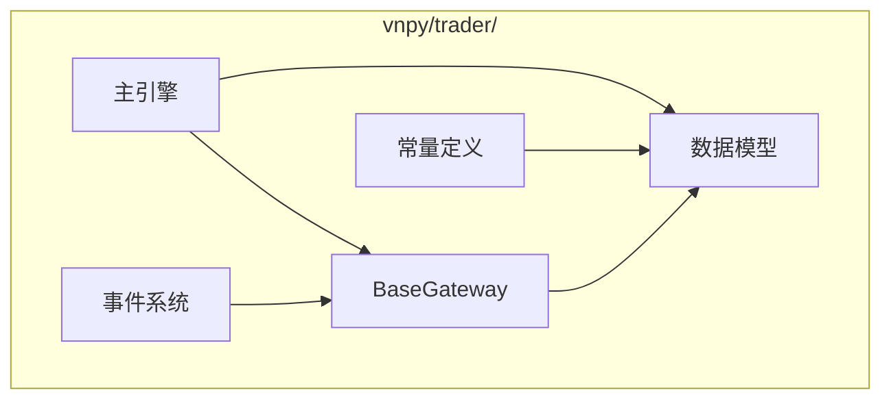
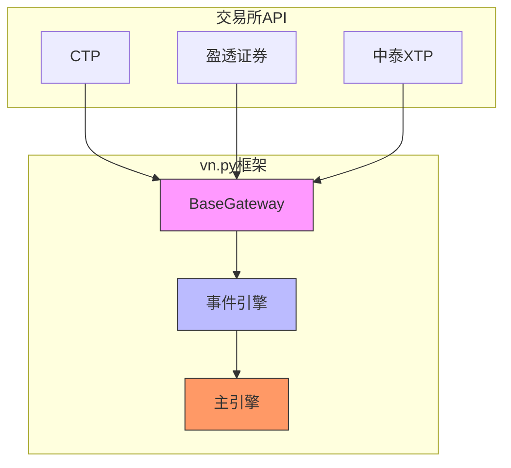
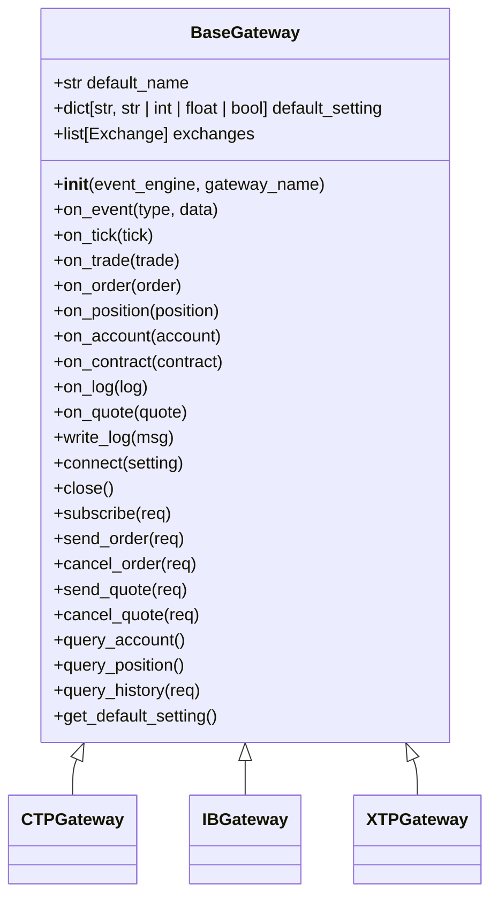
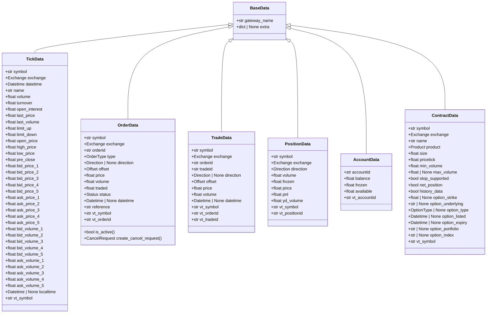
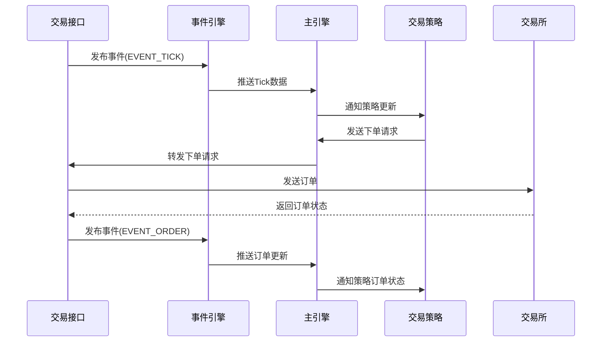
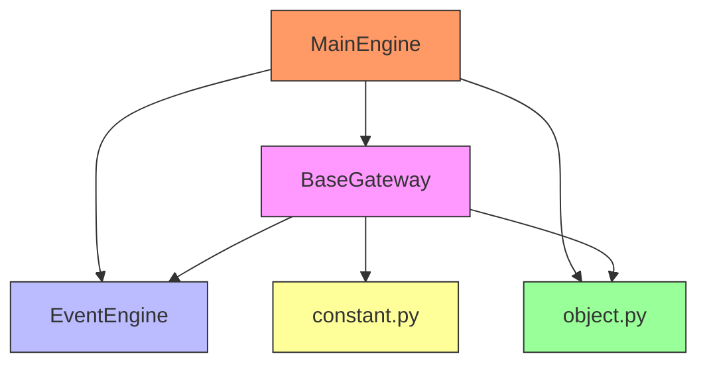

# 交易接口

<cite>
**本文档引用的文件**
- [gateway.py](file://vnpy/trader/gateway.py#L1-L273)
- [object.py](file://vnpy/trader/object.py#L1-L428)
- [engine.py](file://vnpy/trader/engine.py#L1-L200)
- [constant.py](file://vnpy/trader/constant.py#L1-L161)
- [event.py](file://vnpy/trader/event.py#L1-L15)
</cite>

## 目录
1. [引言](#引言)
2. [项目结构](#项目结构)
3. [核心组件](#核心组件)
4. [架构概述](#架构概述)
5. [详细组件分析](#详细组件分析)
6. [依赖分析](#依赖分析)
7. [性能考虑](#性能考虑)
8. [故障排除指南](#故障排除指南)
9. [结论](#结论)

## 引言
vn.py是一个开源的量化交易框架，其交易接口（Gateway）体系作为连接交易所API的适配层，为用户提供了一个统一的交易接口。本文档全面文档化vn.py的交易接口体系，解释其设计原理、接口规范、状态管理机制以及如何开发新的Gateway。

## 项目结构
vn.py项目的交易接口相关代码主要位于`vnpy/trader/`目录下，核心文件包括gateway.py、object.py、engine.py等。这些文件共同构成了交易接口的基础架构。

**图表来源**
- [gateway.py](file://vnpy/trader/gateway.py#L1-L273)
- [object.py](file://vnpy/trader/object.py#L1-L428)
- [engine.py](file://vnpy/trader/engine.py#L1-L200)

**章节来源**
- [gateway.py](file://vnpy/trader/gateway.py#L1-L273)
- [object.py](file://vnpy/trader/object.py#L1-L428)

## 核心组件
交易接口体系的核心组件包括抽象基类BaseGateway、各种数据模型（如TickData、OrderData等）、事件系统以及主引擎。这些组件协同工作，实现了与交易所API的通信和数据标准化。

**章节来源**
- [gateway.py](file://vnpy/trader/gateway.py#L1-L273)
- [object.py](file://vnpy/trader/object.py#L1-L428)

## 架构概述
vn.py的交易接口采用适配器模式设计，通过BaseGateway抽象基类定义统一的接口规范，具体的交易所接口继承该基类并实现具体功能。数据流通过事件系统进行传递，实现了松耦合的设计。

**图表来源**
- [gateway.py](file://vnpy/trader/gateway.py#L1-L273)
- [engine.py](file://vnpy/trader/engine.py#L1-L200)

## 详细组件分析

### BaseGateway抽象基类分析
BaseGateway是所有交易接口的抽象基类，定义了连接、订阅、下单等核心方法的接口规范。它确保了不同交易所接口的一致性。

**图表来源**
- [gateway.py](file://vnpy/trader/gateway.py#L33-L273)

**章节来源**
- [gateway.py](file://vnpy/trader/gateway.py#L33-L273)

### 数据模型分析
vn.py定义了一系列标准化的数据模型，用于在系统内部传递行情和交易数据。这些模型确保了数据格式的一致性。

**图表来源**
- [object.py](file://vnpy/trader/object.py#L17-L304)

**章节来源**
- [object.py](file://vnpy/trader/object.py#L17-L304)

### 事件系统分析
事件系统是vn.py的核心通信机制，通过发布-订阅模式实现组件间的解耦。交易接口通过事件系统向主引擎推送各种数据更新。

**图表来源**
- [gateway.py](file://vnpy/trader/gateway.py#L86-L158)
- [event.py](file://vnpy/trader/event.py#L1-L15)
- [engine.py](file://vnpy/trader/engine.py#L223-L254)

**章节来源**
- [gateway.py](file://vnpy/trader/gateway.py#L86-L158)
- [event.py](file://vnpy/trader/event.py#L1-L15)
- [engine.py](file://vnpy/trader/engine.py#L223-L254)

## 依赖分析
交易接口体系依赖于多个核心模块，包括事件引擎、数据模型、常量定义等。这些依赖关系确保了系统的稳定性和可扩展性。

**图表来源**
- [gateway.py](file://vnpy/trader/gateway.py#L1-L273)
- [engine.py](file://vnpy/trader/engine.py#L1-L200)
- [object.py](file://vnpy/trader/object.py#L1-L428)
- [constant.py](file://vnpy/trader/constant.py#L1-L161)

**章节来源**
- [gateway.py](file://vnpy/trader/gateway.py#L1-L273)
- [engine.py](file://vnpy/trader/engine.py#L1-L200)

## 性能考虑
交易接口的设计充分考虑了性能因素，包括线程安全、非阻塞操作、自动重连等特性。这些设计确保了系统在高并发场景下的稳定运行。

## 故障排除指南
当交易接口出现问题时，可以通过查看日志、检查网络连接、验证认证信息等方式进行排查。系统提供了详细的日志记录功能，有助于快速定位问题。

**章节来源**
- [gateway.py](file://vnpy/trader/gateway.py#L153-L158)
- [engine.py](file://vnpy/trader/engine.py#L160-L167)

## 结论
vn.py的交易接口体系通过抽象基类设计、标准化数据模型和事件驱动架构，为用户提供了一个强大而灵活的交易接入方案。其模块化设计使得扩展新的交易所接口变得简单高效，同时保证了系统的稳定性和可维护性。