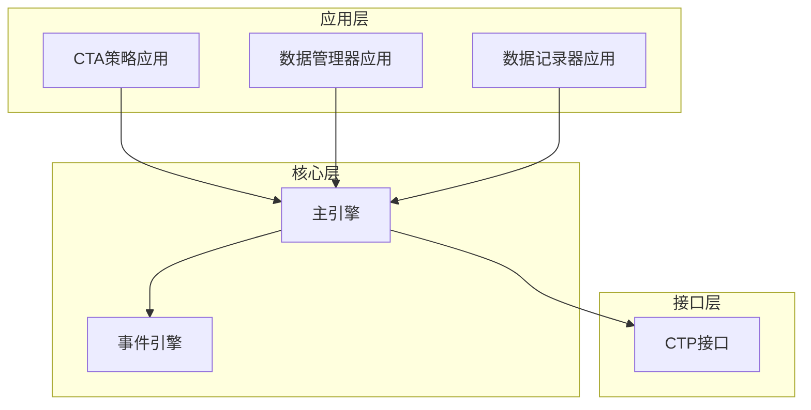
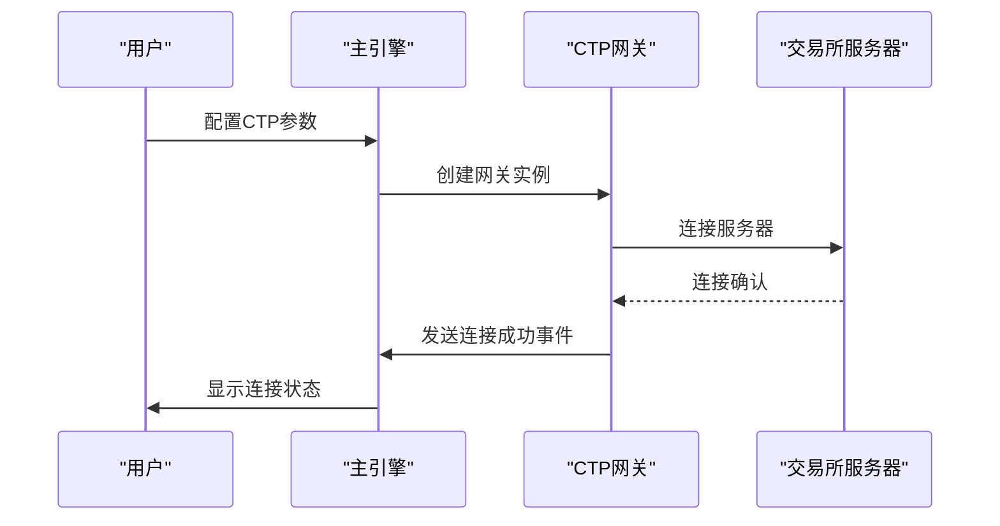
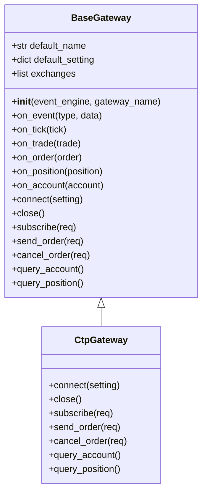
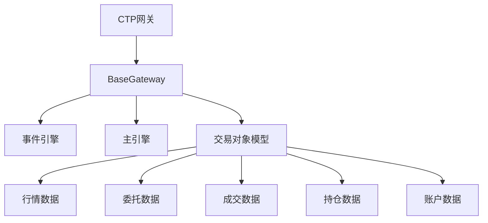

# CTP接口

<cite>
**本文档引用的文件**
- [gateway.md](file://docs/community/info/gateway.md)
- [gateway.py](file://vnpy/trader/gateway.py)
- [run.py](file://examples/veighna_trader/run.py)
- [data_recorder.py](file://examples/data_recorder/data_recorder.py)
- [no_ui/run.py](file://examples/no_ui/run.py)
- [windows_install.md](file://docs/community/install/windows_install.md)
- [ubuntu_install.md](file://docs/community/install/ubuntu_install.md)
</cite>

## 目录
1. [简介](#简介)
2. [项目结构](#项目结构)
3. [核心组件](#核心组件)
4. [架构概述](#架构概述)
5. [详细组件分析](#详细组件分析)
6. [依赖分析](#依赖分析)
7. [性能考虑](#性能考虑)
8. [故障排除指南](#故障排除指南)
9. [结论](#结论)

## 简介
本文档详细说明了vn.py框架中CTP接口的配置与使用方法。CTP接口是中国金融期货交易所（CFFEX）提供的交易接口，支持期货和期货期权的交易。文档涵盖了接口支持的交易品种、操作系统兼容性、双向持仓模式等关键特性，并详细解释了接口配置中的各个字段含义及配置方法。

## 项目结构
vn.py项目的CTP接口实现遵循清晰的模块化结构，主要包含交易接口、应用模块和工具组件三个部分。CTP接口作为核心交易通道，与其他应用模块如CTA策略、数据管理器等协同工作，构成了完整的量化交易系统。



**图表来源**
- [run.py](file://examples/veighna_trader/run.py#L39-L87)
- [data_recorder.py](file://examples/data_recorder/data_recorder.py#L1-L146)

**本节来源**
- [run.py](file://examples/veighna_trader/run.py#L1-L88)
- [data_recorder.py](file://examples/data_recorder/data_recorder.py#L1-L146)

## 核心组件
CTP接口的核心组件包括连接配置、交易功能和行情订阅等。通过BaseGateway抽象类实现，CTPGateway继承并实现了具体的连接和交易逻辑。接口支持期货和期货期权交易，兼容Windows和Ubuntu操作系统，并采用双向持仓模式。

**本节来源**
- [gateway.md](file://docs/community/info/gateway.md#L79-L111)
- [gateway.py](file://vnpy/trader/gateway.py#L33-L273)

## 架构概述
CTP接口的架构设计基于事件驱动模式，通过主引擎协调各个组件的工作。当用户配置CTP接口参数后，主引擎会创建CTP网关实例并建立与交易所服务器的连接。交易指令和行情数据通过事件引擎在各个组件间传递，实现了松耦合的系统架构。



**图表来源**
- [gateway.py](file://vnpy/trader/gateway.py#L160-L179)
- [no_ui/run.py](file://examples/no_ui/run.py#L56-L94)

**本节来源**
- [gateway.py](file://vnpy/trader/gateway.py#L1-L273)
- [no_ui/run.py](file://examples/no_ui/run.py#L1-L126)

## 详细组件分析

### CTP网关实现分析
CTP网关的实现基于BaseGateway抽象类，遵循统一的接口规范。网关通过connect方法建立与服务器的连接，并在连接成功后自动查询账户信息、持仓情况、委托订单等数据。

#### 类结构分析


**图表来源**
- [gateway.py](file://vnpy/trader/gateway.py#L33-L273)

**本节来源**
- [gateway.py](file://vnpy/trader/gateway.py#L33-L273)
- [gateway.md](file://docs/community/info/gateway.md#L79-L111)

### 配置参数详解
CTP接口的配置参数包括用户名、密码、经纪商代码、交易服务器、行情服务器、产品名称和授权编码等字段，每个字段都有特定的含义和配置要求。

| 参数 | 说明 | 示例值 |
|------|------|--------|
| 用户名 | 交易账户的登录名 | 888888 |
| 密码 | 交易账户的密码 | 123456 |
| 经纪商代码 | 期货公司的代码 | 9999 |
| 交易服务器 | 交易服务器的地址和端口 | 180.168.146.187:10201 |
| 行情服务器 | 行情服务器的地址和端口 | 180.168.146.187:10211 |
| 产品名称 | 客户端产品的名称标识 | simnow_client_test |
| 授权编码 | 接口使用的授权码 | 0000000000000000 |

**本节来源**
- [gateway.md](file://docs/community/info/gateway.md#L98-L105)
- [data_recorder.py](file://examples/data_recorder/data_recorder.py#L34-L41)

## 依赖分析
CTP接口的实现依赖于vn.py框架的核心组件，包括事件引擎、主引擎和交易对象模型。这些组件共同构成了量化交易系统的基础架构。



**图表来源**
- [gateway.py](file://vnpy/trader/gateway.py#L3-L30)
- [gateway.py](file://vnpy/trader/gateway.py#L33-L273)

**本节来源**
- [gateway.py](file://vnpy/trader/gateway.py#L1-L273)

## 性能考虑
CTP接口的性能主要受网络延迟和服务器响应速度的影响。为确保交易指令的及时执行，建议使用稳定的网络连接，并选择离交易所服务器地理位置较近的网络接入点。同时，系统设计上采用了非阻塞的异步通信模式，确保了高并发下的稳定运行。

## 故障排除指南
### 穿透式认证配置问题
穿透式认证是CTP接口连接的必要条件。如果出现连接失败，首先检查是否已完成穿透式认证的配置。确保经纪商代码、产品名称和授权编码等参数正确无误。

### 网络超时处理
网络超时是CTP接口常见的问题之一。建议：
1. 检查网络连接是否稳定
2. 确认防火墙没有阻止相关端口
3. 尝试更换网络环境
4. 增加连接超时时间设置

### 操作系统兼容性问题
在Ubuntu系统上使用CTP接口时，可能遇到中文编码问题。可通过以下命令解决：
```bash
sudo locale-gen zh_CN.GB18030
sudo apt-get install -y fonts-noto-cjk fonts-wqy-zenhei fonts-wqy-microhei
```

**本节来源**
- [ubuntu_install.md](file://docs/community/install/ubuntu_install.md#L97-L116)
- [gateway.md](file://docs/community/info/gateway.md#L108-L110)

## 结论
CTP接口作为vn.py框架的核心交易通道，提供了稳定可靠的期货和期货期权交易功能。通过合理的配置和使用，用户可以在Windows和Ubuntu系统上实现高效的量化交易。文档中提供的配置示例和故障排除方法，有助于用户快速上手并解决常见问题。