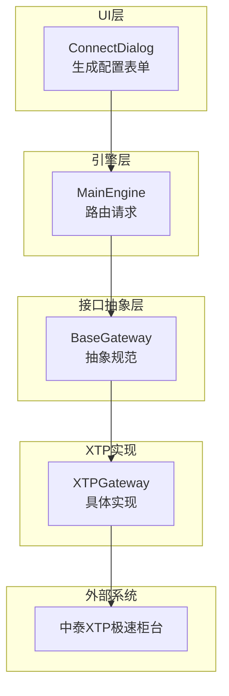
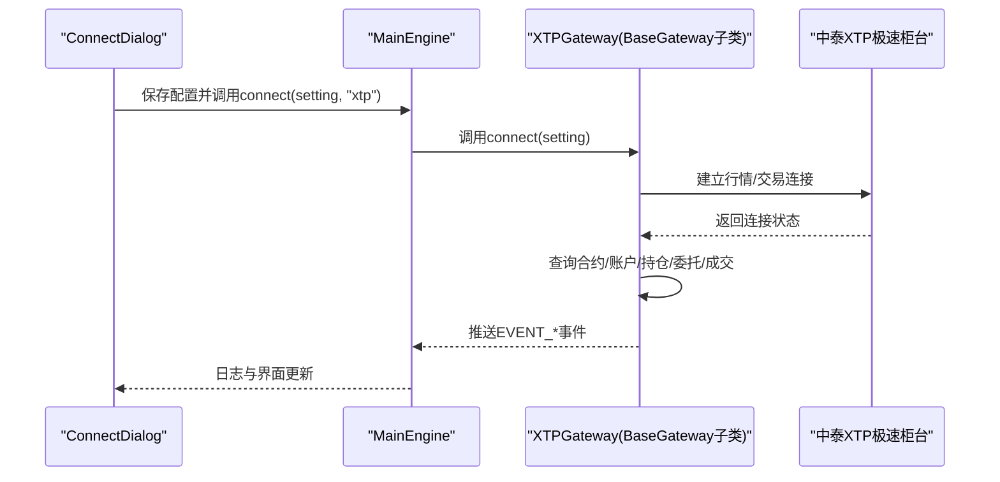
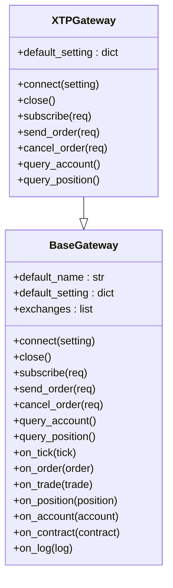
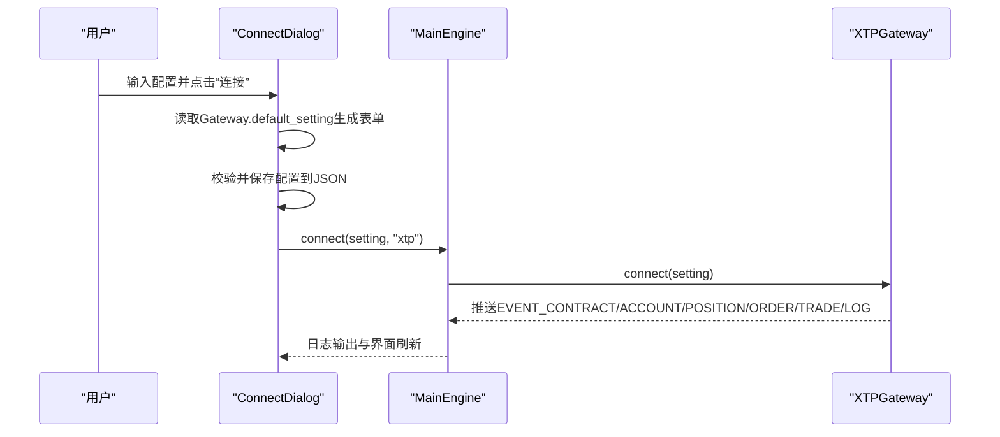
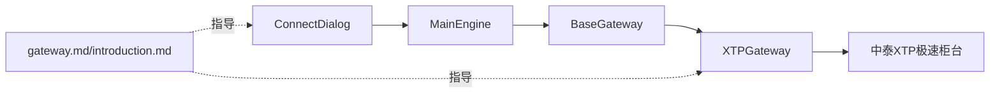

# 中泰XTP接口

<cite>
**本文引用的文件**
- [gateway.py](file://vnpy/trader/gateway.py)
- [engine.py](file://vnpy/trader/engine.py)
- [widget.py](file://vnpy/trader/ui/widget.py)
- [gateway.md](file://docs/community/info/gateway.md)
- [introduction.md](file://docs/community/info/introduction.md)
- [run.py](file://examples/veighna_trader/run.py)
</cite>

## 目录
1. [简介](#简介)
2. [项目结构](#项目结构)
3. [核心组件](#核心组件)
4. [架构总览](#架构总览)
5. [详细组件分析](#详细组件分析)
6. [依赖关系分析](#依赖关系分析)
7. [性能与特性](#性能与特性)
8. [故障排查指南](#故障排查指南)
9. [结论](#结论)
10. [附录](#附录)

## 简介
本文件面向希望在vn.py平台上使用中泰XTP极速柜台接口的用户，系统化地说明XTP接口支持的交易品种（A股、两融、ETF期权）、操作系统兼容性（Windows、Ubuntu）、混合持仓模式（股票单向、其他双向）、关键配置字段（账号、密码、客户号、行情/交易地址与端口、行情协议、日志级别、授权码）的含义与配置方法；并结合gateway.py中的BaseGateway抽象类，阐述XTPGateway的实现机制与连接流程。文末提供通过中泰证券申请测试账号的流程指引、实际配置示例与常见连接问题的解决方案。

## 项目结构
围绕XTP接口的相关代码与文档分布如下：
- 接口抽象层：BaseGateway定义了统一的连接、订阅、下单、撤单、查询等接口规范，XTPGateway需遵循这些约定。
- 引擎层：MainEngine负责接收用户请求并转发给具体Gateway实现。
- UI层：ConnectDialog根据Gateway提供的默认配置动态生成表单，收集用户输入并保存为JSON，随后调用MainEngine.connect触发连接。
- 文档层：gateway.md与introduction.md明确XTP支持的交易品种、操作系统、持仓方向、字段说明与测试账号申请方式。

图表来源
- [gateway.py](file://vnpy/trader/gateway.py#L33-L273)
- [engine.py](file://vnpy/trader/engine.py#L213-L275)
- [widget.py](file://vnpy/trader/ui/widget.py#L587-L701)

章节来源
- [gateway.py](file://vnpy/trader/gateway.py#L33-L273)
- [engine.py](file://vnpy/trader/engine.py#L213-L275)
- [widget.py](file://vnpy/trader/ui/widget.py#L587-L701)
- [gateway.md](file://docs/community/info/gateway.md#L372-L412)
- [introduction.md](file://docs/community/info/introduction.md#L26-L85)

## 核心组件
- BaseGateway（接口抽象）
  - 规定连接、关闭、订阅、下单、撤单、查询账户/持仓/历史等方法签名与回调事件推送机制。
  - 提供默认配置字典default_setting，用于UI层自动生成表单字段。
- MainEngine（引擎）
  - 将UI层传入的配置字典转发给指定Gateway的connect方法，完成连接生命周期管理。
- ConnectDialog（UI）
  - 依据Gateway.default_setting动态渲染字段，收集用户输入并保存为JSON，再调用MainEngine.connect。
- XTPGateway（实现）
  - 遵循BaseGateway规范，完成与中泰XTP极速柜台的连接、行情订阅、委托下单、撤单、账户/持仓/合约查询等。

章节来源
- [gateway.py](file://vnpy/trader/gateway.py#L33-L273)
- [engine.py](file://vnpy/trader/engine.py#L213-L275)
- [widget.py](file://vnpy/trader/ui/widget.py#L587-L701)

## 架构总览
XTPGateway的实现遵循vn.py的“抽象接口+具体实现+引擎调度+UI交互”的分层设计。UI层通过ConnectDialog收集配置，引擎层通过MainEngine将请求分发至XTPGateway，后者完成与中泰XTP的连接与数据交互。

图表来源
- [engine.py](file://vnpy/trader/engine.py#L213-L275)
- [gateway.py](file://vnpy/trader/gateway.py#L160-L273)
- [widget.py](file://vnpy/trader/ui/widget.py#L587-L701)

## 详细组件分析

### XTP接口支持范围与字段说明
- 操作系统兼容性：Windows、Ubuntu
- 交易品种：A股、两融、ETF期权
- 持仓方向：股票仅支持单向；其余标的支持双向
- 历史数据：不提供
- 关键配置字段（来自文档）：
  - 账号、密码、客户号、行情地址、行情端口、交易地址、交易端口、行情协议（TCP/UDP）、日志级别（FATAL/ERROR/WARNING/INFO/DEBUG/TRACE）、授权码
- 获取测试账号：通过中泰证券申请

章节来源
- [gateway.md](file://docs/community/info/gateway.md#L372-L412)
- [introduction.md](file://docs/community/info/introduction.md#L26-L85)

### BaseGateway抽象类与XTPGateway实现机制
- 抽象职责
  - 连接/关闭：建立与外部系统的连接，断线重连，查询账户、持仓、合约、委托、成交等。
  - 订阅/回调：订阅行情，推送Tick/Order/Trade/Position/Account/Contract/Quote/Log等事件。
  - 下单/撤单/报价：封装请求、分配本地订单号、发送至外部系统、回推状态。
- XTPGateway实现要点
  - 必须实现connect/close/subscribe/send_order/cancel_order/query_account/query_position等方法。
  - 在connect中完成与中泰XTP的握手、登录、订阅、查询等初始化流程，并通过on_*系列方法推送事件。
  - 默认配置default_setting由XTPGateway提供，UI层据此生成表单字段。

图表来源
- [gateway.py](file://vnpy/trader/gateway.py#L33-L273)

章节来源
- [gateway.py](file://vnpy/trader/gateway.py#L33-L273)

### 连接流程与UI交互
- UI层
  - ConnectDialog根据Gateway.default_setting生成表单字段，收集用户输入，保存为JSON文件，调用MainEngine.connect。
- 引擎层
  - MainEngine.get_gateway获取XTPGateway实例，调用其connect(setting)。
- Gateway层
  - XTPGateway内部完成与中泰XTP的连接、登录、订阅、查询等，并通过on_*回调推送事件。

图表来源
- [widget.py](file://vnpy/trader/ui/widget.py#L587-L701)
- [engine.py](file://vnpy/trader/engine.py#L213-L275)
- [gateway.py](file://vnpy/trader/gateway.py#L160-L273)

章节来源
- [widget.py](file://vnpy/trader/ui/widget.py#L587-L701)
- [engine.py](file://vnpy/trader/engine.py#L213-L275)
- [gateway.py](file://vnpy/trader/gateway.py#L160-L273)

### 配置字段详解与示例
- 字段含义（来自文档）
  - 账号：交易账号
  - 密码：交易密码
  - 客户号：客户编号（默认值为1）
  - 行情地址：行情服务器IP
  - 行情端口：行情服务器端口（默认0）
  - 交易地址：交易服务器IP
  - 交易端口：交易服务器端口（默认0）
  - 行情协议：TCP/UDP
  - 日志级别：FATAL/ERROR/WARNING/INFO/DEBUG/TRACE
  - 授权码：授权编码
- 示例（以路径代替具体值）
  - 配置文件位置参考：connect_xtp.json（由UI层按“connect_{gateway_name}.json”命名保存）
  - 示例路径参考：[connect_xtp.json](file://examples/veighna_trader/connect_xtp.json)
- 启用XTPGateway（示例）
  - 在启动脚本中启用XTPGateway：[run.py](file://examples/veighna_trader/run.py#L1-L88)，将XtpGateway加入MainEngine

章节来源
- [gateway.md](file://docs/community/info/gateway.md#L392-L404)
- [run.py](file://examples/veighna_trader/run.py#L1-L88)

### 混合持仓模式说明
- 股票仅支持单向持仓
- 其余标的（两融、ETF期权等）支持双向持仓
- 该规则由XTP接口支持范围决定，用户在策略或交易逻辑中应遵守

章节来源
- [gateway.md](file://docs/community/info/gateway.md#L385-L388)

### 申请测试账号流程
- 通过中泰证券申请测试账号
- 申请入口与流程以中泰证券官方要求为准

章节来源
- [gateway.md](file://docs/community/info/gateway.md#L405-L408)

## 依赖关系分析
- UI层依赖引擎层：ConnectDialog通过MainEngine.connect发起连接。
- 引擎层依赖接口抽象层：MainEngine调用BaseGateway的抽象方法。
- 接口实现依赖外部系统：XTPGateway与中泰XTP极速柜台交互。
- 文档层指导字段与支持范围：gateway.md与introduction.md提供配置与支持信息。

图表来源
- [widget.py](file://vnpy/trader/ui/widget.py#L587-L701)
- [engine.py](file://vnpy/trader/engine.py#L213-L275)
- [gateway.py](file://vnpy/trader/gateway.py#L33-L273)
- [gateway.md](file://docs/community/info/gateway.md#L372-L412)
- [introduction.md](file://docs/community/info/introduction.md#L26-L85)

章节来源
- [widget.py](file://vnpy/trader/ui/widget.py#L587-L701)
- [engine.py](file://vnpy/trader/engine.py#L213-L275)
- [gateway.py](file://vnpy/trader/gateway.py#L33-L273)
- [gateway.md](file://docs/community/info/gateway.md#L372-L412)
- [introduction.md](file://docs/community/info/introduction.md#L26-L85)

## 性能与特性
- XTP是首家提供融资融券的极速柜台，具备低延迟、高吞吐的交易能力，适合高频与两融场景。
- 该特性由文档明确指出，用户在选择XTP时可优先考虑其在两融领域的技术优势。

章节来源
- [gateway.md](file://docs/community/info/gateway.md#L409-L412)

## 故障排查指南
- 常见连接问题与定位思路
  - 配置字段错误：检查账号、密码、客户号、行情/交易地址与端口、协议、授权码是否正确。
  - 端口/网络异常：确认服务器可达性与防火墙放通。
  - 日志级别：适当提高日志级别（如INFO/DEBUG）以便捕获更多细节。
  - 断线重连：确保Gateway实现具备自动重连机制。
- 通用排查步骤
  - 在UI层查看日志输出，确认MainEngine与XTPGateway回调是否正常推送EVENT_*事件。
  - 核对connect_xtp.json配置文件是否正确保存与加载。
  - 若出现“找不到合约”等初始化问题，先通过“查询合约”功能确认合约列表已加载。

章节来源
- [widget.py](file://vnpy/trader/ui/widget.py#L587-L701)
- [engine.py](file://vnpy/trader/engine.py#L213-L275)
- [gateway.md](file://docs/community/info/gateway.md#L392-L404)

## 结论
XTP接口在vn.py平台上的集成遵循统一的抽象与分层设计：UI层负责配置收集，引擎层负责调度，接口实现负责与中泰XTP交互。其支持A股、两融、ETF期权，兼容Windows与Ubuntu，且在两融领域具备技术优势。用户可通过中泰证券申请测试账号，并按照文档字段说明完成配置。遇到连接问题时，建议从配置准确性、网络连通性与日志级别入手排查。

## 附录
- 实际配置示例（以路径代替具体值）
  - 配置文件：connect_xtp.json
  - 启用接口：在启动脚本中添加XtpGateway并注册到MainEngine
  - 参考路径：
    - [connect_xtp.json](file://examples/veighna_trader/connect_xtp.json)
    - [run.py](file://examples/veighna_trader/run.py#L1-L88)