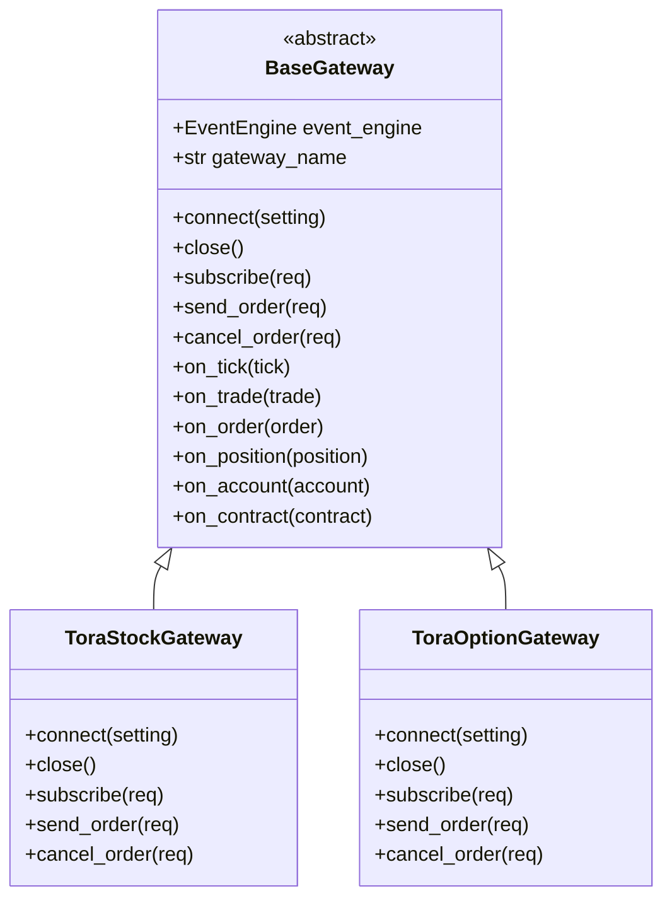
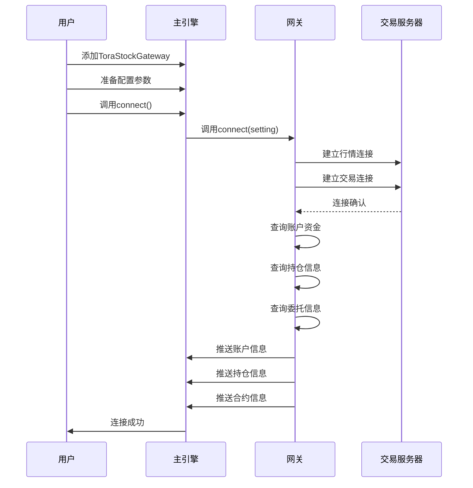

# 华鑫奇点接口

<cite>
**本文档引用文件**  
- [gateway.md](file://docs/community/info/gateway.md#L447-L500)
- [gateway.py](file://vnpy/trader/gateway.py#L160-L273)
- [run.py](file://examples/veighna_trader/run.py#L13)
- [CHANGELOG.md](file://CHANGELOG.md#L767)
</cite>

## 目录
1. [接口概述](#接口概述)
2. [配置字段说明](#配置字段说明)
3. [测试账号申请流程](#测试账号申请流程)
4. [网关实现机制](#网关实现机制)
5. [连接流程与配置示例](#连接流程与配置示例)
6. [常见连接问题解决方案](#常见连接问题解决方案)

## 接口概述

华鑫奇点接口分为两个子接口：ToraStockGateway（华鑫奇点股票）和ToraOptionGateway（华鑫奇点期权）。两个接口均支持Windows操作系统。

ToraStockGateway支持A股交易，采用单向持仓模式，适用于股票类交易场景。该接口不提供历史数据。

ToraOptionGateway支持ETF期权交易，采用双向持仓模式，适用于期权类交易场景。该接口同样不提供历史数据。

两个接口均通过华鑫证券提供测试账号，用户需要通过华鑫证券申请获取测试权限。

**Section sources**
- [gateway.md](file://docs/community/info/gateway.md#L447-L491)

## 配置字段说明

华鑫奇点接口的配置包含以下关键字段：

- **账号**：用于登录交易系统的用户标识
- **密码**：对应账号的登录密码
- **行情服务器**：接收行情数据的服务器地址
- **交易服务器**：发送交易指令的服务器地址
- **账号类型**：支持"用户代码"和"资金账号"两种类型
- **地址类型**：支持"前置地址"和"FENS地址"两种类型

其中，账号类型决定了登录时使用的身份标识方式。用户代码是系统分配的用户唯一标识，而资金账号是与资金账户关联的标识。地址类型决定了连接服务器的方式，前置地址指传统的前置机连接方式，FENS地址指基于FENS（Fast Exchange Network System）的快速网络系统连接方式。

根据更新日志，华鑫奇点接口已增加对FENS服务器连接和资金账户登录的支持，此前仅支持前置机连接和用户代码登录。

**Section sources**
- [gateway.md](file://docs/community/info/gateway.md#L465-L470)
- [CHANGELOG.md](file://CHANGELOG.md#L767)

## 测试账号申请流程

测试账号需要通过华鑫证券进行申请。具体流程如下：

1. 联系华鑫证券客户经理或相关部门
2. 提交测试账号申请请求
3. 提供必要的身份验证信息
4. 等待审核通过
5. 获取测试账号、密码及相关服务器地址信息

对于实盘交易，需要在华鑫证券开户，并通过客户经理开通相应的交易权限。测试账号主要用于开发和测试环境，确保交易策略和系统功能的正确性。

**Section sources**
- [gateway.md](file://docs/community/info/gateway.md#L473-L474)

## 网关实现机制

华鑫奇点接口基于vn.py框架的BaseGateway抽象类实现，该抽象类定义了所有交易网关必须实现的核心方法和属性。

BaseGateway作为抽象基类，定义了以下关键抽象方法：
- `connect`：建立与交易服务器的连接
- `close`：关闭连接
- `subscribe`：订阅行情数据
- `send_order`：发送委托订单
- `cancel_order`：撤销委托订单

ToraStockGateway和ToraOptionGateway作为BaseGateway的具体实现，继承并实现了这些抽象方法。当通过MainEngine连接网关时，会调用connect方法并传入配置参数，网关根据配置建立与行情和交易服务器的连接。

网关通过事件引擎（EventEngine）与主引擎（MainEngine）通信，使用on_tick、on_trade、on_order、on_position、on_account和on_contract等回调方法推送相应的市场数据、交易回报、委托状态、持仓信息、账户资金和合约信息。

**Diagram sources**
- [gateway.py](file://vnpy/trader/gateway.py#L160-L273)
- [run.py](file://examples/veighna_trader/run.py#L13)

**Section sources**
- [gateway.py](file://vnpy/trader/gateway.py#L160-L273)

## 连接流程与配置示例

连接华鑫奇点接口的基本流程如下：

1. 创建MainEngine实例
2. 添加ToraStockGateway或ToraOptionGateway
3. 准备连接配置参数
4. 调用connect方法建立连接

**Diagram sources**
- [gateway.py](file://vnpy/trader/gateway.py#L213-L222)

**Section sources**
- [gateway.py](file://vnpy/trader/gateway.py#L213-L222)

### 配置指导

根据不同账号类型和地址类型的配置示例如下：

**用户代码 + 前置地址配置：**
- 账号类型：用户代码
- 地址类型：前置地址
- 行情服务器：前置机行情服务器地址
- 交易服务器：前置机交易服务器地址

**资金账号 + FENS地址配置：**
- 账号类型：资金账号
- 地址类型：FENS地址
- 行情服务器：FENS行情服务器地址
- 交易服务器：FENS交易服务器地址

用户应根据实际获取的账号信息和服务器地址选择合适的配置组合。

**Section sources**
- [gateway.md](file://docs/community/info/gateway.md#L465-L470)

## 常见连接问题解决方案

1. **连接超时或无法连接**
   - 检查网络连接是否正常
   - 确认服务器地址和端口配置正确
   - 验证是否选择了正确的地址类型（前置地址/FENS地址）
   - 确认防火墙未阻止相关端口

2. **登录认证失败**
   - 检查账号和密码是否正确
   - 确认账号类型选择正确（用户代码/资金账号）
   - 验证账号是否已开通相应接口权限
   - 检查是否需要动态密钥支持

3. **行情订阅失败**
   - 确认已成功建立行情连接
   - 检查合约代码是否正确
   - 验证是否有行情订阅权限

4. **委托发送失败**
   - 确认已成功建立交易连接
   - 检查委托参数是否符合要求
   - 验证账户是否有交易权限和足够资金
   - 检查委托编号是否冲突

5. **数据接收异常**
   - 检查网络稳定性
   - 确认服务器负载是否过高
   - 验证是否需要重新连接

当遇到连接问题时，应首先检查配置参数的正确性，然后查看系统日志获取详细的错误信息，根据错误信息进行针对性的排查和解决。

**Section sources**
- [gateway.md](file://docs/community/info/gateway.md#L465-L470)
- [CHANGELOG.md](file://CHANGELOG.md#L767)