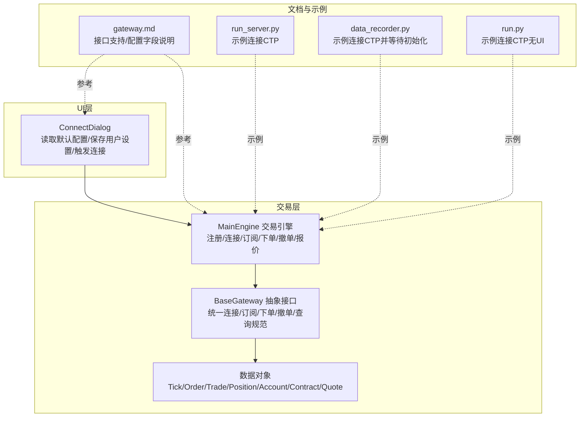
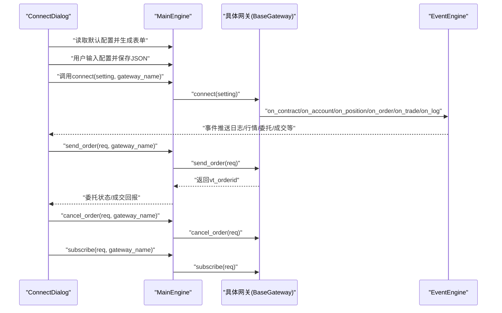
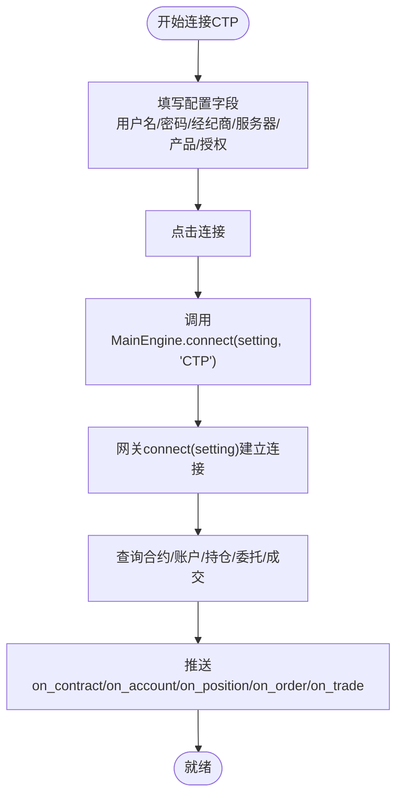
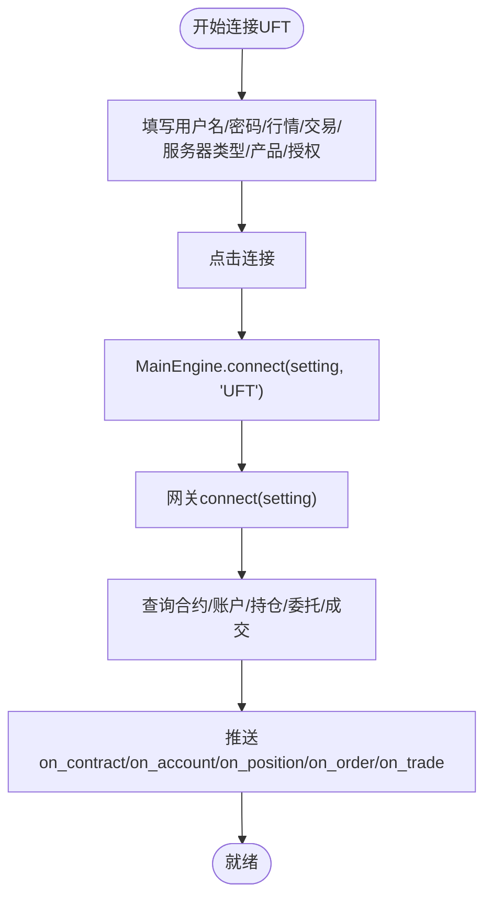
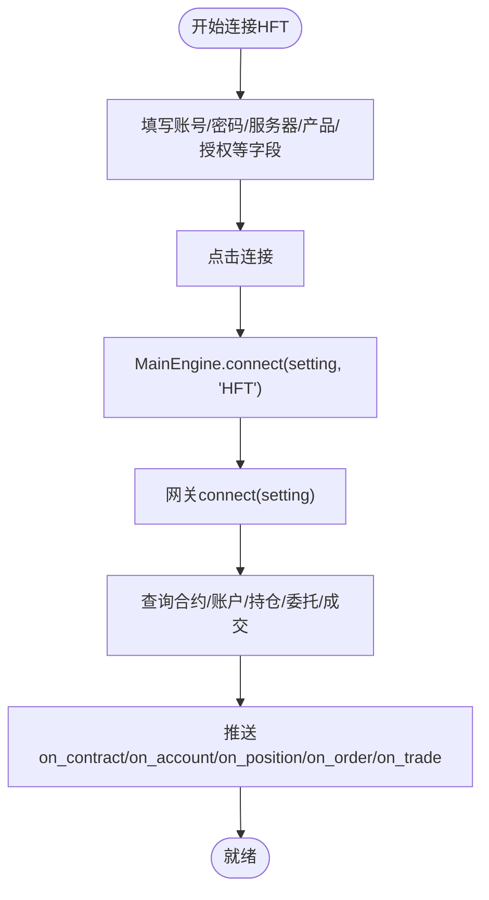
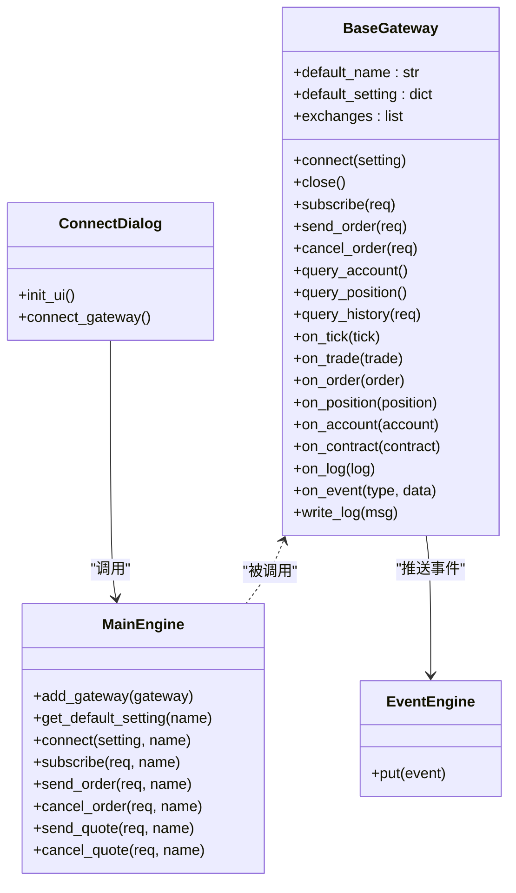

# 国内市场接口

<cite>
**本文引用的文件**
- [gateway.py](file://vnpy/trader/gateway.py)
- [engine.py](file://vnpy/trader/engine.py)
- [widget.py](file://vnpy/trader/ui/widget.py)
- [object.py](file://vnpy/trader/object.py)
- [gateway.md](file://docs/community/info/gateway.md)
- [README.md](file://README.md)
- [run_server.py](file://examples/client_server/run_server.py)
- [data_recorder.py](file://examples/data_recorder/data_recorder.py)
- [run.py](file://examples/no_ui/run.py)
</cite>

## 目录
1. [引言](#引言)
2. [项目结构](#项目结构)
3. [核心组件](#核心组件)
4. [架构总览](#架构总览)
5. [详细组件分析](#详细组件分析)
6. [依赖分析](#依赖分析)
7. [性能考虑](#性能考虑)
8. [故障排查指南](#故障排查指南)
9. [结论](#结论)
10. [附录](#附录)

## 引言
本文档系统化梳理vnpy在国内市场的交易接口，重点覆盖CTP、中泰XTP、恒生UFT、国泰君安HFT等主流柜台系统。围绕各接口的适用交易品种（期货、A股、ETF期权等）、持仓方向支持情况、系统兼容性、配置参数含义、连接流程、错误处理与网络超时处理等方面展开，并结合gateway.py中的BaseGateway抽象类，阐述如何通过统一接口规范实现多市场接入。文末提供实际配置示例与常见问题排查方法，帮助开发者与使用者快速落地。

## 项目结构
- 核心交易抽象位于vnpy/trader/gateway.py，定义了统一的BaseGateway接口规范，约束连接、订阅、下单、撤单、查询等行为。
- 交易引擎位于vnpy/trader/engine.py，负责网关注册、连接、订阅、下单、撤单、报价等统一调度。
- UI交互位于vnpy/trader/ui/widget.py，提供“连接对话框”等图形化配置入口，读取网关默认配置并持久化用户设置。
- 数据对象位于vnpy/trader/object.py，定义Tick、Order、Trade、Position、Account、Contract、Quote等数据结构，贯穿事件推送与回调。
- 文档与示例位于docs与examples目录，提供接口支持范围、配置字段说明与连接示例。

**图表来源**
- [gateway.py](file://vnpy/trader/gateway.py#L70-L273)
- [engine.py](file://vnpy/trader/engine.py#L195-L275)
- [widget.py](file://vnpy/trader/ui/widget.py#L599-L701)
- [object.py](file://vnpy/trader/object.py#L1-L428)
- [gateway.md](file://docs/community/info/gateway.md#L1-L420)
- [run_server.py](file://examples/client_server/run_server.py#L47-L73)
- [data_recorder.py](file://examples/data_recorder/data_recorder.py#L131-L146)
- [run.py](file://examples/no_ui/run.py#L21-L30)

**章节来源**
- [gateway.py](file://vnpy/trader/gateway.py#L70-L273)
- [engine.py](file://vnpy/trader/engine.py#L195-L275)
- [widget.py](file://vnpy/trader/ui/widget.py#L599-L701)
- [object.py](file://vnpy/trader/object.py#L1-L428)
- [gateway.md](file://docs/community/info/gateway.md#L1-L420)
- [README.md](file://README.md#L77-L118)

## 核心组件
- BaseGateway（抽象接口）
  - 规范连接(connect)、关闭(close)、订阅(subscribe)、下单(send_order)、撤单(cancel_order)、查询账户(query_account)、查询持仓(query_position)、查询历史(query_history)等方法。
  - 提供on_tick/on_trade/on_order/on_position/on_account/on_contract/on_log/on_event等回调，统一事件推送机制。
  - default_setting/default_name/exchanges等字段用于声明网关默认配置与支持的交易所列表。
- MainEngine（交易引擎）
  - 注册网关、获取默认配置、发起连接、订阅行情、下单/撤单、报价/撤报价等。
  - 将用户输入的配置字典传递给具体网关的connect方法。
- ConnectDialog（连接对话框）
  - 从MainEngine获取default_setting，动态生成表单；收集用户输入后保存为JSON并调用MainEngine.connect。
- 数据对象
  - TickData、BarData、OrderData、TradeData、PositionData、AccountData、ContractData、QuoteData、SubscribeRequest、OrderRequest、CancelRequest、HistoryRequest、QuoteRequest等，贯穿事件驱动与回调。

**章节来源**
- [gateway.py](file://vnpy/trader/gateway.py#L70-L273)
- [engine.py](file://vnpy/trader/engine.py#L195-L275)
- [widget.py](file://vnpy/trader/ui/widget.py#L599-L701)
- [object.py](file://vnpy/trader/object.py#L1-L428)

## 架构总览
下面的序列图展示了从UI到引擎再到具体网关的典型连接流程，以及下单/撤单/订阅的调用链路。

**图表来源**
- [widget.py](file://vnpy/trader/ui/widget.py#L599-L701)
- [engine.py](file://vnpy/trader/engine.py#L195-L275)
- [gateway.py](file://vnpy/trader/gateway.py#L160-L221)

## 详细组件分析

### CTP（期货、期货期权）
- 适用交易品种
  - 期货、期货期权（实盘6.5.1）；CTP测试（测试6.5.1）；CTP Mini（实盘1.4）。
- 持仓方向
  - 只支持双向持仓。
- 历史数据
  - 不提供。
- 系统兼容性
  - Windows、Ubuntu。
- 配置参数（字段说明）
  - 用户名、密码、经纪商代码、交易服务器、行情服务器、产品名称、授权编码、产品信息等。
- 连接流程
  - 通过图形化界面或脚本添加网关后，打开连接对话框，填写配置并点击连接；随后网关完成合约、账户、持仓、委托、成交等查询并推送事件。
- 实际配置示例
  - 示例脚本展示了如何在无UI环境下连接CTP并等待初始化。
- 常见问题
  - 穿透式认证：需确认授权编码与产品名称正确；若为测试环境，使用CTP测试接口。
  - 网络超时：检查服务器地址与端口是否可达，防火墙是否放行，交易/行情服务器是否维护。

**图表来源**
- [gateway.py](file://vnpy/trader/gateway.py#L160-L179)
- [engine.py](file://vnpy/trader/engine.py#L213-L221)
- [run_server.py](file://examples/client_server/run_server.py#L47-L58)
- [data_recorder.py](file://examples/data_recorder/data_recorder.py#L131-L139)

**章节来源**
- [gateway.md](file://docs/community/info/gateway.md#L51-L112)
- [README.md](file://README.md#L77-L88)
- [run_server.py](file://examples/client_server/run_server.py#L47-L58)
- [data_recorder.py](file://examples/data_recorder/data_recorder.py#L131-L139)

### 中泰XTP（A股、两融、ETF期权）
- 适用交易品种
  - A股、两融、ETF期权。
- 持仓方向
  - 股票只支持单向持仓；其余标的支持双向持仓。
- 历史数据
  - 不提供。
- 系统兼容性
  - Windows、Ubuntu。
- 配置参数（字段说明）
  - 账号、密码、客户号、行情地址/端口、交易地址/端口、行情协议（TCP/UDP）、日志级别、授权码等。
- 连接流程
  - 打开连接对话框，填写XTP所需字段，保存后由MainEngine.connect触发网关connect；随后进行查询与事件推送。
- 实际配置示例
  - 文档中给出字段清单与获取账号方式。
- 常见问题
  - 穿透式认证：需正确配置授权码与客户号；日志级别可辅助定位问题。
  - 网络超时：检查TCP/UDP协议与端口连通性，确保前置服务器可用。

**图表来源**
- [gateway.md](file://docs/community/info/gateway.md#L372-L412)
- [engine.py](file://vnpy/trader/engine.py#L213-L221)
- [widget.py](file://vnpy/trader/ui/widget.py#L599-L701)

**章节来源**
- [gateway.md](file://docs/community/info/gateway.md#L372-L412)
- [README.md](file://README.md#L95-L97)

### 恒生UFT（期货、ETF期权）
- 适用交易品种
  - 期货、ETF期权。
- 持仓方向
  - 只支持双向持仓。
- 历史数据
  - 不提供。
- 系统兼容性
  - Windows、Ubuntu。
- 配置参数（字段说明）
  - 用户名、密码、行情服务器、交易服务器、服务器类型（期货/ETF期权）、产品名称、授权编码、委托类型等。
- 连接流程
  - 通过连接对话框填写字段并保存，MainEngine.connect触发网关connect，随后查询与事件推送。
- 实际配置示例
  - 文档中给出字段清单与获取账号方式。
- 常见问题
  - 穿透式认证：授权编码与产品名称需匹配；委托类型需按要求配置。
  - 网络超时：检查行情/交易服务器地址与端口，确保前置可用。

**图表来源**
- [gateway.md](file://docs/community/info/gateway.md#L302-L334)
- [engine.py](file://vnpy/trader/engine.py#L213-L221)

**章节来源**
- [gateway.md](file://docs/community/info/gateway.md#L302-L334)
- [README.md](file://README.md#L91-L91)

### 国泰君安HFT（A股、两融）
- 适用交易品种
  - A股、两融。
- 持仓方向
  - 未明确说明，通常A股以单向为主。
- 历史数据
  - 不提供。
- 系统兼容性
  - Windows。
- 配置参数（字段说明）
  - 文档中给出交易品种与操作系统信息，具体字段以实际网关实现为准。
- 连接流程
  - 通过连接对话框填写字段并保存，MainEngine.connect触发网关connect，随后查询与事件推送。
- 实际配置示例
  - 文档中给出获取账号方式。
- 常见问题
  - 穿透式认证：授权与产品信息需正确配置。
  - 网络超时：检查前置地址与端口，确保Windows环境前置可用。

**图表来源**
- [gateway.md](file://docs/community/info/gateway.md#L413-L446)
- [engine.py](file://vnpy/trader/engine.py#L213-L221)

**章节来源**
- [gateway.md](file://docs/community/info/gateway.md#L413-L446)
- [README.md](file://README.md#L99-L101)

### 其他国内接口（补充）
- 飞马（期货）、CTP期权（ETF期权）、顶点HTS（ETF期权）、易盛（期货、黄金TD）、华鑫奇点（A股、ETF期权）、东方证券OST（A股）、金仕达黄金（黄金TD）、TTS（期货仿真）、融航/利星资管/杰宜斯（期货资管）、中亿汇达Comstar（银行间市场）等，均通过统一的BaseGateway接口规范接入，遵循相同的连接与事件推送流程。

**章节来源**
- [README.md](file://README.md#L81-L118)
- [gateway.md](file://docs/community/info/gateway.md#L26-L85)

## 依赖分析
- 组件耦合与内聚
  - BaseGateway定义了严格的抽象契约，具体网关实现仅关注自身协议细节，与MainEngine通过统一接口交互，耦合度低、内聚性强。
  - MainEngine负责集中调度，避免业务逻辑分散在UI层，UI层仅负责配置收集与持久化。
- 直接与间接依赖
  - UI依赖MainEngine获取default_setting与执行connect。
  - MainEngine依赖具体网关实现的connect/subscribe/send_order/cancel_order等方法。
  - 网关实现依赖EventEngine进行事件推送。
- 外部依赖与集成点
  - 各网关实现依赖各自厂商提供的前置/服务器与认证体系，vnpy通过统一接口屏蔽差异。
- 接口契约与实现细节
  - BaseGateway要求实现connect/close/subscribe/send_order/cancel_order/query_account/query_position/query_history等方法，并在connect中完成查询与事件推送。

**图表来源**
- [gateway.py](file://vnpy/trader/gateway.py#L70-L273)
- [engine.py](file://vnpy/trader/engine.py#L195-L275)
- [widget.py](file://vnpy/trader/ui/widget.py#L599-L701)

**章节来源**
- [gateway.py](file://vnpy/trader/gateway.py#L70-L273)
- [engine.py](file://vnpy/trader/engine.py#L195-L275)
- [widget.py](file://vnpy/trader/ui/widget.py#L599-L701)

## 性能考虑
- 非阻塞与线程安全
  - BaseGateway要求所有方法为非阻塞，且实现线程安全，避免共享可变状态，确保高并发场景稳定。
- 自动重连
  - BaseGateway要求在连接断开后自动重连，保障交易连续性。
- 事件驱动
  - 通过EventEngine统一推送事件，避免轮询带来的CPU消耗。
- 历史数据
  - 多数国内接口不提供历史数据，建议通过外部数据源或专用数据服务补充。

[本节为通用指导，无需列出具体文件来源]

## 故障排查指南
- 穿透式认证配置
  - 确认授权编码、产品名称、客户号等字段与券商侧一致；部分接口（如CTP测试/UFT/XTP）需在测试环境申请账号并按文档配置。
- 网络超时与连通性
  - 检查交易/行情服务器地址与端口是否可达；确认防火墙放行；Windows/Ubuntu环境前置可用性不同，需按接口文档选择对应系统。
- 认证失败
  - 核对用户名/密码/经纪商代码/客户号等字段；若为测试环境，使用对应测试接口（如CTP测试/UFT测试）。
- 初始化耗时
  - 首次连接后需要一定时间完成合约、账户、持仓、委托、成交等查询；示例脚本中通过等待时间确保初始化完成后再进行后续操作。
- 日志定位
  - 通过ConnectDialog保存的JSON配置与MainEngine日志输出定位问题；XTP支持日志级别配置，便于调试。

**章节来源**
- [gateway.md](file://docs/community/info/gateway.md#L1-L420)
- [data_recorder.py](file://examples/data_recorder/data_recorder.py#L131-L146)
- [run.py](file://examples/no_ui/run.py#L21-L30)

## 结论
vnpy通过BaseGateway抽象接口，将国内主流柜台系统（CTP、中泰XTP、恒生UFT、国泰君安HFT等）统一接入，形成“UI配置—引擎调度—网关实现—事件推送”的清晰架构。开发者只需按照BaseGateway契约实现具体网关，即可复用统一的连接、订阅、下单、撤单与查询流程；使用者可通过图形化界面或脚本快速完成配置与连接。配合完善的文档与示例，能够高效落地多市场接入与实盘交易。

[本节为总结性内容，无需列出具体文件来源]

## 附录
- 实际配置示例路径
  - CTP连接示例：[run_server.py](file://examples/client_server/run_server.py#L47-L58)
  - CTP等待初始化示例：[data_recorder.py](file://examples/data_recorder/data_recorder.py#L131-L139)
  - CTP无UI连接示例：[run.py](file://examples/no_ui/run.py#L21-L30)
- 接口支持与配置字段参考
  - [gateway.md](file://docs/community/info/gateway.md#L1-L420)
  - [README.md](file://README.md#L77-L118)