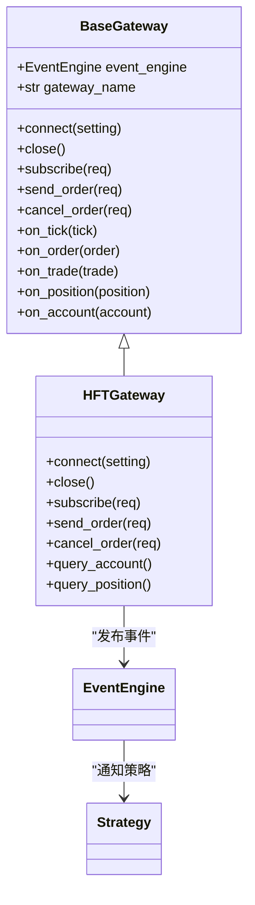
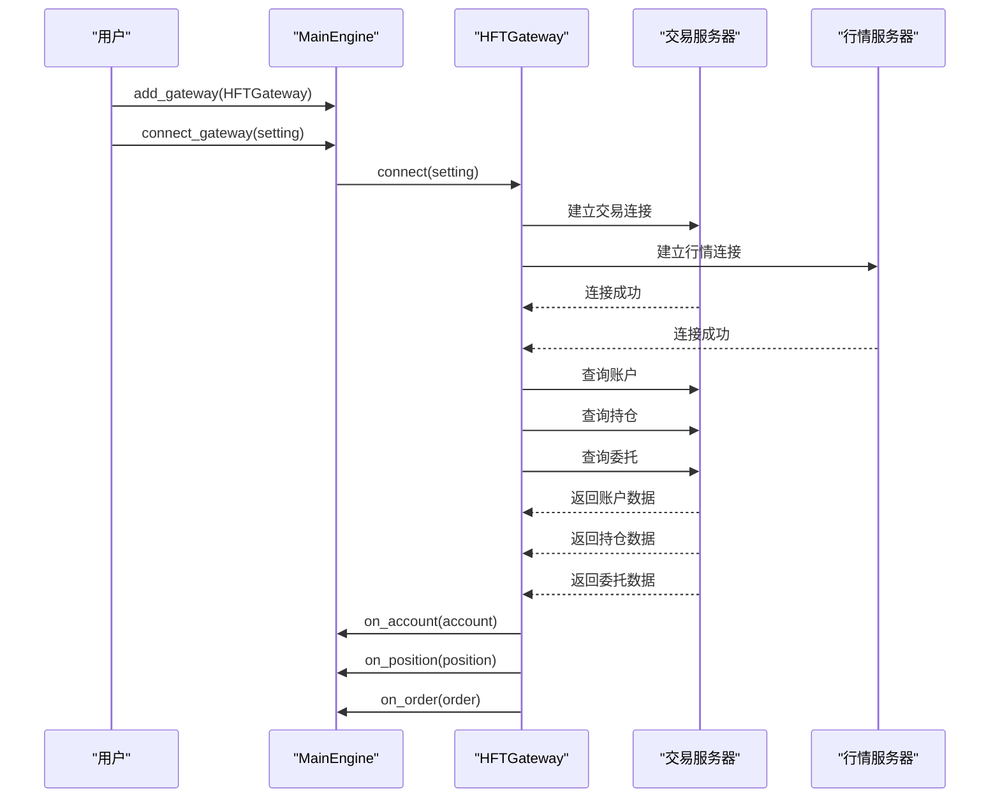
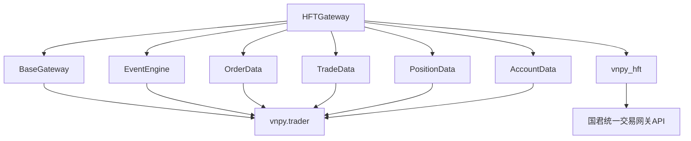

# 国泰君安HFT接口

<cite>
**本文档引用文件**  
- [gateway.py](file://vnpy/trader/gateway.py)
- [gateway.md](file://docs/community/info/gateway.md)
- [CHANGELOG.md](file://CHANGELOG.md)
</cite>

## 目录
1. [简介](#简介)
2. [项目结构](#项目结构)
3. [核心组件](#核心组件)
4. [架构概述](#架构概述)
5. [详细组件分析](#详细组件分析)
6. [依赖分析](#依赖分析)
7. [性能考虑](#性能考虑)
8. [故障排除指南](#故障排除指南)
9. [结论](#结论)
10. [附录](#附录)（如有必要）

## 简介
国泰君安HFT接口是vnpy框架中用于连接国泰君安证券统一交易网关的高性能交易接口，专为A股市场设计。该接口支持高频交易场景，仅兼容Windows操作系统，并采用单向持仓模式。接口通过分离到独立的vnpy_hft项目中进行维护和升级，以确保稳定性和专业性。用户需要通过国泰君安申请测试或实盘账号，并正确配置交易和行情相关的服务器参数、认证信息以及机构和营业部代号等专业字段。

## 项目结构
国泰君安HFT接口作为vnpy生态的一部分，其核心实现位于独立的vnpy_hft项目中，而vnpy主仓库仅保留接口的配置说明和文档指引。这种架构设计实现了功能模块的解耦，便于独立迭代和维护。

```mermaid
graph TB
subgraph "vnpy主项目"
A[vnpy]
B[trader/gateway.py]
C[docs/community/info/gateway.md]
D[CHANGELOG.md]
end
subgraph "独立HFT项目"
E[vnpy_hft]
F[HFTGateway实现]
G[国君统一交易网关API]
end
A --> E : "接口剥离"
B --> F : "继承BaseGateway"
C --> E : "文档指引"
```

**Diagram sources**
- [gateway.py](file://vnpy/trader/gateway.py)
- [gateway.md](file://docs/community/info/gateway.md)

**Section sources**
- [gateway.py](file://vnpy/trader/gateway.py)
- [gateway.md](file://docs/community/info/gateway.md)

## 核心组件
国泰君安HFT接口的核心组件基于vnpy的`BaseGateway`抽象类实现，遵循统一的网关接口规范。`BaseGateway`定义了连接、订阅、下单、撤单、查询账户和持仓等核心方法，确保所有交易接口具有一致的编程接口。HFTGateway作为具体实现，负责处理与国泰君安统一交易网关的通信细节，包括协议解析、会话管理、数据转换和错误处理。

**Section sources**
- [gateway.py](file://vnpy/trader/gateway.py)

## 架构概述
国泰君安HFT接口的架构遵循vnpy的事件驱动设计模式。`HFTGateway`通过继承`BaseGateway`，实现了与国泰君安交易系统的连接。当接收到市场行情、委托回报、成交回报等数据时，`HFTGateway`会将这些数据封装成相应的`TickData`、`OrderData`、`TradeData`等对象，并通过`EventEngine`事件引擎发布事件。上层应用（如策略引擎）通过订阅这些事件来获取实时数据并做出交易决策。



**Diagram sources**
- [gateway.py](file://vnpy/trader/gateway.py)

## 详细组件分析

### HFTGateway实现机制
`HFTGateway`是国泰君安HFT接口的具体实现类，它继承自`BaseGateway`并实现了所有抽象方法。其连接流程如下：首先，调用`connect`方法并传入包含连接参数的`setting`字典；然后，`HFTGateway`会使用这些参数建立与交易服务器和行情服务器的连接；连接成功后，网关会自动执行账户资产查询、持仓查询、委托查询等操作，并通过相应的`on_xxx`回调方法将数据推送给上层应用。

#### 连接流程


**Diagram sources**
- [gateway.py](file://vnpy/trader/gateway.py)

**Section sources**
- [gateway.py](file://vnpy/trader/gateway.py)

### 配置字段详解
国泰君安HFT接口的配置需要提供一系列字段，这些字段在连接时通过`setting`字典传入。

#### 交易相关字段
- **交易用户名**：用于登录交易系统的用户名。
- **交易密码**：与交易用户名对应的密码。
- **交易服务器**：交易系统的服务器地址。
- **交易端口**：交易系统监听的端口号。
- **机构代号**：用户的机构代码，由国泰君安分配。
- **营业部代号**：用户所属营业部的代码，由国泰君安分配。
- **网关**：指定连接的网关类型或标识。

#### 行情相关字段
- **行情用户名**：用于登录行情系统的用户名。
- **行情密码**：与行情用户名对应的密码。
- **行情服务器**：行情系统的服务器地址。
- **行情端口**：行情系统监听的端口号。

**Section sources**
- [gateway.md](file://docs/community/info/gateway.md)

### 配置示例
以下是一个典型的国泰君安HFT接口配置示例：

```json
{
  "交易用户名": "your_trading_username",
  "交易密码": "your_trading_password",
  "交易服务器": "127.0.0.1",
  "交易端口": 8000,
  "机构代号": "0000",
  "营业部代号": "9999",
  "网关": "HFT",
  "行情用户名": "your_market_username",
  "行情密码": "your_market_password",
  "行情服务器": "127.0.0.1",
  "行情端口": 9000
}
```

**Section sources**
- [gateway.md](file://docs/community/info/gateway.md)

### 专业字段填写指导
- **机构代号**和**营业部代号**是国泰君安内部用于标识客户身份的重要字段。这些代码通常由客户经理在开户时提供。如果用户不确定这些代码，应直接联系国泰君安的客户经理进行确认。
- 所有服务器地址和端口信息也应由国泰君安官方提供，用户不应自行猜测。

**Section sources**
- [gateway.md](file://docs/community/info/gateway.md)

### 连接失败排查步骤
当连接国泰君安HFT接口失败时，可按照以下步骤进行排查：
1. 检查网络连接是否正常，确保可以访问交易和行情服务器。
2. 核对所有配置字段，特别是用户名、密码、服务器地址和端口，确保无误。
3. 确认机构代号和营业部代号是否正确。
4. 检查防火墙设置，确保相关端口未被阻止。
5. 查看日志文件，根据具体的错误信息进行针对性处理。
6. 联系国泰君安技术支持，确认账号状态和服务器状态。

**Section sources**
- [gateway.md](file://docs/community/info/gateway.md)

## 依赖分析
国泰君安HFT接口的实现依赖于vnpy核心框架的多个组件，包括事件引擎（EventEngine）、数据对象（如OrderData, TradeData）和网关基类（BaseGateway）。此外，由于该接口已被剥离到独立的vnpy_hft项目中，因此主vnpy项目对vnpy_hft有外部依赖。



**Diagram sources**
- [gateway.py](file://vnpy/trader/gateway.py)

**Section sources**
- [gateway.py](file://vnpy/trader/gateway.py)
- [CHANGELOG.md](file://CHANGELOG.md)

## 性能考虑
国泰君安HFT接口专为高频交易设计，因此在性能方面有严格要求。接口实现必须是线程安全的，所有方法都应是非阻塞的，以确保在高并发场景下的响应速度。自动重连机制保证了连接的稳定性，即使在网络波动的情况下也能快速恢复交易。

## 故障排除指南
当遇到连接问题或数据异常时，首先应检查配置文件中的各项参数是否正确，特别是与国泰君安相关的服务器地址、端口、用户名、密码以及机构和营业部代号。其次，查看vnpy的日志输出，通常能从中找到具体的错误原因。如果问题依然存在，建议联系国泰君安的技术支持团队获取帮助。

**Section sources**
- [gateway.md](file://docs/community/info/gateway.md)

## 结论
国泰君安HFT接口通过vnpy框架为量化交易者提供了稳定、高效的A股交易接入能力。通过理解其基于`BaseGateway`的实现机制、正确配置各项参数，并遵循连接失败的排查步骤，用户可以顺利地将该接口集成到自己的交易系统中。由于该接口已被独立维护，用户应关注vnpy_hft项目的更新以获取最新的功能和修复。

## 附录
### 申请测试账号流程
测试账号需通过国泰君安官方渠道申请。具体流程通常包括：
1. 联系国泰君安客户经理或技术支持。
2. 提交相关申请材料。
3. 等待审核并获取测试账号信息（包括用户名、密码、服务器地址等）。
4. 使用获取的信息配置HFT接口。

**Section sources**
- [gateway.md](file://docs/community/info/gateway.md)