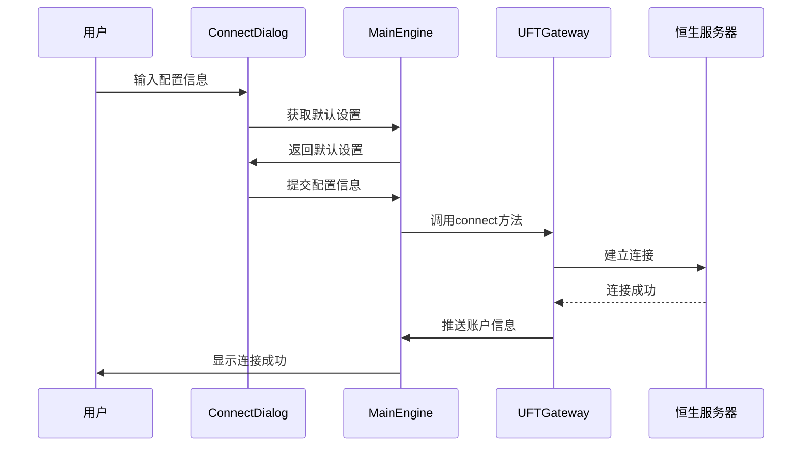

# 恒生UFT接口

<cite>
**本文档引用文件**  
- [gateway.md](file://docs/community/info/gateway.md#L301-L377)
- [gateway.py](file://vnpy/trader/gateway.py#L33-L273)
- [engine.py](file://vnpy/trader/engine.py#L68-L275)
- [object.py](file://vnpy/trader/object.py#L271-L427)
- [widget.py](file://vnpy/trader/ui/widget.py#L599-L689)
- [setting.py](file://vnpy/trader/setting.py#L1-L43)
- [README.md](file://README.md#L90)
- [CHANGELOG.md](file://CHANGELOG.md#L651)
</cite>

## 目录
1. [简介](#简介)
2. [支持的交易品种与操作系统](#支持的交易品种与操作系统)
3. [双向持仓模式](#双向持仓模式)
4. [接口配置字段详解](#接口配置字段详解)
5. [测试账号申请流程](#测试账号申请流程)
6. [UFTGateway实现机制与连接流程](#uftgateway实现机制与连接流程)
7. [实际配置示例](#实际配置示例)
8. [常见问题排查](#常见问题排查)
9. [结论](#结论)

## 简介

恒生UFT接口是VeighNa框架中用于连接恒生电子UFT柜台的交易接口，支持国内期货和ETF期权的交易。该接口通过恒生极速API实现高效稳定的交易连接，适用于Windows和Ubuntu操作系统。本文档详细说明了恒生UFT接口的配置与使用方法，包括支持的交易品种、操作系统兼容性、双向持仓模式、接口相关字段的含义及配置方法，以及通过恒生电子申请测试账号的具体流程。同时，结合`gateway.py`中的`BaseGateway`抽象类，说明了`UFTGateway`的实现机制和连接流程，并提供实际配置示例和常见问题排查方法。

**Section sources**
- [README.md](file://README.md#L90)
- [gateway.md](file://docs/community/info/gateway.md#L301-L305)

## 支持的交易品种与操作系统

恒生UFT接口支持以下交易品种和操作系统：

- **交易品种**：
  - 期货
  - ETF期权

- **操作系统**：
  - Windows
  - Ubuntu

该接口通过恒生极速API实现对期货和ETF期权的交易支持，能够在Windows和Ubuntu系统上稳定运行。用户可以根据自己的操作系统选择合适的环境进行部署和使用。

**Section sources**
- [gateway.md](file://docs/community/info/gateway.md#L306-L313)

## 双向持仓模式

恒生UFT接口支持双向持仓模式，这意味着用户可以在同一合约上同时持有买入和卖出仓位。这种模式为交易者提供了更大的灵活性，特别是在进行套利交易或对冲策略时。双向持仓模式允许交易者在同一合约上进行多空双向操作，而不会相互抵消。

**Section sources**
- [gateway.md](file://docs/community/info/gateway.md#L314-L315)

## 接口配置字段详解

恒生UFT接口的配置涉及多个关键字段，这些字段在连接接口时必须正确设置。以下是各字段的详细解释：

- **用户名**：用于登录恒生UFT系统的用户名。
- **密码**：与用户名对应的登录密码。
- **行情服务器**：行情数据服务器的地址，用于接收实时行情信息。
- **交易服务器**：交易指令服务器的地址，用于发送交易指令。
- **服务器类型**：指定服务器类型为期货或ETF期权，必须根据实际交易品种选择。
- **产品名称**：恒生系统中的产品名称，用于标识特定的交易产品。
- **授权编码**：恒生系统提供的授权编码，用于验证用户权限。
- **委托类型**：指定委托的类型，如市价单、限价单等。

这些字段在连接接口时通过JSON配置文件进行设置，确保与恒生系统的配置一致。

**Section sources**
- [gateway.md](file://docs/community/info/gateway.md#L321-L329)

## 测试账号申请流程

测试账号需要通过恒生电子官方渠道申请。具体流程如下：

1. 访问恒生电子官方网站。
2. 寻找并进入UFT接口测试账号申请页面。
3. 填写必要的申请信息，包括公司名称、联系人信息、申请理由等。
4. 提交申请并等待审核。
5. 审核通过后，恒生电子将提供测试账号的相关信息，包括用户名、密码、服务器地址等。

用户应确保申请信息的真实性和完整性，以便顺利获得测试账号。

**Section sources**
- [gateway.md](file://docs/community/info/gateway.md#L331-L333)

## UFTGateway实现机制与连接流程

恒生UFT接口的实现基于`BaseGateway`抽象类，该类定义了所有交易接口必须实现的基本方法和回调函数。`UFTGateway`作为`BaseGateway`的具体实现，负责与恒生UFT系统的通信。

### BaseGateway抽象类

`BaseGateway`类定义了以下关键方法：

- `connect(self, setting: dict) -> None`：启动网关连接，建立与服务器的连接并进行必要的查询。
- `close(self) -> None`：关闭网关连接。
- `subscribe(self, req: SubscribeRequest) -> None`：订阅行情数据更新。
- `send_order(self, req: OrderRequest) -> str`：发送新的订单到服务器。
- `cancel_order(self, req: CancelRequest) -> None`：取消现有的订单。

### 连接流程

1. **初始化**：创建`MainEngine`实例，并添加`UFTGateway`。
2. **配置**：通过`ConnectDialog`获取用户输入的配置信息，包括用户名、密码、服务器地址等。
3. **连接**：调用`main_engine.connect(setting, gateway_name)`方法，传入配置信息和网关名称。
4. **验证**：网关连接成功后，自动进行账户信息、持仓、委托等数据的查询，并通过事件引擎推送相关数据。



**Diagram sources**
- [gateway.py](file://vnpy/trader/gateway.py#L161-L180)
- [engine.py](file://vnpy/trader/engine.py#L213-L222)
- [widget.py](file://vnpy/trader/ui/widget.py#L604-L689)

**Section sources**
- [gateway.py](file://vnpy/trader/gateway.py#L33-L273)
- [engine.py](file://vnpy/trader/engine.py#L68-L275)

## 实际配置示例

以下是一个实际的恒生UFT接口配置示例，保存在`connect_uft.json`文件中：

```json
{
    "用户名": "your_username",
    "密码": "your_password",
    "行情服务器": "quote.hundsun.com:8001",
    "交易服务器": "trade.hundsun.com:8002",
    "服务器类型": "期货",
    "产品名称": "UFT_PRODUCT",
    "授权编码": "your_license_code",
    "委托类型": "限价"
}
```

用户需要根据实际情况修改上述配置中的值，确保与恒生系统提供的信息一致。

**Section sources**
- [gateway.md](file://docs/community/info/gateway.md#L321-L329)

## 常见问题排查

在使用恒生UFT接口时，可能会遇到一些常见问题。以下是几种典型问题及其解决方案：

### 服务器类型选择错误

**问题描述**：连接时选择的服务器类型与实际交易品种不符，导致连接失败。

**解决方案**：检查配置文件中的“服务器类型”字段，确保其与实际交易品种一致。例如，交易期货时应选择“期货”，交易ETF期权时应选择“ETF期权”。

### 授权编码失效

**问题描述**：授权编码过期或被撤销，导致无法连接。

**解决方案**：联系恒生电子客服，确认授权编码的有效性。如果编码已失效，需重新申请新的授权编码。

### 连接超时

**问题描述**：连接服务器时出现超时错误。

**解决方案**：检查网络连接是否正常，确认行情服务器和交易服务器的地址和端口是否正确。可以尝试使用ping命令测试服务器连通性。

### 认证失败

**问题描述**：用户名或密码错误，导致认证失败。

**解决方案**：仔细核对用户名和密码，确保输入无误。如果忘记密码，可通过恒生电子的密码找回功能重置。

**Section sources**
- [gateway.md](file://docs/community/info/gateway.md#L321-L329)
- [engine.py](file://vnpy/trader/engine.py#L213-L222)

## 结论

恒生UFT接口为VeighNa用户提供了一个高效稳定的交易通道，支持国内期货和ETF期权的交易。通过本文档的详细说明，用户可以了解接口的配置与使用方法，包括支持的交易品种、操作系统兼容性、双向持仓模式、接口相关字段的含义及配置方法，以及通过恒生电子申请测试账号的具体流程。结合`BaseGateway`抽象类，`UFTGateway`的实现机制和连接流程也得到了清晰的阐述。希望本文档能帮助用户顺利配置和使用恒生UFT接口，实现高效的量化交易。