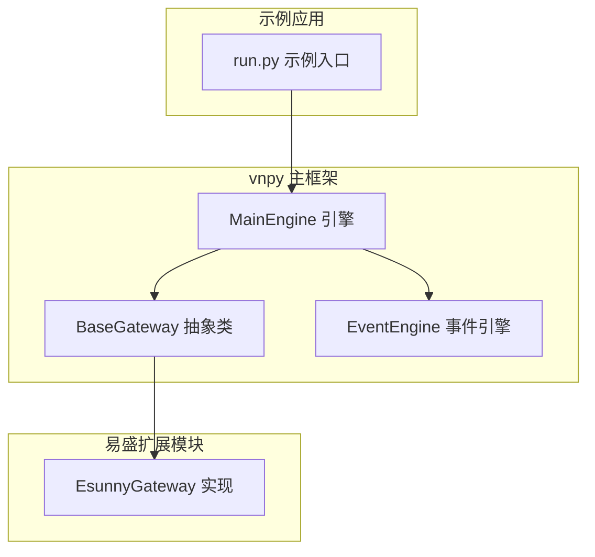
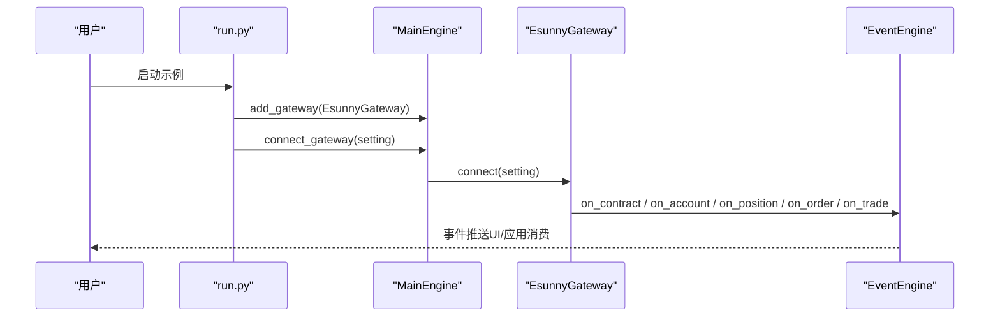
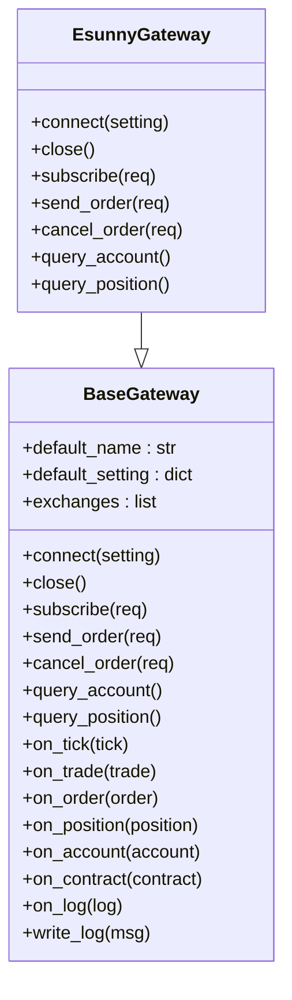
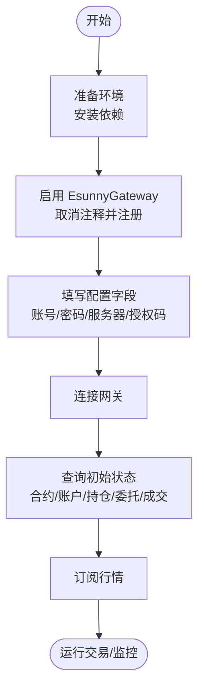
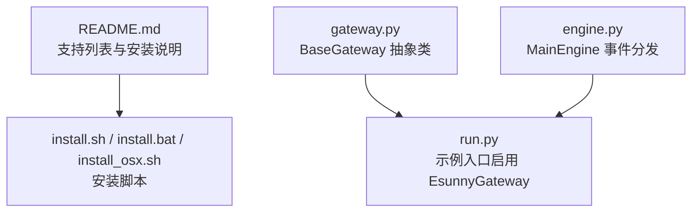

# 易盛接口

<cite>
**本文引用的文件**
- [gateway.py](file://vnpy/trader/gateway.py)
- [engine.py](file://vnpy/trader/engine.py)
- [run.py](file://examples/veighna_trader/run.py)
- [gateway.md](file://docs/community/info/gateway.md)
- [README.md](file://README.md)
- [install.sh](file://install.sh)
- [install.bat](file://install.bat)
- [install_osx.sh](file://install_osx.sh)
</cite>

## 目录
1. [简介](#简介)
2. [项目结构](#项目结构)
3. [核心组件](#核心组件)
4. [架构总览](#架构总览)
5. [详细组件分析](#详细组件分析)
6. [依赖分析](#依赖分析)
7. [性能考虑](#性能考虑)
8. [故障排查指南](#故障排查指南)
9. [结论](#结论)
10. [附录](#附录)

## 简介
本文件系统化梳理 vnpy 中“易盛接口”的配置与使用，覆盖支持的交易品种（期货、黄金TD）、操作系统兼容性（Windows、Ubuntu）、双向持仓模式，以及关键字段的含义与配置方法。同时结合 vnpy 的 BaseGateway 抽象类，说明 EsunnyGateway 的实现机制与连接流程；并提供通过易盛官方网站申请测试账号的流程指引。最后，针对行情与交易分离的架构，给出配置注意事项与常见问题解决方案。

## 项目结构
- 易盛接口属于 vnpy 的“网关（gateway）”体系，位于独立扩展模块中（例如 vnpy_esunny），在主仓库中通过链接或外部模块形式提供。
- 在示例工程中，可通过取消注释的方式启用 EsunnyGateway 并将其加入主引擎。
- 文档层面，易盛接口的支持范围、字段说明与测试账号申请流程均在社区文档中明确。

**图表来源**
- [gateway.py](file://vnpy/trader/gateway.py#L33-L273)
- [engine.py](file://vnpy/trader/engine.py#L186-L275)
- [run.py](file://examples/veighna_trader/run.py#L1-L88)

**章节来源**
- [README.md](file://README.md#L92-L96)
- [gateway.md](file://docs/community/info/gateway.md#L335-L371)
- [run.py](file://examples/veighna_trader/run.py#L1-L88)

## 核心组件
- BaseGateway 抽象类：定义了网关的标准接口，包括连接、订阅、下单、撤单、查询账户与持仓等方法，以及事件推送与日志写入机制。
- MainEngine：负责网关的注册、事件派发、委托与报价的转发。
- 示例入口 run.py：展示了如何将 EsunnyGateway 注册到主引擎中。

关键职责与约定
- 线程安全与非阻塞：所有方法需线程安全且非阻塞。
- 自动重连：连接断开后应自动重连。
- 事件回调：必须响应 on_tick、on_trade、on_order、on_position、on_account、on_contract 等回调。
- 查询与回推：连接建立后应查询并回推合约、账户资产、持仓、委托与成交等初始状态。

**章节来源**
- [gateway.py](file://vnpy/trader/gateway.py#L33-L273)
- [engine.py](file://vnpy/trader/engine.py#L186-L275)
- [run.py](file://examples/veighna_trader/run.py#L1-L88)

## 架构总览
下图展示了从示例入口到 EsunnyGateway 的典型调用链路，以及与事件引擎的交互。

**图表来源**
- [run.py](file://examples/veighna_trader/run.py#L1-L88)
- [engine.py](file://vnpy/trader/engine.py#L186-L275)
- [gateway.py](file://vnpy/trader/gateway.py#L33-L273)

## 详细组件分析

### EsunnyGateway 实现机制与连接流程
- 实现基类：EsunnyGateway 必须继承 BaseGateway，并实现 connect、close、subscribe、send_order、cancel_order、query_account、query_position 等抽象方法。
- 连接阶段：connect(setting) 应完成与行情/交易系统的握手、登录、查询初始状态（合约、账户、持仓、委托、成交），并通过 on_event 将数据推送到事件引擎。
- 事件推送：BaseGateway 已内置 on_tick、on_trade、on_order、on_position、on_account、on_contract、on_log 等回调，EsunnyGateway 仅需填充数据并调用这些回调。
- 自动重连：连接断开后应自动重连，确保业务连续性。

**图表来源**
- [gateway.py](file://vnpy/trader/gateway.py#L33-L273)

**章节来源**
- [gateway.py](file://vnpy/trader/gateway.py#L33-L273)

### 字段说明与配置方法
以下字段来源于社区文档，用于配置易盛接口的行情与交易连接参数。请根据实际供应商提供的信息填写。

- 行情账号：用于登录行情通道的账号
- 行情密码：用于登录行情通道的密码
- 行情服务器：行情服务器地址（含主机与端口）
- 行情端口：行情端口（文档中默认为 0）
- 行情授权码：用于行情通道鉴权的授权码
- 交易账号：用于登录交易通道的账号
- 交易密码：用于登录交易通道的密码
- 交易服务器：交易服务器地址（含主机与端口）
- 交易端口：交易端口（文档中默认为 0）
- 交易产品名称：交易通道的产品名称
- 交易授权编码：用于交易通道鉴权的授权码
- 交易系统：内盘、外盘（根据供应商支持选择）

配置要点
- 行情与交易分离：通常分别配置独立的服务器与端口，便于独立扩展与隔离故障。
- 端口与地址：请确认供应商提供的服务器地址与端口，避免使用默认值导致连接失败。
- 授权码与产品名称：务必与供应商下发的一致，否则无法登录。

**章节来源**
- [gateway.md](file://docs/community/info/gateway.md#L353-L371)

### 操作系统与交易品种支持
- 操作系统：Windows、Ubuntu
- 交易品种：期货、黄金TD
- 持仓方向：支持双向持仓
- 历史数据：不支持

**章节来源**
- [gateway.md](file://docs/community/info/gateway.md#L337-L352)

### 双向持仓模式
- 易盛接口支持双向持仓，可在策略中灵活设置多头/空头方向，满足不同交易场景。

**章节来源**
- [gateway.md](file://docs/community/info/gateway.md#L347-L349)

### 通过易盛官方网站申请测试账号
- 测试账号申请流程：请通过易盛官方网站申请测试账号，获取行情与交易所需的账号、密码、服务器、授权码等信息。

**章节来源**
- [gateway.md](file://docs/community/info/gateway.md#L368-L371)

### 配置示例与使用步骤
- 安装与环境准备：可参考安装脚本与 README 中的环境与安装说明。
- 启用 EsunnyGateway：在示例入口中取消注释并注册 EsunnyGateway。
- 连接与订阅：通过 MainEngine 的 connect_gateway 方法传入配置字典，随后订阅所需合约。

**图表来源**
- [install.sh](file://install.sh#L1-L40)
- [install.bat](file://install.bat#L1-L16)
- [install_osx.sh](file://install_osx.sh#L1-L29)
- [run.py](file://examples/veighna_trader/run.py#L1-L88)
- [gateway.py](file://vnpy/trader/gateway.py#L33-L273)

**章节来源**
- [README.md](file://README.md#L225-L267)
- [install.sh](file://install.sh#L1-L40)
- [install.bat](file://install.bat#L1-L16)
- [install_osx.sh](file://install_osx.sh#L1-L29)
- [run.py](file://examples/veighna_trader/run.py#L1-L88)

### 行情与交易分离的配置注意事项
- 分离原则：行情与交易各自独立配置服务器与端口，避免相互影响。
- 独立授权：行情与交易的授权码与产品名称需分别配置，确保双通道均可登录。
- 端口冲突：确保行情与交易端口不冲突，避免连接失败。
- 网络与防火墙：确认服务器端口开放，且本地网络策略允许访问。
- 日志与诊断：通过 BaseGateway 的日志接口输出关键事件，便于定位问题。

**章节来源**
- [gateway.py](file://vnpy/trader/gateway.py#L153-L159)
- [gateway.md](file://docs/community/info/gateway.md#L353-L371)

## 依赖分析
- 运行时依赖
  - Python 版本与系统：README 中明确了支持的 Python 版本与系统版本。
  - 安装脚本：提供 Windows、Ubuntu、macOS 的安装脚本，便于快速部署。
- 模块依赖
  - BaseGateway：EsunnyGateway 的实现必须遵循抽象类契约。
  - MainEngine：负责网关注册与事件分发。
  - EventEngine：事件驱动的核心引擎。

**图表来源**
- [README.md](file://README.md#L92-L126)
- [install.sh](file://install.sh#L1-L40)
- [install.bat](file://install.bat#L1-L16)
- [install_osx.sh](file://install_osx.sh#L1-L29)
- [gateway.py](file://vnpy/trader/gateway.py#L33-L273)
- [engine.py](file://vnpy/trader/engine.py#L186-L275)
- [run.py](file://examples/veighna_trader/run.py#L1-L88)

**章节来源**
- [README.md](file://README.md#L225-L267)
- [gateway.py](file://vnpy/trader/gateway.py#L33-L273)
- [engine.py](file://vnpy/trader/engine.py#L186-L275)
- [run.py](file://examples/veighna_trader/run.py#L1-L88)

## 性能考虑
- 非阻塞与线程安全：所有网关方法需非阻塞，避免阻塞事件循环。
- 自动重连：在网络抖动或断连时自动恢复，保障业务连续性。
- 事件驱动：通过事件引擎统一推送，降低耦合度，提升吞吐。
- 端口与带宽：行情与交易分离有助于资源分配，避免互相抢占带宽。

[本节为通用指导，无需特定文件来源]

## 故障排查指南
- 连接失败
  - 检查服务器地址与端口是否正确，端口是否开放。
  - 确认授权码与产品名称与供应商下发一致。
  - 查看日志输出，定位错误原因。
- 登录异常
  - 核对账号与密码是否正确。
  - 确认交易系统（内盘/外盘）选择与供应商支持一致。
- 行情/交易不同步
  - 确保行情与交易通道独立配置，避免端口冲突。
  - 检查网络策略与防火墙设置。
- 初始状态缺失
  - 确认 connect(setting) 后是否触发 on_contract/on_account/on_position/on_order/on_trade 回调。

**章节来源**
- [gateway.py](file://vnpy/trader/gateway.py#L153-L159)
- [gateway.md](file://docs/community/info/gateway.md#L353-L371)

## 结论
易盛接口在 vnpy 中以扩展模块形式提供，遵循 BaseGateway 抽象类契约，通过 MainEngine 与 EventEngine 实现事件驱动的连接与数据推送。其支持期货与黄金TD，兼容 Windows 与 Ubuntu，具备双向持仓能力。配置时需重点关注行情与交易分离、授权码与产品名称、端口与服务器地址等关键字段，并通过日志与事件机制进行排障。

[本节为总结，无需特定文件来源]

## 附录
- 安装与环境准备
  - 参考 README 的环境与安装说明，使用对应平台的安装脚本完成依赖安装。
- 示例入口启用 EsunnyGateway
  - 在示例入口中取消注释并注册 EsunnyGateway，随后通过 connect_gateway 传入配置字典完成连接。

**章节来源**
- [README.md](file://README.md#L225-L267)
- [install.sh](file://install.sh#L1-L40)
- [install.bat](file://install.bat#L1-L16)
- [install_osx.sh](file://install_osx.sh#L1-L29)
- [run.py](file://examples/veighna_trader/run.py#L1-L88)