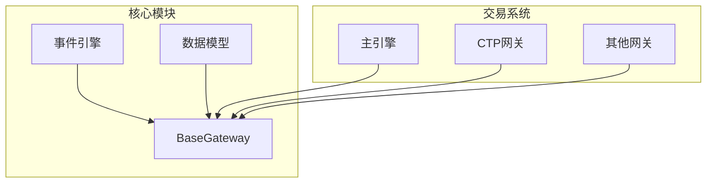
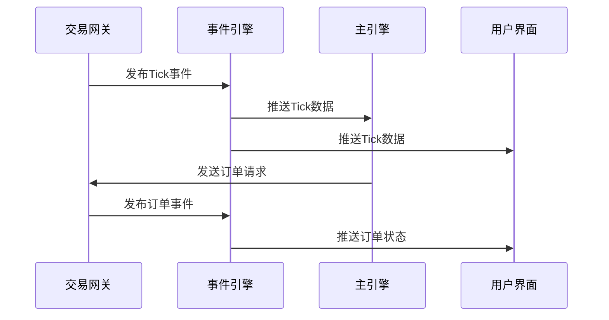
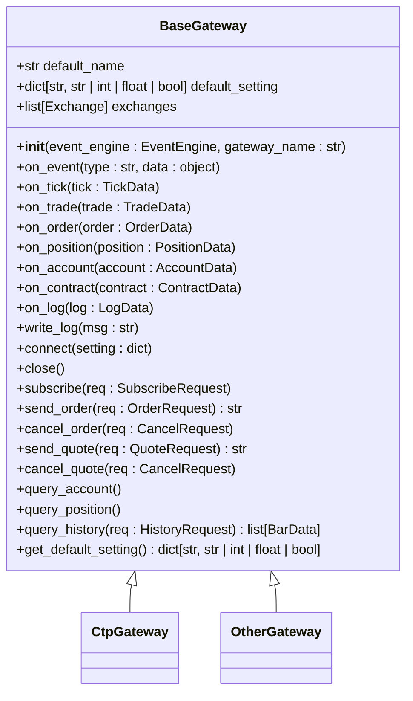
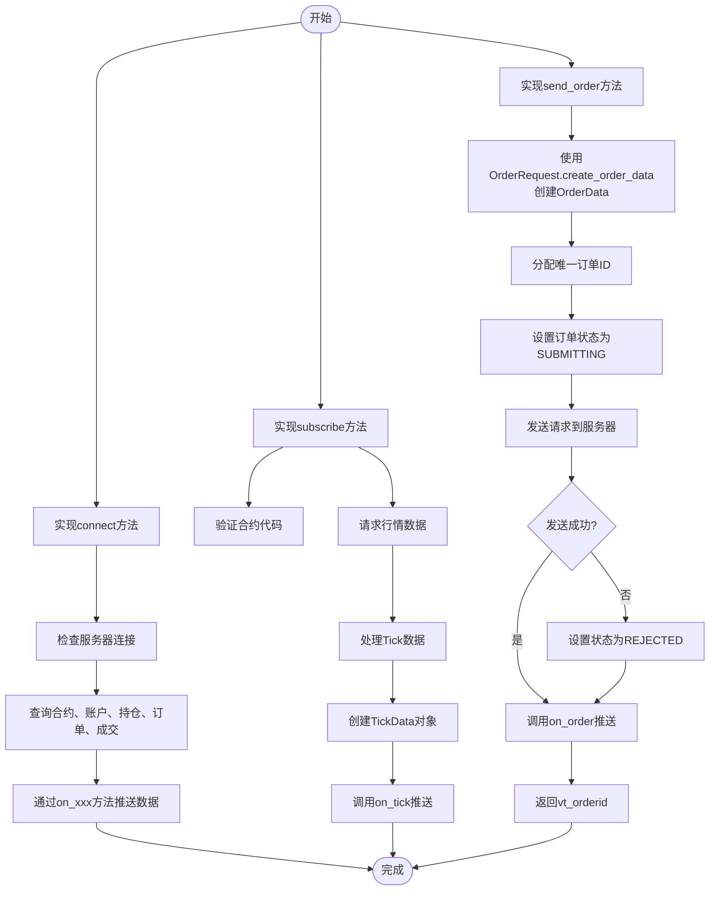
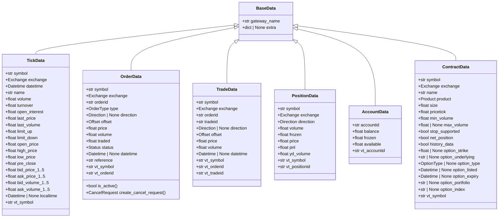
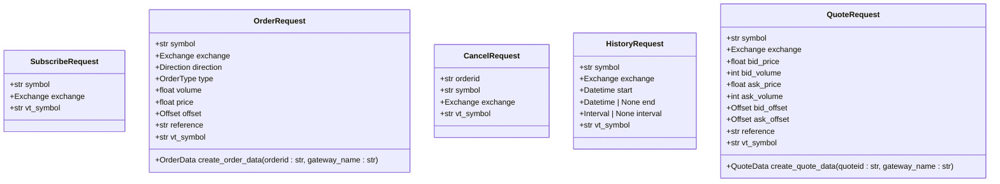
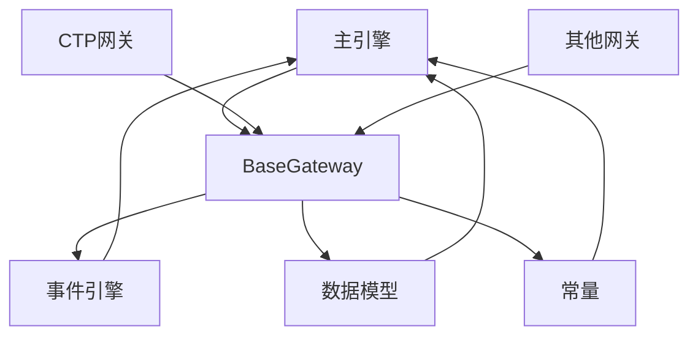
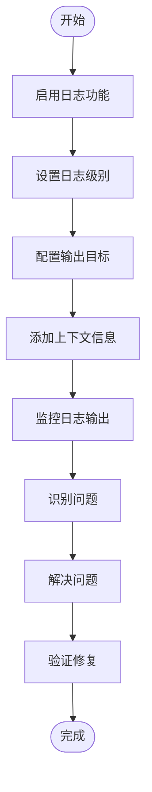

# 接口开发指南

<cite>
**本文档引用文件**  
- [gateway.py](file://vnpy/trader/gateway.py)
- [object.py](file://vnpy/trader/object.py)
- [constant.py](file://vnpy/trader/constant.py)
- [engine.py](file://vnpy/trader/engine.py)
- [event.py](file://vnpy/event/engine.py)
- [logger.py](file://vnpy/trader/logger.py)
</cite>

## 目录
1. [引言](#引言)
2. [项目结构](#项目结构)
3. [核心组件](#核心组件)
4. [架构概述](#架构概述)
5. [详细组件分析](#详细组件分析)
6. [依赖分析](#依赖分析)
7. [性能考虑](#性能考虑)
8. [故障排除指南](#故障排除指南)
9. [结论](#结论)

## 引言
本文档旨在为开发者提供完整的自定义交易接口开发指南，基于BaseGateway抽象类详细说明扩展新Gateway的技术路径。涵盖连接管理、行情订阅、订单发送、撤单处理、账户查询等核心方法的实现规范。重点解释线程安全要求、非阻塞设计原则、自动重连机制等关键质量属性的实现方式。通过代码示例展示如何解析原始报文并转换为vnpy标准数据模型（TickData、OrderData等）。提供调试工具使用方法、日志分析技巧和性能测试方案，帮助开发者高效完成新接口集成。

## 项目结构
vnpy项目采用模块化设计，主要包含事件驱动引擎、交易核心模块和各类应用组件。交易网关模块位于vnpy/trader/目录下，通过事件引擎与其他模块进行通信。网关模块主要包括gateway.py定义的抽象基类和具体实现，object.py定义的数据模型，以及constant.py定义的常量枚举。

**图表来源**  
- [gateway.py](file://vnpy/trader/gateway.py#L33-L273)
- [event.py](file://vnpy/event/engine.py#L33-L146)

**章节来源**  
- [gateway.py](file://vnpy/trader/gateway.py#L1-L273)
- [object.py](file://vnpy/trader/object.py#L1-L428)

## 核心组件
自定义交易接口开发的核心是继承BaseGateway抽象类并实现其抽象方法。BaseGateway定义了连接管理、行情订阅、订单发送、撤单处理、账户查询等核心方法的接口规范。开发者需要实现这些方法来与具体的交易系统进行通信。

**章节来源**  
- [gateway.py](file://vnpy/trader/gateway.py#L33-L273)
- [object.py](file://vnpy/trader/object.py#L1-L428)

## 架构概述
vnpy采用事件驱动架构，通过事件引擎实现模块间的松耦合通信。交易网关作为事件的生产者，将市场行情、订单状态、成交信息等数据封装为事件并发布到事件引擎。其他模块作为事件的消费者，订阅感兴趣的事件类型并进行相应的处理。

**图表来源**  
- [gateway.py](file://vnpy/trader/gateway.py#L86-L159)
- [event.py](file://vnpy/event/engine.py#L105-L109)

## 详细组件分析

### BaseGateway分析
BaseGateway是所有交易网关的抽象基类，定义了统一的接口规范。开发者需要继承该类并实现其抽象方法。

#### 类图

**图表来源**  
- [gateway.py](file://vnpy/trader/gateway.py#L33-L273)

#### 核心方法实现规范

**图表来源**  
- [gateway.py](file://vnpy/trader/gateway.py#L161-L212)
- [object.py](file://vnpy/trader/object.py#L339-L355)

**章节来源**  
- [gateway.py](file://vnpy/trader/gateway.py#L160-L273)

### 数据模型分析
vnpy定义了一套标准的数据模型，用于在系统内部传递交易相关数据。这些数据模型采用dataclass实现，确保了数据的不可变性和线程安全性。

#### 数据模型类图

**图表来源**  
- [object.py](file://vnpy/trader/object.py#L17-L304)

#### 请求模型分析

**图表来源**  
- [object.py](file://vnpy/trader/object.py#L306-L427)

**章节来源**  
- [object.py](file://vnpy/trader/object.py#L1-L428)

## 依赖分析
交易网关模块依赖于事件引擎进行事件通信，依赖于数据模型进行数据传递。主引擎通过动态加载机制加载具体的网关实现，并通过统一的接口与网关进行交互。

**图表来源**  
- [gateway.py](file://vnpy/trader/gateway.py#L3-L30)
- [engine.py](file://vnpy/trader/engine.py#L157-L275)

**章节来源**  
- [gateway.py](file://vnpy/trader/gateway.py#L1-L273)
- [engine.py](file://vnpy/trader/engine.py#L157-L275)

## 性能考虑
在实现交易网关时，需要考虑以下性能因素：
- 所有方法必须是非阻塞的，避免影响事件处理的实时性
- 采用线程安全的设计，确保多线程环境下的数据一致性
- 实现自动重连机制，保证连接的可靠性
- 合理使用事件推送，避免不必要的事件广播
- 优化数据解析和序列化过程，减少CPU开销

## 故障排除指南
在开发和调试交易网关时，可以使用以下工具和方法：

### 日志分析

**图表来源**  
- [logger.py](file://vnpy/trader/logger.py#L1-L56)

### 调试工具使用
- 使用VeighNa Trader的图形界面进行连接和测试
- 查看.vntrader目录下的JSON配置文件
- 监控日志文件中的错误信息
- 使用查询合约功能验证合约数据获取
- 通过手动下单测试订单流程

**章节来源**  
- [gateway.py](file://vnpy/trader/gateway.py#L153-L158)
- [logger.py](file://vnpy/trader/logger.py#L1-L56)

## 结论
本文档详细介绍了基于BaseGateway抽象类开发自定义交易接口的技术路径。通过继承BaseGateway并实现其抽象方法，开发者可以轻松集成新的交易系统。关键要点包括：
- 严格遵守线程安全和非阻塞设计原则
- 正确实现事件推送机制
- 使用标准数据模型进行数据传递
- 实现自动重连和错误处理机制
- 充分利用日志和调试工具进行问题排查

遵循本文档的指导，开发者可以高效地完成新交易接口的集成工作。