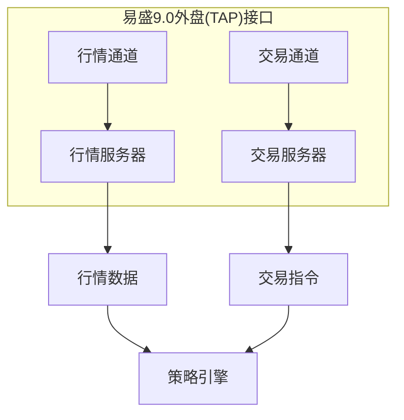

# 易盛9.0外盘(TAP)接口

<cite>
**本文档引用的文件**
- [gateway.md](file://docs/community/info/gateway.md#L600-L625)
- [introduction.md](file://docs/community/info/introduction.md#L74)
- [README.md](file://README.md#L123)
- [run.py](file://examples/veighna_trader/run.py#L16)
</cite>

## 目录
1. [简介](#简介)
2. [项目结构](#项目结构)
3. [核心组件](#核心组件)
4. [架构概述](#架构概述)
5. [详细组件分析](#详细组件分析)
6. [依赖分析](#依赖分析)
7. [性能考虑](#性能考虑)
8. [故障排除指南](#故障排除指南)
9. [结论](#结论)
10. [附录](#附录)（如有必要）

## 简介
易盛9.0外盘(TAP)接口是vn.py平台中用于连接海外期货市场的交易接口。该接口专为外盘期货交易设计，支持Windows操作系统，采用行情与交易分离的双通道架构，确保交易的稳定性和可靠性。接口仅支持单向持仓模式，适用于CTA策略等量化交易场景。

## 项目结构
易盛9.0外盘(TAP)接口作为vn.py平台的独立模块存在，其配置和使用遵循vn.py的通用规范。接口通过MainEngine进行连接和管理，与vn.py的事件驱动架构无缝集成。

**Section sources**
- [gateway.md](file://docs/community/info/gateway.md#L600-L625)
- [introduction.md](file://docs/community/info/introduction.md#L74)

## 核心组件
易盛9.0外盘(TAP)接口的核心组件包括连接管理、行情订阅和交易执行功能。通过MainEngine的connect和subscribe流程，用户可以方便地连接到外盘期货市场并执行交易指令。

**Section sources**
- [run.py](file://examples/veighna_trader/run.py#L16)
- [gateway.md](file://docs/community/info/gateway.md#L616-L625)

## 架构概述
易盛9.0外盘(TAP)接口采用双通道架构，将行情和交易功能分离。这种设计提高了系统的稳定性和安全性，确保在高并发交易环境下仍能保持良好的性能。



**Diagram sources**
- [gateway.md](file://docs/community/info/gateway.md#L618-L624)

## 详细组件分析

### 连接配置分析
易盛9.0外盘(TAP)接口的连接配置包括独立的行情和交易参数。用户需要分别配置行情账号/密码/服务器和交易账号/密码/服务器，以实现双通道连接。

**Section sources**
- [gateway.md](file://docs/community/info/gateway.md#L618-L624)

### 单向持仓模式分析
易盛9.0外盘(TAP)接口仅支持单向持仓模式。这种设计简化了持仓管理，特别适合CTA策略等趋势跟踪型交易策略。在适配处理时，需要考虑如何在单向持仓限制下实现复杂的交易逻辑。

**Section sources**
- [gateway.md](file://docs/community/info/gateway.md#L611)

### 数据集成方案分析
由于易盛9.0外盘(TAP)接口不提供历史数据支持，需要采用外部数据集成方案。这通常涉及从第三方数据服务获取历史数据，并将其与实时行情数据结合使用。

**Section sources**
- [gateway.md](file://docs/community/info/gateway.md#L614)
- [datafeed.md](file://docs/community/info/datafeed.md)

### 连接稳定性优化分析
在Windows平台下，易盛9.0外盘(TAP)接口的连接稳定性可以通过多种措施进行优化。这些措施包括合理的重连机制、网络参数调优和系统资源管理。

**Section sources**
- [gateway.md](file://docs/community/info/gateway.md#L605)

### 授权码机制分析
易盛9.0外盘(TAP)接口采用授权码机制进行安全配置。用户需要正确配置授权码以确保接口的正常使用，同时保护账户安全。

**Section sources**
- [gateway.md](file://docs/community/info/gateway.md#L625)

## 依赖分析
易盛9.0外盘(TAP)接口依赖于vn.py的核心组件，包括事件引擎、主引擎和网关基类。这些依赖关系确保了接口与vn.py平台的无缝集成。

```mermaid
graph TD
A[易盛9.0外盘(TAP)接口] --> B[MainEngine]
A --> C[EventEngine]
A --> D[BaseGateway]
B --> E[vn.py核心]
C --> E
D --> E
```

**Diagram sources**
- [run.py](file://examples/veighna_trader/run.py#L16)
- [gateway.py](file://vnpy/trader/gateway.py)

## 性能考虑
易盛9.0外盘(TAP)接口的性能主要受网络延迟和系统资源影响。在实际使用中，建议优化网络连接，合理分配系统资源，以确保交易指令的及时执行。

## 故障排除指南
当遇到连接问题时，首先检查网络连接和服务器地址配置。对于交易失败的情况，需要检查授权码和账户权限设置。在Windows平台下，还应注意防火墙和安全软件可能对连接造成的影响。

**Section sources**
- [gateway.md](file://docs/community/info/gateway.md)
- [windows_install.md](file://docs/community/install/windows_install.md)

## 结论
易盛9.0外盘(TAP)接口为vn.py用户提供了一个稳定可靠的海外期货交易通道。通过双通道架构、单向持仓模式和外部数据集成方案，该接口能够满足大多数量化交易需求。在Windows平台下的优化措施和安全配置要求，进一步提升了接口的实用性和安全性。

## 附录
### 配置参数说明
- **行情账号**：用于连接行情服务器的用户名
- **行情密码**：用于连接行情服务器的密码
- **行情服务器**：行情数据服务器地址
- **行情端口**：行情数据服务器端口（默认为0）
- **交易账号**：用于连接交易服务器的用户名
- **交易密码**：用于连接交易服务器的密码
- **交易服务器**：交易指令服务器地址
- **交易端口**：交易指令服务器端口（默认为0）

**Section sources**
- [gateway.md](file://docs/community/info/gateway.md#L618-L625)