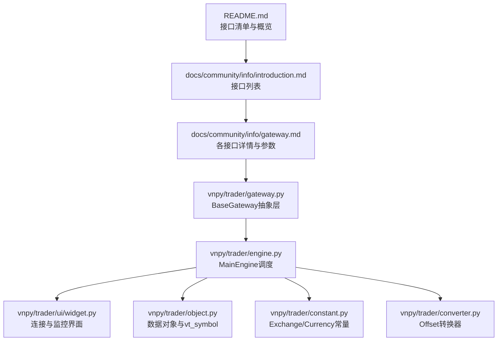
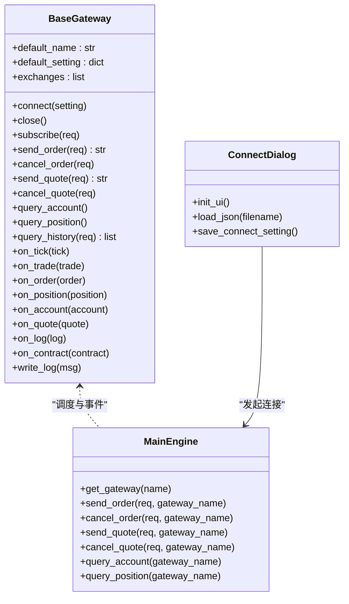
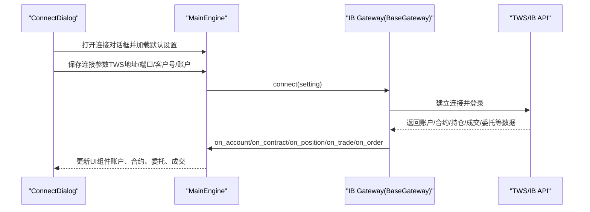
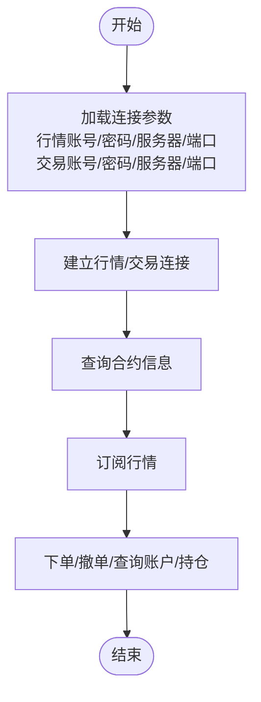
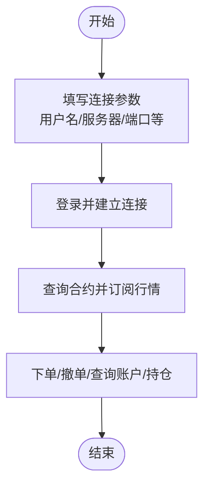
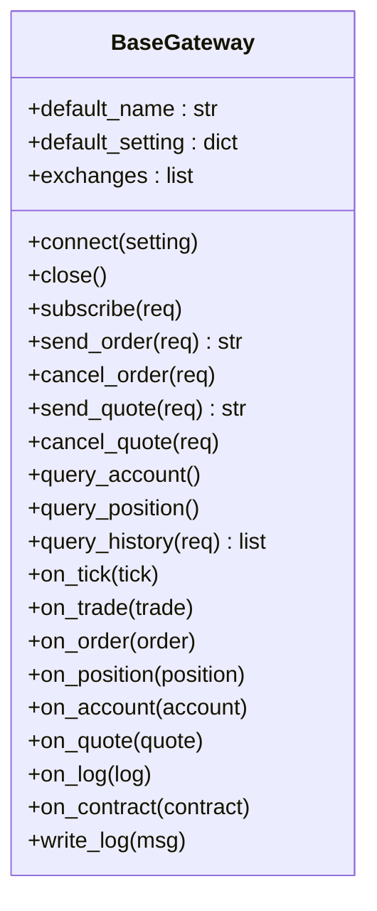
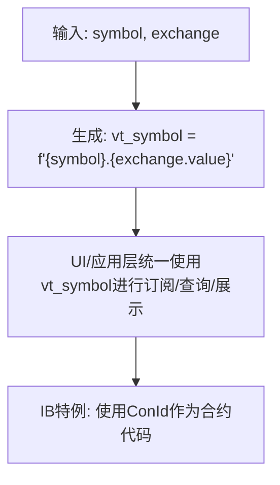
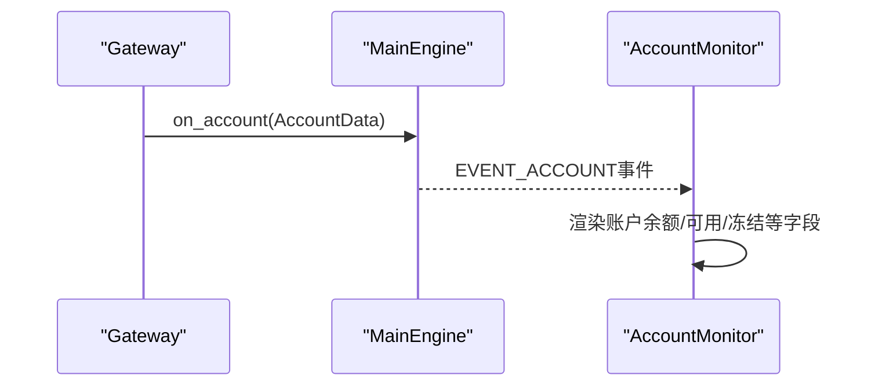
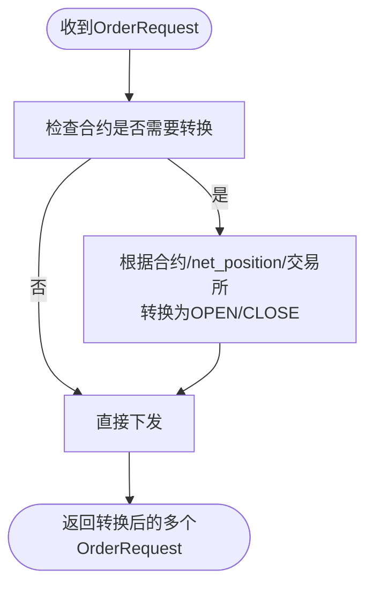
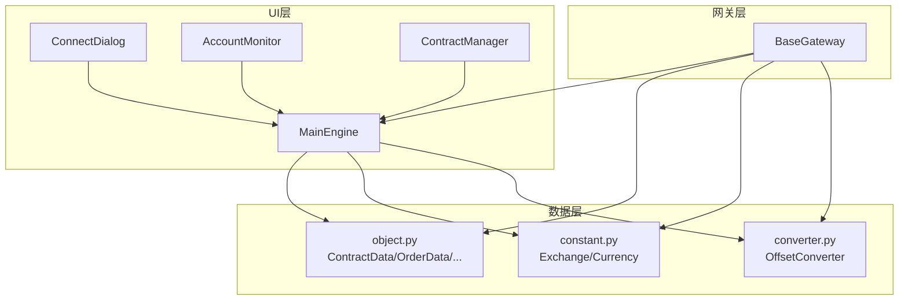

# 海外市场接口

<cite>
**本文引用的文件列表**
- [README.md](file://README.md)
- [gateway.md](file://docs/community/info/gateway.md)
- [introduction.md](file://docs/community/info/introduction.md)
- [gateway.py](file://vnpy/trader/gateway.py)
- [engine.py](file://vnpy/trader/engine.py)
- [object.py](file://vnpy/trader/object.py)
- [constant.py](file://vnpy/trader/constant.py)
- [widget.py](file://vnpy/trader/ui/widget.py)
- [converter.py](file://vnpy/trader/converter.py)
- [elite_trader.md](file://docs/elite/info/elite_trader.md)
- [web_trader.md](file://docs/community/app/web_trader.md)
</cite>

## 目录
1. [引言](#引言)
2. [项目结构](#项目结构)
3. [核心组件](#核心组件)
4. [架构总览](#架构总览)
5. [详细组件分析](#详细组件分析)
6. [依赖分析](#依赖分析)
7. [性能考量](#性能考量)
8. [故障排查指南](#故障排查指南)
9. [结论](#结论)
10. [附录](#附录)

## 引言
本文聚焦vnpy对海外市场的支持能力，系统化梳理盈透证券（Interactive Brokers，简称IB）、易盛9.0外盘（TAP）、直达期货（DA）三大国际交易平台的接入方案与实现要点。围绕交易品种覆盖（股票、期权、期货）、时区处理、合约代码体系（如IB的ConId机制）、跨时区行情同步、多币种账户管理、国际网络延迟优化等关键主题展开，并结合BaseGateway设计，展示如何统一处理国内外市场差异，帮助读者在实际工程中高效落地海外交易能力。

## 项目结构
vnpy在顶层README与社区文档中明确列出支持的接口类别，其中包含海外市场的IB、TAP、DA三类接口。这些接口通过统一的交易接口层（gateway）接入，由事件驱动引擎分发到UI与应用模块，形成完整的交易闭环。

图表来源
- [README.md](file://README.md#L77-L134)
- [introduction.md](file://docs/community/info/introduction.md#L26-L85)
- [gateway.md](file://docs/community/info/gateway.md#L51-L76)
- [gateway.py](file://vnpy/trader/gateway.py#L33-L160)
- [engine.py](file://vnpy/trader/engine.py#L241-L275)
- [object.py](file://vnpy/trader/object.py#L224-L273)
- [constant.py](file://vnpy/trader/constant.py#L103-L160)
- [converter.py](file://vnpy/trader/converter.py#L310-L402)

章节来源
- [README.md](file://README.md#L77-L134)
- [introduction.md](file://docs/community/info/introduction.md#L26-L85)
- [gateway.md](file://docs/community/info/gateway.md#L51-L76)

## 核心组件
- BaseGateway：定义统一的连接、订阅、下单、撤单、查询账户/持仓/历史等接口规范，确保不同海外接口在vnpy生态中具备一致的行为契约。
- MainEngine：负责网关注册、事件派发、订单/报价路由、账户/持仓/日志管理。
- 数据对象与vt_symbol：统一符号命名（vt_symbol），屏蔽不同市场的合约代码差异。
- Exchange/Currency常量：集中管理交易所与货币枚举，便于跨市场统一处理。
- OffsetConverter：针对不同市场的“净仓/锁仓/今昨”等差异进行订单偏移转换。

章节来源
- [gateway.py](file://vnpy/trader/gateway.py#L33-L160)
- [engine.py](file://vnpy/trader/engine.py#L241-L275)
- [object.py](file://vnpy/trader/object.py#L224-L273)
- [constant.py](file://vnpy/trader/constant.py#L103-L160)
- [converter.py](file://vnpy/trader/converter.py#L310-L402)

## 架构总览
海外接口通过BaseGateway抽象层统一接入，MainEngine负责事件与数据流转，UI层提供连接与监控。IB/TAP/DA各自实现具体的连接、订阅、下单、查询等方法，最终以统一的数据对象进入事件系统。

图表来源
- [gateway.py](file://vnpy/trader/gateway.py#L33-L160)
- [engine.py](file://vnpy/trader/engine.py#L241-L275)
- [widget.py](file://vnpy/trader/ui/widget.py#L599-L627)

## 详细组件分析

### IB（盈透证券）接入方案
- 交易品种覆盖：海外多品种（股票、期权、期货、贵金属等），历史数据提供。
- 认证与安全：通过TWS端口（默认地址与端口见接口文档）进行API接入，需在IB开户并入金后申请API权限。
- 合约代码体系：使用ConId作为合约唯一标识，而非Symbol/LocalName；订阅/查询需以ConId为准。
- 时区与行情：IB支持全球多市场，行情推送与时间戳需结合交易所时区处理；建议在UI层或应用层做时区归一化。
- 多币种账户：账户资产与可用资金以账户币种呈现，需在UI与报表中进行币种转换与汇总。

图表来源
- [gateway.md](file://docs/community/info/gateway.md#L565-L599)
- [gateway.py](file://vnpy/trader/gateway.py#L160-L273)
- [engine.py](file://vnpy/trader/engine.py#L241-L275)
- [widget.py](file://vnpy/trader/ui/widget.py#L599-L627)

章节来源
- [gateway.md](file://docs/community/info/gateway.md#L565-L599)
- [README.md](file://README.md#L119-L125)
- [elite_trader.md](file://docs/elite/info/elite_trader.md#L82-L99)

### TAP（易盛9.0外盘）接入方案
- 交易品种覆盖：外盘期货。
- 认证与安全：提供行情/交易账号、密码、服务器与端口等参数，注意区分行情与交易通道。
- 合约代码体系：遵循易盛外盘的合约命名与映射规则，订阅与查询需使用接口约定的代码体系。
- 历史数据：接口文档标注不提供历史数据，回测与研究需另行渠道。

图表来源
- [gateway.md](file://docs/community/info/gateway.md#L600-L631)
- [gateway.py](file://vnpy/trader/gateway.py#L160-L273)

章节来源
- [gateway.md](file://docs/community/info/gateway.md#L600-L631)
- [README.md](file://README.md#L123-L124)

### DA（直达期货）接入方案
- 交易品种覆盖：外盘期货。
- 认证与安全：提供用户名等参数，注意与IB/TAP的参数项差异。
- 合约代码体系：遵循直达期货的合约命名与映射规则，订阅与查询需使用接口约定的代码体系。
- 历史数据：接口文档标注不提供历史数据。

图表来源
- [gateway.md](file://docs/community/info/gateway.md#L632-L647)
- [gateway.py](file://vnpy/trader/gateway.py#L160-L273)

章节来源
- [gateway.md](file://docs/community/info/gateway.md#L632-L647)
- [README.md](file://README.md#L125-L126)

### BaseGateway设计与海外差异统一
- 抽象契约：BaseGateway定义了connect/close/subscribe/send_order/cancel_order/send_quote/cancel_quote/query_account/query_position/query_history等方法，确保IB/TAP/DA在vnpy中具备一致的调用方式。
- 事件驱动：on_tick/on_trade/on_order/on_position/on_account/on_quote/on_log/on_contract统一通过事件引擎派发，UI与应用模块无需关心底层差异。
- 默认设置：default_setting与default_name为各网关提供标准化的连接参数模板，便于UI对话框自动生成表单。
- 历史查询：query_history返回空列表作为默认实现，具体网关可按需覆盖（如IB提供历史数据）。

图表来源
- [gateway.py](file://vnpy/trader/gateway.py#L33-L160)

章节来源
- [gateway.py](file://vnpy/trader/gateway.py#L33-L160)

### vt_symbol与合约代码体系
- vt_symbol统一格式：vt_symbol = "{symbol}.{exchange.value}"，屏蔽不同市场的Symbol差异，便于UI与应用层统一处理。
- IB的ConId：接口文档强调使用ConId作为合约代码，避免与Symbol/LocalName混淆；UI侧订阅与查询需以ConId为准。
- 交易所枚举：constant.py中集中定义Exchange枚举（如SMART、NYSE、NASDAQ、CME、ICE、SEHK、HKFE、SGX、LME等），便于跨市场统一识别。

图表来源
- [object.py](file://vnpy/trader/object.py#L224-L273)
- [constant.py](file://vnpy/trader/constant.py#L103-L160)
- [gateway.md](file://docs/community/info/gateway.md#L595-L599)

章节来源
- [object.py](file://vnpy/trader/object.py#L224-L273)
- [constant.py](file://vnpy/trader/constant.py#L103-L160)
- [gateway.md](file://docs/community/info/gateway.md#L595-L599)

### 多币种账户管理
- 货币枚举：constant.py提供USD、HKD、CNY、CAD等常用货币，便于UI与报表层进行币种识别与换算。
- 账户数据：on_account回调传递AccountData，包含账户ID、余额、可用资金等字段；UI通过AccountMonitor展示。
- 跨币种汇总：建议在应用层或报表层对不同币种进行汇率换算，统一口径展示。

图表来源
- [gateway.py](file://vnpy/trader/gateway.py#L125-L132)
- [widget.py](file://vnpy/trader/ui/widget.py#L538-L563)
- [constant.py](file://vnpy/trader/constant.py#L142-L150)

章节来源
- [gateway.py](file://vnpy/trader/gateway.py#L125-L132)
- [widget.py](file://vnpy/trader/ui/widget.py#L538-L563)
- [constant.py](file://vnpy/trader/constant.py#L142-L150)

### 订单偏移转换（OffsetConverter）
- 针对不同市场的“净仓/锁仓/今昨”等差异，OffsetConverter根据合约属性与交易所规则进行订单偏移转换，保证下单意图与实际成交匹配。
- 对于IB/TAP/DA等海外接口，若未提供“锁仓/今昨”概念，通常按净仓或默认规则处理。

图表来源
- [converter.py](file://vnpy/trader/converter.py#L310-L402)

章节来源
- [converter.py](file://vnpy/trader/converter.py#L310-L402)

## 依赖分析
- 接口清单与支持范围：README与community文档明确列出IB、TAP、DA为海外市场接口。
- UI连接与监控：ConnectDialog根据网关名称加载默认连接参数，MainEngine负责连接与事件派发；AccountMonitor/ContractManager等UI组件展示账户与合约信息。
- 事件与数据：BaseGateway通过on_*回调将Tick/Trade/Order/Position/Account/Quote/Log/Contract事件推送到事件引擎，MainEngine统一调度。

图表来源
- [README.md](file://README.md#L77-L134)
- [gateway.md](file://docs/community/info/gateway.md#L51-L76)
- [widget.py](file://vnpy/trader/ui/widget.py#L599-L627)
- [engine.py](file://vnpy/trader/engine.py#L241-L275)
- [object.py](file://vnpy/trader/object.py#L224-L273)
- [constant.py](file://vnpy/trader/constant.py#L103-L160)
- [converter.py](file://vnpy/trader/converter.py#L310-L402)

章节来源
- [README.md](file://README.md#L77-L134)
- [gateway.md](file://docs/community/info/gateway.md#L51-L76)
- [widget.py](file://vnpy/trader/ui/widget.py#L599-L627)
- [engine.py](file://vnpy/trader/engine.py#L241-L275)

## 性能考量
- 连接与重连：BaseGateway要求连接丢失后自动重连，建议在海外接口实现中加入指数退避与熔断策略，避免频繁重试导致网络压力。
- 订阅与推送：按需订阅，避免全量订阅造成带宽与CPU压力；对高频Tick进行节流与合并。
- 历史数据：IB提供历史数据，建议分批拉取并缓存；TAP/DA不提供历史数据时，需通过外部数据源补充。
- 时区与延迟：在UI与应用层进行时区归一化与延迟补偿，尽量减少跨时区带来的数据错位与显示异常。

## 故障排查指南
- 连接失败
  - 检查TWS端口与地址（IB）、服务器与端口（TAP/DA）是否正确。
  - 确认账户权限与入金状态（IB需API权限）。
  - 查看日志组件（on_log）输出，定位错误原因。
- 合约信息缺失（IB）
  - IB登录时无法自动获取全部合约，需手动订阅行情后才可查询到合约信息。
- 订单/报价异常
  - 确认vt_symbol与交易所是否匹配（vt_symbol = "{symbol}.{exchange.value}"）。
  - 检查OffsetConverter是否正确转换偏移（净仓/锁仓/今昨）。
- 账户/持仓不一致
  - 核对账户币种与汇率换算逻辑，确保报表口径一致。
  - 关注on_account/on_position回调是否正常触发。

章节来源
- [gateway.md](file://docs/community/info/gateway.md#L565-L599)
- [elite_trader.md](file://docs/elite/info/elite_trader.md#L82-L99)
- [gateway.py](file://vnpy/trader/gateway.py#L125-L132)
- [converter.py](file://vnpy/trader/converter.py#L310-L402)

## 结论
vnpy通过BaseGateway抽象层与事件驱动架构，为IB、TAP、DA等海外接口提供了统一接入路径。结合vt_symbol、Exchange/Currency枚举与OffsetConverter，能够有效屏蔽不同市场的合约代码与结算规则差异。在实际部署中，应重点关注IB的ConId机制、TWS端口安全配置、TAP/DA的参数差异与历史数据缺失问题，并在UI与应用层做好时区归一化与多币种换算，从而实现稳定高效的海外交易能力。

## 附录
- 接口文档与参数参考
  - [README.md](file://README.md#L77-L134)
  - [gateway.md](file://docs/community/info/gateway.md#L565-L647)
- UI与监控
  - [widget.py](file://vnpy/trader/ui/widget.py#L538-L563)
  - [widget.py](file://vnpy/trader/ui/widget.py#L599-L627)
  - [elite_trader.md](file://docs/elite/info/elite_trader.md#L82-L99)
- Web服务与令牌
  - [web_trader.md](file://docs/community/app/web_trader.md#L71-L103)