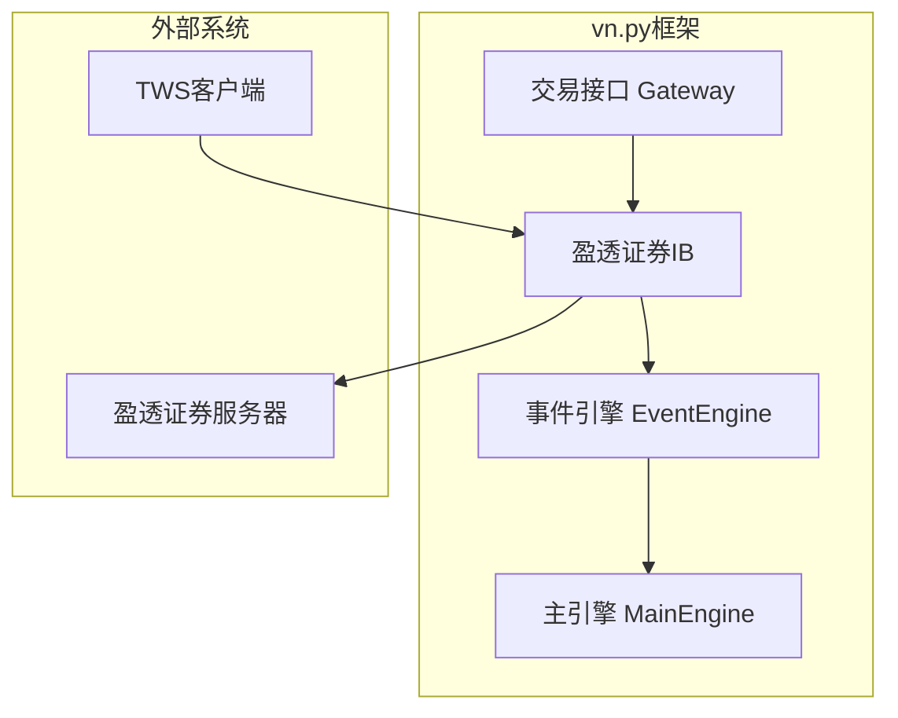
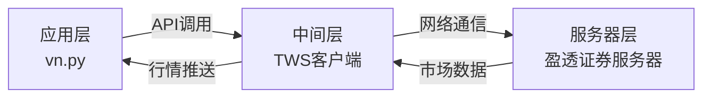
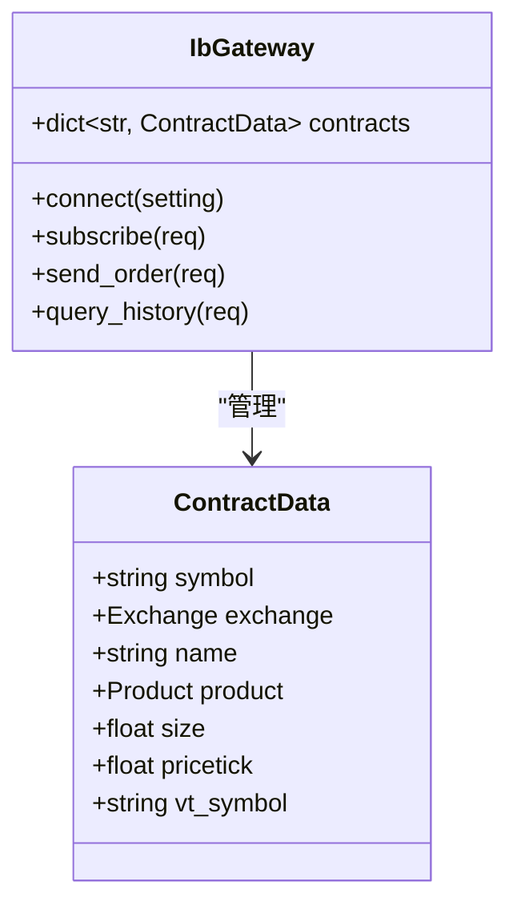
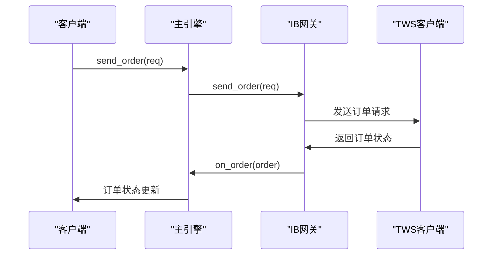
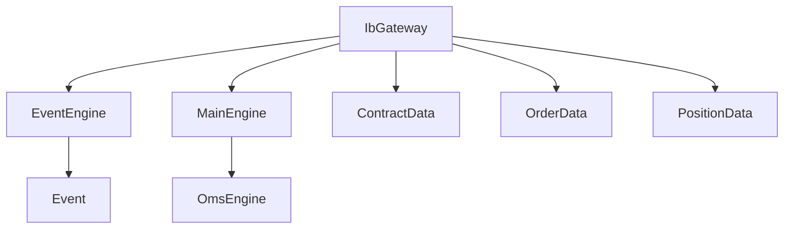

# 盈透证券(IB)接口

<cite>
**本文档引用文件**   
- [gateway.md](file://docs/community/info/gateway.md)
- [introduction.md](file://docs/community/info/introduction.md)
- [cta_backtester.md](file://docs/community/app/cta_backtester.md)
- [data_manager.md](file://docs/community/app/data_manager.md)
- [elite_trader.md](file://docs/elite/info/elite_trader.md)
- [gateway.py](file://vnpy/trader/gateway.py)
- [object.py](file://vnpy/trader/object.py)
- [engine.py](file://vnpy/trader/engine.py)
- [converter.py](file://vnpy/trader/converter.py)
- [CHANGELOG.md](file://CHANGELOG.md)
</cite>

## 目录
1. [引言](#引言)
2. [项目结构](#项目结构)
3. [核心组件](#核心组件)
4. [架构概述](#架构概述)
5. [详细组件分析](#详细组件分析)
6. [依赖分析](#依赖分析)
7. [性能考虑](#性能考虑)
8. [故障排除指南](#故障排除指南)
9. [结论](#结论)

## 引言
盈透证券（Interactive Brokers，简称IB）接口是vn.py框架中用于连接海外多品种交易市场的重要组件。该接口支持股票、期权、期货等多种金融产品的交易，通过TWS（Trader Workstation）平台与盈透证券的服务器进行通信。本文档旨在全面文档化IB接口的集成方案，重点说明其跨市场多品种交易支持的实现机制，包括连接架构、合约标识体系、资金管理、历史数据查询等功能，并提供安全设置和网络优化的最佳实践。

## 项目结构
盈透证券接口作为vn.py框架的一部分，遵循模块化设计原则。其核心功能分布在多个文件中，主要包括网关实现、数据对象定义、事件处理引擎等。IB接口从主项目中剥离为独立的vnpy_ib项目，以保持代码的清晰性和可维护性。项目结构体现了分层架构的特点，各组件职责明确，便于扩展和维护。

**图表来源**
- [gateway.md](file://docs/community/info/gateway.md#L565-L599)
- [gateway.py](file://vnpy/trader/gateway.py#L33-L273)

**本节来源**
- [gateway.md](file://docs/community/info/gateway.md#L565-L599)
- [introduction.md](file://docs/community/info/introduction.md#L72-L73)

## 核心组件
盈透证券接口的核心组件包括连接管理、合约信息处理、订单执行、资金与持仓查询、历史数据获取等。这些组件通过事件驱动架构协同工作，确保交易流程的高效和稳定。接口实现了BaseGateway抽象类，提供了标准化的连接、订阅、下单、撤单、查询等功能，同时针对IB特有的ConId合约标识体系进行了适配。

**本节来源**
- [gateway.py](file://vnpy/trader/gateway.py#L161-L273)
- [object.py](file://vnpy/trader/object.py#L232-L262)

## 架构概述
盈透证券接口采用基于TWS的连接架构，通过TWS客户端作为中介与盈透证券的服务器进行通信。客户端通过7497端口（或4001端口）与TWS建立连接，发送和接收交易指令及市场数据。整个架构分为三层：应用层（vn.py）、中间层（TWS客户端）和服务器层（盈透证券服务器）。这种架构确保了交易的安全性和稳定性，同时也便于调试和监控。

**图表来源**
- [gateway.md](file://docs/community/info/gateway.md#L585-L588)
- [CHANGELOG.md](file://CHANGELOG.md#L26)

**本节来源**
- [gateway.md](file://docs/community/info/gateway.md#L585-L588)
- [CHANGELOG.md](file://CHANGELOG.md#L26)

## 详细组件分析

### 连接与配置分析
盈透证券接口的连接需要配置TWS地址、端口、客户号和交易账户等参数。默认情况下，TWS地址为127.0.0.1，端口为7497（实盘）或4001（模拟盘），客户号通常为1。用户需要在盈透证券开户并获得API接入权限后，才能使用该接口进行交易。连接过程中，接口会自动处理断线重连，确保连接的稳定性。

**本节来源**
- [gateway.md](file://docs/community/info/gateway.md#L585-L588)
- [CHANGELOG.md](file://CHANGELOG.md#L26)

### 合约信息与ConId映射分析
盈透证券接口使用ConId作为合约的唯一标识符，而非传统的Symbol或LocalName。ConId是盈透证券为每个合约在特定交易所分配的唯一数字ID。在vn.py内部，通过vt_symbol（格式为"symbol.exchange"）来标识合约。接口在查询合约信息时，会将ConId与vt_symbol进行映射，以便在后续的订阅、下单等操作中使用。由于IB接口在登录时无法自动获取所有合约信息，用户需要手动订阅行情才能获取合约详情。

**图表来源**
- [object.py](file://vnpy/trader/object.py#L232-L262)
- [gateway.py](file://vnpy/trader/gateway.py#L189-L212)

**本节来源**
- [gateway.md](file://docs/community/info/gateway.md#L598-L599)
- [elite_trader.md](file://docs/elite/info/elite_trader.md#L89-L90)
- [object.py](file://vnpy/trader/object.py#L261-L262)

### 订单与资金管理分析
盈透证券接口支持单向持仓模式，即每个合约只有一个持仓方向（多头或空头），这与国内期货市场的双向持仓模式不同。接口通过OffsetConverter组件处理不同市场的持仓模式差异。资金管理方面，接口支持多币种账户，能够正确处理不同货币的资金和盈亏计算。订单执行遵循vn.py的标准化流程，通过send_order和cancel_order方法实现下单和撤单，并通过事件回调通知订单状态变化。

**图表来源**
- [gateway.py](file://vnpy/trader/gateway.py#L197-L212)
- [engine.py](file://vnpy/trader/engine.py#L241-L243)
- [converter.py](file://vnpy/trader/converter.py#L54-L62)

**本节来源**
- [gateway.md](file://docs/community/info/gateway.md#L578-L579)
- [gateway.py](file://vnpy/trader/gateway.py#L197-L212)
- [converter.py](file://vnpy/trader/converter.py#L54-L84)

### 历史数据查询分析
盈透证券接口提供丰富的历史数据查询功能，支持股票、期货、期权、现货等多种资产类别的K线和Tick数据。用户可以通过CTA回测模块或数据管理模块下载历史数据。查询前需要先启动TWS客户端并连接IB接口，同时订阅所需合约的行情。接口在查询历史数据时使用UTC时间戳，并支持较长的时间跨度，最长等待时间可达600秒。

**本节来源**
- [cta_backtester.md](file://docs/community/app/cta_backtester.md#L82-L86)
- [data_manager.md](file://docs/community/app/data_manager.md#L74-L76)
- [CHANGELOG.md](file://CHANGELOG.md#L141-L142)

## 依赖分析
盈透证券接口依赖于TWS客户端和盈透证券的API服务。在vn.py框架内部，它依赖于事件引擎（EventEngine）和主引擎（MainEngine）来处理事件和调度任务。接口通过BaseGateway抽象类与框架其他部分解耦，确保了良好的可扩展性。同时，它还依赖于数据对象（如ContractData、OrderData等）来传递信息。

**图表来源**
- [gateway.py](file://vnpy/trader/gateway.py#L33-L80)
- [engine.py](file://vnpy/trader/engine.py#L359-L423)

**本节来源**
- [gateway.py](file://vnpy/trader/gateway.py#L33-L80)
- [engine.py](file://vnpy/trader/engine.py#L359-L423)

## 性能考虑
为了优化网络延迟，建议将TWS客户端与vn.py应用部署在同一台机器上，以减少网络传输时间。同时，应确保网络连接稳定，避免因网络波动导致交易中断。在处理大量历史数据查询时，应合理设置查询时间范围，避免一次性请求过多数据导致超时。此外，TWS客户端的性能配置（如内存分配）也会影响数据处理速度。

## 故障排除指南
常见问题包括连接失败、合约信息无法获取、订单提交失败等。连接失败通常与TWS的API设置有关，需检查API访问权限是否开启，端口配置是否正确。合约信息无法获取是因为IB接口在登录时不会自动获取所有合约，需要用户手动订阅行情后才能查询。订单提交失败可能与资金不足、市场休市或参数错误有关，应检查账户状态和订单参数。

**本节来源**
- [gateway.md](file://docs/community/info/gateway.md#L592-L593)
- [elite_trader.md](file://docs/elite/info/elite_trader.md#L89-L90)
- [CHANGELOG.md](file://CHANGELOG.md#L380)

## 结论
盈透证券接口为vn.py用户提供了一个强大而灵活的海外交易接入方案。通过TWS平台，用户可以方便地进行跨市场多品种交易。接口设计充分考虑了IB API的特性，实现了ConId合约标识、单向持仓模式、多币种资金管理等关键功能。结合vn.py框架的事件驱动架构，该接口能够高效、稳定地处理交易流程，满足量化交易的需求。